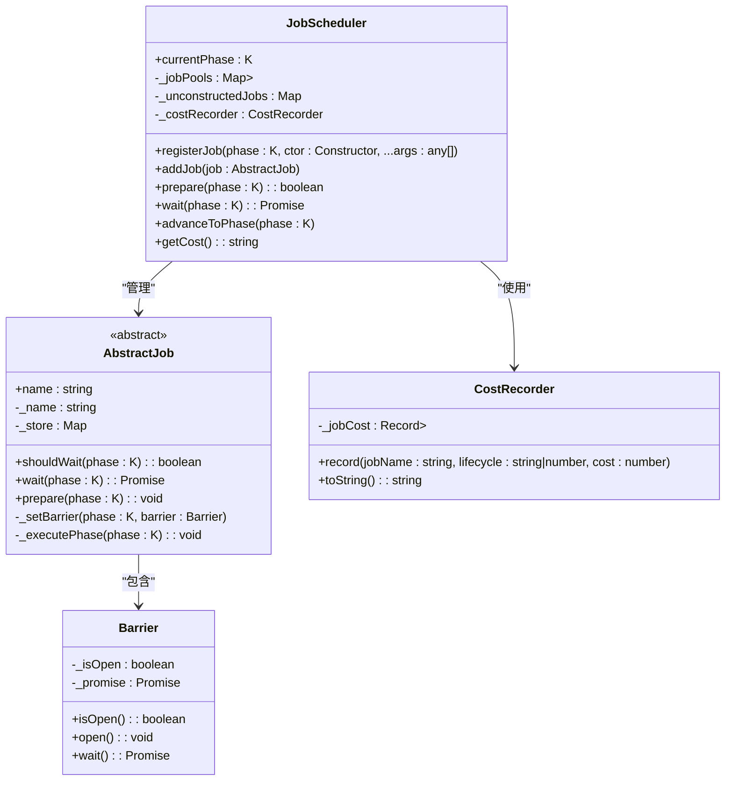
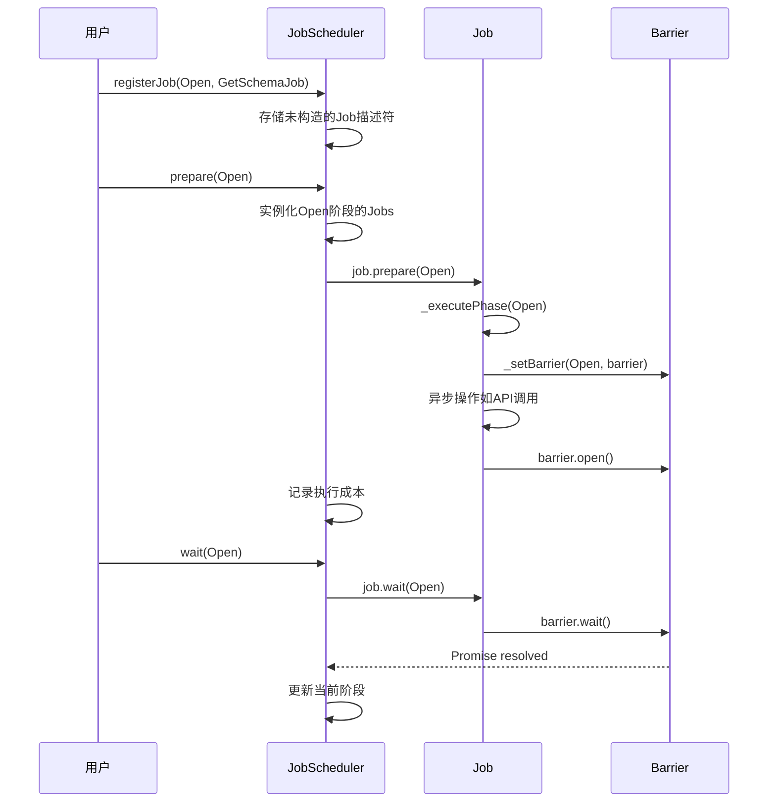
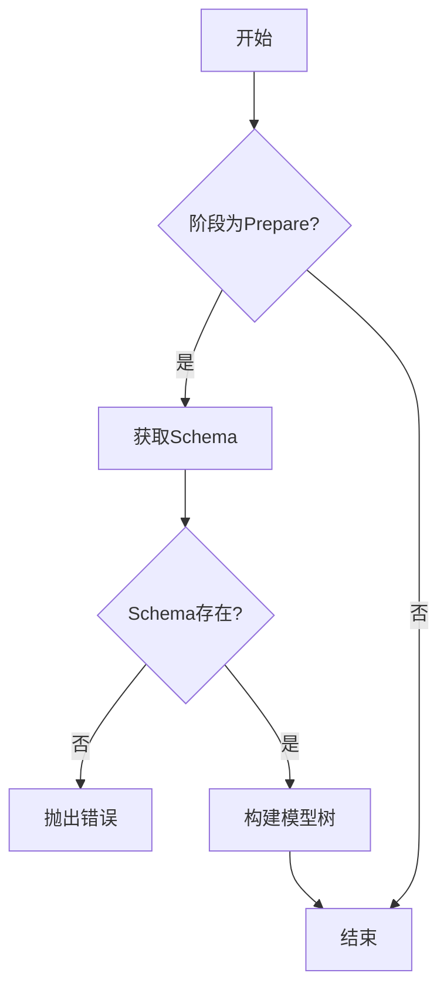
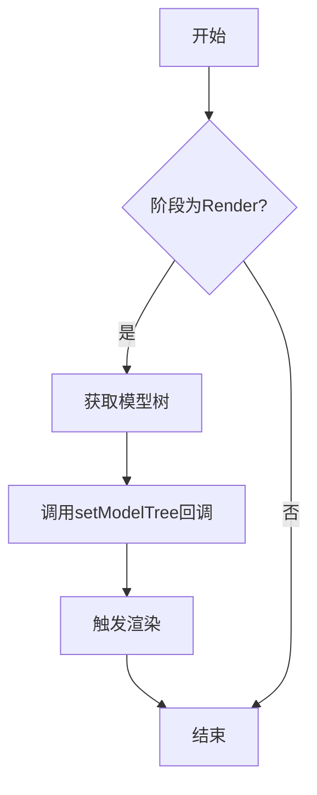
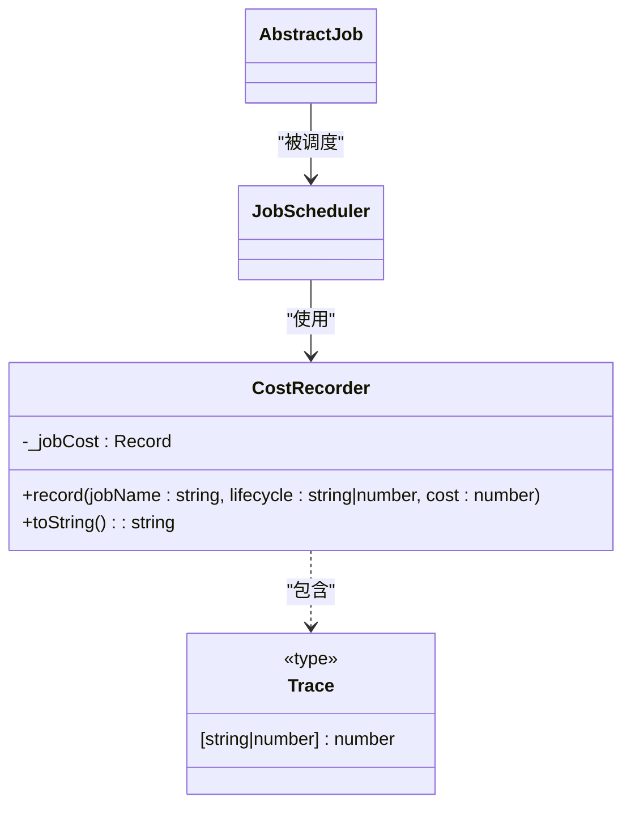
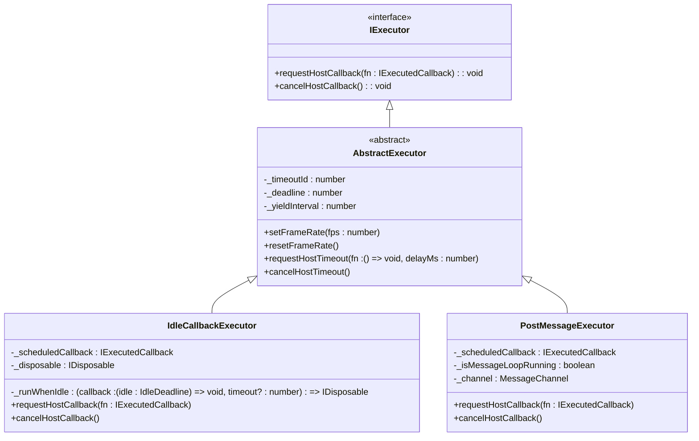
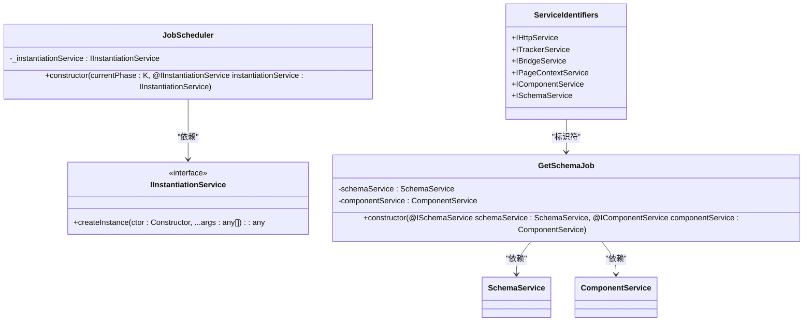
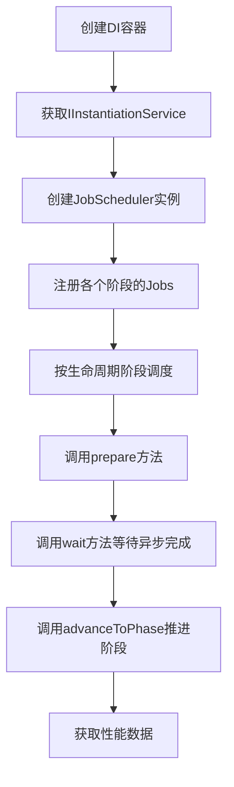

# Job调度

<cite>
**本文档中引用的文件**  
- [job-scheduler.ts](file://packages/h5-builder/src/bedrock/launch/job-scheduler.ts)
- [cost-recorder.ts](file://packages/h5-builder/src/bedrock/launch/cost-recorder.ts)
- [abstract-job.ts](file://packages/h5-builder/src/bedrock/launch/abstract-job.ts)
- [get-schema-job.ts](file://packages/h5-builder/src/jobs/get-schema-job.ts)
- [build-tree-job.ts](file://packages/h5-builder/src/jobs/build-tree-job.ts)
- [trigger-render-job.ts](file://packages/h5-builder/src/jobs/trigger-render-job.ts)
- [lifecycle.ts](file://packages/h5-builder/src/jobs/lifecycle.ts)
- [service-identifiers.ts](file://packages/h5-builder/src/services/service-identifiers.ts)
- [barrier.ts](file://packages/h5-builder/src/bedrock/async/barrier.ts)
- [idle-callback-executor.ts](file://packages/h5-builder/src/bedrock/scheduler/executor/idle-callback-executor.ts)
- [post-message-executor.ts](file://packages/h5-builder/src/bedrock/scheduler/executor/post-message-executor.ts)
- [task-queue.ts](file://packages/h5-builder/src/bedrock/scheduler/core/task-queue.ts)
</cite>

## 目录
1. [简介](#简介)
2. [核心组件](#核心组件)
3. [Job调度流程](#job调度流程)
4. [具体Job实例分析](#具体job实例分析)
5. [性能监控与成本记录](#性能监控与成本记录)
6. [执行器与异步调度机制](#执行器与异步调度机制)
7. [依赖注入集成](#依赖注入集成)
8. [使用示例](#使用示例)
9. [结论](#结论)

## 简介
本文档详细介绍了MobX项目中的Job调度机制，重点分析了JobScheduler的核心设计与实现。该系统通过基于生命周期阶段的调度模型，管理页面构建过程中的各项异步任务。调度器采用注册-准备-执行的模式，确保任务按照正确的顺序和依赖关系执行，同时提供性能监控能力。

## 核心组件

Job调度系统由多个核心组件构成，包括JobScheduler调度器、AbstractJob抽象任务、CostRecorder成本记录器以及Barrier同步机制。



**图示来源**  
- [job-scheduler.ts](file://packages/h5-builder/src/bedrock/launch/job-scheduler.ts#L16-L122)
- [abstract-job.ts](file://packages/h5-builder/src/bedrock/launch/abstract-job.ts#L3-L45)
- [cost-recorder.ts](file://packages/h5-builder/src/bedrock/launch/cost-recorder.ts#L5-L22)
- [barrier.ts](file://packages/h5-builder/src/bedrock/async/barrier.ts#L11-L41)

**本节来源**  
- [job-scheduler.ts](file://packages/h5-builder/src/bedrock/launch/job-scheduler.ts#L1-L122)
- [abstract-job.ts](file://packages/h5-builder/src/bedrock/launch/abstract-job.ts#L1-L45)
- [cost-recorder.ts](file://packages/h5-builder/src/bedrock/launch/cost-recorder.ts#L1-L22)
- [barrier.ts](file://packages/h5-builder/src/bedrock/async/barrier.ts#L1-L59)

## Job调度流程

Job调度器采用基于生命周期阶段的调度模型，通过`PageLifecycle`枚举定义了页面构建的各个阶段。调度流程主要包括任务注册、准备和执行三个阶段。



**图示来源**  
- [job-scheduler.ts](file://packages/h5-builder/src/bedrock/launch/job-scheduler.ts#L65-L120)
- [abstract-job.ts](file://packages/h5-builder/src/bedrock/launch/abstract-job.ts#L32-L34)
- [get-schema-job.ts](file://packages/h5-builder/src/jobs/get-schema-job.ts#L25-L43)

**本节来源**  
- [job-scheduler.ts](file://packages/h5-builder/src/bedrock/launch/job-scheduler.ts#L65-L120)
- [lifecycle.ts](file://packages/h5-builder/src/jobs/lifecycle.ts#L1-L17)

## 具体Job实例分析

### GetSchemaJob
GetSchemaJob负责在页面打开阶段获取远程schema数据。该任务在`Open`阶段执行，通过Barrier机制确保在schema获取完成前其他依赖任务不会继续执行。

```mermaid
flowchart TD
A[开始] --> B{阶段为Open?}
B --> |是| C[创建Barrier]
C --> D[设置Barrier]
D --> E[调用schemaService.fetchSchema()]
E --> F[注册组件加载器]
F --> G[预加载组件资源]
G --> H[打开Barrier]
H --> I[结束]
B --> |否| I
```

**图示来源**  
- [get-schema-job.ts](file://packages/h5-builder/src/jobs/get-schema-job.ts#L25-L43)
- [get-schema-job.ts](file://packages/h5-builder/src/jobs/get-schema-job.ts#L48-L65)

### BuildTreeJob
BuildTreeJob负责在`Prepare`阶段构建模型树。该任务依赖于GetSchemaJob完成后的schema数据，通过`schemaService.getSchema()`获取数据并调用`componentService.buildModelTree()`构建组件模型树。



**图示来源**  
- [build-tree-job.ts](file://packages/h5-builder/src/jobs/build-tree-job.ts#L24-L43)
- [build-tree-job.ts](file://packages/h5-builder/src/jobs/build-tree-job.ts#L46-L56)

### TriggerRenderJob
TriggerRenderJob负责在`Render`阶段触发React渲染。该任务通过构造函数注入的回调函数来触发外部的`setModelTree`，实现渲染触发。



**图示来源**  
- [trigger-render-job.ts](file://packages/h5-builder/src/jobs/trigger-render-job.ts#L25-L32)
- [trigger-render-job.ts](file://packages/h5-builder/src/jobs/trigger-render-job.ts#L35-L42)

**本节来源**  
- [get-schema-job.ts](file://packages/h5-builder/src/jobs/get-schema-job.ts#L13-L118)
- [build-tree-job.ts](file://packages/h5-builder/src/jobs/build-tree-job.ts#L12-L58)
- [trigger-render-job.ts](file://packages/h5-builder/src/jobs/trigger-render-job.ts#L14-L43)

## 性能监控与成本记录

JobScheduler集成了CostRecorder组件，用于记录每个Job在各个生命周期阶段的执行耗时。这对于性能分析和优化至关重要。



CostRecorder通过`record`方法记录每个Job在特定生命周期阶段的执行时间，并通过`toString`方法以JSON格式输出所有记录的成本数据。JobScheduler在`prepare`和`wait`方法中调用`record`方法来记录执行时间。

**图示来源**  
- [cost-recorder.ts](file://packages/h5-builder/src/bedrock/launch/cost-recorder.ts#L5-L22)
- [job-scheduler.ts](file://packages/h5-builder/src/bedrock/launch/job-scheduler.ts#L73-L75)

**本节来源**  
- [cost-recorder.ts](file://packages/h5-builder/src/bedrock/launch/cost-recorder.ts#L1-L22)
- [job-scheduler.ts](file://packages/h5-builder/src/bedrock/launch/job-scheduler.ts#L18-L19)

## 执行器与异步调度机制

Job调度系统支持多种执行器实现，包括IdleCallbackExecutor和PostMessageExecutor，以适应不同的运行环境和性能需求。



IdleCallbackExecutor优先使用浏览器的`requestIdleCallback` API，在不支持的环境中回退到setTimeout实现。PostMessageExecutor则使用MessageChannel实现微任务调度，提供更精确的控制。

**图示来源**  
- [abstract-executor.ts](file://packages/h5-builder/src/bedrock/scheduler/executor/abstract-executor.ts#L4-L38)
- [idle-callback-executor.ts](file://packages/h5-builder/src/bedrock/scheduler/executor/idle-callback-executor.ts#L12-L98)
- [post-message-executor.ts](file://packages/h5-builder/src/bedrock/scheduler/executor/post-message-executor.ts#L5-L52)

**本节来源**  
- [abstract-executor.ts](file://packages/h5-builder/src/bedrock/scheduler/executor/abstract-executor.ts#L1-L39)
- [idle-callback-executor.ts](file://packages/h5-builder/src/bedrock/scheduler/executor/idle-callback-executor.ts#L1-L99)
- [post-message-executor.ts](file://packages/h5-builder/src/bedrock/scheduler/executor/post-message-executor.ts#L1-L53)

## 依赖注入集成

JobScheduler与DI容器深度集成，通过构造函数参数装饰器实现服务依赖的自动注入。这种设计模式确保了组件之间的松耦合，提高了代码的可测试性和可维护性。



通过`@IInstantiationService`、`@ISchemaService`等装饰器，系统能够在实例化Job时自动解析并注入所需的服务依赖，无需手动管理依赖关系。

**图示来源**  
- [job-scheduler.ts](file://packages/h5-builder/src/bedrock/launch/job-scheduler.ts#L23-L24)
- [get-schema-job.ts](file://packages/h5-builder/src/jobs/get-schema-job.ts#L19-L21)
- [service-identifiers.ts](file://packages/h5-builder/src/services/service-identifiers.ts#L14-L19)

**本节来源**  
- [job-scheduler.ts](file://packages/h5-builder/src/bedrock/launch/job-scheduler.ts#L23-L24)
- [get-schema-job.ts](file://packages/h5-builder/src/jobs/get-schema-job.ts#L19-L21)
- [service-identifiers.ts](file://packages/h5-builder/src/services/service-identifiers.ts#L1-L19)
- [di/index.ts](file://packages/h5-builder/src/bedrock/di/index.ts#L1-L3)

## 使用示例

以下是如何初始化JobScheduler并提交任务的典型使用模式：



具体实现中，开发者需要：
1. 通过DI容器获取`IInstantiationService`
2. 创建`JobScheduler`实例，指定当前生命周期阶段
3. 使用`registerJob`方法注册各个阶段的任务
4. 按照生命周期顺序调用`prepare`、`wait`等方法进行调度

**本节来源**  
- [job-scheduler.ts](file://packages/h5-builder/src/bedrock/launch/job-scheduler.ts#L36-L46)
- [job-scheduler.ts](file://packages/h5-builder/src/bedrock/launch/job-scheduler.ts#L65-L82)

## 结论

Job调度机制通过精心设计的架构实现了页面构建过程的有序管理。系统采用基于生命周期阶段的调度模型，结合Barrier同步机制确保任务依赖的正确性。通过与DI容器的深度集成，实现了服务依赖的自动注入，提高了代码的模块化程度。CostRecorder组件提供了宝贵的性能监控能力，而多种执行器实现则确保了系统在不同环境下的良好表现。整体设计体现了高内聚、低耦合的原则，为复杂页面的渐进式渲染提供了可靠的基础设施。