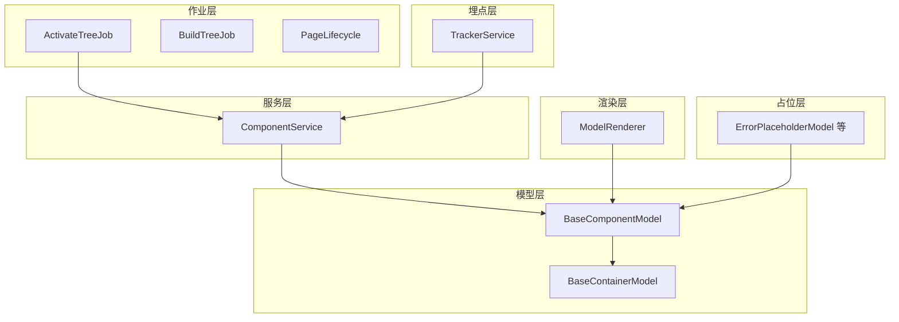
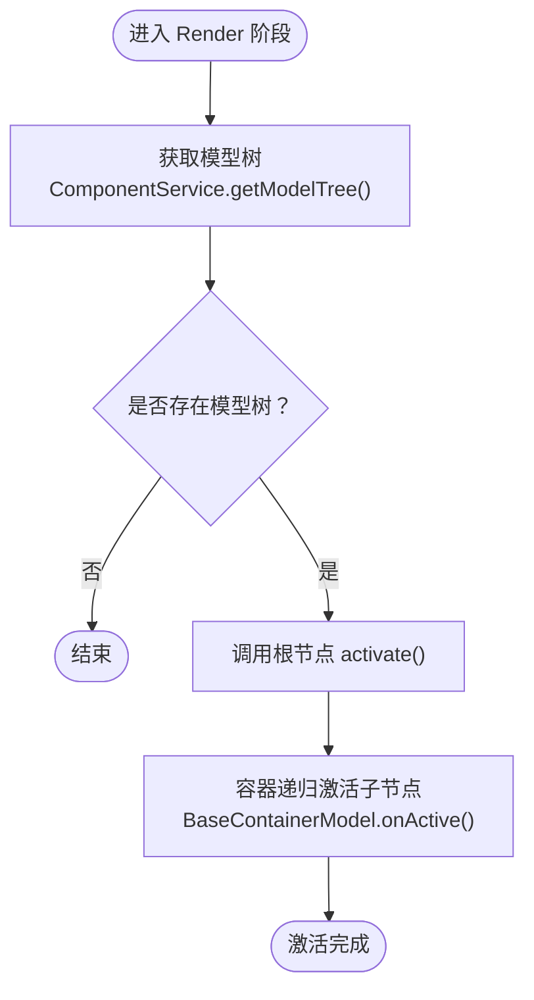
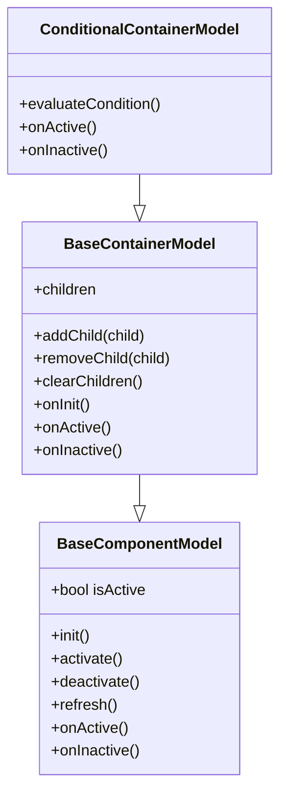
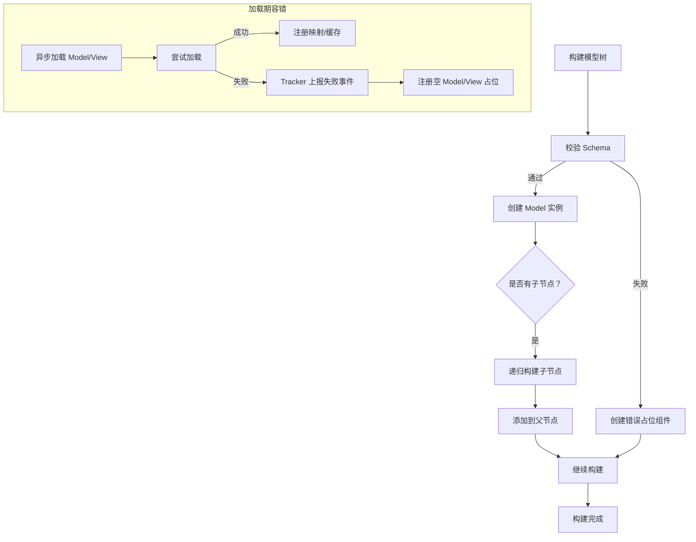
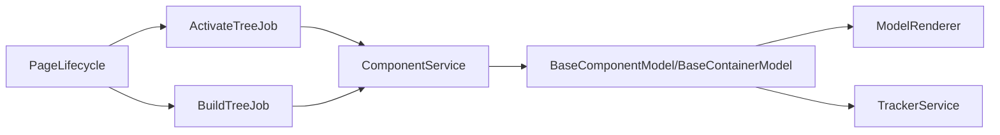

# ActivateTreeJob

<cite>
**本文引用的文件**
- [activate-tree-job.ts](file://packages/h5-builder/src/jobs/activate-tree-job.ts)
- [lifecycle.ts](file://packages/h5-builder/src/jobs/lifecycle.ts)
- [model.ts](file://packages/h5-builder/src/bedrock/model.ts)
- [component.service.ts](file://packages/h5-builder/src/services/component.service.ts)
- [demo-progressive.tsx](file://packages/h5-builder/src/demo-progressive.tsx)
- [tracker.service.ts](file://packages/h5-builder/src/services/tracker.service.ts)
- [index.ts](file://packages/h5-builder/src/placeholder/index.ts)
- [model-renderer.tsx](file://packages/h5-builder/src/components/model-renderer.tsx)
- [simple-list.model.ts](file://packages/h5-builder/src/components/simple-list/simple-list.model.ts)
- [conditional-container.model.ts](file://packages/h5-builder/src/components/conditional-container/conditional-container.model.ts)
- [build-tree-job.ts](file://packages/h5-builder/src/jobs/build-tree-job.ts)
</cite>

## 目录
1. [简介](#简介)
2. [项目结构](#项目结构)
3. [核心组件](#核心组件)
4. [架构总览](#架构总览)
5. [详细组件分析](#详细组件分析)
6. [依赖分析](#依赖分析)
7. [性能考虑](#性能考虑)
8. [故障排查指南](#故障排查指南)
9. [结论](#结论)

## 简介
ActivateTreeJob 是页面渲染完成后执行的“组件树激活”作业，负责在用户已看到页面内容的前提下，触发所有组件模型的激活逻辑，包括但不限于：事件监听注册、定时器启动、异步数据拉取、埋点上报等副作用。它不负责实际的 DOM 渲染，而是通过访问已构建好的模型树，调用每个节点的激活钩子，实现组件“活化”。

## 项目结构
本功能涉及的关键模块包括：
- 作业层：ActivateTreeJob、BuildTreeJob、PageLifecycle
- 模型层：BaseComponentModel、BaseContainerModel
- 服务层：ComponentService（提供模型树的构建与获取）
- 渲染层：ModelRenderer（将模型树渲染为视图）
- 埋点层：TrackerService（提供统一的埋点上报能力）
- 占位层：ErrorPlaceholderModel 等（错误/加载/空状态占位）



图表来源
- [activate-tree-job.ts](file://packages/h5-builder/src/jobs/activate-tree-job.ts#L1-L56)
- [build-tree-job.ts](file://packages/h5-builder/src/jobs/build-tree-job.ts#L1-L58)
- [lifecycle.ts](file://packages/h5-builder/src/jobs/lifecycle.ts#L1-L18)
- [model.ts](file://packages/h5-builder/src/bedrock/model.ts#L1-L242)
- [component.service.ts](file://packages/h5-builder/src/services/component.service.ts#L93-L125)
- [model-renderer.tsx](file://packages/h5-builder/src/components/model-renderer.tsx#L53-L104)
- [tracker.service.ts](file://packages/h5-builder/src/services/tracker.service.ts#L1-L290)
- [index.ts](file://packages/h5-builder/src/placeholder/index.ts#L1-L29)

章节来源
- [activate-tree-job.ts](file://packages/h5-builder/src/jobs/activate-tree-job.ts#L1-L56)
- [lifecycle.ts](file://packages/h5-builder/src/jobs/lifecycle.ts#L1-L18)
- [model.ts](file://packages/h5-builder/src/bedrock/model.ts#L1-L242)
- [component.service.ts](file://packages/h5-builder/src/services/component.service.ts#L93-L125)
- [model-renderer.tsx](file://packages/h5-builder/src/components/model-renderer.tsx#L53-L104)
- [tracker.service.ts](file://packages/h5-builder/src/services/tracker.service.ts#L1-L290)
- [index.ts](file://packages/h5-builder/src/placeholder/index.ts#L1-L29)

## 核心组件
- ActivateTreeJob：在 Render 阶段触发激活，获取模型树并调用根节点的激活方法，从而递归激活整棵模型树。
- BaseComponentModel/BaseContainerModel：提供激活/停用钩子 onActive/onInactive，容器默认递归激活/停用所有子节点。
- ComponentService：提供 buildModelTree 和 getModelTree，负责将 Schema 转为模型树，并缓存以便后续激活使用。
- TrackerService：提供 track 接口，用于激活过程中的埋点上报。
- ModelRenderer：将模型树渲染为视图，保证 DOM 已挂载后再进行激活。

章节来源
- [activate-tree-job.ts](file://packages/h5-builder/src/jobs/activate-tree-job.ts#L1-L56)
- [model.ts](file://packages/h5-builder/src/bedrock/model.ts#L60-L155)
- [model.ts](file://packages/h5-builder/src/bedrock/model.ts#L211-L242)
- [component.service.ts](file://packages/h5-builder/src/services/component.service.ts#L718-L731)
- [tracker.service.ts](file://packages/h5-builder/src/services/tracker.service.ts#L68-L125)
- [model-renderer.tsx](file://packages/h5-builder/src/components/model-renderer.tsx#L53-L104)

## 架构总览
ActivateTreeJob 的执行时机与页面生命周期紧密耦合。在 Render 阶段，作业被触发，读取 ComponentService 中已构建好的模型树，调用根节点的激活方法，从而触发整棵树的激活流程。模型树由 BuildTreeJob 在 Prepare 阶段构建完成，随后在 Render 阶段触发渲染与激活。

```mermaid
sequenceDiagram
participant Demo as "演示入口"
participant Scheduler as "作业调度器"
participant Build as "BuildTreeJob"
participant Render as "触发渲染"
participant Activate as "ActivateTreeJob"
participant Service as "ComponentService"
participant Model as "模型树(BaseComponentModel)"
participant Renderer as "ModelRenderer"
participant Tracker as "TrackerService"
Demo->>Scheduler : "进入 Render 阶段"
Scheduler->>Build : "prepare(Prepare)"
Build-->>Scheduler : "等待完成"
Scheduler->>Render : "prepare(Render)"
Render-->>Scheduler : "等待完成"
Scheduler->>Activate : "prepare(Render)"
Activate->>Service : "getModelTree()"
Service-->>Activate : "返回模型树"
Activate->>Model : "activate()"
Model->>Model : "onActive()容器递归激活子节点"
Model->>Tracker : "track(...)可选"
Renderer->>Model : "渲染视图DOM 已挂载"
Activate-->>Scheduler : "完成"
```

图表来源
- [demo-progressive.tsx](file://packages/h5-builder/src/demo-progressive.tsx#L136-L156)
- [build-tree-job.ts](file://packages/h5-builder/src/jobs/build-tree-job.ts#L1-L58)
- [activate-tree-job.ts](file://packages/h5-builder/src/jobs/activate-tree-job.ts#L1-L56)
- [component.service.ts](file://packages/h5-builder/src/services/component.service.ts#L718-L731)
- [model.ts](file://packages/h5-builder/src/bedrock/model.ts#L211-L242)
- [model-renderer.tsx](file://packages/h5-builder/src/components/model-renderer.tsx#L53-L104)
- [tracker.service.ts](file://packages/h5-builder/src/services/tracker.service.ts#L68-L125)

## 详细组件分析

### ActivateTreeJob 分析
- 触发时机：在 PageLifecycle.Render 阶段执行，确保 DOM 已挂载。
- 执行逻辑：从 ComponentService 获取模型树，若存在则调用根节点的 activate 方法，从而递归激活整棵树。
- 设计要点：
  - 仅触发副作用，不负责渲染。
  - 与渲染阶段解耦，通过作业调度器在 Render 阶段统一触发。
  - 与 TrackerService 协作，可在激活过程中进行埋点上报。



图表来源
- [activate-tree-job.ts](file://packages/h5-builder/src/jobs/activate-tree-job.ts#L1-L56)
- [component.service.ts](file://packages/h5-builder/src/services/component.service.ts#L718-L731)
- [model.ts](file://packages/h5-builder/src/bedrock/model.ts#L211-L242)

章节来源
- [activate-tree-job.ts](file://packages/h5-builder/src/jobs/activate-tree-job.ts#L1-L56)
- [demo-progressive.tsx](file://packages/h5-builder/src/demo-progressive.tsx#L147-L156)

### 模型树激活流程（BaseComponentModel/BaseContainerModel）
- BaseComponentModel.activate/deactivate：设置状态并调用 onActive/onInactive，默认为空实现，子类可覆写。
- BaseContainerModel.onActive/onInactive：默认递归激活/停用所有子节点，支持按需覆盖（如条件容器仅激活满足条件的子节点）。
- 条件容器示例：conditional-container.model.ts 中根据条件决定是否激活子节点，体现“选择性激活”。



图表来源
- [model.ts](file://packages/h5-builder/src/bedrock/model.ts#L60-L155)
- [model.ts](file://packages/h5-builder/src/bedrock/model.ts#L211-L242)
- [conditional-container.model.ts](file://packages/h5-builder/src/components/conditional-container/conditional-container.model.ts#L41-L85)

章节来源
- [model.ts](file://packages/h5-builder/src/bedrock/model.ts#L60-L155)
- [model.ts](file://packages/h5-builder/src/bedrock/model.ts#L211-L242)
- [conditional-container.model.ts](file://packages/h5-builder/src/components/conditional-container/conditional-container.model.ts#L41-L85)

### 与 React useEffect 的协同机制
- DOM 已挂载：ModelRenderer 将模型树渲染为视图，确保 DOM 已挂载。
- 作业触发：在 Render 阶段，ActivateTreeJob 调用模型树的激活方法，避免在 useEffect 之前执行副作用。
- 协同建议：组件内部的副作用（如事件监听、定时器）应在 onActive 中进行，确保 DOM 已就绪且页面已完成首屏渲染。

章节来源
- [model-renderer.tsx](file://packages/h5-builder/src/components/model-renderer.tsx#L53-L104)
- [demo-progressive.tsx](file://packages/h5-builder/src/demo-progressive.tsx#L147-L156)

### 激活顺序控制（深度优先）
- 激活顺序：BaseContainerModel 默认递归激活所有子节点，遵循“先子后父”的深度优先顺序。
- 自定义顺序：子类可通过覆写 onActive/onInactive 控制激活范围与顺序，例如条件容器仅激活满足条件的子节点。

章节来源
- [model.ts](file://packages/h5-builder/src/bedrock/model.ts#L211-L242)
- [conditional-container.model.ts](file://packages/h5-builder/src/components/conditional-container/conditional-container.model.ts#L41-L85)

### 错误隔离与容错机制
- 构建期容错：ComponentService 在构建模型树时对未知类型、缺失字段等情况创建错误占位组件，避免中断渲染。
- 加载期容错：异步加载 Model/View 失败时，注册空 Model/空 View 占位，并通过 TrackerService 上报失败事件。
- 运行期容错：BaseComponentModel.refresh 在拉取数据时捕获异常，设置 error 状态，便于上层感知与降级展示。



图表来源
- [component.service.ts](file://packages/h5-builder/src/services/component.service.ts#L125-L206)
- [component.service.ts](file://packages/h5-builder/src/services/component.service.ts#L367-L467)
- [index.ts](file://packages/h5-builder/src/placeholder/index.ts#L1-L29)
- [tracker.service.ts](file://packages/h5-builder/src/services/tracker.service.ts#L68-L125)

章节来源
- [component.service.ts](file://packages/h5-builder/src/services/component.service.ts#L125-L206)
- [component.service.ts](file://packages/h5-builder/src/services/component.service.ts#L367-L467)
- [index.ts](file://packages/h5-builder/src/placeholder/index.ts#L1-L29)
- [tracker.service.ts](file://packages/h5-builder/src/services/tracker.service.ts#L68-L125)

### 监控与性能集成
- 埋点上报：在组件创建、加载失败、空模型渲染等关键节点通过 TrackerService 上报事件，便于监控与分析。
- 性能统计：演示入口打印各阶段耗时，结合作业调度器的成本统计，形成端到端的性能画像。

章节来源
- [tracker.service.ts](file://packages/h5-builder/src/services/tracker.service.ts#L68-L125)
- [demo-progressive.tsx](file://packages/h5-builder/src/demo-progressive.tsx#L159-L185)

## 依赖分析
- ActivateTreeJob 依赖 ComponentService 获取模型树；模型树由 BuildTreeJob 在 Prepare 阶段构建。
- 模型树由 BaseComponentModel/BaseContainerModel 提供激活/停用能力；容器默认递归处理子节点。
- 渲染层通过 ModelRenderer 将模型树渲染为视图，确保 DOM 已挂载。
- 埋点层通过 TrackerService 提供统一的埋点接口，贯穿构建、加载、激活等阶段。



图表来源
- [activate-tree-job.ts](file://packages/h5-builder/src/jobs/activate-tree-job.ts#L1-L56)
- [build-tree-job.ts](file://packages/h5-builder/src/jobs/build-tree-job.ts#L1-L58)
- [lifecycle.ts](file://packages/h5-builder/src/jobs/lifecycle.ts#L1-L18)
- [component.service.ts](file://packages/h5-builder/src/services/component.service.ts#L718-L731)
- [model.ts](file://packages/h5-builder/src/bedrock/model.ts#L211-L242)
- [model-renderer.tsx](file://packages/h5-builder/src/components/model-renderer.tsx#L53-L104)
- [tracker.service.ts](file://packages/h5-builder/src/services/tracker.service.ts#L68-L125)

章节来源
- [activate-tree-job.ts](file://packages/h5-builder/src/jobs/activate-tree-job.ts#L1-L56)
- [build-tree-job.ts](file://packages/h5-builder/src/jobs/build-tree-job.ts#L1-L58)
- [lifecycle.ts](file://packages/h5-builder/src/jobs/lifecycle.ts#L1-L18)
- [component.service.ts](file://packages/h5-builder/src/services/component.service.ts#L718-L731)
- [model.ts](file://packages/h5-builder/src/bedrock/model.ts#L211-L242)
- [model-renderer.tsx](file://packages/h5-builder/src/components/model-renderer.tsx#L53-L104)
- [tracker.service.ts](file://packages/h5-builder/src/services/tracker.service.ts#L68-L125)

## 性能考虑
- 深度优先激活：容器默认递归激活子节点，适合层级较深的树结构；若存在大量子节点，建议在容器层做分批/节流处理，避免一次性激活造成主线程阻塞。
- 并发加载：ComponentService 在异步加载 Model/View 时采用并发控制与队列处理，降低整体等待时间。
- 埋点批处理：TrackerService 支持批量发送与持久化，减少频繁 IO 对主线程的影响。
- 首屏优化：在 RenderReady 阶段完成资源准备，在 Render 阶段触发渲染与激活，确保首屏可见后再执行副作用。

章节来源
- [model.ts](file://packages/h5-builder/src/bedrock/model.ts#L211-L242)
- [component.service.ts](file://packages/h5-builder/src/services/component.service.ts#L512-L563)
- [tracker.service.ts](file://packages/h5-builder/src/services/tracker.service.ts#L110-L171)
- [demo-progressive.tsx](file://packages/h5-builder/src/demo-progressive.tsx#L136-L156)

## 故障排查指南
- 激活失败排查：
  - 确认模型树已构建：检查 BuildTreeJob 是否在 Prepare 阶段完成，ComponentService 是否返回非空模型树。
  - 检查容器激活范围：确认 BaseContainerModel 或自定义容器是否正确覆写 onActive/onInactive。
  - 数据拉取异常：使用 BaseComponentModel.refresh 的错误状态定位问题。
- 加载失败排查：
  - Model/View 加载失败时，ComponentService 会注册空占位并上报失败事件，检查 TrackerService 的埋点队列。
  - 错误占位组件 ErrorPlaceholderModel 会在 onInit 中输出错误日志，便于定位原始组件类型与错误信息。
- 渲染问题排查：
  - 确保在 Render 阶段之后再执行激活，避免在 DOM 未挂载时进行副作用操作。
  - 如需在组件内部注册事件监听或定时器，应放在 onActive 中，确保 DOM 已就绪。

章节来源
- [component.service.ts](file://packages/h5-builder/src/services/component.service.ts#L367-L467)
- [index.ts](file://packages/h5-builder/src/placeholder/index.ts#L1-L29)
- [model.ts](file://packages/h5-builder/src/bedrock/model.ts#L103-L121)
- [model-renderer.tsx](file://packages/h5-builder/src/components/model-renderer.tsx#L53-L104)

## 结论
ActivateTreeJob 在页面渲染完成后执行，通过访问已构建的模型树，调用各组件模型的激活钩子，实现事件监听注册、定时器启动、异步数据拉取等副作用。它与渲染阶段解耦，确保 DOM 已挂载后再执行激活操作；通过容器默认递归激活与自定义覆盖，实现灵活的激活顺序控制；借助 ComponentService 的错误占位与 TrackerService 的埋点上报，形成完善的容错与监控体系。该作业是实现组件“活化”状态的关键环节，也是页面性能监控的重要切入点。