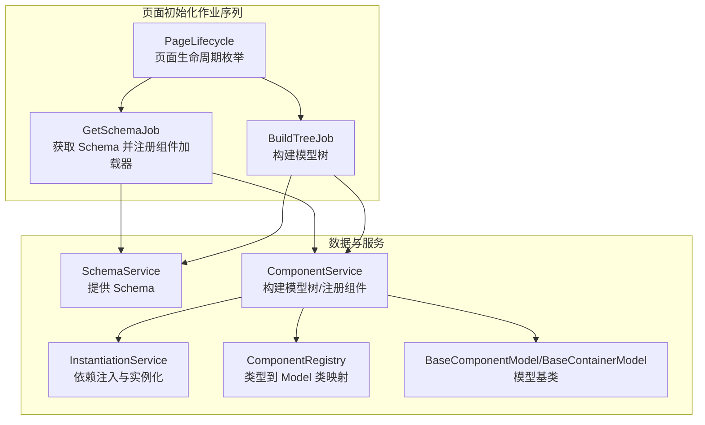
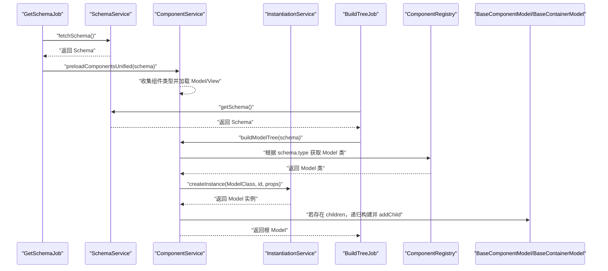
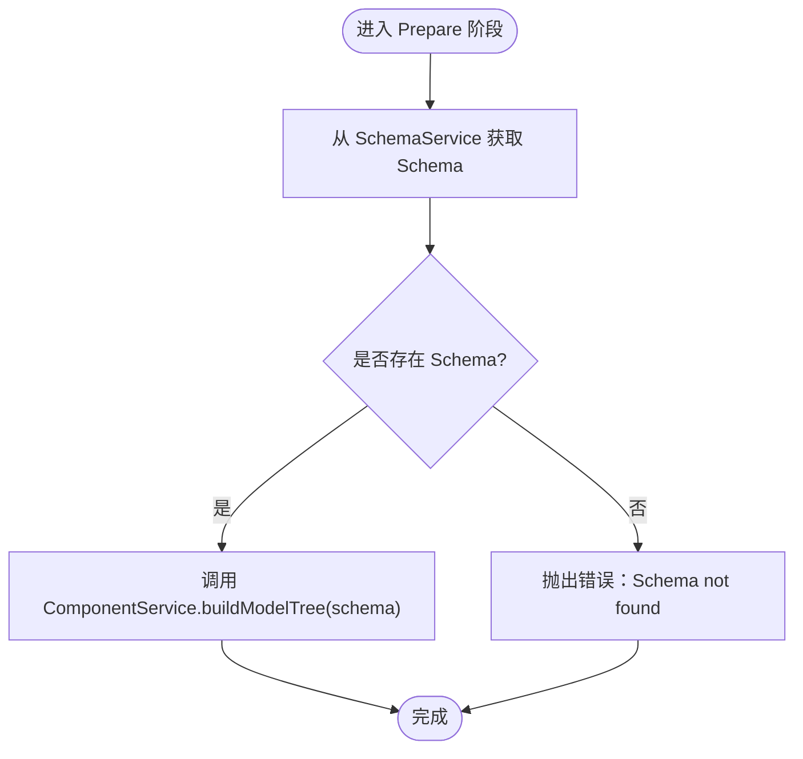
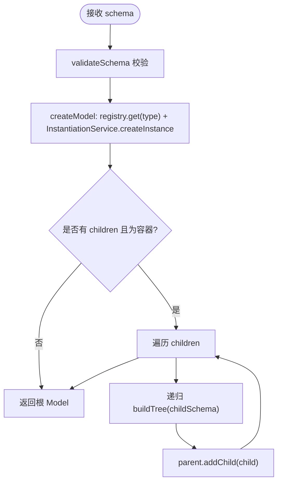
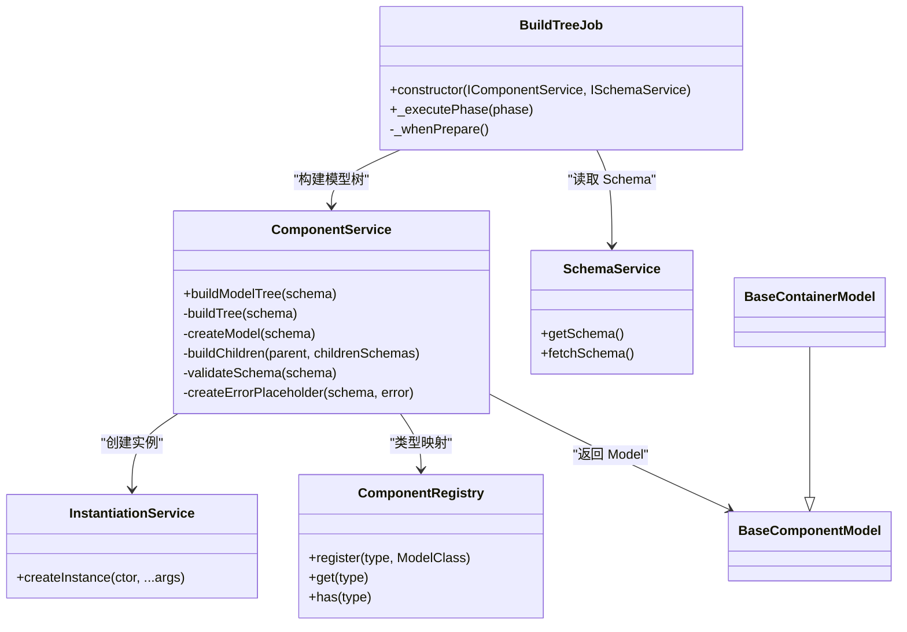

# BuildTreeJob

<cite>
**本文引用的文件**
- [build-tree-job.ts](file://packages/h5-builder/src/jobs/build-tree-job.ts)
- [get-schema-job.ts](file://packages/h5-builder/src/jobs/get-schema-job.ts)
- [schema.service.ts](file://packages/h5-builder/src/services/schema.service.ts)
- [component.service.ts](file://packages/h5-builder/src/services/component.service.ts)
- [model.ts](file://packages/h5-builder/src/bedrock/model.ts)
- [instantiation-service.ts](file://packages/h5-builder/src/bedrock/di/instantiation-service.ts)
- [service-identifiers.ts](file://packages/h5-builder/src/services/service-identifiers.ts)
- [lifecycle.ts](file://packages/h5-builder/src/jobs/lifecycle.ts)
- [demo-data.ts](file://packages/h5-builder/src/mock/demo-data.ts)
- [tabs-container.model.ts](file://packages/h5-builder/src/components/tabs-container/tabs-container.model.ts)
- [product-card.model.ts](file://packages/h5-builder/src/components/product-card/product-card.model.ts)
- [text-card.model.ts](file://packages/h5-builder/src/components/text-card/text-card.model.ts)
- [job-scheduler.ts](file://packages/h5-builder/src/bedrock/launch/job-scheduler.ts)
</cite>

## 目录
1. [简介](#简介)
2. [项目结构](#项目结构)
3. [核心组件](#核心组件)
4. [架构总览](#架构总览)
5. [详细组件分析](#详细组件分析)
6. [依赖关系分析](#依赖关系分析)
7. [性能考量](#性能考量)
8. [故障排查指南](#故障排查指南)
9. [结论](#结论)
10. [附录](#附录)

## 简介
本文件深入文档化 BuildTreeJob 的核心转换逻辑，说明其如何将 GetSchemaJob 获取的原始 Schema 数据转换为可执行的组件模型树。文档覆盖以下要点：
- 如何依赖 SchemaService 进行数据解析与提供
- 如何通过 ComponentService 创建各组件的 Model 实例，构建完整的父子层级关系
- 类型映射机制：如何根据 schema.type 匹配对应的 ComponentModel 类
- 组件递归构建、默认值填充与校验规则应用的实现示例
- 该任务在页面初始化流程中的关键位置，及其输出对后续渲染任务的影响
- 循环引用、非法结构等异常情况的处理策略

## 项目结构
BuildTreeJob 位于页面初始化作业序列中的“准备”阶段，承接 GetSchemaJob 的 Schema 数据，驱动 ComponentService 完成模型树构建。下图给出与之相关的关键文件与职责：

图表来源
- [build-tree-job.ts](file://packages/h5-builder/src/jobs/build-tree-job.ts#L1-L59)
- [get-schema-job.ts](file://packages/h5-builder/src/jobs/get-schema-job.ts#L1-L119)
- [schema.service.ts](file://packages/h5-builder/src/services/schema.service.ts#L1-L38)
- [component.service.ts](file://packages/h5-builder/src/services/component.service.ts#L1-L735)
- [instantiation-service.ts](file://packages/h5-builder/src/bedrock/di/instantiation-service.ts#L1-L468)
- [model.ts](file://packages/h5-builder/src/bedrock/model.ts#L1-L243)
- [lifecycle.ts](file://packages/h5-builder/src/jobs/lifecycle.ts#L1-L18)

章节来源
- [build-tree-job.ts](file://packages/h5-builder/src/jobs/build-tree-job.ts#L1-L59)
- [get-schema-job.ts](file://packages/h5-builder/src/jobs/get-schema-job.ts#L1-L119)
- [lifecycle.ts](file://packages/h5-builder/src/jobs/lifecycle.ts#L1-L18)

## 核心组件
- BuildTreeJob：在“准备”阶段从 SchemaService 获取 Schema，并委托 ComponentService 构建模型树；若无 Schema 则抛错。
- ComponentService：负责将树形 Schema 转换为树形 Model 树，包括类型映射、实例化、递归构建子节点、错误占位与注册表维护。
- SchemaService：提供 Schema 数据（演示数据来自 mock），并支持异步拉取。
- BaseComponentModel/BaseContainerModel：所有组件 Model 的基类，容器模型支持子节点管理与生命周期传播。
- InstantiationService：依赖注入与实例化服务，负责按构造函数依赖注入参数并创建实例，内置循环依赖检测与错误上报。

章节来源
- [build-tree-job.ts](file://packages/h5-builder/src/jobs/build-tree-job.ts#L1-L59)
- [component.service.ts](file://packages/h5-builder/src/services/component.service.ts#L1-L735)
- [schema.service.ts](file://packages/h5-builder/src/services/schema.service.ts#L1-L38)
- [model.ts](file://packages/h5-builder/src/bedrock/model.ts#L1-L243)
- [instantiation-service.ts](file://packages/h5-builder/src/bedrock/di/instantiation-service.ts#L1-L468)

## 架构总览
BuildTreeJob 的执行路径如下：
- GetSchemaJob 在“页面打开”阶段拉取 Schema 并注册组件加载器，随后预加载组件资源。
- BuildTreeJob 在“准备”阶段从 SchemaService 获取 Schema，调用 ComponentService.buildModelTree(schema) 构建模型树。
- ComponentService 依据 schema.type 从 ComponentRegistry 查找对应 Model 类，使用 InstantiationService 创建实例，再递归构建 children 并建立父子关系。
- 容器模型（BaseContainerModel）负责子节点的生命周期传播（init/active/inactive）。

图表来源
- [get-schema-job.ts](file://packages/h5-builder/src/jobs/get-schema-job.ts#L1-L119)
- [build-tree-job.ts](file://packages/h5-builder/src/jobs/build-tree-job.ts#L1-L59)
- [component.service.ts](file://packages/h5-builder/src/services/component.service.ts#L1-L735)
- [instantiation-service.ts](file://packages/h5-builder/src/bedrock/di/instantiation-service.ts#L1-L468)
- [model.ts](file://packages/h5-builder/src/bedrock/model.ts#L1-L243)

## 详细组件分析

### BuildTreeJob：从 Schema 到模型树
- 依赖注入：通过装饰器注入 IComponentService 与 ISchemaService。
- 生命周期回调：在 Prepare 阶段执行 _whenPrepare，从 SchemaService 获取 Schema，若为空则抛错；否则调用 ComponentService.buildModelTree(schema) 构建根 Model。
- 输出：rootModel 保存为构建后的根模型，供后续渲染阶段使用。

图表来源
- [build-tree-job.ts](file://packages/h5-builder/src/jobs/build-tree-job.ts#L1-L59)

章节来源
- [build-tree-job.ts](file://packages/h5-builder/src/jobs/build-tree-job.ts#L1-L59)

### ComponentService：类型映射与递归构建
- 类型映射：ComponentRegistry 维护 type → ModelClass 的映射，buildTree(schema) 通过 registry.get(schema.type) 获取 Model 类。
- 实例化：使用 InstantiationService.createInstance(ModelClass, id, props) 创建实例，自动注入依赖。
- 递归构建：若 schema.children 存在且当前 Model 是容器（BaseContainerModel），则遍历 children 递归构建并调用 parent.addChild(child) 建立父子关系。
- 校验与默认值：validateSchema 对 schema.type、schema.id、以及 registry.has(schema.type) 进行校验；未注册类型时抛错。
- 错误处理：构建过程中捕获异常，创建 ErrorPlaceholderModel 占位并继续构建，避免中断整棵树。

图表来源
- [component.service.ts](file://packages/h5-builder/src/services/component.service.ts#L1-L735)
- [model.ts](file://packages/h5-builder/src/bedrock/model.ts#L1-L243)

章节来源
- [component.service.ts](file://packages/h5-builder/src/services/component.service.ts#L1-L735)
- [model.ts](file://packages/h5-builder/src/bedrock/model.ts#L1-L243)

### SchemaService：数据提供与异步拉取
- 提供 getSchema() 返回当前 Schema。
- 提供 fetchSchema() 模拟异步拉取，设置内部_schema 并返回 Schema。
- 通过 mobx-vue-lite 的 observable 使 SchemaService 本身具备响应式特性（便于在 UI 中观察状态变化）。

章节来源
- [schema.service.ts](file://packages/h5-builder/src/services/schema.service.ts#L1-L38)

### BaseComponentModel/BaseContainerModel：生命周期与父子关系
- BaseComponentModel：定义 isInited、isActive、data、loading、error 等状态，提供 init/activate/deactivate/refresh/fetchData 等生命周期钩子。
- BaseContainerModel：扩展 BaseComponentModel，提供 children 管理与生命周期传播（onInit/activate/deactivate 默认并行处理所有子节点）。

章节来源
- [model.ts](file://packages/h5-builder/src/bedrock/model.ts#L1-L243)

### InstantiationService：依赖注入与循环依赖检测
- 通过构造函数参数注解获取依赖列表，按顺序注入服务实例。
- createInstance 支持两种方式：传入构造函数或 SyncDescriptor，内部完成依赖解析与实例化。
- 内置循环依赖检测：当检测到循环依赖时抛出错误；同时提供错误事件上报与全局依赖图追踪（可选）。

章节来源
- [instantiation-service.ts](file://packages/h5-builder/src/bedrock/di/instantiation-service.ts#L1-L468)

### 页面初始化流程中的关键位置与影响
- GetSchemaJob 在 Open 阶段拉取 Schema 并注册组件加载器，随后预加载组件资源（Model/View），为 BuildTreeJob 提供可用的组件类型映射。
- BuildTreeJob 在 Prepare 阶段构建模型树，输出 rootModel，供后续 RenderReady/Render 阶段使用。
- TabsContainerModel 等容器组件在 onInit 中对子组件进行懒加载与预热，体现模型树构建后对渲染阶段的积极影响。

章节来源
- [get-schema-job.ts](file://packages/h5-builder/src/jobs/get-schema-job.ts#L1-L119)
- [build-tree-job.ts](file://packages/h5-builder/src/jobs/build-tree-job.ts#L1-L59)
- [tabs-container.model.ts](file://packages/h5-builder/src/components/tabs-container/tabs-container.model.ts#L1-L273)
- [lifecycle.ts](file://packages/h5-builder/src/jobs/lifecycle.ts#L1-L18)

## 依赖关系分析
- BuildTreeJob 依赖 SchemaService 与 ComponentService，二者通过服务标识符注入。
- ComponentService 依赖 InstantiationService 与 TrackerService，用于实例化与埋点。
- ComponentRegistry 维护类型到 Model 类的映射，是类型映射机制的核心。
- BaseComponentModel/BaseContainerModel 为所有组件模型提供统一的生命周期与父子关系管理。

图表来源
- [build-tree-job.ts](file://packages/h5-builder/src/jobs/build-tree-job.ts#L1-L59)
- [component.service.ts](file://packages/h5-builder/src/services/component.service.ts#L1-L735)
- [schema.service.ts](file://packages/h5-builder/src/services/schema.service.ts#L1-L38)
- [instantiation-service.ts](file://packages/h5-builder/src/bedrock/di/instantiation-service.ts#L1-L468)
- [model.ts](file://packages/h5-builder/src/bedrock/model.ts#L1-L243)

章节来源
- [service-identifiers.ts](file://packages/h5-builder/src/services/service-identifiers.ts#L1-L20)
- [component.service.ts](file://packages/h5-builder/src/services/component.service.ts#L1-L735)

## 性能考量
- 预加载策略：GetSchemaJob 在 Open 阶段调用 preloadComponentsUnified(schema)，统一收集并并发加载所有组件的 Model/View，减少后续构建时的等待时间。
- 构建阶段：BuildTreeJob 在 Prepare 阶段同步构建模型树，前提是所有 Model 已加载完成（由预加载保证）。
- 容器懒加载与预热：容器组件（如 TabsContainerModel）在 onInit 中仅初始化当前激活的子组件，并通过 schedulePrewarm 在闲时预热其他子组件，提升切换体验。
- 虚拟滚动：容器组件可基于子组件数量阈值自动启用虚拟滚动，降低渲染成本。

章节来源
- [get-schema-job.ts](file://packages/h5-builder/src/jobs/get-schema-job.ts#L1-L119)
- [component.service.ts](file://packages/h5-builder/src/services/component.service.ts#L626-L735)
- [tabs-container.model.ts](file://packages/h5-builder/src/components/tabs-container/tabs-container.model.ts#L1-L273)

## 故障排查指南
- 无 Schema：BuildTreeJob 在 Prepare 阶段若未获取到 Schema，会抛出错误。请确认 GetSchemaJob 已成功拉取并设置 Schema。
- 未知组件类型：ComponentService.validateSchema 会校验 schema.type 是否存在注册表；若不存在，抛出错误。请在应用启动时注册所有组件类型。
- 循环依赖：InstantiationService 在实例化过程中检测循环依赖并抛错。请检查组件构造函数依赖关系，避免相互依赖。
- 子组件非法：若 schema.children 存在但当前 Model 不是容器模型，会发出警告并跳过子节点构建。请确保容器类型与 children 结构一致。
- 构建失败占位：ComponentService 在构建子节点失败时会创建 ErrorPlaceholderModel 占位，避免整棵树中断；可在日志中定位具体失败节点。

章节来源
- [build-tree-job.ts](file://packages/h5-builder/src/jobs/build-tree-job.ts#L1-L59)
- [component.service.ts](file://packages/h5-builder/src/services/component.service.ts#L130-L243)
- [instantiation-service.ts](file://packages/h5-builder/src/bedrock/di/instantiation-service.ts#L291-L374)

## 结论
BuildTreeJob 通过与 SchemaService、ComponentService 的协作，将树形 Schema 转换为可执行的组件模型树。其核心在于：
- 明确的类型映射机制（schema.type → Model 类）
- 依赖注入驱动的实例化（InstantiationService）
- 递归构建与父子关系建立（BaseContainerModel）
- 完善的校验与错误处理（validateSchema 与 ErrorPlaceholder）

在页面初始化流程中，BuildTreeJob 位于 Prepare 阶段，承接 GetSchemaJob 的预加载成果，为后续渲染阶段提供稳定的模型树基础。

## 附录
- 示例数据：demo-data.ts 提供了丰富的嵌套容器与混合组件的 Schema，可用于验证 BuildTreeJob 的递归构建与类型映射能力。
- 典型组件模型：
  - ProductCardModel：展示数据加载、状态管理与埋点上报。
  - TextCardModel：简单组件示例。
  - TabsContainerModel：容器组件，演示懒加载、预热与虚拟滚动集成。

章节来源
- [demo-data.ts](file://packages/h5-builder/src/mock/demo-data.ts#L1-L334)
- [product-card.model.ts](file://packages/h5-builder/src/components/product-card/product-card.model.ts#L1-L133)
- [text-card.model.ts](file://packages/h5-builder/src/components/text-card/text-card.model.ts#L1-L21)
- [tabs-container.model.ts](file://packages/h5-builder/src/components/tabs-container/tabs-container.model.ts#L1-L273)