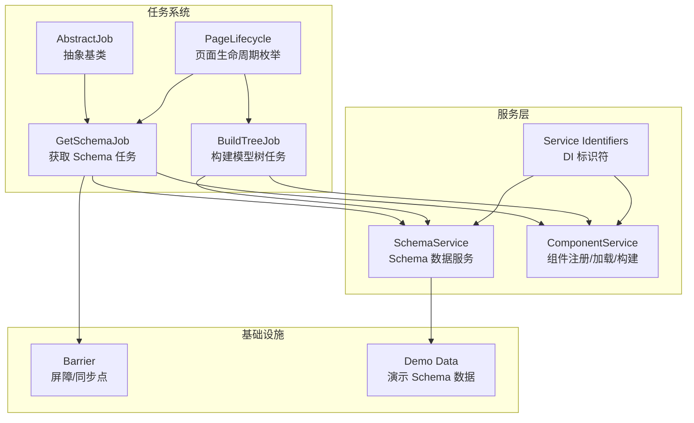
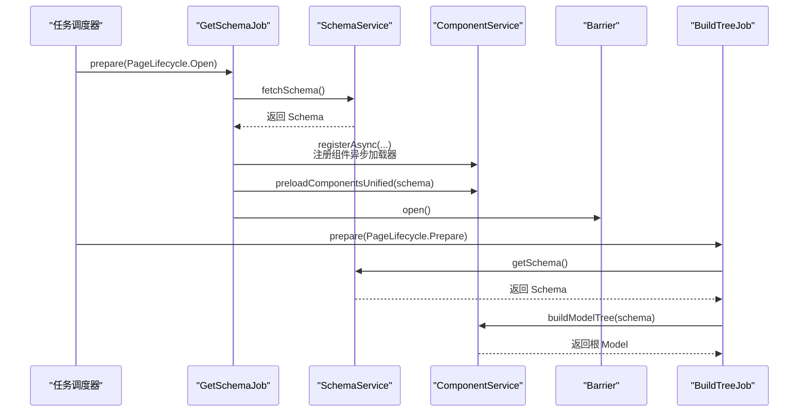
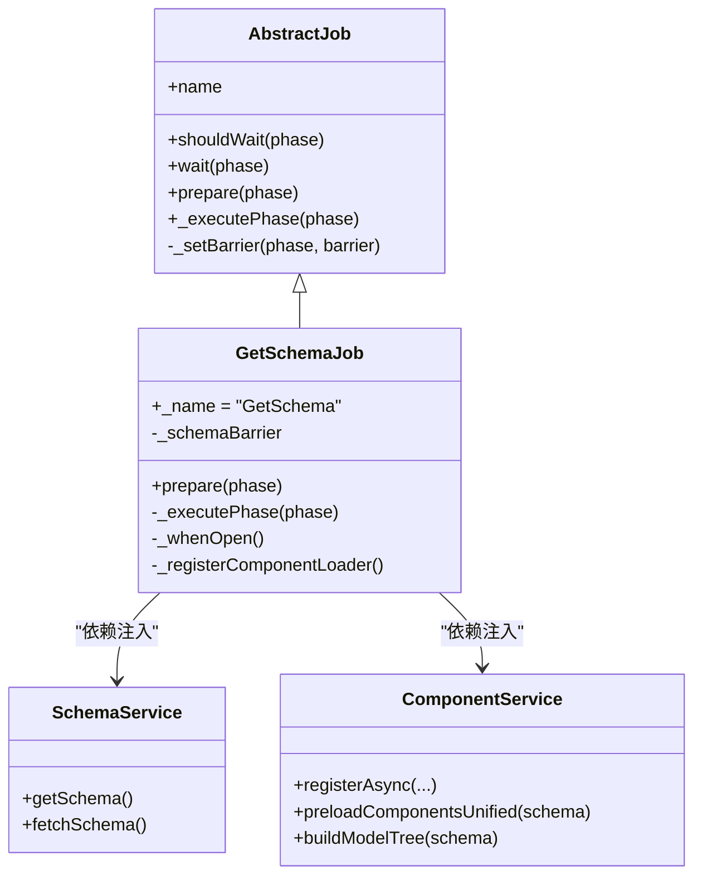
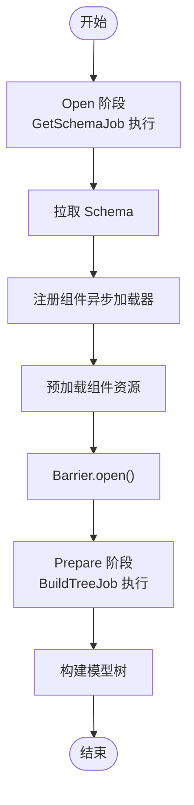
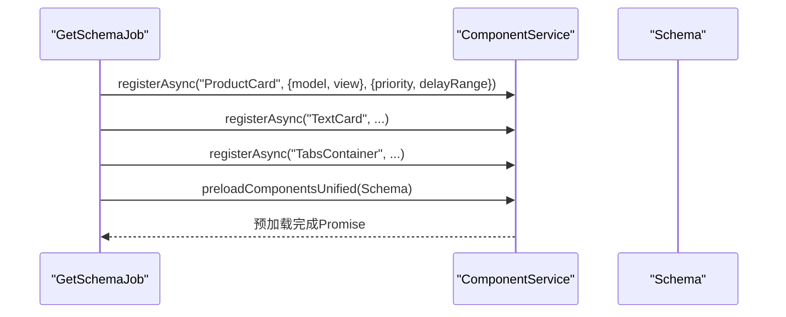
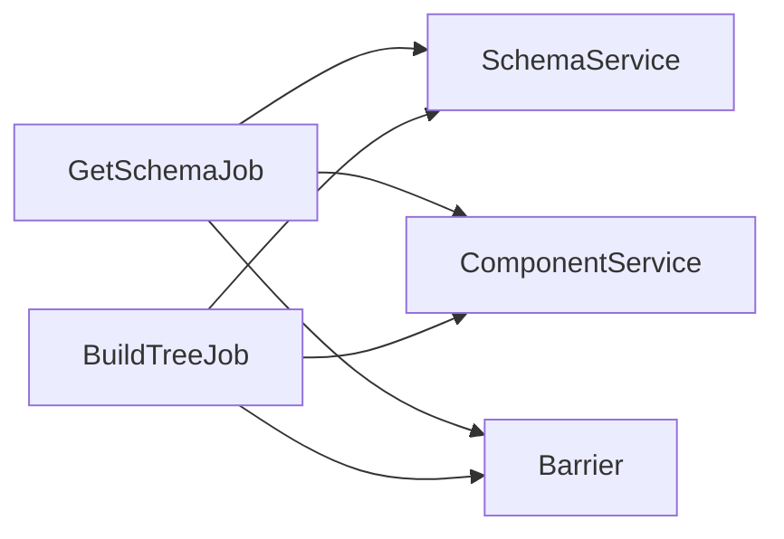

# GetSchemaJob

<cite>
**本文引用的文件**
- [get-schema-job.ts](file://packages/h5-builder/src/jobs/get-schema-job.ts)
- [abstract-job.ts](file://packages/h5-builder/src/bedrock/launch/abstract-job.ts)
- [barrier.ts](file://packages/h5-builder/src/bedrock/async/barrier.ts)
- [lifecycle.ts](file://packages/h5-builder/src/jobs/lifecycle.ts)
- [component.service.ts](file://packages/h5-builder/src/services/component.service.ts)
- [schema.service.ts](file://packages/h5-builder/src/services/schema.service.ts)
- [service-identifiers.ts](file://packages/h5-builder/src/services/service-identifiers.ts)
- [demo-data.ts](file://packages/h5-builder/src/mock/demo-data.ts)
- [build-tree-job.ts](file://packages/h5-builder/src/jobs/build-tree-job.ts)
</cite>

## 目录
1. [简介](#简介)
2. [项目结构](#项目结构)
3. [核心组件](#核心组件)
4. [架构总览](#架构总览)
5. [详细组件分析](#详细组件分析)
6. [依赖分析](#依赖分析)
7. [性能考虑](#性能考虑)
8. [故障排查指南](#故障排查指南)
9. [结论](#结论)

## 简介
本文件围绕 GetSchemaJob 的实现进行深入解析，重点说明其作为任务系统起点的职责：通过依赖注入获取 SchemaService 实例，在页面生命周期的“Open”阶段拉取页面 Schema 数据，并在完成后注册组件异步加载器与预加载资源，从而为后续 BuildTreeJob 提供可用的 Schema 数据与已加载的组件资源。文档还涵盖与 HTTP 服务的集成方式、请求参数构造、错误处理与重试策略、超时处理、前置依赖关系以及输出数据如何被后续任务消费，最后给出常见问题与降级策略建议。

## 项目结构
GetSchemaJob 位于任务系统模块中，与生命周期、组件服务、Schema 服务、依赖注入标识符等共同构成前端页面构建流水线的关键节点。

图表来源
- [get-schema-job.ts](file://packages/h5-builder/src/jobs/get-schema-job.ts#L1-L119)
- [abstract-job.ts](file://packages/h5-builder/src/bedrock/launch/abstract-job.ts#L1-L46)
- [lifecycle.ts](file://packages/h5-builder/src/jobs/lifecycle.ts#L1-L18)
- [component.service.ts](file://packages/h5-builder/src/services/component.service.ts#L1-L759)
- [schema.service.ts](file://packages/h5-builder/src/services/schema.service.ts#L1-L38)
- [service-identifiers.ts](file://packages/h5-builder/src/services/service-identifiers.ts#L1-L20)
- [demo-data.ts](file://packages/h5-builder/src/mock/demo-data.ts#L1-L334)

章节来源
- [get-schema-job.ts](file://packages/h5-builder/src/jobs/get-schema-job.ts#L1-L119)
- [abstract-job.ts](file://packages/h5-builder/src/bedrock/launch/abstract-job.ts#L1-L46)
- [lifecycle.ts](file://packages/h5-builder/src/jobs/lifecycle.ts#L1-L18)
- [component.service.ts](file://packages/h5-builder/src/services/component.service.ts#L1-L759)
- [schema.service.ts](file://packages/h5-builder/src/services/schema.service.ts#L1-L38)
- [service-identifiers.ts](file://packages/h5-builder/src/services/service-identifiers.ts#L1-L20)
- [demo-data.ts](file://packages/h5-builder/src/mock/demo-data.ts#L1-L334)

## 核心组件
- GetSchemaJob：继承自 AbstractJob，作为任务系统的起点，负责在 Open 生命周期中拉取 Schema 并注册组件异步加载器，随后开启组件资源预加载。
- AbstractJob：提供任务生命周期管理、屏障（Barrier）等待与开放机制，以及 prepare/executePhase 抽象接口。
- Barrier：用于任务间同步，当某个阶段需要等待前置任务完成时，通过 Barrier 控制后续任务继续执行。
- PageLifecycle：定义页面生命周期阶段，GetSchemaJob 在 Open 阶段执行，BuildTreeJob 在 Prepare 阶段执行。
- ComponentService：负责组件注册、异步加载、构建模型树；GetSchemaJob 通过它注册异步组件与预加载资源。
- SchemaService：提供 Schema 数据的获取与缓存；GetSchemaJob 通过它获取页面 Schema。
- Service Identifiers：定义 DI 标识符，用于依赖注入容器解析具体服务实例。
- Demo Data：提供演示用的 Schema 数据，用于本地开发与测试。

章节来源
- [get-schema-job.ts](file://packages/h5-builder/src/jobs/get-schema-job.ts#L1-L119)
- [abstract-job.ts](file://packages/h5-builder/src/bedrock/launch/abstract-job.ts#L1-L46)
- [barrier.ts](file://packages/h5-builder/src/bedrock/async/barrier.ts#L1-L59)
- [lifecycle.ts](file://packages/h5-builder/src/jobs/lifecycle.ts#L1-L18)
- [component.service.ts](file://packages/h5-builder/src/services/component.service.ts#L1-L759)
- [schema.service.ts](file://packages/h5-builder/src/services/schema.service.ts#L1-L38)
- [service-identifiers.ts](file://packages/h5-builder/src/services/service-identifiers.ts#L1-L20)
- [demo-data.ts](file://packages/h5-builder/src/mock/demo-data.ts#L1-L334)

## 架构总览
GetSchemaJob 作为任务系统起点，串联以下流程：
- 依赖注入：通过 DI 标识符注入 SchemaService 与 ComponentService。
- 生命周期：在 Open 阶段执行，拉取 Schema 并注册组件异步加载器。
- 资源预加载：调用 ComponentService.preloadComponentsUnified(schema)，并使用 Barrier 确保后续任务等待资源就绪。
- 后续任务：BuildTreeJob 在 Prepare 阶段读取 SchemaService.getSchema() 并构建模型树。

图表来源
- [get-schema-job.ts](file://packages/h5-builder/src/jobs/get-schema-job.ts#L1-L119)
- [build-tree-job.ts](file://packages/h5-builder/src/jobs/build-tree-job.ts#L1-L59)
- [schema.service.ts](file://packages/h5-builder/src/services/schema.service.ts#L1-L38)
- [component.service.ts](file://packages/h5-builder/src/services/component.service.ts#L620-L759)
- [barrier.ts](file://packages/h5-builder/src/bedrock/async/barrier.ts#L1-L59)

## 详细组件分析

### GetSchemaJob 类与职责
- 继承关系：GetSchemaJob 继承自 AbstractJob，复用其生命周期管理与屏障机制。
- 依赖注入：通过装饰器注入 SchemaService 与 ComponentService，使用 DI 标识符进行解析。
- 生命周期执行：在 Open 阶段执行，拉取 Schema 并注册组件异步加载器，随后预加载组件资源并通过 Barrier 开放。
- 输出数据：通过 SchemaService.getSchema() 为后续任务提供可用的 Schema 数据。

图表来源
- [abstract-job.ts](file://packages/h5-builder/src/bedrock/launch/abstract-job.ts#L1-L46)
- [get-schema-job.ts](file://packages/h5-builder/src/jobs/get-schema-job.ts#L1-L119)
- [schema.service.ts](file://packages/h5-builder/src/services/schema.service.ts#L1-L38)
- [component.service.ts](file://packages/h5-builder/src/services/component.service.ts#L1-L759)

章节来源
- [get-schema-job.ts](file://packages/h5-builder/src/jobs/get-schema-job.ts#L1-L119)
- [abstract-job.ts](file://packages/h5-builder/src/bedrock/launch/abstract-job.ts#L1-L46)
- [service-identifiers.ts](file://packages/h5-builder/src/services/service-identifiers.ts#L1-L20)

### 生命周期与前置依赖
- GetSchemaJob 在 Open 阶段执行，负责拉取 Schema 并注册组件异步加载器，随后通过 Barrier.open() 通知后续任务资源已就绪。
- BuildTreeJob 在 Prepare 阶段执行，依赖 SchemaService.getSchema() 返回的 Schema 数据，若 Schema 不存在则抛出错误。
- 因此，GetSchemaJob 是 BuildTreeJob 的前置依赖：只有当 GetSchemaJob 成功拉取并注册组件资源后，BuildTreeJob 才能安全地构建模型树。

图表来源
- [get-schema-job.ts](file://packages/h5-builder/src/jobs/get-schema-job.ts#L1-L119)
- [build-tree-job.ts](file://packages/h5-builder/src/jobs/build-tree-job.ts#L1-L59)
- [barrier.ts](file://packages/h5-builder/src/bedrock/async/barrier.ts#L1-L59)

章节来源
- [lifecycle.ts](file://packages/h5-builder/src/jobs/lifecycle.ts#L1-L18)
- [get-schema-job.ts](file://packages/h5-builder/src/jobs/get-schema-job.ts#L1-L119)
- [build-tree-job.ts](file://packages/h5-builder/src/jobs/build-tree-job.ts#L1-L59)

### 与 SchemaService 的交互
- GetSchemaJob 调用 SchemaService.fetchSchema() 获取页面 Schema，并将其存储在 SchemaService 内部状态中。
- BuildTreeJob 在 Prepare 阶段调用 SchemaService.getSchema() 获取 Schema，用于构建模型树。
- SchemaService 内置演示数据，便于本地开发与测试。

章节来源
- [get-schema-job.ts](file://packages/h5-builder/src/jobs/get-schema-job.ts#L48-L66)
- [build-tree-job.ts](file://packages/h5-builder/src/jobs/build-tree-job.ts#L46-L57)
- [schema.service.ts](file://packages/h5-builder/src/services/schema.service.ts#L1-L38)
- [demo-data.ts](file://packages/h5-builder/src/mock/demo-data.ts#L1-L334)

### 与 ComponentService 的集成
- GetSchemaJob 在 Open 阶段调用 ComponentService.registerAsync(...) 注册多个组件的异步加载器，包括 Model 与 View 的加载函数及元数据（优先级、延迟范围）。
- 随后调用 ComponentService.preloadComponentsUnified(schema) 进行统一资源预加载，内部实现包含缓存、并发控制、错误降级与映射注册。
- BuildTreeJob 在 Prepare 阶段调用 ComponentService.buildModelTree(schema) 将 Schema 转换为模型树。

图表来源
- [get-schema-job.ts](file://packages/h5-builder/src/jobs/get-schema-job.ts#L69-L116)
- [component.service.ts](file://packages/h5-builder/src/services/component.service.ts#L279-L759)

章节来源
- [get-schema-job.ts](file://packages/h5-builder/src/jobs/get-schema-job.ts#L69-L116)
- [component.service.ts](file://packages/h5-builder/src/services/component.service.ts#L279-L759)

### 与 HTTP 服务的集成方式
- 当前仓库中，SchemaService.fetchSchema() 返回的是本地演示数据，而非通过 HTTP 服务拉取。因此，GetSchemaJob 与 HTTP 服务无直接耦合。
- 若需接入真实 HTTP 接口，可在 SchemaService 中替换 fetchSchema() 的实现，使用 HttpService 或其他 HTTP 客户端发起请求，构造请求参数（URL、方法、头部、查询参数、超时），并在错误时进行重试与降级处理。

章节来源
- [schema.service.ts](file://packages/h5-builder/src/services/schema.service.ts#L23-L32)
- [service-identifiers.ts](file://packages/h5-builder/src/services/service-identifiers.ts#L1-L20)

### 请求参数构造、错误重试与超时处理
- 请求参数构造：可通过 HttpService 的 request/get/post 等方法传入 url、method、headers、params、data、timeout 等字段；HttpService 会在内部合并默认配置与传入配置，并支持请求/响应/错误拦截器。
- 超时处理：HttpService 在请求配置中支持 timeout 字段，结合 AbortController 可取消未完成请求。
- 错误重试：当前 SchemaService 未实现重试逻辑；可在 fetchSchema() 中封装重试策略（指数退避、最大重试次数），并在失败时返回降级数据或抛出错误交由上层处理。

章节来源
- [http.service.ts](file://packages/h5-builder/src/services/http.service.ts#L147-L203)
- [http.service.ts](file://packages/h5-builder/src/services/http.service.ts#L208-L249)
- [http.service.ts](file://packages/h5-builder/src/services/http.service.ts#L251-L272)

### 实际代码示例（路径参考）
- 配置请求路径与参数：参考 HttpService.request 的参数结构与合并逻辑，示例路径参考 [http.service.ts](file://packages/h5-builder/src/services/http.service.ts#L147-L203)。
- 处理响应数据：参考 HttpService.request 返回 response.data，示例路径参考 [http.service.ts](file://packages/h5-builder/src/services/http.service.ts#L184-L190)。
- 在 SchemaService 中替换 fetchSchema() 实现以接入 HTTP 请求，示例路径参考 [schema.service.ts](file://packages/h5-builder/src/services/schema.service.ts#L23-L32)。

章节来源
- [http.service.ts](file://packages/h5-builder/src/services/http.service.ts#L147-L203)
- [http.service.ts](file://packages/h5-builder/src/services/http.service.ts#L184-L190)
- [schema.service.ts](file://packages/h5-builder/src/services/schema.service.ts#L23-L32)

### 与任务调度器的协作
- GetSchemaJob 通过 AbstractJob 的 prepare/executePhase 机制参与任务调度；在 Open 阶段完成后，通过 Barrier.open() 通知后续任务继续执行。
- BuildTreeJob 在 Prepare 阶段读取 Schema 并构建模型树，依赖 GetSchemaJob 的前置工作。

章节来源
- [abstract-job.ts](file://packages/h5-builder/src/bedrock/launch/abstract-job.ts#L1-L46)
- [barrier.ts](file://packages/h5-builder/src/bedrock/async/barrier.ts#L1-L59)
- [get-schema-job.ts](file://packages/h5-builder/src/jobs/get-schema-job.ts#L48-L66)
- [build-tree-job.ts](file://packages/h5-builder/src/jobs/build-tree-job.ts#L46-L57)

## 依赖分析
- GetSchemaJob 依赖 SchemaService 与 ComponentService，二者通过 DI 标识符注入。
- BuildTreeJob 同样依赖 SchemaService 与 ComponentService，且在 Prepare 阶段读取 Schema。
- Barrier 用于任务间同步，确保 BuildTreeJob 在 Schema 与组件资源就绪后再执行。

图表来源
- [get-schema-job.ts](file://packages/h5-builder/src/jobs/get-schema-job.ts#L1-L119)
- [build-tree-job.ts](file://packages/h5-builder/src/jobs/build-tree-job.ts#L1-L59)
- [barrier.ts](file://packages/h5-builder/src/bedrock/async/barrier.ts#L1-L59)

章节来源
- [service-identifiers.ts](file://packages/h5-builder/src/services/service-identifiers.ts#L1-L20)
- [get-schema-job.ts](file://packages/h5-builder/src/jobs/get-schema-job.ts#L1-L119)
- [build-tree-job.ts](file://packages/h5-builder/src/jobs/build-tree-job.ts#L1-L59)

## 性能考虑
- 组件预加载采用统一队列并发控制，先加载 Model 再加载 View，并在所有资源加载完成后统一建立映射关系，减少重复映射成本。
- 通过优先级排序与延迟范围模拟，优化首屏关键组件的加载顺序与体验。
- 缓存机制：ComponentService 内置 Model 与 View 缓存，避免重复加载；SchemaService 内置 Schema 缓存，避免重复拉取。

章节来源
- [component.service.ts](file://packages/h5-builder/src/services/component.service.ts#L620-L759)
- [schema.service.ts](file://packages/h5-builder/src/services/schema.service.ts#L1-L38)

## 故障排查指南
- 网络失败时的降级策略
  - 在 SchemaService.fetchSchema() 中增加重试与降级逻辑：指数退避重试、最大重试次数、失败时返回本地演示数据或兜底 Schema。
  - 在 ComponentService 的异步加载中，Model/View 加载失败时创建空占位组件，保证不影响其他组件加载，并上报错误指标。
- 缓存机制
  - SchemaService：确保 fetchSchema() 结果被缓存，避免重复请求。
  - ComponentService：利用 Model/View 缓存与映射注册，提升后续构建效率。
- 生命周期异常
  - 若 BuildTreeJob 抛出“Schema not found”，检查 GetSchemaJob 是否成功执行并设置 Barrier，确认 SchemaService.getSchema() 返回值。
- 超时与取消
  - 如需对接真实 HTTP 接口，确保 HttpService 的 timeout 设置合理，并在页面卸载时调用 cancelAll() 取消未完成请求。

章节来源
- [schema.service.ts](file://packages/h5-builder/src/services/schema.service.ts#L23-L32)
- [component.service.ts](file://packages/h5-builder/src/services/component.service.ts#L364-L465)
- [http.service.ts](file://packages/h5-builder/src/services/http.service.ts#L251-L272)
- [build-tree-job.ts](file://packages/h5-builder/src/jobs/build-tree-job.ts#L46-L57)

## 结论
GetSchemaJob 作为任务系统的起点，承担了拉取页面 Schema、注册组件异步加载器与预加载资源的核心职责。通过与 SchemaService、ComponentService 的协作，以及 Barrier 的同步机制，确保后续 BuildTreeJob 能在 Schema 与组件资源就绪的前提下安全执行。当前实现以演示数据为主，若需接入真实 HTTP 接口，可在 SchemaService 中扩展 fetchSchema() 并结合 HttpService 的请求参数构造、超时与重试机制，配合错误降级与缓存策略，进一步提升稳定性与性能。