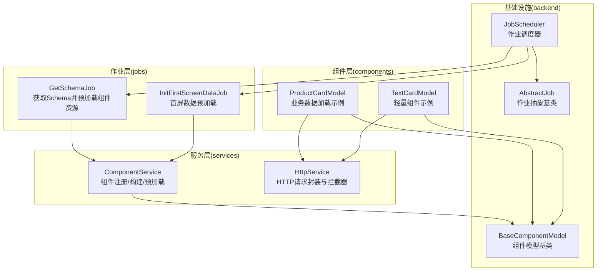
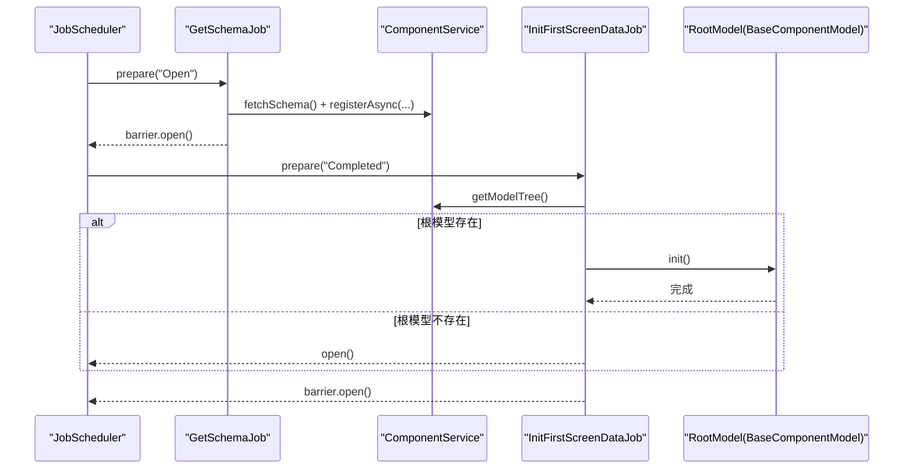
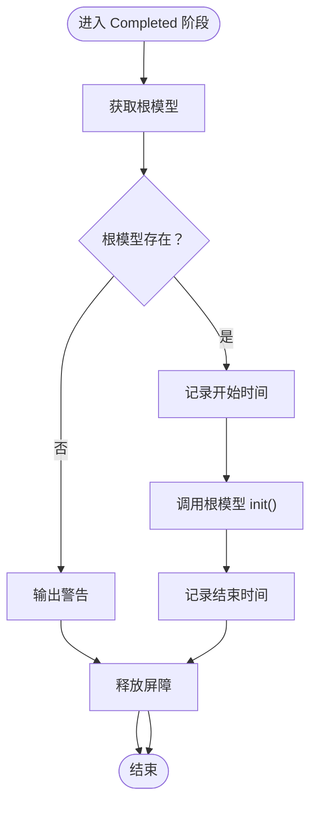
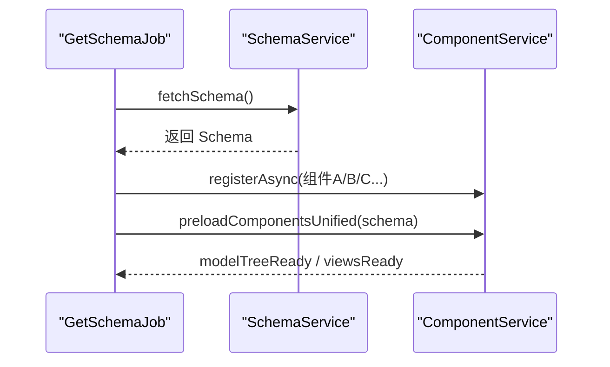
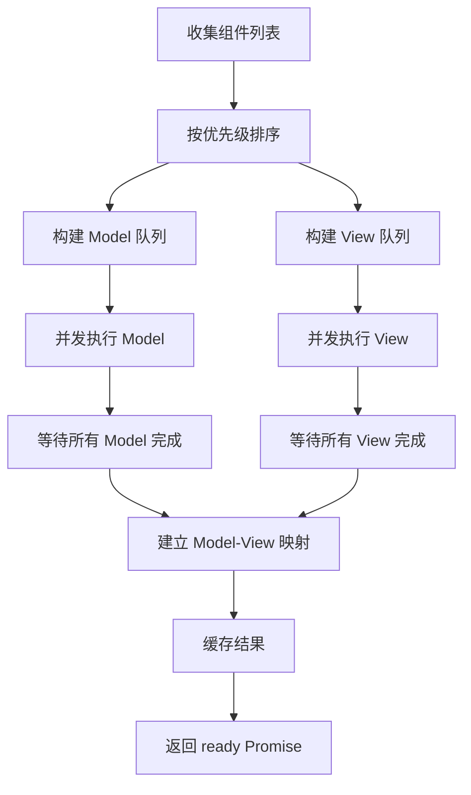
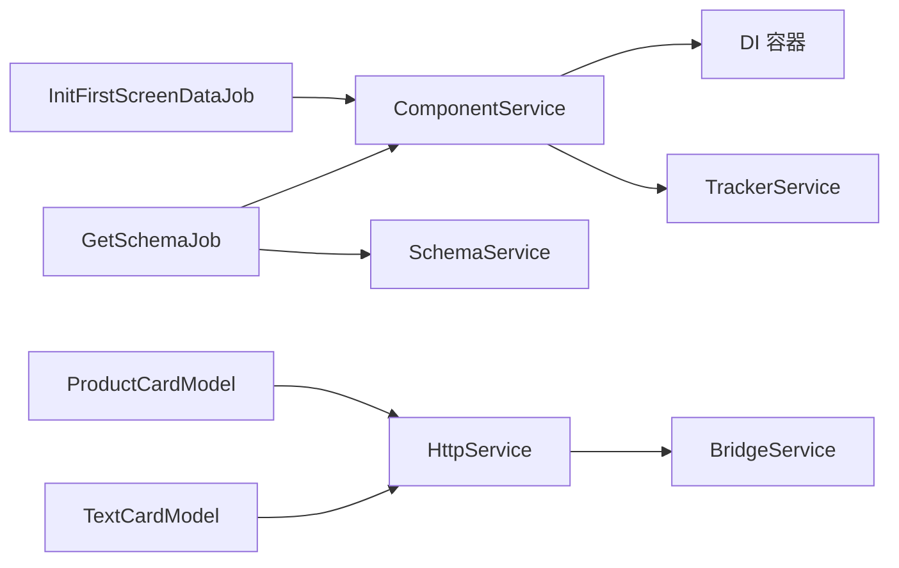

# InitFirstScreenDataJob

<cite>
**本文引用的文件**
- [init-first-screen-data-job.ts](file://packages/h5-builder/src/jobs/init-first-screen-data-job.ts)
- [get-schema-job.ts](file://packages/h5-builder/src/jobs/get-schema-job.ts)
- [lifecycle.ts](file://packages/h5-builder/src/jobs/lifecycle.ts)
- [abstract-job.ts](file://packages/h5-builder/src/bedrock/launch/abstract-job.ts)
- [job-scheduler.ts](file://packages/h5-builder/src/bedrock/launch/job-scheduler.ts)
- [component.service.ts](file://packages/h5-builder/src/services/component.service.ts)
- [http.service.ts](file://packages/h5-builder/src/services/http.service.ts)
- [product-card.model.ts](file://packages/h5-builder/src/components/product-card/product-card.model.ts)
- [text-card.model.ts](file://packages/h5-builder/src/components/text-card/text-card.model.ts)
- [model.ts](file://packages/h5-builder/src/bedrock/model.ts)
</cite>

## 目录
1. [简介](#简介)
2. [项目结构](#项目结构)
3. [核心组件](#核心组件)
4. [架构总览](#架构总览)
5. [详细组件分析](#详细组件分析)
6. [依赖分析](#依赖分析)
7. [性能考量](#性能考量)
8. [故障排查指南](#故障排查指南)
9. [结论](#结论)
10. [附录](#附录)

## 简介
本文件系统化文档化 InitFirstScreenDataJob 的首屏数据预加载机制，说明其如何在后台异步加载首屏关键数据，提升页面响应速度；解释其与 GetSchemaJob 的并行执行策略，通过独立 HTTP 请求获取业务数据，避免阻塞主渲染流程；阐述数据预加载的优先级调度、缓存策略和资源竞争控制；提供与 HttpService 集成的配置示例（请求并发数限制与超时设置）；说明加载完成后数据如何注入到对应组件模型中，以及失败时的降级展示方案；最后记录性能收益评估方法与监控指标设计。

## 项目结构
本项目采用分层与功能模块化的组织方式：
- jobs：页面生命周期任务集合，包含 InitFirstScreenDataJob、GetSchemaJob 等
- services：服务层，包含 ComponentService、HttpService 等
- components：组件模型与视图，如 ProductCardModel、TextCardModel 等
- bedrock：底层基础设施，包括 launch（任务调度）、async（屏障/并发）、model（模型基类）等

图表来源
- [get-schema-job.ts](file://packages/h5-builder/src/jobs/get-schema-job.ts#L1-L119)
- [init-first-screen-data-job.ts](file://packages/h5-builder/src/jobs/init-first-screen-data-job.ts#L1-L66)
- [component.service.ts](file://packages/h5-builder/src/services/component.service.ts#L1-L759)
- [http.service.ts](file://packages/h5-builder/src/services/http.service.ts#L1-L281)
- [abstract-job.ts](file://packages/h5-builder/src/bedrock/launch/abstract-job.ts#L1-L46)
- [job-scheduler.ts](file://packages/h5-builder/src/bedrock/launch/job-scheduler.ts#L1-L123)
- [model.ts](file://packages/h5-builder/src/bedrock/model.ts#L1-L206)

章节来源
- [lifecycle.ts](file://packages/h5-builder/src/jobs/lifecycle.ts#L1-L18)
- [jobs/index.ts](file://packages/h5-builder/src/jobs/index.ts#L1-L12)

## 核心组件
- InitFirstScreenDataJob：在页面生命周期“Completed”阶段后台异步初始化根模型数据，避免阻塞主渲染。
- GetSchemaJob：在“Open”阶段拉取远程 Schema，并注册组件异步加载器，预加载首屏所需组件资源。
- ComponentService：负责组件注册、构建树、异步加载与缓存、并发控制与优先级排序。
- HttpService：基于 JSBridge 的 fetch 封装，提供请求/响应/错误拦截器、超时与取消能力。
- BaseComponentModel：组件模型基类，提供响应式状态、生命周期钩子与资源清理。

章节来源
- [init-first-screen-data-job.ts](file://packages/h5-builder/src/jobs/init-first-screen-data-job.ts#L1-L66)
- [get-schema-job.ts](file://packages/h5-builder/src/jobs/get-schema-job.ts#L1-L119)
- [component.service.ts](file://packages/h5-builder/src/services/component.service.ts#L1-L759)
- [http.service.ts](file://packages/h5-builder/src/services/http.service.ts#L1-L281)
- [model.ts](file://packages/h5-builder/src/bedrock/model.ts#L1-L206)

## 架构总览
InitFirstScreenDataJob 与 GetSchemaJob 并行执行，前者专注于“Completed”阶段的数据初始化，后者专注于“Open”阶段的 Schema 拉取与组件资源预加载。两者通过 JobScheduler 协调推进页面生命周期，确保渲染主流程不受阻塞。

图表来源
- [job-scheduler.ts](file://packages/h5-builder/src/bedrock/launch/job-scheduler.ts#L65-L121)
- [get-schema-job.ts](file://packages/h5-builder/src/jobs/get-schema-job.ts#L48-L118)
- [init-first-screen-data-job.ts](file://packages/h5-builder/src/jobs/init-first-screen-data-job.ts#L48-L66)
- [component.service.ts](file://packages/h5-builder/src/services/component.service.ts#L745-L759)
- [model.ts](file://packages/h5-builder/src/bedrock/model.ts#L1-L206)

## 详细组件分析

### InitFirstScreenDataJob 分析
- 角色定位：在页面生命周期“Completed”阶段后台异步初始化根模型数据，避免阻塞主渲染。
- 关键行为：
  - 在“Completed”阶段调用 _whenCompleted，设置屏障，获取根模型并调用 init。
  - 若根模型不存在则发出警告并释放屏障，保证流程继续推进。
  - 使用 console.time/console.timeEnd 记录首屏数据拉取耗时。
- 与生命周期的关系：依赖 PageLifecycle 的 Completed 阶段，通过 AbstractJob 的 Barrier 机制与其他作业协调。

图表来源
- [init-first-screen-data-job.ts](file://packages/h5-builder/src/jobs/init-first-screen-data-job.ts#L48-L66)
- [abstract-job.ts](file://packages/h5-builder/src/bedrock/launch/abstract-job.ts#L11-L45)
- [lifecycle.ts](file://packages/h5-builder/src/jobs/lifecycle.ts#L1-L18)

章节来源
- [init-first-screen-data-job.ts](file://packages/h5-builder/src/jobs/init-first-screen-data-job.ts#L1-L66)
- [abstract-job.ts](file://packages/h5-builder/src/bedrock/launch/abstract-job.ts#L1-L46)
- [lifecycle.ts](file://packages/h5-builder/src/jobs/lifecycle.ts#L1-L18)

### GetSchemaJob 与组件预加载策略
- 角色定位：在“Open”阶段拉取远程 Schema，并注册组件异步加载器，预加载首屏所需组件资源。
- 关键行为：
  - 拉取 Schema 后注册多个组件的异步加载器，指定优先级与延迟范围，用于模拟网络与资源竞争。
  - 预加载组件资源（Model 与 View），并建立映射关系。
- 与 ComponentService 的协作：
  - registerAsync：注册组件的 Model/View 加载器与元数据（优先级、延迟范围）。
  - preloadComponentsUnified：统一队列并发加载，按优先级排序，先 Model 后 View，完成后建立映射。
  - 并发控制：Model 并发、View 并发、统一总并发，避免资源竞争导致主线程卡顿。

图表来源
- [get-schema-job.ts](file://packages/h5-builder/src/jobs/get-schema-job.ts#L48-L118)
- [component.service.ts](file://packages/h5-builder/src/services/component.service.ts#L281-L759)

章节来源
- [get-schema-job.ts](file://packages/h5-builder/src/jobs/get-schema-job.ts#L1-L119)
- [component.service.ts](file://packages/h5-builder/src/services/component.service.ts#L1-L759)

### ComponentService 的优先级调度与缓存策略
- 优先级调度：
  - 通过 ComponentMetadata.priority（critical/high/normal/low）对组件进行排序，优先级越高越早加载。
  - preloadComponentsUnified 先加载所有 Model，再加载所有 View，完成后统一建立映射。
- 缓存策略：
  - Model/View 缓存：首次加载后缓存，避免重复加载。
  - 加载失败降级：Model/View 加载失败时注册空实现或空视图，不影响其他组件加载。
- 并发控制与资源竞争：
  - 使用 Promise.race 与 Promise.all 控制并发，维持稳定的吞吐与响应性。
  - 统一队列并发（MODEL_CONCURRENCY、VIEW_CONCURRENCY、TOTAL_CONCURRENCY）平衡首屏资源竞争。

图表来源
- [component.service.ts](file://packages/h5-builder/src/services/component.service.ts#L622-L759)

章节来源
- [component.service.ts](file://packages/h5-builder/src/services/component.service.ts#L1-L759)

### 与 HttpService 的集成与配置
- HttpService 提供请求/响应/错误拦截器、超时与取消能力，支持 baseURL 与 token 注入。
- 在组件模型中通过依赖注入使用 HttpService 进行业务数据拉取（如 ProductCardModel）。
- 配置建议：
  - baseURL：统一前缀，减少重复拼接。
  - token：自动附加 Authorization 头。
  - timeout：根据业务场景设置合理超时，避免长时间阻塞。
  - 并发限制：结合 ComponentService 的并发策略，避免同时发起过多请求导致网络拥塞。

章节来源
- [http.service.ts](file://packages/h5-builder/src/services/http.service.ts#L1-L281)
- [product-card.model.ts](file://packages/h5-builder/src/components/product-card/product-card.model.ts#L1-L133)

### 数据注入与失败降级
- 数据注入：InitFirstScreenDataJob 在“Completed”阶段调用根模型 init，组件模型在 onInit 中通过 HttpService 拉取数据并更新响应式状态 data，随后视图基于 data 渲染。
- 失败降级：
  - ComponentService 在 Model/View 加载失败时注册空实现或空视图，避免阻塞其他组件。
  - 组件模型在初始化失败时仍能保持可用状态，避免整页崩溃。

章节来源
- [init-first-screen-data-job.ts](file://packages/h5-builder/src/jobs/init-first-screen-data-job.ts#L48-L66)
- [component.service.ts](file://packages/h5-builder/src/services/component.service.ts#L364-L465)
- [model.ts](file://packages/h5-builder/src/bedrock/model.ts#L1-L206)

## 依赖分析
- InitFirstScreenDataJob 依赖 ComponentService 获取根模型并触发初始化。
- GetSchemaJob 依赖 SchemaService 与 ComponentService，负责 Schema 拉取与组件资源预加载。
- ComponentService 依赖 DI 容器与 TrackerService，提供注册、构建、并发与缓存能力。
- HttpService 依赖 BridgeService，提供请求封装与拦截器。

图表来源
- [init-first-screen-data-job.ts](file://packages/h5-builder/src/jobs/init-first-screen-data-job.ts#L1-L66)
- [get-schema-job.ts](file://packages/h5-builder/src/jobs/get-schema-job.ts#L1-L119)
- [component.service.ts](file://packages/h5-builder/src/services/component.service.ts#L1-L759)
- [http.service.ts](file://packages/h5-builder/src/services/http.service.ts#L1-L281)
- [product-card.model.ts](file://packages/h5-builder/src/components/product-card/product-card.model.ts#L1-L133)
- [text-card.model.ts](file://packages/h5-builder/src/components/text-card/text-card.model.ts#L1-L21)

章节来源
- [job-scheduler.ts](file://packages/h5-builder/src/bedrock/launch/job-scheduler.ts#L1-L123)
- [abstract-job.ts](file://packages/h5-builder/src/bedrock/launch/abstract-job.ts#L1-L46)

## 性能考量
- 并发控制：ComponentService 使用 Promise.race 与 Promise.all 控制并发，避免资源竞争导致主线程卡顿；建议根据设备性能调整 MODEL_CONCURRENCY、VIEW_CONCURRENCY、TOTAL_CONCURRENCY。
- 优先级调度：按 critical/high/normal/low 排序，确保首屏关键组件优先加载，缩短首屏可交互时间。
- 缓存策略：Model/View 缓存避免重复加载；加载失败时注册空实现，保障整体稳定性。
- 监控指标：
  - 首屏数据拉取耗时（console.time）
  - 组件加载耗时（TrackerService 上报）
  - 请求成功率与平均响应时间（HttpService 拦截器统计）
  - 并发队列完成率与失败率（ComponentService 统计）

[本节为通用指导，不直接分析具体文件]

## 故障排查指南
- 根模型不存在：InitFirstScreenDataJob 在“Completed”阶段若无法获取根模型，会发出警告并释放屏障，确保流程继续推进。
- 组件加载失败：ComponentService 在 Model/View 加载失败时注册空实现或空视图，并上报错误事件，避免阻塞其他组件。
- 请求失败：HttpService 提供错误拦截器，可在拦截器中记录错误并进行降级处理。
- 调度问题：JobScheduler 在推进阶段前检查 shouldWait，若仍有作业等待则抛出断言，提示开发者检查屏障释放逻辑。

章节来源
- [init-first-screen-data-job.ts](file://packages/h5-builder/src/jobs/init-first-screen-data-job.ts#L48-L66)
- [component.service.ts](file://packages/h5-builder/src/services/component.service.ts#L364-L465)
- [http.service.ts](file://packages/h5-builder/src/services/http.service.ts#L98-L103)
- [job-scheduler.ts](file://packages/h5-builder/src/bedrock/launch/job-scheduler.ts#L93-L101)

## 结论
InitFirstScreenDataJob 通过在“Completed”阶段后台异步初始化首屏数据，配合 GetSchemaJob 的并行预加载策略，有效避免了首屏渲染阻塞。ComponentService 的优先级调度、缓存与并发控制进一步提升了资源利用效率与稳定性；HttpService 的拦截器与超时配置为数据加载提供了可控的运行时保障。整体方案在性能与可靠性之间取得良好平衡，适合在复杂前端页面中应用。

[本节为总结性内容，不直接分析具体文件]

## 附录

### 与 HttpService 集成的配置示例（路径引用）
- 基础配置与拦截器注册
  - [HttpService 构造与拦截器注册](file://packages/h5-builder/src/services/http.service.ts#L73-L103)
- 请求方法与超时设置
  - [request/get/post/put/delete 方法](file://packages/h5-builder/src/services/http.service.ts#L147-L249)
- 组件模型中的数据加载示例
  - [ProductCardModel.onInit 中的异步数据加载](file://packages/h5-builder/src/components/product-card/product-card.model.ts#L45-L101)

### 生命周期与作业协调（路径引用）
- 页面生命周期枚举
  - [PageLifecycle](file://packages/h5-builder/src/jobs/lifecycle.ts#L1-L18)
- 作业抽象与屏障
  - [AbstractJob](file://packages/h5-builder/src/bedrock/launch/abstract-job.ts#L1-L46)
- 作业调度器
  - [JobScheduler](file://packages/h5-builder/src/bedrock/launch/job-scheduler.ts#L1-L123)