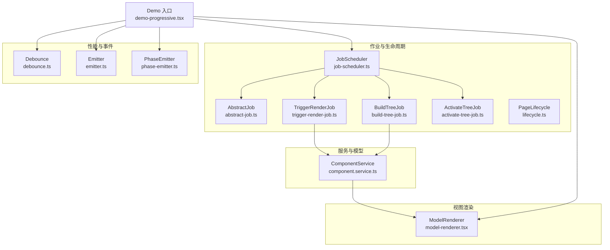
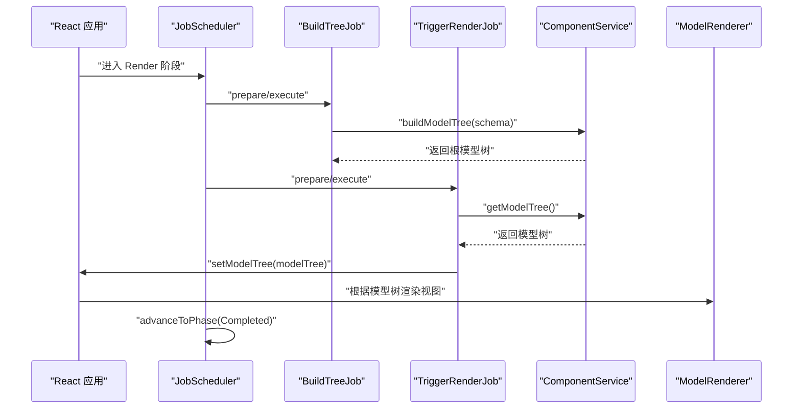
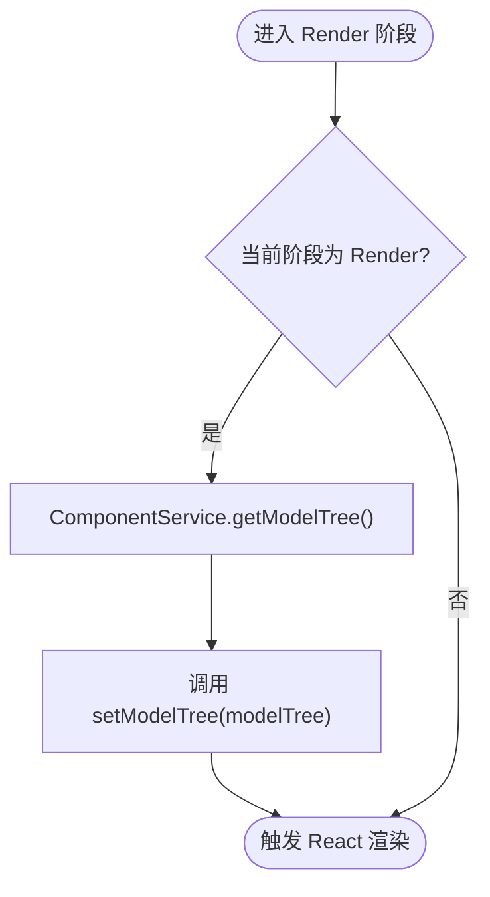
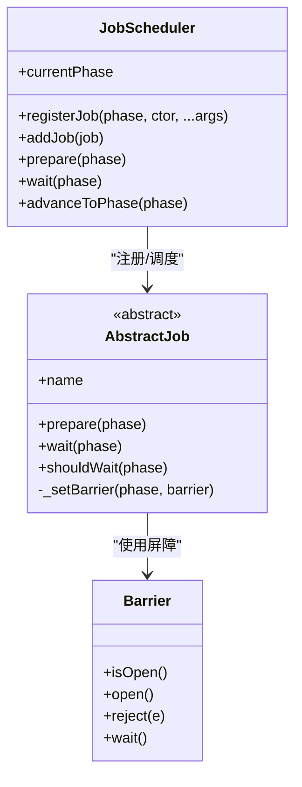
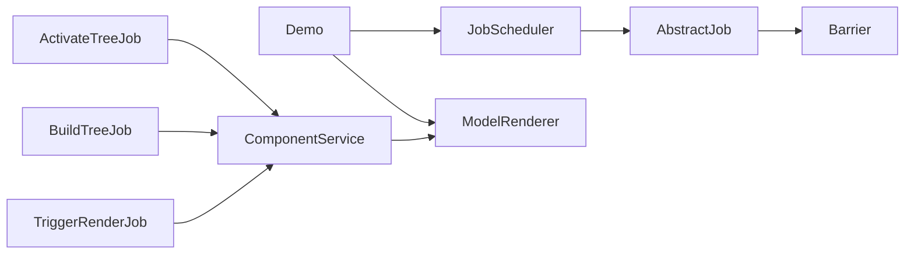

# TriggerRenderJob

<cite>
**本文引用的文件**
- [trigger-render-job.ts](file://packages/h5-builder/src/jobs/trigger-render-job.ts)
- [build-tree-job.ts](file://packages/h5-builder/src/jobs/build-tree-job.ts)
- [activate-tree-job.ts](file://packages/h5-builder/src/jobs/activate-tree-job.ts)
- [lifecycle.ts](file://packages/h5-builder/src/jobs/lifecycle.ts)
- [job-scheduler.ts](file://packages/h5-builder/src/bedrock/launch/job-scheduler.ts)
- [abstract-job.ts](file://packages/h5-builder/src/bedrock/launch/abstract-job.ts)
- [barrier.ts](file://packages/h5-builder/src/bedrock/async/barrier.ts)
- [component.service.ts](file://packages/h5-builder/src/services/component.service.ts)
- [model-renderer.tsx](file://packages/h5-builder/src/components/model-renderer.tsx)
- [debounce.ts](file://packages/h5-builder/src/bedrock/function/debounce.ts)
- [demo-progressive.tsx](file://packages/h5-builder/src/demo-progressive.tsx)
- [emitter.ts](file://packages/h5-builder/src/bedrock/event/emitter.ts)
- [phase-emitter.ts](file://packages/h5-builder/src/bedrock/event/phase-emitter.ts)
- [index.ts](file://packages/h5-builder/src/jobs/index.ts)
</cite>

## 目录
1. [简介](#简介)
2. [项目结构](#项目结构)
3. [核心组件](#核心组件)
4. [架构总览](#架构总览)
5. [详细组件分析](#详细组件分析)
6. [依赖分析](#依赖分析)
7. [性能考虑](#性能考虑)
8. [故障排查指南](#故障排查指南)
9. [结论](#结论)
10. [附录](#附录)

## 简介
本文件围绕 TriggerRenderJob 的视图触发机制展开，系统性阐述其如何与 React 渲染循环集成、如何通过 Model 树构建完成后的末位执行特性确保渲染时机正确、如何与 JobScheduler 生命周期配合实现“渲染阶段”的末位触发、以及如何通过事件总线/状态管理通知视图层更新。同时，文档覆盖与 React Concurrent Mode 兼容的异步渲染支持思路（结合 useTransition 的集成方式）、渲染性能优化（防抖、批量更新、懒加载占位策略），并给出常见渲染卡顿问题的排查路径。

## 项目结构
TriggerRenderJob 所属的渐进式渲染体系由“作业（Job）+ 生命周期（Lifecycle）+ 服务（Service）+ 视图渲染器（ModelRenderer）”构成。关键文件分布如下：
- 作业与生命周期：trigger-render-job.ts、build-tree-job.ts、activate-tree-job.ts、lifecycle.ts、job-scheduler.ts、abstract-job.ts、barrier.ts
- 服务与模型：component.service.ts（组件注册、异步加载、模型树构建）
- 视图渲染器：model-renderer.tsx（根据 Model 类型渲染对应 View）
- 性能与事件：debounce.ts、emitter.ts、phase-emitter.ts
- 示例入口：demo-progressive.tsx（驱动 JobScheduler，串联各阶段）

图表来源
- [job-scheduler.ts](file://packages/h5-builder/src/bedrock/launch/job-scheduler.ts#L1-L123)
- [abstract-job.ts](file://packages/h5-builder/src/bedrock/launch/abstract-job.ts#L1-L46)
- [trigger-render-job.ts](file://packages/h5-builder/src/jobs/trigger-render-job.ts#L1-L44)
- [build-tree-job.ts](file://packages/h5-builder/src/jobs/build-tree-job.ts#L1-L59)
- [activate-tree-job.ts](file://packages/h5-builder/src/jobs/activate-tree-job.ts#L1-L56)
- [lifecycle.ts](file://packages/h5-builder/src/jobs/lifecycle.ts#L1-L18)
- [component.service.ts](file://packages/h5-builder/src/services/component.service.ts#L1-L732)
- [model-renderer.tsx](file://packages/h5-builder/src/components/model-renderer.tsx#L1-L105)
- [debounce.ts](file://packages/h5-builder/src/bedrock/function/debounce.ts#L1-L169)
- [emitter.ts](file://packages/h5-builder/src/bedrock/event/emitter.ts#L1-L163)
- [phase-emitter.ts](file://packages/h5-builder/src/bedrock/event/phase-emitter.ts#L1-L210)
- [demo-progressive.tsx](file://packages/h5-builder/src/demo-progressive.tsx#L1-L262)

章节来源
- [trigger-render-job.ts](file://packages/h5-builder/src/jobs/trigger-render-job.ts#L1-L44)
- [build-tree-job.ts](file://packages/h5-builder/src/jobs/build-tree-job.ts#L1-L59)
- [activate-tree-job.ts](file://packages/h5-builder/src/jobs/activate-tree-job.ts#L1-L56)
- [lifecycle.ts](file://packages/h5-builder/src/jobs/lifecycle.ts#L1-L18)
- [job-scheduler.ts](file://packages/h5-builder/src/bedrock/launch/job-scheduler.ts#L1-L123)
- [abstract-job.ts](file://packages/h5-builder/src/bedrock/launch/abstract-job.ts#L1-L46)
- [barrier.ts](file://packages/h5-builder/src/bedrock/async/barrier.ts#L1-L59)
- [component.service.ts](file://packages/h5-builder/src/services/component.service.ts#L1-L732)
- [model-renderer.tsx](file://packages/h5-builder/src/components/model-renderer.tsx#L1-L105)
- [debounce.ts](file://packages/h5-builder/src/bedrock/function/debounce.ts#L1-L169)
- [emitter.ts](file://packages/h5-builder/src/bedrock/event/emitter.ts#L1-L163)
- [phase-emitter.ts](file://packages/h5-builder/src/bedrock/event/phase-emitter.ts#L1-L210)
- [demo-progressive.tsx](file://packages/h5-builder/src/demo-progressive.tsx#L1-L262)

## 核心组件
- TriggerRenderJob：在 Render 阶段末位执行，通过注入的回调将当前模型树设置到视图层，从而触发 React 渲染。
- BuildTreeJob：在 Prepare 阶段构建模型树（逻辑树），确保模型树完整后再进入 Render 阶段。
- ActivateTreeJob：在 Render 阶段激活组件树（副作用，非渲染），用于埋点、定时器等。
- JobScheduler：按生命周期阶段注册并调度作业，支持“等待/屏障”机制保证阶段顺序。
- ComponentService：负责组件注册、异步加载、模型树构建与缓存；提供 getModelTree 供 TriggerRenderJob 使用。
- ModelRenderer：根据 Model 类型渲染对应 View，包含占位组件处理。
- Debounce：提供防抖工具，可用于合并高频更新请求。
- Emitter/PhaseEmitter：事件总线与阶段事件，可用于跨模块通知与补发。

章节来源
- [trigger-render-job.ts](file://packages/h5-builder/src/jobs/trigger-render-job.ts#L1-L44)
- [build-tree-job.ts](file://packages/h5-builder/src/jobs/build-tree-job.ts#L1-L59)
- [activate-tree-job.ts](file://packages/h5-builder/src/jobs/activate-tree-job.ts#L1-L56)
- [job-scheduler.ts](file://packages/h5-builder/src/bedrock/launch/job-scheduler.ts#L1-L123)
- [abstract-job.ts](file://packages/h5-builder/src/bedrock/launch/abstract-job.ts#L1-L46)
- [barrier.ts](file://packages/h5-builder/src/bedrock/async/barrier.ts#L1-L59)
- [component.service.ts](file://packages/h5-builder/src/services/component.service.ts#L1-L732)
- [model-renderer.tsx](file://packages/h5-builder/src/components/model-renderer.tsx#L1-L105)
- [debounce.ts](file://packages/h5-builder/src/bedrock/function/debounce.ts#L1-L169)
- [emitter.ts](file://packages/h5-builder/src/bedrock/event/emitter.ts#L1-L163)
- [phase-emitter.ts](file://packages/h5-builder/src/bedrock/event/phase-emitter.ts#L1-L210)

## 架构总览
TriggerRenderJob 的职责是在“渲染阶段”末尾触发 React 渲染，确保模型树构建完成且视图资源就绪。其与 React 渲染循环的集成方式如下：
- React 层通过 setModelTree 将模型树注入到视图层，ModelRenderer 根据 Model 类型选择对应 View 组件进行渲染。
- TriggerRenderJob 通过 ComponentService.getModelTree 获取当前模型树，并调用 setModelTree 触发 React 更新。
- JobScheduler 在 Render 阶段推进时，先执行 BuildTreeJob（确保模型树构建完成），再执行 TriggerRenderJob（触发渲染），最后执行 ActivateTreeJob（激活副作用）。

图表来源
- [demo-progressive.tsx](file://packages/h5-builder/src/demo-progressive.tsx#L120-L170)
- [trigger-render-job.ts](file://packages/h5-builder/src/jobs/trigger-render-job.ts#L1-L44)
- [build-tree-job.ts](file://packages/h5-builder/src/jobs/build-tree-job.ts#L1-L59)
- [component.service.ts](file://packages/h5-builder/src/services/component.service.ts#L718-L732)
- [model-renderer.tsx](file://packages/h5-builder/src/components/model-renderer.tsx#L1-L105)

## 详细组件分析

### TriggerRenderJob 分析
- 触发时机：仅在 Render 阶段执行，确保模型树构建完成后再触发渲染。
- 触发方式：从 ComponentService 获取模型树，调用注入的 setModelTree 回调，将模型树注入到 React 层，从而触发渲染。
- 末位执行特性：通过 JobScheduler 的阶段推进顺序保证在 Render 阶段末尾执行，避免在模型树尚未构建完成时触发渲染。

图表来源
- [trigger-render-job.ts](file://packages/h5-builder/src/jobs/trigger-render-job.ts#L1-L44)
- [component.service.ts](file://packages/h5-builder/src/services/component.service.ts#L718-L732)

章节来源
- [trigger-render-job.ts](file://packages/h5-builder/src/jobs/trigger-render-job.ts#L1-L44)
- [component.service.ts](file://packages/h5-builder/src/services/component.service.ts#L718-L732)

### BuildTreeJob 与模型树构建
- 在 Prepare 阶段执行，读取 Schema 并调用 ComponentService.buildModelTree 构建模型树。
- 通过日志与计时输出构建过程，便于性能观测与问题定位。

章节来源
- [build-tree-job.ts](file://packages/h5-builder/src/jobs/build-tree-job.ts#L1-L59)
- [component.service.ts](file://packages/h5-builder/src/services/component.service.ts#L132-L156)

### ActivateTreeJob 与副作用激活
- 在 Render 阶段执行，获取当前模型树并调用 activate 方法，用于上报埋点、启动定时器等副作用。
- 不负责实际 DOM 渲染，仅负责渲染完成后的副作用处理。

章节来源
- [activate-tree-job.ts](file://packages/h5-builder/src/jobs/activate-tree-job.ts#L1-L56)
- [component.service.ts](file://packages/h5-builder/src/services/component.service.ts#L718-L732)

### JobScheduler 与生命周期
- JobScheduler 按阶段注册作业，支持 shouldWait/wait/advanceToPhase 等机制，确保阶段顺序与依赖满足。
- AbstractJob 提供 Barrier 机制，作业可通过 Barrier 控制等待条件。
- Barrier 支持 open/reject/wait，用于异步任务的完成信号与错误传播。

图表来源
- [job-scheduler.ts](file://packages/h5-builder/src/bedrock/launch/job-scheduler.ts#L1-L123)
- [abstract-job.ts](file://packages/h5-builder/src/bedrock/launch/abstract-job.ts#L1-L46)
- [barrier.ts](file://packages/h5-builder/src/bedrock/async/barrier.ts#L1-L59)

章节来源
- [job-scheduler.ts](file://packages/h5-builder/src/bedrock/launch/job-scheduler.ts#L1-L123)
- [abstract-job.ts](file://packages/h5-builder/src/bedrock/launch/abstract-job.ts#L1-L46)
- [barrier.ts](file://packages/h5-builder/src/bedrock/async/barrier.ts#L1-L59)

### ModelRenderer 与视图渲染
- 通过 Model-View 映射表将模型类型与视图组件关联。
- 支持占位组件（错误、加载、空状态）处理，保证在异步加载失败或未就绪时仍能渲染稳定 UI。
- 容器模型默认递归渲染子节点，形成树形视图结构。

章节来源
- [model-renderer.tsx](file://packages/h5-builder/src/components/model-renderer.tsx#L1-L105)

### 与 React Concurrent Mode 的异步渲染支持
- 本仓库未直接提供 useTransition 的集成示例。但基于现有架构，可在 Demo 入口中使用 React 的 useTransition 或 Suspense 机制，将高开销的渲染任务（如大量异步组件加载）标记为可中断，从而与 JobScheduler 的阶段化推进形成互补。
- 建议在 Render 阶段末尾触发渲染时，将模型树设置操作包裹在 useTransition 中，使渲染具备可中断能力，避免主线程阻塞。

章节来源
- [demo-progressive.tsx](file://packages/h5-builder/src/demo-progressive.tsx#L1-L262)

### 事件总线与状态管理通知
- Emitter 提供事件发射与监听机制，适合模块间解耦通知。
- PhaseEmitter 提供阶段事件与“状态补发”，适合监听生命周期状态变化并在状态到达时触发回调。
- 可通过 PhaseEmitter 在 RenderReady/Render/Completed 等阶段发出事件，通知视图层进行更新或切换占位状态。

章节来源
- [emitter.ts](file://packages/h5-builder/src/bedrock/event/emitter.ts#L1-L163)
- [phase-emitter.ts](file://packages/h5-builder/src/bedrock/event/phase-emitter.ts#L1-L210)

## 依赖分析
- TriggerRenderJob 依赖 ComponentService 获取模型树，并通过 setModelTree 回调触发 React 更新。
- BuildTreeJob 依赖 SchemaService 与 ComponentService，在 Prepare 阶段构建模型树。
- ActivateTreeJob 依赖 ComponentService 获取模型树并激活副作用。
- JobScheduler 依赖 AbstractJob 与 Barrier，保证阶段顺序与等待条件。

图表来源
- [trigger-render-job.ts](file://packages/h5-builder/src/jobs/trigger-render-job.ts#L1-L44)
- [build-tree-job.ts](file://packages/h5-builder/src/jobs/build-tree-job.ts#L1-L59)
- [activate-tree-job.ts](file://packages/h5-builder/src/jobs/activate-tree-job.ts#L1-L56)
- [job-scheduler.ts](file://packages/h5-builder/src/bedrock/launch/job-scheduler.ts#L1-L123)
- [abstract-job.ts](file://packages/h5-builder/src/bedrock/launch/abstract-job.ts#L1-L46)
- [barrier.ts](file://packages/h5-builder/src/bedrock/async/barrier.ts#L1-L59)
- [component.service.ts](file://packages/h5-builder/src/services/component.service.ts#L1-L732)
- [model-renderer.tsx](file://packages/h5-builder/src/components/model-renderer.tsx#L1-L105)
- [demo-progressive.tsx](file://packages/h5-builder/src/demo-progressive.tsx#L1-L262)

章节来源
- [index.ts](file://packages/h5-builder/src/jobs/index.ts#L1-L10)

## 性能考虑
- 防抖机制：使用 debounce 合并高频更新请求，降低渲染压力。适用于在短时间内多次触发的 UI 更新场景。
- 批量更新：通过 JobScheduler 的阶段化推进，将多个作业合并到同一阶段执行，减少 React 的更新次数。
- 懒加载与占位策略：ComponentService 支持异步组件加载与延迟加载（delayRange），并在加载失败或未就绪时返回占位组件，保证首屏稳定与体验。
- 并发控制：ComponentService 的统一队列并发加载（TOTAL_CONCURRENCY）与 Promise.race 控制，避免过多并发导致主线程拥塞。
- 日志与计时：BuildTreeJob 与 Demo 中的日志与计时输出，有助于定位性能瓶颈。

章节来源
- [debounce.ts](file://packages/h5-builder/src/bedrock/function/debounce.ts#L1-L169)
- [component.service.ts](file://packages/h5-builder/src/services/component.service.ts#L624-L732)
- [build-tree-job.ts](file://packages/h5-builder/src/jobs/build-tree-job.ts#L1-L59)
- [demo-progressive.tsx](file://packages/h5-builder/src/demo-progressive.tsx#L1-L262)

## 故障排查指南
- 渲染未触发
  - 检查是否在 Render 阶段执行 TriggerRenderJob；确认 setModelTree 回调是否正确注入。
  - 确认 ComponentService.getModelTree 返回非空模型树。
- 模型树未构建完成
  - 检查 BuildTreeJob 是否在 Prepare 阶段完成；确认 SchemaService 提供有效 Schema。
- 渲染卡顿
  - 使用日志与计时定位瓶颈；检查是否存在过多并发加载或未使用的占位组件。
  - 调整 TOTAL_CONCURRENCY 与 delayRange，观察效果。
- 副作用未生效
  - 确认 ActivateTreeJob 在 Render 阘段执行；检查模型树 activate 是否被调用。
- 事件未触发
  - 使用 PhaseEmitter/Emitter 检查事件监听与触发顺序；注意状态补发可能带来的依赖顺序问题。

章节来源
- [trigger-render-job.ts](file://packages/h5-builder/src/jobs/trigger-render-job.ts#L1-L44)
- [build-tree-job.ts](file://packages/h5-builder/src/jobs/build-tree-job.ts#L1-L59)
- [activate-tree-job.ts](file://packages/h5-builder/src/jobs/activate-tree-job.ts#L1-L56)
- [phase-emitter.ts](file://packages/h5-builder/src/bedrock/event/phase-emitter.ts#L1-L210)
- [emitter.ts](file://packages/h5-builder/src/bedrock/event/emitter.ts#L1-L163)

## 结论
TriggerRenderJob 通过在 Render 阶段末位执行，确保模型树构建完成后才触发 React 渲染，与 JobScheduler 的阶段化推进机制高度契合。结合 ComponentService 的异步加载与占位策略、ModelRenderer 的映射与容器渲染能力，以及 Debounce/Emitter/PhaseEmitter 等性能与事件工具，可实现渐进式、可中断、稳定的视图渲染。建议在 React Concurrent Mode 下进一步引入 useTransition/Suspense，以提升交互流畅度与用户体验。

## 附录
- 与 React 渲染循环集成的关键点
  - setModelTree 回调作为触发器，将模型树注入 React，ModelRenderer 根据模型类型渲染对应视图。
  - Render 阶段末位执行，确保模型树构建完成。
- 与 React Concurrent Mode 的兼容建议
  - 在渲染触发处使用 useTransition/Suspense，将高开销渲染标记为可中断。
  - 保持作业阶段顺序不变，仅在渲染触发环节引入异步渲染能力。