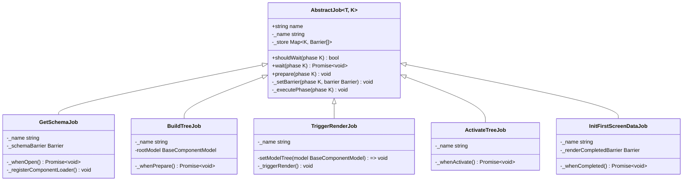

# 任务类型

<cite>
**本文档引用的文件**
- [get-schema-job.ts](file://packages/h5-builder/src/jobs/get-schema-job.ts)
- [build-tree-job.ts](file://packages/h5-builder/src/jobs/build-tree-job.ts)
- [trigger-render-job.ts](file://packages/h5-builder/src/jobs/trigger-render-job.ts)
- [activate-tree-job.ts](file://packages/h5-builder/src/jobs/activate-tree-job.ts)
- [init-first-screen-data-job.ts](file://packages/h5-builder/src/jobs/init-first-screen-data-job.ts)
- [abstract-job.ts](file://packages/h5-builder/src/bedrock/launch/abstract-job.ts)
- [lifecycle.ts](file://packages/h5-builder/src/jobs/lifecycle.ts)
- [component.service.ts](file://packages/h5-builder/src/services/component.service.ts)
- [schema.service.ts](file://packages/h5-builder/src/services/schema.service.ts)
- [job-scheduler.test.ts](file://packages/h5-builder/src/bedrock/launch/job-scheduler.test.ts)
</cite>

## 目录
1. [简介](#简介)
2. [核心任务类型分析](#核心任务类型分析)
3. [AbstractJob 基类生命周期钩子](#abstractjob-基类生命周期钩子)
4. [任务间依赖关系](#任务间依赖关系)
5. [任务执行流程与生命周期集成](#任务执行流程与生命周期集成)
6. [性能与异步处理机制](#性能与异步处理机制)
7. [总结](#总结)

## 简介
本文档详细描述了 H5 构建器中的各类 Job 任务，重点分析 `GetSchemaJob`、`BuildTreeJob`、`TriggerRenderJob`、`ActivateTreeJob` 和 `InitFirstScreenDataJob` 的职责与实现机制。文档解释了 `AbstractJob` 基类提供的 `prepare`、`wait`、`shouldWait` 等生命周期钩子如何被子类继承和重写，并说明了各任务如何与系统服务和 React 渲染机制集成。

**Section sources**
- [get-schema-job.ts](file://packages/h5-builder/src/jobs/get-schema-job.ts#L1-L119)
- [build-tree-job.ts](file://packages/h5-builder/src/jobs/build-tree-job.ts#L1-L59)

## 核心任务类型分析

### GetSchemaJob 任务
`GetSchemaJob` 负责在页面打开阶段从远程获取页面的 Schema 数据。该任务通过注入的 `SchemaService` 服务调用 `fetchSchema` 方法异步获取 Schema。在获取 Schema 后，该任务会立即注册所有组件的异步加载器，为后续的组件预加载做准备。此任务在 `PageLifecycle.Open` 阶段执行，并通过 `Barrier` 机制确保任务完成。

**Section sources**
- [get-schema-job.ts](file://packages/h5-builder/src/jobs/get-schema-job.ts#L13-L119)
- [schema.service.ts](file://packages/h5-builder/src/services/schema.service.ts#L1-L38)

### BuildTreeJob 任务
`BuildTreeJob` 负责将获取到的 Schema 数据转换为组件模型树。该任务在 `PageLifecycle.Prepare` 阶段执行，通过 `SchemaService` 获取已缓存的 Schema 数据，并调用 `ComponentService` 的 `buildModelTree` 方法构建完整的模型树。构建过程是递归的，会根据 Schema 中的 `children` 字段创建父子组件关系，最终形成一个完整的组件树结构。

**Section sources**
- [build-tree-job.ts](file://packages/h5-builder/src/jobs/build-tree-job.ts#L12-L59)
- [component.service.ts](file://packages/h5-builder/src/services/component.service.ts#L724-L728)

### TriggerRenderJob 任务
`TriggerRenderJob` 负责与 React 渲染机制集成，触发视图更新。该任务在 `PageLifecycle.Render` 阶段执行，通过构造函数注入的 `setModelTree` 回调函数，将构建好的模型树传递给外部的 React 组件，从而触发 React 的重新渲染。这种设计实现了 Job 任务与 UI 框架的解耦，使任务逻辑不直接依赖于具体的 UI 实现。

**Section sources**
- [trigger-render-job.ts](file://packages/h5-builder/src/jobs/trigger-render-job.ts#L14-L44)
- [component.service.ts](file://packages/h5-builder/src/services/component.service.ts#L730-L732)

### ActivateTreeJob 任务
`ActivateTreeJob` 负责在页面渲染完成后激活组件的生命周期。该任务在 `PageLifecycle.Render` 阶段执行，通过 `ComponentService` 获取模型树，并调用根模型的 `activate` 方法。此方法会递归激活所有子组件，执行如上报埋点、启动定时器等副作用操作。需要注意的是，此任务仅触发组件的激活逻辑，不负责实际的 DOM 渲染。

**Section sources**
- [activate-tree-job.ts](file://packages/h5-builder/src/jobs/activate-tree-job.ts#L15-L56)
- [component.service.ts](file://packages/h5-builder/src/services/component.service.ts#L730-L732)

### InitFirstScreenDataJob 任务
`InitFirstScreenDataJob` 负责在后台异步初始化首屏数据。该任务在 `PageLifecycle.Completed` 阶段执行，通过 `ComponentService` 获取模型树，并调用根模型的 `init` 方法。此方法会触发首屏数据的拉取操作，如 API 请求等。任务使用 `Barrier` 机制确保在数据初始化完成后才继续后续流程，实现了数据加载与页面渲染的分离。

**Section sources**
- [init-first-screen-data-job.ts](file://packages/h5-builder/src/jobs/init-first-screen-data-job.ts#L11-L67)
- [component.service.ts](file://packages/h5-builder/src/services/component.service.ts#L730-L732)

## AbstractJob 基类生命周期钩子

### AbstractJob 基类设计
`AbstractJob` 是所有 Job 任务的基类，定义了统一的生命周期管理机制。它通过泛型 `T` 和 `K extends T` 支持不同的生命周期枚举类型。基类维护了一个 `Map<K, Barrier[]>` 类型的 `_store`，用于存储每个生命周期阶段的 `Barrier`（屏障）对象，实现任务的等待和同步机制。

**Diagram sources**
- [abstract-job.ts](file://packages/h5-builder/src/bedrock/launch/abstract-job.ts#L3-L45)
- [get-schema-job.ts](file://packages/h5-builder/src/jobs/get-schema-job.ts#L13-L119)
- [build-tree-job.ts](file://packages/h5-builder/src/jobs/build-tree-job.ts#L12-L59)
- [trigger-render-job.ts](file://packages/h5-builder/src/jobs/trigger-render-job.ts#L14-L44)
- [activate-tree-job.ts](file://packages/h5-builder/src/jobs/activate-tree-job.ts#L15-L56)
- [init-first-screen-data-job.ts](file://packages/h5-builder/src/jobs/init-first-screen-data-job.ts#L11-L67)

### 生命周期钩子方法
`AbstractJob` 基类提供了三个核心的生命周期钩子方法：

- **prepare(phase: K)**：准备方法，用于触发指定生命周期阶段的任务执行。该方法会调用受保护的 `_executePhase` 方法，由子类实现具体逻辑。
- **wait(phase: K)**：等待方法，返回一个 Promise，当指定阶段的所有 `Barrier` 都打开时，Promise 才会 resolve。这允许任务调度器等待某个阶段完成。
- **shouldWait(phase: K)**：判断方法，检查指定阶段是否有需要等待的 `Barrier`，用于优化等待逻辑。

子类通过重写 `_executePhase` 方法来定义在不同生命周期阶段的具体行为，实现了灵活的任务扩展机制。

**Section sources**
- [abstract-job.ts](file://packages/h5-builder/src/bedrock/launch/abstract-job.ts#L11-L45)

## 任务间依赖关系

### 依赖关系示例
任务之间存在明确的依赖关系，这些关系通过生命周期阶段和共享服务来实现：

- `BuildTreeJob` 依赖 `GetSchemaJob` 输出的 Schema 数据。`GetSchemaJob` 在 `Open` 阶段获取 Schema 并存储在 `SchemaService` 中，`BuildTreeJob` 在 `Prepare` 阶段从 `SchemaService` 中读取该数据。
- `TriggerRenderJob` 依赖 `BuildTreeJob` 构建的模型树。`BuildTreeJob` 将模型树存储在 `ComponentService` 中，`TriggerRenderJob` 在 `Render` 阶段读取并触发渲染。
- `ActivateTreeJob` 和 `InitFirstScreenDataJob` 都依赖 `BuildTreeJob` 构建的模型树，分别在渲染后和数据填充阶段使用。

**Diagram sources**
- [get-schema-job.ts](file://packages/h5-builder/src/jobs/get-schema-job.ts#L13-L119)
- [build-tree-job.ts](file://packages/h5-builder/src/jobs/build-tree-job.ts#L12-L59)
- [trigger-render-job.ts](file://packages/h5-builder/src/jobs/trigger-render-job.ts#L14-L44)
- [activate-tree-job.ts](file://packages/h5-builder/src/jobs/activate-tree-job.ts#L15-L56)
- [init-first-screen-data-job.ts](file://packages/h5-builder/src/jobs/init-first-screen-data-job.ts#L11-L67)
- [lifecycle.ts](file://packages/h5-builder/src/jobs/lifecycle.ts#L1-L18)

## 任务执行流程与生命周期集成

### 生命周期阶段
系统定义了 `PageLifecycle` 枚举，明确了任务执行的各个阶段：

- **Open**：页面打开，获取 Schema
- **LoadComponentLogic**：加载组件逻辑
- **Prepare**：构建模型树
- **RenderReady**：模型树和视图资源准备完成
- **Render**：启动渲染
- **Completed**：首屏数据填充
- **Idle**：空闲阶段

每个 Job 任务根据其职责，在特定的生命周期阶段执行相应的逻辑。

### 任务调度流程
任务通过 `JobScheduler` 进行调度。调度器根据当前生命周期阶段调用 `prepare` 方法触发任务执行，并通过 `wait` 方法等待任务完成。测试文件 `job-scheduler.test.ts` 展示了任务调度的基本流程，验证了任务在不同生命周期阶段的正确执行顺序。

**Section sources**
- [lifecycle.ts](file://packages/h5-builder/src/jobs/lifecycle.ts#L1-L18)
- [job-scheduler.test.ts](file://packages/h5-builder/src/bedrock/launch/job-scheduler.test.ts#L1-L123)

## 性能与异步处理机制

### 异步加载与并发控制
`ComponentService` 实现了复杂的异步加载机制，支持组件的 Model 和 View 分离加载。通过 `preloadComponentsUnified` 方法，系统可以并发加载所有必要的组件资源，并通过 `processPromiseQueue` 方法实现并发控制，避免过多的网络请求同时发生。

### Barrier 同步机制
`Barrier` 类实现了简单的同步原语，用于协调异步任务。一个 `Barrier` 最初是关闭的，当调用 `open` 方法后变为打开状态。`wait` 方法返回一个 Promise，只有在 `Barrier` 打开时才会 resolve。这种机制被广泛用于确保任务在必要资源准备就绪后才继续执行。

**Section sources**
- [component.service.ts](file://packages/h5-builder/src/services/component.service.ts#L632-L696)
- [barrier.ts](file://packages/h5-builder/src/bedrock/async/barrier.ts#L1-L43)

## 总结
本文档详细分析了 H5 构建器中的核心 Job 任务及其工作机制。通过 `AbstractJob` 基类提供的生命周期钩子，系统实现了灵活的任务扩展和调度机制。各任务通过共享服务（如 `SchemaService` 和 `ComponentService`）进行协作，形成了清晰的依赖关系和执行流程。异步加载、并发控制和 `Barrier` 同步机制共同保证了系统的高性能和可靠性。