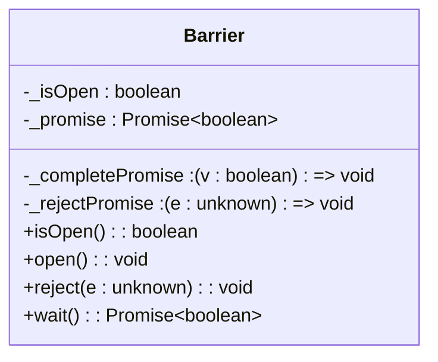
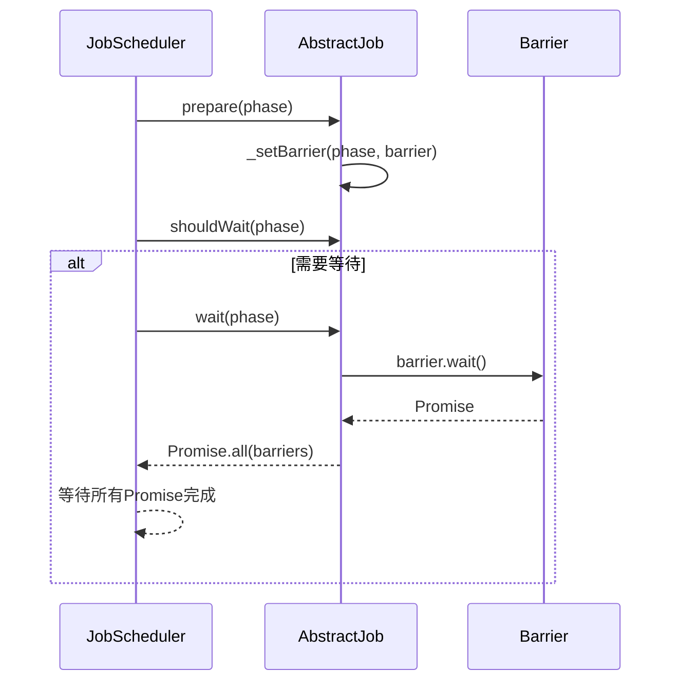

# Barrier同步机制

<cite>
**本文档中引用的文件**  
- [barrier.ts](file://packages/h5-builder/src/bedrock/async/barrier.ts)
- [abstract-job.ts](file://packages/h5-builder/src/bedrock/launch/abstract-job.ts)
- [job-scheduler.ts](file://packages/h5-builder/src/bedrock/launch/job-scheduler.ts)
- [init-first-screen-data-job.ts](file://packages/h5-builder/src/jobs/init-first-screen-data-job.ts)
- [barrier.test.ts](file://packages/h5-builder/src/bedrock/async/barrier.test.ts)
</cite>

## 目录
1. [引言](#引言)
2. [Barrier类核心机制](#barrier类核心机制)
3. [Barrier与任务调度的集成](#barrier与任务调度的集成)
4. [Barrier生命周期详解](#barrier生命周期详解)
5. [Promise转换为Barrier](#promise转换为barrier)
6. [错误处理与取消行为](#错误处理与取消行为)
7. [Barrier模式的优势分析](#barrier模式的优势分析)
8. [结论](#结论)

## 引言
Barrier同步原语是一种用于协调异步任务执行流程的机制，广泛应用于多阶段任务调度系统中。它通过控制“门”的开闭状态，确保某些任务必须等待特定条件满足后才能继续执行。在本系统中，Barrier与`AbstractJob`和`JobScheduler`紧密结合，实现了基于阶段（phase）的精细化任务同步控制。本文将深入解析Barrier的工作原理及其在任务调度中的实际应用。

**Section sources**
- [barrier.ts](file://packages/h5-builder/src/bedrock/async/barrier.ts#L1-L59)
- [abstract-job.ts](file://packages/h5-builder/src/bedrock/launch/abstract-job.ts#L1-L46)

## Barrier类核心机制

`Barrier`类的核心是一个内部封装的`Promise<boolean>`，该Promise在构造时处于pending状态，直到被显式地resolve或reject。Barrier通过三个主要方法实现同步控制：

- `isOpen()`: 查询当前Barrier是否已打开。
- `open()`: 将Barrier状态置为打开，并resolve内部Promise。
- `wait()`: 返回一个Promise，调用者可通过await等待Barrier被打开。

其内部通过`_completePromise`和`_rejectPromise`两个函数引用来控制Promise的状态转换，实现了对异步流程的精确控制。



**Diagram sources**
- [barrier.ts](file://packages/h5-builder/src/bedrock/async/barrier.ts#L11-L41)

**Section sources**
- [barrier.ts](file://packages/h5-builder/src/bedrock/async/barrier.ts#L11-L41)

## Barrier与任务调度的集成

Barrier机制与`AbstractJob`抽象类深度集成，形成了一个基于阶段的同步框架。`AbstractJob`维护了一个`Map<K, Barrier[]>`类型的存储，用于在不同阶段注册多个Barrier实例。

当调度器调用`prepare(phase)`时，作业可以调用`_setBarrier(phase, barrier)`来设置一个需要等待的Barrier。随后，在`wait(phase)`阶段，调度器会检查所有作业是否需要等待，若需要，则聚合所有Barrier的Promise并等待它们全部完成。



**Diagram sources**
- [abstract-job.ts](file://packages/h5-builder/src/bedrock/launch/abstract-job.ts#L11-L30)
- [job-scheduler.ts](file://packages/h5-builder/src/bedrock/launch/job-scheduler.ts#L65-L82)

**Section sources**
- [abstract-job.ts](file://packages/h5-builder/src/bedrock/launch/abstract-job.ts#L5-L45)
- [job-scheduler.ts](file://packages/h5-builder/src/bedrock/launch/job-scheduler.ts#L65-L82)

## Barrier生命周期详解

Barrier的完整生命周期始于`prepare`阶段的设置，终于`wait`阶段的消费。以`InitFirstScreenDataJob`为例，其在`PageLifecycle.Completed`阶段设置了Barrier：

1. 在`_whenCompleted`方法中，创建`_renderCompletedBarrier`实例。
2. 调用`_setBarrier(PageLifecycle.Completed, barrier)`将其注册到当前阶段。
3. 执行实际的异步操作（如数据初始化）。
4. 操作完成后调用`barrier.open()`打开Barrier。
5. 调度器在`wait(PageLifecycle.Completed)`时，会等待该Barrier的Promise完成。

此机制确保了“首屏数据初始化”任务完成前，后续依赖该数据的任务不会提前执行。

```mermaid
flowchart TD
A[prepare阶段] --> B[创建Barrier实例]
B --> C[调用_setBarrier注册]
C --> D[执行异步任务]
D --> E{任务完成?}
E --> |是| F[调用open()打开Barrier]
E --> |否| D
F --> G[wait阶段消费Barrier]
G --> H[Promise完成，继续执行]
```

**Diagram sources**
- [init-first-screen-data-job.ts](file://packages/h5-builder/src/jobs/init-first-screen-data-job.ts#L50-L63)
- [abstract-job.ts](file://packages/h5-builder/src/bedrock/launch/abstract-job.ts#L19-L30)

**Section sources**
- [init-first-screen-data-job.ts](file://packages/h5-builder/src/jobs/init-first-screen-data-job.ts#L14-L63)

## Promise转换为Barrier

系统提供了`makeBarrierByPromise`工具函数，可将任意Promise转换为Barrier实例。该函数监听目标Promise的状态：

- 若Promise成功resolve，则调用Barrier的`open()`方法。
- 若Promise被reject，则根据`openWhenReject`参数决定行为：
  - 若为true，则仍调用`open()`，将错误视为“完成”信号。
  - 若为false，则调用`reject()`，使等待者能捕获异常。

此设计提供了极大的灵活性，允许开发者根据业务需求决定错误是否应中断等待流程。

```mermaid
flowchart LR
P[输入Promise] --> T{Promise状态}
T --> |Resolved| O[调用barrier.open()]
T --> |Rejected| C{openWhenReject?}
C --> |true| O
C --> |false| R[调用barrier.reject()]
```

**Diagram sources**
- [barrier.ts](file://packages/h5-builder/src/bedrock/async/barrier.ts#L43-L57)
- [barrier.test.ts](file://packages/h5-builder/src/bedrock/async/barrier.test.ts#L70-L87)

**Section sources**
- [barrier.ts](file://packages/h5-builder/src/bedrock/async/barrier.ts#L43-L58)

## 错误处理与取消行为

Barrier的错误处理机制通过`reject`方法实现。当外部条件导致任务无法完成时，可调用`reject(err)`来主动终止等待。等待者通过`await barrier.wait()`会抛出相应的错误，从而进行异常处理。

值得注意的是，Barrier本身不提供取消机制，其行为依赖于外部控制。例如，结合`CancellationToken`，可在取消时调用`barrier.reject()`或`barrier.open()`，实现灵活的取消策略。

**Section sources**
- [barrier.ts](file://packages/h5-builder/src/bedrock/async/barrier.ts#L34-L36)
- [cancellation.ts](file://packages/h5-builder/src/bedrock/async/cancellation.ts#L133-L194)

## Barrier模式的优势分析

Barrier模式在避免竞态条件和确保阶段完整性方面具有显著优势：

1. **避免竞态条件**：通过集中管理等待逻辑，确保所有依赖任务都在Barrier打开后才继续执行，消除了因异步操作完成顺序不确定导致的竞态问题。
2. **确保阶段完整性**：每个阶段可以注册多个Barrier，只有当所有Barrier都打开后，该阶段才算真正完成，保证了阶段内所有任务的完整性。
3. **解耦任务依赖**：生产者（设置Barrier）和消费者（等待Barrier）无需直接通信，通过阶段和Barrier实例间接协调，降低了代码耦合度。
4. **灵活的错误处理**：支持将错误视为“完成”或“失败”两种语义，适应不同的业务场景。

**Section sources**
- [barrier.ts](file://packages/h5-builder/src/bedrock/async/barrier.ts#L1-L59)
- [abstract-job.ts](file://packages/h5-builder/src/bedrock/launch/abstract-job.ts#L1-L46)

## 结论
Barrier同步原语是本系统任务调度框架的核心组件之一。它通过简洁的API和强大的Promise集成，实现了对异步任务执行流程的精确控制。结合`AbstractJob`的阶段化设计，Barrier为构建复杂、可靠的前端任务调度系统提供了坚实的基础。其在确保阶段完整性、避免竞态条件方面的优势，使其成为处理多阶段异步依赖的理想选择。