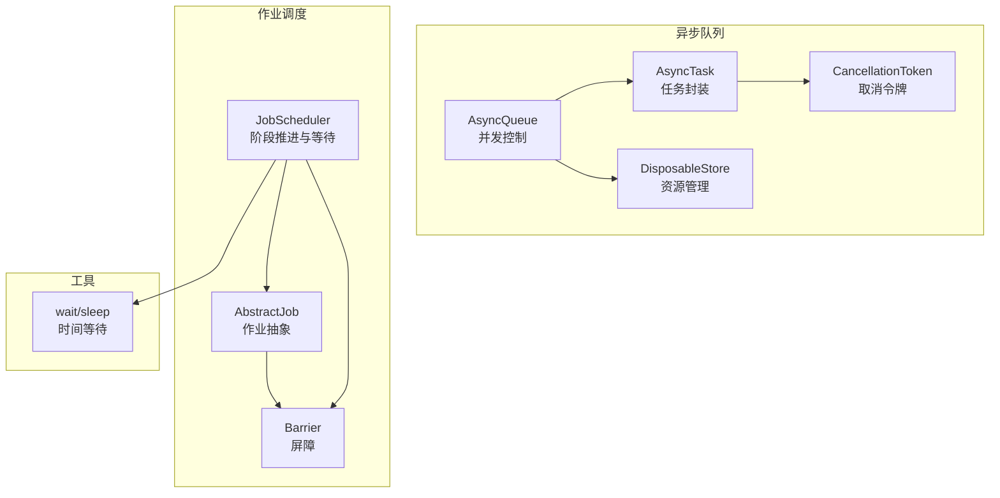
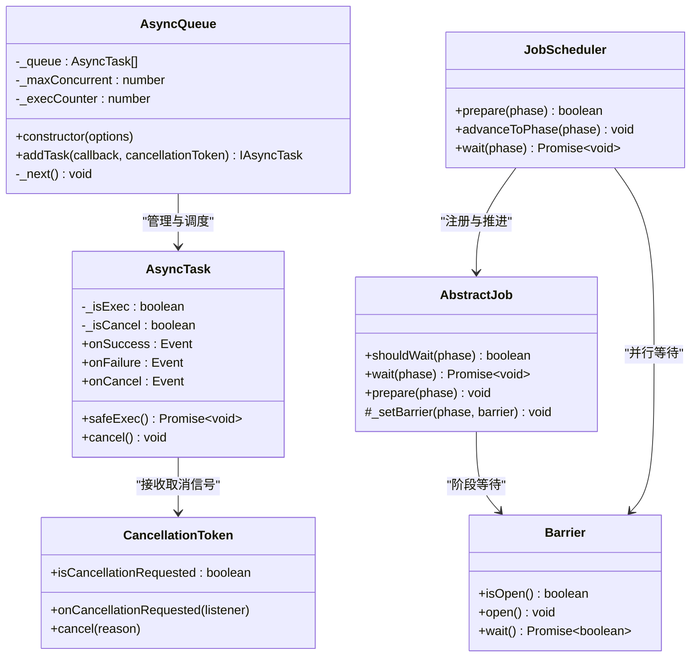
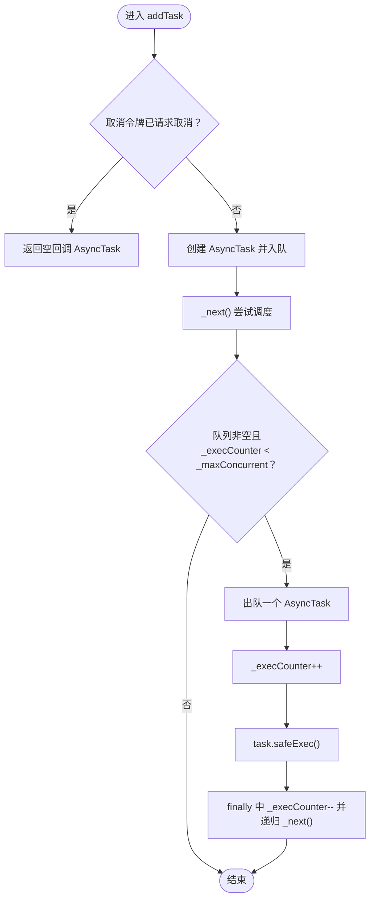
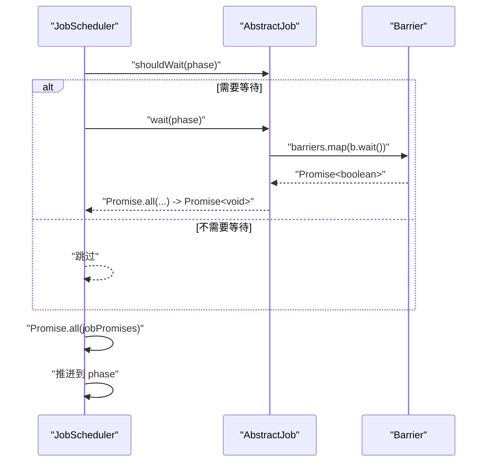
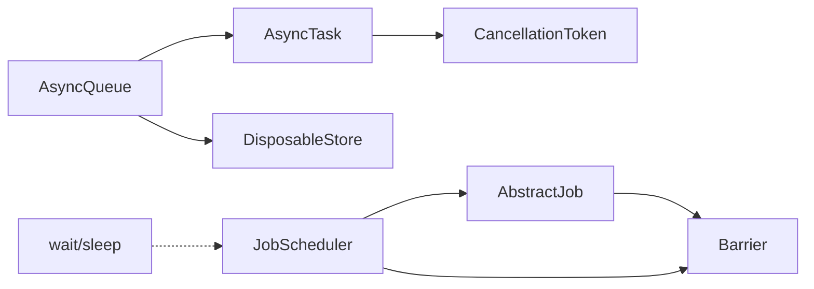

# 并发执行控制

<cite>
**本文引用的文件**
- [queue.ts](file://packages/h5-builder/src/bedrock/async/queue/queue.ts)
- [task.ts](file://packages/h5-builder/src/bedrock/async/queue/task.ts)
- [cancellation.ts](file://packages/h5-builder/src/bedrock/async/cancellation.ts)
- [disposable-store.ts](file://packages/h5-builder/src/bedrock/dispose/disposable-store.ts)
- [job-scheduler.ts](file://packages/h5-builder/src/bedrock/launch/job-scheduler.ts)
- [abstract-job.ts](file://packages/h5-builder/src/bedrock/launch/abstract-job.ts)
- [barrier.ts](file://packages/h5-builder/src/bedrock/async/barrier.ts)
- [wait.ts](file://packages/h5-builder/src/bedrock/async/wait.ts)
- [queue.test.ts](file://packages/h5-builder/src/bedrock/async/queue/queue.test.ts)
</cite>

## 目录
1. [引言](#引言)
2. [项目结构](#项目结构)
3. [核心组件](#核心组件)
4. [架构总览](#架构总览)
5. [详细组件分析](#详细组件分析)
6. [依赖关系分析](#依赖关系分析)
7. [性能考量](#性能考量)
8. [故障排查指南](#故障排查指南)
9. [结论](#结论)
10. [附录](#附录)

## 引言
本文件围绕异步任务的并发执行控制策略展开，重点基于 AsyncQueue 类解析如何通过 _maxConcurrent 与 _execCounter 实现最大并发数限制；分析 _addTask 与 _next 方法如何协同工作以确保任务按序执行且不超过并发上限；结合 JobScheduler 的 wait 方法中 Promise.all 的使用，说明并行处理多个可等待任务的实现机制。同时提供配置建议，指导开发者根据场景调整 concurrent 参数以平衡性能与资源消耗，并讨论任务队列在高负载下的表现与潜在瓶颈，给出优化建议。

## 项目结构
本次文档聚焦于以下模块：
- 异步队列与任务：AsyncQueue、AsyncTask、CancellationToken、DisposableStore
- 作业调度与并行等待：JobScheduler、AbstractJob、Barrier
- 工具函数：wait/sleep

图表来源
- [queue.ts](file://packages/h5-builder/src/bedrock/async/queue/queue.ts#L1-L57)
- [task.ts](file://packages/h5-builder/src/bedrock/async/queue/task.ts#L1-L68)
- [cancellation.ts](file://packages/h5-builder/src/bedrock/async/cancellation.ts#L1-L194)
- [disposable-store.ts](file://packages/h5-builder/src/bedrock/dispose/disposable-store.ts#L1-L84)
- [job-scheduler.ts](file://packages/h5-builder/src/bedrock/launch/job-scheduler.ts#L1-L123)
- [abstract-job.ts](file://packages/h5-builder/src/bedrock/launch/abstract-job.ts#L1-L46)
- [barrier.ts](file://packages/h5-builder/src/bedrock/async/barrier.ts#L1-L59)
- [wait.ts](file://packages/h5-builder/src/bedrock/async/wait.ts#L1-L10)

章节来源
- [queue.ts](file://packages/h5-builder/src/bedrock/async/queue/queue.ts#L1-L57)
- [task.ts](file://packages/h5-builder/src/bedrock/async/queue/task.ts#L1-L68)
- [job-scheduler.ts](file://packages/h5-builder/src/bedrock/launch/job-scheduler.ts#L1-L123)
- [abstract-job.ts](file://packages/h5-builder/src/bedrock/launch/abstract-job.ts#L1-L46)
- [barrier.ts](file://packages/h5-builder/src/bedrock/async/barrier.ts#L1-L59)
- [wait.ts](file://packages/h5-builder/src/bedrock/async/wait.ts#L1-L10)

## 核心组件
- AsyncQueue：负责维护任务队列、并发计数与执行调度，通过 _maxConcurrent 控制最大并发，_execCounter 记录当前并发数，_next 实现“取一个、执行一个、完成后继续取”的循环。
- AsyncTask：封装单个可取消的异步任务，提供 onSuccess、onFailure、onCancel 事件，safeExec 提供受控执行入口，cancel 支持取消。
- CancellationToken：提供取消令牌与取消源，支持监听取消事件并在任务回调中检查取消状态。
- JobScheduler：按阶段推进作业，wait 阶段时收集需要等待的作业，使用 Promise.all 并行等待所有作业完成。
- AbstractJob/Barrier：作业抽象与屏障，作业在特定阶段注册 Barrier，wait 返回 Promise.all(barriers.map(b.wait()))，从而并行等待多个屏障。

章节来源
- [queue.ts](file://packages/h5-builder/src/bedrock/async/queue/queue.ts#L1-L57)
- [task.ts](file://packages/h5-builder/src/bedrock/async/queue/task.ts#L1-L68)
- [cancellation.ts](file://packages/h5-builder/src/bedrock/async/cancellation.ts#L1-L194)
- [job-scheduler.ts](file://packages/h5-builder/src/bedrock/launch/job-scheduler.ts#L1-L123)
- [abstract-job.ts](file://packages/h5-builder/src/bedrock/launch/abstract-job.ts#L1-L46)
- [barrier.ts](file://packages/h5-builder/src/bedrock/async/barrier.ts#L1-L59)

## 架构总览
下图展示了 AsyncQueue 与 AsyncTask、CancellationToken 的协作关系，以及 JobScheduler 与 AbstractJob/Barrier 的协作关系。

图表来源
- [queue.ts](file://packages/h5-builder/src/bedrock/async/queue/queue.ts#L1-L57)
- [task.ts](file://packages/h5-builder/src/bedrock/async/queue/task.ts#L1-L68)
- [cancellation.ts](file://packages/h5-builder/src/bedrock/async/cancellation.ts#L1-L194)
- [job-scheduler.ts](file://packages/h5-builder/src/bedrock/launch/job-scheduler.ts#L1-L123)
- [abstract-job.ts](file://packages/h5-builder/src/bedrock/launch/abstract-job.ts#L1-L46)
- [barrier.ts](file://packages/h5-builder/src/bedrock/async/barrier.ts#L1-L59)

## 详细组件分析

### AsyncQueue 并发控制与调度逻辑
- 并发上限控制
  - _maxConcurrent：由构造函数接收的 concurrent 决定最大并发数。
  - _execCounter：记录当前正在执行的任务数量。
  - 条件执行：_next 在满足队列非空、_execCounter < _maxConcurrent 时才取出并执行下一个任务。
- 任务入队与执行
  - addTask：若传入的取消令牌已请求取消，则直接返回一个“空回调”的 AsyncTask；否则创建 AsyncTask 并入队，随后立即尝试 _next。
  - _next：从队列头部取出一个 AsyncTask，_execCounter++，调用 task.safeExec()，在 finally 中递归调用 _next，保证任务完成后继续调度下一个任务。
- 事件与错误处理
  - AsyncTask.safeExec 内部在成功时 fire onSuccess，在失败时 fire onFailure，并通过 makeErrorBy 包装错误。
  - 取消：AsyncTask.cancel 仅在尚未执行且未被取消时生效，防止重复取消与重复执行。

图表来源
- [queue.ts](file://packages/h5-builder/src/bedrock/async/queue/queue.ts#L24-L55)
- [task.ts](file://packages/h5-builder/src/bedrock/async/queue/task.ts#L39-L67)

章节来源
- [queue.ts](file://packages/h5-builder/src/bedrock/async/queue/queue.ts#L1-L57)
- [task.ts](file://packages/h5-builder/src/bedrock/async/queue/task.ts#L1-L68)
- [queue.test.ts](file://packages/h5-builder/src/bedrock/async/queue/queue.test.ts#L1-L71)

### AsyncTask 与取消机制
- 事件系统：AsyncTask 内部使用 Emitter 提供 onSuccess、onFailure、onCancel 事件，便于外部订阅任务生命周期。
- 执行流程：safeExec 在首次执行时标记 _isExec=true，然后调用回调并等待 Promise 完成；成功则 fire onSuccess，异常则 fire onFailure。
- 取消流程：cancel 在未执行且未取消时设置 _isCancel=true，清理回调并 fire onCancel；同时 CancellationToken.onCancellationRequested 会自动触发 cancel。

章节来源
- [task.ts](file://packages/h5-builder/src/bedrock/async/queue/task.ts#L1-L68)
- [cancellation.ts](file://packages/h5-builder/src/bedrock/async/cancellation.ts#L1-L194)

### JobScheduler 的并行等待机制
- wait(phase)：遍历所有作业，收集 shouldWait(phase) 为真的作业，将其 wait(phase) 返回的 Promise 收集到数组 jobPromises，最后使用 Promise.all(jobPromises) 并行等待所有作业完成，完成后推进当前阶段。
- AbstractJob.wait(phase)：若该阶段无 Barrier 则直接返回 Promise.resolve；否则返回 Promise.all(barriers.map(b.wait()))，即并行等待该阶段的所有屏障。
- Barrier：Barrier 是一个一次性屏障，open 后永久打开，wait 返回的 Promise 在 open 时 resolve；makeBarrierByPromise 可将任意 Promise 转换为 Barrier，成功时 open，失败时 reject 或按配置 open。

图表来源
- [job-scheduler.ts](file://packages/h5-builder/src/bedrock/launch/job-scheduler.ts#L103-L121)
- [abstract-job.ts](file://packages/h5-builder/src/bedrock/launch/abstract-job.ts#L11-L30)
- [barrier.ts](file://packages/h5-builder/src/bedrock/async/barrier.ts#L1-L59)

章节来源
- [job-scheduler.ts](file://packages/h5-builder/src/bedrock/launch/job-scheduler.ts#L1-L123)
- [abstract-job.ts](file://packages/h5-builder/src/bedrock/launch/abstract-job.ts#L1-L46)
- [barrier.ts](file://packages/h5-builder/src/bedrock/async/barrier.ts#L1-L59)

## 依赖关系分析
- AsyncQueue 依赖 AsyncTask、CancellationToken、DisposableStore（通过 _store 管理资源）。
- AsyncTask 依赖 CancellationToken 与事件系统，提供任务生命周期事件。
- JobScheduler 依赖 AbstractJob，AbstractJob 依赖 Barrier；JobScheduler 在 wait 阶段使用 Promise.all 并行等待。
- wait/sleep 提供基础的时间等待能力，常用于模拟延迟或节流。

图表来源
- [queue.ts](file://packages/h5-builder/src/bedrock/async/queue/queue.ts#L1-L57)
- [task.ts](file://packages/h5-builder/src/bedrock/async/queue/task.ts#L1-L68)
- [cancellation.ts](file://packages/h5-builder/src/bedrock/async/cancellation.ts#L1-L194)
- [disposable-store.ts](file://packages/h5-builder/src/bedrock/dispose/disposable-store.ts#L1-L84)
- [job-scheduler.ts](file://packages/h5-builder/src/bedrock/launch/job-scheduler.ts#L1-L123)
- [abstract-job.ts](file://packages/h5-builder/src/bedrock/launch/abstract-job.ts#L1-L46)
- [barrier.ts](file://packages/h5-builder/src/bedrock/async/barrier.ts#L1-L59)
- [wait.ts](file://packages/h5-builder/src/bedrock/async/wait.ts#L1-L10)

章节来源
- [queue.ts](file://packages/h5-builder/src/bedrock/async/queue/queue.ts#L1-L57)
- [task.ts](file://packages/h5-builder/src/bedrock/async/queue/task.ts#L1-L68)
- [job-scheduler.ts](file://packages/h5-builder/src/bedrock/launch/job-scheduler.ts#L1-L123)
- [abstract-job.ts](file://packages/h5-builder/src/bedrock/launch/abstract-job.ts#L1-L46)
- [barrier.ts](file://packages/h5-builder/src/bedrock/async/barrier.ts#L1-L59)
- [wait.ts](file://packages/h5-builder/src/bedrock/async/wait.ts#L1-L10)

## 性能考量
- 并发度配置
  - concurrent 过小：吞吐量低，CPU/IO 利用率不足。
  - concurrent 过大：上下文切换频繁，内存占用上升，锁竞争加剧，可能引发 GC 压力。
  - 建议：从较小值开始，逐步提升，观察 CPU 利用率、内存峰值与延迟指标，找到平衡点。
- 任务类型与阻塞
  - 避免长时间阻塞任务（如同步计算密集型），优先拆分为短任务或使用异步分片。
  - 对 IO 密集型任务，适当提高并发度；对 CPU 密集型任务，谨慎提高并发度。
- 取消与资源回收
  - 使用 CancellationToken 在任务内部定期检查取消状态，避免无效执行。
  - 通过 DisposableStore 管理任务生命周期，确保事件监听与定时器等资源及时释放。
- 并行等待策略
  - JobScheduler 的 Promise.all 会等待所有作业完成，若部分作业耗时较长，整体等待时间会被拉长。
  - 可考虑将长耗时作业拆分为多个短作业，或在作业内部使用屏障细粒度控制等待点。

[本节为通用性能建议，不直接分析具体文件，故无章节来源]

## 故障排查指南
- 任务未执行
  - 检查是否传入了已请求取消的令牌；若已取消，addTask 会返回空回调 AsyncTask。
  - 检查 _maxConcurrent 是否过小导致排队；可通过增大并发度验证。
- 任务卡住
  - 检查任务是否未正确 fire onSuccess/onFailure；未触发完成事件会导致 _execCounter 不减，后续任务无法继续。
  - 检查取消逻辑：若任务未检查取消状态，可能导致长时间运行。
- 并行等待超时
  - 若某些作业的 Barrier 一直不 open，Promise.all 将一直等待；检查作业 prepare 与 barrier 设置逻辑。
- 资源泄漏
  - 确认使用 DisposableStore 管理事件与定时器；避免重复 dispose 或在已 dispose 的 Store 上注册对象。

章节来源
- [queue.ts](file://packages/h5-builder/src/bedrock/async/queue/queue.ts#L24-L55)
- [task.ts](file://packages/h5-builder/src/bedrock/async/queue/task.ts#L39-L67)
- [cancellation.ts](file://packages/h5-builder/src/bedrock/async/cancellation.ts#L1-L194)
- [disposable-store.ts](file://packages/h5-builder/src/bedrock/dispose/disposable-store.ts#L1-L84)
- [abstract-job.ts](file://packages/h5-builder/src/bedrock/launch/abstract-job.ts#L11-L30)
- [barrier.ts](file://packages/h5-builder/src/bedrock/async/barrier.ts#L1-L59)

## 结论
AsyncQueue 通过 _maxConcurrent 与 _execCounter 实现稳定的并发控制，_addTask 与 _next 协同确保任务有序执行且不越界。JobScheduler 的 wait 方法利用 Promise.all 并行等待多个作业，配合 AbstractJob/Barrier 的屏障机制，形成清晰的阶段化并行执行模型。实践中应根据任务类型与资源状况合理设置并发度，避免长时间阻塞任务，充分利用取消与资源管理机制，以获得更优的吞吐与稳定性。

[本节为总结性内容，不直接分析具体文件，故无章节来源]

## 附录
- 配置建议
  - 初始并发度：从 1 或 2 开始，逐步提升。
  - 观察指标：CPU 利用率、内存峰值、任务平均耗时、队列长度。
  - 任务拆分：将长任务拆分为多个短任务，减少单次执行时间。
  - 取消策略：在任务回调中定期检查取消状态，及时退出。
- 典型场景
  - IO 密集：适度提高并发度，关注网络/磁盘瓶颈。
  - CPU 密集：谨慎提高并发度，避免过度上下文切换。
  - 批处理：使用 JobScheduler 分阶段并行等待，减少全局等待时间。

[本节为通用建议，不直接分析具体文件，故无章节来源]