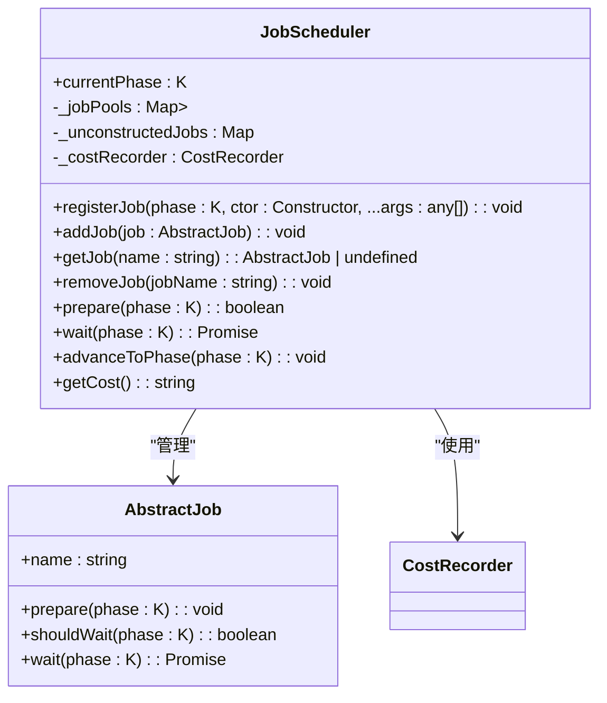
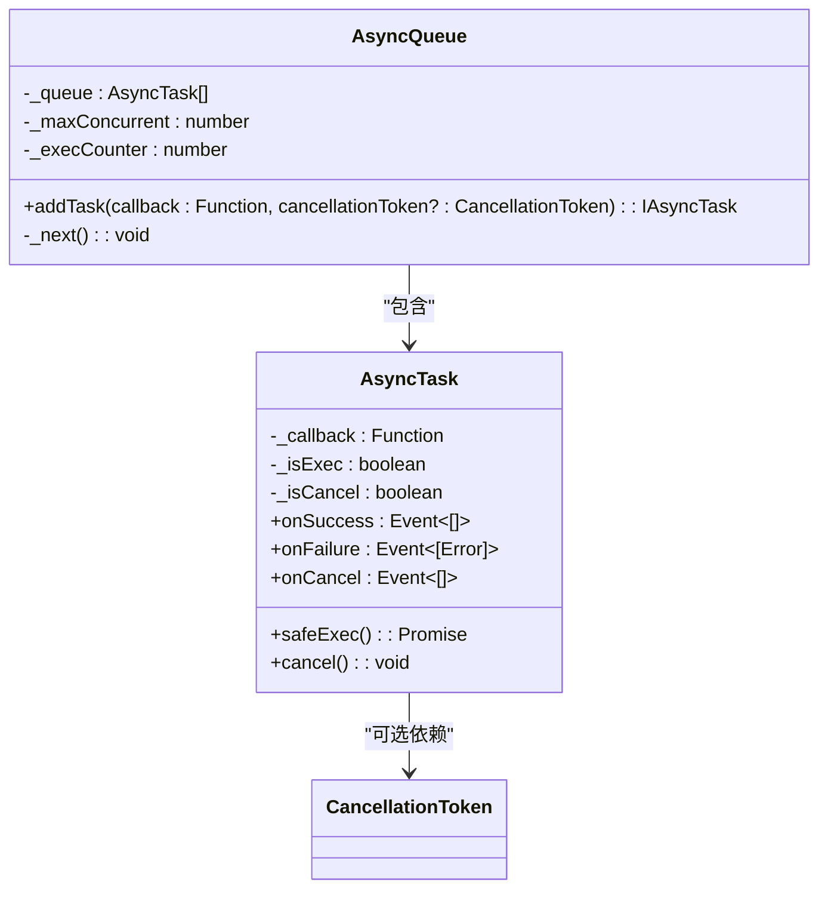
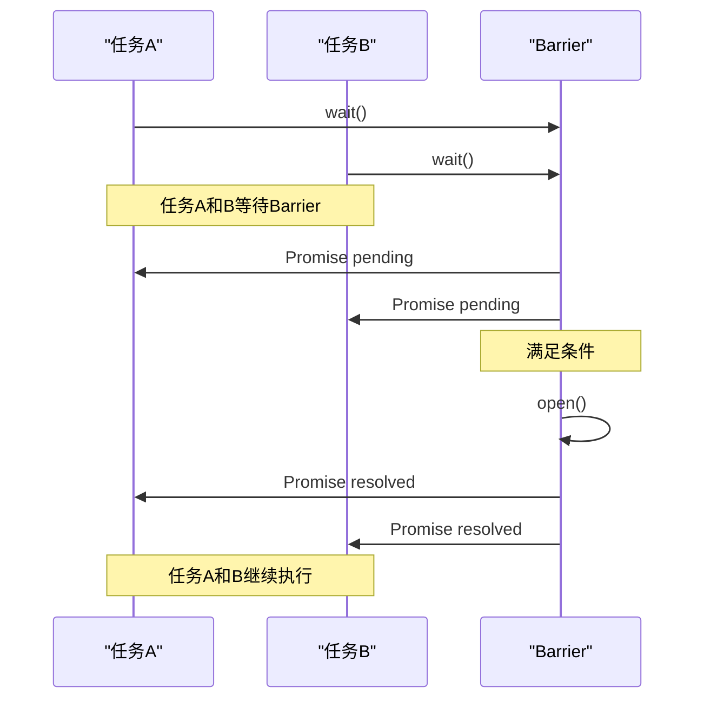
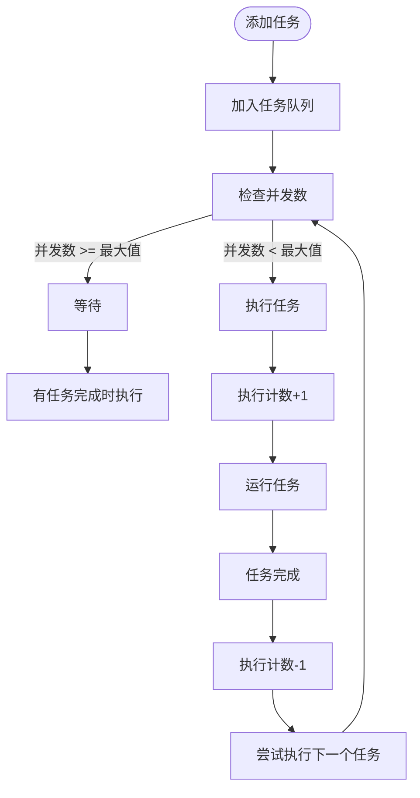
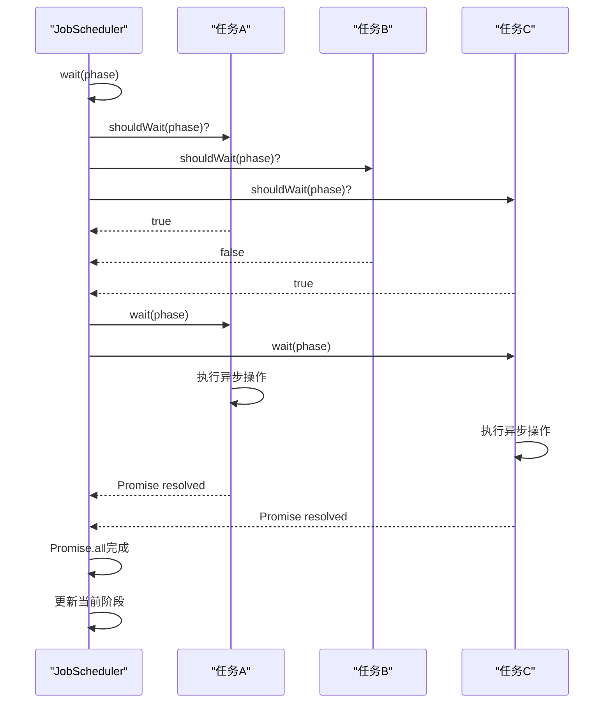

# 执行模型

<cite>
**本文档中引用的文件**  
- [job-scheduler.ts](file://packages/h5-builder/src/bedrock/launch/job-scheduler.ts)
- [barrier.ts](file://packages/h5-builder/src/bedrock/async/barrier.ts)
- [queue.ts](file://packages/h5-builder/src/bedrock/async/queue/queue.ts)
- [task.ts](file://packages/h5-builder/src/bedrock/async/queue/task.ts)
- [wait.ts](file://packages/h5-builder/src/bedrock/async/wait.ts)
- [abstract-job.ts](file://packages/h5-builder/src/bedrock/launch/abstract-job.ts)
</cite>

## 目录
1. [引言](#引言)
2. [任务调度机制](#任务调度机制)
3. [异步执行与并发控制](#异步执行与并发控制)
4. [Barrier同步原语](#barrier同步原语)
5. [任务队列与优先级调度](#任务队列与优先级调度)
6. [生命周期阶段控制](#生命周期阶段控制)
7. [并发执行模式](#并发执行模式)
8. [性能优化建议](#性能优化建议)
9. [结论](#结论)

## 引言
本文档深入分析MobX框架中的任务执行模型，重点阐述异步执行机制与并发控制策略。文档详细解释JobScheduler如何协调多个异步任务的执行，描述Barrier同步原语在任务协调中的应用，并分析任务队列的优先级调度机制。通过本文档，读者将全面理解系统如何管理不同生命周期阶段的任务执行顺序，以及如何通过并发执行模式提高系统性能。

## 任务调度机制
JobScheduler是系统核心的任务调度组件，负责管理不同阶段任务的生命周期。调度器通过注册机制按需添加任务，任务在特定阶段才进行实例化和执行。调度器维护当前阶段状态，并提供任务注册、添加、获取和移除等基本操作。

调度器的关键特性包括：
- 按阶段注册任务，实现延迟实例化
- 统一管理任务生命周期
- 记录任务执行成本，便于性能分析
- 支持动态推进到目标阶段



**Diagram sources**
- [job-scheduler.ts](file://packages/h5-builder/src/bedrock/launch/job-scheduler.ts#L16-L123)
- [abstract-job.ts](file://packages/h5-builder/src/bedrock/launch/abstract-job.ts)

**Section sources**
- [job-scheduler.ts](file://packages/h5-builder/src/bedrock/launch/job-scheduler.ts#L16-L123)

## 异步执行与并发控制
系统采用异步执行模型处理耗时操作，避免阻塞主线程。通过AsyncQueue实现任务队列的并发控制，确保系统资源的合理利用。队列支持配置最大并发数，自动管理任务的执行顺序和并发度。

异步执行的核心特性：
- 非阻塞式任务执行
- 可配置的并发控制
- 任务取消机制
- 错误处理和事件通知



**Diagram sources**
- [queue.ts](file://packages/h5-builder/src/bedrock/async/queue/queue.ts#L13-L57)
- [task.ts](file://packages/h5-builder/src/bedrock/async/queue/task.ts#L15-L68)

**Section sources**
- [queue.ts](file://packages/h5-builder/src/bedrock/async/queue/queue.ts#L1-L57)
- [task.ts](file://packages/h5-builder/src/bedrock/async/queue/task.ts#L1-L68)

## Barrier同步原语
Barrier是系统中关键的同步原语，用于协调多个异步任务的等待条件。Barrier初始处于关闭状态，当满足特定条件时永久打开，释放所有等待的Promise。

Barrier的核心方法：
- `isOpen()`: 检查Barrier是否已打开
- `open()`: 打开Barrier，释放所有等待
- `wait()`: 返回Promise，当Barrier打开时resolve
- `reject()`: 拒绝Barrier，使等待的Promise reject



**Diagram sources**
- [barrier.ts](file://packages/h5-builder/src/bedrock/async/barrier.ts#L11-L59)

**Section sources**
- [barrier.ts](file://packages/h5-builder/src/bedrock/async/barrier.ts#L1-L59)

## 任务队列与优先级调度
系统通过任务队列实现优先级调度机制，确保关键任务优先执行。队列采用先进先出（FIFO）策略，结合并发控制，平衡任务执行效率和系统响应性。

任务队列的工作流程：
1. 任务添加到队列尾部
2. 当前执行任务数小于最大并发数时，从队列头部取出任务执行
3. 任务执行完成后，减少执行计数，尝试执行下一个任务
4. 支持任务取消，避免资源浪费



**Diagram sources**
- [queue.ts](file://packages/h5-builder/src/bedrock/async/queue/queue.ts#L13-L57)

**Section sources**
- [queue.ts](file://packages/h5-builder/src/bedrock/async/queue/queue.ts#L1-L57)

## 生命周期阶段控制
系统通过明确的生命周期阶段控制任务执行顺序，区分不同优先级的任务。JobScheduler的prepare和wait阶段分别处理不同类型的生命周期任务。

阶段控制机制：
- Render阶段：高优先级任务，立即执行
- Idle阶段：低优先级任务，在系统空闲时执行
- 阶段推进：确保当前阶段所有任务完成后才进入下一阶段

```mermaid
stateDiagram-v2
[*] --> Idle
Idle --> Prepare : "进入阶段"
Prepare --> ShouldWait{"需要等待?"}
ShouldWait --> |否| Advance["推进到下一阶段"]
ShouldWait --> |是| Wait["等待异步任务"]
Wait --> AllDone{"所有任务完成?"}
AllDone --> |否| Wait
AllDone --> |是| Advance
Advance --> NextPhase["下一阶段"]
NextPhase --> Prepare
```

**Diagram sources**
- [job-scheduler.ts](file://packages/h5-builder/src/bedrock/launch/job-scheduler.ts#L65-L83)
- [job-scheduler.ts](file://packages/h5-builder/src/bedrock/launch/job-scheduler.ts#L103-L120)

**Section sources**
- [job-scheduler.ts](file://packages/h5-builder/src/bedrock/launch/job-scheduler.ts#L65-L120)

## 并发执行模式
系统采用Promise.all模式并行处理多个可等待任务，确保阶段完整性。通过收集所有需要等待的任务Promise，使用Promise.all统一等待所有任务完成。

并发执行流程：
1. 遍历所有任务，筛选出需要等待的任务
2. 为每个需要等待的任务创建Promise
3. 使用Promise.all并行等待所有任务
4. 所有任务完成后，更新当前阶段



**Diagram sources**
- [job-scheduler.ts](file://packages/h5-builder/src/bedrock/launch/job-scheduler.ts#L103-L119)

**Section sources**
- [job-scheduler.ts](file://packages/h5-builder/src/bedrock/launch/job-scheduler.ts#L103-L120)

## 性能优化建议
为确保系统高性能运行，建议遵循以下最佳实践：

### 避免长时间阻塞主线程
- 将耗时操作分解为小任务
- 使用异步API替代同步调用
- 合理设置任务优先级

### 合理使用闲时回调
- 将非关键任务安排在idle阶段执行
- 使用requestIdleCallback API
- 设置合理的超时时间，避免任务永远不执行

### 任务管理最佳实践
- 及时取消不再需要的任务
- 监控任务执行时间，识别性能瓶颈
- 合理配置队列并发数，平衡性能和资源消耗

### 错误处理
- 为异步任务提供完善的错误处理
- 记录任务执行成本，便于性能分析
- 实现任务重试机制，提高系统可靠性

**Section sources**
- [job-scheduler.ts](file://packages/h5-builder/src/bedrock/launch/job-scheduler.ts)
- [queue.ts](file://packages/h5-builder/src/bedrock/async/queue/queue.ts)
- [barrier.ts](file://packages/h5-builder/src/bedrock/async/barrier.ts)

## 结论
本文档详细分析了MobX框架中的任务执行模型，涵盖了异步执行机制、并发控制策略、Barrier同步原语、任务队列调度等多个方面。JobScheduler通过精心设计的阶段控制机制，有效协调了多个异步任务的执行。Barrier同步原语提供了强大的任务协调能力，确保复杂异步流程的正确执行。任务队列的优先级调度机制和并发控制策略，保证了系统在高负载下的稳定性和响应性。通过遵循文档中的性能优化建议，开发者可以构建高效、可靠的异步应用。