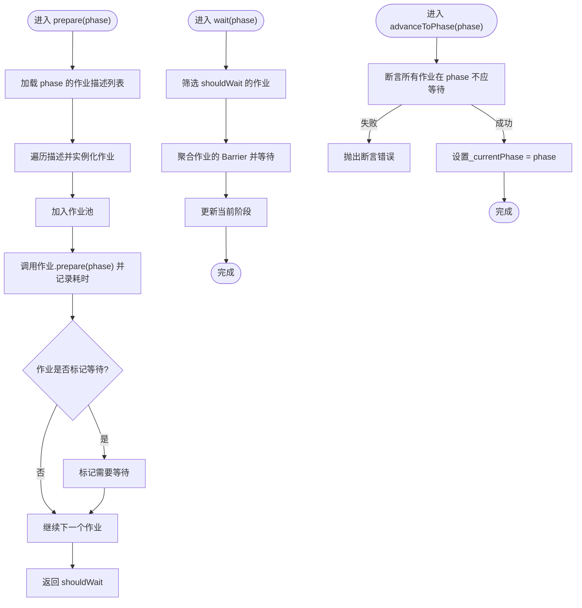

# 阶段协调机制

<cite>
**本文引用的文件**
- [lifecycle.ts](file://packages/h5-builder/src/jobs/lifecycle.ts)
- [job-scheduler.ts](file://packages/h5-builder/src/bedrock/launch/job-scheduler.ts)
- [abstract-job.ts](file://packages/h5-builder/src/bedrock/launch/abstract-job.ts)
- [cost-recorder.ts](file://packages/h5-builder/src/bedrock/launch/cost-recorder.ts)
- [barrier.ts](file://packages/h5-builder/src/bedrock/async/barrier.ts)
- [load-components-job.ts](file://packages/h5-builder/src/jobs/load-components-job.ts)
- [build-tree-job.ts](file://packages/h5-builder/src/jobs/build-tree-job.ts)
- [ensure-view-ready.ts](file://packages/h5-builder/src/jobs/ensure-view-ready.ts)
- [init-first-screen-data-job.ts](file://packages/h5-builder/src/jobs/init-first-screen-data-job.ts)
- [trigger-render-job.ts](file://packages/h5-builder/src/jobs/trigger-render-job.ts)
- [job-scheduler.test.ts](file://packages/h5-builder/src/bedrock/launch/job-scheduler.test.ts)
- [demo-progressive.tsx](file://packages/h5-builder/src/demo-progressive.tsx)
- [component.service.ts](file://packages/h5-builder/src/services/component.service.ts)
- [model.ts](file://packages/h5-builder/src/bedrock/model.ts)
</cite>

## 目录
1. [引言](#引言)
2. [项目结构](#项目结构)
3. [核心组件](#核心组件)
4. [架构总览](#架构总览)
5. [详细组件分析](#详细组件分析)
6. [依赖关系分析](#依赖关系分析)
7. [性能考量](#性能考量)
8. [故障排查指南](#故障排查指南)
9. [结论](#结论)
10. [附录](#附录)

## 引言
本文件系统性地文档化多阶段任务的协调机制，围绕 JobScheduler 如何通过 prepare 和 wait 方法协调不同生命周期阶段（如 Render、Idle），解释 _currentPhase 的状态管理机制，以及 advanceToPhase 如何强制推进阶段并确保无等待任务的安全性。结合 lifecycle.ts 中定义的阶段枚举，说明各阶段的语义与执行依赖关系，并提供实际用例，展示如何注册跨阶段任务并通过 _costRecorder 进行性能监控。最后讨论阶段跳跃、重复执行等边界情况的处理策略及最佳实践。

## 项目结构
该功能位于 h5-builder 包内，采用“按领域分层+按职责分模块”的组织方式：
- jobs：定义页面生命周期阶段与具体作业（Job）
- bedrock/launch：调度器与抽象作业基类、成本记录器
- bedrock/async：屏障 Barrier 等异步同步原语
- services：组件服务、模型树构建与资源加载
- demo-progressive.tsx：演示应用，展示从 Open 到 Idle 的完整阶段推进流程

图表来源
- [lifecycle.ts](file://packages/h5-builder/src/jobs/lifecycle.ts#L1-L18)
- [job-scheduler.ts](file://packages/h5-builder/src/bedrock/launch/job-scheduler.ts#L1-L123)
- [abstract-job.ts](file://packages/h5-builder/src/bedrock/launch/abstract-job.ts#L1-L46)
- [cost-recorder.ts](file://packages/h5-builder/src/bedrock/launch/cost-recorder.ts#L1-L23)
- [barrier.ts](file://packages/h5-builder/src/bedrock/async/barrier.ts#L1-L59)
- [load-components-job.ts](file://packages/h5-builder/src/jobs/load-components-job.ts#L1-L61)
- [build-tree-job.ts](file://packages/h5-builder/src/jobs/build-tree-job.ts#L1-L59)
- [ensure-view-ready.ts](file://packages/h5-builder/src/jobs/ensure-view-ready.ts#L1-L53)
- [init-first-screen-data-job.ts](file://packages/h5-builder/src/jobs/init-first-screen-data-job.ts#L1-L67)
- [trigger-render-job.ts](file://packages/h5-builder/src/jobs/trigger-render-job.ts#L1-L44)
- [component.service.ts](file://packages/h5-builder/src/services/component.service.ts#L1-L200)
- [model.ts](file://packages/h5-builder/src/bedrock/model.ts#L1-L200)

章节来源
- [job-scheduler.ts](file://packages/h5-builder/src/bedrock/launch/job-scheduler.ts#L1-L123)
- [lifecycle.ts](file://packages/h5-builder/src/jobs/lifecycle.ts#L1-L18)

## 核心组件
- JobScheduler：负责阶段推进、作业注册与实例化、等待与成本记录
- AbstractJob：作业抽象基类，定义 prepare/shouldWait/wait/_executePhase 等接口
- Barrier：闭锁屏障，用于跨阶段等待与解除阻塞
- CostRecorder：记录每个作业在各阶段的累计耗时
- PageLifecycle：阶段枚举，定义 Open、LoadComponentLogic、Prepare、RenderReady、Render、Completed、Idle 等阶段

章节来源
- [job-scheduler.ts](file://packages/h5-builder/src/bedrock/launch/job-scheduler.ts#L1-L123)
- [abstract-job.ts](file://packages/h5-builder/src/bedrock/launch/abstract-job.ts#L1-L46)
- [barrier.ts](file://packages/h5-builder/src/bedrock/async/barrier.ts#L1-L59)
- [cost-recorder.ts](file://packages/h5-builder/src/bedrock/launch/cost-recorder.ts#L1-L23)
- [lifecycle.ts](file://packages/h5-builder/src/jobs/lifecycle.ts#L1-L18)

## 架构总览
JobScheduler 将“阶段推进”与“作业执行”解耦：
- prepare：按阶段批量实例化注册的作业，调用作业 prepare，收集 shouldWait 标记
- wait：对标记为需要等待的作业，聚合其 Barrier 并等待全部完成，完成后推进当前阶段
- advanceToPhase：在确保无待等待作业的前提下，直接推进当前阶段，避免不必要的等待

图表来源
- [job-scheduler.ts](file://packages/h5-builder/src/bedrock/launch/job-scheduler.ts#L65-L122)
- [abstract-job.ts](file://packages/h5-builder/src/bedrock/launch/abstract-job.ts#L11-L30)
- [barrier.ts](file://packages/h5-builder/src/bedrock/async/barrier.ts#L1-L59)
- [cost-recorder.ts](file://packages/h5-builder/src/bedrock/launch/cost-recorder.ts#L1-L23)

## 详细组件分析

### JobScheduler：阶段推进与等待
- 注册与实例化
  - registerJob：按阶段登记作业构造器与静态参数，延迟到 prepare 时再实例化
  - addJob/removeJob：直接管理已实例化的作业池
- prepare
  - 将登记在 phase 的作业批量实例化并加入作业池
  - 调用每个作业的 prepare，统计耗时
  - 收集 shouldWait 标记，返回是否需要等待
- wait
  - 仅对 shouldWait 的作业执行 wait，聚合 Promise 并等待全部完成
  - 完成后更新当前阶段
- advanceToPhase
  - 在推进前断言所有作业在目标阶段均不应等待，否则抛错
  - 成功则更新当前阶段

图表来源
- [job-scheduler.ts](file://packages/h5-builder/src/bedrock/launch/job-scheduler.ts#L65-L122)

章节来源
- [job-scheduler.ts](file://packages/h5-builder/src/bedrock/launch/job-scheduler.ts#L1-L123)

### AbstractJob：作业生命周期与屏障
- prepare：委托内部 _executePhase 执行阶段逻辑
- shouldWait：根据当前阶段是否持有未完成的 Barrier 判断
- wait：等待当前阶段的所有 Barrier 完成，并在 finally 清空该阶段的 Barrier，保证可重复 prepare
- _setBarrier：为指定阶段注册 Barrier，供子类在异步任务完成后 open

图表来源
- [abstract-job.ts](file://packages/h5-builder/src/bedrock/launch/abstract-job.ts#L1-L46)
- [barrier.ts](file://packages/h5-builder/src/bedrock/async/barrier.ts#L1-L59)
- [load-components-job.ts](file://packages/h5-builder/src/jobs/load-components-job.ts#L1-L61)
- [build-tree-job.ts](file://packages/h5-builder/src/jobs/build-tree-job.ts#L1-L59)
- [ensure-view-ready.ts](file://packages/h5-builder/src/jobs/ensure-view-ready.ts#L1-L53)
- [init-first-screen-data-job.ts](file://packages/h5-builder/src/jobs/init-first-screen-data-job.ts#L1-L67)
- [trigger-render-job.ts](file://packages/h5-builder/src/jobs/trigger-render-job.ts#L1-L44)

章节来源
- [abstract-job.ts](file://packages/h5-builder/src/bedrock/launch/abstract-job.ts#L1-L46)
- [barrier.ts](file://packages/h5-builder/src/bedrock/async/barrier.ts#L1-L59)

### 阶段枚举与语义
- Open：页面打开，一般在此处理最前置任务，比如获取页面 schema
- LoadComponentLogic：加载组件逻辑 Model JS 资源
- Prepare：构建模型树（逻辑树），同时加载组件视图
- RenderReady：模型树和视图资源全部准备完成
- Render：启动渲染
- Completed：首屏视图数据填充中（渐进式渲染下，Completed 通常在 Render 完成后继续后台数据初始化）
- Idle：空闲阶段，处理闲时任务

图表来源
- [lifecycle.ts](file://packages/h5-builder/src/jobs/lifecycle.ts#L1-L18)

章节来源
- [lifecycle.ts](file://packages/h5-builder/src/jobs/lifecycle.ts#L1-L18)

### 典型作业与跨阶段依赖
- LoadComponentsJob：在 LoadComponentLogic 阶段注册 Barrier，等待组件资源加载完成后 open
- BuildTreeJob：在 Prepare 阶段构建模型树
- EnsureViewReadyJob：在 RenderReady 阶段等待视图资源就绪并 open
- InitFirstScreenDataJob：在 Completed 阶段等待渲染完成（通过 Barrier）后再进行首屏数据初始化
- TriggerRenderJob：在 Render 阶段触发渲染

图表来源
- [load-components-job.ts](file://packages/h5-builder/src/jobs/load-components-job.ts#L1-L61)
- [build-tree-job.ts](file://packages/h5-builder/src/jobs/build-tree-job.ts#L1-L59)
- [ensure-view-ready.ts](file://packages/h5-builder/src/jobs/ensure-view-ready.ts#L1-L53)
- [init-first-screen-data-job.ts](file://packages/h5-builder/src/jobs/init-first-screen-data-job.ts#L1-L67)
- [trigger-render-job.ts](file://packages/h5-builder/src/jobs/trigger-render-job.ts#L1-L44)
- [job-scheduler.ts](file://packages/h5-builder/src/bedrock/launch/job-scheduler.ts#L65-L122)

章节来源
- [load-components-job.ts](file://packages/h5-builder/src/jobs/load-components-job.ts#L1-L61)
- [build-tree-job.ts](file://packages/h5-builder/src/jobs/build-tree-job.ts#L1-L59)
- [ensure-view-ready.ts](file://packages/h5-builder/src/jobs/ensure-view-ready.ts#L1-L53)
- [init-first-screen-data-job.ts](file://packages/h5-builder/src/jobs/init-first-screen-data-job.ts#L1-L67)
- [trigger-render-job.ts](file://packages/h5-builder/src/jobs/trigger-render-job.ts#L1-L44)

### 性能监控：_costRecorder
- CostRecorder 记录每个作业在各阶段的累计耗时，便于定位瓶颈
- JobScheduler 在 prepare 与 wait 期间分别记录耗时，最终可通过 getCost 输出 JSON 字符串

章节来源
- [cost-recorder.ts](file://packages/h5-builder/src/bedrock/launch/cost-recorder.ts#L1-L23)
- [job-scheduler.ts](file://packages/h5-builder/src/bedrock/launch/job-scheduler.ts#L65-L122)

## 依赖关系分析
- 作业对服务的依赖通过 DI 注入，ComponentService 提供模型树构建、视图资源加载等能力
- 作业通过 Barrier 与 JobScheduler 的 wait 协作，形成阶段间异步依赖
- Demo 应用通过 registerJob 将作业与阶段绑定，驱动完整生命周期

图表来源
- [job-scheduler.ts](file://packages/h5-builder/src/bedrock/launch/job-scheduler.ts#L1-L123)
- [abstract-job.ts](file://packages/h5-builder/src/bedrock/launch/abstract-job.ts#L1-L46)
- [barrier.ts](file://packages/h5-builder/src/bedrock/async/barrier.ts#L1-L59)
- [component.service.ts](file://packages/h5-builder/src/services/component.service.ts#L1-L200)
- [model.ts](file://packages/h5-builder/src/bedrock/model.ts#L1-L200)
- [demo-progressive.tsx](file://packages/h5-builder/src/demo-progressive.tsx#L1-L263)

章节来源
- [demo-progressive.tsx](file://packages/h5-builder/src/demo-progressive.tsx#L66-L185)
- [component.service.ts](file://packages/h5-builder/src/services/component.service.ts#L1-L200)

## 性能考量
- 通过 CostRecorder 分阶段统计耗时，建议在关键阶段（如 RenderReady、Render、Completed）输出日志，便于优化
- 将耗时长的作业拆分为多个小任务，减少单次 prepare 的阻塞时间
- 合理使用 Barrier，避免不必要的等待；对于可并行的作业尽量在 prepare 阶段尽早触发

[本节为通用指导，不涉及具体文件分析]

## 故障排查指南
- 断言失败（advanceToPhase 抛错）
  - 现象：推进阶段时报“存在作业仍需等待”
  - 原因：某些作业在目标阶段仍有未完成的 Barrier
  - 处理：先调用 wait 等待该阶段作业完成，再推进阶段
- 重复执行与可重入
  - AbstractJob 在 wait 后会清空该阶段的 Barrier，确保失败或取消后可重复 prepare
- 测试参考
  - 单测展示了 prepare → wait 的正确使用方式，以及延迟构造作业的行为

章节来源
- [job-scheduler.ts](file://packages/h5-builder/src/bedrock/launch/job-scheduler.ts#L93-L121)
- [abstract-job.ts](file://packages/h5-builder/src/bedrock/launch/abstract-job.ts#L19-L30)
- [job-scheduler.test.ts](file://packages/h5-builder/src/bedrock/launch/job-scheduler.test.ts#L61-L123)

## 结论
JobScheduler 通过 prepare 与 wait 的配合，实现了阶段化的任务编排与异步依赖管理；_currentPhase 的推进由 advanceToPhase 严格约束，确保阶段安全前进。借助 Barrier 与 CostRecorder，系统既能保证跨阶段的正确时序，又能对性能进行可观测。在实际工程中，建议：
- 明确各阶段职责，避免跨阶段耦合
- 使用 registerJob 按阶段注册作业，必要时延迟构造
- 通过 wait 等待异步依赖完成，再推进阶段
- 利用 getCost 输出阶段耗时，持续优化关键路径

[本节为总结，不涉及具体文件分析]

## 附录

### 实际用例：注册跨阶段任务与阶段推进
- 在 demo-progressive.tsx 中，按阶段注册作业：
  - Open：获取 schema
  - LoadComponentLogic：加载组件资源
  - Prepare：构建模型树
  - RenderReady：确保视图就绪
  - Render：触发渲染与激活组件树
  - Completed：首屏数据初始化
- 驱动流程：依次调用 prepare → wait，直至 Idle

章节来源
- [demo-progressive.tsx](file://packages/h5-builder/src/demo-progressive.tsx#L66-L185)

### 边界情况与最佳实践
- 阶段跳跃
  - 使用 advanceToPhase 时务必确保目标阶段无待等待作业；若存在，先 wait 再推进
- 重复执行
  - AbstractJob 在 wait 后清空阶段 Barrier，支持失败重试与重复 prepare
- 跨阶段屏障
  - 通过 _setBarrier 与 Barrier.open 管理异步依赖，避免竞态条件
- 性能监控
  - 使用 CostRecorder 记录 prepare 与 wait 的耗时，定期评估阶段瓶颈

章节来源
- [job-scheduler.ts](file://packages/h5-builder/src/bedrock/launch/job-scheduler.ts#L65-L122)
- [abstract-job.ts](file://packages/h5-builder/src/bedrock/launch/abstract-job.ts#L11-L30)
- [barrier.ts](file://packages/h5-builder/src/bedrock/async/barrier.ts#L1-L59)
- [cost-recorder.ts](file://packages/h5-builder/src/bedrock/launch/cost-recorder.ts#L1-L23)