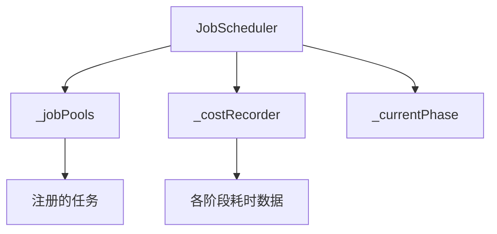
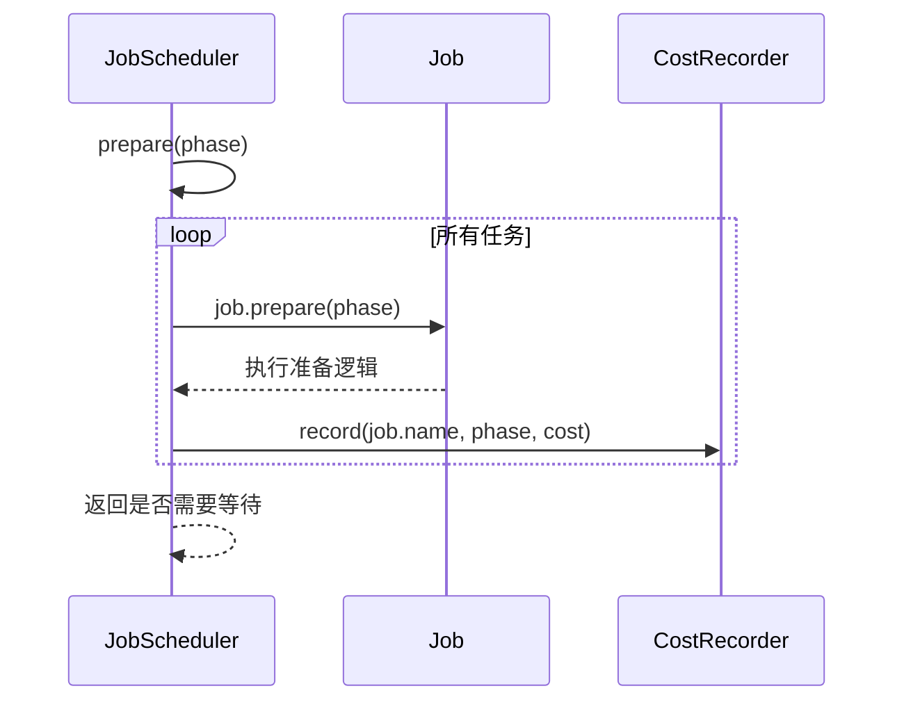
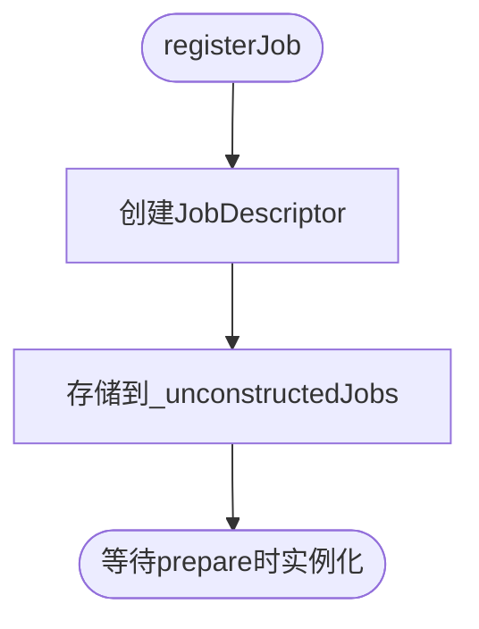
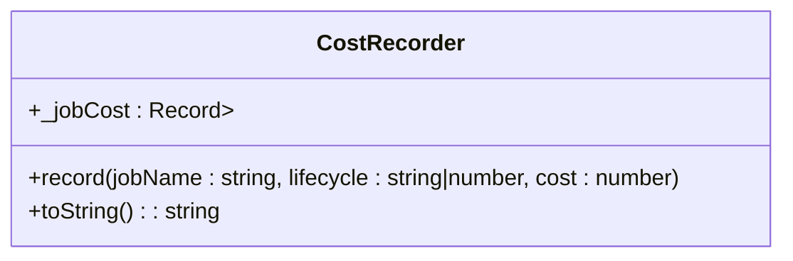

# 调度器核心

<cite>
**本文档引用文件**  
- [job-scheduler.ts](file://packages/h5-builder/src/bedrock/launch/job-scheduler.ts)
- [cost-recorder.ts](file://packages/h5-builder/src/bedrock/launch/cost-recorder.ts)
- [demo-progressive.tsx](file://packages/h5-builder/src/demo-progressive.tsx)
</cite>

## 目录
1. [简介](#简介)
2. [核心组件与架构](#核心组件与架构)
3. [JobScheduler设计与实现](#jobscheduler设计与实现)
4. [阶段控制机制](#阶段控制机制)
5. [任务注册方式](#任务注册方式)
6. [性能记录器CostRecorder](#性能记录器costrecorder)
7. [实际调度流程示例](#实际调度流程示例)
8. [依赖注入与初始化](#依赖注入与初始化)
9. [总结](#总结)

## 简介
JobScheduler是应用生命周期管理的核心编排中枢，负责协调各个阶段的任务执行。它通过_phase阶段控制、_jobPools任务池和_costRecorder性能记录器的协同工作，实现了精细化的任务调度与性能监控。本文档详细解析其设计原理与实现机制。

## 核心组件与架构
JobScheduler系统由三个核心组件构成：任务调度器（JobScheduler）、任务池（_jobPools）和成本记录器（CostRecorder）。这些组件共同协作，确保任务按预定阶段有序执行，并记录关键性能指标。

**图示来源**  
- [job-scheduler.ts](file://packages/h5-builder/src/bedrock/launch/job-scheduler.ts#L17-L19)

## JobScheduler设计与实现
JobScheduler类作为任务编排中枢，维护当前阶段状态、任务池和性能记录器。其构造函数接收当前阶段和依赖注入服务，确保任务实例化时能够正确注入所需依赖。

**核心属性：**
- `_currentPhase`：当前所处的生命周期阶段
- `_jobPools`：已注册任务的映射表
- `_costRecorder`：性能数据记录器
- `_unconstructedJobs`：待实例化的任务描述符

**Section sources**
- [job-scheduler.ts](file://packages/h5-builder/src/bedrock/launch/job-scheduler.ts#L16-L24)

## 阶段控制机制
JobScheduler通过prepare、wait和advanceToPhase三个方法实现阶段推进机制，确保任务在正确的时机执行。

### prepare方法
在指定阶段准备所有相关任务，测量每个任务的准备耗时并记录到_costRecorder中。如果任何任务返回shouldWait为true，则表示需要异步等待。

**图示来源**  
- [job-scheduler.ts](file://packages/h5-builder/src/bedrock/launch/job-scheduler.ts#L65-L82)

### wait方法
异步等待需要延迟执行的任务完成。该方法收集所有shouldWait为true的任务，执行其wait方法，并记录执行耗时。

### advanceToPhase方法
推进到目标阶段，前提是目标阶段没有需要等待的任务。该方法会验证所有任务的shouldWait状态，确保可以安全推进。

**Section sources**
- [job-scheduler.ts](file://packages/h5-builder/src/bedrock/launch/job-scheduler.ts#L65-L121)

## 任务注册方式
JobScheduler提供两种任务注册方式：registerJob和addJob，适用于不同场景。

### registerJob
用于按需注册任务，任务在指定phase阶段才会进行实例化。这种方式适合延迟加载的场景，可以减少初始内存占用。

### addJob
用于直接添加已经构造好的任务实例。这种方式适合需要立即注册的任务，或者需要外部控制实例化过程的场景。

**关键区别：**
- **registerJob**：延迟实例化，按阶段触发
- **addJob**：立即注册，任务已存在

**Section sources**
- [job-scheduler.ts](file://packages/h5-builder/src/bedrock/launch/job-scheduler.ts#L36-L55)

## 性能记录器CostRecorder
CostRecorder负责记录每个Job在各生命周期阶段的执行耗时，为性能分析提供数据支持。

### 数据结构
使用嵌套的对象结构存储性能数据：
- 外层对象以jobName为键
- 内层对象以lifecycle阶段为键
- 值为对应阶段的累计耗时（毫秒）

### 记录机制
通过record方法记录耗时数据，支持同一任务在同一阶段的多次执行耗时累加。

**图示来源**  
- [cost-recorder.ts](file://packages/h5-builder/src/bedrock/launch/cost-recorder.ts#L5-L22)

## 实际调度流程示例
从demo-progressive.tsx中提取的实际调度流程展示了Open、Prepare、Render等阶段的递进关系。

该流程体现了JobScheduler如何协调不同阶段的任务执行，确保应用生命周期的有序推进。

**Section sources**
- [demo-progressive.tsx](file://packages/h5-builder/src/demo-progressive.tsx)

## 依赖注入与初始化
JobScheduler通过依赖注入容器进行服务注入，确保任务实例化时能够获取所需依赖。

### 初始化过程
1. 创建JobScheduler实例时注入IInstantiationService
2. 在prepare阶段使用该服务创建任务实例
3. 传递静态参数和依赖项

### 状态同步
_currentPhase属性保持与应用当前阶段的同步，确保任务能够根据当前状态做出正确决策。

**Section sources**
- [job-scheduler.ts](file://packages/h5-builder/src/bedrock/launch/job-scheduler.ts#L21-L24)

## 总结
JobScheduler作为任务编排中枢，通过精心设计的阶段控制、任务管理和性能记录机制，实现了高效的应用生命周期管理。其灵活的任务注册方式和完善的性能监控能力，为复杂应用的稳定运行提供了坚实基础。