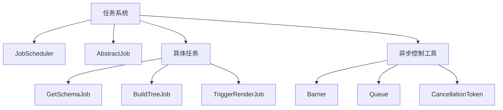
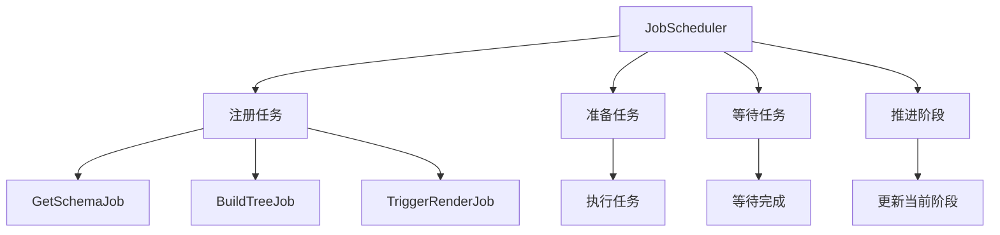
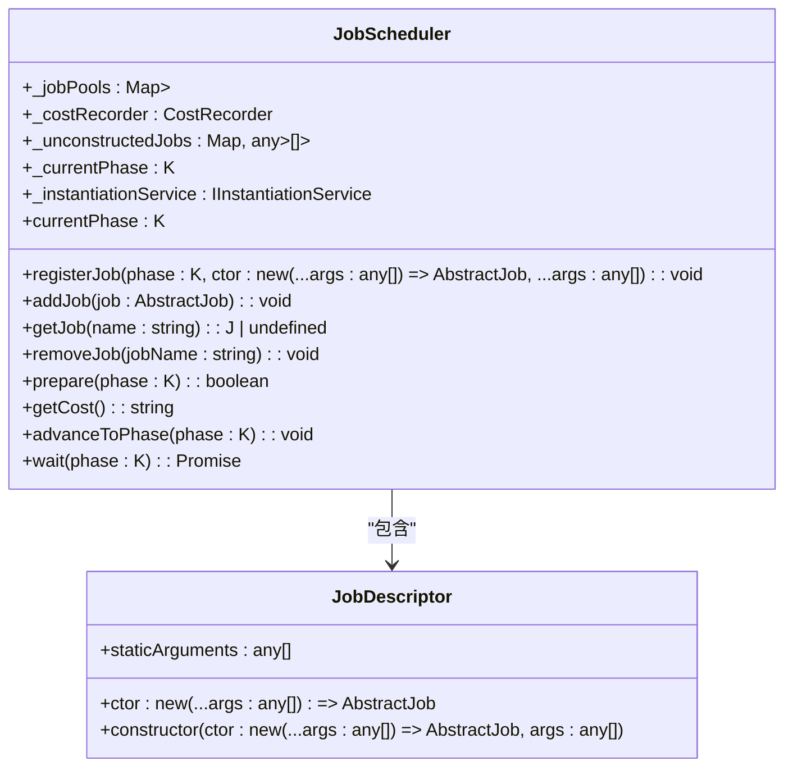
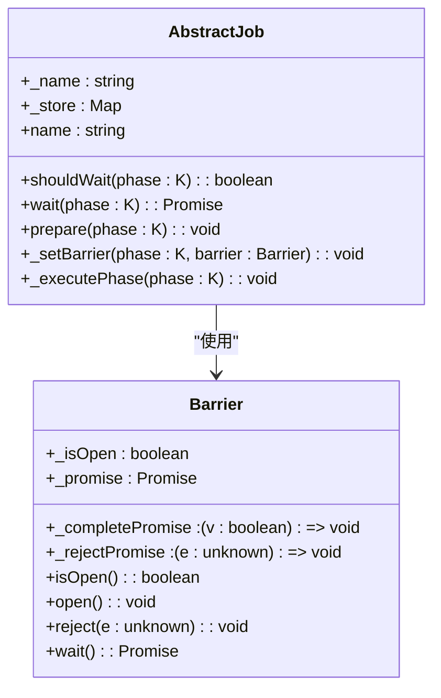
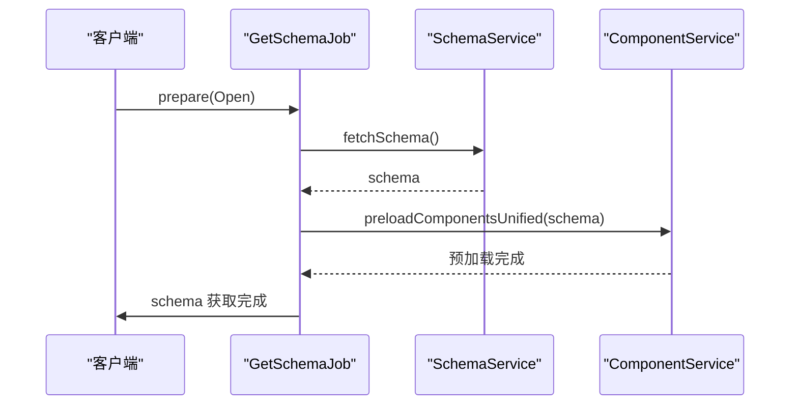
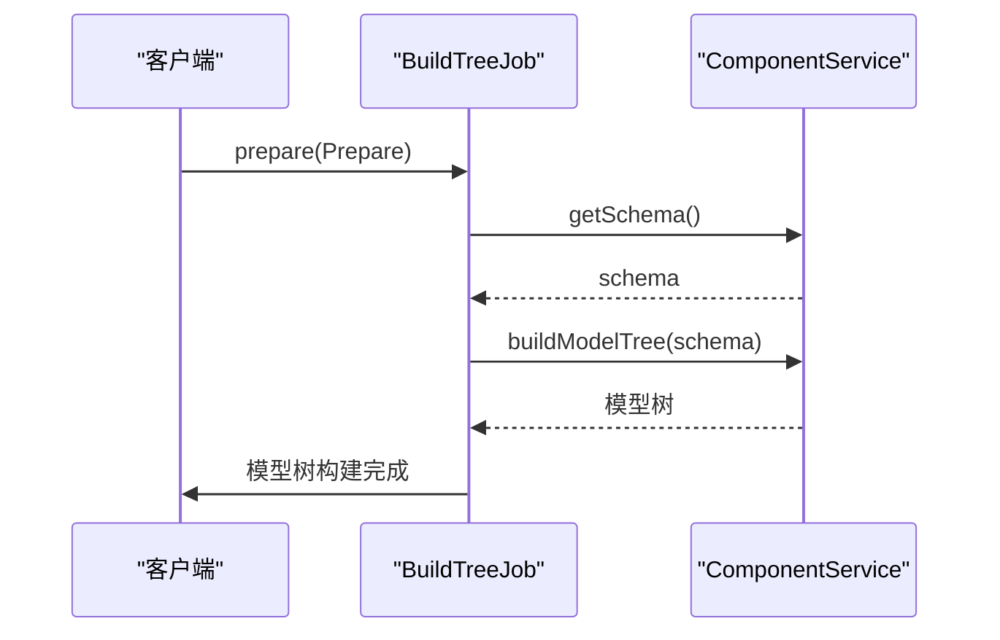
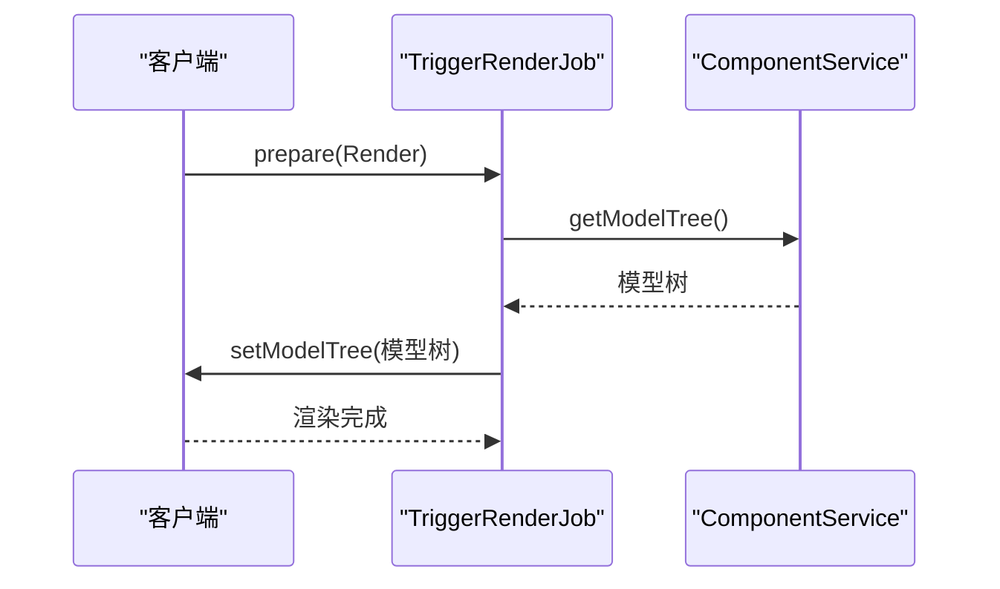
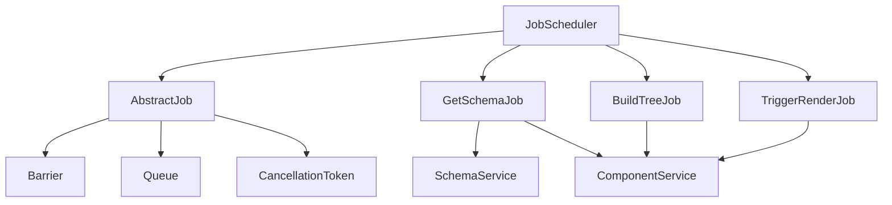

# 任务系统

<cite>
**本文档引用的文件**
- [job-scheduler.ts](file://packages/h5-builder/src/bedrock/launch/job-scheduler.ts)
- [abstract-job.ts](file://packages/h5-builder/src/bedrock/launch/abstract-job.ts)
- [get-schema-job.ts](file://packages/h5-builder/src/jobs/get-schema-job.ts)
- [build-tree-job.ts](file://packages/h5-builder/src/jobs/build-tree-job.ts)
- [trigger-render-job.ts](file://packages/h5-builder/src/jobs/trigger-render-job.ts)
- [lifecycle.ts](file://packages/h5-builder/src/jobs/lifecycle.ts)
- [barrier.ts](file://packages/h5-builder/src/bedrock/async/barrier.ts)
- [cost-recorder.ts](file://packages/h5-builder/src/bedrock/launch/cost-recorder.ts)
- [schema.service.ts](file://packages/h5-builder/src/services/schema.service.ts)
- [component.service.ts](file://packages/h5-builder/src/services/component.service.ts)
- [queue.ts](file://packages/h5-builder/src/bedrock/async/queue/queue.ts)
- [cancellation.ts](file://packages/h5-builder/src/bedrock/async/cancellation.ts)
- [scheduler.ts](file://packages/h5-builder/src/bedrock/scheduler/core/scheduler.ts)
- [job-scheduler.test.ts](file://packages/h5-builder/src/bedrock/launch/job-scheduler.test.ts)
- [barrier.test.ts](file://packages/h5-builder/src/bedrock/async/barrier.test.ts)
</cite>

## 目录
1. [简介](#简介)
2. [项目结构](#项目结构)
3. [核心组件](#核心组件)
4. [架构概述](#架构概述)
5. [详细组件分析](#详细组件分析)
6. [依赖分析](#依赖分析)
7. [性能考虑](#性能考虑)
8. [故障排除指南](#故障排除指南)
9. [结论](#结论)

## 简介
h5-builder 任务系统是一个基于任务驱动的页面构建流程管理系统，通过 JobScheduler 调度和执行各种构建任务，如获取 schema、构建模型树和触发渲染。该系统利用异步控制工具（如队列、屏障、取消令牌）确保任务的正确执行，并支持自定义任务的开发和注册。本文档详细解释了任务系统的各个组成部分及其工作原理。

## 项目结构
h5-builder 项目的任务系统主要位于 `packages/h5-builder/src/bedrock/launch` 和 `packages/h5-builder/src/jobs` 目录下。`bedrock/launch` 目录包含任务调度器和抽象任务类，而 `jobs` 目录包含具体的任务实现。

**图源**
- [job-scheduler.ts](file://packages/h5-builder/src/bedrock/launch/job-scheduler.ts)
- [abstract-job.ts](file://packages/h5-builder/src/bedrock/launch/abstract-job.ts)
- [get-schema-job.ts](file://packages/h5-builder/src/jobs/get-schema-job.ts)
- [build-tree-job.ts](file://packages/h5-builder/src/jobs/build-tree-job.ts)
- [trigger-render-job.ts](file://packages/h5-builder/src/jobs/trigger-render-job.ts)
- [barrier.ts](file://packages/h5-builder/src/bedrock/async/barrier.ts)
- [queue.ts](file://packages/h5-builder/src/bedrock/async/queue/queue.ts)
- [cancellation.ts](file://packages/h5-builder/src/bedrock/async/cancellation.ts)

**节源**
- [job-scheduler.ts](file://packages/h5-builder/src/bedrock/launch/job-scheduler.ts)
- [abstract-job.ts](file://packages/h5-builder/src/bedrock/launch/abstract-job.ts)
- [get-schema-job.ts](file://packages/h5-builder/src/jobs/get-schema-job.ts)
- [build-tree-job.ts](file://packages/h5-builder/src/jobs/build-tree-job.ts)
- [trigger-render-job.ts](file://packages/h5-builder/src/jobs/trigger-render-job.ts)
- [barrier.ts](file://packages/h5-builder/src/bedrock/async/barrier.ts)
- [queue.ts](file://packages/h5-builder/src/bedrock/async/queue/queue.ts)
- [cancellation.ts](file://packages/h5-builder/src/bedrock/async/cancellation.ts)

## 核心组件
任务系统的核心组件包括 JobScheduler、AbstractJob 和具体的任务类（如 GetSchemaJob、BuildTreeJob 和 TriggerRenderJob）。JobScheduler 负责调度和执行任务，AbstractJob 提供了任务的基类，具体任务类实现了特定的构建逻辑。

**节源**
- [job-scheduler.ts](file://packages/h5-builder/src/bedrock/launch/job-scheduler.ts)
- [abstract-job.ts](file://packages/h5-builder/src/bedrock/launch/abstract-job.ts)
- [get-schema-job.ts](file://packages/h5-builder/src/jobs/get-schema-job.ts)
- [build-tree-job.ts](file://packages/h5-builder/src/jobs/build-tree-job.ts)
- [trigger-render-job.ts](file://packages/h5-builder/src/jobs/trigger-render-job.ts)

## 架构概述
任务系统的架构基于任务驱动的模式，通过 JobScheduler 调度和执行各种构建任务。每个任务在特定的生命周期阶段执行，确保页面构建流程的有序进行。异步控制工具（如 Barrier、Queue 和 CancellationToken）用于确保任务的正确执行和资源的有效管理。

**图源**
- [job-scheduler.ts](file://packages/h5-builder/src/bedrock/launch/job-scheduler.ts)
- [get-schema-job.ts](file://packages/h5-builder/src/jobs/get-schema-job.ts)
- [build-tree-job.ts](file://packages/h5-builder/src/jobs/build-tree-job.ts)
- [trigger-render-job.ts](file://packages/h5-builder/src/jobs/trigger-render-job.ts)

## 详细组件分析

### JobScheduler 分析
JobScheduler 是任务系统的核心调度器，负责管理任务的注册、准备、等待和推进。它通过 `registerJob` 方法按需添加任务，并在特定阶段实例化任务。`prepare` 方法准备任务，`wait` 方法等待任务完成，`advanceToPhase` 方法推进到目标阶段。

#### 类图

**图源**
- [job-scheduler.ts](file://packages/h5-builder/src/bedrock/launch/job-scheduler.ts)

**节源**
- [job-scheduler.ts](file://packages/h5-builder/src/bedrock/launch/job-scheduler.ts)

### AbstractJob 分析
AbstractJob 是所有任务的基类，定义了任务的基本行为和生命周期方法。它通过 `shouldWait` 方法判断任务是否需要等待，`wait` 方法等待任务完成，`prepare` 方法准备任务，`_executePhase` 方法执行任务。

#### 类图

**图源**
- [abstract-job.ts](file://packages/h5-builder/src/bedrock/launch/abstract-job.ts)
- [barrier.ts](file://packages/h5-builder/src/bedrock/async/barrier.ts)

**节源**
- [abstract-job.ts](file://packages/h5-builder/src/bedrock/launch/abstract-job.ts)
- [barrier.ts](file://packages/h5-builder/src/bedrock/async/barrier.ts)

### GetSchemaJob 分析
GetSchemaJob 负责在页面打开阶段获取 schema。它通过 `fetchSchema` 方法从远程获取 schema，并通过 `preloadComponentsUnified` 方法预加载组件资源。

#### 序列图

**图源**
- [get-schema-job.ts](file://packages/h5-builder/src/jobs/get-schema-job.ts)
- [schema.service.ts](file://packages/h5-builder/src/services/schema.service.ts)
- [component.service.ts](file://packages/h5-builder/src/services/component.service.ts)

**节源**
- [get-schema-job.ts](file://packages/h5-builder/src/jobs/get-schema-job.ts)
- [schema.service.ts](file://packages/h5-builder/src/services/schema.service.ts)
- [component.service.ts](file://packages/h5-builder/src/services/component.service.ts)

### BuildTreeJob 分析
BuildTreeJob 负责在准备阶段构建模型树。它通过 `buildModelTree` 方法根据 schema 构建模型树。

#### 序列图

**图源**
- [build-tree-job.ts](file://packages/h5-builder/src/jobs/build-tree-job.ts)
- [component.service.ts](file://packages/h5-builder/src/services/component.service.ts)

**节源**
- [build-tree-job.ts](file://packages/h5-builder/src/jobs/build-tree-job.ts)
- [component.service.ts](file://packages/h5-builder/src/services/component.service.ts)

### TriggerRenderJob 分析
TriggerRenderJob 负责在渲染阶段触发 React 渲染。它通过 `setModelTree` 回调函数触发外部的渲染。

#### 序列图

**图源**
- [trigger-render-job.ts](file://packages/h5-builder/src/jobs/trigger-render-job.ts)
- [component.service.ts](file://packages/h5-builder/src/services/component.service.ts)

**节源**
- [trigger-render-job.ts](file://packages/h5-builder/src/jobs/trigger-render-job.ts)
- [component.service.ts](file://packages/h5-builder/src/services/component.service.ts)

## 依赖分析
任务系统依赖于多个核心组件和工具，包括 JobScheduler、AbstractJob、具体任务类、异步控制工具（如 Barrier、Queue 和 CancellationToken）以及服务类（如 SchemaService 和 ComponentService）。这些组件和工具共同协作，确保任务的正确执行和资源的有效管理。

**图源**
- [job-scheduler.ts](file://packages/h5-builder/src/bedrock/launch/job-scheduler.ts)
- [abstract-job.ts](file://packages/h5-builder/src/bedrock/launch/abstract-job.ts)
- [get-schema-job.ts](file://packages/h5-builder/src/jobs/get-schema-job.ts)
- [build-tree-job.ts](file://packages/h5-builder/src/jobs/build-tree-job.ts)
- [trigger-render-job.ts](file://packages/h5-builder/src/jobs/trigger-render-job.ts)
- [barrier.ts](file://packages/h5-builder/src/bedrock/async/barrier.ts)
- [queue.ts](file://packages/h5-builder/src/bedrock/async/queue/queue.ts)
- [cancellation.ts](file://packages/h5-builder/src/bedrock/async/cancellation.ts)
- [schema.service.ts](file://packages/h5-builder/src/services/schema.service.ts)
- [component.service.ts](file://packages/h5-builder/src/services/component.service.ts)

**节源**
- [job-scheduler.ts](file://packages/h5-builder/src/bedrock/launch/job-scheduler.ts)
- [abstract-job.ts](file://packages/h5-builder/src/bedrock/launch/abstract-job.ts)
- [get-schema-job.ts](file://packages/h5-builder/src/jobs/get-schema-job.ts)
- [build-tree-job.ts](file://packages/h5-builder/src/jobs/build-tree-job.ts)
- [trigger-render-job.ts](file://packages/h5-builder/src/jobs/trigger-render-job.ts)
- [barrier.ts](file://packages/h5-builder/src/bedrock/async/barrier.ts)
- [queue.ts](file://packages/h5-builder/src/bedrock/async/queue/queue.ts)
- [cancellation.ts](file://packages/h5-builder/src/bedrock/async/cancellation.ts)
- [schema.service.ts](file://packages/h5-builder/src/services/schema.service.ts)
- [component.service.ts](file://packages/h5-builder/src/services/component.service.ts)

## 性能考虑
任务系统通过异步控制工具（如 Barrier、Queue 和 CancellationToken）确保任务的正确执行和资源的有效管理。JobScheduler 通过 `getCost` 方法记录每个任务在不同阶段的耗时，帮助开发者优化任务执行流程。

**节源**
- [cost-recorder.ts](file://packages/h5-builder/src/bedrock/launch/cost-recorder.ts)

## 故障排除指南
在使用任务系统时，可能会遇到一些常见问题，如任务未按预期执行、资源加载失败等。以下是一些常见的故障排除技巧：

1. **检查任务注册**：确保所有任务都已正确注册到 JobScheduler。
2. **检查异步控制**：确保 Barrier、Queue 和 CancellationToken 的使用正确，避免死锁或资源泄露。
3. **检查服务依赖**：确保所有服务（如 SchemaService 和 ComponentService）都已正确注入和初始化。
4. **查看日志**：通过日志查看任务的执行情况和错误信息，帮助定位问题。

**节源**
- [job-scheduler.test.ts](file://packages/h5-builder/src/bedrock/launch/job-scheduler.test.ts)
- [barrier.test.ts](file://packages/h5-builder/src/bedrock/async/barrier.test.ts)

## 结论
h5-builder 任务系统通过 JobScheduler 调度和执行各种构建任务，确保页面构建流程的有序进行。通过异步控制工具（如 Barrier、Queue 和 CancellationToken）确保任务的正确执行和资源的有效管理。开发者可以轻松地创建和注册新的任务类型，优化任务执行流程，提高页面构建的效率和可靠性。