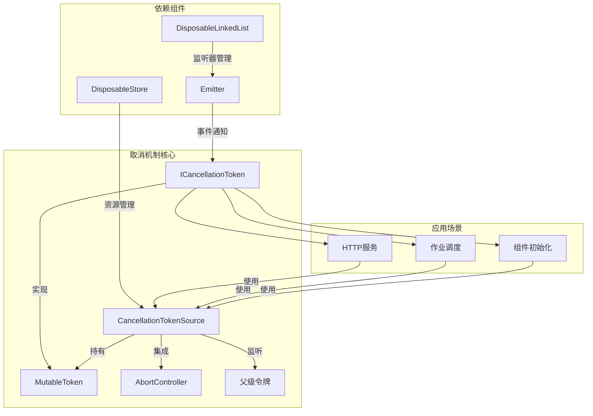
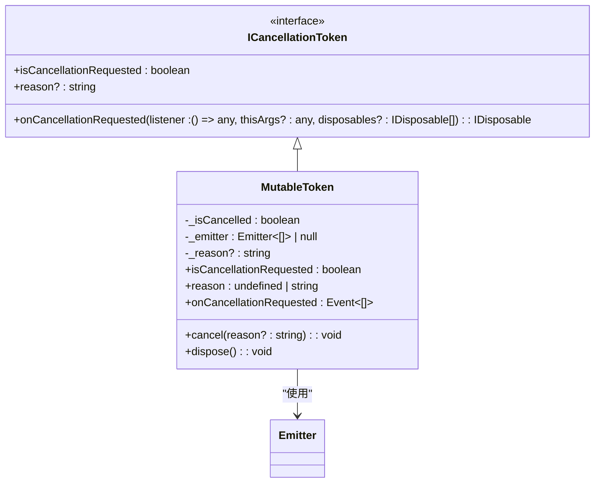
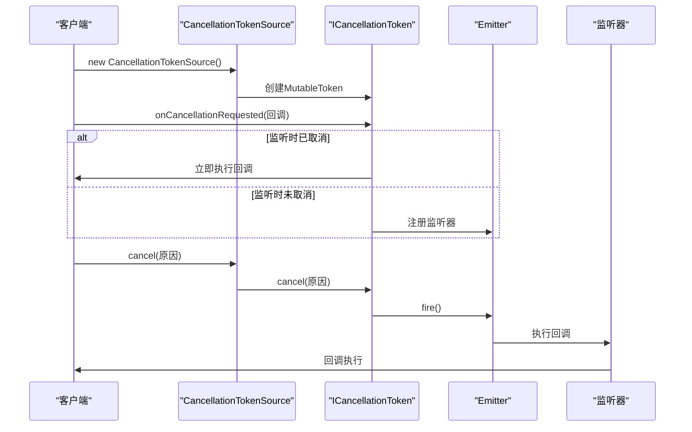
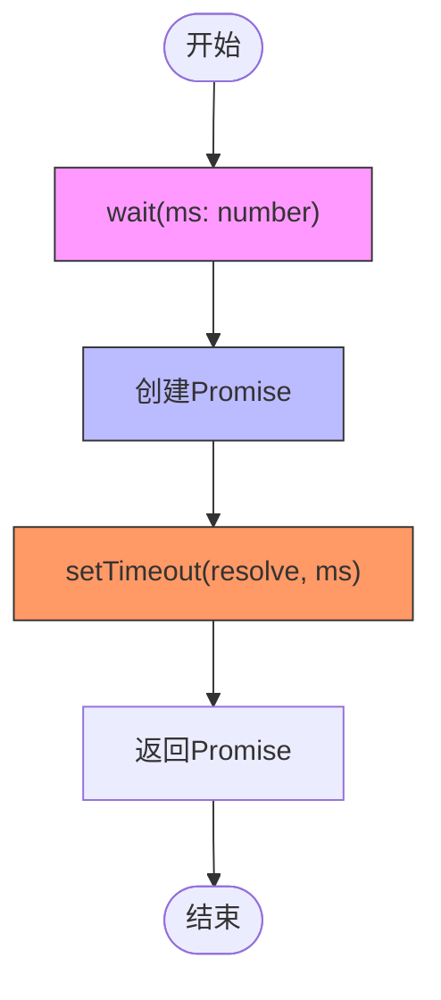
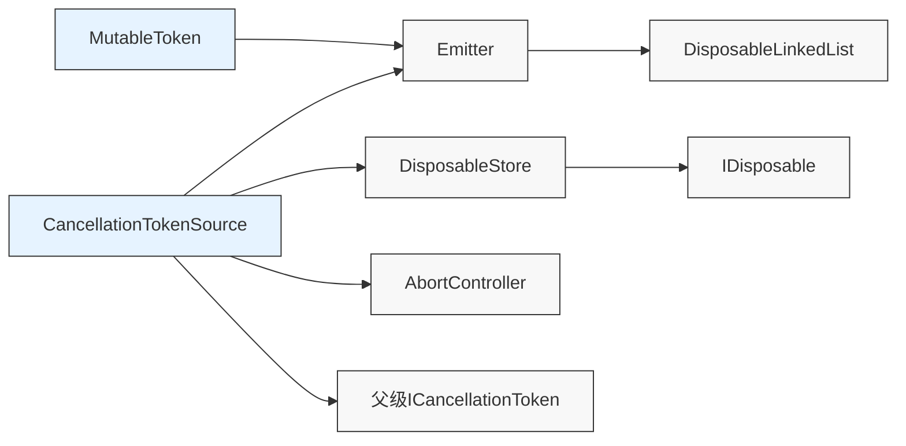

# 取消机制

<cite>
**本文档引用的文件**
- [cancellation.ts](file://packages/h5-builder/src/bedrock/async/cancellation.ts)
- [cancellation.test.ts](file://packages/h5-builder/src/bedrock/async/cancellation.test.ts)
- [wait.ts](file://packages/h5-builder/src/bedrock/async/wait.ts)
- [emitter.ts](file://packages/h5-builder/src/bedrock/event/emitter.ts)
- [disposable-store.ts](file://packages/h5-builder/src/bedrock/dispose/disposable-store.ts)
- [disposable-t.ts](file://packages/h5-builder/src/bedrock/dispose/disposable-t.ts)
- [http.service.ts](file://packages/h5-builder/src/services/http.service.ts)
- [job-scheduler.ts](file://packages/h5-builder/src/bedrock/launch/job-scheduler.ts)
</cite>

## 目录
1. [引言](#引言)
2. [核心组件](#核心组件)
3. [架构概述](#架构概述)
4. [详细组件分析](#详细组件分析)
5. [依赖分析](#依赖分析)
6. [性能考虑](#性能考虑)
7. [故障排除指南](#故障排除指南)
8. [结论](#结论)

## 引言
本文档深入探讨了MobX项目中异步操作取消机制的实现，重点介绍Cancellation Token模式的设计与应用。该机制通过令牌传递的方式，实现了对异步任务的安全中止，有效防止了资源泄漏和无效计算。文档将结合代码示例，展示在HTTP请求、长时间运行的作业或组件初始化过程中如何注册取消监听并响应中断信号。同时，分析其基于事件监听和状态标记的内部实现，讨论取消传播的层级控制策略，并提供最佳实践建议。

## 核心组件
本节分析取消机制的核心组件，包括取消令牌接口、可变令牌实现、取消令牌源类等关键元素。这些组件共同构成了一个健壮的异步操作取消框架，支持传统的取消用法以及与浏览器原生AbortController的集成。

**本节来源**
- [cancellation.ts](file://packages/h5-builder/src/bedrock/async/cancellation.ts#L1-L194)

## 架构概述
取消机制采用分层架构设计，核心是ICancellationToken接口和CancellationTokenSource类。通过事件发射器（Emitter）实现监听机制，利用Disposable模式管理资源生命周期。整个架构支持取消信号的层级传播，允许父级取消操作自动触发子级取消。

**图表来源**
- [cancellation.ts](file://packages/h5-builder/src/bedrock/async/cancellation.ts#L10-L194)
- [emitter.ts](file://packages/h5-builder/src/bedrock/event/emitter.ts#L82-L163)
- [disposable-store.ts](file://packages/h5-builder/src/bedrock/dispose/disposable-store.ts#L6-L84)

## 详细组件分析

### 取消令牌接口分析
ICancellationToken接口定义了取消操作的核心契约，包括取消状态查询、取消原因获取和取消事件监听。该接口采用不可变设计原则，确保状态的一致性。

**图表来源**
- [cancellation.ts](file://packages/h5-builder/src/bedrock/async/cancellation.ts#L10-L89)

### 取消令牌源分析
CancellationTokenSource类是取消机制的控制中心，负责创建和管理取消令牌。它支持层级取消传播，当父级令牌被取消时，子级令牌也会自动取消。同时提供与浏览器AbortController的集成，便于在fetch等原生API中使用。

**图表来源**
- [cancellation.ts](file://packages/h5-builder/src/bedrock/async/cancellation.ts#L133-L193)
- [emitter.ts](file://packages/h5-builder/src/bedrock/event/emitter.ts#L82-L163)

### 辅助工具分析
取消机制提供了一系列辅助工具函数，如wait和sleep，用于创建可取消的异步延迟操作。这些工具与取消令牌协同工作，构建可中断的异步流程。

**图表来源**
- [wait.ts](file://packages/h5-builder/src/bedrock/async/wait.ts#L1-L10)

## 依赖分析
取消机制与其他组件存在紧密的依赖关系，这些依赖确保了资源的正确管理和事件的可靠传递。

**图表来源**
- [cancellation.ts](file://packages/h5-builder/src/bedrock/async/cancellation.ts#L1-L194)
- [emitter.ts](file://packages/h5-builder/src/bedrock/event/emitter.ts#L82-L163)
- [disposable-store.ts](file://packages/h5-builder/src/bedrock/dispose/disposable-store.ts#L6-L84)
- [disposable-t.ts](file://packages/h5-builder/src/bedrock/dispose/disposable-t.ts#L13-L239)

**本节来源**
- [cancellation.ts](file://packages/h5-builder/src/bedrock/async/cancellation.ts#L1-L194)
- [emitter.ts](file://packages/h5-builder/src/bedrock/event/emitter.ts#L1-L163)
- [disposable-store.ts](file://packages/h5-builder/src/bedrock/dispose/disposable-store.ts#L1-L84)
- [disposable-t.ts](file://packages/h5-builder/src/bedrock/dispose/disposable-t.ts#L1-L239)

## 性能考虑
取消机制在设计时充分考虑了性能因素：
1. 对于已取消的令牌，使用快捷事件避免创建Emitter实例
2. 单监听器场景下直接执行，避免创建DeliveryQueue
3. 使用Set数据结构管理Disposable资源，确保O(1)的查找和删除性能
4. 采用LIFO顺序清理资源，优化内存访问模式

虽然存在一些潜在的性能开销，如事件发射器的间接调用和DisposableStore的额外管理，但这些开销在大多数应用场景下是可以接受的，且被其带来的安全性和可靠性优势所抵消。

## 故障排除指南
在使用取消机制时可能遇到以下常见问题：

**本节来源**
- [cancellation.test.ts](file://packages/h5-builder/src/bedrock/async/cancellation.test.ts#L1-L86)
- [http.service.ts](file://packages/h5-builder/src/services/http.service.ts)
- [job-scheduler.ts](file://packages/h5-builder/src/bedrock/launch/job-scheduler.ts)

### 取消信号未生效
问题：调用cancel()后，异步操作仍在继续执行。

解决方案：
1. 确保在异步操作的关键检查点调用`token.isCancellationRequested`
2. 检查是否正确传递了令牌引用
3. 验证监听器是否正确注册

### 资源泄漏
问题：取消后相关资源未被正确释放。

解决方案：
1. 确保所有可销毁资源都通过`_register`方法注册到DisposableStore
2. 在dispose方法中正确清理所有资源
3. 使用MutableDisposable容器管理动态更新的资源

### 层级取消失效
问题：父级取消未触发子级取消。

解决方案：
1. 确保子级CancellationTokenSource正确接收父级令牌作为构造参数
2. 验证_parentListener是否成功创建
3. 检查父级令牌的onCancellationRequested事件是否正常工作

## 结论
本文档详细分析了MobX项目中的异步操作取消机制。该机制通过Cancellation Token模式实现了安全、可靠的异步任务中止功能。核心设计包括：
- 基于接口的契约定义，确保类型安全
- 事件驱动的取消通知机制，支持灵活的监听模式
- 与浏览器原生AbortController的无缝集成
- 层级化的取消传播策略
- 完善的资源管理机制

最佳实践建议：
1. 及时清理不再需要的监听器
2. 避免在取消后更新状态
3. 合理使用层级取消来管理复杂的异步依赖关系
4. 在长时间运行的操作中定期检查取消状态
5. 利用withTimeout等辅助工具构建可中断的异步流程

这套取消机制为处理复杂的异步场景提供了坚实的基础，有效防止了资源泄漏和无效计算，提升了应用的稳定性和用户体验。