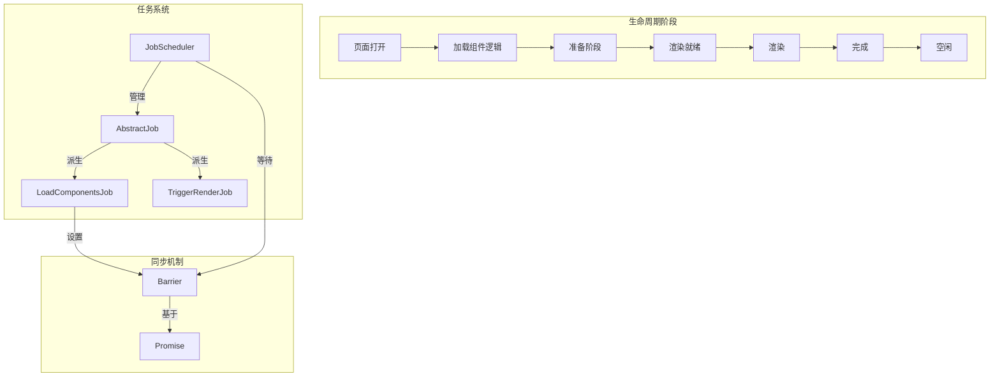
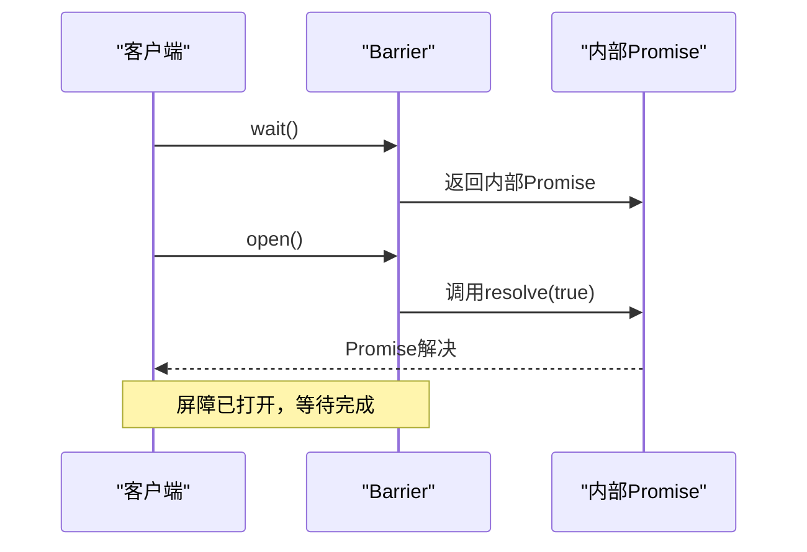
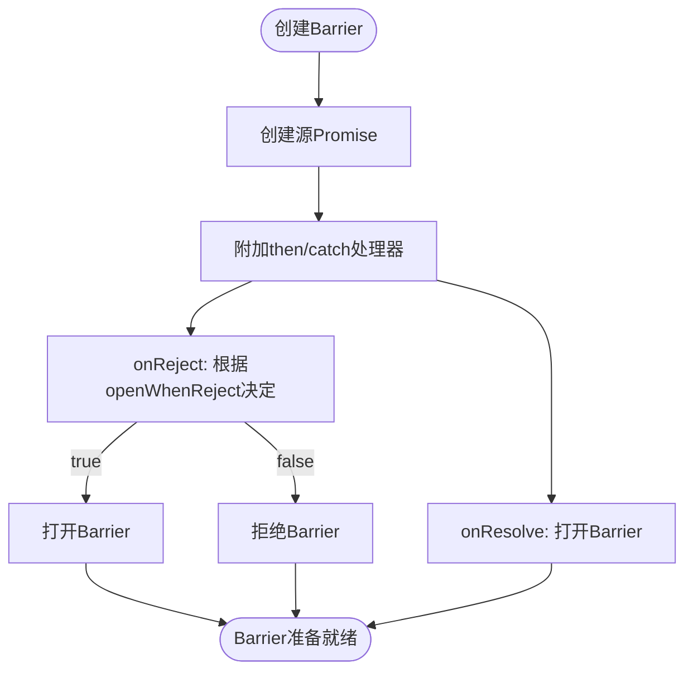
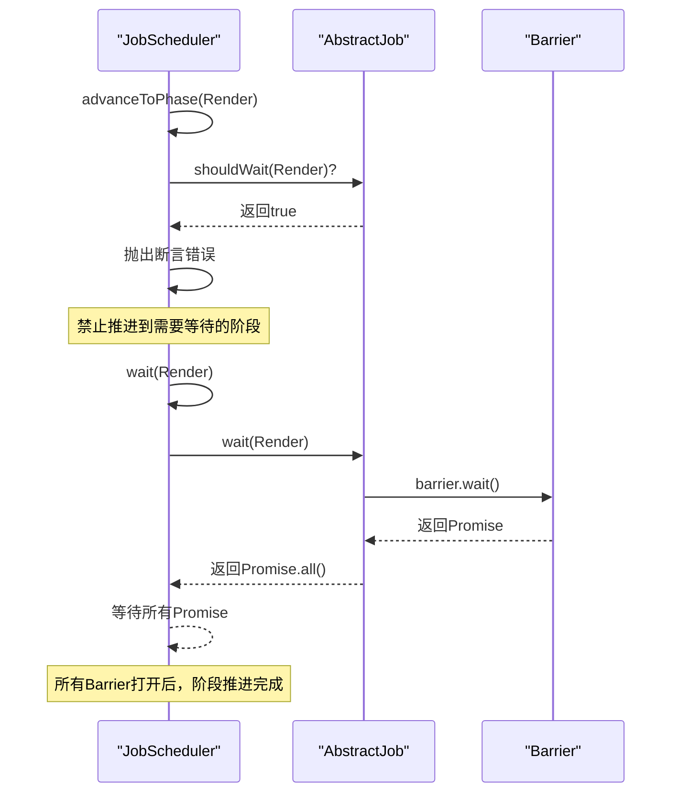
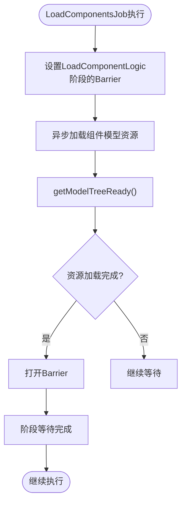
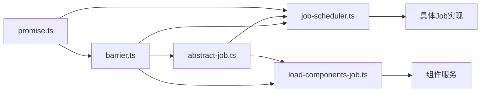
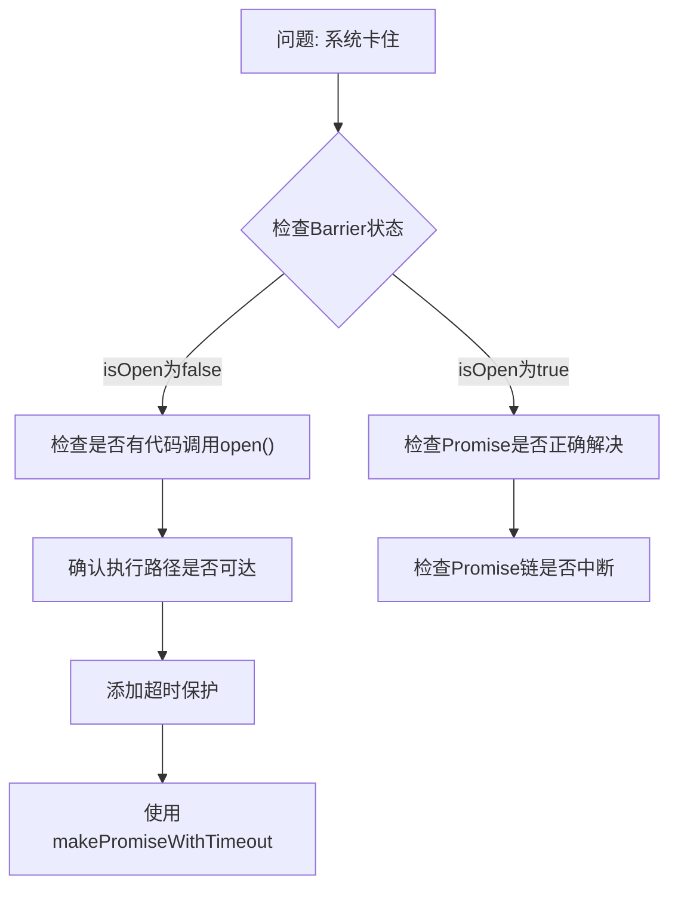

# 同步屏障

<cite>
**本文档中引用的文件**
- [barrier.ts](file://packages/h5-builder/src/bedrock/async/barrier.ts)
- [barrier.test.ts](file://packages/h5-builder/src/bedrock/async/barrier.test.ts)
- [job-scheduler.ts](file://packages/h5-builder/src/bedrock/launch/job-scheduler.ts)
- [abstract-job.ts](file://packages/h5-builder/src/bedrock/launch/abstract-job.ts)
- [load-components-job.ts](file://packages/h5-builder/src/jobs/load-components-job.ts)
- [trigger-render-job.ts](file://packages/h5-builder/src/jobs/trigger-render-job.ts)
- [lifecycle.ts](file://packages/h5-builder/src/jobs/lifecycle.ts)
- [wait.ts](file://packages/h5-builder/src/bedrock/async/wait.ts)
- [promise.ts](file://packages/h5-builder/src/bedrock/promise/promise.ts)
</cite>

## 目录
1. [引言](#引言)
2. [核心组件](#核心组件)
3. [架构概述](#架构概述)
4. [详细组件分析](#详细组件分析)
5. [依赖分析](#依赖分析)
6. [性能考量](#性能考量)
7. [故障排除指南](#故障排除指南)
8. [结论](#结论)

## 引言
同步屏障（Barrier）是一种关键的并发控制机制，用于协调多个异步任务的执行流程。在复杂的前端构建系统中，它作为同步点，确保一组异步操作全部完成后再继续执行后续逻辑。本文档深入探讨了Barrier在多任务协调中的作用，特别是其在页面构建过程中等待所有组件数据加载完毕后触发整体渲染的应用场景。我们将解析其基于引用计数和Promise的实现原理，并讨论线程安全性和潜在的死锁风险及规避策略。

## 核心组件
同步屏障的核心实现位于`barrier.ts`文件中，提供了一个可控制的Promise机制，允许外部显式地打开屏障以解决等待。`job-scheduler.ts`和`abstract-job.ts`共同构成了任务调度框架，其中Barrier被用作阶段推进的同步点。`load-components-job.ts`展示了如何在实际业务场景中使用Barrier来协调组件资源的加载。

**Section sources**
- [barrier.ts](file://packages/h5-builder/src/bedrock/async/barrier.ts#L1-L59)
- [job-scheduler.ts](file://packages/h5-builder/src/bedrock/launch/job-scheduler.ts#L1-L123)
- [abstract-job.ts](file://packages/h5-builder/src/bedrock/launch/abstract-job.ts#L1-L46)

## 架构概述
系统采用基于生命周期阶段的任务调度架构，通过JobScheduler管理不同阶段的任务执行。每个任务（Job）可以为特定阶段设置Barrier，JobScheduler在推进到该阶段时会等待所有相关Barrier被打开。这种设计实现了清晰的阶段划分和依赖管理，确保了复杂的异步操作能够有序协调。

**Diagram sources**
- [job-scheduler.ts](file://packages/h5-builder/src/bedrock/launch/job-scheduler.ts#L16-L123)
- [abstract-job.ts](file://packages/h5-builder/src/bedrock/launch/abstract-job.ts#L3-L46)
- [lifecycle.ts](file://packages/h5-builder/src/jobs/lifecycle.ts#L1-L18)

## 详细组件分析

### 同步屏障（Barrier）分析
Barrier类是同步机制的核心，它封装了一个Promise，该Promise的状态由外部显式控制。通过`open()`方法可以永久性地解决Promise，而`wait()`方法返回这个Promise，供其他代码等待。

#### 关键方法工作机制

**Diagram sources**
- [barrier.ts](file://packages/h5-builder/src/bedrock/async/barrier.ts#L11-L41)

#### 基于Promise的Barrier创建
`makeBarrierByPromise`函数提供了一种便捷方式，将现有Promise转换为Barrier。当源Promise解决时，Barrier自动打开；当源Promise拒绝时，可根据配置选择打开或拒绝Barrier。

**Diagram sources**
- [barrier.ts](file://packages/h5-builder/src/bedrock/async/barrier.ts#L43-L58)
- [barrier.test.ts](file://packages/h5-builder/src/bedrock/async/barrier.test.ts#L19-L90)

### 任务调度系统分析
JobScheduler与AbstractJob共同构成了任务调度框架，其中Barrier被用作阶段同步的关键机制。

#### 生命周期阶段推进

**Diagram sources**
- [job-scheduler.ts](file://packages/h5-builder/src/bedrock/launch/job-scheduler.ts#L103-L120)
- [abstract-job.ts](file://packages/h5-builder/src/bedrock/launch/abstract-job.ts#L19-L30)

#### 组件加载任务示例
在`LoadComponentsJob`中，Barrier被用于确保组件模型资源加载完成后再推进到下一阶段。

**Diagram sources**
- [load-components-job.ts](file://packages/h5-builder/src/jobs/load-components-job.ts#L13-L59)
- [abstract-job.ts](file://packages/h5-builder/src/bedrock/launch/abstract-job.ts#L36-L42)

**Section sources**
- [load-components-job.ts](file://packages/h5-builder/src/jobs/load-components-job.ts#L1-L61)
- [trigger-render-job.ts](file://packages/h5-builder/src/jobs/trigger-render-job.ts#L1-L44)

## 依赖分析
系统中的组件通过清晰的依赖关系组织，Barrier作为核心同步原语被多个组件依赖。

**Diagram sources**
- [barrier.ts](file://packages/h5-builder/src/bedrock/async/barrier.ts)
- [abstract-job.ts](file://packages/h5-builder/src/bedrock/launch/abstract-job.ts)
- [job-scheduler.ts](file://packages/h5-builder/src/bedrock/launch/job-scheduler.ts)
- [load-components-job.ts](file://packages/h5-builder/src/jobs/load-components-job.ts)

**Section sources**
- [barrier.ts](file://packages/h5-builder/src/bedrock/async/barrier.ts)
- [abstract-job.ts](file://packages/h5-builder/src/bedrock/launch/abstract-job.ts)
- [job-scheduler.ts](file://packages/h5-builder/src/bedrock/launch/job-scheduler.ts)

## 性能考量
Barrier的实现具有优秀的性能特征，其核心是一个简单的Promise封装，开销极小。在高并发场景下，多个任务可以同时等待同一个Barrier，而不会产生额外的性能瓶颈。然而，需要注意避免创建过多的Barrier实例，因为每个实例都持有一个Promise，可能会增加内存占用。

Barrier与JobScheduler的结合使用可以有效优化页面加载性能，通过并行加载资源并在关键点同步，最大化利用了异步操作的并发优势，同时保证了执行顺序的正确性。

## 故障排除指南
使用Barrier时可能遇到的主要问题是死锁，即某个Barrier从未被打开，导致系统永远等待。为避免这种情况，应确保：

1. 每个设置的Barrier都有明确的打开路径
2. 在错误处理路径中考虑是否需要打开Barrier
3. 设置合理的超时机制

**Section sources**
- [barrier.ts](file://packages/h5-builder/src/bedrock/async/barrier.ts#L34-L36)
- [promise.ts](file://packages/h5-builder/src/bedrock/promise/promise.ts#L151-L177)

## 结论
同步屏障（Barrier）是构建复杂异步系统的关键组件，它提供了一种简洁而强大的机制来协调多个异步操作。通过与JobScheduler框架的集成，Barrier实现了精细的生命周期管理，确保了页面构建过程中的各个阶段能够有序推进。其基于Promise的实现既保持了JavaScript异步编程的自然性，又提供了必要的控制能力。正确使用Barrier可以显著提高系统的可靠性和可维护性，但在使用时也需要注意避免死锁等潜在问题。