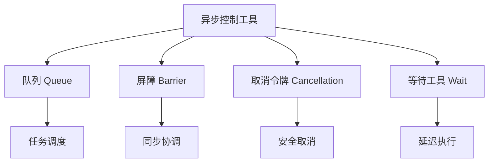
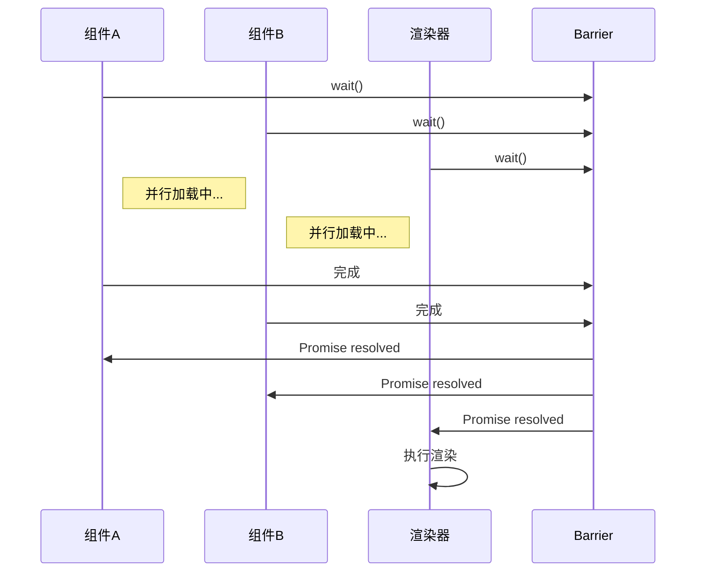
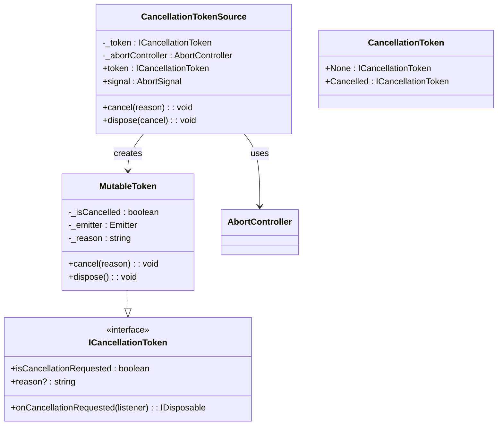

# 异步控制

<cite>
**本文档中引用的文件**  
- [queue.ts](file://packages/h5-builder/src/bedrock/async/queue/queue.ts)
- [barrier.ts](file://packages/h5-builder/src/bedrock/async/barrier.ts)
- [cancellation.ts](file://packages/h5-builder/src/bedrock/async/cancellation.ts)
- [wait.ts](file://packages/h5-builder/src/bedrock/async/wait.ts)
- [task.ts](file://packages/h5-builder/src/bedrock/async/queue/task.ts)
- [index.ts](file://packages/h5-builder/src/bedrock/async/index.ts)
</cite>

## 目录
1. [简介](#简介)
2. [核心组件概览](#核心组件概览)
3. [队列（Queue）机制](#队列queue机制)
4. [屏障（Barrier）机制](#屏障barrier机制)
5. [取消令牌（Cancellation）机制](#取消令牌cancellation机制)
6. [等待工具（Wait）](#等待工具wait)
7. [异步控制在Job执行中的应用](#异步控制在job执行中的应用)
8. [性能考量与常见陷阱](#性能考量与常见陷阱)
9. [总结](#总结)

## 简介
本项目提供了一套完整的异步控制工具集，用于管理复杂的异步任务调度与协调。这些工具包括任务队列（Queue）、同步屏障（Barrier）、取消令牌（Cancellation Token）和通用等待函数（Wait），它们共同构成了一个健壮的异步编程基础设施。这些机制特别适用于需要精确控制任务执行顺序、协调多个异步操作、安全取消长时间运行任务以及实现延迟执行的场景。

**Section sources**
- [index.ts](file://packages/h5-builder/src/bedrock/async/index.ts#L1-L19)

## 核心组件概览
异步控制模块由四个核心组件构成：`AsyncQueue` 用于实现任务的有序并发执行；`Barrier` 用于协调多个异步操作的同步点；`CancellationTokenSource` 和 `ICancellationToken` 提供安全的任务取消机制；`wait` 函数则提供基本的延迟执行能力。这些组件通过清晰的接口设计和松耦合的实现方式，能够灵活组合以应对各种复杂的异步控制需求。

**Diagram sources**
- [index.ts](file://packages/h5-builder/src/bedrock/async/index.ts#L1-L19)

## 队列（Queue）机制

`AsyncQueue` 类实现了异步任务的有序执行与并发控制。它继承自 `Disposable`，确保资源的正确释放。队列的核心设计是通过内部 `_queue` 数组存储待执行的任务，并通过 `_execCounter` 跟踪当前正在执行的任务数量，从而实现对最大并发数的精确控制。

当调用 `addTask` 方法时，任务被封装为 `AsyncTask` 对象并加入队列。随后调用 `_next` 方法尝试执行任务。该方法检查队列是否非空、当前执行数是否小于最大并发数，若条件满足则从队列头部取出任务执行。任务执行完成后，通过 `finally` 回调递减计数器并再次调用 `_next`，形成一个持续的任务处理循环，确保队列中的任务能够按序、可控地执行。

这种设计模式有效地解决了异步任务的资源竞争和过载问题，特别适用于需要限制并发请求数量的场景，如批量数据加载或资源密集型操作。

**Section sources**
- [queue.ts](file://packages/h5-builder/src/bedrock/async/queue/queue.ts#L1-L57)
- [task.ts](file://packages/h5-builder/src/bedrock/async/queue/task.ts)

## 屏障（Barrier）机制

`Barrier` 类提供了一种强大的同步原语，用于协调多个异步操作的完成。其核心是一个内部的 `Promise<boolean>`，初始状态为 `pending`。`Barrier` 对象通过 `isOpen` 方法查询其状态，通过 `open` 方法将其永久打开，并通过 `wait` 方法返回一个承诺（Promise），该承诺将在 `open` 被调用时解析。

这种设计模式非常适合“门控”场景：多个异步任务可以并行启动，但它们的关键后续操作（如UI渲染）都必须等待一个 `Barrier` 被打开。例如，在页面初始化时，可以创建一个 `Barrier`，然后并行加载数据、样式和组件，当所有加载任务完成时调用 `open`，从而触发统一的渲染流程。

此外，`makeBarrierByPromise` 工具函数允许将任意 `Promise` 转换为 `Barrier`，极大地增强了其灵活性和实用性。

**Diagram sources**
- [barrier.ts](file://packages/h5-builder/src/bedrock/async/barrier.ts#L1-L59)

## 取消令牌（Cancellation）机制

取消令牌机制是处理长时间运行或可中断异步操作的关键。它由 `ICancellationToken` 接口和 `CancellationTokenSource` 类构成。`CancellationTokenSource` 负责创建和管理令牌（Token），而 `ICancellationToken` 则被传递给异步操作，供其检查取消状态。

`MutableToken` 实现了 `ICancellationToken`，其核心是 `_isCancelled` 标志位和一个 `Emitter`。当 `cancel` 方法被调用时，标志位被置为 `true`，并触发所有注册的监听器。`onCancellationRequested` 事件具有“立即触发”语义：如果监听时令牌已取消，则监听器会立即在下一个事件循环中执行。

`CancellationTokenSource` 还提供了与浏览器 `AbortController` 的集成，通过 `signal` 属性，可以将取消信号无缝传递给 `fetch` 等原生API。`dispose` 方法默认会触发取消，确保了资源的及时释放。

这种分层设计既保证了内部实现的灵活性，又提供了与外部系统的良好互操作性。

**Diagram sources**
- [cancellation.ts](file://packages/h5-builder/src/bedrock/async/cancellation.ts#L10-L194)

## 等待工具（Wait）

`wait` 函数提供了一个简单而通用的延迟执行能力。它接受一个以毫秒为单位的时间参数，并返回一个在指定延迟后解析的 `Promise`。`sleep` 是 `wait` 的别名，语义上更强调“暂停”或“休眠”的概念。

尽管实现简单，但 `wait` 在异步编程中扮演着重要角色。它可以用于实现重试逻辑中的退避策略、模拟网络延迟进行测试、或者在动画和UI过渡中引入精确的延迟。其基于 `Promise` 的设计使其可以无缝地与 `async/await` 语法结合使用，编写出清晰易读的延迟代码。

**Section sources**
- [wait.ts](file://packages/h5-builder/src/bedrock/async/wait.ts#L1-L10)

## 异步控制在Job执行中的应用

在项目的 `jobs` 目录中，这些异步控制工具被广泛应用于构建复杂的初始化和渲染流程。例如，`ensure-view-ready` Job 可能会使用 `Barrier` 来确保所有依赖的组件和数据都已加载完毕，然后才允许视图进入“就绪”状态。

一个典型的场景是：`load-components-job` 并行加载多个组件，每个加载任务都接受一个 `CancellationToken`。如果用户在加载过程中导航离开，`CancellationTokenSource` 可以被取消，所有正在进行的加载任务都能检测到取消信号并提前终止，避免不必要的网络请求和资源消耗。

同时，`AsyncQueue` 可能被用于 `init-first-screen-data-job`，以确保关键数据的请求按优先级顺序执行，同时限制并发数以防止服务器过载。`wait` 函数则可能用于在数据加载后引入短暂的延迟，以提供更流畅的用户体验。

这种组合使用方式展示了异步控制工具如何协同工作，构建出既高效又健壮的应用程序初始化流程。

## 性能考量与常见陷阱

在使用这些异步控制工具时，需要注意以下几点：

1.  **队列并发控制**：`AsyncQueue` 的并发数设置应根据具体场景和系统资源进行调整。过高的并发可能导致资源耗尽，而过低则可能成为性能瓶颈。
2.  **屏障的生命周期**：`Barrier` 一旦被打开便不可逆转。确保在正确的时机调用 `open`，避免因过早或过晚打开而导致逻辑错误。
3.  **取消令牌的传播**：务必在异步操作的适当位置检查 `isCancellationRequested`，并及时退出。忽略取消信号会导致资源浪费和潜在的内存泄漏。
4.  **资源清理**：`CancellationTokenSource` 和 `AsyncQueue` 都实现了 `Disposable` 接口，使用完毕后必须调用 `dispose` 以释放事件监听器等资源。
5.  **避免死锁**：在使用 `Barrier` 时，要确保至少有一个操作会最终调用 `open`，否则所有等待的 `Promise` 将永远挂起。

## 总结

本文档详细介绍了项目中异步控制工具的设计与应用。`Queue`、`Barrier`、`Cancellation` 和 `Wait` 四大机制各司其职，共同为复杂异步逻辑的管理提供了坚实的基础。通过理解它们的内部原理和最佳实践，开发者可以构建出响应迅速、资源高效且用户体验优良的应用程序。这些工具的设计体现了高内聚、低耦合的原则，是现代前端异步编程的典范。