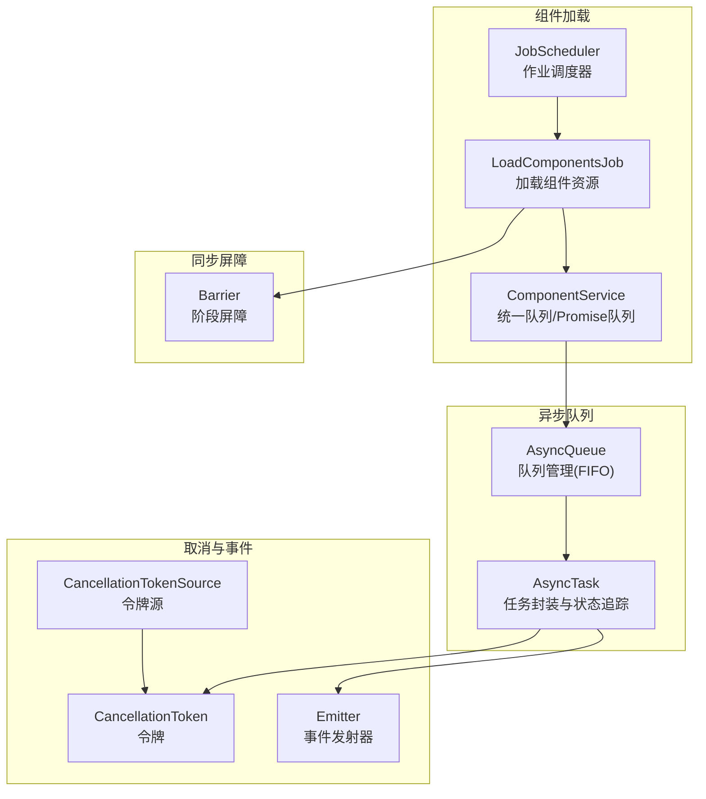
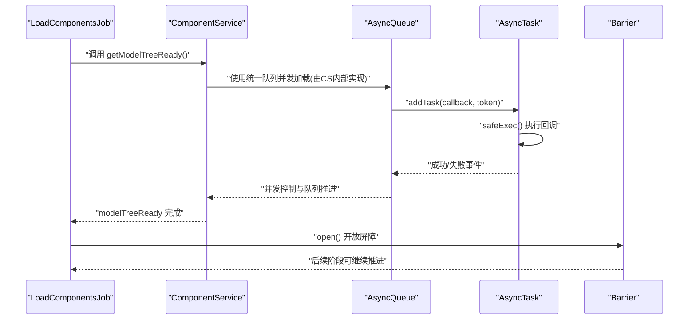
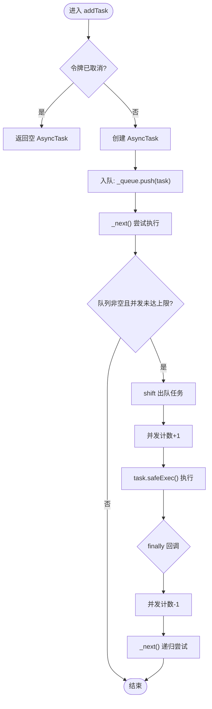
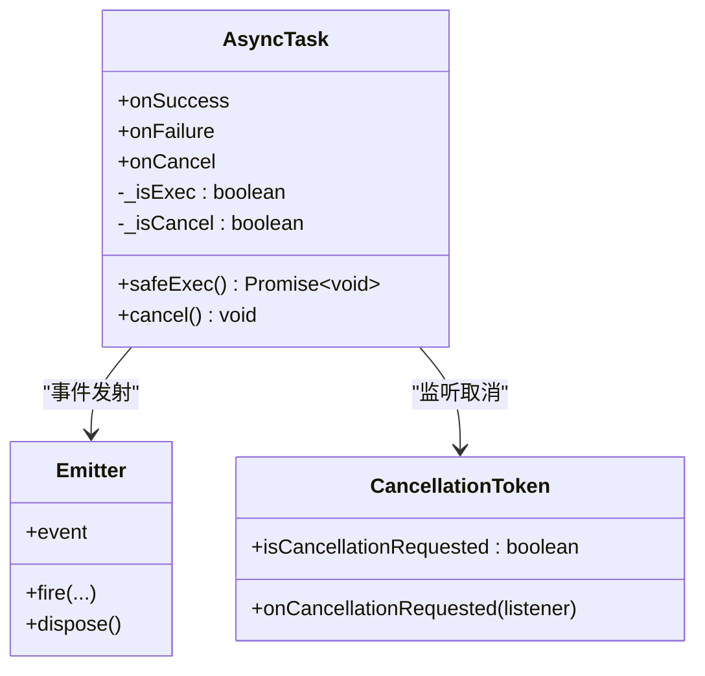
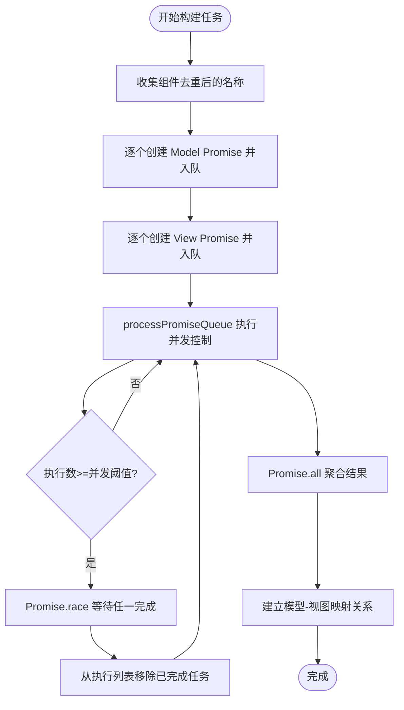
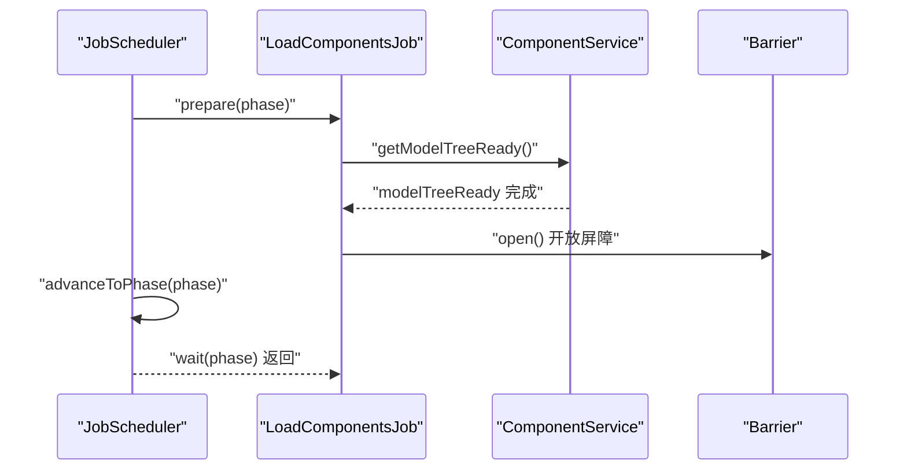
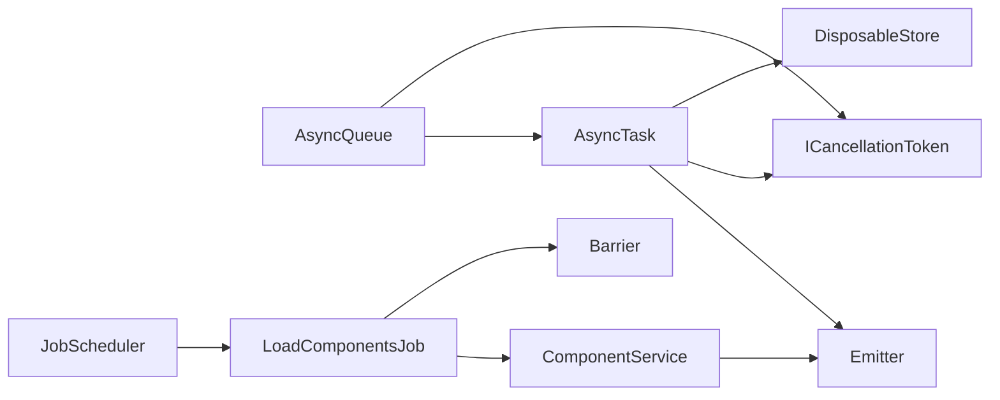

# 队列管理

<cite>
**本文引用的文件**
- [queue.ts](file://packages/h5-builder/src/bedrock/async/queue/queue.ts)
- [task.ts](file://packages/h5-builder/src/bedrock/async/queue/task.ts)
- [queue.test.ts](file://packages/h5-builder/src/bedrock/async/queue/queue.test.ts)
- [task.test.ts](file://packages/h5-builder/src/bedrock/async/queue/task.test.ts)
- [cancellation.ts](file://packages/h5-builder/src/bedrock/async/cancellation.ts)
- [barrier.ts](file://packages/h5-builder/src/bedrock/async/barrier.ts)
- [component.service.ts](file://packages/h5-builder/src/services/component.service.ts)
- [load-components-job.ts](file://packages/h5-builder/src/jobs/load-components-job.ts)
- [job-scheduler.ts](file://packages/h5-builder/src/bedrock/launch/job-scheduler.ts)
- [emitter.ts](file://packages/h5-builder/src/bedrock/event/emitter.ts)
- [disposable-store.ts](file://packages/h5-builder/src/bedrock/dispose/disposable-store.ts)
</cite>

## 目录
1. [简介](#简介)
2. [项目结构](#项目结构)
3. [核心组件](#核心组件)
4. [架构总览](#架构总览)
5. [详细组件分析](#详细组件分析)
6. [依赖分析](#依赖分析)
7. [性能考虑](#性能考虑)
8. [故障排查指南](#故障排查指南)
9. [结论](#结论)

## 简介
本文件围绕异步队列管理展开，重点解释 Queue 与 Task 的实现机制，阐述其如何通过先进先出（FIFO）策略管理异步任务的执行顺序，并以 Task 封装异步操作与状态追踪为核心。文档同时结合组件加载阶段的 Job 调度实践，说明如何使用队列控制任务的批量处理与并发控制，例如在组件加载阶段有序初始化多个模型。我们将分析 enqueue、dequeue、并发控制等关键方法的使用方式，并深入剖析其内部基于 Promise 链的实现原理；最后给出性能优化建议与常见错误模式警示。

## 项目结构
本次文档聚焦于以下模块：
- 异步队列与任务：AsyncQueue、AsyncTask
- 取消令牌：ICancellationToken、CancellationToken、CancellationTokenSource
- 事件系统：Emitter（用于任务状态通知）
- 资源加载与并发控制：ComponentService 的统一队列与 Promise 队列
- Job 调度：LoadComponentsJob 与 JobScheduler
- 屏障 Barrier：用于阶段间同步

图表来源
- [queue.ts](file://packages/h5-builder/src/bedrock/async/queue/queue.ts#L1-L57)
- [task.ts](file://packages/h5-builder/src/bedrock/async/queue/task.ts#L1-L68)
- [cancellation.ts](file://packages/h5-builder/src/bedrock/async/cancellation.ts#L1-L194)
- [emitter.ts](file://packages/h5-builder/src/bedrock/event/emitter.ts#L1-L163)
- [component.service.ts](file://packages/h5-builder/src/services/component.service.ts#L500-L734)
- [load-components-job.ts](file://packages/h5-builder/src/jobs/load-components-job.ts#L1-L61)
- [job-scheduler.ts](file://packages/h5-builder/src/bedrock/launch/job-scheduler.ts#L1-L123)
- [barrier.ts](file://packages/h5-builder/src/bedrock/async/barrier.ts#L1-L59)

章节来源
- [queue.ts](file://packages/h5-builder/src/bedrock/async/queue/queue.ts#L1-L57)
- [task.ts](file://packages/h5-builder/src/bedrock/async/queue/task.ts#L1-L68)
- [component.service.ts](file://packages/h5-builder/src/services/component.service.ts#L500-L734)
- [load-components-job.ts](file://packages/h5-builder/src/jobs/load-components-job.ts#L1-L61)
- [job-scheduler.ts](file://packages/h5-builder/src/bedrock/launch/job-scheduler.ts#L1-L123)
- [barrier.ts](file://packages/h5-builder/src/bedrock/async/barrier.ts#L1-L59)

## 核心组件
- AsyncQueue：基于 FIFO 的异步任务队列，支持并发上限控制，内部维护执行计数与队列长度，通过 shift/dequeue 与并发计数配合实现串行与并行混合的执行策略。
- AsyncTask：封装单个异步任务，提供成功/失败/取消三种事件，支持取消令牌注入，确保任务在取消或重复执行时不会产生副作用。
- Emitter：事件发射器，用于 AsyncTask 的 onSuccess/onFailure/onCancel 事件分发。
- CancellationToken/CancellationTokenSource：取消令牌与令牌源，用于向任务回调传递取消信号，支持 AbortSignal 对齐。
- ComponentService：提供统一队列与 Promise 队列两种并发控制策略，用于组件模型与视图的批量加载。
- LoadComponentsJob：在特定生命周期阶段触发组件资源加载，并通过 Barrier 控制后续阶段的推进。
- JobScheduler：作业调度器，负责按阶段注册、准备、等待与推进作业，保证阶段间顺序与同步。

章节来源
- [queue.ts](file://packages/h5-builder/src/bedrock/async/queue/queue.ts#L1-L57)
- [task.ts](file://packages/h5-builder/src/bedrock/async/queue/task.ts#L1-L68)
- [emitter.ts](file://packages/h5-builder/src/bedrock/event/emitter.ts#L1-L163)
- [cancellation.ts](file://packages/h5-builder/src/bedrock/async/cancellation.ts#L1-L194)
- [component.service.ts](file://packages/h5-builder/src/services/component.service.ts#L500-L734)
- [load-components-job.ts](file://packages/h5-builder/src/jobs/load-components-job.ts#L1-L61)
- [job-scheduler.ts](file://packages/h5-builder/src/bedrock/launch/job-scheduler.ts#L1-L123)
- [barrier.ts](file://packages/h5-builder/src/bedrock/async/barrier.ts#L1-L59)

## 架构总览
下图展示了从 Job 触发到组件资源加载、再到屏障开放的整体流程，以及队列与任务在其中的作用。

图表来源
- [load-components-job.ts](file://packages/h5-builder/src/jobs/load-components-job.ts#L1-L61)
- [component.service.ts](file://packages/h5-builder/src/services/component.service.ts#L500-L734)
- [queue.ts](file://packages/h5-builder/src/bedrock/async/queue/queue.ts#L1-L57)
- [task.ts](file://packages/h5-builder/src/bedrock/async/queue/task.ts#L1-L68)
- [barrier.ts](file://packages/h5-builder/src/bedrock/async/barrier.ts#L1-L59)

## 详细组件分析

### AsyncQueue 分析
- FIFO 策略：内部使用数组存储 AsyncTask 实例，新增任务时 push，执行时 shift，天然满足先进先出。
- 并发控制：通过 _maxConcurrent 与 _execCounter 控制同时执行的任务数量，当队列非空且未达上限时持续出队执行。
- 生命周期：每次任务执行完毕（无论成功或失败），都会减少并发计数并再次尝试 _next，形成“完成一个、补充一个”的链式推进。
- 取消集成：addTask 支持传入 ICancellationToken，若请求取消则直接返回一个“空任务”（无回调），避免无效执行。

图表来源
- [queue.ts](file://packages/h5-builder/src/bedrock/async/queue/queue.ts#L1-L57)

章节来源
- [queue.ts](file://packages/h5-builder/src/bedrock/async/queue/queue.ts#L1-L57)
- [queue.test.ts](file://packages/h5-builder/src/bedrock/async/queue/queue.test.ts#L1-L71)

### AsyncTask 分析
- 事件模型：提供 onSuccess/onFailure/onCancel 三个事件，便于上层订阅任务状态变化。
- 执行安全：safeExec 中防止重复执行与重复取消，确保幂等性；执行期间捕获异常并通过 onFailure 发射错误包装。
- 取消语义：支持外部取消令牌，当令牌请求取消时自动触发 cancel；若任务已执行则不再进入取消阶段。
- 与队列协作：AsyncQueue 仅持有 AsyncTask 引用，通过 _store.add 管理生命周期，避免泄漏。

图表来源
- [task.ts](file://packages/h5-builder/src/bedrock/async/queue/task.ts#L1-L68)
- [emitter.ts](file://packages/h5-builder/src/bedrock/event/emitter.ts#L1-L163)
- [cancellation.ts](file://packages/h5-builder/src/bedrock/async/cancellation.ts#L1-L194)

章节来源
- [task.ts](file://packages/h5-builder/src/bedrock/async/queue/task.ts#L1-L68)
- [task.test.ts](file://packages/h5-builder/src/bedrock/async/queue/task.test.ts#L1-L156)
- [emitter.ts](file://packages/h5-builder/src/bedrock/event/emitter.ts#L1-L163)
- [cancellation.ts](file://packages/h5-builder/src/bedrock/async/cancellation.ts#L1-L194)

### 取消令牌与事件系统
- CancellationToken/CancellationTokenSource：提供 isCancellationRequested 与 onCancellationRequested 事件，支持 AbortSignal 对齐，便于与 fetch/axios 等浏览器 API 协作。
- Emitter：事件发射器，支持单监听器快速路径与多监听器队列派发，内置错误处理回调，避免事件监听器抛错影响主流程。

章节来源
- [cancellation.ts](file://packages/h5-builder/src/bedrock/async/cancellation.ts#L1-L194)
- [emitter.ts](file://packages/h5-builder/src/bedrock/event/emitter.ts#L1-L163)

### 组件加载与并发控制
- 统一队列：ComponentService 在构建任务时即创建所有 Promise，并按“先 Model 后 View”的顺序统一排队，使用 Promise 队列策略实现“完成一个、补充一个”的并发控制。
- Promise 队列：遍历任务队列，将每个任务包装为 void Promise 并加入 executing 列表，当长度达到并发阈值时使用 Promise.race 等待任一任务完成，从而动态补充新任务。
- 结果聚合：通过 Promise.all 聚合模型与视图加载结果，并在完成后建立映射关系。

图表来源
- [component.service.ts](file://packages/h5-builder/src/services/component.service.ts#L500-L734)

章节来源
- [component.service.ts](file://packages/h5-builder/src/services/component.service.ts#L500-L734)

### Job 调度与屏障
- LoadComponentsJob：在特定生命周期阶段触发组件资源加载，使用 Barrier 控制后续阶段的推进，确保资源加载完成后才开放屏障。
- JobScheduler：负责按阶段注册、准备、等待与推进作业，提供 prepare/advanceToPhase/wait 等能力，保证阶段间顺序与同步。

图表来源
- [job-scheduler.ts](file://packages/h5-builder/src/bedrock/launch/job-scheduler.ts#L1-L123)
- [load-components-job.ts](file://packages/h5-builder/src/jobs/load-components-job.ts#L1-L61)
- [barrier.ts](file://packages/h5-builder/src/bedrock/async/barrier.ts#L1-L59)

章节来源
- [job-scheduler.ts](file://packages/h5-builder/src/bedrock/launch/job-scheduler.ts#L1-L123)
- [load-components-job.ts](file://packages/h5-builder/src/jobs/load-components-job.ts#L1-L61)
- [barrier.ts](file://packages/h5-builder/src/bedrock/async/barrier.ts#L1-L59)

## 依赖分析
- AsyncQueue 依赖 AsyncTask、ICancellationToken 与 DisposableStore（通过 _store.add 管理生命周期）。
- AsyncTask 依赖 Emitter 与 CancellationToken，用于事件与取消。
- ComponentService 内部实现统一队列与 Promise 队列，间接使用 AsyncQueue 的并发思想（通过 Promise.race/ Promise.all）。
- LoadComponentsJob 依赖 ComponentService 与 Barrier，通过 JobScheduler 进行阶段编排。
- Emitter 与 DisposableStore 提供事件与资源释放保障，降低耦合与泄漏风险。

图表来源
- [queue.ts](file://packages/h5-builder/src/bedrock/async/queue/queue.ts#L1-L57)
- [task.ts](file://packages/h5-builder/src/bedrock/async/queue/task.ts#L1-L68)
- [emitter.ts](file://packages/h5-builder/src/bedrock/event/emitter.ts#L1-L163)
- [disposable-store.ts](file://packages/h5-builder/src/bedrock/dispose/disposable-store.ts#L1-L84)
- [component.service.ts](file://packages/h5-builder/src/services/component.service.ts#L500-L734)
- [load-components-job.ts](file://packages/h5-builder/src/jobs/load-components-job.ts#L1-L61)
- [job-scheduler.ts](file://packages/h5-builder/src/bedrock/launch/job-scheduler.ts#L1-L123)
- [barrier.ts](file://packages/h5-builder/src/bedrock/async/barrier.ts#L1-L59)

章节来源
- [queue.ts](file://packages/h5-builder/src/bedrock/async/queue/queue.ts#L1-L57)
- [task.ts](file://packages/h5-builder/src/bedrock/async/queue/task.ts#L1-L68)
- [emitter.ts](file://packages/h5-builder/src/bedrock/event/emitter.ts#L1-L163)
- [disposable-store.ts](file://packages/h5-builder/src/bedrock/dispose/disposable-store.ts#L1-L84)
- [component.service.ts](file://packages/h5-builder/src/services/component.service.ts#L500-L734)
- [load-components-job.ts](file://packages/h5-builder/src/jobs/load-components-job.ts#L1-L61)
- [job-scheduler.ts](file://packages/h5-builder/src/bedrock/launch/job-scheduler.ts#L1-L123)
- [barrier.ts](file://packages/h5-builder/src/bedrock/async/barrier.ts#L1-L59)

## 性能考虑
- 避免队列积压
  - 合理设置并发数：根据 CPU/IO 与网络带宽调整最大并发，避免过多任务堆积导致内存与上下文切换开销上升。
  - 使用“完成一个、补充一个”策略：在任务粒度较大时，采用 Promise.race 等策略动态补充任务，提升吞吐。
- 并发控制最佳实践
  - 统一队列 vs Promise 队列：统一队列适合需要严格顺序与分类收集的场景；Promise 队列适合通用批量任务的并发控制。
  - 事件与取消：为长耗时任务注入取消令牌，及时中断无意义工作，减少资源浪费。
- 错误处理与可观测性
  - 使用 onFailure 事件收集错误信息，结合错误包装工具进行统一上报与诊断。
  - 通过 JobScheduler 的成本记录与阶段推进，定位瓶颈阶段与耗时任务。

[本节为通用性能建议，无需列出具体文件来源]

## 故障排查指南
- 未处理的 Promise 拒绝
  - 现象：任务执行抛错但未被捕获，导致进程或测试环境报错。
  - 排查：确认 AsyncTask.safeExec 是否被调用，onFailure 事件是否订阅；检查回调内部是否显式 reject 或抛出异常。
  - 参考路径：[task.ts](file://packages/h5-builder/src/bedrock/async/queue/task.ts#L1-L68)
- 任务重复执行或重复取消
  - 现象：多次调用 safeExec 导致副作用，或取消后仍被调度。
  - 排查：确认 _isExec 与 _isCancel 标志位，确保在执行中不可取消，在已取消状态下不可再次执行。
  - 参考路径：[task.ts](file://packages/h5-builder/src/bedrock/async/queue/task.ts#L1-L68)
- 并发数设置不当导致卡顿
  - 现象：并发过高导致内存与上下文切换压力大；并发过低导致吞吐不足。
  - 排查：对比不同并发下的吞吐与延迟，结合 CPU/IO 与网络状况选择合适并发。
  - 参考路径：[queue.ts](file://packages/h5-builder/src/bedrock/async/queue/queue.ts#L1-L57)、[component.service.ts](file://packages/h5-builder/src/services/component.service.ts#L500-L734)
- 取消信号未生效
  - 现象：调用 cancel 后任务仍在执行。
  - 排查：确认回调内部是否检查 ICancellationToken.isCancellationRequested；必要时在回调中主动终止长任务。
  - 参考路径：[cancellation.ts](file://packages/h5-builder/src/bedrock/async/cancellation.ts#L1-L194)、[task.ts](file://packages/h5-builder/src/bedrock/async/queue/task.ts#L1-L68)
- 阶段推进阻塞
  - 现象：JobScheduler 在 advanceToPhase/wait 阶段阻塞。
  - 排查：确认 LoadComponentsJob 是否正确 open Barrier；检查 shouldWait 与 wait 的实现是否与阶段一致。
  - 参考路径：[job-scheduler.ts](file://packages/h5-builder/src/bedrock/launch/job-scheduler.ts#L1-L123)、[load-components-job.ts](file://packages/h5-builder/src/jobs/load-components-job.ts#L1-L61)、[barrier.ts](file://packages/h5-builder/src/bedrock/async/barrier.ts#L1-L59)

章节来源
- [task.ts](file://packages/h5-builder/src/bedrock/async/queue/task.ts#L1-L68)
- [queue.ts](file://packages/h5-builder/src/bedrock/async/queue/queue.ts#L1-L57)
- [component.service.ts](file://packages/h5-builder/src/services/component.service.ts#L500-L734)
- [cancellation.ts](file://packages/h5-builder/src/bedrock/async/cancellation.ts#L1-L194)
- [job-scheduler.ts](file://packages/h5-builder/src/bedrock/launch/job-scheduler.ts#L1-L123)
- [load-components-job.ts](file://packages/h5-builder/src/jobs/load-components-job.ts#L1-L61)
- [barrier.ts](file://packages/h5-builder/src/bedrock/async/barrier.ts#L1-L59)

## 结论
AsyncQueue 与 AsyncTask 通过 FIFO 队列与事件驱动，提供了简洁而强大的异步任务管理能力；结合取消令牌与事件系统，能够可靠地处理任务状态与中断。在组件加载场景中，ComponentService 的统一队列与 Promise 队列策略进一步提升了批量任务的并发效率与可控性。通过 JobScheduler 与 Barrier 的配合，可在阶段化推进中实现严格的顺序与同步。实践中应重视并发数配置、错误处理与可观测性，避免未处理的 Promise 拒绝与队列积压，确保系统稳定与性能。