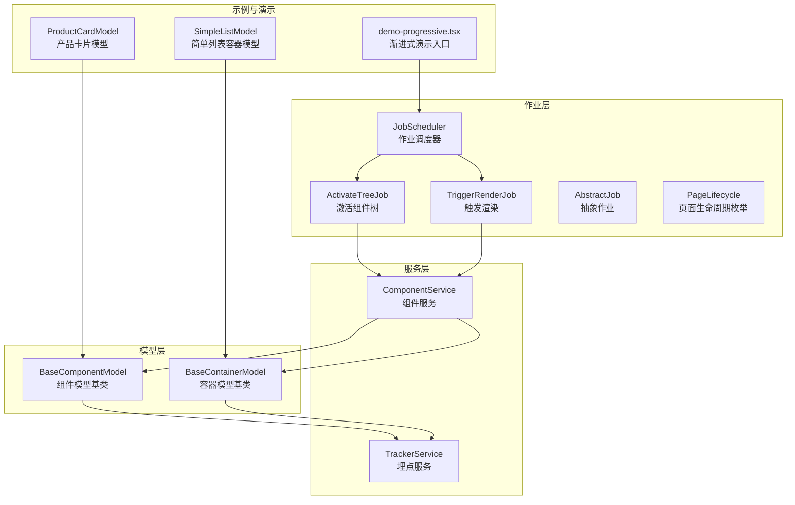
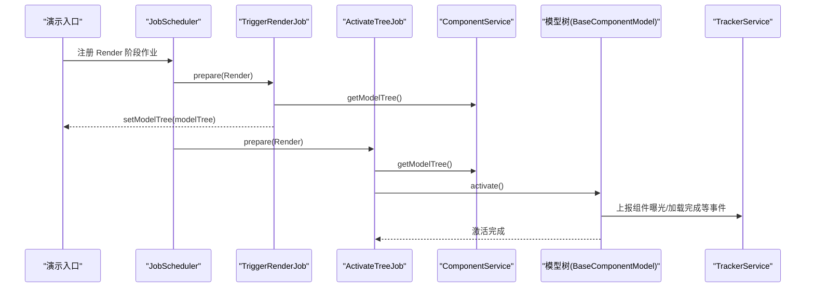
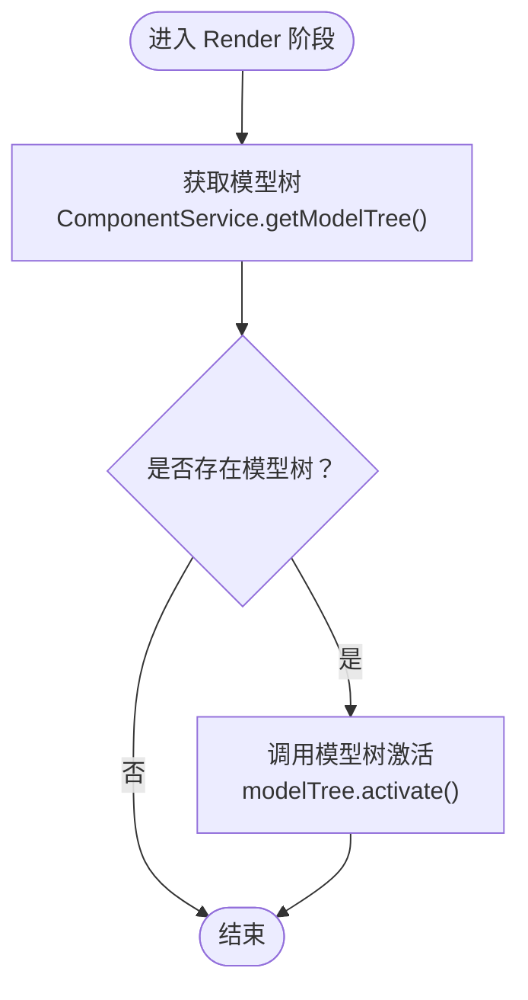
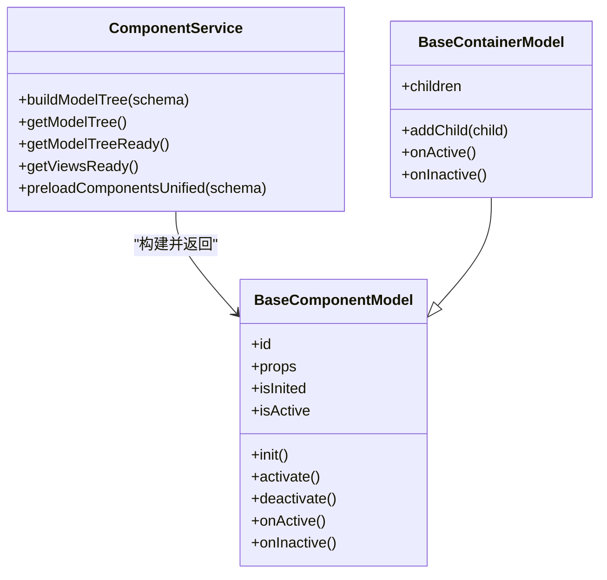
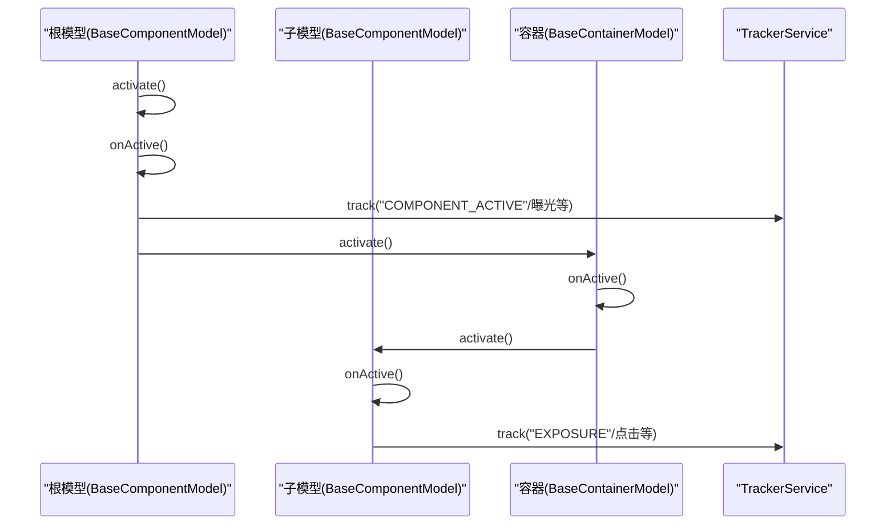
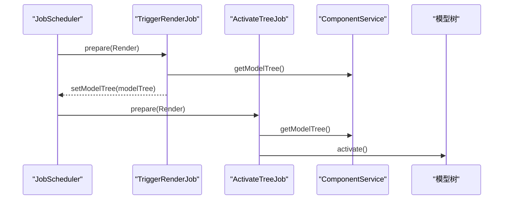
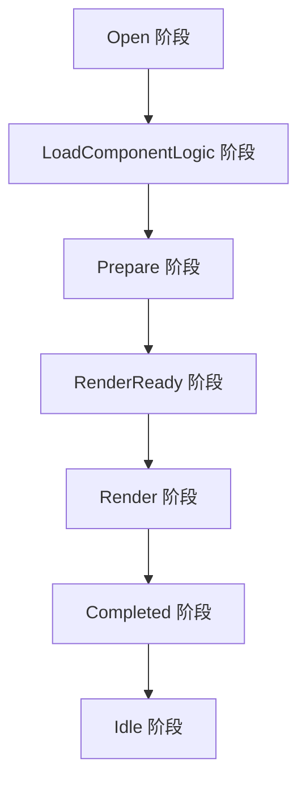
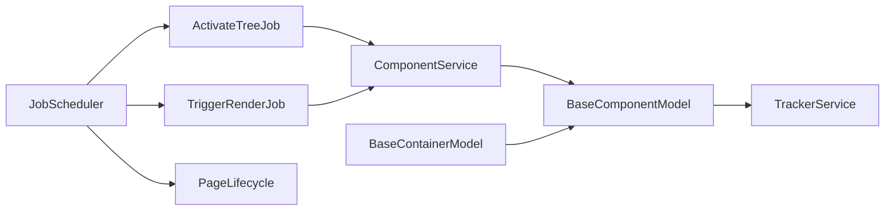

# 模型树激活任务

<cite>
**本文引用的文件**
- [activate-tree-job.ts](file://packages/h5-builder/src/jobs/activate-tree-job.ts)
- [component.service.ts](file://packages/h5-builder/src/services/component.service.ts)
- [lifecycle.ts](file://packages/h5-builder/src/jobs/lifecycle.ts)
- [model.ts](file://packages/h5-builder/src/bedrock/model.ts)
- [tracker.service.ts](file://packages/h5-builder/src/services/tracker.service.ts)
- [job-scheduler.ts](file://packages/h5-builder/src/bedrock/launch/job-scheduler.ts)
- [abstract-job.ts](file://packages/h5-builder/src/bedrock/launch/abstract-job.ts)
- [trigger-render-job.ts](file://packages/h5-builder/src/jobs/trigger-render-job.ts)
- [demo-progressive.tsx](file://packages/h5-builder/src/demo-progressive.tsx)
- [product-card.model.ts](file://packages/h5-builder/src/components/product-card/product-card.model.ts)
- [simple-list.model.ts](file://packages/h5-builder/src/components/simple-list/simple-list.model.ts)
</cite>

## 目录
1. [引言](#引言)
2. [项目结构](#项目结构)
3. [核心组件](#核心组件)
4. [架构总览](#架构总览)
5. [详细组件分析](#详细组件分析)
6. [依赖分析](#依赖分析)
7. [性能考虑](#性能考虑)
8. [故障排查指南](#故障排查指南)
9. [结论](#结论)
10. [附录](#附录)

## 引言
本文件深入解析 ActivateTreeJob 在 Render 阶段激活整个组件模型树的执行逻辑，阐明其如何通过 ComponentService 获取模型树并调用 modelTree.activate() 方法触发组件树的激活流程，包括埋点上报、定时器启动等副作用操作。文档还分析该 Job 在生命周期中的关键作用，确保组件在渲染后正确进入活跃状态，并提供激活流程的扩展点说明，指导开发者在激活过程中注入自定义逻辑。

## 项目结构
与“模型树激活任务”直接相关的代码主要分布在以下模块：
- 作业层：ActivateTreeJob、TriggerRenderJob、JobScheduler、AbstractJob、PageLifecycle
- 服务层：ComponentService、TrackerService
- 模型层：BaseComponentModel、BaseContainerModel
- 示例与演示：产品卡片模型、简单列表容器模型、渐进式演示入口

图表来源
- [activate-tree-job.ts](file://packages/h5-builder/src/jobs/activate-tree-job.ts#L1-L56)
- [trigger-render-job.ts](file://packages/h5-builder/src/jobs/trigger-render-job.ts#L1-L43)
- [job-scheduler.ts](file://packages/h5-builder/src/bedrock/launch/job-scheduler.ts#L1-L123)
- [abstract-job.ts](file://packages/h5-builder/src/bedrock/launch/abstract-job.ts#L1-L46)
- [lifecycle.ts](file://packages/h5-builder/src/jobs/lifecycle.ts#L1-L18)
- [component.service.ts](file://packages/h5-builder/src/services/component.service.ts#L1-L732)
- [model.ts](file://packages/h5-builder/src/bedrock/model.ts#L1-L243)
- [tracker.service.ts](file://packages/h5-builder/src/services/tracker.service.ts#L1-L290)
- [demo-progressive.tsx](file://packages/h5-builder/src/demo-progressive.tsx#L75-L156)
- [product-card.model.ts](file://packages/h5-builder/src/components/product-card/product-card.model.ts#L1-L133)
- [simple-list.model.ts](file://packages/h5-builder/src/components/simple-list/simple-list.model.ts#L1-L16)

章节来源
- [activate-tree-job.ts](file://packages/h5-builder/src/jobs/activate-tree-job.ts#L1-L56)
- [component.service.ts](file://packages/h5-builder/src/services/component.service.ts#L1-L732)
- [lifecycle.ts](file://packages/h5-builder/src/jobs/lifecycle.ts#L1-L18)
- [model.ts](file://packages/h5-builder/src/bedrock/model.ts#L1-L243)
- [tracker.service.ts](file://packages/h5-builder/src/services/tracker.service.ts#L1-L290)
- [job-scheduler.ts](file://packages/h5-builder/src/bedrock/launch/job-scheduler.ts#L1-L123)
- [abstract-job.ts](file://packages/h5-builder/src/bedrock/launch/abstract-job.ts#L1-L46)
- [trigger-render-job.ts](file://packages/h5-builder/src/jobs/trigger-render-job.ts#L1-L43)
- [demo-progressive.tsx](file://packages/h5-builder/src/demo-progressive.tsx#L75-L156)
- [product-card.model.ts](file://packages/h5-builder/src/components/product-card/product-card.model.ts#L1-L133)
- [simple-list.model.ts](file://packages/h5-builder/src/components/simple-list/simple-list.model.ts#L1-L16)

## 核心组件
- ActivateTreeJob：在 Render 阶段激活整个组件模型树，触发各组件的激活副作用（如埋点上报、定时器启动等）。
- ComponentService：负责构建和缓存模型树，提供 getModelTree() 获取根模型。
- BaseComponentModel/BaseContainerModel：定义组件生命周期钩子（onActive/onInactive），以及激活/停用的默认行为。
- TrackerService：提供埋点上报能力，贯穿组件创建、加载失败、曝光等事件。
- JobScheduler/AbstractJob/PageLifecycle：定义作业的生命周期调度与执行时机。
- TriggerRenderJob：在 Render 阶段触发渲染，将模型树注入到视图层。

章节来源
- [activate-tree-job.ts](file://packages/h5-builder/src/jobs/activate-tree-job.ts#L1-L56)
- [component.service.ts](file://packages/h5-builder/src/services/component.service.ts#L718-L732)
- [model.ts](file://packages/h5-builder/src/bedrock/model.ts#L75-L155)
- [tracker.service.ts](file://packages/h5-builder/src/services/tracker.service.ts#L68-L171)
- [job-scheduler.ts](file://packages/h5-builder/src/bedrock/launch/job-scheduler.ts#L1-L123)
- [abstract-job.ts](file://packages/h5-builder/src/bedrock/launch/abstract-job.ts#L1-L46)
- [trigger-render-job.ts](file://packages/h5-builder/src/jobs/trigger-render-job.ts#L1-L43)

## 架构总览
ActivateTreeJob 与 TriggerRenderJob 共同构成 Render 阶段的关键路径：TriggerRenderJob 负责将模型树注入视图触发渲染，ActivateTreeJob 在同一阶段调用模型树的激活方法，确保组件进入活跃状态并执行副作用。

图表来源
- [demo-progressive.tsx](file://packages/h5-builder/src/demo-progressive.tsx#L75-L156)
- [trigger-render-job.ts](file://packages/h5-builder/src/jobs/trigger-render-job.ts#L1-L43)
- [activate-tree-job.ts](file://packages/h5-builder/src/jobs/activate-tree-job.ts#L1-L56)
- [component.service.ts](file://packages/h5-builder/src/services/component.service.ts#L718-L732)
- [model.ts](file://packages/h5-builder/src/bedrock/model.ts#L75-L155)
- [tracker.service.ts](file://packages/h5-builder/src/services/tracker.service.ts#L68-L171)

## 详细组件分析

### ActivateTreeJob 分析
- 触发时机：在 PageLifecycle.Render 阶段执行，确保页面已渲染完成后再触发激活副作用。
- 执行流程：
  - 从 ComponentService 获取模型树根节点。
  - 若存在模型树，则调用 modelTree.activate()。
- 关键点：
  - 仅触发副作用，不负责实际 DOM 渲染。
  - 通过模型树的激活，逐级调用子组件的激活钩子，从而触发埋点上报、定时器启动等逻辑。

图表来源
- [activate-tree-job.ts](file://packages/h5-builder/src/jobs/activate-tree-job.ts#L24-L53)
- [component.service.ts](file://packages/h5-builder/src/services/component.service.ts#L718-L732)

章节来源
- [activate-tree-job.ts](file://packages/h5-builder/src/jobs/activate-tree-job.ts#L1-L56)
- [lifecycle.ts](file://packages/h5-builder/src/jobs/lifecycle.ts#L1-L18)
- [demo-progressive.tsx](file://packages/h5-builder/src/demo-progressive.tsx#L75-L156)

### ComponentService 与模型树
- 构建模型树：ComponentService.buildModelTree(schema) 将树形 Schema 转换为树形 Model Tree，并在创建 Model 时上报组件创建事件。
- 缓存与并发：提供统一预加载、并发控制与映射注册，确保模型树构建完成后可被快速获取。
- 获取模型树：getModelTree() 返回已构建的根模型，供 ActivateTreeJob 使用。

图表来源
- [component.service.ts](file://packages/h5-builder/src/services/component.service.ts#L132-L156)
- [component.service.ts](file://packages/h5-builder/src/services/component.service.ts#L718-L732)
- [model.ts](file://packages/h5-builder/src/bedrock/model.ts#L10-L155)
- [model.ts](file://packages/h5-builder/src/bedrock/model.ts#L157-L242)

章节来源
- [component.service.ts](file://packages/h5-builder/src/services/component.service.ts#L132-L156)
- [component.service.ts](file://packages/h5-builder/src/services/component.service.ts#L718-L732)
- [model.ts](file://packages/h5-builder/src/bedrock/model.ts#L10-L155)
- [model.ts](file://packages/h5-builder/src/bedrock/model.ts#L157-L242)

### 激活流程与副作用
- 激活入口：BaseComponentModel.activate() 设置 isActive=true 并调用 onActive()。
- 容器默认行为：BaseContainerModel.onActive() 会逐个激活所有子组件，形成树形传播。
- 副作用示例：
  - 埋点上报：TrackerService.track() 在组件创建、加载失败、曝光等场景被调用。
  - 定时器与资源管理：通过 register() 注册清理函数，确保激活/停用时正确启动/停止定时器等资源。

图表来源
- [model.ts](file://packages/h5-builder/src/bedrock/model.ts#L75-L155)
- [model.ts](file://packages/h5-builder/src/bedrock/model.ts#L157-L242)
- [tracker.service.ts](file://packages/h5-builder/src/services/tracker.service.ts#L68-L171)
- [product-card.model.ts](file://packages/h5-builder/src/components/product-card/product-card.model.ts#L49-L60)

章节来源
- [model.ts](file://packages/h5-builder/src/bedrock/model.ts#L75-L155)
- [model.ts](file://packages/h5-builder/src/bedrock/model.ts#L157-L242)
- [tracker.service.ts](file://packages/h5-builder/src/services/tracker.service.ts#L68-L171)
- [product-card.model.ts](file://packages/h5-builder/src/components/product-card/product-card.model.ts#L49-L60)

### 与渲染的关系
- TriggerRenderJob 在 Render 阶段将模型树注入视图层，触发首次渲染。
- ActivateTreeJob 在同一阶段调用模型树激活，确保组件在可见后立即进入活跃状态并执行副作用。

图表来源
- [trigger-render-job.ts](file://packages/h5-builder/src/jobs/trigger-render-job.ts#L1-L43)
- [activate-tree-job.ts](file://packages/h5-builder/src/jobs/activate-tree-job.ts#L1-L56)
- [demo-progressive.tsx](file://packages/h5-builder/src/demo-progressive.tsx#L75-L156)

章节来源
- [trigger-render-job.ts](file://packages/h5-builder/src/jobs/trigger-render-job.ts#L1-L43)
- [demo-progressive.tsx](file://packages/h5-builder/src/demo-progressive.tsx#L75-L156)

### 生命周期与作业调度
- PageLifecycle 定义了页面的阶段顺序，作业在对应阶段由 JobScheduler 调度执行。
- AbstractJob 提供屏障（Barrier）机制，支持作业在特定阶段等待条件满足。
- JobScheduler 负责按阶段实例化、prepare、wait 与推进。

图表来源
- [lifecycle.ts](file://packages/h5-builder/src/jobs/lifecycle.ts#L1-L18)
- [job-scheduler.ts](file://packages/h5-builder/src/bedrock/launch/job-scheduler.ts#L1-L123)
- [abstract-job.ts](file://packages/h5-builder/src/bedrock/launch/abstract-job.ts#L1-L46)

章节来源
- [lifecycle.ts](file://packages/h5-builder/src/jobs/lifecycle.ts#L1-L18)
- [job-scheduler.ts](file://packages/h5-builder/src/bedrock/launch/job-scheduler.ts#L1-L123)
- [abstract-job.ts](file://packages/h5-builder/src/bedrock/launch/abstract-job.ts#L1-L46)

## 依赖分析
- ActivateTreeJob 依赖 ComponentService 获取模型树；模型树由 BaseComponentModel/BaseContainerModel 提供激活能力；TrackerService 贯穿组件创建与激活过程。
- TriggerRenderJob 与 ActivateTreeJob 同时注册在 Render 阶段，前者负责渲染，后者负责激活副作用。
- JobScheduler/AbstractJob/PageLifecycle 形成统一的作业调度框架。

图表来源
- [activate-tree-job.ts](file://packages/h5-builder/src/jobs/activate-tree-job.ts#L1-L56)
- [trigger-render-job.ts](file://packages/h5-builder/src/jobs/trigger-render-job.ts#L1-L43)
- [component.service.ts](file://packages/h5-builder/src/services/component.service.ts#L132-L156)
- [model.ts](file://packages/h5-builder/src/bedrock/model.ts#L10-L155)
- [tracker.service.ts](file://packages/h5-builder/src/services/tracker.service.ts#L68-L171)
- [job-scheduler.ts](file://packages/h5-builder/src/bedrock/launch/job-scheduler.ts#L1-L123)
- [abstract-job.ts](file://packages/h5-builder/src/bedrock/launch/abstract-job.ts#L1-L46)
- [lifecycle.ts](file://packages/h5-builder/src/jobs/lifecycle.ts#L1-L18)

章节来源
- [activate-tree-job.ts](file://packages/h5-builder/src/jobs/activate-tree-job.ts#L1-L56)
- [trigger-render-job.ts](file://packages/h5-builder/src/jobs/trigger-render-job.ts#L1-L43)
- [component.service.ts](file://packages/h5-builder/src/services/component.service.ts#L132-L156)
- [model.ts](file://packages/h5-builder/src/bedrock/model.ts#L10-L155)
- [tracker.service.ts](file://packages/h5-builder/src/services/tracker.service.ts#L68-L171)
- [job-scheduler.ts](file://packages/h5-builder/src/bedrock/launch/job-scheduler.ts#L1-L123)
- [abstract-job.ts](file://packages/h5-builder/src/bedrock/launch/abstract-job.ts#L1-L46)
- [lifecycle.ts](file://packages/h5-builder/src/jobs/lifecycle.ts#L1-L18)

## 性能考虑
- 激活传播：容器模型默认逐个激活子组件，建议在复杂树中谨慎使用大量子组件，避免一次性激活带来的抖动。
- 埋点批处理：TrackerService 支持批量发送与持久化，减少频繁 IO 对主线程的影响。
- 并发加载：ComponentService 的预加载与并发控制已在构建阶段完成，激活阶段尽量避免再次触发重型任务。

## 故障排查指南
- 激活无效果：确认 Render 阶段是否正确注册 ActivateTreeJob，且模型树已构建完成。
- 埋点缺失：检查 TrackerService 配置与事件上报时机，确认 onActive 中是否调用了埋点。
- 资源未释放：若使用定时器等资源，务必通过 register() 注册清理函数，避免内存泄漏。

章节来源
- [activate-tree-job.ts](file://packages/h5-builder/src/jobs/activate-tree-job.ts#L1-L56)
- [tracker.service.ts](file://packages/h5-builder/src/services/tracker.service.ts#L68-L171)
- [model.ts](file://packages/h5-builder/src/bedrock/model.ts#L28-L44)

## 结论
ActivateTreeJob 在 Render 阶段通过 ComponentService 获取模型树并调用 modelTree.activate()，将激活副作用（埋点上报、定时器启动等）应用到整棵组件树上。它与 TriggerRenderJob 协作，确保组件在可见后即刻进入活跃状态。开发者可通过覆写 onActive/onInactive 或在 register() 中注入自定义资源管理逻辑，灵活扩展激活流程。

## 附录
- 激活扩展点：
  - 在自定义组件中覆写 onActive/onInactive，注入业务逻辑（如启动定时器、订阅事件）。
  - 使用 register() 注册清理函数，确保停用时正确释放资源。
  - 在容器组件中覆写 onActive/onInactive，实现按需激活（如仅激活当前 Tab）。

章节来源
- [model.ts](file://packages/h5-builder/src/bedrock/model.ts#L75-L155)
- [simple-list.model.ts](file://packages/h5-builder/src/components/simple-list/simple-list.model.ts#L1-L16)
- [product-card.model.ts](file://packages/h5-builder/src/components/product-card/product-card.model.ts#L49-L60)