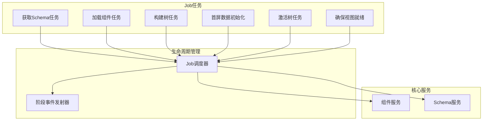
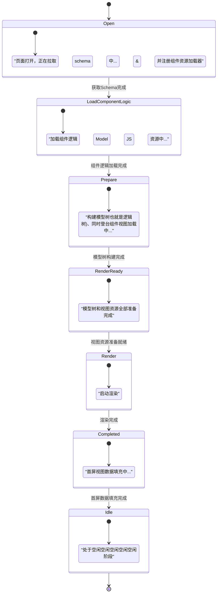
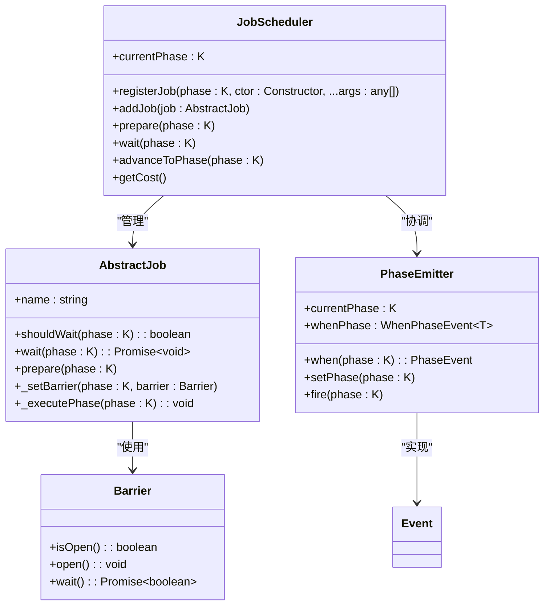
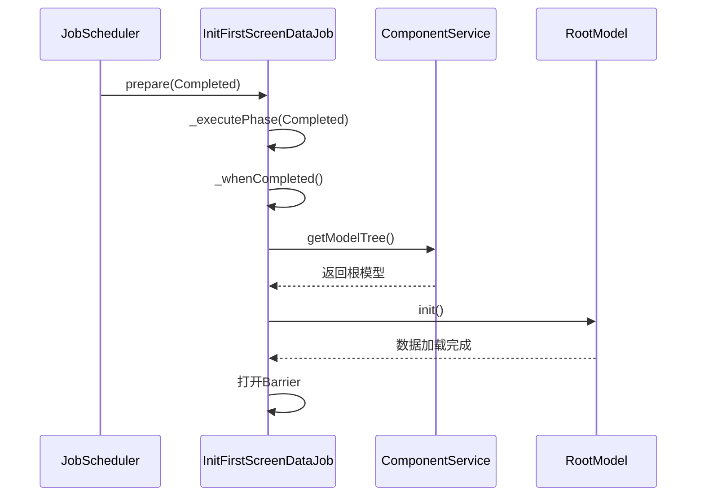
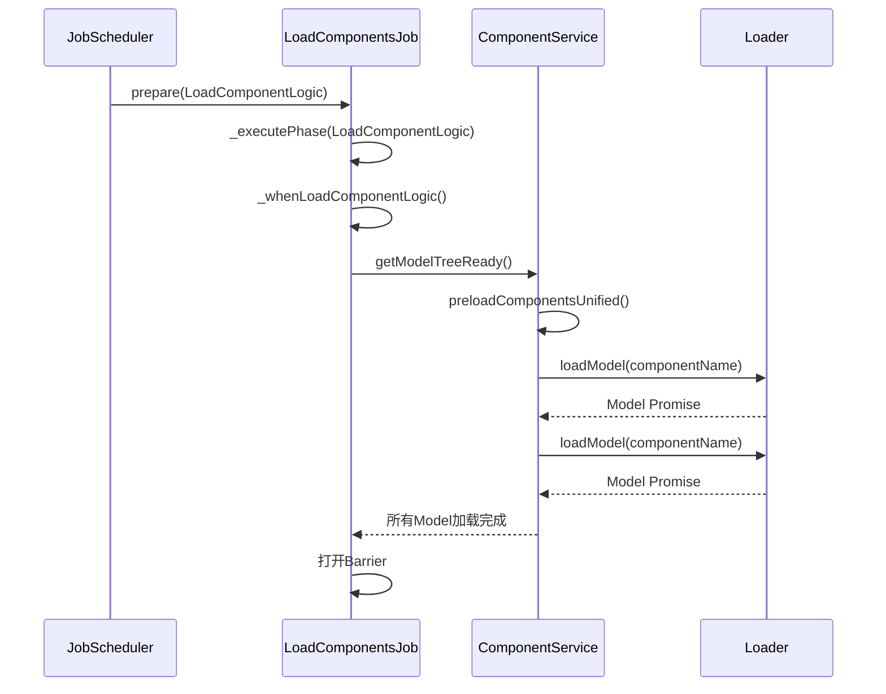
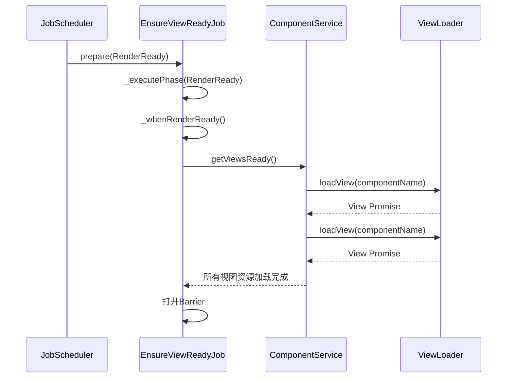
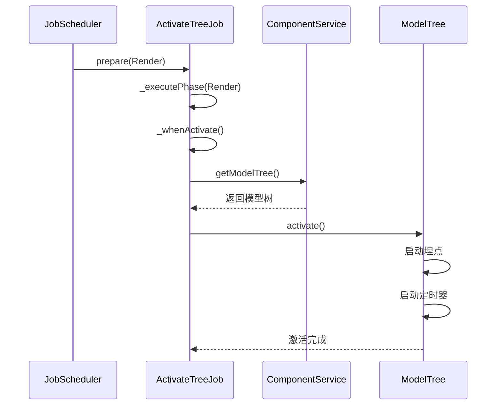
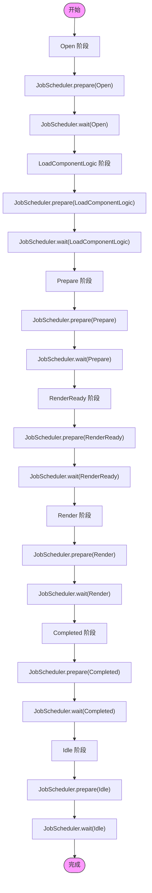
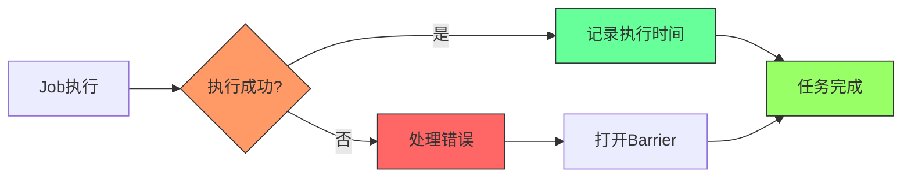

# 生命周期任务绑定

<cite>
**本文档引用的文件**
- [init-first-screen-data-job.ts](file://packages/h5-builder/src/jobs/init-first-screen-data-job.ts)
- [load-components-job.ts](file://packages/h5-builder/src/jobs/load-components-job.ts)
- [ensure-view-ready.ts](file://packages/h5-builder/src/jobs/ensure-view-ready.ts)
- [activate-tree-job.ts](file://packages/h5-builder/src/jobs/activate-tree-job.ts)
- [lifecycle.ts](file://packages/h5-builder/src/jobs/lifecycle.ts)
- [job-scheduler.ts](file://packages/h5-builder/src/bedrock/launch/job-scheduler.ts)
- [phase-emitter.ts](file://packages/h5-builder/src/bedrock/event/phase-emitter.ts)
- [abstract-job.ts](file://packages/h5-builder/src/bedrock/launch/abstract-job.ts)
- [component.service.ts](file://packages/h5-builder/src/services/component.service.ts)
- [schema.service.ts](file://packages/h5-builder/src/services/schema.service.ts)
- [barrier.ts](file://packages/h5-builder/src/bedrock/async/barrier.ts)
- [demo-progressive.tsx](file://packages/h5-builder/src/demo-progressive.tsx)
</cite>

## 目录
1. [项目结构](#项目结构)
2. [生命周期阶段定义](#生命周期阶段定义)
3. [Job调度器与依赖注入系统](#job调度器与依赖注入系统)
4. [核心Job类分析](#核心job类分析)
5. [Job执行流程与阶段协调](#job执行流程与阶段协调)
6. [自定义Job扩展机制](#自定义job扩展机制)
7. [错误处理与性能监控](#错误处理与性能监控)

## 项目结构

项目采用分层架构设计，核心生命周期管理位于`packages/h5-builder/src/jobs/`目录下，通过依赖注入（DI）系统协调各个组件的初始化和执行。Job调度机制与事件发射器共同构成了应用启动的核心流程。



**图示来源**
- [job-scheduler.ts](file://packages/h5-builder/src/bedrock/launch/job-scheduler.ts)
- [phase-emitter.ts](file://packages/h5-builder/src/bedrock/event/phase-emitter.ts)
- [component.service.ts](file://packages/h5-builder/src/services/component.service.ts)

**本节来源**
- [lifecycle.ts](file://packages/h5-builder/src/jobs/lifecycle.ts)
- [job-scheduler.ts](file://packages/h5-builder/src/bedrock/launch/job-scheduler.ts)

## 生命周期阶段定义

系统定义了清晰的页面生命周期阶段，每个阶段对应特定的初始化任务。这些阶段通过枚举`PageLifecycle`进行管理，确保了应用启动过程的有序性和可预测性。



**图示来源**
- [lifecycle.ts](file://packages/h5-builder/src/jobs/lifecycle.ts)

**本节来源**
- [lifecycle.ts](file://packages/h5-builder/src/jobs/lifecycle.ts)

## Job调度器与依赖注入系统

Job调度器（JobScheduler）是整个生命周期管理的核心，它通过依赖注入系统创建和管理各个Job实例。调度器与阶段事件发射器（PhaseEmitter）协同工作，确保任务按正确的顺序执行。



**图示来源**
- [job-scheduler.ts](file://packages/h5-builder/src/bedrock/launch/job-scheduler.ts)
- [abstract-job.ts](file://packages/h5-builder/src/bedrock/launch/abstract-job.ts)
- [phase-emitter.ts](file://packages/h5-builder/src/bedrock/event/phase-emitter.ts)
- [barrier.ts](file://packages/h5-builder/src/bedrock/async/barrier.ts)

**本节来源**
- [job-scheduler.ts](file://packages/h5-builder/src/bedrock/launch/job-scheduler.ts)
- [phase-emitter.ts](file://packages/h5-builder/src/bedrock/event/phase-emitter.ts)
- [abstract-job.ts](file://packages/h5-builder/src/bedrock/launch/abstract-job.ts)

## 核心Job类分析

### InitFirstScreenDataJob 首屏数据初始化

`InitFirstScreenDataJob`负责在页面渲染完成后初始化首屏数据。该任务在`Completed`阶段执行，通过组件服务获取根模型并调用其`init`方法来加载数据。



**图示来源**
- [init-first-screen-data-job.ts](file://packages/h5-builder/src/jobs/init-first-screen-data-job.ts)
- [component.service.ts](file://packages/h5-builder/src/services/component.service.ts)

**本节来源**
- [init-first-screen-data-job.ts](file://packages/h5-builder/src/jobs/init-first-screen-data-job.ts)

### LoadComponentsJob 组件资源加载

`LoadComponentsJob`负责异步加载组件的逻辑资源（Model JS）。该任务在`LoadComponentLogic`阶段执行，通过组件服务的`getModelTreeReady`方法并发加载所有必要的组件资源。



**图示来源**
- [load-components-job.ts](file://packages/h5-builder/src/jobs/load-components-job.ts)
- [component.service.ts](file://packages/h5-builder/src/services/component.service.ts)

**本节来源**
- [load-components-job.ts](file://packages/h5-builder/src/jobs/load-components-job.ts)

### EnsureViewReady 确保视图准备就绪

`EnsureViewReadyJob`负责确保视图资源准备就绪。该任务在`RenderReady`阶段执行，通过组件服务的`getViewsReady`方法等待所有视图资源加载完成。



**图示来源**
- [ensure-view-ready.ts](file://packages/h5-builder/src/jobs/ensure-view-ready.ts)
- [component.service.ts](file://packages/h5-builder/src/services/component.service.ts)

**本节来源**
- [ensure-view-ready.ts](file://packages/h5-builder/src/jobs/ensure-view-ready.ts)

### ActivateTreeJob 激活模型树

`ActivateTreeJob`负责激活整个组件树。该任务在`Render`阶段执行，通过组件服务获取模型树并调用其`activate`方法来启动组件的副作用（如埋点上报、定时器等）。



**图示来源**
- [activate-tree-job.ts](file://packages/h5-builder/src/jobs/activate-tree-job.ts)
- [component.service.ts](file://packages/h5-builder/src/services/component.service.ts)

**本节来源**
- [activate-tree-job.ts](file://packages/h5-builder/src/jobs/activate-tree-job.ts)

## Job执行流程与阶段协调

Job的执行流程通过`JobScheduler`的`prepare`和`wait`方法进行协调。每个阶段的执行分为两个步骤：准备（prepare）和等待（wait）。这种设计确保了任务的有序执行和异步操作的正确处理。



**图示来源**
- [job-scheduler.ts](file://packages/h5-builder/src/bedrock/launch/job-scheduler.ts)
- [demo-progressive.tsx](file://packages/h5-builder/src/demo-progressive.tsx)

**本节来源**
- [job-scheduler.ts](file://packages/h5-builder/src/bedrock/launch/job-scheduler.ts)
- [demo-progressive.tsx](file://packages/h5-builder/src/demo-progressive.tsx)

## 自定义Job扩展机制

系统提供了灵活的自定义Job扩展机制，允许开发者注册新的Job来扩展生命周期流程。通过`JobScheduler`的`registerJob`方法，可以将自定义Job绑定到特定的生命周期阶段。

```mermaid
classDiagram
class CustomJob {
+name : string
+_executePhase(phase : PageLifecycle)
}
class JobScheduler {
+registerJob(phase : K, ctor : Constructor, ...args : any[])
}
JobScheduler --> CustomJob : "注册"
note right of JobScheduler
registerJob方法将自定义Job
与特定生命周期阶段关联
end
note right of CustomJob
自定义Job必须继承
AbstractJob基类并实现
_executePhase方法
end
```

**图示来源**
- [job-scheduler.ts](file://packages/h5-builder/src/bedrock/launch/job-scheduler.ts)
- [abstract-job.ts](file://packages/h5-builder/src/bedrock/launch/abstract-job.ts)

**本节来源**
- [job-scheduler.ts](file://packages/h5-builder/src/bedrock/launch/job-scheduler.ts)
- [abstract-job.ts](file://packages/h5-builder/src/bedrock/launch/abstract-job.ts)

## 错误处理与性能监控

系统内置了完善的错误处理和性能监控机制。通过`CostRecorder`记录每个Job的执行时间，帮助开发者优化性能。同时，Barrier机制确保了异步操作的正确完成，即使在出错情况下也能保持系统的稳定性。



**图示来源**
- [job-scheduler.ts](file://packages/h5-builder/src/bedrock/launch/job-scheduler.ts)
- [cost-recorder.ts](file://packages/h5-builder/src/bedrock/launch/cost-recorder.ts)
- [barrier.ts](file://packages/h5-builder/src/bedrock/async/barrier.ts)

**本节来源**
- [job-scheduler.ts](file://packages/h5-builder/src/bedrock/launch/job-scheduler.ts)
- [cost-recorder.ts](file://packages/h5-builder/src/bedrock/launch/cost-recorder.ts)
- [barrier.ts](file://packages/h5-builder/src/bedrock/async/barrier.ts)