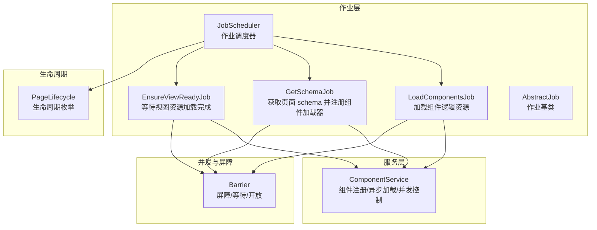
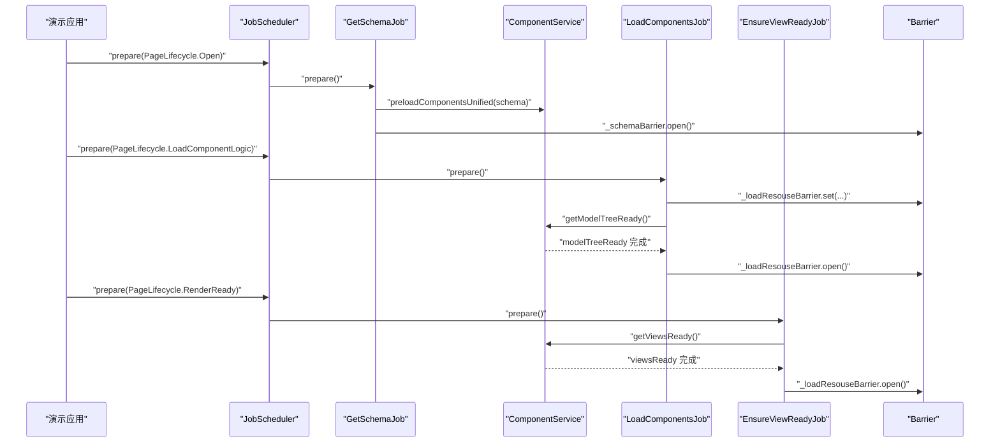
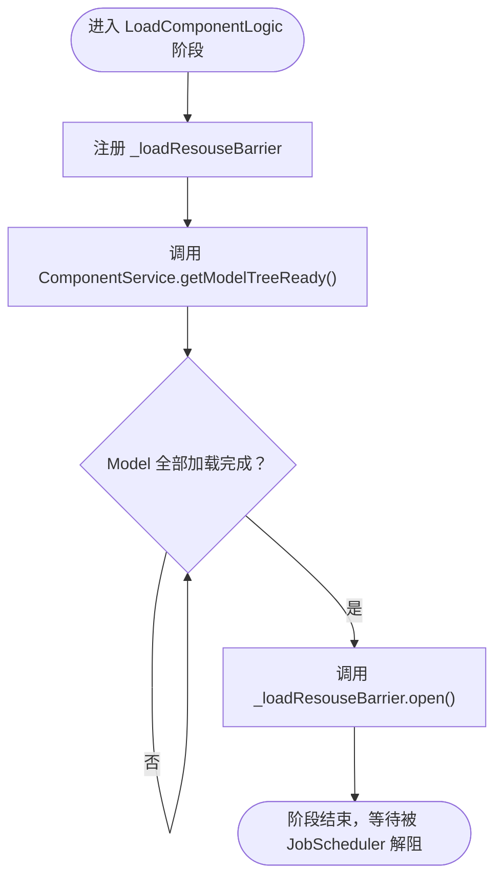
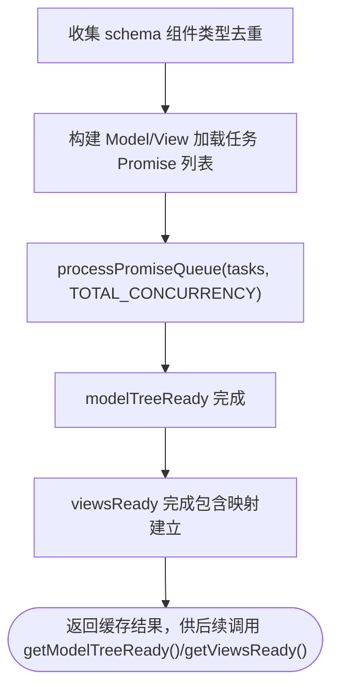
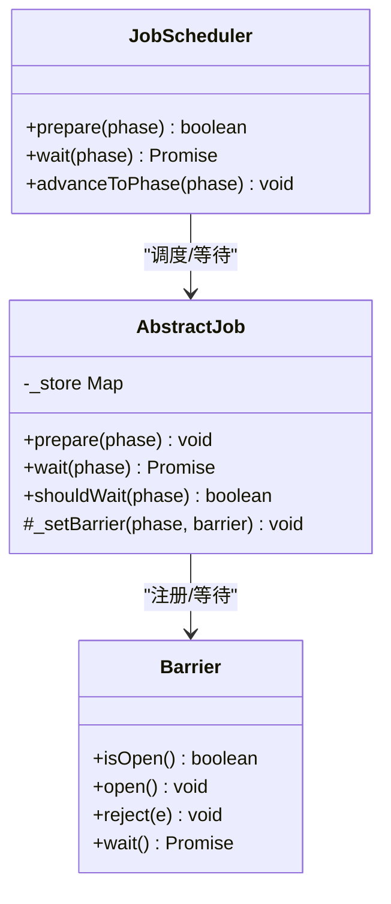
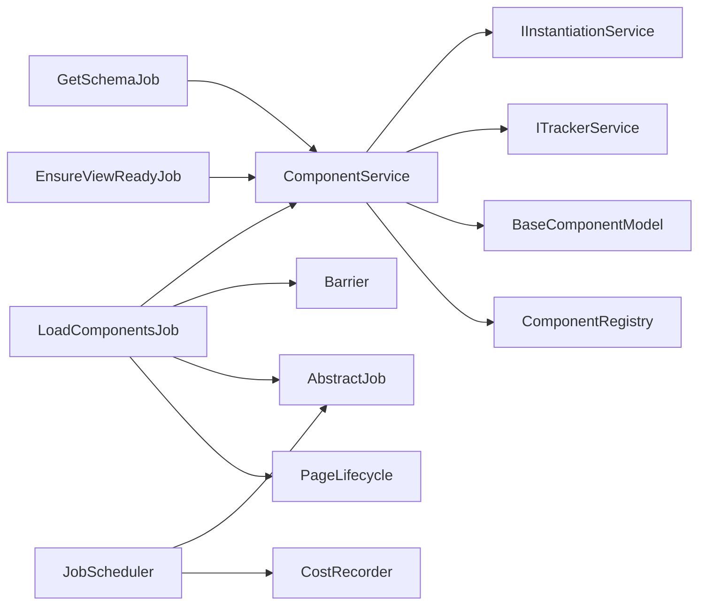

# 组件逻辑加载任务

<cite>
**本文引用的文件**
- [load-components-job.ts](file://packages/h5-builder/src/jobs/load-components-job.ts)
- [component.service.ts](file://packages/h5-builder/src/services/component.service.ts)
- [barrier.ts](file://packages/h5-builder/src/bedrock/async/barrier.ts)
- [abstract-job.ts](file://packages/h5-builder/src/bedrock/launch/abstract-job.ts)
- [job-scheduler.ts](file://packages/h5-builder/src/bedrock/launch/job-scheduler.ts)
- [lifecycle.ts](file://packages/h5-builder/src/jobs/lifecycle.ts)
- [get-schema-job.ts](file://packages/h5-builder/src/jobs/get-schema-job.ts)
- [ensure-view-ready.ts](file://packages/h5-builder/src/jobs/ensure-view-ready.ts)
- [demo-progressive.tsx](file://packages/h5-builder/src/demo-progressive.tsx)
</cite>

## 目录
1. [简介](#简介)
2. [项目结构](#项目结构)
3. [核心组件](#核心组件)
4. [架构总览](#架构总览)
5. [详细组件分析](#详细组件分析)
6. [依赖分析](#依赖分析)
7. [性能考虑](#性能考虑)
8. [故障排查指南](#故障排查指南)
9. [结论](#结论)
10. [附录](#附录)

## 简介
本文件围绕 LoadComponentsJob 在 LoadComponentLogic 生命周期阶段的资源加载行为展开，系统性解析其如何利用 Barrier 机制阻塞流程直至所有组件 Model 资源加载完成，如何通过 ComponentService.getModelTreeReady() 实现并发资源获取，以及统一队列并发加载策略的实现细节与日志调试价值。同时给出配置建议与常见问题的处理策略，帮助读者在实际工程中稳定、高效地完成组件逻辑层资源加载。

## 项目结构
与 LoadComponentsJob 相关的关键模块分布如下：
- 作业层：LoadComponentsJob、GetSchemaJob、EnsureViewReadyJob、JobScheduler、AbstractJob、生命周期枚举
- 服务层：ComponentService（组件注册、异步加载、并发控制、映射建立）
- 并发与屏障：Barrier、Promise.race/Promise.all 并发控制
- 示例与编排：demo-progressive.tsx 展示了完整的生命周期推进与作业编排

图表来源
- [load-components-job.ts](file://packages/h5-builder/src/jobs/load-components-job.ts#L1-L61)
- [get-schema-job.ts](file://packages/h5-builder/src/jobs/get-schema-job.ts#L1-L76)
- [ensure-view-ready.ts](file://packages/h5-builder/src/jobs/ensure-view-ready.ts#L1-L52)
- [job-scheduler.ts](file://packages/h5-builder/src/bedrock/launch/job-scheduler.ts#L1-L123)
- [abstract-job.ts](file://packages/h5-builder/src/bedrock/launch/abstract-job.ts#L1-L46)
- [barrier.ts](file://packages/h5-builder/src/bedrock/async/barrier.ts#L1-L59)
- [lifecycle.ts](file://packages/h5-builder/src/jobs/lifecycle.ts#L1-L18)
- [demo-progressive.tsx](file://packages/h5-builder/src/demo-progressive.tsx#L66-L100)

章节来源
- [load-components-job.ts](file://packages/h5-builder/src/jobs/load-components-job.ts#L1-L61)
- [component.service.ts](file://packages/h5-builder/src/services/component.service.ts#L627-L734)
- [barrier.ts](file://packages/h5-builder/src/bedrock/async/barrier.ts#L1-L59)
- [abstract-job.ts](file://packages/h5-builder/src/bedrock/launch/abstract-job.ts#L1-L46)
- [job-scheduler.ts](file://packages/h5-builder/src/bedrock/launch/job-scheduler.ts#L1-L123)
- [lifecycle.ts](file://packages/h5-builder/src/jobs/lifecycle.ts#L1-L18)
- [get-schema-job.ts](file://packages/h5-builder/src/jobs/get-schema-job.ts#L46-L76)
- [ensure-view-ready.ts](file://packages/h5-builder/src/jobs/ensure-view-ready.ts#L1-L52)
- [demo-progressive.tsx](file://packages/h5-builder/src/demo-progressive.tsx#L66-L100)

## 核心组件
- LoadComponentsJob：在 LoadComponentLogic 阶段阻塞等待，直到所有组件 Model 资源加载完成，然后开放屏障继续后续阶段。
- ComponentService：提供统一队列并发加载能力，按总并发度调度 Model/View，建立映射关系，并提供 getModelTreeReady()/getViewsReady() 供外部等待。
- Barrier：提供 isOpen/open/wait 语义，用于作业间阶段阻塞与解阻。
- JobScheduler：按生命周期阶段推进作业，聚合各作业的屏障并等待。
- AbstractJob：作业基类，维护每个阶段的屏障集合，提供 prepare/wait/shouldWait 等能力。
- PageLifecycle：定义页面生命周期阶段，作为作业调度的阶段标识。

章节来源
- [load-components-job.ts](file://packages/h5-builder/src/jobs/load-components-job.ts#L1-L61)
- [component.service.ts](file://packages/h5-builder/src/services/component.service.ts#L627-L734)
- [barrier.ts](file://packages/h5-builder/src/bedrock/async/barrier.ts#L1-L59)
- [abstract-job.ts](file://packages/h5-builder/src/bedrock/launch/abstract-job.ts#L1-L46)
- [job-scheduler.ts](file://packages/h5-builder/src/bedrock/launch/job-scheduler.ts#L1-L123)
- [lifecycle.ts](file://packages/h5-builder/src/jobs/lifecycle.ts#L1-L18)

## 架构总览
LoadComponentsJob 与 ComponentService、Barrier、JobScheduler 协作，形成“先注册组件加载器并预加载资源，再阻塞等待 Model 完成，最后开放屏障”的闭环。GetSchemaJob 负责拉取 schema 并注册组件加载器；EnsureViewReadyJob 在 RenderReady 阶段等待 View 资源完成。

图表来源
- [demo-progressive.tsx](file://packages/h5-builder/src/demo-progressive.tsx#L66-L100)
- [get-schema-job.ts](file://packages/h5-builder/src/jobs/get-schema-job.ts#L46-L76)
- [load-components-job.ts](file://packages/h5-builder/src/jobs/load-components-job.ts#L49-L60)
- [ensure-view-ready.ts](file://packages/h5-builder/src/jobs/ensure-view-ready.ts#L46-L52)
- [component.service.ts](file://packages/h5-builder/src/services/component.service.ts#L627-L734)
- [barrier.ts](file://packages/h5-builder/src/bedrock/async/barrier.ts#L1-L59)

## 详细组件分析

### LoadComponentsJob 在 LoadComponentLogic 阶段的行为
- 阶段入口：当 JobScheduler 推进到 LoadComponentLogic 时，LoadComponentsJob._executePhase 调用 _whenLoadComponentLogic。
- 设置屏障：在进入阶段前，通过 AbstractJob._setBarrier 注册一个私有的 _loadResouseBarrier，用于阻塞后续阶段。
- 并发加载：调用 ComponentService.getModelTreeReady() 等待所有 Model 资源加载完成。
- 开放屏障：Model 资源完成后，调用 _loadResouseBarrier.open()，解除阻塞，允许后续阶段继续推进。

图表来源
- [load-components-job.ts](file://packages/h5-builder/src/jobs/load-components-job.ts#L49-L60)
- [abstract-job.ts](file://packages/h5-builder/src/bedrock/launch/abstract-job.ts#L32-L46)
- [barrier.ts](file://packages/h5-builder/src/bedrock/async/barrier.ts#L25-L41)

章节来源
- [load-components-job.ts](file://packages/h5-builder/src/jobs/load-components-job.ts#L23-L60)
- [abstract-job.ts](file://packages/h5-builder/src/bedrock/launch/abstract-job.ts#L11-L46)
- [barrier.ts](file://packages/h5-builder/src/bedrock/async/barrier.ts#L1-L59)

### ComponentService 如何实现并发资源获取
- 统一队列并发加载：preloadComponentsUnified 收集 schema 中涉及的所有组件类型去重后，先批量创建 Model 加载 Promise，再批量创建 View 加载 Promise，最终以 Promise 数组形式交给 processPromiseQueue 控制并发。
- 并发控制策略：processPromiseQueue 使用 Promise.race 与 Promise.all 结合，达到“完成一个补充一个”的效果，避免一次性创建过多任务导致内存与网络压力。
- 总并发度：TOTAL_CONCURRENCY 作为统一并发上限，保证整体吞吐与稳定性。
- 错误与降级：单个组件加载失败不会阻塞其他组件，会注册空 Model/空 View 并上报错误，保证整体流程继续推进。
- 映射建立：在所有资源加载完成后，统一建立 Model-View 映射关系，确保后续渲染可用。

图表来源
- [component.service.ts](file://packages/h5-builder/src/services/component.service.ts#L627-L734)
- [component.service.ts](file://packages/h5-builder/src/services/component.service.ts#L515-L623)

章节来源
- [component.service.ts](file://packages/h5-builder/src/services/component.service.ts#L627-L734)
- [component.service.ts](file://packages/h5-builder/src/services/component.service.ts#L515-L623)

### Barrier 机制如何阻塞流程直至资源加载完成
- Barrier 提供 isOpen/open/wait 三要素：初始关闭，通过 open() 永久开放；wait() 返回一个 Promise，用于作业等待。
- AbstractJob 维护每个阶段的屏障集合，prepare() 时将作业设置的屏障加入对应阶段；wait(phase) 会聚合该阶段所有屏障的 wait() 并行等待。
- JobScheduler.advanceToPhase 会断言当前阶段不存在仍需等待的屏障，确保流程安全推进。

图表来源
- [barrier.ts](file://packages/h5-builder/src/bedrock/async/barrier.ts#L1-L59)
- [abstract-job.ts](file://packages/h5-builder/src/bedrock/launch/abstract-job.ts#L1-L46)
- [job-scheduler.ts](file://packages/h5-builder/src/bedrock/launch/job-scheduler.ts#L65-L122)

章节来源
- [barrier.ts](file://packages/h5-builder/src/bedrock/async/barrier.ts#L1-L59)
- [abstract-job.ts](file://packages/h5-builder/src/bedrock/launch/abstract-job.ts#L11-L46)
- [job-scheduler.ts](file://packages/h5-builder/src/bedrock/launch/job-scheduler.ts#L65-L122)

### 日志输出在资源加载过程中的调试作用
- 资源拉取阶段：GetSchemaJob 在拉取 schema 完成后，开始计时并调用 preloadComponentsUnified，随后开放 _schemaBarrier。
- Model 资源阶段：LoadComponentsJob 在进入 LoadComponentLogic 时记录开始与结束时间，等待 getModelTreeReady 完成后开放 _loadResouseBarrier。
- View 资源阶段：EnsureViewReadyJob 在 RenderReady 时等待 getViewsReady 完成后开放 _loadResouseBarrier。
- 组件加载器内部：ComponentService 在加载 Model/View 时打印延迟与错误信息，便于定位慢请求与失败原因。

章节来源
- [get-schema-job.ts](file://packages/h5-builder/src/jobs/get-schema-job.ts#L46-L76)
- [load-components-job.ts](file://packages/h5-builder/src/jobs/load-components-job.ts#L49-L60)
- [ensure-view-ready.ts](file://packages/h5-builder/src/jobs/ensure-view-ready.ts#L46-L52)
- [component.service.ts](file://packages/h5-builder/src/services/component.service.ts#L370-L420)
- [component.service.ts](file://packages/h5-builder/src/services/component.service.ts#L422-L470)

## 依赖分析
- LoadComponentsJob 依赖 ComponentService（getModelTreeReady）、Barrier（阶段阻塞）、AbstractJob（作业框架）、PageLifecycle（阶段标识）。
- ComponentService 依赖 IInstantiationService（实例化）、ITrackerService（埋点）、BaseComponentModel/BaseContainerModel（模型基类）、ComponentRegistry（注册表）。
- JobScheduler 依赖 AbstractJob、CostRecorder（性能统计），负责按阶段实例化与等待作业屏障。
- GetSchemaJob 与 EnsureViewReadyJob 分别在不同阶段与 ComponentService 协作，共同完成资源加载闭环。

图表来源
- [load-components-job.ts](file://packages/h5-builder/src/jobs/load-components-job.ts#L1-L61)
- [component.service.ts](file://packages/h5-builder/src/services/component.service.ts#L1-L120)
- [job-scheduler.ts](file://packages/h5-builder/src/bedrock/launch/job-scheduler.ts#L1-L123)
- [get-schema-job.ts](file://packages/h5-builder/src/jobs/get-schema-job.ts#L1-L76)
- [ensure-view-ready.ts](file://packages/h5-builder/src/jobs/ensure-view-ready.ts#L1-L52)

章节来源
- [load-components-job.ts](file://packages/h5-builder/src/jobs/load-components-job.ts#L1-L61)
- [component.service.ts](file://packages/h5-builder/src/services/component.service.ts#L1-L120)
- [job-scheduler.ts](file://packages/h5-builder/src/bedrock/launch/job-scheduler.ts#L1-L123)
- [get-schema-job.ts](file://packages/h5-builder/src/jobs/get-schema-job.ts#L1-L76)
- [ensure-view-ready.ts](file://packages/h5-builder/src/jobs/ensure-view-ready.ts#L1-L52)

## 性能考虑
- 统一队列并发：通过 TOTAL_CONCURRENCY 控制整体并发，避免过度并发导致网络拥塞与内存抖动。
- 完成即补充策略：processPromiseQueue 使用 Promise.race 等待任意任务完成后再补充下一个，提升吞吐与响应速度。
- 缓存与幂等：preloadComponentsUnified 仅执行一次并缓存结果，后续调用直接返回缓存 Promise，降低重复开销。
- 错误隔离：单组件加载失败不阻塞整体，注册空实现并上报，保障主流程稳定。
- 延迟模拟：支持 delayRange 配置，便于压测与观察加载曲线。

章节来源
- [component.service.ts](file://packages/h5-builder/src/services/component.service.ts#L627-L734)
- [component.service.ts](file://packages/h5-builder/src/services/component.service.ts#L515-L623)

## 故障排查指南
- 现象：LoadComponentLogic 阶段长时间阻塞
  - 排查：确认是否正确调用了 GetSchemaJob 的 preloadComponentsUnified，确保 ComponentService._loadingResult 已生成。
  - 排查：检查 getModelTreeReady 是否抛出“必须先调用 preloadComponentsUnified”异常。
  - 排查：查看日志中“远端拉取所有组件相关资源完成 - Model”计时是否正常结束。
- 现象：部分组件加载失败
  - 排查：查看 ComponentService 在 loadModel/loadView 中的错误分支，确认是否注册了空 Model/空 View 并上报错误。
  - 建议：为关键组件配置较低 delayRange 或调整 priority，确保首屏关键路径优先。
- 现象：并发过高导致网络拥塞
  - 建议：适当降低 TOTAL_CONCURRENCY，结合业务场景评估峰值并发。
- 现象：视图资源未及时加载
  - 排查：EnsureViewReadyJob 是否在 RenderReady 阶段等待 getViewsReady 完成；确认映射建立日志是否出现。
- 现象：日志缺失或不完整
  - 建议：在关键节点增加 console.time/console.timeEnd，并确保在开发环境开启调试日志。

章节来源
- [get-schema-job.ts](file://packages/h5-builder/src/jobs/get-schema-job.ts#L46-L76)
- [load-components-job.ts](file://packages/h5-builder/src/jobs/load-components-job.ts#L49-L60)
- [ensure-view-ready.ts](file://packages/h5-builder/src/jobs/ensure-view-ready.ts#L46-L52)
- [component.service.ts](file://packages/h5-builder/src/services/component.service.ts#L370-L470)
- [component.service.ts](file://packages/h5-builder/src/services/component.service.ts#L627-L734)

## 结论
LoadComponentsJob 通过 Barrier 与 JobScheduler 的协作，在 LoadComponentLogic 阶段可靠地阻塞并等待所有组件 Model 资源加载完成。ComponentService 采用统一队列并发策略，结合 Promise.race/Promise.all 的完成即补充机制，既保证吞吐又避免资源竞争。配合完善的日志与错误降级策略，可在复杂场景下稳定推进页面生命周期，为后续构建模型树与渲染打下坚实基础。

## 附录
- 配置建议
  - 并发度：根据网络与设备能力，合理设置 TOTAL_CONCURRENCY；对首屏关键组件可提高优先级或降低延迟范围。
  - 错误策略：启用错误占位与埋点上报，便于快速定位问题组件。
  - 日志：在关键阶段开启计时与状态日志，便于性能分析与问题复盘。
- 常见问题
  - 未调用 preloadComponentsUnified 导致 getModelTreeReady 抛错：确保在 Open 阶段完成注册与预加载。
  - 资源加载超时：结合网络监控与 CDN 优化，必要时分批加载或引入缓存策略。
  - 失败组件影响范围过大：通过错误降级与映射建立的健壮性，确保不影响其他组件。