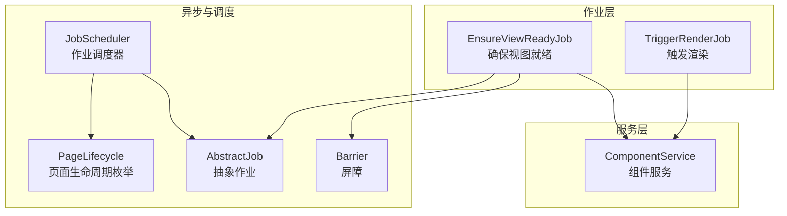
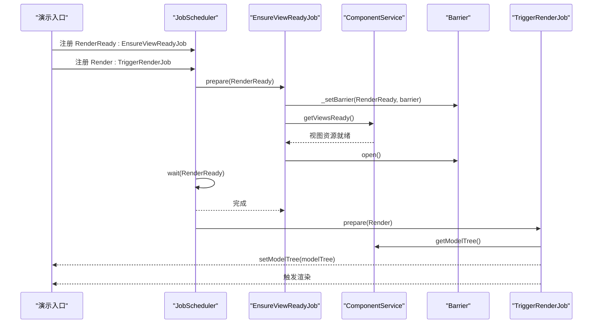
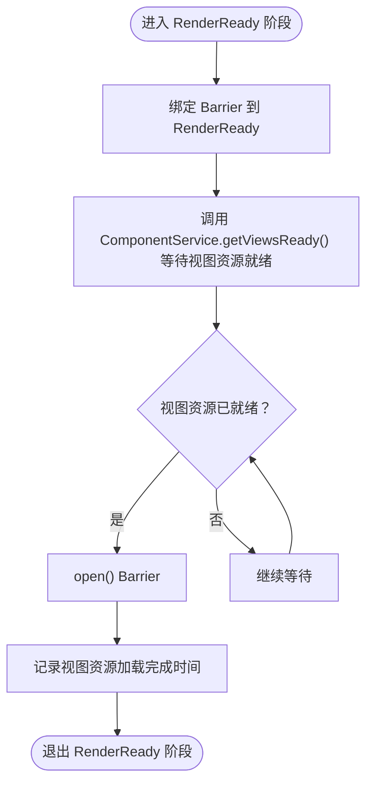
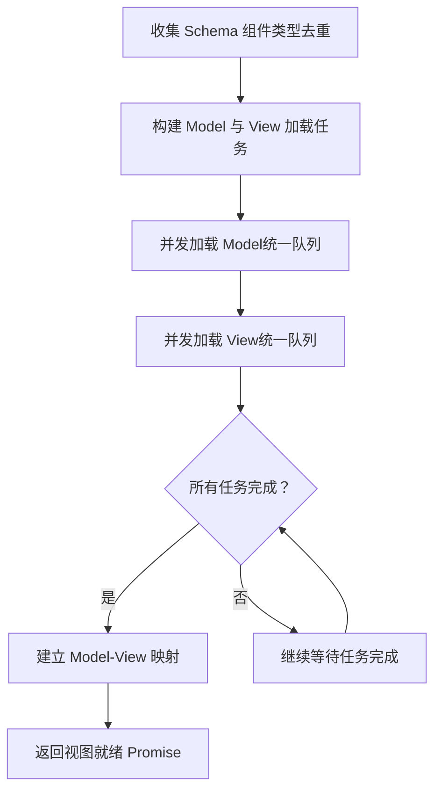
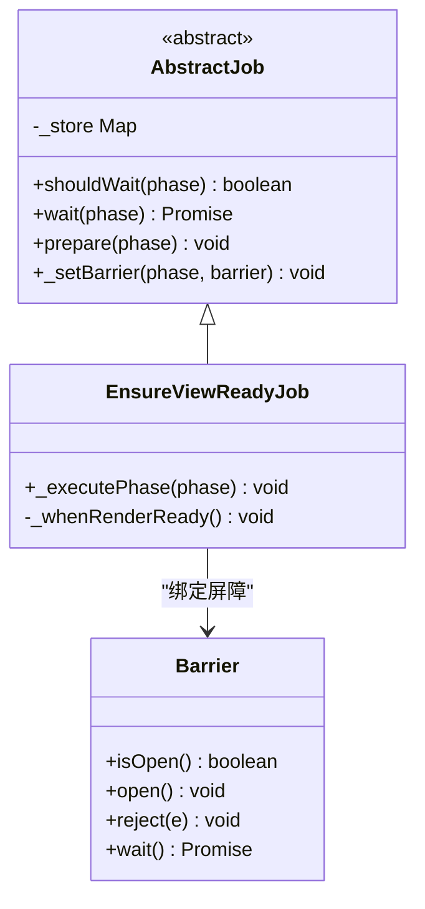
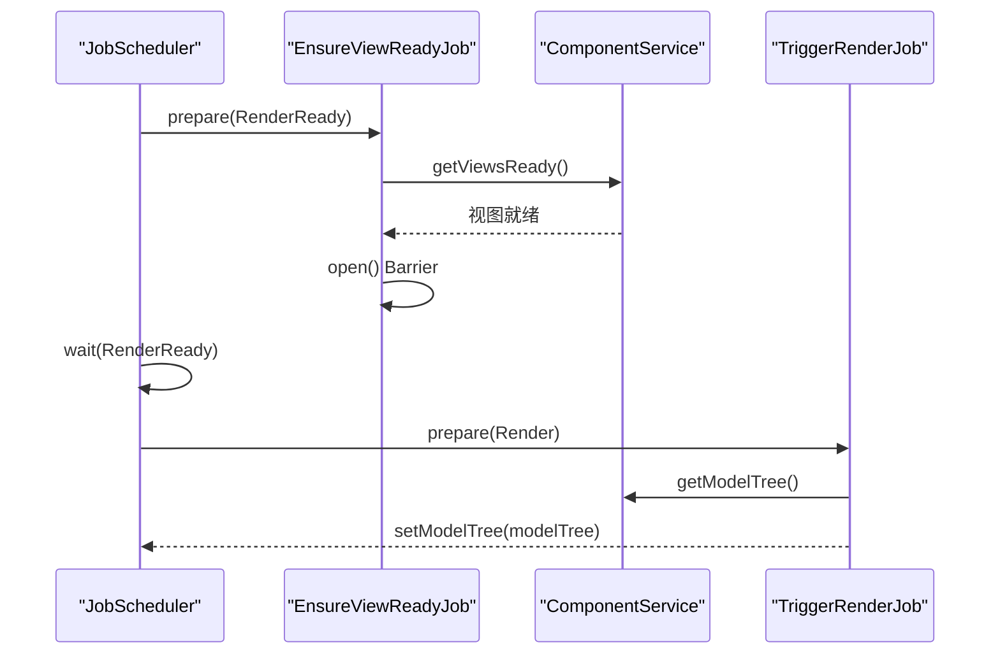
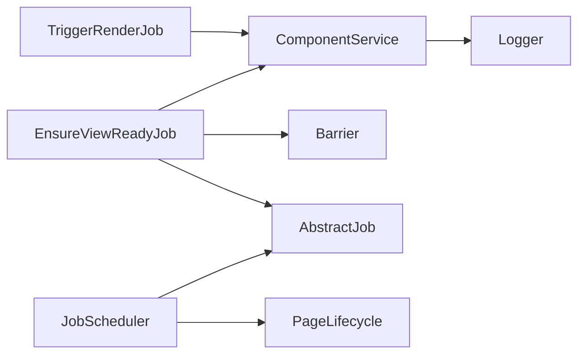

# 视图准备就绪保障任务

<cite>
**本文引用的文件**
- [ensure-view-ready.ts](file://packages/h5-builder/src/jobs/ensure-view-ready.ts)
- [component.service.ts](file://packages/h5-builder/src/services/component.service.ts)
- [barrier.ts](file://packages/h5-builder/src/bedrock/async/barrier.ts)
- [abstract-job.ts](file://packages/h5-builder/src/bedrock/launch/abstract-job.ts)
- [job-scheduler.ts](file://packages/h5-builder/src/bedrock/launch/job-scheduler.ts)
- [lifecycle.ts](file://packages/h5-builder/src/jobs/lifecycle.ts)
- [demo-progressive.tsx](file://packages/h5-builder/src/demo-progressive.tsx)
- [trigger-render-job.ts](file://packages/h5-builder/src/jobs/trigger-render-job.ts)
- [logger.ts](file://packages/h5-builder/src/bedrock/_internal/logger.ts)
</cite>

## 目录
1. [引言](#引言)
2. [项目结构](#项目结构)
3. [核心组件](#核心组件)
4. [架构总览](#架构总览)
5. [详细组件分析](#详细组件分析)
6. [依赖关系分析](#依赖关系分析)
7. [性能考量与监控](#性能考量与监控)
8. [故障排查指南](#故障排查指南)
9. [结论](#结论)
10. [附录](#附录)

## 引言
本文围绕 EnsureViewReadyJob 在 RenderReady 阶段确保 UI 组件视图资源加载完成的实现机制展开，系统说明其如何通过 Barrier 协调异步操作，并调用 ComponentService.getViewsReady() 等待所有视图资源准备就绪；进一步阐述该 Job 在渲染流程中的关键作用，确保在进入渲染阶段前所有依赖资源已加载完毕；最后提供性能监控指标的解读方法，并指导开发者如何自定义视图准备条件以适应特殊业务场景。

## 项目结构
本仓库采用分包组织方式，核心实现位于 h5-builder 包中，包含作业调度、组件服务、异步屏障等模块。EnsureViewReadyJob 属于作业层，ComponentService 属于服务层，Barrier 与 JobScheduler 分别提供异步协调与阶段推进能力。

图表来源
- [ensure-view-ready.ts](file://packages/h5-builder/src/jobs/ensure-view-ready.ts#L1-L52)
- [component.service.ts](file://packages/h5-builder/src/services/component.service.ts#L1-L732)
- [barrier.ts](file://packages/h5-builder/src/bedrock/async/barrier.ts#L1-L59)
- [abstract-job.ts](file://packages/h5-builder/src/bedrock/launch/abstract-job.ts#L1-L45)
- [job-scheduler.ts](file://packages/h5-builder/src/bedrock/launch/job-scheduler.ts#L1-L123)
- [lifecycle.ts](file://packages/h5-builder/src/jobs/lifecycle.ts#L1-L18)

章节来源
- [ensure-view-ready.ts](file://packages/h5-builder/src/jobs/ensure-view-ready.ts#L1-L52)
- [component.service.ts](file://packages/h5-builder/src/services/component.service.ts#L1-L732)
- [barrier.ts](file://packages/h5-builder/src/bedrock/async/barrier.ts#L1-L59)
- [abstract-job.ts](file://packages/h5-builder/src/bedrock/launch/abstract-job.ts#L1-L45)
- [job-scheduler.ts](file://packages/h5-builder/src/bedrock/launch/job-scheduler.ts#L1-L123)
- [lifecycle.ts](file://packages/h5-builder/src/jobs/lifecycle.ts#L1-L18)

## 核心组件
- EnsureViewReadyJob：在 RenderReady 阶段等待视图资源就绪，通过 Barrier 与 JobScheduler 的 shouldWait/wait 协作，保证渲染阶段前资源可用。
- ComponentService：提供异步组件注册、统一并发加载、视图资源就绪 Promise 等能力，支撑 EnsureViewReadyJob 的等待条件。
- Barrier：初始关闭的屏障，通过 open() 永久开放，wait() 返回 Promise，用于作业间异步协调。
- JobScheduler：按生命周期阶段推进作业，prepare/advanceToPhase/wait 控制阶段切换与等待。
- PageLifecycle：定义页面生命周期阶段，RenderReady 是关键节点。

章节来源
- [ensure-view-ready.ts](file://packages/h5-builder/src/jobs/ensure-view-ready.ts#L1-L52)
- [component.service.ts](file://packages/h5-builder/src/services/component.service.ts#L622-L732)
- [barrier.ts](file://packages/h5-builder/src/bedrock/async/barrier.ts#L1-L59)
- [job-scheduler.ts](file://packages/h5-builder/src/bedrock/launch/job-scheduler.ts#L65-L121)
- [lifecycle.ts](file://packages/h5-builder/src/jobs/lifecycle.ts#L1-L18)

## 架构总览
EnsureViewReadyJob 在 RenderReady 阶段执行，其职责是：
- 通过 _setBarrier 将自身与 Barrier 绑定；
- 调用 ComponentService.getViewsReady() 等待所有视图资源加载完成；
- 结束后 open() Barrier，通知 JobScheduler 该阶段已完成，允许推进到 Render 阶段；
- TriggerRenderJob 在 Render 阶段触发实际渲染。

图表来源
- [demo-progressive.tsx](file://packages/h5-builder/src/demo-progressive.tsx#L75-L156)
- [ensure-view-ready.ts](file://packages/h5-builder/src/jobs/ensure-view-ready.ts#L25-L51)
- [component.service.ts](file://packages/h5-builder/src/services/component.service.ts#L696-L716)
- [trigger-render-job.ts](file://packages/h5-builder/src/jobs/trigger-render-job.ts#L1-L43)
- [abstract-job.ts](file://packages/h5-builder/src/bedrock/launch/abstract-job.ts#L11-L42)
- [job-scheduler.ts](file://packages/h5-builder/src/bedrock/launch/job-scheduler.ts#L65-L121)

## 详细组件分析

### EnsureViewReadyJob 分析
- 生命周期钩子：仅在 RenderReady 阶段执行 _whenRenderReady()。
- 异步协调：通过 _setBarrier 将自身与 Barrier 绑定；await ComponentService.getViewsReady() 后 open() Barrier，使 JobScheduler 的 wait(RenderReady) 解锁。
- 性能日志：结束时输出“远端拉取所有组件相关资源完成 - View”时间戳，便于观测视图资源加载耗时。

图表来源
- [ensure-view-ready.ts](file://packages/h5-builder/src/jobs/ensure-view-ready.ts#L25-L51)
- [component.service.ts](file://packages/h5-builder/src/services/component.service.ts#L696-L716)
- [barrier.ts](file://packages/h5-builder/src/bedrock/async/barrier.ts#L1-L59)
- [abstract-job.ts](file://packages/h5-builder/src/bedrock/launch/abstract-job.ts#L11-L42)

章节来源
- [ensure-view-ready.ts](file://packages/h5-builder/src/jobs/ensure-view-ready.ts#L1-L52)

### ComponentService.getViewsReady 与资源加载机制
- 统一并发加载：preloadComponentsUnified 收集 Schema 中去重后的组件类型，先并行加载所有 Model，再并行加载所有 View，最终在 Promise.all 完成后建立 Model-View 映射。
- 视图就绪 Promise：getViewsReady 返回“所有资源加载完成并建立映射”的 Promise，确保渲染阶段可安全使用 View。
- 错误与占位：当 Model 或 View 加载失败时，分别创建空 Model/空 View 并上报追踪事件，避免阻塞整体流程。

图表来源
- [component.service.ts](file://packages/h5-builder/src/services/component.service.ts#L622-L732)

章节来源
- [component.service.ts](file://packages/h5-builder/src/services/component.service.ts#L622-L732)

### Barrier 与作业等待协作
- Barrier：初始关闭，open() 永久开放，wait() 返回 Promise；makeBarrierByPromise 可基于 Promise 自动 open/reject。
- AbstractJob：维护 phase -> Barrier[] 的映射；shouldWait(phase) 判断是否存在等待；wait(phase) 聚合所有 Barrier.wait()。
- EnsureViewReadyJob：在 RenderReady 阶段通过 _setBarrier 绑定 Barrier，随后在 getViewsReady 完成后 open()，从而解锁 JobScheduler 的 wait(RenderReady)。

图表来源
- [barrier.ts](file://packages/h5-builder/src/bedrock/async/barrier.ts#L1-L59)
- [abstract-job.ts](file://packages/h5-builder/src/bedrock/launch/abstract-job.ts#L1-L45)
- [ensure-view-ready.ts](file://packages/h5-builder/src/jobs/ensure-view-ready.ts#L1-L52)

章节来源
- [barrier.ts](file://packages/h5-builder/src/bedrock/async/barrier.ts#L1-L59)
- [abstract-job.ts](file://packages/h5-builder/src/bedrock/launch/abstract-job.ts#L1-L45)
- [ensure-view-ready.ts](file://packages/h5-builder/src/jobs/ensure-view-ready.ts#L1-L52)

### 渲染阶段触发与视图就绪的关系
- RenderReady 阶段：EnsureViewReadyJob 确保 getViewsReady 已完成，Barrier 开放，允许推进到 Render。
- Render 阶段：TriggerRenderJob 读取 ComponentService.getModelTree() 并调用 setModelTree 触发渲染。

图表来源
- [ensure-view-ready.ts](file://packages/h5-builder/src/jobs/ensure-view-ready.ts#L25-L51)
- [trigger-render-job.ts](file://packages/h5-builder/src/jobs/trigger-render-job.ts#L1-L43)
- [component.service.ts](file://packages/h5-builder/src/services/component.service.ts#L718-L731)
- [job-scheduler.ts](file://packages/h5-builder/src/bedrock/launch/job-scheduler.ts#L65-L121)

章节来源
- [trigger-render-job.ts](file://packages/h5-builder/src/jobs/trigger-render-job.ts#L1-L43)
- [component.service.ts](file://packages/h5-builder/src/services/component.service.ts#L718-L731)

## 依赖关系分析
- EnsureViewReadyJob 依赖 ComponentService 提供的 getViewsReady，依赖 Barrier 与 AbstractJob 的等待机制，依赖 JobScheduler 的阶段推进。
- ComponentService 依赖 DI 容器创建实例、TrackerService 进行事件追踪、Logger 输出日志。
- PageLifecycle 为阶段枚举，驱动 JobScheduler 的 prepare/advanceToPhase/wait。

图表来源
- [ensure-view-ready.ts](file://packages/h5-builder/src/jobs/ensure-view-ready.ts#L1-L52)
- [component.service.ts](file://packages/h5-builder/src/services/component.service.ts#L1-L732)
- [barrier.ts](file://packages/h5-builder/src/bedrock/async/barrier.ts#L1-L59)
- [abstract-job.ts](file://packages/h5-builder/src/bedrock/launch/abstract-job.ts#L1-L45)
- [job-scheduler.ts](file://packages/h5-builder/src/bedrock/launch/job-scheduler.ts#L1-L123)
- [lifecycle.ts](file://packages/h5-builder/src/jobs/lifecycle.ts#L1-L18)
- [logger.ts](file://packages/h5-builder/src/bedrock/_internal/logger.ts#L1-L59)

章节来源
- [ensure-view-ready.ts](file://packages/h5-builder/src/jobs/ensure-view-ready.ts#L1-L52)
- [component.service.ts](file://packages/h5-builder/src/services/component.service.ts#L1-L732)
- [barrier.ts](file://packages/h5-builder/src/bedrock/async/barrier.ts#L1-L59)
- [abstract-job.ts](file://packages/h5-builder/src/bedrock/launch/abstract-job.ts#L1-L45)
- [job-scheduler.ts](file://packages/h5-builder/src/bedrock/launch/job-scheduler.ts#L1-L123)
- [lifecycle.ts](file://packages/h5-builder/src/jobs/lifecycle.ts#L1-L18)
- [logger.ts](file://packages/h5-builder/src/bedrock/_internal/logger.ts#L1-L59)

## 性能考量与监控
- 视图资源加载耗时观测：EnsureViewReadyJob 在视图就绪后输出“远端拉取所有组件相关资源完成 - View”时间戳，可用于定位慢点。
- Job 阶段耗时统计：JobScheduler 使用 CostRecorder 记录每个 Job 在各阶段的累计耗时，可通过字符串化输出查看。
- 日志工具：Logger 提供 time/timeEnd/timeLog/timeStamp 等 API，便于在关键路径打点。

建议解读方法
- RenderReady 阶段耗时：关注 EnsureViewReadyJob 的等待时间与 Barrier 开放时机，结合 ComponentService 的并发加载策略评估。
- 视图就绪指标：getViewsReady 的完成时间即为“视图资源就绪”指标，可与首屏渲染时间对比分析。
- 成本拆解：通过 JobScheduler.getCost() 输出的 JSON 字符串，按 Job 名称与阶段维度分析瓶颈。

章节来源
- [ensure-view-ready.ts](file://packages/h5-builder/src/jobs/ensure-view-ready.ts#L46-L51)
- [job-scheduler.ts](file://packages/h5-builder/src/bedrock/launch/job-scheduler.ts#L1-L123)
- [logger.ts](file://packages/h5-builder/src/bedrock/_internal/logger.ts#L1-L59)

## 故障排查指南
- EnsureViewReadyJob 未推进到 Render 阶段
  - 检查 _setBarrier 是否正确绑定，Barrier 是否被 open()。
  - 确认 getViewsReady 是否抛错或卡住，必要时开启更细粒度日志。
- 视图资源未就绪导致渲染失败
  - 确认 ComponentService.preloadComponentsUnified 是否已调用且缓存结果存在。
  - 检查 getViewsReady 的 Promise 是否被提前消费或重复使用。
- 错误占位与追踪
  - 当 Model/View 加载失败时，ComponentService 会创建空 Model/空 View 并上报追踪事件，注意查看追踪队列与日志。
- Barrier 行为异常
  - 若 makeBarrierByPromise 使用 openWhenReject=true，即使 Promise reject 也会 open()，需根据业务需求选择合适策略。

章节来源
- [ensure-view-ready.ts](file://packages/h5-builder/src/jobs/ensure-view-ready.ts#L25-L51)
- [component.service.ts](file://packages/h5-builder/src/services/component.service.ts#L622-L732)
- [barrier.ts](file://packages/h5-builder/src/bedrock/async/barrier.ts#L1-L59)

## 结论
EnsureViewReadyJob 通过 Barrier 与 JobScheduler 的等待机制，在 RenderReady 阶段可靠地等待 ComponentService.getViewsReady 完成，确保所有视图资源加载就绪后再进入渲染阶段。该设计既保证了渲染前的资源完备性，又通过并发加载与错误占位策略提升了整体稳定性与可观测性。配合 JobScheduler 的成本记录与日志工具，开发者可有效监控与优化视图准备流程。

## 附录
- 自定义视图准备条件建议
  - 若业务需要在特定条件下才认为“视图就绪”，可在 ComponentService.getViewsReady 的 Promise 链路中增加额外校验（如本地缓存命中、网络状态满足等），并在条件满足时 resolve。
  - 对于复杂场景，可考虑扩展 getViewsReady 的返回值，携带更多状态信息以便上层决策。
- 与生命周期的衔接
  - RenderReady 阶段应尽量保持轻量，避免在此阶段执行重计算；将重任务迁移至 Completed/Idle 阶段，提升首屏渲染体验。