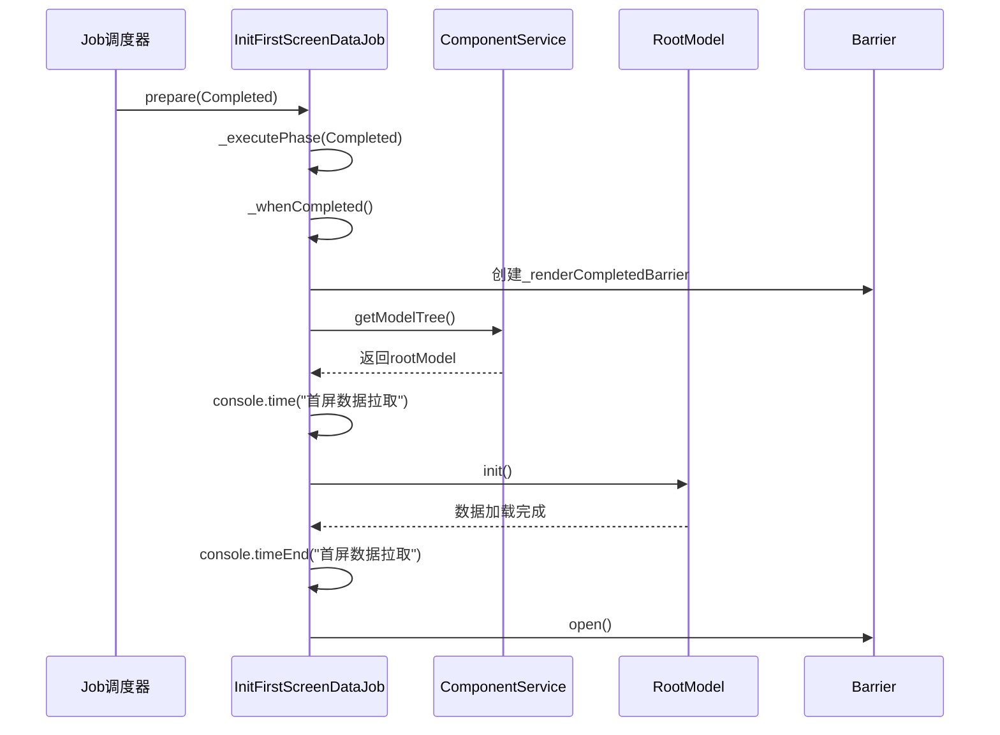
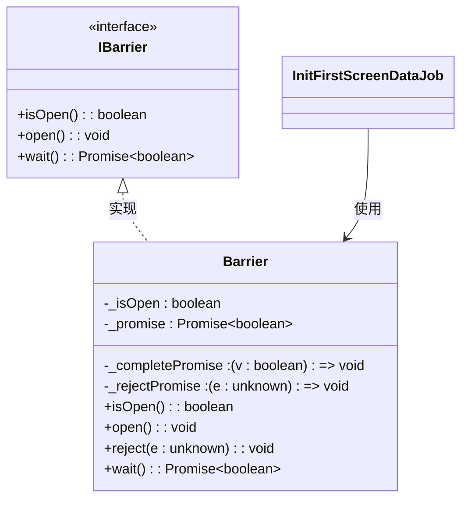
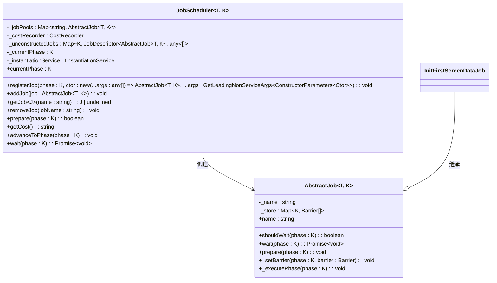
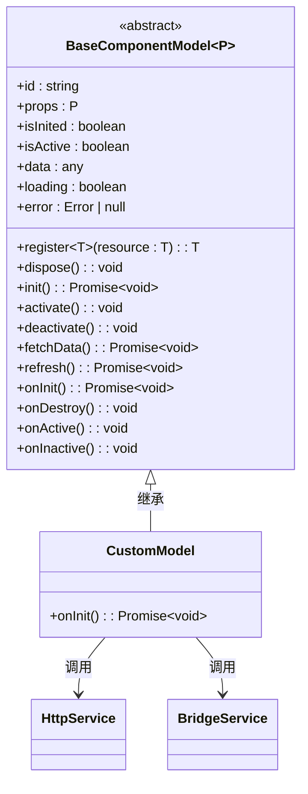

# 首屏数据初始化任务

<cite>
**本文档引用的文件**   
- [init-first-screen-data-job.ts](file://packages/h5-builder/src/jobs/init-first-screen-data-job.ts)
- [component.service.ts](file://packages/h5-builder/src/services/component.service.ts)
- [barrier.ts](file://packages/h5-builder/src/bedrock/async/barrier.ts)
- [job-scheduler.ts](file://packages/h5-builder/src/bedrock/launch/job-scheduler.ts)
- [abstract-job.ts](file://packages/h5-builder/src/bedrock/launch/abstract-job.ts)
- [model.ts](file://packages/h5-builder/src/bedrock/model.ts)
- [lifecycle.ts](file://packages/h5-builder/src/jobs/lifecycle.ts)
- [service-identifiers.ts](file://packages/h5-builder/src/services/service-identifiers.ts)
</cite>

## 目录
1. [引言](#引言)
2. [核心机制分析](#核心机制分析)
3. [Barrier同步机制](#barrier同步机制)
4. [组件服务与模型树获取](#组件服务与模型树获取)
5. [Job调度与依赖注入](#job调度与依赖注入)
6. [性能监控与异常处理](#性能监控与异常处理)
7. [扩展与集成自定义数据源](#扩展与集成自定义数据源)
8. [结论](#结论)

## 引言

`InitFirstScreenDataJob` 是页面生命周期中的关键任务，负责在 `Completed` 阶段完成首屏数据的初始化工作。该任务通过 `Barrier` 同步机制确保数据加载的完整性，利用 `ComponentService` 获取已构建的模型树，并调用 `rootModel.init()` 方法拉取关键业务数据。本文档将深入分析该任务的实现机制、与 `JobScheduler` 的调度关系、依赖注入容器中的注册方式，以及如何通过性能监控和异常处理保障数据加载的可靠性。

**Section sources**
- [init-first-screen-data-job.ts](file://packages/h5-builder/src/jobs/init-first-screen-data-job.ts#L1-L67)

## 核心机制分析

`InitFirstScreenDataJob` 继承自 `AbstractJob`，在页面生命周期的 `Completed` 阶段执行 `_whenCompleted` 方法。该方法首先通过 `Barrier` 机制创建一个同步屏障，确保数据加载过程的完整性。随后，通过 `ComponentService` 的 `getModelTree` 方法获取根模型实例 `rootModel`。如果 `rootModel` 存在，则启动数据拉取流程，通过 `console.time` 进行性能监控，并在数据加载完成后打开 `Barrier`，通知系统首屏数据已准备就绪。



**Diagram sources **
- [init-first-screen-data-job.ts](file://packages/h5-builder/src/jobs/init-first-screen-data-job.ts#L11-L67)
- [component.service.ts](file://packages/h5-builder/src/services/component.service.ts#L754-L758)
- [barrier.ts](file://packages/h5-builder/src/bedrock/async/barrier.ts#L11-L41)

**Section sources**
- [init-first-screen-data-job.ts](file://packages/h5-builder/src/jobs/init-first-screen-data-job.ts#L11-L67)
- [lifecycle.ts](file://packages/h5-builder/src/jobs/lifecycle.ts#L1-L18)

## Barrier同步机制

`Barrier` 是一个同步原语，用于协调异步操作的完成。`InitFirstScreenDataJob` 在 `Completed` 阶段创建一个 `Barrier` 实例，并将其与当前阶段关联。在数据加载过程中，`Barrier` 处于关闭状态，任何等待该 `Barrier` 的操作都将被阻塞。当 `rootModel.init()` 完成后，调用 `Barrier.open()` 方法，将 `Barrier` 状态置为打开，从而释放所有等待的后续操作。这种机制确保了首屏数据加载的原子性和完整性。



**Diagram sources **
- [barrier.ts](file://packages/h5-builder/src/bedrock/async/barrier.ts#L1-L41)
- [init-first-screen-data-job.ts](file://packages/h5-builder/src/jobs/init-first-screen-data-job.ts#L14-L15)

**Section sources**
- [barrier.ts](file://packages/h5-builder/src/bedrock/async/barrier.ts#L1-L41)
- [init-first-screen-data-job.ts](file://packages/h5-builder/src/jobs/init-first-screen-data-job.ts#L50-L63)

## 组件服务与模型树获取

`ComponentService` 是组件管理的核心服务，负责组件的注册、加载和构建。`InitFirstScreenDataJob` 通过依赖注入获取 `ComponentService` 实例，并调用其 `getModelTree()` 方法获取已构建的模型树。该模型树是一个由 `BaseComponentModel` 和 `BaseContainerModel` 构成的树形结构，代表了页面的逻辑结构。`InitFirstScreenDataJob` 获取根模型后，通过调用 `rootModel.init()` 方法触发整个模型树的初始化流程，从而拉取所有关键业务数据。

```mermaid
classDiagram
class ComponentService {
-registry : ComponentRegistry
-_modelTree : BaseComponentModel | null
-_loadingResult : {modelTreeReady : Promise~void~, viewsReady : Promise~void~} | null
+register(type : string, ModelClass : any) : void
+registerAll(components : Record~string, any~) : void
+buildTree(schema : ComponentSchema) : BaseComponentModel
+createModel(schema : ComponentSchema) : BaseComponentModel
+buildChildren(parent : BaseContainerModel, childrenSchemas : ComponentSchema[]) : void
+validateSchema(schema : ComponentSchema) : void
+createErrorPlaceholder(schema : ComponentSchema, error : Error) : BaseComponentModel
+getModelTree() : BaseComponentModel | null
}
class ComponentRegistry {
-registry : Map~string, any~
+register(type : string, ModelClass : any) : void
+registerAll(components : Record~string, any~) : void
+get(type : string) : any | undefined
+has(type : string) : boolean
+getRegisteredTypes() : string[]
}
ComponentService --> ComponentRegistry : 使用
InitFirstScreenDataJob --> ComponentService : 依赖注入
```

**Diagram sources **
- [component.service.ts](file://packages/h5-builder/src/services/component.service.ts#L95-L758)
- [init-first-screen-data-job.ts](file://packages/h5-builder/src/jobs/init-first-screen-data-job.ts#L17-L18)

**Section sources**
- [component.service.ts](file://packages/h5-builder/src/services/component.service.ts#L95-L758)
- [init-first-screen-data-job.ts](file://packages/h5-builder/src/jobs/init-first-screen-data-job.ts#L17-L18)

## Job调度与依赖注入

`InitFirstScreenDataJob` 由 `JobScheduler` 调度执行。`JobScheduler` 管理着一个任务池，根据页面生命周期的阶段来准备和执行相应的任务。`InitFirstScreenDataJob` 在 `Completed` 阶段被 `JobScheduler` 的 `prepare` 方法触发，进而执行其 `_executePhase` 方法。该任务通过依赖注入容器获取 `ComponentService` 实例，体现了控制反转的设计原则，使得任务与服务之间的耦合度降低，提高了代码的可测试性和可维护性。



**Diagram sources **
- [job-scheduler.ts](file://packages/h5-builder/src/bedrock/launch/job-scheduler.ts#L16-L122)
- [abstract-job.ts](file://packages/h5-builder/src/bedrock/launch/abstract-job.ts#L3-L45)
- [init-first-screen-data-job.ts](file://packages/h5-builder/src/jobs/init-first-screen-data-job.ts#L11-L12)

**Section sources**
- [job-scheduler.ts](file://packages/h5-builder/src/bedrock/launch/job-scheduler.ts#L16-L122)
- [abstract-job.ts](file://packages/h5-builder/src/bedrock/launch/abstract-job.ts#L3-L45)

## 性能监控与异常处理

`InitFirstScreenDataJob` 在数据加载过程中集成了性能监控和异常处理机制。通过 `console.time` 和 `console.timeEnd` 方法，可以精确测量首屏数据拉取的耗时，为性能优化提供数据支持。在异常处理方面，任务首先检查 `rootModel` 是否存在，如果不存在则发出警告并直接打开 `Barrier`，避免系统阻塞。此外，`ComponentService` 和 `BaseComponentModel` 内部也实现了完善的错误处理逻辑，如捕获 `buildTree` 过程中的异常并创建错误占位组件，确保系统在部分组件加载失败时仍能正常运行。

```mermaid
flowchart TD
A[开始执行_whenCompleted] --> B{rootModel是否存在?}
B --> |是| C[启动console.time]
B --> |否| D[console.warn警告]
D --> E[打开Barrier]
C --> F[调用rootModel.init()]
F --> G{init成功?}
G --> |是| H[console.timeEnd]
G --> |否| I[捕获异常]
I --> J[处理异常]
H --> K[打开Barrier]
K --> L[结束]
J --> K
```

**Diagram sources **
- [init-first-screen-data-job.ts](file://packages/h5-builder/src/jobs/init-first-screen-data-job.ts#L53-L63)
- [component.service.ts](file://packages/h5-builder/src/services/component.service.ts#L150-L153)
- [model.ts](file://packages/h5-builder/src/bedrock/model.ts#L64-L73)

**Section sources**
- [init-first-screen-data-job.ts](file://packages/h5-builder/src/jobs/init-first-screen-data-job.ts#L53-L63)
- [component.service.ts](file://packages/h5-builder/src/services/component.service.ts#L150-L153)
- [model.ts](file://packages/h5-builder/src/bedrock/model.ts#L64-L73)

## 扩展与集成自定义数据源

开发者可以通过继承 `InitFirstScreenDataJob` 或在 `rootModel` 的 `onInit` 钩子中集成自定义数据源。例如，可以在 `onInit` 方法中调用 `HttpService` 发起网络请求，或从 `BridgeService` 获取原生数据。通过 `register` 方法，可以将定时器、事件监听器等资源注册到 `DisposableStore` 中，确保在组件销毁时自动清理，避免内存泄漏。



**Diagram sources **
- [model.ts](file://packages/h5-builder/src/bedrock/model.ts#L10-L155)
- [service-identifiers.ts](file://packages/h5-builder/src/services/service-identifiers.ts#L1-L20)

**Section sources**
- [model.ts](file://packages/h5-builder/src/bedrock/model.ts#L10-L155)
- [service-identifiers.ts](file://packages/h5-builder/src/services/service-identifiers.ts#L1-L20)

## 结论

`InitFirstScreenDataJob` 是一个精心设计的任务，通过 `Barrier` 同步机制、`ComponentService` 模型树管理和 `JobScheduler` 调度框架，实现了首屏数据的高效、可靠初始化。其清晰的职责划分、完善的性能监控和异常处理机制，以及良好的扩展性，为构建高性能的前端应用提供了坚实的基础。开发者可以基于此机制，轻松集成自定义数据源，满足多样化的业务需求。