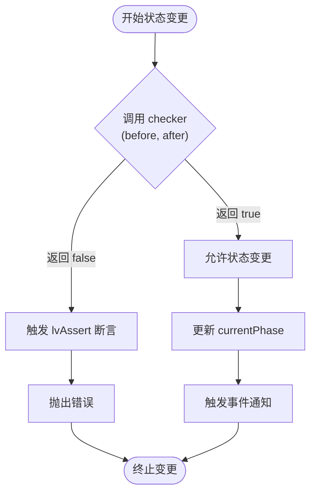
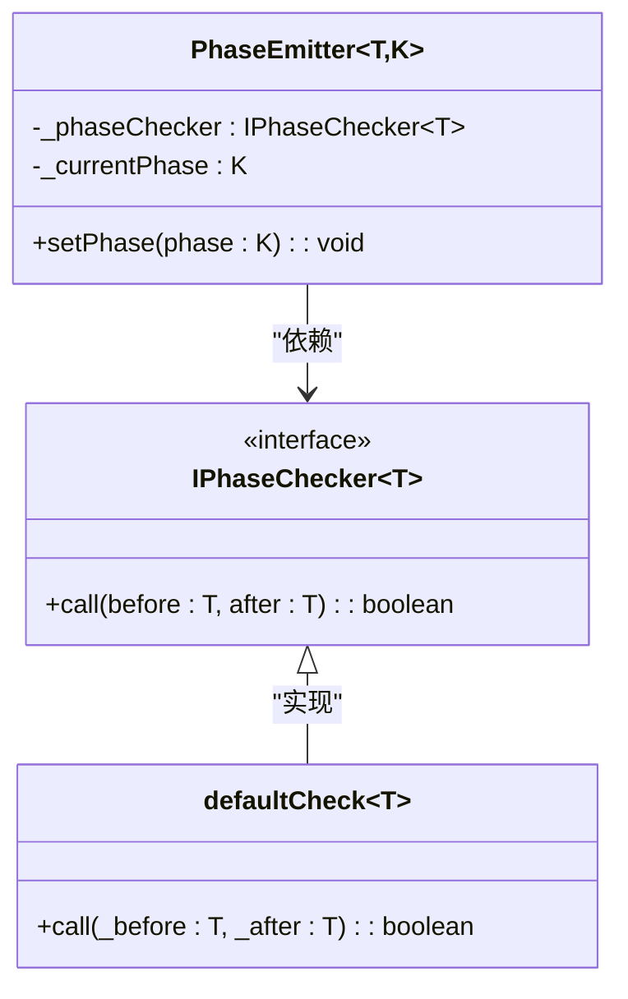
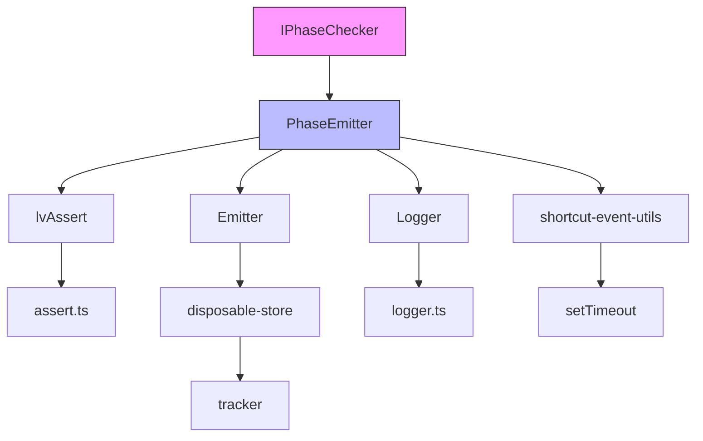

# IPhaseChecker 状态校验器

<cite>
**本文档引用的文件**  
- [phase-emitter.ts](file://packages/h5-builder/src/bedrock/event/phase-emitter.ts)
- [assert.ts](file://packages/h5-builder/src/bedrock/assert/assert.ts)
- [emitter.ts](file://packages/h5-builder/src/bedrock/event/emitter.ts)
- [shortcut-event-utils.ts](file://packages/h5-builder/src/bedrock/event/shortcut-event-utils.ts)
- [logger.ts](file://packages/h5-builder/src/bedrock/_internal/logger.ts)
- [error-handler.ts](file://packages/h5-builder/src/bedrock/event/error-handler.ts)
- [disposable-t.ts](file://packages/h5-builder/src/bedrock/dispose/disposable-t.ts)
- [disposable-store.ts](file://packages/h5-builder/src/bedrock/dispose/disposable-store.ts)
- [tracker.ts](file://packages/h5-builder/src/bedrock/dispose/tracker.ts)
</cite>

## 目录
1. [简介](#简介)
2. [核心组件](#核心组件)
3. [IPhaseChecker 设计目的](#iphasechecker-设计目的)
4. [PhaseEmitter 中的状态校验机制](#phaseemitter-中的状态校验机制)
5. [defaultCheck 函数实现分析](#defaultcheck-函数实现分析)
6. [自定义 Checker 实现示例](#自定义-checker-实现示例)
7. [断言失败处理与调试建议](#断言失败处理与调试建议)
8. [依赖关系分析](#依赖关系分析)

## 简介
`IPhaseChecker` 是一个用于控制状态迁移合法性的接口，配合 `PhaseEmitter` 实现状态机的安全跃迁。该机制通过校验函数阻止非法状态跳转，确保系统状态流转符合预定义规则。本文档详细解析其设计原理、实现机制及使用方式。

## 核心组件

**Section sources**
- [phase-emitter.ts](file://packages/h5-builder/src/bedrock/event/phase-emitter.ts#L11-L210)
- [assert.ts](file://packages/h5-builder/src/bedrock/assert/assert.ts#L1-L43)

## IPhaseChecker 设计目的

`IPhaseChecker<T>` 接口定义了一个类型为 `(before: T, after: T) => boolean` 的函数类型，其核心设计目的是在状态变更前进行合法性校验。当调用 `PhaseEmitter.setPhase()` 时，会通过该校验器判断是否允许从当前状态 `before` 跳转到目标状态 `after`。

这种设计实现了以下关键能力：
- **防止非法跳转**：阻止不符合业务逻辑的状态迁移（如从“就绪”回退到“等待”）
- **支持单向状态机**：可实现 Waiting → Loading → Ready 这类不可逆流程
- **灵活扩展**：通过注入不同校验函数适配多种状态机模型
- **运行时保护**：结合断言机制在开发期暴露状态流转错误



**Diagram sources**
- [phase-emitter.ts](file://packages/h5-builder/src/bedrock/event/phase-emitter.ts#L178-L187)

## PhaseEmitter 中的状态校验机制

`PhaseEmitter` 类通过 `setPhase(phase: K)` 方法实现状态迁移，并在其中集成 `IPhaseChecker` 的校验逻辑。其核心流程如下：

1. 检查是否为重复状态设置，若是则发出警告
2. 调用 `_phaseChecker(this._currentPhase, phase)` 进行合法性校验
3. 若校验通过，则更新当前状态并触发相应事件
4. 若校验失败，则通过 `lvAssert` 抛出异常

关键代码路径位于 `setPhase` 方法中，通过 `lvAssert(this._phaseChecker(this._currentPhase, phase))` 确保每次状态变更都经过校验。此机制将状态迁移的控制权交给外部注入的 `checker` 函数，实现了高度可配置的状态管理策略。

```mermaid
sequenceDiagram
participant Client as "客户端"
participant PhaseEmitter as "PhaseEmitter"
participant Checker as "IPhaseChecker"
Client->>PhaseEmitter : setPhase(新状态)
PhaseEmitter->>PhaseEmitter : 检查是否重复状态
alt 是重复状态
PhaseEmitter-->>Client : 输出警告日志
deactivate PhaseEmitter
else 非重复状态
PhaseEmitter->>Checker : checker(原状态, 新状态)
Checker-->>PhaseEmitter : 返回 boolean
alt 校验通过
PhaseEmitter->>PhaseEmitter : 更新 currentPhase
PhaseEmitter->>PhaseEmitter : 触发事件通知
else 校验失败
PhaseEmitter->>PhaseEmitter : lvAssert 失败
PhaseEmitter-->>Client : 抛出异常
end
end
```

**Diagram sources**
- [phase-emitter.ts](file://packages/h5-builder/src/bedrock/event/phase-emitter.ts#L178-L187)

**Section sources**
- [phase-emitter.ts](file://packages/h5-builder/src/bedrock/event/phase-emitter.ts#L178-L187)

## defaultCheck 函数实现分析

`defaultCheck<T>(_before: T, _after: T)` 是 `IPhaseChecker` 的默认实现，其函数体始终返回 `true`，表示允许任意状态之间的迁移。该函数作为 `PhaseEmitter` 构造函数中的默认参数，确保在未提供自定义校验器时系统仍能正常工作。

这一设计体现了“最小侵入性”原则：
- **默认开放**：不强制用户必须定义状态规则
- **易于迁移**：旧代码无需修改即可使用 `PhaseEmitter`
- **渐进增强**：可在后期逐步添加状态约束

该函数在 `PhaseEmitter` 构造时被赋值给 `_phaseChecker` 成员变量，若用户未提供 `config.checker`，则使用此默认实现。



**Diagram sources**
- [phase-emitter.ts](file://packages/h5-builder/src/bedrock/event/phase-emitter.ts#L15-L17)
- [phase-emitter.ts](file://packages/h5-builder/src/bedrock/event/phase-emitter.ts#L121-L124)

**Section sources**
- [phase-emitter.ts](file://packages/h5-builder/src/bedrock/event/phase-emitter.ts#L15-L17)

## 自定义 checker 实现示例

以下为几种典型业务场景下的自定义 `checker` 实现：

### 单向状态机（Waiting → Loading → Ready）
```typescript
const forwardOnlyChecker = (before: Phase, after: Phase) => {
  return after >= before; // 仅允许向前迁移
};
```

### 禁止回退状态机
```typescript
const noBackwardChecker = (before: Phase, after: Phase) => {
  const phaseOrder = [Phase.Waiting, Phase.Loading, Phase.Ready];
  return phaseOrder.indexOf(after) >= phaseOrder.indexOf(before);
};
```

### 指定路径迁移
```typescript
const strictPathChecker = (before: Phase, after: Phase) => {
  const allowedTransitions = new Map([
    [Phase.Waiting, [Phase.Loading]],
    [Phase.Loading, [Phase.Ready]],
    [Phase.Ready, []]
  ]);
  return allowedTransitions.get(before)?.includes(after) || false;
};
```

这些自定义校验器可通过 `PhaseEmitter` 构造函数的 `config.checker` 参数注入，从而实现精细化的状态控制。

**Section sources**
- [phase-emitter.test.ts](file://packages/h5-builder/src/bedrock/event/phase-emitter.test.ts#L198-L209)

## 断言失败处理与调试建议

当 `IPhaseChecker` 返回 `false` 时，`lvAssert` 将触发断言失败并抛出异常。具体流程如下：

1. `lvAssert(expr)` 检查表达式结果
2. 若为 `false`，调用 `abort(reason)` 抛出带有上下文信息的 `Error`
3. 错误信息格式为 `lvAssert(${reason})`，便于定位问题

调试建议：
- **查看调用栈**：利用浏览器或 Node.js 的堆栈追踪定位非法状态变更源头
- **启用日志**：通过 `Logger.warn` 查看重复状态设置等非致命问题
- **单元测试覆盖**：编写测试用例验证所有可能的状态迁移路径
- **开发环境强化**：在开发模式下启用严格校验，在生产环境可适当放宽

错误示例：
```
Error: lvAssert(#expr is false)
    at abort (assert.ts:2)
    at lvAssert (assert.ts:12)
    at PhaseEmitter.setPhase (phase-emitter.ts:183)
```

此错误表明尝试进行了非法状态跳转，需检查校验函数逻辑及调用上下文。

```mermaid
flowchart LR
A[调用 setPhase] --> B{checker 返回 true?}
B --> |是| C[正常执行]
B --> |否| D[lvAssert(expr)]
D --> E{expr 为 true?}
E --> |是| F[继续执行]
E --> |否| G[throw new Error]
G --> H[中断程序]
C --> I[完成状态变更]
```

**Diagram sources**
- [assert.ts](file://packages/h5-builder/src/bedrock/assert/assert.ts#L1-L14)
- [phase-emitter.ts](file://packages/h5-builder/src/bedrock/event/phase-emitter.ts#L183)

**Section sources**
- [assert.ts](file://packages/h5-builder/src/bedrock/assert/assert.ts#L1-L14)

## 依赖关系分析

`IPhaseChecker` 及其相关组件形成了清晰的依赖链：



关键依赖说明：
- **断言系统**：依赖 `lvAssert` 实现运行时检查
- **事件系统**：基于 `Emitter` 构建事件通知机制
- **资源管理**：通过 `DisposableStore` 管理监听器生命周期
- **日志系统**：使用 `Logger` 输出警告信息
- **异步控制**：利用 `setTimeout` 实现异步快捷事件

这些依赖共同支撑了安全、可靠的状态迁移机制。

**Diagram sources**
- [phase-emitter.ts](file://packages/h5-builder/src/bedrock/event/phase-emitter.ts#L1-L210)
- [disposable-store.ts](file://packages/h5-builder/src/bedrock/dispose/disposable-store.ts#L1-L84)
- [tracker.ts](file://packages/h5-builder/src/bedrock/dispose/tracker.ts#L1-L106)

**Section sources**
- [phase-emitter.ts](file://packages/h5-builder/src/bedrock/event/phase-emitter.ts#L1-L210)
- [disposable-store.ts](file://packages/h5-builder/src/bedrock/dispose/disposable-store.ts#L1-L84)