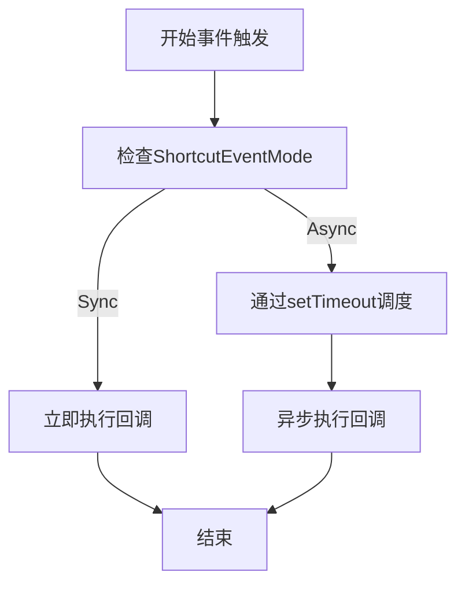
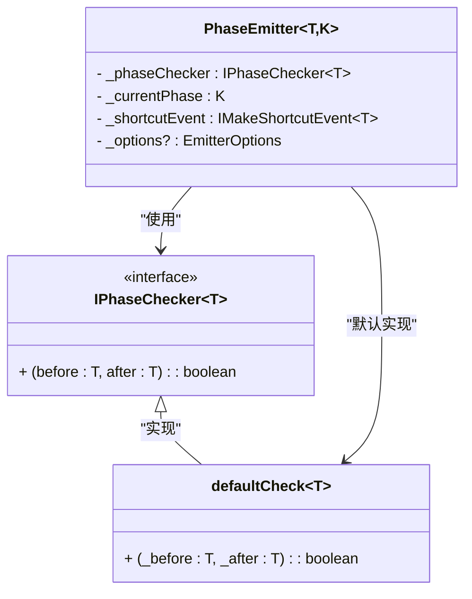

# PhaseEmitter 构造函数

<cite>
**本文档中引用的文件**   
- [phase-emitter.ts](file://packages/h5-builder/src/bedrock/event/phase-emitter.ts)
- [phase-emitter.test.ts](file://packages/h5-builder/src/bedrock/event/phase-emitter.test.ts)
- [shortcut-event-utils.ts](file://packages/h5-builder/src/bedrock/event/shortcut-event-utils.ts)
- [emitter.ts](file://packages/h5-builder/src/bedrock/event/emitter.ts)
- [assert.ts](file://packages/h5-builder/src/bedrock/assert/assert.ts)
- [product-card.model.ts](file://packages/h5-builder/src/components/product-card/product-card.model.ts)
</cite>

## 目录
1. [构造函数参数详解](#构造函数参数详解)
2. [IPhaseChecker状态迁移约束机制](#iphasechecker状态迁移约束机制)
3. [ShortcutEventMode同步/异步模式影响](#shortcuteventmode同步异步模式影响)
4. [配置项定制行为示例](#配置项定制行为示例)
5. [默认check函数设计原理](#默认check函数设计原理)
6. [综合应用示例](#综合应用示例)

## 构造函数参数详解

PhaseEmitter类的构造函数接收四个核心参数，分别用于初始化状态、配置行为、约束状态迁移和传递选项。

**Section sources**
- [phase-emitter.ts](file://packages/h5-builder/src/bedrock/event/phase-emitter.ts#L118-L129)

## IPhaseChecker状态迁移约束机制

IPhaseChecker接口定义了状态迁移的校验规则，通过断言机制确保状态转换的合法性。当设置新状态时，会调用_phaseChecker进行验证，若不符合预设规则则抛出异常。

**Section sources**
- [phase-emitter.ts](file://packages/h5-builder/src/bedrock/event/phase-emitter.ts#L183)
- [phase-emitter.test.ts](file://packages/h5-builder/src/bedrock/event/phase-emitter.test.ts#L197-L209)

## ShortcutEventMode同步/异步模式影响

ShortcutEventMode枚举定义了事件触发的两种模式：同步(Sync)和异步(Async)。同步模式立即执行回调，异步模式通过setTimeout实现延迟执行，避免阻塞当前调用栈。

**Diagram sources**
- [shortcut-event-utils.ts](file://packages/h5-builder/src/bedrock/event/shortcut-event-utils.ts#L8-L32)
- [phase-emitter.ts](file://packages/h5-builder/src/bedrock/event/phase-emitter.ts#L126-L128)

## 配置项定制行为示例

通过IPhaseEmitterConfig配置对象，可以自定义PhaseEmitter的行为，包括状态检查器和事件执行模式。配置项支持灵活组合，满足不同场景需求。

**Section sources**
- [phase-emitter.ts](file://packages/h5-builder/src/bedrock/event/phase-emitter.ts#L45-L48)
- [phase-emitter.test.ts](file://packages/h5-builder/src/bedrock/event/phase-emitter.test.ts#L17-L20)

## 默认check函数设计原理

defaultCheck函数作为默认的状态检查器，允许任意状态迁移。这种设计提供了最大的灵活性，同时为需要严格约束的场景留出了自定义检查器的扩展空间。

**Diagram sources**
- [phase-emitter.ts](file://packages/h5-builder/src/bedrock/event/phase-emitter.ts#L15-L17)
- [phase-emitter.ts](file://packages/h5-builder/src/bedrock/event/phase-emitter.ts#L121)

## 综合应用示例

PhaseEmitter在实际组件中的应用展示了其强大的状态管理能力。通过合理配置，可以实现复杂的状态迁移逻辑和事件响应机制。

**Section sources**
- [product-card.model.ts](file://packages/h5-builder/src/components/product-card/product-card.model.ts)
- [phase-emitter.test.ts](file://packages/h5-builder/src/bedrock/event/phase-emitter.test.ts#L10-L34)