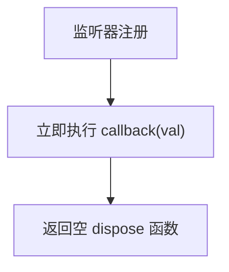
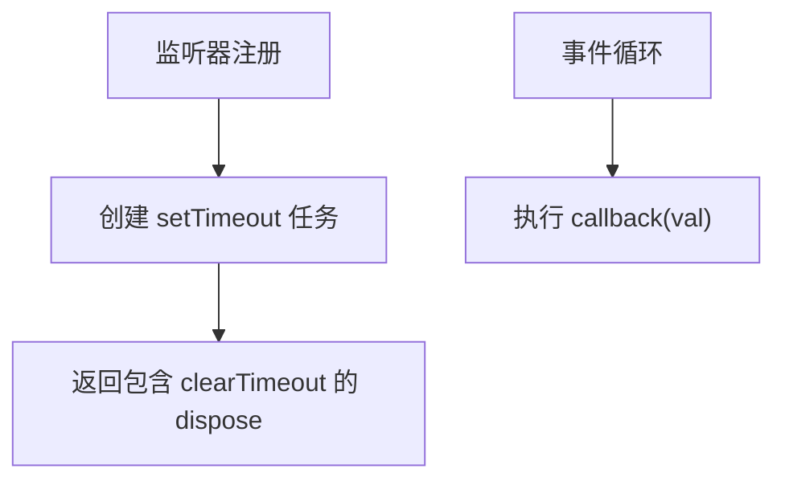
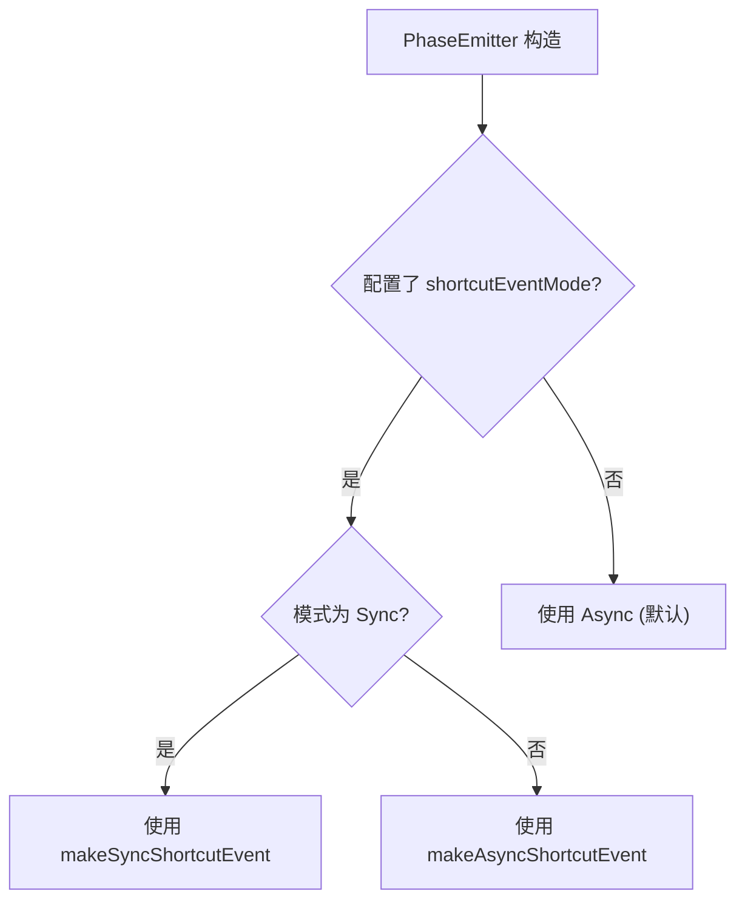

# 快捷事件模式（Sync/Async）

<cite>
**本文档引用的文件**
- [shortcut-event-utils.ts](file://packages/h5-builder/src/bedrock/event/shortcut-event-utils.ts)
- [phase-emitter.ts](file://packages/h5-builder/src/bedrock/event/phase-emitter.ts)
- [index.ts](file://packages/h5-builder/src/bedrock/event/index.ts)
</cite>

## 目录
1. [简介](#简介)
2. [核心组件](#核心组件)
3. [同步与异步模式对比](#同步与异步模式对比)
4. [实现机制分析](#实现机制分析)
5. [实际应用场景](#实际应用场景)
6. [风险与最佳实践](#风险与最佳实践)
7. [结论](#结论)

## 简介
`ShortcutEventMode` 枚举定义了事件触发的两种模式：同步（Sync）和异步（Async）。该机制主要用于 `PhaseEmitter` 中，当监听器注册时，若目标状态已达成，则通过“事件补发”机制立即或延迟通知监听器。这种设计简化了状态依赖处理逻辑，但也引入了执行时机和调用栈深度的差异，需谨慎选择使用模式。

**Section sources**
- [phase-emitter.ts](file://packages/h5-builder/src/bedrock/event/phase-emitter.ts#L39-L43)

## 核心组件

`ShortcutEventMode` 枚举、`makeSyncShortcutEvent` 和 `makeAsyncShortcutEvent` 函数共同构成了快捷事件系统的核心。`PhaseEmitter` 在配置中接受 `shortcutEventMode` 参数，决定事件补发时的执行策略。

**Section sources**
- [phase-emitter.ts](file://packages/h5-builder/src/bedrock/event/phase-emitter.ts#L40-L48)
- [shortcut-event-utils.ts](file://packages/h5-builder/src/bedrock/event/shortcut-event-utils.ts#L7-L32)

## 同步与异步模式对比

| 特性 | 同步模式 (Sync) | 异步模式 (Async) |
| :--- | :--- | :--- |
| **执行时机** | 监听器注册时立即执行 | 注册后通过 `setTimeout(fn, 0)` 延迟至下一个事件循环执行 |
| **调用栈深度** | 与监听器注册代码处于同一调用栈，可能较深 | 在新的事件循环中执行，调用栈较浅，从全局开始 |
| **性能表现** | 无额外开销，执行最快 | 有微任务调度开销，但避免阻塞当前执行流 |
| **UI 阻塞风险** | 高，若监听器执行耗时，会阻塞渲染 | 低，将执行推迟到浏览器空闲期，保障UI流畅 |
| **依赖响应及时性** | 极高，注册后立即响应 | 延迟一个事件循环周期 |

**Section sources**
- [shortcut-event-utils.ts](file://packages/h5-builder/src/bedrock/event/shortcut-event-utils.ts#L8-L32)
- [phase-emitter.ts](file://packages/h5-builder/src/bedrock/event/phase-emitter.ts#L125-L128)

## 实现机制分析

### 同步模式实现
`makeSyncShortcutEvent` 创建的事件在监听器注册的瞬间，立即调用回调函数 `callback(val)`。这保证了依赖关系的即时响应，但要求调用栈上下文稳定，且不能容忍长时间运行的操作。



**Diagram sources**
- [shortcut-event-utils.ts](file://packages/h5-builder/src/bedrock/event/shortcut-event-utils.ts#L8-L17)

### 异步模式实现
`makeAsyncShortcutEvent` 使用 `setTimeout(fn, 0)` 将回调执行推入事件队列。这利用了 JavaScript 的事件循环机制，在当前执行栈清空后执行，有效解耦了事件触发与监听逻辑。



**Diagram sources**
- [shortcut-event-utils.ts](file://packages/h5-builder/src/bedrock/event/shortcut-event-utils.ts#L20-L31)

### 模式选择逻辑
`PhaseEmitter` 在构造时根据配置决定使用哪种模式。若未指定，则默认使用异步模式，体现了对稳定性和性能的优先考量。



**Diagram sources**
- [phase-emitter.ts](file://packages/h5-builder/src/bedrock/event/phase-emitter.ts#L125-L128)

## 实际应用场景

### 使用同步模式的场景
在应用初始化阶段，某些核心模块必须在其他模块启动前完成准备。使用同步模式可以确保依赖模块在初始化代码中就能收到“已就绪”事件，无需复杂的条件判断。

```typescript
// 示例：初始化阶段确保核心服务就绪
const coreReady = phaseEmitter.when(CorePhase.Ready);
coreReady(() => {
  // 此回调会立即执行，如果核心服务已就绪
  initializeDependentModule();
});
// 后续代码可以安全地假设依赖模块已初始化
```

**Section sources**
- [phase-emitter.ts](file://packages/h5-builder/src/bedrock/event/phase-emitter.ts#L160-L169)

### 使用异步模式的场景
在复杂的UI渲染流程中，如组件树构建或数据加载，使用异步模式可以避免因事件处理而阻塞主线程，导致页面卡顿。将非关键的事件处理延迟执行，能显著提升用户体验。

```typescript
// 示例：在渲染流程中避免阻塞
componentModel.onRenderComplete(() => {
  // 更新分析数据，此操作可能较慢
  analyticsService.trackRender();
  // 使用异步模式，不会阻塞当前渲染帧
});
```

**Section sources**
- [phase-emitter.ts](file://packages/h5-builder/src/bedrock/event/phase-emitter.ts#L147-L155)

## 风险与最佳实践

### 循环依赖风险
同步模式最大的风险是**循环依赖**。如果A模块监听B模块的就绪事件，而B模块的初始化逻辑又依赖A模块，且使用同步模式，那么在A模块注册监听器的瞬间，B模块的就绪事件被立即触发，进而调用A模块的初始化代码，但此时A模块可能尚未完成初始化，导致状态不一致或错误。

**最佳实践建议：**
1.  **默认使用异步模式**：除非有明确的、对时序要求极高的初始化依赖，否则应使用默认的异步模式。
2.  **明确初始化顺序**：对于强依赖关系，应通过明确的初始化函数调用来管理，而非依赖事件补发。
3.  **避免在构造函数中触发事件**：模块应在构造完成后，再通过方法显式触发“就绪”事件，避免在构造过程中因事件补发导致的意外调用。
4.  **充分测试边界情况**：特别是测试当监听器在事件触发后才注册时，两种模式下的行为是否符合预期。

**Section sources**
- [phase-emitter.ts](file://packages/h5-builder/src/bedrock/event/phase-emitter.ts#L58-L70)

## 结论
`ShortcutEventMode` 提供了灵活的事件补发执行策略。同步模式适用于对响应速度要求极高且调用栈简单的初始化场景，而异步模式则更适合于UI交互和复杂流程，以保障应用的流畅性和稳定性。开发者应深刻理解两者的差异，根据具体场景权衡选择，并警惕同步模式带来的循环依赖风险，遵循最佳实践以构建健壮的应用。