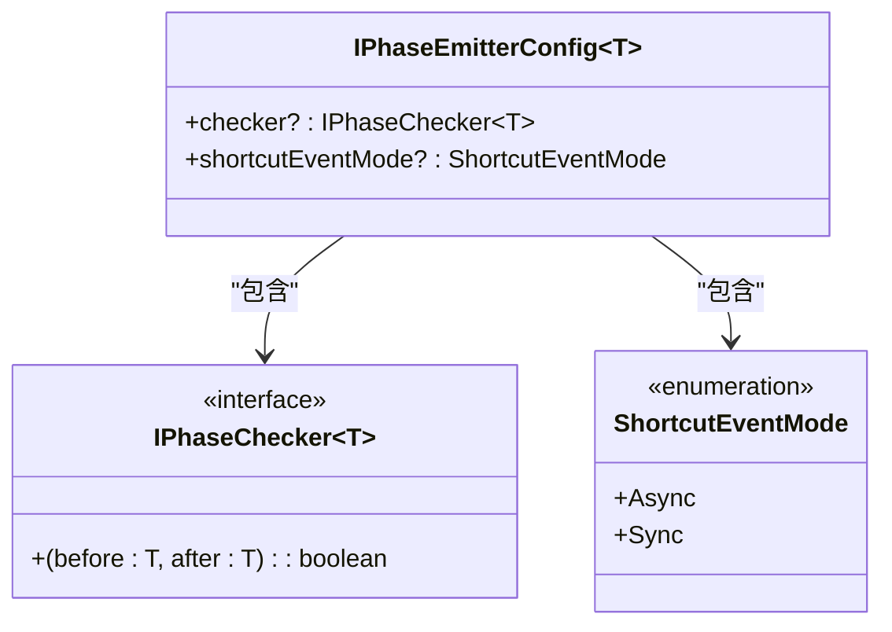
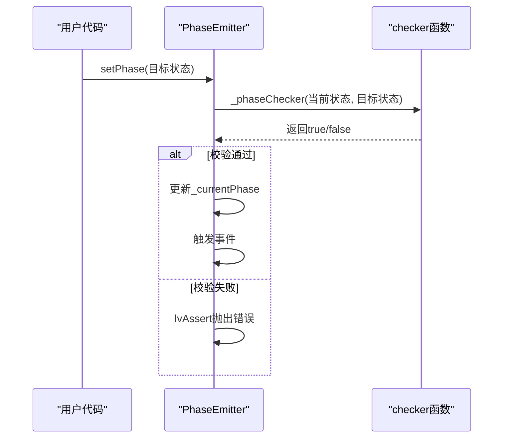
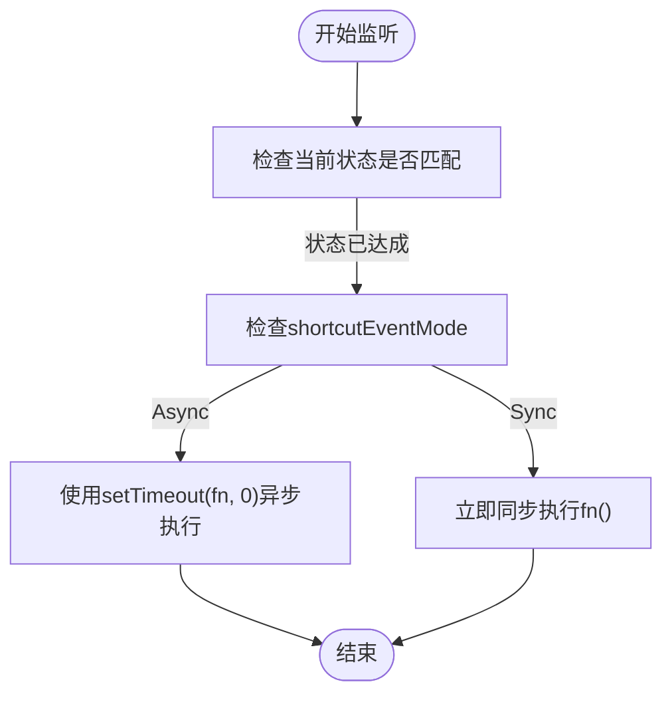
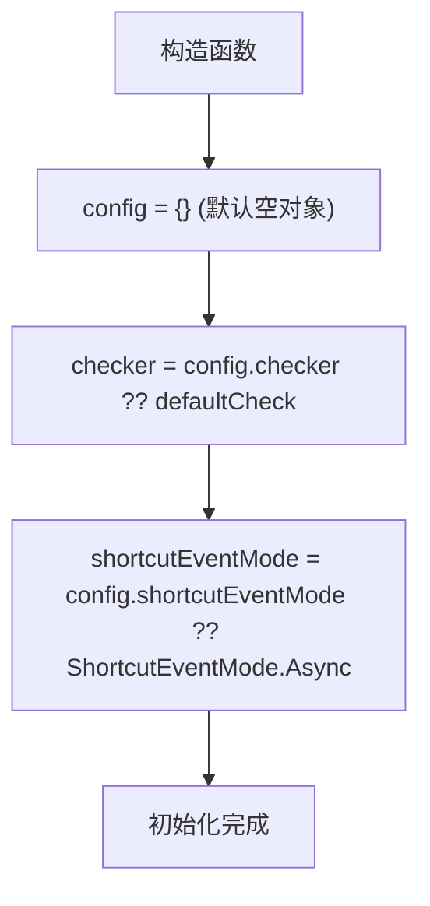

# 构造函数配置项详解

<cite>
**本文档引用文件**  
- [phase-emitter.ts](file://packages/h5-builder/src/bedrock/event/phase-emitter.ts#L1-L209)
- [phase-emitter.test.ts](file://packages/h5-builder/src/bedrock/event/phase-emitter.test.ts#L1-L213)
- [shortcut-event-utils.ts](file://packages/h5-builder/src/bedrock/event/shortcut-event-utils.ts#L1-L34)
- [emitter.ts](file://packages/h5-builder/src/bedrock/event/emitter.ts#L1-L163)
- [logger.ts](file://packages/h5-builder/src/bedrock/_internal/logger.ts#L1-L60)
- [assert.ts](file://packages/h5-builder/src/bedrock/assert/assert.ts#L1-L43)
</cite>

## 目录
1. [简介](#简介)
2. [配置项定义与结构](#配置项定义与结构)
3. [checker配置项详解](#checker配置项详解)
4. [shortcutEventMode配置项详解](#shortcuteventmode配置项详解)
5. [默认值选择策略](#默认值选择策略)
6. [配置合并与空值处理机制](#配置合并与空值处理机制)
7. [使用示例](#使用示例)
8. [配置项对组件行为的影响](#配置项对组件行为的影响)
9. [生产环境推荐配置](#生产环境推荐配置)
10. [结论](#结论)

## 简介
`PhaseEmitter` 是一个用于管理状态阶段转换的事件触发器，支持状态补发机制，适用于生命周期管理等场景。其构造函数接受一个可选的 `config` 对象，用于定制化行为。本文档深入解析 `config` 对象中的 `checker` 和 `shortcutEventMode` 配置项，说明其优先级处理逻辑、默认值策略、空值判断与默认赋值机制，并提供多种配置组合的使用示例。

## 配置项定义与结构

`PhaseEmitter` 的配置对象 `IPhaseEmitterConfig<T>` 定义了两个可选配置项：`checker` 和 `shortcutEventMode`。



**图示来源**  
- [phase-emitter.ts](file://packages/h5-builder/src/bedrock/event/phase-emitter.ts#L45-L48)

**本节来源**  
- [phase-emitter.ts](file://packages/h5-builder/src/bedrock/event/phase-emitter.ts#L45-L48)

## checker配置项详解

`checker` 是一个类型为 `IPhaseChecker<T>` 的函数，用于在状态转换时进行合法性校验。它接收两个参数：`before`（当前状态）和 `after`（目标状态），返回一个布尔值表示转换是否允许。

当调用 `setPhase` 方法进行状态转换时，`PhaseEmitter` 会调用 `this._phaseChecker(this._currentPhase, phase)` 进行校验。如果校验失败，`lvAssert` 断言将抛出错误，阻止非法状态转换。



**图示来源**  
- [phase-emitter.ts](file://packages/h5-builder/src/bedrock/event/phase-emitter.ts#L183)
- [assert.ts](file://packages/h5-builder/src/bedrock/assert/assert.ts#L10-L13)

**本节来源**  
- [phase-emitter.ts](file://packages/h5-builder/src/bedrock/event/phase-emitter.ts#L183)
- [phase-emitter.test.ts](file://packages/h5-builder/src/bedrock/event/phase-emitter.test.ts#L198-L209)

## shortcutEventMode配置项详解

`shortcutEventMode` 是一个枚举类型 `ShortcutEventMode`，用于控制状态补发事件的执行模式，支持 `Async` 和 `Sync` 两种模式。

- **Async模式**：使用 `setTimeout(fn, 0)` 将回调函数放入异步队列，延迟执行。
- **Sync模式**：立即同步执行回调函数。

该配置项决定了 `when` 和 `whenPhase` 方法在监听到已达成状态时，如何执行监听器回调。



**图示来源**  
- [phase-emitter.ts](file://packages/h5-builder/src/bedrock/event/phase-emitter.ts#L126-L128)
- [shortcut-event-utils.ts](file://packages/h5-builder/src/bedrock/event/shortcut-event-utils.ts#L8-L32)

**本节来源**  
- [phase-emitter.ts](file://packages/h5-builder/src/bedrock/event/phase-emitter.ts#L126-L128)
- [shortcut-event-utils.ts](file://packages/h5-builder/src/bedrock/event/shortcut-event-utils.ts#L8-L32)

## 默认值选择策略

当 `config` 对象未提供时，`PhaseEmitter` 构造函数会使用默认值策略为配置项赋值。

- **checker**：若 `config.checker` 未提供，则使用内置的 `defaultCheck` 函数，该函数始终返回 `true`，允许所有状态转换。
- **shortcutEventMode**：若 `config.shortcutEventMode` 未提供，则默认使用 `ShortcutEventMode.Async` 模式。

这种默认值策略确保了组件在最简配置下仍能正常工作，同时提供了足够的灵活性供高级用户定制。



**图示来源**  
- [phase-emitter.ts](file://packages/h5-builder/src/bedrock/event/phase-emitter.ts#L124-L128)

**本节来源**  
- [phase-emitter.ts](file://packages/h5-builder/src/bedrock/event/phase-emitter.ts#L124-L128)

## 配置合并与空值处理机制

`PhaseEmitter` 构造函数通过空值合并操作符 (`??`) 实现配置合并与空值处理。这是一种简洁且安全的模式，确保了即使传入 `null` 或 `undefined`，也能正确回退到默认值。

核心逻辑如下：
1. `this._phaseChecker = config.checker ?? defaultCheck;`
2. `const shortcutEventMode = config.shortcutEventMode ?? ShortcutEventMode.Async;`

这种机制避免了显式的 `if` 判断，使代码更加简洁。同时，由于 `??` 操作符仅在左侧为 `null` 或 `undefined` 时才取右侧值，因此不会错误地将 `false` 或 `0` 等有效值替换为默认值。

**本节来源**  
- [phase-emitter.ts](file://packages/h5-builder/src/bedrock/event/phase-emitter.ts#L124-L128)

## 使用示例

### 仅启用状态检查
此配置用于确保状态转换遵循特定规则，例如只能向前转换。

```typescript
const phaseEmitter = new PhaseEmitter<Phase>(Phase.Aaa, {
  checker: (before, after) => after > before // 只允许状态递增
});
```

**本节来源**  
- [phase-emitter.test.ts](file://packages/h5-builder/src/bedrock/event/phase-emitter.test.ts#L198-L209)

### 仅修改执行模式
此配置用于改变状态补发的执行时机，适用于对执行顺序有严格要求的场景。

```typescript
const phaseEmitter = new PhaseEmitter<Phase>(Phase.Aaa, {
  shortcutEventMode: ShortcutEventMode.Sync // 立即同步执行
});
```

**本节来源**  
- [phase-emitter.ts](file://packages/h5-builder/src/bedrock/event/phase-emitter.ts#L126-L128)

### 同时定制检查器和执行模式
此配置结合了状态检查和执行模式控制，提供最完整的定制能力。

```typescript
const phaseEmitter = new PhaseEmitter<Phase>(Phase.Aaa, {
  checker: (before, after) => after !== Phase.Ccc, // 禁止进入Ccc状态
  shortcutEventMode: ShortcutEventMode.Sync // 立即执行
});
```

**本节来源**  
- [phase-emitter.ts](file://packages/h5-builder/src/bedrock/event/phase-emitter.ts#L124-L128)

## 配置项对组件行为的影响

配置项的选择对 `PhaseEmitter` 的行为有全局性影响：

- **checker**：影响状态转换的安全性。宽松的检查器（如默认值）可能导致意外的状态转换，而严格的检查器可以防止逻辑错误，但也可能增加调试难度。
- **shortcutEventMode**：影响事件处理的时序。`Async` 模式更符合事件驱动的异步编程模型，避免阻塞当前调用栈；`Sync` 模式则能立即响应，但可能引发意外的同步副作用。

选择合适的配置是确保组件稳定性和可预测性的关键。

**本节来源**  
- [phase-emitter.ts](file://packages/h5-builder/src/bedrock/event/phase-emitter.ts#L124-L128)
- [phase-emitter.test.ts](file://packages/h5-builder/src/bedrock/event/phase-emitter.test.ts#L198-L209)

## 生产环境推荐配置

在生产环境中，建议根据具体场景谨慎选择配置：

- **默认配置**：对于大多数场景，使用默认配置（`checker` 允许所有转换，`shortcutEventMode` 为 `Async`）是安全且高效的。
- **严格状态检查**：在关键业务流程中，应定义明确的 `checker` 函数，防止非法状态转换，提高系统健壮性。
- **谨慎使用Sync模式**：除非有明确的性能或时序要求，否则应避免使用 `Sync` 模式，以防止潜在的同步问题和调用栈溢出。

始终在测试环境中充分验证配置变更的影响。

**本节来源**  
- [phase-emitter.ts](file://packages/h5-builder/src/bedrock/event/phase-emitter.ts#L124-L128)
- [phase-emitter.test.ts](file://packages/h5-builder/src/bedrock/event/phase-emitter.test.ts#L198-L209)

## 结论
`PhaseEmitter` 的构造函数配置项设计简洁而强大。通过 `checker` 和 `shortcutEventMode` 两个可选配置，开发者可以灵活控制状态转换的合法性校验和事件执行模式。默认值策略和空值处理机制确保了组件的易用性和健壮性。理解这些配置项的工作原理和影响，对于正确使用 `PhaseEmitter` 至关重要。