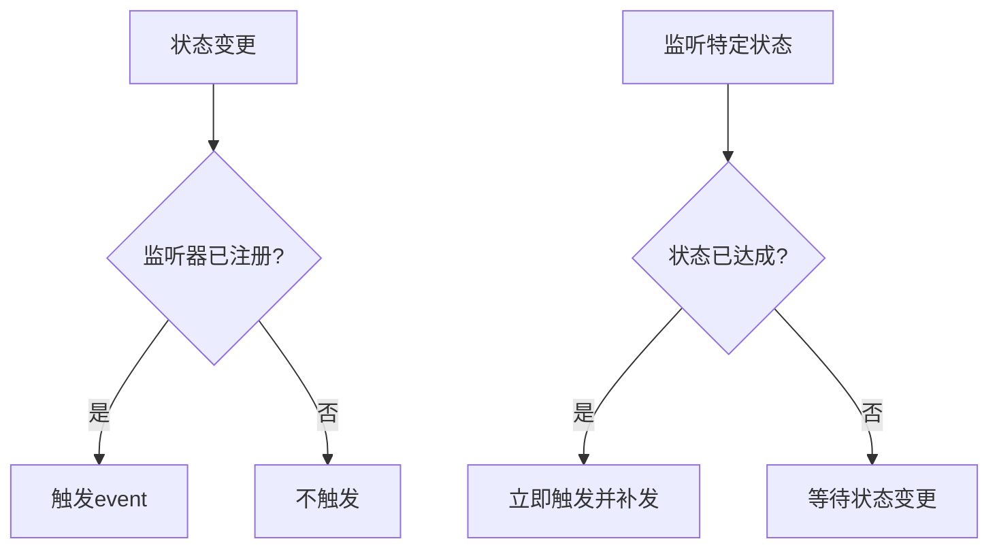
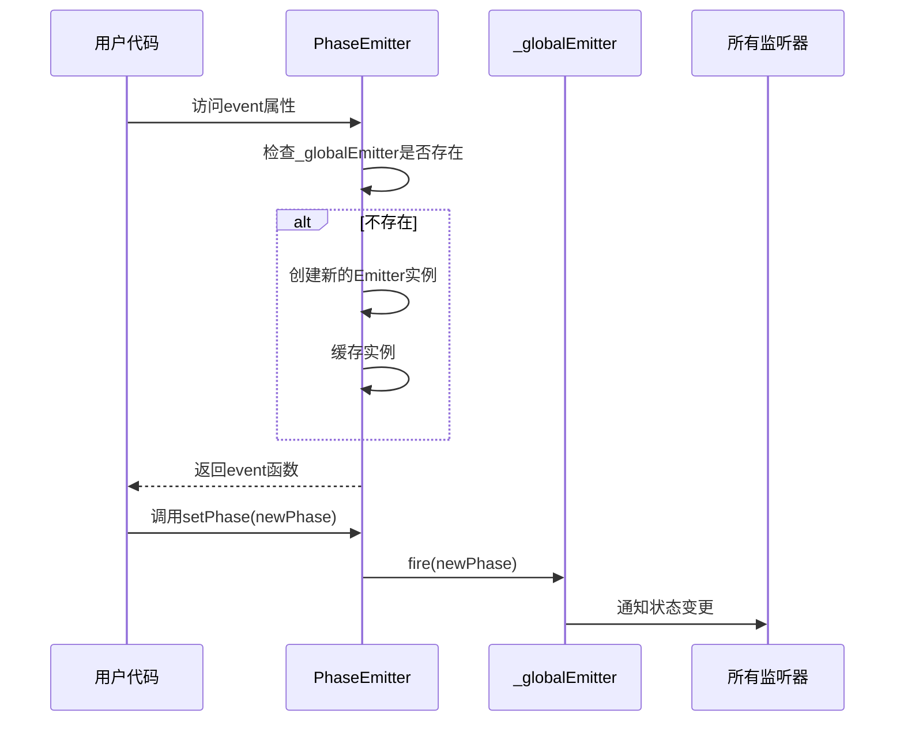

# event状态变更通知

<cite>
**本文档中引用的文件**
- [emitter.ts](file://packages/h5-builder/src/bedrock/event/emitter.ts)
- [phase-emitter.ts](file://packages/h5-builder/src/bedrock/event/phase-emitter.ts)
- [when.ts](file://packages/h5-builder/src/bedrock/event/when.ts)
- [emitter.test.ts](file://packages/h5-builder/src/bedrock/event/emitter.test.ts)
- [phase-emitter.test.ts](file://packages/h5-builder/src/bedrock/event/phase-emitter.test.ts)
</cite>

## 目录
1. [引言](#引言)
2. [event属性设计与实现](#event属性设计与实现)
3. [与when/whenPhase的核心差异](#与whenwhenphase的核心差异)
4. _globalEmitter的惰性初始化与广播机制
5. 使用示例与适用场景
6. 开发者注意事项

## 引言
本文档全面介绍MobX框架中event属性作为基础状态变更通知机制的设计与实现。重点说明其返回Event<[T]>类型，携带最新phase参数，仅在setPhase时触发，不具备状态补发能力的特点。通过源码分析对比event与when/whenPhase的核心差异，适用于需要感知状态流转过程而非仅关注最终状态的场景。

## event属性设计与实现

`event`属性是MobX中用于状态变更通知的基础机制，其核心实现位于`PhaseEmitter`类中。该机制返回`Event<[T]>`类型，携带最新的phase参数，并且仅在调用`setPhase`方法时触发。

`event`属性不具备状态补发能力，这意味着如果监听器在状态变更之后才注册，则不会收到之前的状态变更通知。这种设计使得`event`更适合用于需要感知状态流转过程的场景，而不是仅仅关注最终状态。

**Section sources**
- [phase-emitter.ts](file://packages/h5-builder/src/bedrock/event/phase-emitter.ts#L135-L140)

## 与when/whenPhase的核心差异

`event`与`when`/`whenPhase`在功能和使用场景上存在显著差异：

1. **触发时机**：
   - `event`：仅在状态实际变更时触发，不进行状态补发
   - `when`/`whenPhase`：如果目标状态已经达成，会立即触发并进行状态补发

2. **使用场景**：
   - `event`：适用于需要感知状态流转过程的场景，如构建调试工具或状态追踪系统
   - `when`/`whenPhase`：适用于只需要关注最终状态的场景，如等待某个条件达成

3. **性能特性**：
   - `event`：由于不进行状态补发，性能开销较小
   - `when`/`whenPhase`：可能需要额外的检查和补发逻辑，性能开销相对较大



**Diagram sources**
- [phase-emitter.ts](file://packages/h5-builder/src/bedrock/event/phase-emitter.ts)
- [when.ts](file://packages/h5-builder/src/bedrock/event/when.ts)

**Section sources**
- [phase-emitter.ts](file://packages/h5-builder/src/bedrock/event/phase-emitter.ts#L142-L158)
- [when.ts](file://packages/h5-builder/src/bedrock/event/when.ts#L6-L41)

## _globalEmitter的惰性初始化与广播机制

`_globalEmitter`是`PhaseEmitter`内部用于管理`event`通知的核心组件，采用惰性初始化策略：

1. **惰性初始化**：`_globalEmitter`在首次访问`event`属性时才被创建，避免了不必要的资源开销
2. **单例模式**：一旦创建，`_globalEmitter`实例会被缓存，后续访问直接复用
3. **广播机制**：当调用`setPhase`方法时，`_globalEmitter`会向所有注册的监听器广播最新的phase参数

这种设计确保了事件通知的高效性和资源的合理利用。惰性初始化避免了在不需要事件通知时创建不必要的对象，而广播机制则保证了所有监听器都能及时收到状态变更通知。



**Diagram sources**
- [phase-emitter.ts](file://packages/h5-builder/src/bedrock/event/phase-emitter.ts#L135-L140)
- [emitter.ts](file://packages/h5-builder/src/bedrock/event/emitter.ts)

**Section sources**
- [phase-emitter.ts](file://packages/h5-builder/src/bedrock/event/phase-emitter.ts#L113-L140)

## 使用示例与适用场景

以下示例展示了如何使用`event`属性监听连续的状态迁移路径：

```typescript
enum Phase {
  Waiting,
  Loading,
  Ready,
  Error
}

class DataLoader {
  private readonly phaseEmitter = new PhaseEmitter(Phase.Waiting);
  
  // 获取状态变更事件
  readonly onPhaseChange = this.phaseEmitter.event;
  
  async load() {
    this.phaseEmitter.setPhase(Phase.Loading);
    try {
      await fetchData();
      this.phaseEmitter.setPhase(Phase.Ready);
    } catch (error) {
      this.phaseEmitter.setPhase(Phase.Error);
    }
  }
}

// 使用示例
const loader = new DataLoader();

// 监听完整的状态迁移路径
loader.onPhaseChange((phase) => {
  console.log(`状态变更: ${phase}`);
  // 可以记录状态迁移路径，用于调试或分析
});

loader.load();
```

该模式特别适合构建调试工具或状态追踪系统，因为它能够完整地记录状态的流转过程，而不仅仅是最终状态。

**Section sources**
- [phase-emitter.test.ts](file://packages/h5-builder/src/bedrock/event/phase-emitter.test.ts#L71-L85)
- [emitter.test.ts](file://packages/h5-builder/src/bedrock/event/emitter.test.ts)

## 开发者注意事项

在使用`event`属性时，开发者需要注意以下几点：

1. **避免阻塞操作**：不要在`event`的监听器中执行阻塞操作，这会影响调度性能。建议将耗时操作放入异步队列中处理。

2. **及时清理监听器**：确保在组件销毁或不再需要监听时，及时调用返回的`IDisposable`对象的`dispose`方法，避免内存泄漏。

3. **理解无状态补发特性**：由于`event`不具备状态补发能力，如果需要确保监听器能收到状态变更通知，应在状态变更前注册监听器。

4. **性能考虑**：虽然`event`机制本身性能开销较小，但过多的监听器仍可能影响整体性能。建议根据实际需求合理使用。

5. **错误处理**：监听器中的异常不会中断其他监听器的执行，但应妥善处理异常，避免影响系统稳定性。

**Section sources**
- [emitter.ts](file://packages/h5-builder/src/bedrock/event/emitter.ts#L136-L162)
- [phase-emitter.ts](file://packages/h5-builder/src/bedrock/event/phase-emitter.ts)