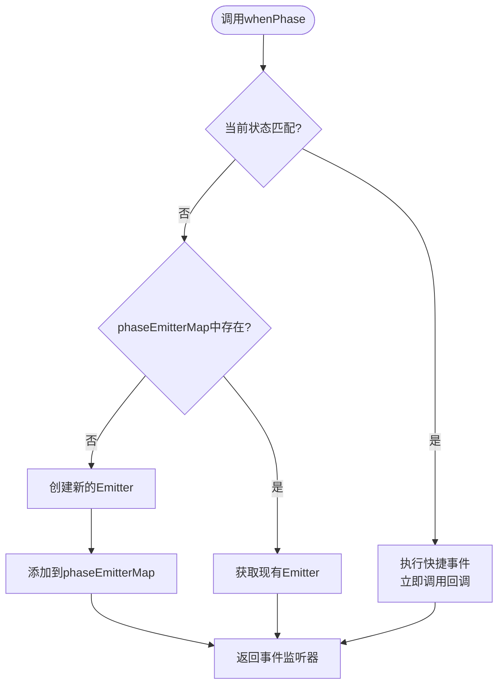
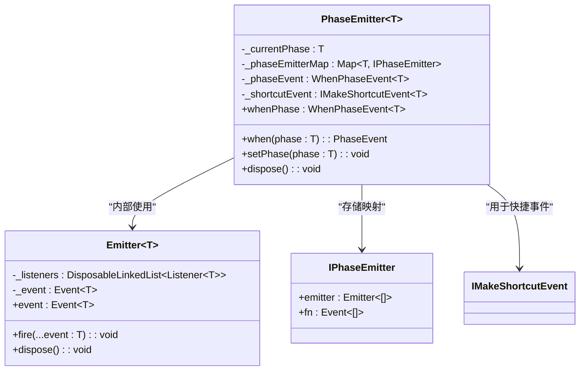
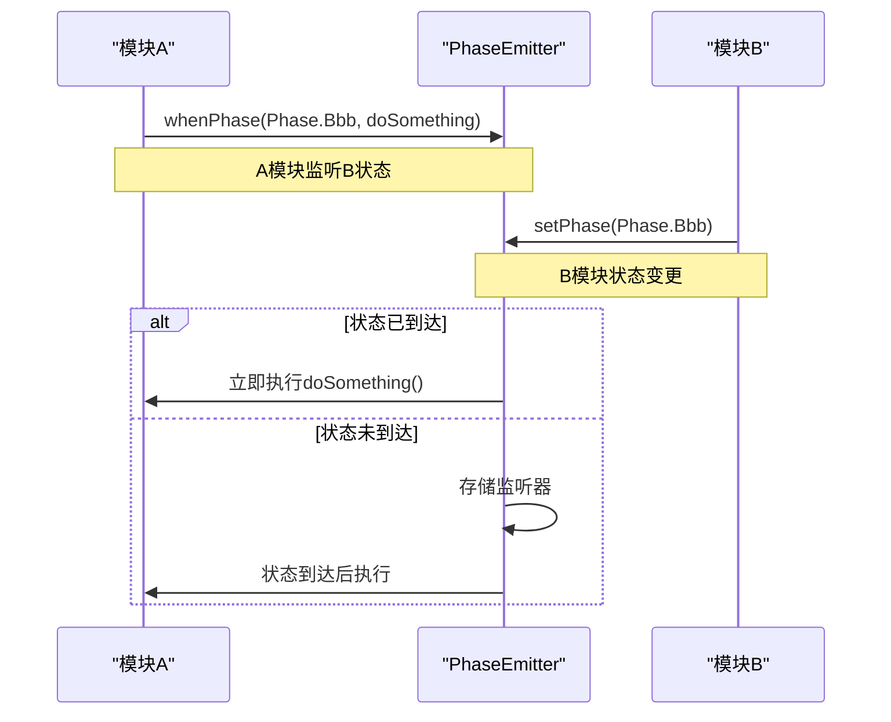

# whenPhase事件机制

<cite>
**本文档引用的文件**   
- [phase-emitter.ts](file://packages/h5-builder/src/bedrock/event/phase-emitter.ts)
- [shortcut-event-utils.ts](file://packages/h5-builder/src/bedrock/event/shortcut-event-utils.ts)
- [emitter.ts](file://packages/h5-builder/src/bedrock/event/emitter.ts)
- [when.ts](file://packages/h5-builder/src/bedrock/event/when.ts)
- [phase-emitter.test.ts](file://packages/h5-builder/src/bedrock/event/phase-emitter.test.ts)
- [job-scheduler.ts](file://packages/h5-builder/src/bedrock/launch/job-scheduler.ts)
- [abstract-job.ts](file://packages/h5-builder/src/bedrock/launch/abstract-job.ts)
- [lifecycle.ts](file://packages/h5-builder/src/jobs/lifecycle.ts)
- [demo-progressive.tsx](file://packages/h5-builder/src/demo-progressive.tsx)
</cite>

## 目录
1. [简介](#简介)
2. [核心接口与类型定义](#核心接口与类型定义)
3. [惰性初始化与状态补发机制](#惰性初始化与状态补发机制)
4. [核心实现原理](#核心实现原理)
5. [高级用法与跨模块依赖](#高级用法与跨模块依赖)
6. [与标准Event的对比](#与标准event的对比)
7. [潜在风险与最佳实践](#潜在风险与最佳实践)
8. [总结](#总结)

## 简介
`whenPhase`事件机制是一种专门用于处理状态扭转（phase transition）的事件系统，它在标准事件模型的基础上增加了状态补发（state replay）能力。该机制通过`WhenPhaseEvent`接口提供了一种声明式的监听方式，允许外部模块监听特定状态的到达，并在状态已满足时立即执行回调。这种设计简化了条件性初始化逻辑，但也引入了依赖顺序的不确定性风险。

**Section sources**
- [phase-emitter.ts](file://packages/h5-builder/src/bedrock/event/phase-emitter.ts#L24-L33)

## 核心接口与类型定义
`whenPhase`机制的核心是`WhenPhaseEvent<T>`接口，它定义了动态phase传参和回调函数注入的签名：
```typescript
(phase: T, listener: () => any) => IDisposable
```
该接口接受一个泛型`T`表示状态类型，以及一个无参数的回调函数。当指定的状态`phase`到达时，回调函数将被调用。返回值为`IDisposable`，用于取消监听。

与之相关的还有`PhaseEvent`类型，它是参数为空的事件类型，用于监听特定状态的到达。

**Section sources**
- [phase-emitter.ts](file://packages/h5-builder/src/bedrock/event/phase-emitter.ts#L24-L33)

## 惰性初始化与状态补发机制
`whenPhase`事件机制采用了惰性初始化策略。首次调用`whenPhase`时，会创建一个`_phaseEvent`实例。如果当前状态已经匹配监听的phase，则利用`_shortcutEvent`立即执行监听器，实现状态补发。



**Diagram sources **
- [phase-emitter.ts](file://packages/h5-builder/src/bedrock/event/phase-emitter.ts#L142-L158)

## 核心实现原理
`PhaseEmitter`类是`whenPhase`机制的核心实现。它维护了一个`_phaseEmitterMap`映射，为每个可能的状态创建独立的`Emitter`实例。当状态改变时，通过`setPhase`方法更新当前状态，并触发对应状态的事件。



**Diagram sources **
- [phase-emitter.ts](file://packages/h5-builder/src/bedrock/event/phase-emitter.ts#L112-L209)
- [emitter.ts](file://packages/h5-builder/src/bedrock/event/emitter.ts#L82-L163)

## 高级用法与跨模块依赖
`whenPhase`机制在跨模块状态依赖中具有高级用法。例如，在`JobScheduler`中，可以通过`whenPhase`监听特定生命周期阶段的到达，实现条件性监听和运行时phase判断。



**Diagram sources **
- [phase-emitter.test.ts](file://packages/h5-builder/src/bedrock/event/phase-emitter.test.ts#L41-L69)
- [demo-progressive.tsx](file://packages/h5-builder/src/demo-progressive.tsx#L106-L152)

## 与标准Event的对比
`whenPhase`事件与标准`Event`的主要区别在于具备状态补发能力。标准事件只在触发时通知监听器，而`whenPhase`会在监听时检查当前状态，如果状态已满足则立即补发事件。

| 特性 | 标准Event | whenPhase事件 |
|------|----------|-------------|
| **状态补发** | 不支持 | 支持 |
| **参数传递** | 支持任意参数 | 回调无参数，phase作为第一个参数 |
| **依赖顺序** | 严格依赖初始化顺序 | 可打破初始化顺序 |
| **使用场景** | 通用事件通知 | 状态扭转事件 |
| **风险** | 较低 | 可能引发依赖顺序混乱 |

**Section sources**
- [phase-emitter.ts](file://packages/h5-builder/src/bedrock/event/phase-emitter.ts#L19-L70)

## 潜在风险与最佳实践
`whenPhase`机制虽然提供了便利的状态补发能力，但也可能引发依赖顺序混乱的风险。当A模块依赖B模块的某个事件时，正确的顺序应该是B初始化→A初始化→B抛出事件→A监听到事件。但由于事件补发，可能出现B抛出事件→A初始化→A监听到事件的情况，导致信息丢失。

**最佳实践建议：**
1. **谨慎使用状态补发**：只有在明确需要简化条件初始化逻辑时才使用。
2. **避免关键路径依赖**：不要在关键业务逻辑中依赖可能被补发的事件。
3. **明确事件语义**：确保事件的语义清晰，避免歧义。
4. **监控事件流**：通过日志或调试工具监控事件的触发顺序。

**Section sources**
- [phase-emitter.ts](file://packages/h5-builder/src/bedrock/event/phase-emitter.ts#L58-L70)

## 总结
`whenPhase`事件机制通过`WhenPhaseEvent`接口实现了动态phase传参和回调函数注入，利用惰性初始化和状态补发机制简化了跨模块状态依赖的处理。尽管该机制提供了便利的声明式监听能力，但也引入了潜在的依赖顺序风险。在使用时应遵循最佳实践，确保系统的稳定性和可预测性。

**Section sources**
- [phase-emitter.ts](file://packages/h5-builder/src/bedrock/event/phase-emitter.ts#L112-L209)