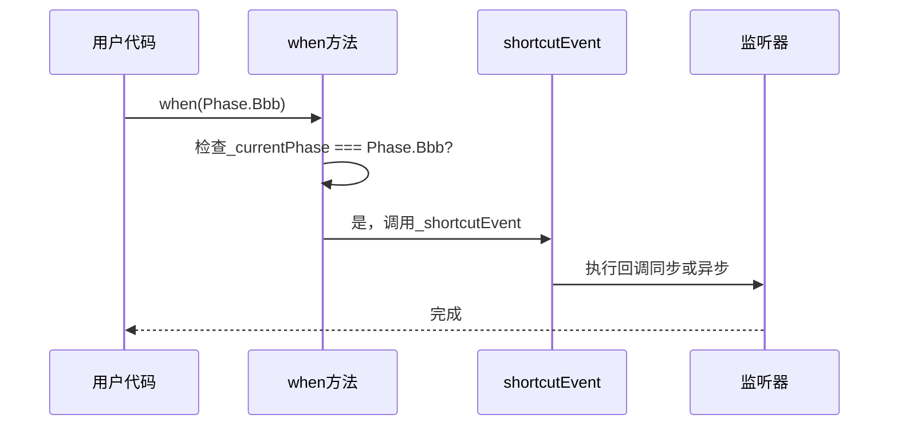
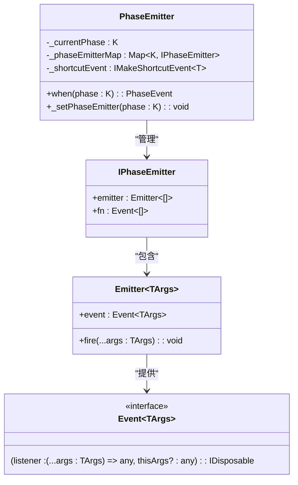
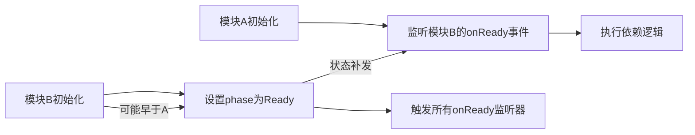

# when特定阶段事件

<cite>
**本文档中引用的文件**  
- [phase-emitter.ts](file://packages/h5-builder/src/bedrock/event/phase-emitter.ts)
- [when.ts](file://packages/h5-builder/src/bedrock/event/when.ts)
- [emitter.ts](file://packages/h5-builder/src/bedrock/event/emitter.ts)
- [shortcut-event-utils.ts](file://packages/h5-builder/src/bedrock/event/shortcut-event-utils.ts)
- [phase-emitter.test.ts](file://packages/h5-builder/src/bedrock/event/phase-emitter.test.ts)
</cite>

## 目录
1. [引言](#引言)
2. [核心机制分析](#核心机制分析)
3. [when方法的工作流程](#when方法的工作流程)
4. [状态补发与快捷事件](#状态补发与快捷事件)
5. _setPhaseEmitter内部逻辑解析
6. [典型应用场景](#典型应用场景)
7. [适用场景与限制](#适用场景与限制)

## 引言
`when(phase:)` 方法是 `PhaseEmitter` 类中的核心功能之一，用于监听特定生命周期阶段的到达。该方法返回一个 `PhaseEvent` 类型的事件，支持状态补发机制，能够在目标阶段已达成时立即触发监听器，从而简化异步状态依赖的处理逻辑。本文将深入分析其工作机制、内部实现及典型应用。

**Section sources**
- [phase-emitter.ts](file://packages/h5-builder/src/bedrock/event/phase-emitter.ts#L160-L169)

## 核心机制分析
`when(phase:)` 方法的核心在于判断目标阶段是否已经达成，并据此决定是立即触发监听器还是注册到事件队列中等待未来触发。这种设计使得组件可以在不关心当前状态是否已达成的情况下统一使用监听语法，极大地提升了代码的可读性和健壮性。

该机制依赖于 `PhaseEmitter` 内部维护的 `_currentPhase` 状态和每个阶段对应的独立 `Emitter` 实例。通过这种方式，系统能够精确管理各个阶段的事件监听与触发行为。

**Section sources**
- [phase-emitter.ts](file://packages/h5-builder/src/bedrock/event/phase-emitter.ts#L112-L210)

## when方法的工作流程
当调用 `when(phase:)` 方法时，系统首先检查当前阶段 `_currentPhase` 是否等于目标阶段 `phase`：

- **若已达成**：直接通过 `_shortcutEvent` 创建并返回一个立即执行的事件监听器。
- **若未达成**：检查是否存在对应阶段的 `Emitter` 实例，若不存在则调用 `_setPhaseEmitter` 创建；随后返回该阶段 `Emitter` 的事件接口。

此流程确保了无论状态是否已达成，监听逻辑都能正确执行，且避免了重复创建资源。

```mermaid
flowchart TD
Start([调用 when(phase)]) --> CheckPhase["检查当前阶段是否等于目标阶段"]
CheckPhase --> |已达成| UseShortcut["使用_shortcutEvent立即触发"]
CheckPhase --> |未达成| HasEmitter["检查是否存在对应Emitter"]
HasEmitter --> |不存在| CreateEmitter["调用_setPhaseEmitter创建"]
HasEmitter --> |存在| GetEvent["获取Emitter.event"]
CreateEmitter --> GetEvent
GetEvent --> ReturnEvent["返回PhaseEvent"]
UseShortcut --> ReturnEvent
ReturnEvent --> End([完成])
```

**Diagram sources**
- [phase-emitter.ts](file://packages/h5-builder/src/bedrock/event/phase-emitter.ts#L160-L169)

**Section sources**
- [phase-emitter.ts](file://packages/h5-builder/src/bedrock/event/phase-emitter.ts#L160-L169)

## 状态补发与快捷事件
状态补发是 `when(phase:)` 方法的关键特性之一。当目标阶段已经达成时，系统不会将监听器加入常规事件队列，而是通过 `_shortcutEvent` 工具函数立即执行回调。

`_shortcutEvent` 根据配置支持同步（`makeSyncShortcutEvent`）和异步（`makeAsyncShortcutEvent`）两种模式：
- **同步模式**：回调函数在监听注册时立即执行。
- **异步模式**：通过 `setTimeout(..., 0)` 将回调延迟至下一个事件循环执行，保证执行顺序的一致性。

这种机制既实现了“状态补发”的语义，又避免了潜在的执行时序问题。



**Diagram sources**
- [phase-emitter.ts](file://packages/h5-builder/src/bedrock/event/phase-emitter.ts#L160-L169)
- [shortcut-event-utils.ts](file://packages/h5-builder/src/bedrock/event/shortcut-event-utils.ts#L8-L34)

**Section sources**
- [phase-emitter.ts](file://packages/h5-builder/src/bedrock/event/phase-emitter.ts#L160-L169)
- [shortcut-event-utils.ts](file://packages/h5-builder/src/bedrock/event/shortcut-event-utils.ts#L8-L34)

### _setPhaseEmitter内部逻辑解析
`_setPhaseEmitter` 是 `PhaseEmitter` 内部用于为特定阶段创建独立 `Emitter` 实例的方法。其核心逻辑如下：

1. 创建一个新的 `Emitter<[]>` 实例，用于管理该阶段的事件监听。
2. 构造一个特殊的事件函数 `fn`，该函数在被调用时会：
   - 再次检查当前阶段是否已达成目标阶段
   - 若已达成，则使用 `_shortcutEvent` 立即执行监听器
   - 否则，将监听器注册到该阶段的 `Emitter` 中
3. 将 `{ emitter, fn }` 对象存入 `_phaseEmitterMap` 映射表，供后续复用。

这种设计实现了每个阶段的事件管理隔离，同时保留了状态补发的能力。



**Diagram sources**
- [phase-emitter.ts](file://packages/h5-builder/src/bedrock/event/phase-emitter.ts#L197-L208)

**Section sources**
- [phase-emitter.ts](file://packages/h5-builder/src/bedrock/event/phase-emitter.ts#L197-L208)

## 典型应用场景
结合测试用例 `phase-emitter.test.ts` 可知，`when(phase:)` 的典型应用场景包括：

- **等待组件初始化完成**：外部模块无需判断组件是否已初始化，统一使用 `component.onReady(doSomething)` 即可。
- **生命周期阶段监听**：如页面加载流程中的 `onBbb`、`onCcc` 阶段监听。
- **状态机控制**：在状态流转系统中监听特定状态的到达。

例如，在 `Lifecycle` 类中，通过 `onBbb = this._phaseEmitter.when(Phase.Bbb)` 暴露简洁的事件接口，使用者无需关心当前是否已进入 `Bbb` 阶段。



**Diagram sources**
- [phase-emitter.test.ts](file://packages/h5-builder/src/bedrock/event/phase-emitter.test.ts#L41-L213)

**Section sources**
- [phase-emitter.test.ts](file://packages/h5-builder/src/bedrock/event/phase-emitter.test.ts#L41-L213)

## 适用场景与限制
`when(phase:)` 方法适用于以下场景：
- 明确需要监听某个**稳定状态**到达的场合
- 存在异步初始化依赖的组件通信
- 希望简化“先判断后监听”逻辑的代码

**不适用于**：
- 监听**连续状态变化**（应使用 `event` 接口）
- 需要精确控制执行时序的场景（因异步模式存在延迟）
- 频繁切换的状态（可能导致意外的补发行为）

文档中特别强调：事件补发虽能简化代码，但会破坏原有的依赖时序假设，因此仅应在状态扭转类事件中谨慎使用。

**Section sources**
- [phase-emitter.ts](file://packages/h5-builder/src/bedrock/event/phase-emitter.ts#L50-L73)
- [phase-emitter.ts](file://packages/h5-builder/src/bedrock/event/phase-emitter.ts#L87-L88)