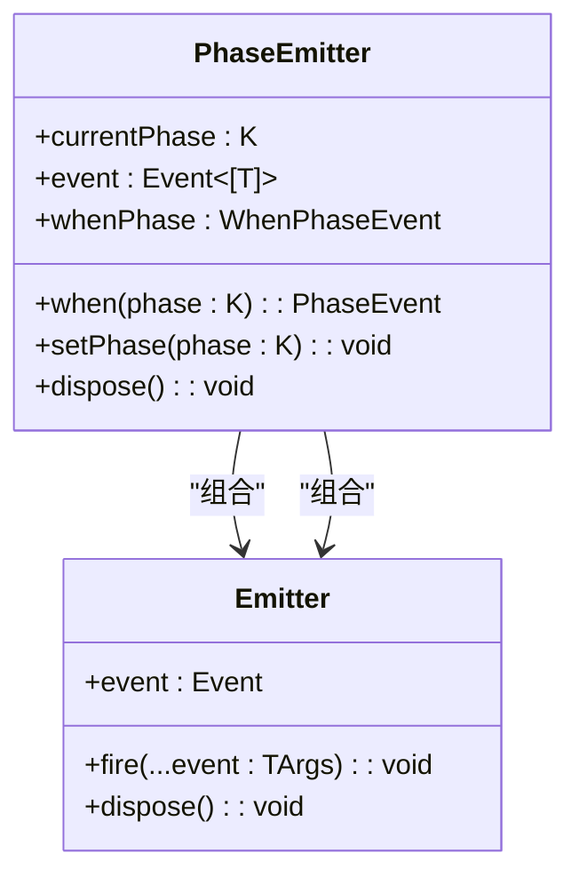
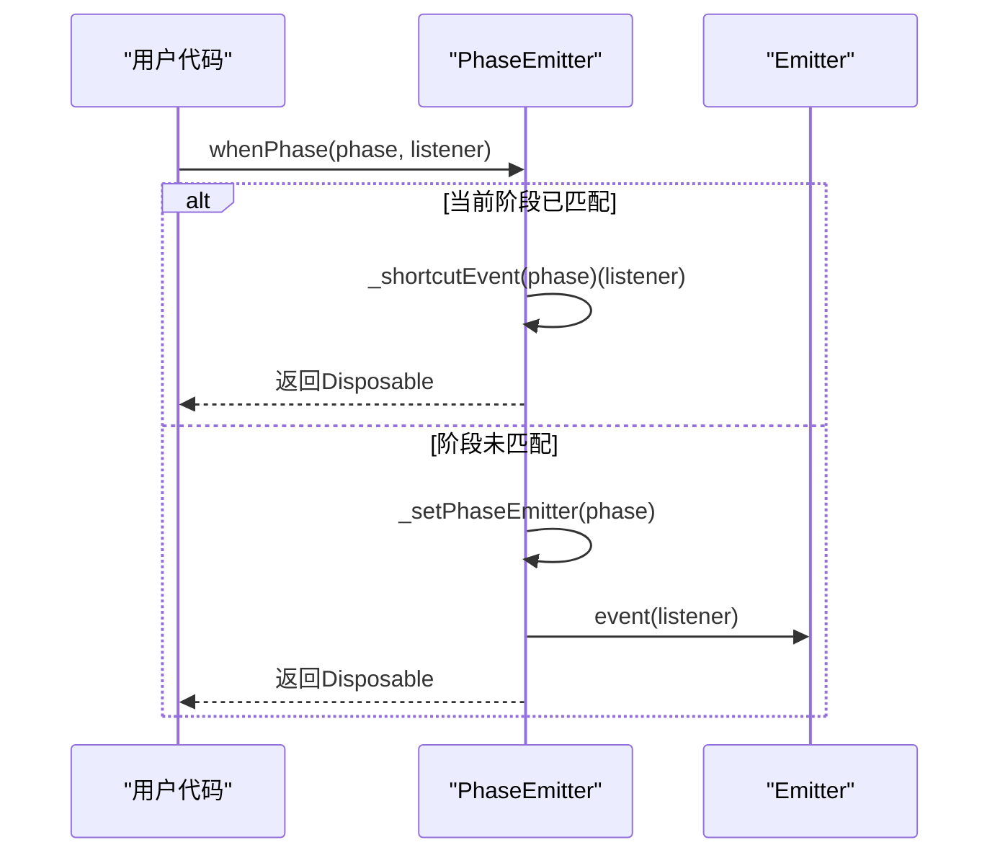
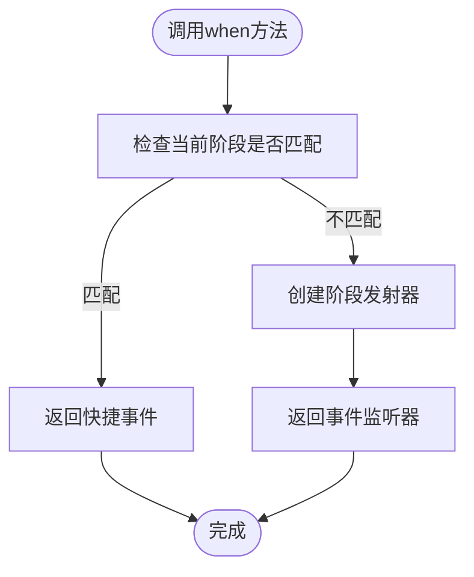
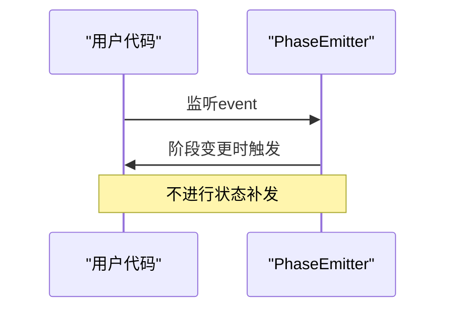
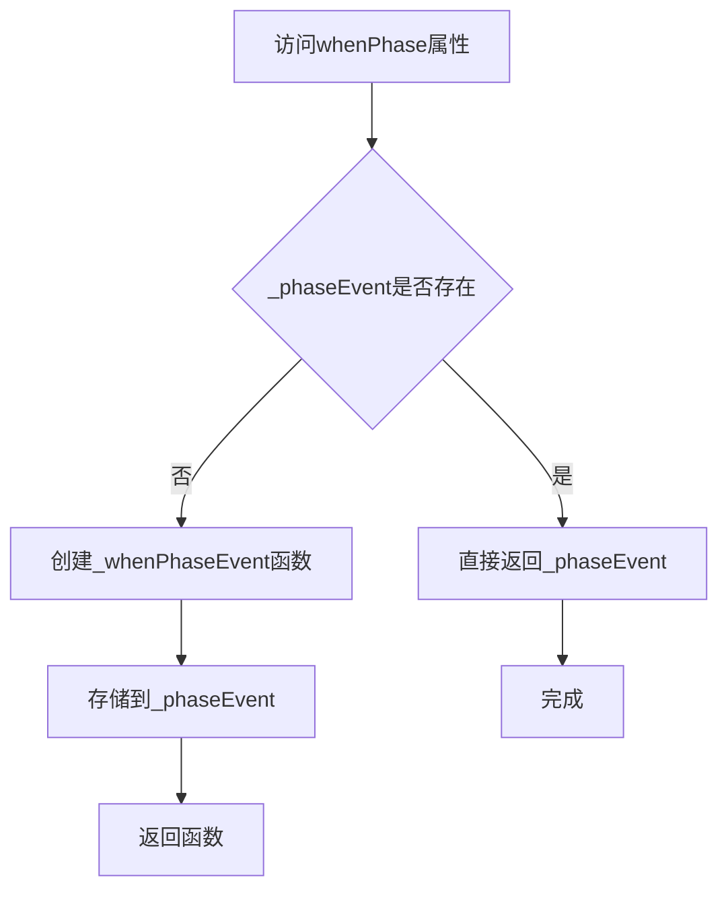
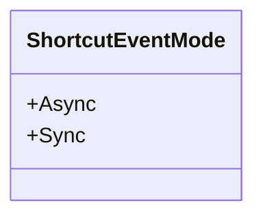
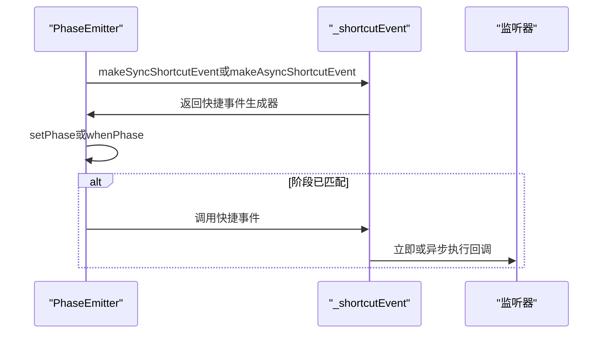
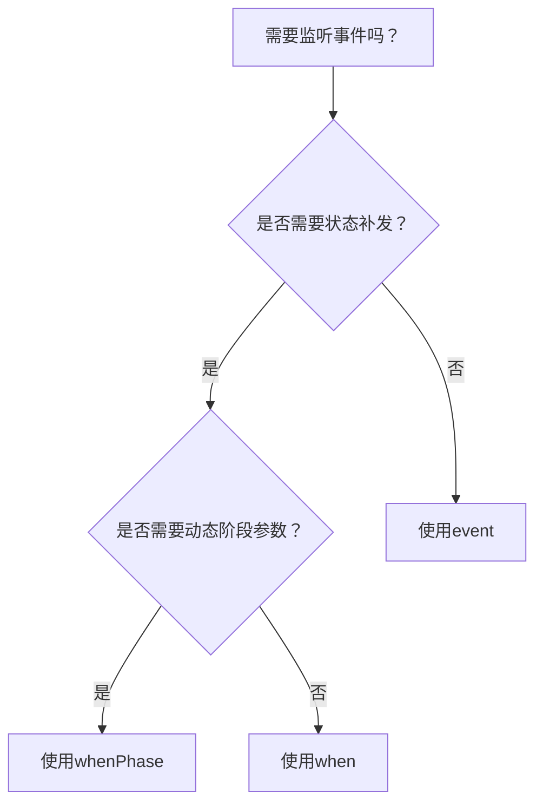

# 事件发射机制

<cite>
**本文档中引用的文件**
- [phase-emitter.ts](file://packages/h5-builder/src/bedrock/event/phase-emitter.ts)
- [phase-emitter.test.ts](file://packages/h5-builder/src/bedrock/event/phase-emitter.test.ts)
- [shortcut-event-utils.ts](file://packages/h5-builder/src/bedrock/event/shortcut-event-utils.ts)
- [when.ts](file://packages/h5-builder/src/bedrock/event/when.ts)
- [emitter.ts](file://packages/h5-builder/src/bedrock/event/emitter.ts)
- [once.ts](file://packages/h5-builder/src/bedrock/event/once.ts)
- [utils.ts](file://packages/h5-builder/src/bedrock/event/utils.ts)
- [index.ts](file://packages/h5-builder/src/bedrock/event/index.ts)
</cite>

## 目录
1. [引言](#引言)
2. [PhaseEmitter核心事件监听方式](#phaseemitter核心事件监听方式)
3. [whenPhase、when与event的区别](#whenphasewhen与event的区别)
4. [_whenPhaseEvent的惰性初始化机制](#_whenphaseevent的惰性初始化机制)
5. [_shortcutEvent在立即执行监听器中的应用](#_shortcutevent在立即执行监听器中的应用)
6. [事件模式选择策略](#事件模式选择策略)
7. [总结](#总结)

## 引言
PhaseEmitter是MobX项目中用于管理状态阶段转换的核心事件发射器。它提供了三种主要的事件监听方式：`whenPhase`、`when`和`event`，每种方式都有其特定的使用场景和行为特征。本文将深入解析这三种监听方式的区别，重点讲解`_whenPhaseEvent`的惰性初始化机制以及`_shortcutEvent`在立即执行监听器中的应用。

**Section sources**
- [phase-emitter.ts](file://packages/h5-builder/src/bedrock/event/phase-emitter.ts#L1-L210)

## PhaseEmitter核心事件监听方式
PhaseEmitter通过三种不同的API提供事件监听能力，分别针对不同的使用场景：

1. **whenPhase**：支持动态传参和回调函数的灵活监听方式
2. **when**：针对特定阶段返回PhaseEvent的专用监听方式
3. **event**：提供基础状态变更通知的通用监听方式

这些监听方式都建立在基础的Emitter机制之上，但各自具有独特的特性和优化。

**Diagram sources**
- [phase-emitter.ts](file://packages/h5-builder/src/bedrock/event/phase-emitter.ts#L112-L210)
- [emitter.ts](file://packages/h5-builder/src/bedrock/event/emitter.ts#L82-L163)

**Section sources**
- [phase-emitter.ts](file://packages/h5-builder/src/bedrock/event/phase-emitter.ts#L1-L210)

## whenPhase、when与event的区别
### whenPhase
`whenPhase`是PhaseEmitter中最灵活的监听方式，其特点包括：

- 支持动态传入阶段参数和监听器回调
- 提供完整的阶段信息作为回调参数
- 实现了状态补发机制
- 采用惰性初始化模式

**Diagram sources**
- [phase-emitter.ts](file://packages/h5-builder/src/bedrock/event/phase-emitter.ts#L142-L158)

### when
`when`方法针对特定阶段返回PhaseEvent，其特点包括：

- 针对特定阶段的专用监听
- 返回的PhaseEvent参数为空数组
- 同样支持状态补发
- 性能优化，避免重复创建监听器

**Diagram sources**
- [phase-emitter.ts](file://packages/h5-builder/src/bedrock/event/phase-emitter.ts#L160-L169)

### event
`event`提供最基础的状态变更通知，其特点包括：

- 监听所有阶段变更
- 不进行状态补发
- 提供阶段值作为参数
- 适用于需要知道具体变更情况的场景

**Diagram sources**
- [phase-emitter.ts](file://packages/h5-builder/src/bedrock/event/phase-emitter.ts#L135-L140)

**Section sources**
- [phase-emitter.ts](file://packages/h5-builder/src/bedrock/event/phase-emitter.ts#L24-L33)
- [phase-emitter.test.ts](file://packages/h5-builder/src/bedrock/event/phase-emitter.test.ts#L41-L213)

## _whenPhaseEvent的惰性初始化机制
`_whenPhaseEvent`采用了惰性初始化（Lazy Initialization）模式，这是PhaseEmitter性能优化的关键设计。

### 惰性初始化原理

### 实现细节
1. `_phaseEvent`字段初始为undefined
2. 首次访问`whenPhase`属性时才创建函数
3. 后续访问直接返回已创建的函数实例
4. 避免了不必要的函数创建开销

这种设计确保了在不使用`whenPhase`功能时不会产生任何额外的内存和性能开销，体现了"按需加载"的设计哲学。

**Diagram sources**
- [phase-emitter.ts](file://packages/h5-builder/src/bedrock/event/phase-emitter.ts#L142-L158)

**Section sources**
- [phase-emitter.ts](file://packages/h5-builder/src/bedrock/event/phase-emitter.ts#L142-L158)

## _shortcutEvent在立即执行监听器中的应用
`_shortcutEvent`是PhaseEmitter中用于处理立即执行监听器的核心机制，它根据配置支持同步和异步两种模式。

### ShortcutEventMode枚举

### 实现机制

### 同步与异步模式对比
| 特性 | 同步模式 | 异步模式 |
|------|---------|---------|
| 执行时机 | 立即执行 | setTimeout(fn, 0) |
| 调用栈 | 保持原调用栈 | 新的调用栈 |
| 性能 | 更快 | 稍慢 |
| 安全性 | 可能阻塞 | 避免阻塞 |

**Diagram sources**
- [shortcut-event-utils.ts](file://packages/h5-builder/src/bedrock/event/shortcut-event-utils.ts#L8-L34)
- [phase-emitter.ts](file://packages/h5-builder/src/bedrock/event/phase-emitter.ts#L127-L128)

**Section sources**
- [shortcut-event-utils.ts](file://packages/h5-builder/src/bedrock/event/shortcut-event-utils.ts#L1-L34)
- [phase-emitter.ts](file://packages/h5-builder/src/bedrock/event/phase-emitter.ts#L40-L43)

## 事件模式选择策略
根据不同的使用场景，应选择合适的事件监听模式：

### 选择决策树

### 使用场景建议
1. **使用whenPhase的场景**：
   - 需要动态决定监听哪个阶段
   - 需要获取阶段信息作为回调参数
   - 外部需要高度灵活性

2. **使用when的场景**：
   - 固定监听某个特定阶段
   - 追求最佳性能
   - 代码简洁性优先

3. **使用event的场景**：
   - 需要监听所有阶段变更
   - 不希望有状态补发行为
   - 需要知道具体的变更过程

### 最佳实践
- 优先使用`when`，因为它最简单且性能最好
- 当需要灵活性时使用`whenPhase`
- 仅在需要完整变更历史时使用`event`
- 注意状态补发可能带来的依赖关系混乱

**Section sources**
- [phase-emitter.ts](file://packages/h5-builder/src/bedrock/event/phase-emitter.ts#L89-L108)
- [phase-emitter.test.ts](file://packages/h5-builder/src/bedrock/event/phase-emitter.test.ts#L41-L213)

## 总结
PhaseEmitter提供了三种互补的事件监听方式，每种方式都有其特定的优势和适用场景。`whenPhase`提供了最大的灵活性，`when`提供了最佳的性能，而`event`提供了最完整的状态变更信息。通过`_whenPhaseEvent`的惰性初始化机制和`_shortcutEvent`的立即执行能力，PhaseEmitter在功能和性能之间取得了良好的平衡。开发者应根据具体需求选择合适的监听模式，以实现既高效又可靠的事件处理。

**Section sources**
- [phase-emitter.ts](file://packages/h5-builder/src/bedrock/event/phase-emitter.ts#L1-L210)
- [phase-emitter.test.ts](file://packages/h5-builder/src/bedrock/event/phase-emitter.test.ts#L1-L213)