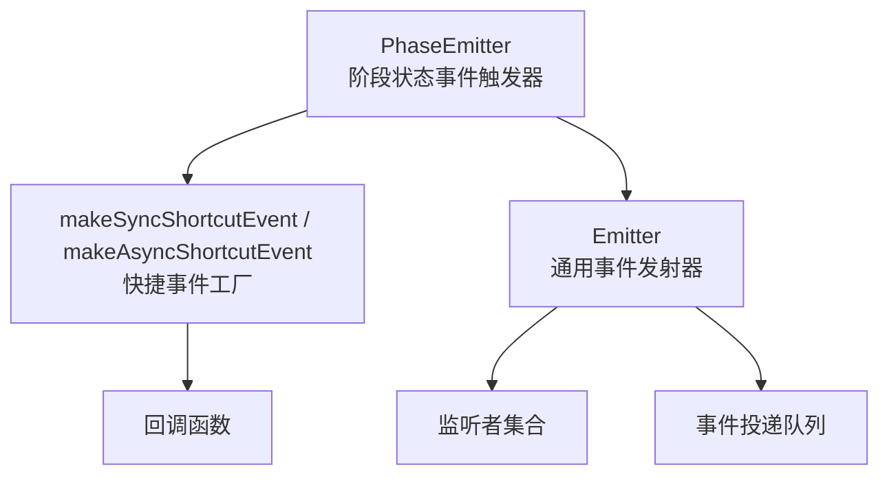
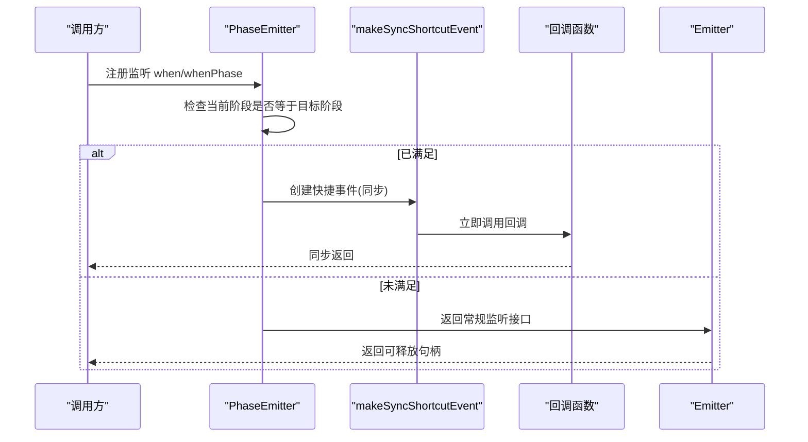
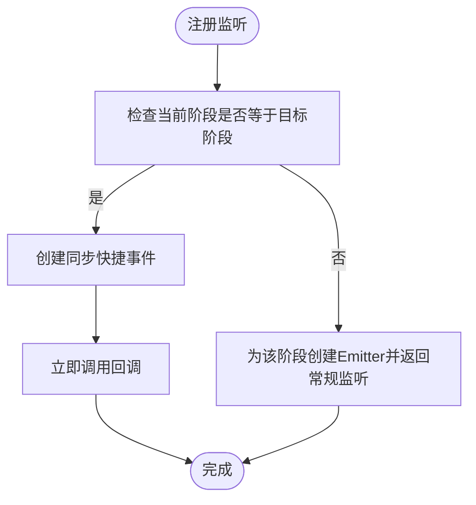
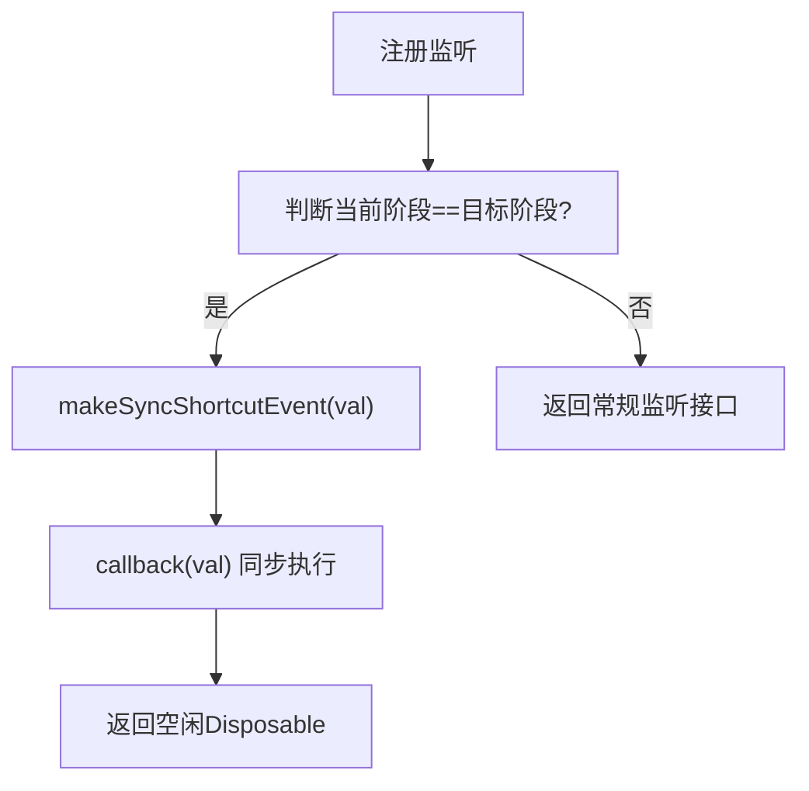
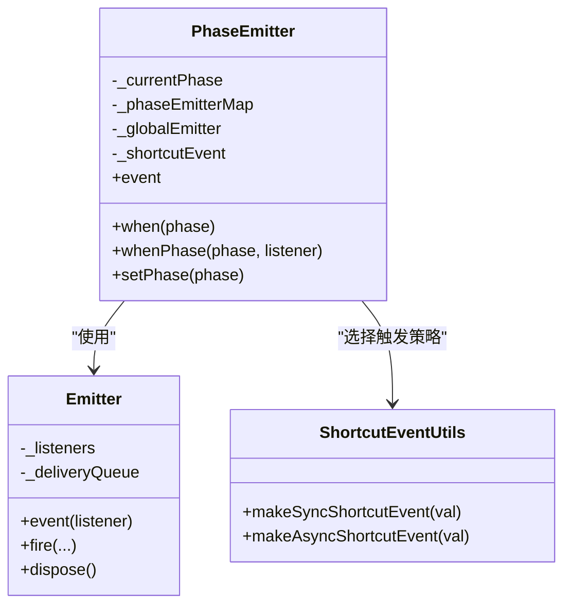

# 同步状态补发模式

<cite>
**本文引用的文件列表**
- [phase-emitter.ts](file://packages/h5-builder/src/bedrock/event/phase-emitter.ts)
- [shortcut-event-utils.ts](file://packages/h5-builder/src/bedrock/event/shortcut-event-utils.ts)
- [emitter.ts](file://packages/h5-builder/src/bedrock/event/emitter.ts)
- [phase-emitter.test.ts](file://packages/h5-builder/src/bedrock/event/phase-emitter.test.ts)
</cite>

## 目录
1. [引言](#引言)
2. [项目结构](#项目结构)
3. [核心组件](#核心组件)
4. [架构总览](#架构总览)
5. [详细组件分析](#详细组件分析)
6. [依赖关系分析](#依赖关系分析)
7. [性能考量](#性能考量)
8. [故障排查指南](#故障排查指南)
9. [结论](#结论)
10. [附录](#附录)

## 引言
本文件聚焦于 PhaseEmitter 中“同步状态补发（Sync ShortcutEvent）”的实现与影响，解释在监听注册时若当前状态已满足目标阶段，将直接调用回调而不经事件循环的机制；并深入剖析 makeSyncShortcutEvent 的实现原理及其对调用栈的影响。文档同时给出适用场景、潜在风险（如调用顺序耦合与栈溢出）以及使用建议：仅在明确控制调用时序的模块内部使用，避免跨模块依赖。

## 项目结构
围绕同步状态补发的相关代码位于事件系统子模块，主要文件包括：
- PhaseEmitter：封装阶段状态管理与监听注册逻辑，支持“状态补发”
- makeSyncShortcutEvent / makeAsyncShortcutEvent：快捷事件工厂，分别用于同步或异步触发回调
- Emitter：通用事件发射器，负责监听注册、分发与错误处理

图表来源
- [phase-emitter.ts](file://packages/h5-builder/src/bedrock/event/phase-emitter.ts#L1-L210)
- [shortcut-event-utils.ts](file://packages/h5-builder/src/bedrock/event/shortcut-event-utils.ts#L1-L34)
- [emitter.ts](file://packages/h5-builder/src/bedrock/event/emitter.ts#L1-L163)

章节来源
- [phase-emitter.ts](file://packages/h5-builder/src/bedrock/event/phase-emitter.ts#L1-L210)
- [shortcut-event-utils.ts](file://packages/h5-builder/src/bedrock/event/shortcut-event-utils.ts#L1-L34)
- [emitter.ts](file://packages/h5-builder/src/bedrock/event/emitter.ts#L1-L163)

## 核心组件
- PhaseEmitter：维护当前阶段状态 currentPhase，提供 when/whenPhase/event 等接口；在监听注册时若当前状态已满足目标阶段，则通过快捷事件工厂选择同步或异步触发回调。
- makeSyncShortcutEvent：返回一个事件包装器，接收回调后立即同步执行，不进入事件循环。
- makeAsyncShortcutEvent：返回一个事件包装器，使用定时器将回调放入异步队列，延迟到下一次事件循环执行。
- Emitter：通用事件发射器，负责监听注册、批量投递与异常处理。

章节来源
- [phase-emitter.ts](file://packages/h5-builder/src/bedrock/event/phase-emitter.ts#L112-L209)
- [shortcut-event-utils.ts](file://packages/h5-builder/src/bedrock/event/shortcut-event-utils.ts#L8-L32)
- [emitter.ts](file://packages/h5-builder/src/bedrock/event/emitter.ts#L78-L162)

## 架构总览
下面的序列图展示了“监听注册即刻触发”的完整流程，重点体现同步补发对调用栈的影响。

图表来源
- [phase-emitter.ts](file://packages/h5-builder/src/bedrock/event/phase-emitter.ts#L142-L169)
- [shortcut-event-utils.ts](file://packages/h5-builder/src/bedrock/event/shortcut-event-utils.ts#L8-L18)
- [emitter.ts](file://packages/h5-builder/src/bedrock/event/emitter.ts#L78-L125)

## 详细组件分析

### PhaseEmitter 的同步状态补发机制
- when/whenPhase 在注册时检查 currentPhase 是否等于目标阶段：
  - 若相等：通过快捷事件工厂创建事件包装器，立即触发回调
  - 若不相等：为该阶段创建独立的 Emitter 并返回常规监听接口
- setPhase 负责推进阶段并触发对应阶段的监听；同时也会向全局事件发射器发出阶段变更通知。

图表来源
- [phase-emitter.ts](file://packages/h5-builder/src/bedrock/event/phase-emitter.ts#L142-L169)
- [phase-emitter.ts](file://packages/h5-builder/src/bedrock/event/phase-emitter.ts#L197-L209)

章节来源
- [phase-emitter.ts](file://packages/h5-builder/src/bedrock/event/phase-emitter.ts#L112-L209)

### makeSyncShortcutEvent 的实现原理与调用栈影响
- 行为特征：立即同步调用回调，不经过事件循环；返回的 IDisposable 对象 dispose 不做任何清理动作。
- 调用栈影响：
  - 同步回调在注册时立刻执行，导致回调与注册点在同一调用栈上，形成“即时响应”
  - 若回调内部再次注册监听且条件满足，可能造成连续同步调用，存在栈深度增长的风险
  - 与异步版本相比，同步补发更易打乱模块间的初始化顺序语义

图表来源
- [shortcut-event-utils.ts](file://packages/h5-builder/src/bedrock/event/shortcut-event-utils.ts#L8-L18)
- [phase-emitter.ts](file://packages/h5-builder/src/bedrock/event/phase-emitter.ts#L142-L169)

章节来源
- [shortcut-event-utils.ts](file://packages/h5-builder/src/bedrock/event/shortcut-event-utils.ts#L8-L18)

### makeAsyncShortcutEvent 的对比
- 行为特征：使用定时器将回调放入异步队列，延迟到下一次事件循环执行；返回的 IDisposable 支持取消定时器。
- 适用场景：当需要确保回调在事件循环之后执行，避免同步补发带来的调用顺序耦合风险。

章节来源
- [shortcut-event-utils.ts](file://packages/h5-builder/src/bedrock/event/shortcut-event-utils.ts#L20-L32)

### Emitter 的监听与分发
- 监听注册：返回可释放的句柄，内部维护监听者链表
- 分发策略：
  - 单监听者：直接同步调用回调
  - 多监听者：构建事件投递队列，统一在一次事件循环中批量投递
- 错误处理：捕获回调异常并交由错误处理器处理

章节来源
- [emitter.ts](file://packages/h5-builder/src/bedrock/event/emitter.ts#L78-L162)

### 测试用例中的状态补发行为
- 测试覆盖了监听注册时的状态补发、多次状态切换后的补发、监听阶段变化时不进行补发等场景
- 通过定时器推进验证异步补发的行为边界

章节来源
- [phase-emitter.test.ts](file://packages/h5-builder/src/bedrock/event/phase-emitter.test.ts#L1-L213)

## 依赖关系分析
- PhaseEmitter 依赖 Emitter 提供监听注册与分发能力
- PhaseEmitter 通过快捷事件工厂选择同步或异步触发策略
- Emitter 内部使用事件投递队列与监听者链表，保证多监听者的有序分发

图表来源
- [phase-emitter.ts](file://packages/h5-builder/src/bedrock/event/phase-emitter.ts#L112-L209)
- [emitter.ts](file://packages/h5-builder/src/bedrock/event/emitter.ts#L78-L162)
- [shortcut-event-utils.ts](file://packages/h5-builder/src/bedrock/event/shortcut-event-utils.ts#L1-L34)

章节来源
- [phase-emitter.ts](file://packages/h5-builder/src/bedrock/event/phase-emitter.ts#L112-L209)
- [emitter.ts](file://packages/h5-builder/src/bedrock/event/emitter.ts#L78-L162)
- [shortcut-event-utils.ts](file://packages/h5-builder/src/bedrock/event/shortcut-event-utils.ts#L1-L34)

## 性能考量
- 同步补发在注册时立即执行回调，避免额外的事件循环开销，适合需要“立即响应”的场景
- 异步补发通过定时器延迟回调，有助于避免同步调用链过长，降低栈溢出风险
- Emitter 在单监听者情况下直接同步调用，减少队列构建成本；多监听者时采用队列批量投递，保证一致性

章节来源
- [emitter.ts](file://packages/h5-builder/src/bedrock/event/emitter.ts#L136-L162)
- [shortcut-event-utils.ts](file://packages/h5-builder/src/bedrock/event/shortcut-event-utils.ts#L20-L32)

## 故障排查指南
- 回调未按预期顺序执行：确认是否使用了同步补发；若需严格顺序，请考虑异步补发或重构模块初始化顺序
- 栈溢出或调用链过深：检查回调内部是否存在再次注册监听且条件满足的情况；必要时改为异步补发或拆分职责
- 重复设置相同阶段：日志会警告重复设置，应避免无意义的重复调用
- 阶段转换校验失败：自定义阶段检查器会阻止非法转换，确保状态机的正确性

章节来源
- [phase-emitter.ts](file://packages/h5-builder/src/bedrock/event/phase-emitter.ts#L178-L187)
- [phase-emitter.ts](file://packages/h5-builder/src/bedrock/event/phase-emitter.ts#L189-L195)

## 结论
同步状态补发通过 makeSyncShortcutEvent 在监听注册时直接调用回调，能够显著提升“已就绪即响应”的体验，但也引入了调用顺序耦合与潜在的栈溢出风险。建议仅在明确控制调用时序的模块内部使用同步补发，避免跨模块依赖；对于需要稳定时序与可预测性的场景，优先考虑异步补发或通过其他设计手段解耦。

## 附录
- 使用建议摘要
  - 适用场景：模块内部“已就绪即响应”，且能确保回调不会在注册时再次触发自身监听
  - 风险规避：避免在回调中再次注册满足条件的监听；必要时改为异步补发
  - 设计原则：尽量将“状态变更”与“响应动作”解耦，避免因补发导致的时序不确定性