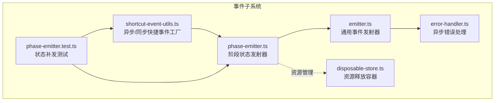
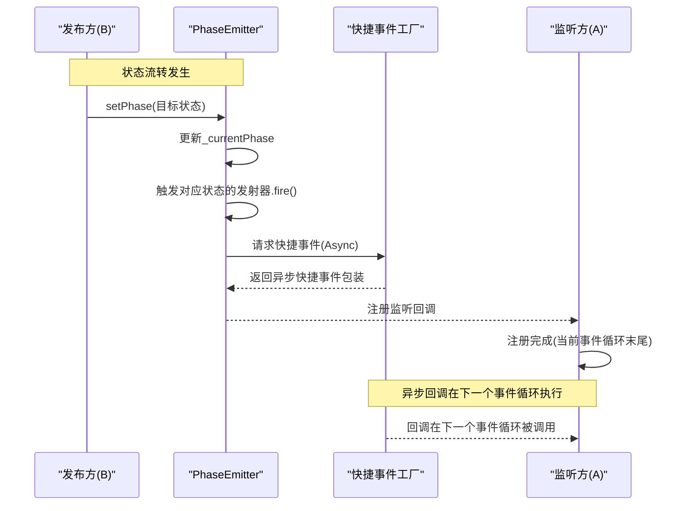
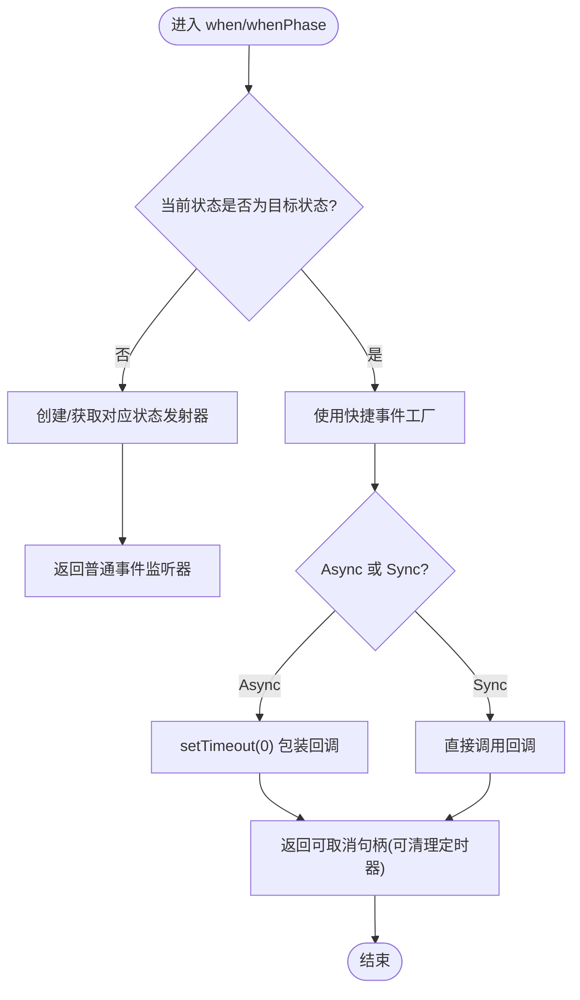
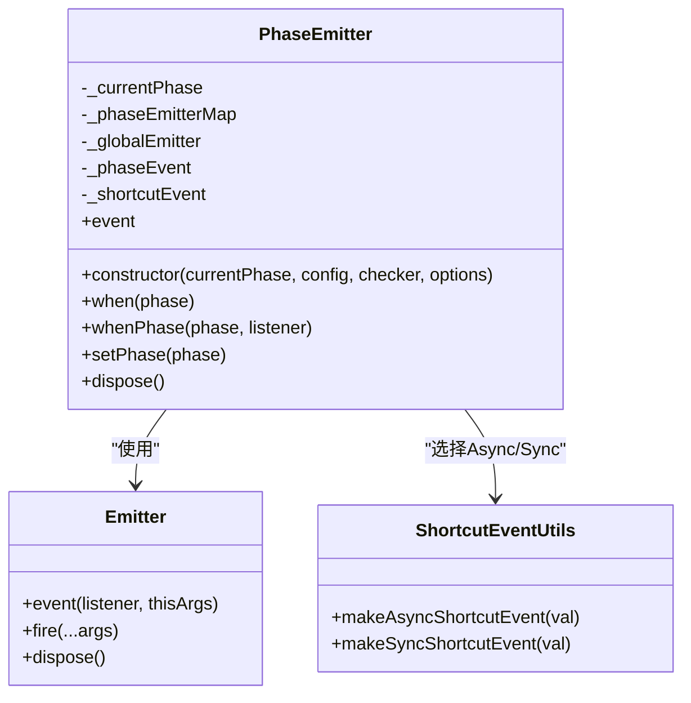
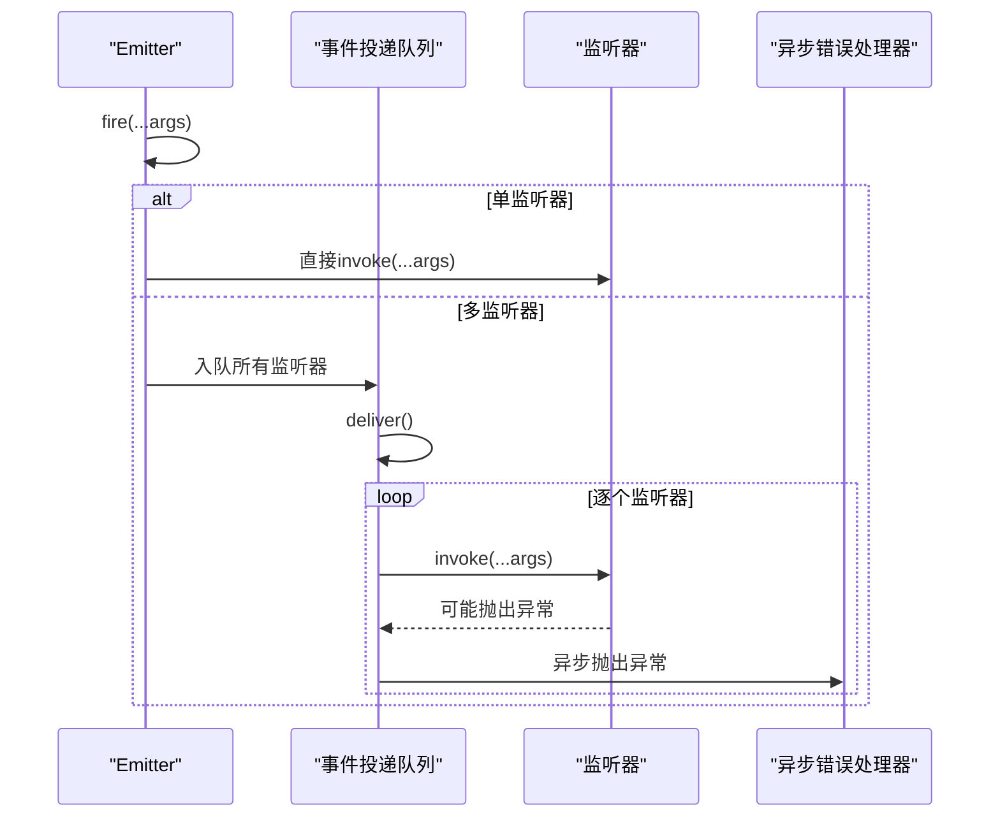
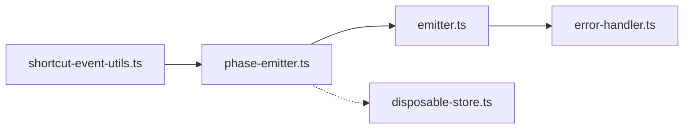

# 异步状态补发模式

<cite>
**本文引用的文件列表**
- [packages/h5-builder/src/bedrock/event/shortcut-event-utils.ts](file://packages/h5-builder/src/bedrock/event/shortcut-event-utils.ts)
- [packages/h5-builder/src/bedrock/event/phase-emitter.ts](file://packages/h5-builder/src/bedrock/event/phase-emitter.ts)
- [packages/h5-builder/src/bedrock/event/emitter.ts](file://packages/h5-builder/src/bedrock/event/emitter.ts)
- [packages/h5-builder/src/bedrock/event/phase-emitter.test.ts](file://packages/h5-builder/src/bedrock/event/phase-emitter.test.ts)
- [packages/h5-builder/src/bedrock/event/error-handler.ts](file://packages/h5-builder/src/bedrock/event/error-handler.ts)
- [packages/h5-builder/src/bedrock/dispose/disposable-store.ts](file://packages/h5-builder/src/bedrock/dispose/disposable-store.ts)
</cite>

## 目录
1. [引言](#引言)
2. [项目结构与定位](#项目结构与定位)
3. [核心组件](#核心组件)
4. [架构总览](#架构总览)
5. [详细组件分析](#详细组件分析)
6. [依赖关系分析](#依赖关系分析)
7. [性能与可靠性考量](#性能与可靠性考量)
8. [故障排查指南](#故障排查指南)
9. [结论](#结论)
10. [附录](#附录)

## 引言
本文件聚焦于“异步状态补发（Async ShortcutEvent）”的工作机制，解释如何通过将回调延迟至下一个事件循环（setTimeout(0)）实现状态监听的补发行为，从而解耦调用时序、避免栈溢出，并确保监听回调总是在注册之后执行。文档结合测试用例（state replay 1-5）说明其在复杂初始化流程中的稳定性优势；并对比同步模式，强调异步模式在模块间通信中的安全性，作为推荐的默认使用方式。

## 项目结构与定位
该机制位于 h5-builder 包的事件子系统中，围绕 PhaseEmitter 的“状态补发”能力展开，配合 Emitter 的事件分发与错误处理策略，形成一套稳定可靠的生命周期状态通知体系。

图表来源
- [packages/h5-builder/src/bedrock/event/shortcut-event-utils.ts](file://packages/h5-builder/src/bedrock/event/shortcut-event-utils.ts#L1-L34)
- [packages/h5-builder/src/bedrock/event/phase-emitter.ts](file://packages/h5-builder/src/bedrock/event/phase-emitter.ts#L1-L210)
- [packages/h5-builder/src/bedrock/event/emitter.ts](file://packages/h5-builder/src/bedrock/event/emitter.ts#L1-L163)
- [packages/h5-builder/src/bedrock/event/error-handler.ts](file://packages/h5-builder/src/bedrock/event/error-handler.ts#L1-L23)
- [packages/h5-builder/src/bedrock/dispose/disposable-store.ts](file://packages/h5-builder/src/bedrock/dispose/disposable-store.ts#L1-L84)
- [packages/h5-builder/src/bedrock/event/phase-emitter.test.ts](file://packages/h5-builder/src/bedrock/event/phase-emitter.test.ts#L1-L213)

章节来源
- [packages/h5-builder/src/bedrock/event/shortcut-event-utils.ts](file://packages/h5-builder/src/bedrock/event/shortcut-event-utils.ts#L1-L34)
- [packages/h5-builder/src/bedrock/event/phase-emitter.ts](file://packages/h5-builder/src/bedrock/event/phase-emitter.ts#L1-L210)
- [packages/h5-builder/src/bedrock/event/emitter.ts](file://packages/h5-builder/src/bedrock/event/emitter.ts#L1-L163)
- [packages/h5-builder/src/bedrock/event/phase-emitter.test.ts](file://packages/h5-builder/src/bedrock/event/phase-emitter.test.ts#L1-L213)

## 核心组件
- 异步/同步快捷事件工厂：提供 makeAsyncShortcutEvent 和 makeSyncShortcutEvent，分别以异步（setTimeout(0)）或同步方式触发回调。
- 阶段状态发射器 PhaseEmitter：维护当前状态，支持“状态到达即补发”和“状态变更广播”，并根据配置选择快捷事件模式。
- 通用事件发射器 Emitter：负责监听器注册、事件投递与错误处理，支持批量投递队列与异步错误抛出。
- 错误处理策略：异步错误处理（setTimeout(0)）避免阻塞事件主流程。
- 测试用例：覆盖多种状态补发场景，验证在复杂初始化流程中的稳定性。

章节来源
- [packages/h5-builder/src/bedrock/event/shortcut-event-utils.ts](file://packages/h5-builder/src/bedrock/event/shortcut-event-utils.ts#L1-L34)
- [packages/h5-builder/src/bedrock/event/phase-emitter.ts](file://packages/h5-builder/src/bedrock/event/phase-emitter.ts#L1-L210)
- [packages/h5-builder/src/bedrock/event/emitter.ts](file://packages/h5-builder/src/bedrock/event/emitter.ts#L1-L163)
- [packages/h5-builder/src/bedrock/event/error-handler.ts](file://packages/h5-builder/src/bedrock/event/error-handler.ts#L1-L23)
- [packages/h5-builder/src/bedrock/event/phase-emitter.test.ts](file://packages/h5-builder/src/bedrock/event/phase-emitter.test.ts#L1-L213)

## 架构总览
异步状态补发的核心在于：当监听者在状态已到达之后才注册时，通过 makeAsyncShortcutEvent 将回调放入下一个事件循环执行，从而保证回调总是在注册之后运行，同时避免同步回调导致的栈溢出与竞态问题。

图表来源
- [packages/h5-builder/src/bedrock/event/phase-emitter.ts](file://packages/h5-builder/src/bedrock/event/phase-emitter.ts#L112-L170)
- [packages/h5-builder/src/bedrock/event/shortcut-event-utils.ts](file://packages/h5-builder/src/bedrock/event/shortcut-event-utils.ts#L20-L32)
- [packages/h5-builder/src/bedrock/event/emitter.ts](file://packages/h5-builder/src/bedrock/event/emitter.ts#L136-L161)

## 详细组件分析

### 组件一：异步/同步快捷事件工厂
- makeAsyncShortcutEvent：使用 setTimeout(0) 将回调延迟到下一个事件循环，返回可取消句柄（dispose 清理定时器），适合模块间通信与复杂初始化流程。
- makeSyncShortcutEvent：直接同步调用回调，适合确定性且轻量的场景，但需谨慎避免栈溢出与竞态。

图表来源
- [packages/h5-builder/src/bedrock/event/phase-emitter.ts](file://packages/h5-builder/src/bedrock/event/phase-emitter.ts#L142-L170)
- [packages/h5-builder/src/bedrock/event/shortcut-event-utils.ts](file://packages/h5-builder/src/bedrock/event/shortcut-event-utils.ts#L8-L32)

章节来源
- [packages/h5-builder/src/bedrock/event/shortcut-event-utils.ts](file://packages/h5-builder/src/bedrock/event/shortcut-event-utils.ts#L1-L34)

### 组件二：阶段状态发射器 PhaseEmitter
- 职责：维护当前状态，提供 when/whenPhase 与 event 接口；当状态已到达时，通过快捷事件工厂进行补发；当状态变更时，通过全局发射器广播。
- 关键点：
  - when/whenPhase 在状态已到达时返回快捷事件包装，确保回调在注册后执行。
  - setPhase 前置校验（可通过 IPhaseChecker 自定义），防止非法状态回退。
  - 默认快捷事件模式为 Async，保证安全与稳定性。

图表来源
- [packages/h5-builder/src/bedrock/event/phase-emitter.ts](file://packages/h5-builder/src/bedrock/event/phase-emitter.ts#L112-L209)
- [packages/h5-builder/src/bedrock/event/emitter.ts](file://packages/h5-builder/src/bedrock/event/emitter.ts#L78-L163)
- [packages/h5-builder/src/bedrock/event/shortcut-event-utils.ts](file://packages/h5-builder/src/bedrock/event/shortcut-event-utils.ts#L1-L34)

章节来源
- [packages/h5-builder/src/bedrock/event/phase-emitter.ts](file://packages/h5-builder/src/bedrock/event/phase-emitter.ts#L1-L210)

### 组件三：通用事件发射器 Emitter 与错误处理
- Emitter 提供监听器注册、事件投递与错误处理：
  - 单监听器路径：直接同步调用，性能最优。
  - 多监听器路径：使用事件投递队列，逐个执行，异常通过异步错误处理器抛出，避免阻塞主流程。
- 错误处理策略：
  - asyncUnexpectedError：将异常放入下一个事件循环抛出，保证事件主流程不受影响。
  - syncUnexpectedError：同步抛出，阻塞后续处理。
  - ignoreUnexpectedError：静默处理。

图表来源
- [packages/h5-builder/src/bedrock/event/emitter.ts](file://packages/h5-builder/src/bedrock/event/emitter.ts#L136-L161)
- [packages/h5-builder/src/bedrock/event/error-handler.ts](file://packages/h5-builder/src/bedrock/event/error-handler.ts#L1-L23)

章节来源
- [packages/h5-builder/src/bedrock/event/emitter.ts](file://packages/h5-builder/src/bedrock/event/emitter.ts#L1-L163)
- [packages/h5-builder/src/bedrock/event/error-handler.ts](file://packages/h5-builder/src/bedrock/event/error-handler.ts#L1-L23)

### 组件四：测试用例与状态补发稳定性
测试用例覆盖以下关键场景：
- state replay 1：最终状态为 C，仅对 C 的监听进行补发，B 的监听不触发。
- state replay 2：最终状态为 B，仅对 B 的监听进行补发，C 的监听不触发。
- state replay 3：监听状态变更（event），不进行补发。
- state replay 4：监听与补发触发同时发生，确保回调在下一个事件循环执行。
- state replay 5：多次补发触发，累计计数正确。

这些用例通过 vi.advanceTimersByTime(6) 推进定时器，验证异步补发的时序与稳定性。

章节来源
- [packages/h5-builder/src/bedrock/event/phase-emitter.test.ts](file://packages/h5-builder/src/bedrock/event/phase-emitter.test.ts#L87-L183)

## 依赖关系分析
- PhaseEmitter 依赖 Emitter 进行事件广播与监听器管理。
- PhaseEmitter 通过快捷事件工厂选择 Async 或 Sync 模式，默认 Async。
- Emitter 依赖错误处理器进行异常隔离，避免阻塞事件主流程。
- 资源释放容器用于统一管理 IDisposable 对象，保障生命周期安全。

图表来源
- [packages/h5-builder/src/bedrock/event/shortcut-event-utils.ts](file://packages/h5-builder/src/bedrock/event/shortcut-event-utils.ts#L1-L34)
- [packages/h5-builder/src/bedrock/event/phase-emitter.ts](file://packages/h5-builder/src/bedrock/event/phase-emitter.ts#L1-L210)
- [packages/h5-builder/src/bedrock/event/emitter.ts](file://packages/h5-builder/src/bedrock/event/emitter.ts#L1-L163)
- [packages/h5-builder/src/bedrock/event/error-handler.ts](file://packages/h5-builder/src/bedrock/event/error-handler.ts#L1-L23)
- [packages/h5-builder/src/bedrock/dispose/disposable-store.ts](file://packages/h5-builder/src/bedrock/dispose/disposable-store.ts#L1-L84)

章节来源
- [packages/h5-builder/src/bedrock/event/phase-emitter.ts](file://packages/h5-builder/src/bedrock/event/phase-emitter.ts#L1-L210)
- [packages/h5-builder/src/bedrock/event/emitter.ts](file://packages/h5-builder/src/bedrock/event/emitter.ts#L1-L163)

## 性能与可靠性考量
- 异步补发的优势
  - 解耦时序：回调在下一个事件循环执行，避免同步回调导致的栈溢出与竞态。
  - 稳定性：在复杂初始化流程中，即使监听者在状态已到达后注册，也能保证回调在注册之后执行。
  - 安全性：默认 Async 模式，避免阻塞事件主流程，提升整体可靠性。
- 同步补发的风险
  - 可能导致栈溢出与竞态条件，特别是在多层初始化链路中。
  - 阻塞事件主流程，影响其他监听器的及时执行。
- 错误处理
  - 使用异步错误抛出策略，避免异常阻塞事件投递队列。
  - 结合监听器错误回调选项，可进一步定制错误处理策略。

章节来源
- [packages/h5-builder/src/bedrock/event/phase-emitter.ts](file://packages/h5-builder/src/bedrock/event/phase-emitter.ts#L112-L170)
- [packages/h5-builder/src/bedrock/event/emitter.ts](file://packages/h5-builder/src/bedrock/event/emitter.ts#L136-L161)
- [packages/h5-builder/src/bedrock/event/error-handler.ts](file://packages/h5-builder/src/bedrock/event/error-handler.ts#L1-L23)

## 故障排查指南
- 症状：监听回调未按预期执行
  - 检查是否使用了 Async 模式（默认），确保回调在下一个事件循环执行。
  - 使用测试推进器（如 vi.advanceTimersByTime）模拟事件循环推进。
- 症状：回调执行顺序不符合预期
  - 确认监听注册时机与状态到达时机的关系，异步补发保证回调在注册之后执行。
- 症状：异常导致事件主流程阻塞
  - 确认错误处理策略为异步抛出，避免阻塞事件投递队列。
- 症状：资源泄漏或重复释放
  - 使用资源释放容器统一管理 IDisposable 对象，避免重复 dispose 与泄漏。

章节来源
- [packages/h5-builder/src/bedrock/event/phase-emitter.test.ts](file://packages/h5-builder/src/bedrock/event/phase-emitter.test.ts#L87-L183)
- [packages/h5-builder/src/bedrock/event/error-handler.ts](file://packages/h5-builder/src/bedrock/event/error-handler.ts#L1-L23)
- [packages/h5-builder/src/bedrock/dispose/disposable-store.ts](file://packages/h5-builder/src/bedrock/dispose/disposable-store.ts#L1-L84)

## 结论
异步状态补发通过 setTimeout(0) 将回调延迟至下一个事件循环，有效解耦了调用时序，避免栈溢出，并确保监听回调总是在注册之后执行。在复杂初始化流程中，该模式显著提升了稳定性与安全性。默认采用 Async 模式是推荐做法，除非有特殊需求必须使用同步模式。

## 附录
- 相关实现参考路径
  - 异步/同步快捷事件工厂：[packages/h5-builder/src/bedrock/event/shortcut-event-utils.ts](file://packages/h5-builder/src/bedrock/event/shortcut-event-utils.ts#L1-L34)
  - 阶段状态发射器：[packages/h5-builder/src/bedrock/event/phase-emitter.ts](file://packages/h5-builder/src/bedrock/event/phase-emitter.ts#L1-L210)
  - 通用事件发射器与错误处理：[packages/h5-builder/src/bedrock/event/emitter.ts](file://packages/h5-builder/src/bedrock/event/emitter.ts#L1-L163), [packages/h5-builder/src/bedrock/event/error-handler.ts](file://packages/h5-builder/src/bedrock/event/error-handler.ts#L1-L23)
  - 状态补发测试用例：[packages/h5-builder/src/bedrock/event/phase-emitter.test.ts](file://packages/h5-builder/src/bedrock/event/phase-emitter.test.ts#L1-L213)