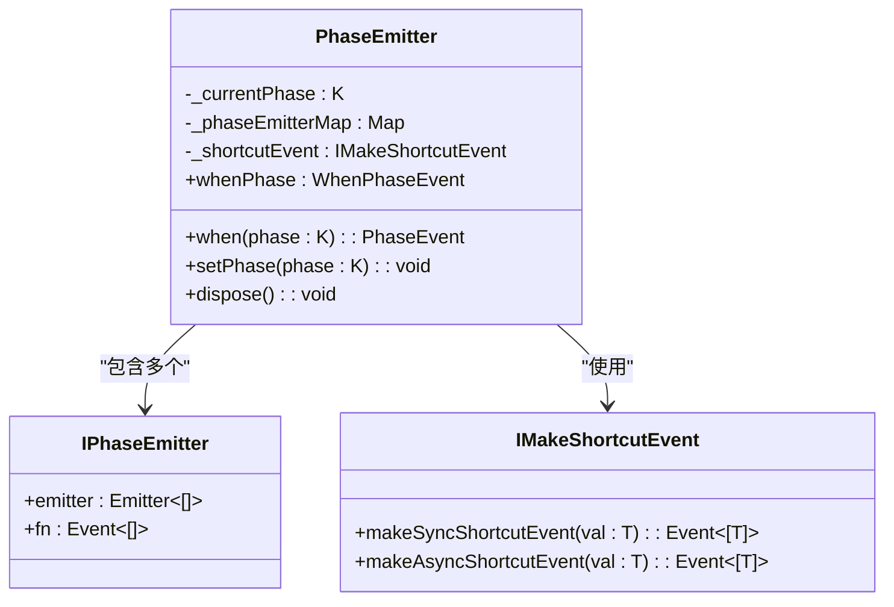
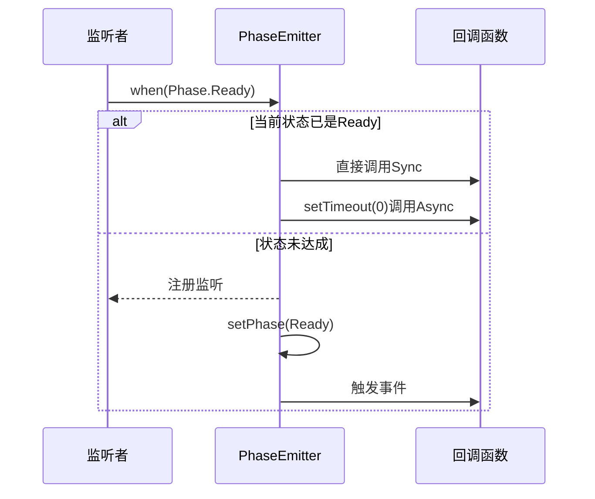
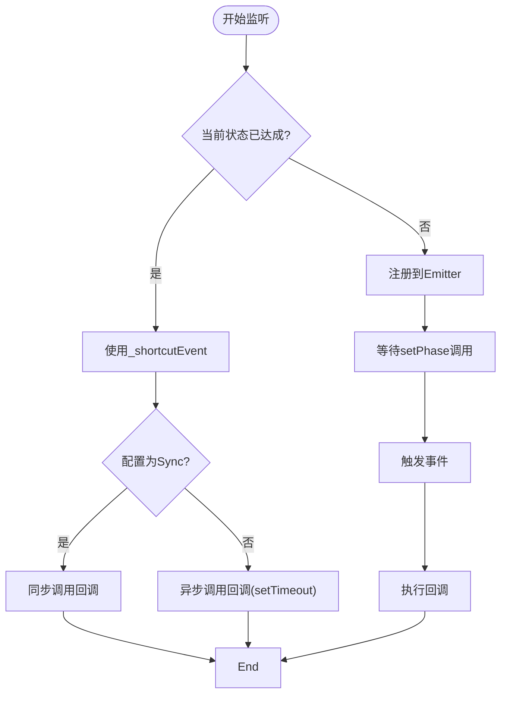

# 状态补发机制

<cite>
**本文档引用的文件**
- [phase-emitter.ts](file://packages/h5-builder/src/bedrock/event/phase-emitter.ts)
- [shortcut-event-utils.ts](file://packages/h5-builder/src/bedrock/event/shortcut-event-utils.ts)
- [emitter.ts](file://packages/h5-builder/src/bedrock/event/emitter.ts)
- [phase-emitter.test.ts](file://packages/h5-builder/src/bedrock/event/phase-emitter.test.ts)
</cite>

## 目录
1. [引言](#引言)
2. [核心设计原理](#核心设计原理)
3. [状态补发的实现机制](#状态补发的实现机制)
4. [同步与异步ShortcutEvent对比](#同步与异步shortcutevent对比)
5. [时序模糊风险分析](#时序模糊风险分析)
6. [使用建议与最佳实践](#使用建议与最佳实践)
7. [测试用例分析](#测试用例分析)
8. [结论](#结论)

## 引言
PhaseEmitter 是一种专门用于管理状态生命周期的事件触发器，其核心特性之一是“状态补发”机制。当监听发生时，若当前状态已满足条件，则通过 `_shortcutEvent` 立即执行回调，从而实现事件补发效果。这一机制在简化代码逻辑的同时，也带来了潜在的时序模糊问题。本文将深入剖析其设计原理、实现方式及使用风险。

**Section sources**
- [phase-emitter.ts](file://packages/h5-builder/src/bedrock/event/phase-emitter.ts#L1-L210)

## 核心设计原理
PhaseEmitter 的设计目标是明确事件类型为生命周期扭转，并支持状态补发。其关键特性包括：
- 事件参数为空，仅表示状态变更。
- 支持对已达成状态的监听进行“补发”，即立即触发回调。
- 提供 `whenPhase` 和 `when` 接口，允许监听特定状态或阶段变更。

该机制适用于如取消令牌（CancellationSourceToken）等场景，能够在状态已达成时自动触发后续逻辑，避免显式判断。



**Diagram sources**
- [phase-emitter.ts](file://packages/h5-builder/src/bedrock/event/phase-emitter.ts#L112-L210)

## 状态补发的实现机制
当调用 `when` 或 `whenPhase` 方法监听某个状态时，PhaseEmitter 会检查当前状态是否已满足条件。如果满足，则直接通过 `_shortcutEvent` 触发回调，而非等待未来状态变更。

具体流程如下：
1. 调用 `when(phase)` 或 `whenPhase(phase, listener)`。
2. 检查 `this._currentPhase === phase`。
3. 若相等，调用 `_shortcutEvent(phase)(listener)` 立即执行。
4. 否则，注册到对应状态的 Emitter 上，等待未来触发。

此机制使得开发者无需编写“先检查状态，再监听”的冗余代码，例如：

```ts
// 原始写法
if (B.isReady) {
  doSomething();
} else {
  B.onReady(doSomething);
}

// 使用状态补发后
B.onReady(doSomething); // 自动处理已就绪情况
```

**Section sources**
- [phase-emitter.ts](file://packages/h5-builder/src/bedrock/event/phase-emitter.ts#L147-L155)
- [phase-emitter.ts](file://packages/h5-builder/src/bedrock/event/phase-emitter.ts#L160-L169)

## 同步与异步ShortcutEvent对比
PhaseEmitter 支持两种模式的事件补发：同步（Sync）与异步（Async），由配置项 `shortcutEventMode` 控制。

### 实现差异
| 特性 | 同步模式 (`Sync`) | 异步模式 (`Async`) |
|------|------------------|-------------------|
| 执行方式 | 直接调用回调函数 | 使用 `setTimeout(0)` 延迟执行 |
| 调用栈 | 回调在监听时同步执行 | 回调在下一个事件循环中执行 |
| 适用场景 | 需要立即响应的逻辑 | 避免阻塞当前执行流 |



**Diagram sources**
- [shortcut-event-utils.ts](file://packages/h5-builder/src/bedrock/event/shortcut-event-utils.ts#L8-L32)
- [phase-emitter.ts](file://packages/h5-builder/src/bedrock/event/phase-emitter.ts#L126-L128)

### 源码实现
- **同步模式**：`makeSyncShortcutEvent` 在监听时立即执行 `callback(val)`。
- **异步模式**：`makeAsyncShortcutEvent` 使用 `setTimeout(() => callback(val), 0)` 延迟执行，确保回调在事件循环的下一个阶段运行。

异步模式有助于避免在构造函数中监听时立即执行回调导致的副作用，提升执行顺序的可预测性。

**Section sources**
- [shortcut-event-utils.ts](file://packages/h5-builder/src/bedrock/event/shortcut-event-utils.ts#L8-L32)

## 时序模糊风险分析
尽管状态补发简化了代码，但它破坏了事件系统的“因果时序”保证，可能导致严重的依赖问题。

### 风险场景
假设模块 A 依赖模块 B 的状态变更事件：

**正常流程（无补发）：**
```
B初始化 → A初始化 → B触发事件 → A监听并响应
```
此时 A 明确知道事件是在其初始化**之后**触发的。

**异常流程（有补发）：**
```
B初始化 → B触发事件 → A初始化 → A监听并“补发”响应
```
此时 A 无法判断事件是在其初始化**之前还是之后**触发的，导致：
1. **信息丢失**：无法区分事件是实时触发还是补发。
2. **响应延迟**：B 已进入新状态，但 A 响应滞后，可能影响业务逻辑。

### 示例说明
```ts
// B模块
class B {
  phaseEmitter = new PhaseEmitter(Phase.Initial);
  onReady = this.phaseEmitter.when(Phase.Ready);
}

// A模块
class A {
  constructor(b: B) {
    b.onReady(() => {
      console.log("B已就绪");
      // 但无法判断这是实时事件还是补发事件
    });
  }
}
```

若 B 在 A 创建前已完成初始化，则 A 的回调会被立即补发，但 A 无法感知这一时序差异。

**Section sources**
- [phase-emitter.ts](file://packages/h5-builder/src/bedrock/event/phase-emitter.ts#L58-L70)

## 使用建议与最佳实践
鉴于状态补发带来的时序模糊风险，建议谨慎使用该特性。

### 适用场景
- **状态确认型事件**：如“资源加载完成”、“连接建立”等，只要状态达成即可响应，无需关心触发时机。
- **幂等性操作**：回调函数可重复执行而不产生副作用。

### 不适用场景
- **强时序依赖**：模块间存在严格初始化顺序依赖。
- **非幂等操作**：如发送网络请求、修改全局状态等。

### 最佳实践
1. **优先使用 `onPhaseChange`**：若需感知状态变更而非补发，应使用 `event` 接口。
2. **明确文档说明**：公开 API 时应注明是否支持状态补发。
3. **默认使用异步模式**：避免在构造函数中产生意外的同步调用。



**Diagram sources**
- [phase-emitter.ts](file://packages/h5-builder/src/bedrock/event/phase-emitter.ts#L147-L155)
- [shortcut-event-utils.ts](file://packages/h5-builder/src/bedrock/event/shortcut-event-utils.ts#L8-L32)

## 测试用例分析
通过 `phase-emitter.test.ts` 中的测试用例可以验证状态补发的行为：

- **test('state replay 1')**：验证当状态已变为 C 时，后续监听 C 的事件会被补发。
- **test('state replay 2')**：验证最终状态决定补发内容，B 状态不会补发。
- **test('state replay 4')**：验证同时监听和触发时，补发与正常事件均可执行。
- **test('repeated transitions do not trigger')**：验证重复状态变更不会触发事件。

这些测试确保了状态补发逻辑的正确性和健壮性。

**Section sources**
- [phase-emitter.test.ts](file://packages/h5-builder/src/bedrock/event/phase-emitter.test.ts#L87-L160)

## 结论
PhaseEmitter 的状态补发机制通过 `_shortcutEvent` 实现了监听时的即时回调，极大简化了状态监听代码。然而，该机制打破了事件系统的时序确定性，可能导致模块间依赖关系混乱。开发者应在充分理解其同步与异步实现差异的基础上，仅在幂等且无强时序要求的场景中使用该特性，并优先考虑使用异步模式以提高可预测性。