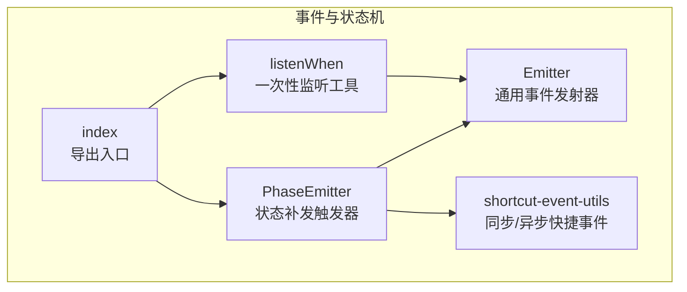
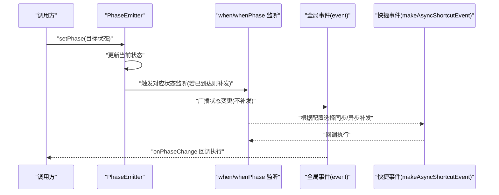
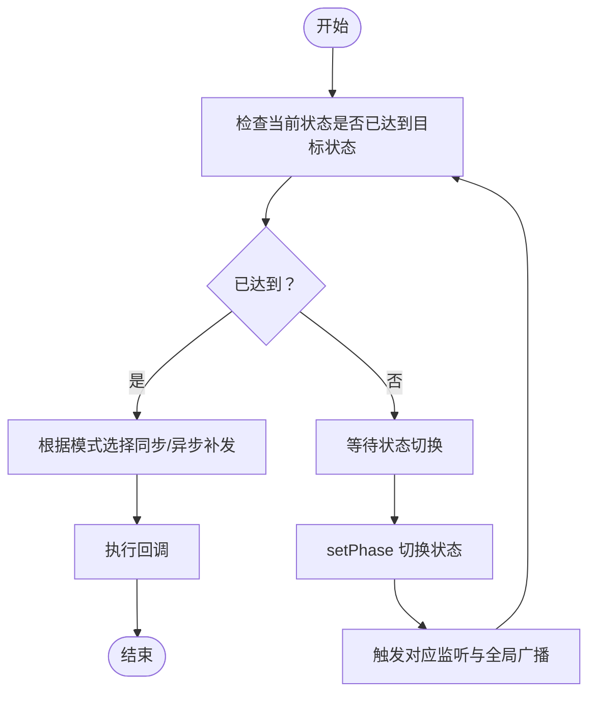
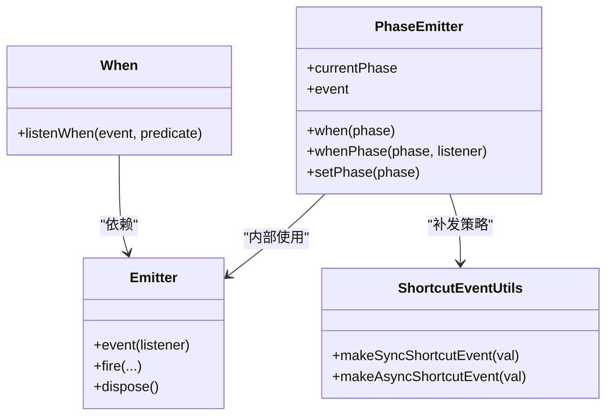
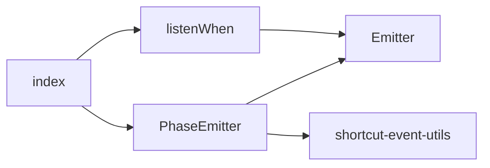

# 状态补发的风险与最佳实践

<cite>
**本文引用的文件**
- [packages/h5-builder/src/bedrock/event/phase-emitter.ts](file://packages/h5-builder/src/bedrock/event/phase-emitter.ts)
- [packages/h5-builder/src/bedrock/event/phase-emitter.test.ts](file://packages/h5-builder/src/bedrock/event/phase-emitter.test.ts)
- [packages/h5-builder/src/bedrock/event/emitter.ts](file://packages/h5-builder/src/bedrock/event/emitter.ts)
- [packages/h5-builder/src/bedrock/event/shortcut-event-utils.ts](file://packages/h5-builder/src/bedrock/event/shortcut-event-utils.ts)
- [packages/h5-builder/src/bedrock/event/when.ts](file://packages/h5-builder/src/bedrock/event/when.ts)
- [packages/h5-builder/src/bedrock/event/index.ts](file://packages/h5-builder/src/bedrock/event/index.ts)
</cite>

## 目录
1. [引言](#引言)
2. [项目结构](#项目结构)
3. [核心组件](#核心组件)
4. [架构总览](#架构总览)
5. [详细组件分析](#详细组件分析)
6. [依赖分析](#依赖分析)
7. [性能考量](#性能考量)
8. [故障排查指南](#故障排查指南)
9. [结论](#结论)
10. [附录](#附录)

## 引言
本文件系统性总结“状态补发”机制带来的三大风险，并结合源码注释与测试用例，提出最佳实践建议：
- 风险一：事件时序模糊，无法判断回调是在状态变更前还是变更后注册；
- 风险二：隐式依赖导致模块耦合度上升；
- 风险三：多次补发可能引发重复执行。
并给出最佳实践：优先使用 onPhaseChange 监听状态变更而非依赖补发；若必须使用补发，应在文档中明确声明其非幂等性；避免在补发回调中再次触发状态变更，防止循环依赖；强调该特性应谨慎使用，仅限于简化“状态已就绪”的检查逻辑。

## 项目结构
本次分析聚焦于事件与状态机相关模块，核心位于 h5-builder 包的 bedrock/event 子目录，包含：
- PhaseEmitter：状态补发事件触发器
- Emitter：通用事件发射器
- shortcut-event-utils：同步/异步快捷事件工具
- when：一次性监听工具
- index：导出入口

图表来源
- [packages/h5-builder/src/bedrock/event/phase-emitter.ts](file://packages/h5-builder/src/bedrock/event/phase-emitter.ts#L1-L209)
- [packages/h5-builder/src/bedrock/event/emitter.ts](file://packages/h5-builder/src/bedrock/event/emitter.ts#L1-L163)
- [packages/h5-builder/src/bedrock/event/shortcut-event-utils.ts](file://packages/h5-builder/src/bedrock/event/shortcut-event-utils.ts#L1-L34)
- [packages/h5-builder/src/bedrock/event/when.ts](file://packages/h5-builder/src/bedrock/event/when.ts#L1-L41)
- [packages/h5-builder/src/bedrock/event/index.ts](file://packages/h5-builder/src/bedrock/event/index.ts#L1-L34)

章节来源
- [packages/h5-builder/src/bedrock/event/index.ts](file://packages/h5-builder/src/bedrock/event/index.ts#L1-L34)

## 核心组件
- PhaseEmitter：提供状态扭转事件的监听与补发能力，支持 when/whenPhase/onPhaseChange 三种监听方式；当监听发生在状态已到达之后，将进行补发（同步或异步）。
- Emitter：通用事件发射器，负责监听注册、回调执行与错误处理。
- shortcut-event-utils：提供 makeSyncShortcutEvent 和 makeAsyncShortcutEvent，分别用于同步与异步补发。
- listenWhen：一次性监听工具，满足条件后自动解绑，有助于避免重复执行。

章节来源
- [packages/h5-builder/src/bedrock/event/phase-emitter.ts](file://packages/h5-builder/src/bedrock/event/phase-emitter.ts#L1-L209)
- [packages/h5-builder/src/bedrock/event/emitter.ts](file://packages/h5-builder/src/bedrock/event/emitter.ts#L1-L163)
- [packages/h5-builder/src/bedrock/event/shortcut-event-utils.ts](file://packages/h5-builder/src/bedrock/event/shortcut-event-utils.ts#L1-L34)
- [packages/h5-builder/src/bedrock/event/when.ts](file://packages/h5-builder/src/bedrock/event/when.ts#L1-L41)

## 架构总览
下图展示 PhaseEmitter 的关键行为：状态切换时触发对应补发，以及 onPhaseChange 全局变更广播。

图表来源
- [packages/h5-builder/src/bedrock/event/phase-emitter.ts](file://packages/h5-builder/src/bedrock/event/phase-emitter.ts#L140-L187)
- [packages/h5-builder/src/bedrock/event/shortcut-event-utils.ts](file://packages/h5-builder/src/bedrock/event/shortcut-event-utils.ts#L8-L32)

## 详细组件分析

### PhaseEmitter 补发机制与风险
- 补发触发点：当监听者在状态已到达之后注册时，会通过快捷事件进行补发（同步或异步），以保证“状态已就绪”的检查逻辑被简化。
- 时序模糊风险：补发使得回调可能在状态变更之前或之后注册，均能收到回调，导致监听者无法区分“是否在变更前注册”，从而影响业务时序假设。
- 隐式依赖风险：补发使监听者对“历史状态”产生隐式依赖，模块间耦合度上升，因为监听者不再只关心“未来状态”，而是依赖“过去状态是否已发生”。
- 重复执行风险：多次监听同一状态或在短时间内多次触发状态切换，可能导致补发多次执行，进而引发重复逻辑。

图表来源
- [packages/h5-builder/src/bedrock/event/phase-emitter.ts](file://packages/h5-builder/src/bedrock/event/phase-emitter.ts#L140-L209)
- [packages/h5-builder/src/bedrock/event/shortcut-event-utils.ts](file://packages/h5-builder/src/bedrock/event/shortcut-event-utils.ts#L8-L32)

章节来源
- [packages/h5-builder/src/bedrock/event/phase-emitter.ts](file://packages/h5-builder/src/bedrock/event/phase-emitter.ts#L50-L111)
- [packages/h5-builder/src/bedrock/event/phase-emitter.test.ts](file://packages/h5-builder/src/bedrock/event/phase-emitter.test.ts#L87-L140)

### onPhaseChange vs when/whenPhase 的区别
- onPhaseChange（event）：全局广播状态变更，不进行补发，适合严格时序与幂等场景。
- when/whenPhase：针对特定状态进行监听，若监听时状态已到达则进行补发，适合“状态已就绪”的快速接入。

图表来源
- [packages/h5-builder/src/bedrock/event/phase-emitter.ts](file://packages/h5-builder/src/bedrock/event/phase-emitter.ts#L112-L209)
- [packages/h5-builder/src/bedrock/event/emitter.ts](file://packages/h5-builder/src/bedrock/event/emitter.ts#L78-L163)
- [packages/h5-builder/src/bedrock/event/shortcut-event-utils.ts](file://packages/h5-builder/src/bedrock/event/shortcut-event-utils.ts#L1-L34)
- [packages/h5-builder/src/bedrock/event/when.ts](file://packages/h5-builder/src/bedrock/event/when.ts#L1-L41)

章节来源
- [packages/h5-builder/src/bedrock/event/phase-emitter.ts](file://packages/h5-builder/src/bedrock/event/phase-emitter.ts#L135-L187)
- [packages/h5-builder/src/bedrock/event/phase-emitter.test.ts](file://packages/h5-builder/src/bedrock/event/phase-emitter.test.ts#L71-L85)

### 测试用例揭示的风险与行为
- 补发行为验证：当监听发生在状态已到达之后，仅对最终状态进行补发，且补发可为同步或异步。
- 无补发行为验证：监听 onPhaseChange（全局变更）时，不会进行补发。
- 多次触发与重复执行：多次监听同一状态或在短时间内多次触发状态切换，可能导致补发多次执行，需注意幂等性。
- 无效状态切换：若状态检查器拒绝无效切换，将抛出异常，避免错误状态流转。

章节来源
- [packages/h5-builder/src/bedrock/event/phase-emitter.test.ts](file://packages/h5-builder/src/bedrock/event/phase-emitter.test.ts#L87-L183)
- [packages/h5-builder/src/bedrock/event/phase-emitter.test.ts](file://packages/h5-builder/src/bedrock/event/phase-emitter.test.ts#L185-L212)

## 依赖分析
- PhaseEmitter 依赖 Emitter 作为底层事件基础设施，并通过 shortcut-event-utils 提供补发策略（同步/异步）。
- listenWhen 作为一次性监听工具，与 Emitter 协作，避免重复执行。
- index 汇总导出，便于上层模块统一引入。

图表来源
- [packages/h5-builder/src/bedrock/event/phase-emitter.ts](file://packages/h5-builder/src/bedrock/event/phase-emitter.ts#L1-L209)
- [packages/h5-builder/src/bedrock/event/emitter.ts](file://packages/h5-builder/src/bedrock/event/emitter.ts#L1-L163)
- [packages/h5-builder/src/bedrock/event/shortcut-event-utils.ts](file://packages/h5-builder/src/bedrock/event/shortcut-event-utils.ts#L1-L34)
- [packages/h5-builder/src/bedrock/event/when.ts](file://packages/h5-builder/src/bedrock/event/when.ts#L1-L41)
- [packages/h5-builder/src/bedrock/event/index.ts](file://packages/h5-builder/src/bedrock/event/index.ts#L1-L34)

章节来源
- [packages/h5-builder/src/bedrock/event/index.ts](file://packages/h5-builder/src/bedrock/event/index.ts#L1-L34)

## 性能考量
- 补发模式选择：同步补发可减少一次调度开销，但可能阻塞当前调用栈；异步补发通过微任务/定时器延迟执行，避免阻塞，但增加调度成本。
- 监听器数量：Emitter 在单监听器时直接调用回调，避免队列开销；多监听器时使用队列批量投递，确保一致性。
- 重复执行风险：多次补发可能导致回调被多次执行，需在回调中实现幂等或使用 listenWhen 进行一次性监听。

章节来源
- [packages/h5-builder/src/bedrock/event/shortcut-event-utils.ts](file://packages/h5-builder/src/bedrock/event/shortcut-event-utils.ts#L8-L32)
- [packages/h5-builder/src/bedrock/event/emitter.ts](file://packages/h5-builder/src/bedrock/event/emitter.ts#L136-L163)
- [packages/h5-builder/src/bedrock/event/when.ts](file://packages/h5-builder/src/bedrock/event/when.ts#L1-L41)

## 故障排查指南
- 症状：回调在状态变更前/后注册都能触发，难以判断时序
  - 排查：优先使用 onPhaseChange（event）监听全局状态变更，避免依赖补发；若必须使用补发，请在文档中明确其非幂等性。
  - 参考：[packages/h5-builder/src/bedrock/event/phase-emitter.ts](file://packages/h5-builder/src/bedrock/event/phase-emitter.ts#L50-L111)
- 症状：模块间耦合度升高
  - 排查：避免在补发回调中再次触发状态变更，防止循环依赖；将补发仅用于“状态已就绪”的简化检查。
  - 参考：[packages/h5-builder/src/bedrock/event/phase-emitter.ts](file://packages/h5-builder/src/bedrock/event/phase-emitter.ts#L50-L111)
- 症状：重复执行导致副作用
  - 排查：在回调中实现幂等；必要时使用 listenWhen 将一次性监听与补发结合，避免重复执行。
  - 参考：[packages/h5-builder/src/bedrock/event/when.ts](file://packages/h5-builder/src/bedrock/event/when.ts#L1-L41)
- 症状：无效状态切换导致异常
  - 排查：检查状态检查器逻辑，确保状态流转合法；避免逆向切换。
  - 参考：[packages/h5-builder/src/bedrock/event/phase-emitter.test.ts](file://packages/h5-builder/src/bedrock/event/phase-emitter.test.ts#L197-L212)

章节来源
- [packages/h5-builder/src/bedrock/event/phase-emitter.ts](file://packages/h5-builder/src/bedrock/event/phase-emitter.ts#L50-L111)
- [packages/h5-builder/src/bedrock/event/when.ts](file://packages/h5-builder/src/bedrock/event/when.ts#L1-L41)
- [packages/h5-builder/src/bedrock/event/phase-emitter.test.ts](file://packages/h5-builder/src/bedrock/event/phase-emitter.test.ts#L197-L212)

## 结论
- 状态补发在“状态已就绪”检查场景具有显著便利性，但其带来的时序模糊、隐式依赖与重复执行风险不可忽视。
- 最佳实践：优先使用 onPhaseChange 监听状态变更；若必须使用补发，务必在文档中声明其非幂等性；避免在补发回调中再次触发状态变更；谨慎使用，仅限于简化“状态已就绪”的检查逻辑。

## 附录
- 关键路径参考
  - 补发与全局广播：[packages/h5-builder/src/bedrock/event/phase-emitter.ts](file://packages/h5-builder/src/bedrock/event/phase-emitter.ts#L140-L187)
  - 同步/异步补发策略：[packages/h5-builder/src/bedrock/event/shortcut-event-utils.ts](file://packages/h5-builder/src/bedrock/event/shortcut-event-utils.ts#L8-L32)
  - 一次性监听工具：[packages/h5-builder/src/bedrock/event/when.ts](file://packages/h5-builder/src/bedrock/event/when.ts#L1-L41)
  - 导出入口：[packages/h5-builder/src/bedrock/event/index.ts](file://packages/h5-builder/src/bedrock/event/index.ts#L1-L34)