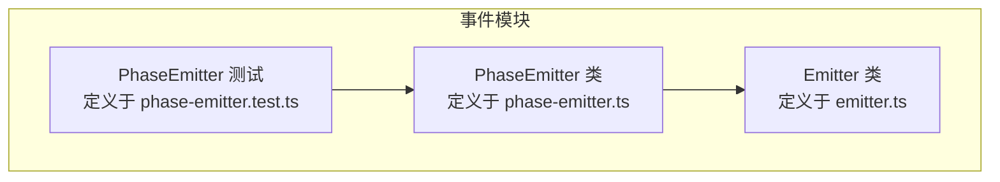
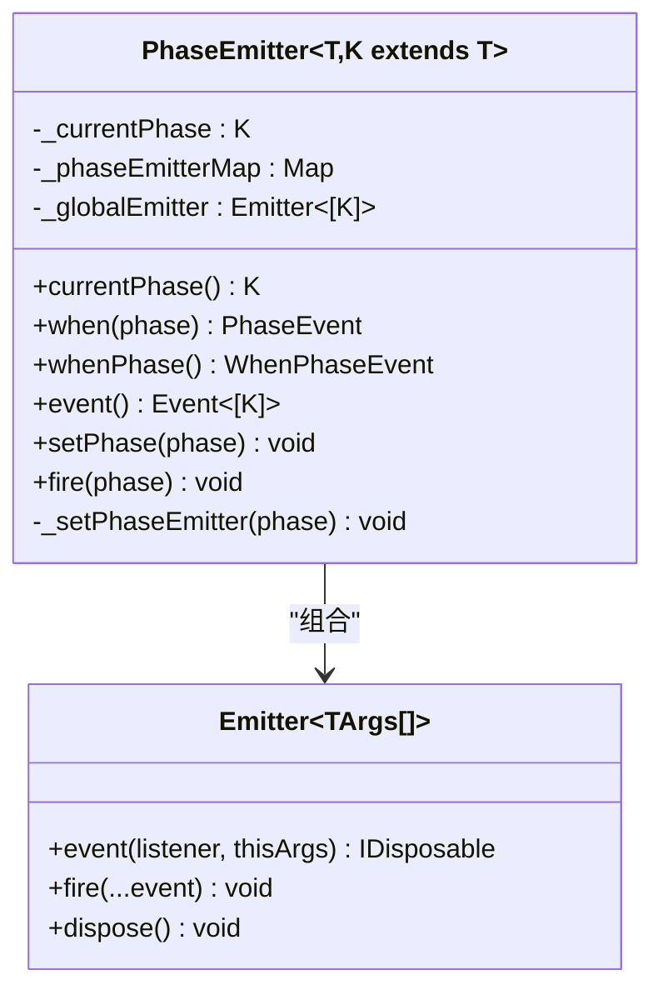
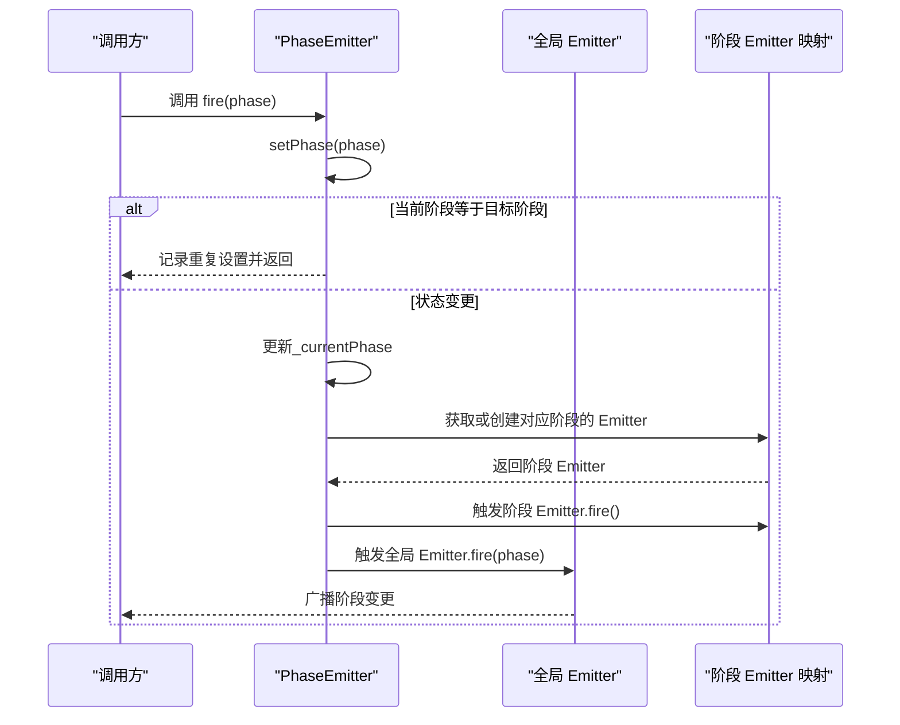
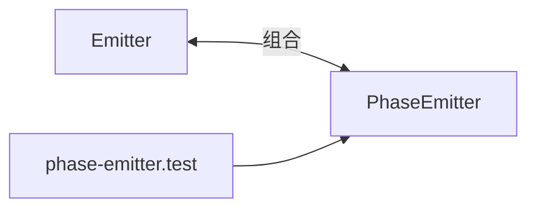

# fire方法兼容性设计

<cite>
**本文引用的文件**
- [phase-emitter.ts](file://packages/h5-builder/src/bedrock/event/phase-emitter.ts)
- [emitter.ts](file://packages/h5-builder/src/bedrock/event/emitter.ts)
- [phase-emitter.test.ts](file://packages/h5-builder/src/bedrock/event/phase-emitter.test.ts)
</cite>

## 目录
1. [引言](#引言)
2. [项目结构](#项目结构)
3. [核心组件](#核心组件)
4. [架构总览](#架构总览)
5. [详细组件分析](#详细组件分析)
6. [依赖分析](#依赖分析)
7. [性能考虑](#性能考虑)
8. [故障排查指南](#故障排查指南)
9. [结论](#结论)
10. [附录](#附录)

## 引言
本文件聚焦于 PhaseEmitter 中 fire(phase: K) 方法作为 setPhase 别名的兼容性设计。该设计通过在注释中标明“该接口为了和emitter对齐，优先使用setPhase”，并标注 @deprecated，旨在降低开发者认知成本、保持与标准 Emitter 接口一致的同时，为未来演进预留空间。本文将系统解析 fire 的实现、与 setPhase 的关系、注释背后的动机、潜在风险及迁移路径。

## 项目结构
本次分析涉及的文件位于 h5-builder 包的事件子系统中，核心为 PhaseEmitter 与 Emitter 两个类，以及配套测试用例。

图表来源
- [phase-emitter.ts](file://packages/h5-builder/src/bedrock/event/phase-emitter.ts#L112-L209)
- [emitter.ts](file://packages/h5-builder/src/bedrock/event/emitter.ts#L78-L163)
- [phase-emitter.test.ts](file://packages/h5-builder/src/bedrock/event/phase-emitter.test.ts#L1-L213)

章节来源
- [phase-emitter.ts](file://packages/h5-builder/src/bedrock/event/phase-emitter.ts#L112-L209)
- [emitter.ts](file://packages/h5-builder/src/bedrock/event/emitter.ts#L78-L163)
- [phase-emitter.test.ts](file://packages/h5-builder/src/bedrock/event/phase-emitter.test.ts#L1-L213)

## 核心组件
- PhaseEmitter：面向阶段状态的事件发射器，支持按阶段监听、状态变更广播、以及事件补发等特性。
- Emitter：通用事件发射器，提供事件订阅、派发、错误处理等基础能力。
- 测试用例：验证 PhaseEmitter 的监听、补发、状态变更广播、无效状态转换等行为。

章节来源
- [phase-emitter.ts](file://packages/h5-builder/src/bedrock/event/phase-emitter.ts#L112-L209)
- [emitter.ts](file://packages/h5-builder/src/bedrock/event/emitter.ts#L78-L163)
- [phase-emitter.test.ts](file://packages/h5-builder/src/bedrock/event/phase-emitter.test.ts#L1-L213)

## 架构总览
PhaseEmitter 在内部组合了 Emitter，用于：
- 按阶段的事件发射：当进入某一阶段时，触发对应阶段的事件。
- 全局阶段变更事件：向所有监听者广播当前阶段。

图表来源
- [phase-emitter.ts](file://packages/h5-builder/src/bedrock/event/phase-emitter.ts#L112-L209)
- [emitter.ts](file://packages/h5-builder/src/bedrock/event/emitter.ts#L78-L163)

## 详细组件分析

### fire(phase: K) 方法的兼容性设计
- 实现方式：fire 内部仅调用 this.setPhase(phase)，即 fire 是 setPhase 的别名。
- 注释动机：注释明确指出“该接口为了和emitter对齐，优先使用setPhase”，表明设计目标是让 PhaseEmitter 的 API 与通用 Emitter 的命名风格保持一致，从而降低学习成本。
- 标记 @deprecated：通过 @deprecated 提示未来版本可能移除该别名方法，引导开发者使用语义更清晰的 setPhase。

图表来源
- [phase-emitter.ts](file://packages/h5-builder/src/bedrock/event/phase-emitter.ts#L178-L195)

章节来源
- [phase-emitter.ts](file://packages/h5-builder/src/bedrock/event/phase-emitter.ts#L178-L195)

### 与 Emitter 的一致性与认知成本
- 与 Emitter 对齐：通用 Emitter 的 API 通常以 fire(...) 表达“触发事件”的语义；而 PhaseEmitter 的 fire(phase) 通过别名形式保留了这种命名习惯，便于从通用事件模型迁移到阶段状态模型时的无缝衔接。
- 语义清晰化：setPhase 更明确地表达“设置阶段”的意图，避免“fire”在阶段语境下的歧义，提升代码可读性与可维护性。

章节来源
- [phase-emitter.ts](file://packages/h5-builder/src/bedrock/event/phase-emitter.ts#L189-L195)
- [emitter.ts](file://packages/h5-builder/src/bedrock/event/emitter.ts#L136-L161)

### 事件补发与安全边界
- 补发机制：当监听者在状态已到达之后才注册，PhaseEmitter 会根据当前阶段进行补发，以保证逻辑正确性。
- 安全提醒：文档明确指出事件补发可能破坏依赖关系的确定性，应谨慎使用，避免在补发场景下产生难以追踪的副作用。

章节来源
- [phase-emitter.ts](file://packages/h5-builder/src/bedrock/event/phase-emitter.ts#L50-L111)

### 测试验证的行为
- 监听与补发：测试覆盖了按阶段监听、按阶段补发、监听变更不补发等场景。
- 无效状态转换：当状态检查器拒绝转换时，抛出异常，确保状态机的正确性。
- 重复转换：重复设置相同阶段会被记录并忽略，避免冗余触发。

章节来源
- [phase-emitter.test.ts](file://packages/h5-builder/src/bedrock/event/phase-emitter.test.ts#L1-L213)

## 依赖分析
- PhaseEmitter 依赖 Emitter：通过组合 Emitter 实现阶段事件与全局事件的触发。
- 测试依赖 PhaseEmitter：通过实例化 PhaseEmitter 并调用 setPhase 验证行为，未直接使用 fire，体现对 setPhase 的优先推荐。

图表来源
- [phase-emitter.ts](file://packages/h5-builder/src/bedrock/event/phase-emitter.ts#L112-L209)
- [emitter.ts](file://packages/h5-builder/src/bedrock/event/emitter.ts#L78-L163)
- [phase-emitter.test.ts](file://packages/h5-builder/src/bedrock/event/phase-emitter.test.ts#L1-L213)

章节来源
- [phase-emitter.ts](file://packages/h5-builder/src/bedrock/event/phase-emitter.ts#L112-L209)
- [emitter.ts](file://packages/h5-builder/src/bedrock/event/emitter.ts#L78-L163)
- [phase-emitter.test.ts](file://packages/h5-builder/src/bedrock/event/phase-emitter.test.ts#L1-L213)

## 性能考虑
- fire 与 setPhase 的性能等价：fire 内部委托给 setPhase，二者在性能上无差异。
- Emitter.fire 的优化：当只有一个监听者时，Emitter 采用直接调用的方式，避免队列开销；多个监听者时使用队列批量派发，保证一致性与错误隔离。
- 事件补发的成本：补发会增加额外的监听注册与触发成本，应在需要时谨慎启用。

章节来源
- [emitter.ts](file://packages/h5-builder/src/bedrock/event/emitter.ts#L136-L161)
- [phase-emitter.ts](file://packages/h5-builder/src/bedrock/event/phase-emitter.ts#L178-L195)

## 故障排查指南
- 重复设置同一阶段：会记录警告并忽略，检查业务是否有多余的触发。
- 无效状态转换：状态检查器拒绝转换时会抛出异常，确认状态转换顺序是否符合约束。
- 事件补发导致的时序问题：若依赖严格的初始化顺序，需避免在补发场景下产生隐式依赖。

章节来源
- [phase-emitter.ts](file://packages/h5-builder/src/bedrock/event/phase-emitter.ts#L178-L195)
- [phase-emitter.test.ts](file://packages/h5-builder/src/bedrock/event/phase-emitter.test.ts#L185-L212)

## 结论
fire(phase: K) 作为 setPhase 的兼容性别名，通过与 Emitter 命名风格对齐，降低了学习成本；同时通过 @deprecated 标记提示未来移除，鼓励使用语义更明确的 setPhase。在实际使用中，应优先选择 setPhase，并在需要补发的场景下审慎评估其带来的时序与依赖风险。

## 附录

### 迁移指南：从 fire 到 setPhase
- 识别调用点：在代码库中定位所有对 PhaseEmitter.fire 的调用。
- 替换策略：
  - 将 fire(phase) 替换为 setPhase(phase)。
  - 若调用处仅用于触发阶段切换，无需其他改动。
- 回归验证：
  - 运行现有测试，确保行为一致。
  - 特别关注依赖补发的逻辑，确认其在 setPhase 下仍满足预期。
- 清理与收尾：
  - 移除 @deprecated 标记的兼容层调用。
  - 如有必要，更新相关文档与注释，统一使用 setPhase。

章节来源
- [phase-emitter.ts](file://packages/h5-builder/src/bedrock/event/phase-emitter.ts#L189-L195)
- [phase-emitter.test.ts](file://packages/h5-builder/src/bedrock/event/phase-emitter.test.ts#L27-L34)