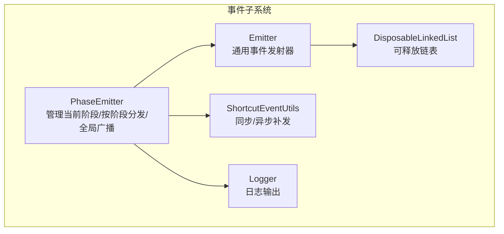
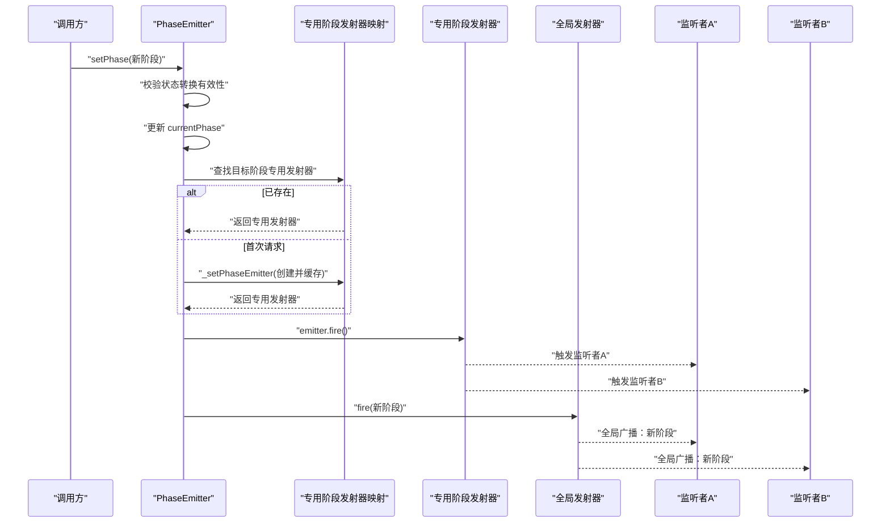
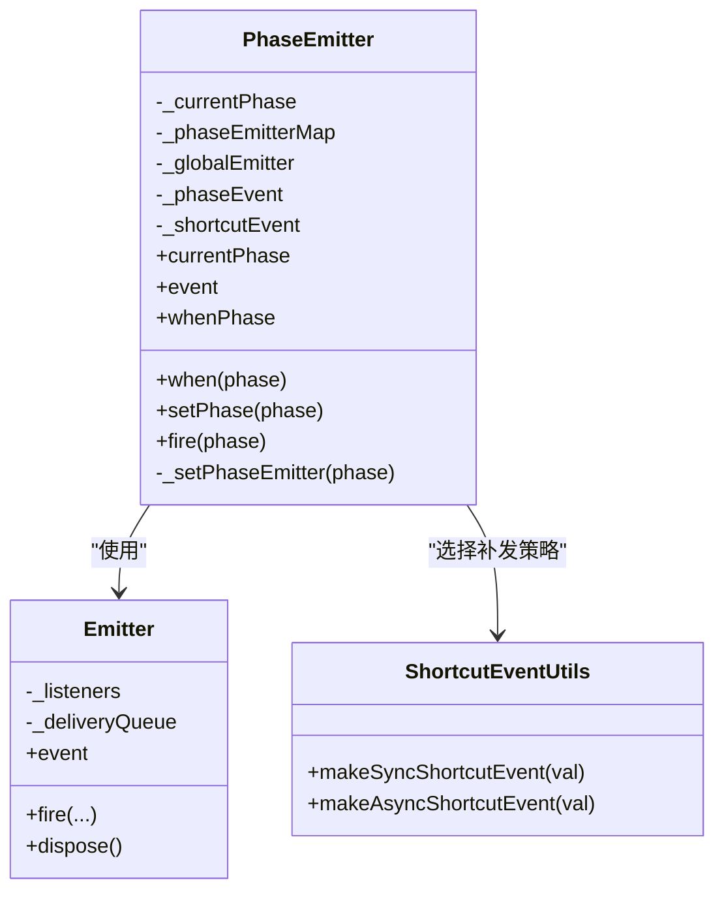
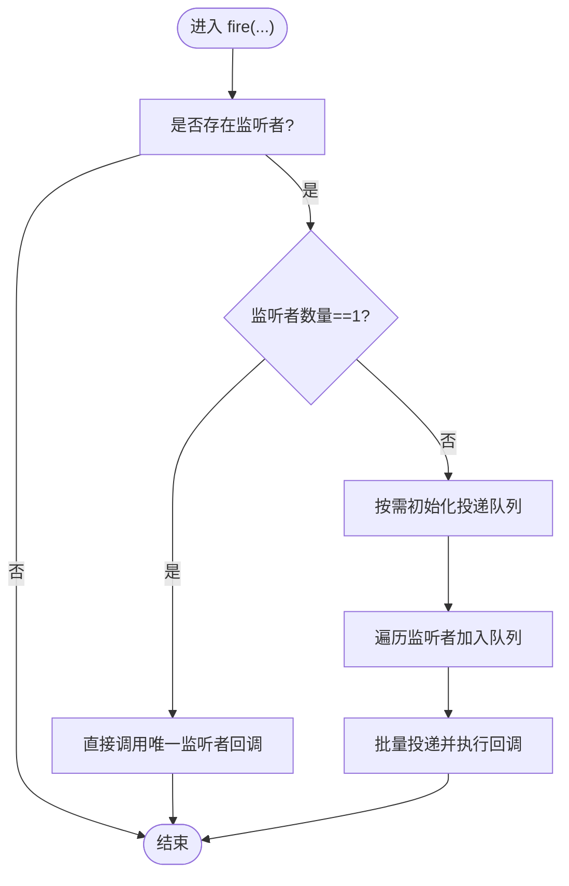
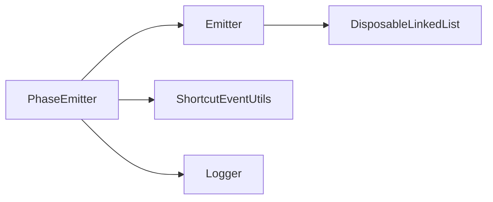

# 事件通知与广播机制

<cite>
**本文引用的文件**
- [packages/h5-builder/src/bedrock/event/phase-emitter.ts](file://packages/h5-builder/src/bedrock/event/phase-emitter.ts)
- [packages/h5-builder/src/bedrock/event/emitter.ts](file://packages/h5-builder/src/bedrock/event/emitter.ts)
- [packages/h5-builder/src/bedrock/event/shortcut-event-utils.ts](file://packages/h5-builder/src/bedrock/event/shortcut-event-utils.ts)
- [packages/h5-builder/src/bedrock/event/phase-emitter.test.ts](file://packages/h5-builder/src/bedrock/event/phase-emitter.test.ts)
- [packages/h5-builder/src/bedrock/event/emitter.test.ts](file://packages/h5-builder/src/bedrock/event/emitter.test.ts)
- [packages/h5-builder/src/bedrock/event/disposable-linked-list.ts](file://packages/h5-builder/src/bedrock/event/disposable-linked-list.ts)
- [packages/h5-builder/src/bedrock/_internal/logger.ts](file://packages/h5-builder/src/bedrock/_internal/logger.ts)
</cite>

## 目录
1. [引言](#引言)
2. [项目结构](#项目结构)
3. [核心组件](#核心组件)
4. [架构总览](#架构总览)
5. [详细组件分析](#详细组件分析)
6. [依赖关系分析](#依赖关系分析)
7. [性能考量](#性能考量)
8. [故障排查指南](#故障排查指南)
9. [结论](#结论)

## 引言
本文件围绕“状态变更后的事件通知机制”展开，重点解释以下内容：
- 当 setPhase 成功更新当前阶段后，系统如何通过专用阶段事件发射器触发目标阶段的监听，并通过全局事件发射器向所有监听者广播状态变更。
- 专用阶段事件发射器的延迟初始化策略：仅在 when 或 whenPhase 首次请求时按需创建。
- 全局发射器与专用阶段发射器的协同工作机制，确保“后注册监听者也能收到状态变更通知”，体现事件补发的设计意图。

## 项目结构
本次文档聚焦于事件子系统中与“阶段状态变更通知”直接相关的文件与实现，主要涉及：
- 阶段事件发射器：负责管理当前阶段、按阶段分发事件、全局广播、以及事件补发。
- 通用事件发射器：提供监听注册、一次性监听、错误处理、异步/同步补发等基础能力。
- 补发工具：提供同步/异步两种补发策略，用于“后注册监听者”能立即收到已发生状态变更的通知。
- 测试用例：验证事件补发、监听时机、状态回放等行为。

图表来源
- [packages/h5-builder/src/bedrock/event/phase-emitter.ts](file://packages/h5-builder/src/bedrock/event/phase-emitter.ts#L112-L209)
- [packages/h5-builder/src/bedrock/event/emitter.ts](file://packages/h5-builder/src/bedrock/event/emitter.ts#L82-L163)
- [packages/h5-builder/src/bedrock/event/disposable-linked-list.ts](file://packages/h5-builder/src/bedrock/event/disposable-linked-list.ts#L1-L30)
- [packages/h5-builder/src/bedrock/event/shortcut-event-utils.ts](file://packages/h5-builder/src/bedrock/event/shortcut-event-utils.ts#L1-L34)
- [packages/h5-builder/src/bedrock/_internal/logger.ts](file://packages/h5-builder/src/bedrock/_internal/logger.ts#L1-L60)

章节来源
- [packages/h5-builder/src/bedrock/event/phase-emitter.ts](file://packages/h5-builder/src/bedrock/event/phase-emitter.ts#L112-L209)
- [packages/h5-builder/src/bedrock/event/emitter.ts](file://packages/h5-builder/src/bedrock/event/emitter.ts#L82-L163)

## 核心组件
- 阶段事件发射器 PhaseEmitter
  - 管理 currentPhase，提供 when、whenPhase、event 等 API。
  - 按阶段维护专用发射器映射，延迟初始化。
  - setPhase 成功切换后，触发对应阶段专用发射器，并广播全局状态变更。
- 通用事件发射器 Emitter
  - 提供 event 回调注册、一次性监听、错误处理、异步/同步补发等。
  - 内置可释放链表存储监听者，支持安全移除。
- 补发工具 ShortcutEventUtils
  - 同步补发：立即回调。
  - 异步补发：0ms 延迟回调，避免阻塞当前调用栈。
- 测试用例
  - 验证事件补发、监听时机、状态回放、无效状态转换等行为。

章节来源
- [packages/h5-builder/src/bedrock/event/phase-emitter.ts](file://packages/h5-builder/src/bedrock/event/phase-emitter.ts#L112-L209)
- [packages/h5-builder/src/bedrock/event/emitter.ts](file://packages/h5-builder/src/bedrock/event/emitter.ts#L82-L163)
- [packages/h5-builder/src/bedrock/event/shortcut-event-utils.ts](file://packages/h5-builder/src/bedrock/event/shortcut-event-utils.ts#L1-L34)
- [packages/h5-builder/src/bedrock/event/phase-emitter.test.ts](file://packages/h5-builder/src/bedrock/event/phase-emitter.test.ts#L1-L213)
- [packages/h5-builder/src/bedrock/event/emitter.test.ts](file://packages/h5-builder/src/bedrock/event/emitter.test.ts#L1-L192)

## 架构总览
下图展示了 setPhase 成功更新 currentPhase 后的事件通知路径，以及 when/whenPhase 的延迟初始化策略与全局广播协同工作。

图表来源
- [packages/h5-builder/src/bedrock/event/phase-emitter.ts](file://packages/h5-builder/src/bedrock/event/phase-emitter.ts#L178-L187)
- [packages/h5-builder/src/bedrock/event/phase-emitter.ts](file://packages/h5-builder/src/bedrock/event/phase-emitter.ts#L197-L209)

## 详细组件分析

### 阶段事件发射器 PhaseEmitter
- 关键职责
  - 维护 currentPhase，提供 when、whenPhase、event 等 API。
  - 按阶段维护专用发射器映射，延迟初始化。
  - setPhase 成功切换后，触发对应阶段专用发射器，并广播全局状态变更。
- 延迟初始化策略
  - when/whenPhase 首次请求某阶段时，调用内部 _setPhaseEmitter 创建并缓存专用发射器。
  - 若当前阶段即为目标阶段，则通过补发工具立即触发回调，避免等待后续状态切换。
- 全局广播与专用分发
  - 专用发射器仅对“目标阶段到达”这一事件进行分发。
  - 全局发射器对“任意阶段变更”进行广播，便于统一监听所有状态变化。
- 错误与日志
  - 重复设置相同阶段时发出警告。
  - 状态转换检查器用于保证状态机有序性。

图表来源
- [packages/h5-builder/src/bedrock/event/phase-emitter.ts](file://packages/h5-builder/src/bedrock/event/phase-emitter.ts#L112-L209)
- [packages/h5-builder/src/bedrock/event/emitter.ts](file://packages/h5-builder/src/bedrock/event/emitter.ts#L82-L163)
- [packages/h5-builder/src/bedrock/event/shortcut-event-utils.ts](file://packages/h5-builder/src/bedrock/event/shortcut-event-utils.ts#L1-L34)

章节来源
- [packages/h5-builder/src/bedrock/event/phase-emitter.ts](file://packages/h5-builder/src/bedrock/event/phase-emitter.ts#L112-L209)

### 通用事件发射器 Emitter
- 监听注册与移除
  - event 属性惰性创建，首次注册时才初始化内部监听链表。
  - 返回的 IDisposable 支持安全移除，移除后不再接收后续事件。
- 分发策略
  - 单监听者：直接同步调用，避免额外开销。
  - 多监听者：使用事件投递队列，逐个调用监听者回调，异常由错误处理器捕获。
- 错误处理
  - 可配置 onListenerError/onAddListener/onRemoveListener 等钩子，便于统一错误处理与调试。

图表来源
- [packages/h5-builder/src/bedrock/event/emitter.ts](file://packages/h5-builder/src/bedrock/event/emitter.ts#L136-L161)
- [packages/h5-builder/src/bedrock/event/emitter.ts](file://packages/h5-builder/src/bedrock/event/emitter.ts#L43-L76)

章节来源
- [packages/h5-builder/src/bedrock/event/emitter.ts](file://packages/h5-builder/src/bedrock/event/emitter.ts#L82-L163)

### 补发工具 ShortcutEventUtils
- 同步补发：立即回调，适合需要“同步感知”的场景。
- 异步补发：0ms 延迟回调，避免阻塞当前调用栈，适合“稍后执行”的场景。
- 在 when/whenPhase 中，若当前阶段已是目标阶段，则通过补发工具快速触发回调，确保后注册监听者也能收到通知。

章节来源
- [packages/h5-builder/src/bedrock/event/shortcut-event-utils.ts](file://packages/h5-builder/src/bedrock/event/shortcut-event-utils.ts#L1-L34)

### 事件补发与协同机制（测试验证）
- 事件补发设计意图
  - 当监听者在状态已到达之后才注册时，仍能收到“已发生”的状态变更通知。
  - 仅对“状态到达”类事件进行补发；对“状态变更”类事件不进行补发，避免重复触发。
- 测试要点
  - when/whenPhase 对应阶段到达时触发监听。
  - event 全局广播对所有阶段变更进行广播。
  - 多次状态切换、无效状态转换、重复状态切换等边界场景均得到覆盖。

章节来源
- [packages/h5-builder/src/bedrock/event/phase-emitter.test.ts](file://packages/h5-builder/src/bedrock/event/phase-emitter.test.ts#L1-L213)
- [packages/h5-builder/src/bedrock/event/emitter.test.ts](file://packages/h5-builder/src/bedrock/event/emitter.test.ts#L1-L192)

## 依赖关系分析
- PhaseEmitter 依赖
  - Emitter：用于专用阶段发射器与全局发射器的基础能力。
  - ShortcutEventUtils：用于 when/whenPhase 的补发策略选择。
  - Logger：用于重复设置阶段的告警输出。
- Emitter 依赖
  - DisposableLinkedList：用于高效插入与移除监听者节点。
  - 错误处理钩子：onListenerError/onAddListener/onRemoveListener。

图表来源
- [packages/h5-builder/src/bedrock/event/phase-emitter.ts](file://packages/h5-builder/src/bedrock/event/phase-emitter.ts#L112-L209)
- [packages/h5-builder/src/bedrock/event/emitter.ts](file://packages/h5-builder/src/bedrock/event/emitter.ts#L82-L163)
- [packages/h5-builder/src/bedrock/event/disposable-linked-list.ts](file://packages/h5-builder/src/bedrock/event/disposable-linked-list.ts#L1-L30)
- [packages/h5-builder/src/bedrock/event/shortcut-event-utils.ts](file://packages/h5-builder/src/bedrock/event/shortcut-event-utils.ts#L1-L34)
- [packages/h5-builder/src/bedrock/_internal/logger.ts](file://packages/h5-builder/src/bedrock/_internal/logger.ts#L1-L60)

章节来源
- [packages/h5-builder/src/bedrock/event/phase-emitter.ts](file://packages/h5-builder/src/bedrock/event/phase-emitter.ts#L112-L209)
- [packages/h5-builder/src/bedrock/event/emitter.ts](file://packages/h5-builder/src/bedrock/event/emitter.ts#L82-L163)

## 性能考量
- 单监听者优化：当只有一个监听者时，直接同步调用，避免构建投递队列的额外成本。
- 惰性初始化：when/whenPhase 首次请求阶段时才创建专用发射器，降低内存占用与初始化开销。
- 异步补发：默认采用异步补发，避免阻塞当前调用栈，提升整体响应性。
- 可释放链表：监听者注册/移除为 O(1)，支持安全移除，避免泄漏。

章节来源
- [packages/h5-builder/src/bedrock/event/emitter.ts](file://packages/h5-builder/src/bedrock/event/emitter.ts#L136-L161)
- [packages/h5-builder/src/bedrock/event/phase-emitter.ts](file://packages/h5-builder/src/bedrock/event/phase-emitter.ts#L142-L158)
- [packages/h5-builder/src/bedrock/event/disposable-linked-list.ts](file://packages/h5-builder/src/bedrock/event/disposable-linked-list.ts#L1-L30)

## 故障排查指南
- 重复设置相同阶段
  - 现象：控制台出现重复设置阶段的警告。
  - 原因：setPhase 未发生实际状态变化。
  - 处理：避免无意义的重复切换。
- 无效状态转换
  - 现象：设置旧阶段到新阶段失败并抛错。
  - 原因：状态转换检查器拒绝非法顺序。
  - 处理：确保状态机顺序符合预期。
- 监听者未收到通知
  - when/whenPhase：确认监听注册发生在状态切换之后，且当前阶段已是目标阶段，否则需等待状态切换。
  - event 全局广播：确认监听的是全局广播而非专用阶段事件。
- 错误回调未触发
  - 检查 onListenerError 配置与错误处理策略（同步/异步）。
  - 确认监听者回调中未吞掉异常。

章节来源
- [packages/h5-builder/src/bedrock/event/phase-emitter.ts](file://packages/h5-builder/src/bedrock/event/phase-emitter.ts#L178-L187)
- [packages/h5-builder/src/bedrock/event/phase-emitter.test.ts](file://packages/h5-builder/src/bedrock/event/phase-emitter.test.ts#L185-L212)
- [packages/h5-builder/src/bedrock/event/emitter.test.ts](file://packages/h5-builder/src/bedrock/event/emitter.test.ts#L142-L192)

## 结论
- setPhase 成功更新 currentPhase 后，系统通过专用阶段发射器与全局发射器协同完成事件通知：专用发射器负责“目标阶段到达”的即时分发，全局发射器负责“任意阶段变更”的广播。
- 专用发射器采用延迟初始化策略，仅在 when/whenPhase 首次请求时创建，兼顾性能与资源占用。
- 补发机制确保“后注册监听者”也能收到已发生的状态变更通知，但仅对“状态到达”类事件生效，避免对“状态变更”类事件造成重复触发。
- 通用发射器提供完善的监听注册、一次性监听、错误处理与异步/同步补发能力，为阶段事件发射器提供了可靠的基础支撑。