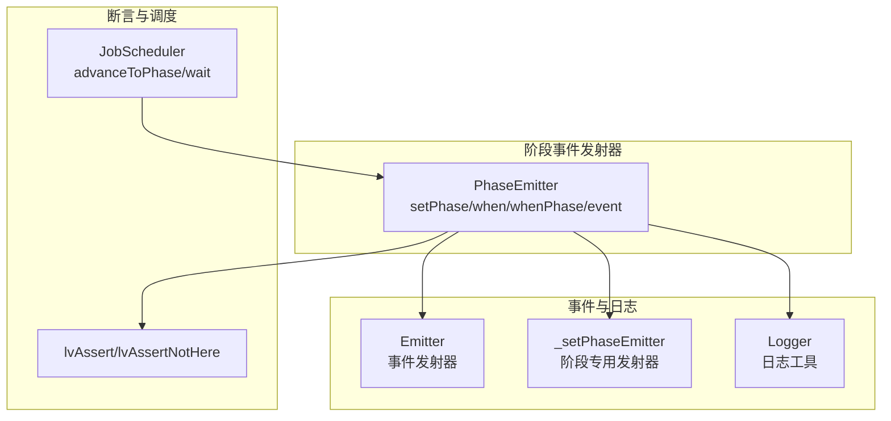
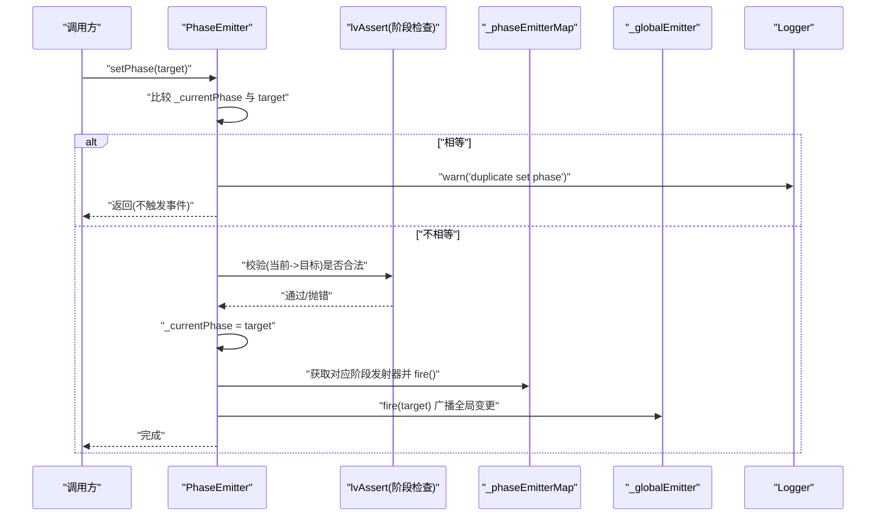
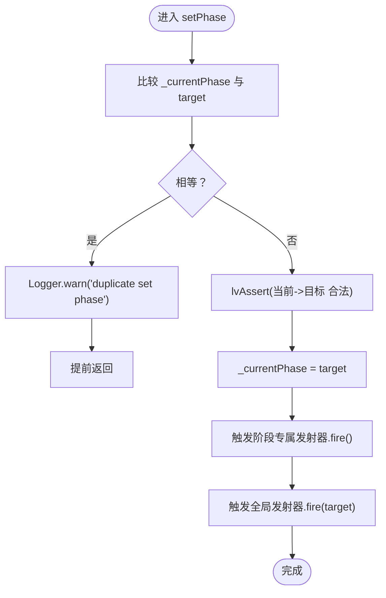
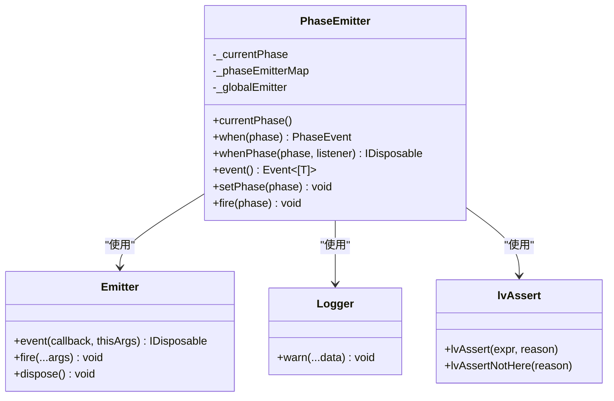

# 状态更新与重复设置处理

<cite>
**本文引用的文件**
- [phase-emitter.ts](file://packages/h5-builder/src/bedrock/event/phase-emitter.ts)
- [logger.ts](file://packages/h5-builder/src/bedrock/_internal/logger.ts)
- [emitter.ts](file://packages/h5-builder/src/bedrock/event/emitter.ts)
- [phase-emitter.test.ts](file://packages/h5-builder/src/bedrock/event/phase-emitter.test.ts)
- [assert.ts](file://packages/h5-builder/src/bedrock/assert/assert.ts)
- [job-scheduler.ts](file://packages/h5-builder/src/bedrock/launch/job-scheduler.ts)
</cite>

## 目录
1. [引言](#引言)
2. [项目结构](#项目结构)
3. [核心组件](#核心组件)
4. [架构总览](#架构总览)
5. [详细组件分析](#详细组件分析)
6. [依赖关系分析](#依赖关系分析)
7. [性能考量](#性能考量)
8. [故障排查指南](#故障排查指南)
9. [结论](#结论)

## 引言
本文件聚焦于状态机“阶段”更新的核心逻辑，围绕 PhaseEmitter 的 setPhase 方法展开，系统性解析以下关键点：
- 重复设置同一阶段时的防护机制与日志输出
- _currentPhase 字段作为状态机当前状态的唯一来源
- setPhase 内部的条件判断、断言校验与事件广播顺序
- 重复设置场景的测试用例与最佳实践建议

## 项目结构
本次分析涉及的文件主要位于事件与日志子系统中，形成“事件发射器 -> 阶段事件发射器 -> 日志记录”的协作链路；同时包含断言工具与调度器，用于约束状态流转合法性与推进阶段。

图表来源
- [phase-emitter.ts](file://packages/h5-builder/src/bedrock/event/phase-emitter.ts#L112-L209)
- [emitter.ts](file://packages/h5-builder/src/bedrock/event/emitter.ts#L82-L163)
- [logger.ts](file://packages/h5-builder/src/bedrock/_internal/logger.ts#L1-L60)
- [assert.ts](file://packages/h5-builder/src/bedrock/assert/assert.ts#L1-L43)
- [job-scheduler.ts](file://packages/h5-builder/src/bedrock/launch/job-scheduler.ts#L61-L122)

章节来源
- [phase-emitter.ts](file://packages/h5-builder/src/bedrock/event/phase-emitter.ts#L112-L209)
- [emitter.ts](file://packages/h5-builder/src/bedrock/event/emitter.ts#L82-L163)
- [logger.ts](file://packages/h5-builder/src/bedrock/_internal/logger.ts#L1-L60)
- [assert.ts](file://packages/h5-builder/src/bedrock/assert/assert.ts#L1-L43)
- [job-scheduler.ts](file://packages/h5-builder/src/bedrock/launch/job-scheduler.ts#L61-L122)

## 核心组件
- PhaseEmitter：提供阶段状态管理与事件分发，核心方法为 setPhase、when、whenPhase、event。
- Emitter：通用事件发射器，负责监听注册、回调执行与队列投递。
- Logger：统一的日志输出入口，支持 warn/info/error 等级别。
- lvAssert：断言工具，用于在非法状态或不合法参数时抛错，保障状态机的正确性。
- JobScheduler：任务调度器，负责阶段推进与等待，其内部也维护当前阶段。

章节来源
- [phase-emitter.ts](file://packages/h5-builder/src/bedrock/event/phase-emitter.ts#L112-L209)
- [emitter.ts](file://packages/h5-builder/src/bedrock/event/emitter.ts#L82-L163)
- [logger.ts](file://packages/h5-builder/src/bedrock/_internal/logger.ts#L1-L60)
- [assert.ts](file://packages/h5-builder/src/bedrock/assert/assert.ts#L1-L43)
- [job-scheduler.ts](file://packages/h5-builder/src/bedrock/launch/job-scheduler.ts#L61-L122)

## 架构总览
PhaseEmitter 将“阶段状态”与“事件通知”解耦：当调用 setPhase 切换阶段时，仅在阶段真正改变时才触发事件广播；若目标阶段与当前阶段相同，则直接记录告警日志并提前返回，避免重复触发副作用。

图表来源
- [phase-emitter.ts](file://packages/h5-builder/src/bedrock/event/phase-emitter.ts#L178-L187)
- [assert.ts](file://packages/h5-builder/src/bedrock/assert/assert.ts#L1-L43)
- [logger.ts](file://packages/h5-builder/src/bedrock/_internal/logger.ts#L1-L60)

## 详细组件分析

### setPhase 方法：重复设置与事件广播
- 条件判断与重复设置防护
  - 若 _currentPhase 与目标 phase 相等，立即记录“重复设置阶段”的告警日志并返回，避免重复触发事件与副作用。
- 阶段合法性校验
  - 通过断言工具对“从当前阶段到目标阶段”的转换进行合法性检查，不合法将抛出错误，阻止错误状态推进。
- 状态更新与事件广播
  - 在通过断言后，将 _currentPhase 更新为目标阶段；
  - 触发该阶段专属发射器（若已创建）与全局变更发射器（event），通知所有监听者。

图表来源
- [phase-emitter.ts](file://packages/h5-builder/src/bedrock/event/phase-emitter.ts#L178-L187)
- [assert.ts](file://packages/h5-builder/src/bedrock/assert/assert.ts#L1-L43)
- [logger.ts](file://packages/h5-builder/src/bedrock/_internal/logger.ts#L1-L60)

章节来源
- [phase-emitter.ts](file://packages/h5-builder/src/bedrock/event/phase-emitter.ts#L178-L187)

### _currentPhase：状态机当前状态的唯一来源
- 作为只读属性 currentPhase 暴露给外部，便于查询当前阶段；
- setPhase 中仅在阶段真正变化时才更新 _currentPhase，保证状态一致性；
- 调度器 JobScheduler 也维护自身的 _currentPhase，用于任务推进与等待，体现“多处使用同一状态”的一致性需求。

章节来源
- [phase-emitter.ts](file://packages/h5-builder/src/bedrock/event/phase-emitter.ts#L131-L133)
- [phase-emitter.ts](file://packages/h5-builder/src/bedrock/event/phase-emitter.ts#L178-L187)
- [job-scheduler.ts](file://packages/h5-builder/src/bedrock/launch/job-scheduler.ts#L61-L122)

### 事件发射与补发机制
- when/whenPhase/event 提供三种监听方式：
  - when：监听指定阶段到达，若当前已处于该阶段，将通过快捷通道立即触发；
  - whenPhase：带阶段参数的监听，同样支持“到达即补发”；
  - event：监听全局阶段变更，不进行补发。
- setPhase 在更新状态后，分别触发阶段专属发射器与全局发射器，确保监听者收到通知。

章节来源
- [phase-emitter.ts](file://packages/h5-builder/src/bedrock/event/phase-emitter.ts#L142-L170)
- [phase-emitter.ts](file://packages/h5-builder/src/bedrock/event/phase-emitter.ts#L178-L187)

### 日志输出与重复设置场景
- 测试用例覆盖了“重复过渡不触发”的行为，验证了 setPhase 对重复设置的防护；
- 日志输出用于提示开发者重复设置阶段的行为，便于定位潜在的重复触发源。

章节来源
- [phase-emitter.test.ts](file://packages/h5-builder/src/bedrock/event/phase-emitter.test.ts#L185-L195)
- [phase-emitter.ts](file://packages/h5-builder/src/bedrock/event/phase-emitter.ts#L178-L181)

## 依赖关系分析
- PhaseEmitter 依赖：
  - Emitter：用于阶段专属发射器与全局发射器的事件分发；
  - Logger：用于重复设置阶段的告警输出；
  - lvAssert：用于阶段转换合法性校验；
  - 辅助工具：快捷事件生成器（在 when/whenPhase 中使用）。
- JobScheduler 与 PhaseEmitter 的关系：
  - 两者都维护“当前阶段”，但职责不同：前者负责任务推进与等待，后者负责事件广播；
  - 在复杂流程中，二者可能共同决定“何时推进到下一阶段”。

图表来源
- [phase-emitter.ts](file://packages/h5-builder/src/bedrock/event/phase-emitter.ts#L112-L209)
- [emitter.ts](file://packages/h5-builder/src/bedrock/event/emitter.ts#L82-L163)
- [logger.ts](file://packages/h5-builder/src/bedrock/_internal/logger.ts#L1-L60)
- [assert.ts](file://packages/h5-builder/src/bedrock/assert/assert.ts#L1-L43)

## 性能考量
- 重复设置防护避免了：
  - 无意义的事件广播与监听回调执行，降低 CPU 与内存开销；
  - 避免重复触发副作用，减少 IO 与网络请求次数。
- 事件发射器在单监听器场景下采用快速路径，减少队列构建成本；多监听器时使用队列批量投递，保证公平性与异常隔离。

章节来源
- [phase-emitter.ts](file://packages/h5-builder/src/bedrock/event/phase-emitter.ts#L178-L187)
- [emitter.ts](file://packages/h5-builder/src/bedrock/event/emitter.ts#L136-L161)

## 故障排查指南
- 出现“重复设置阶段”告警
  - 现象：控制台出现“duplicate set phase”相关警告。
  - 可能原因：业务逻辑多次调用 setPhase 设置相同阶段；或状态机外部误以为阶段已改变而重复推进。
  - 处理建议：在调用 setPhase 前自行判断当前阶段，避免重复触发；或在上层封装一层幂等推进函数。
- 阶段转换被断言拒绝
  - 现象：抛出断言错误，阻止非法状态推进。
  - 可能原因：自定义阶段检查器返回 false，或违反预设的阶段序。
  - 处理建议：检查阶段检查器逻辑，确保转换方向符合预期；必要时调整阶段序或检查上游调用顺序。
- 全局监听未收到事件
  - 现象：使用 event 监听全局阶段变更，但未收到回调。
  - 可能原因：setPhase 已被重复设置而提前返回；或监听注册时机过晚。
  - 处理建议：确认 setPhase 是否真正切换了阶段；对于需要补发的场景，使用 when/whenPhase；对于实时变更，使用 event。

章节来源
- [phase-emitter.ts](file://packages/h5-builder/src/bedrock/event/phase-emitter.ts#L178-L187)
- [phase-emitter.test.ts](file://packages/h5-builder/src/bedrock/event/phase-emitter.test.ts#L185-L195)
- [assert.ts](file://packages/h5-builder/src/bedrock/assert/assert.ts#L1-L43)

## 结论
- setPhase 的重复设置防护通过“相等即告警并提前返回”的策略，有效避免了不必要的事件与副作用执行，显著降低性能与副作用风险。
- _currentPhase 是状态机当前状态的唯一来源，确保状态一致性与可追踪性。
- 通过断言与事件发射器的配合，setPhase 在保证安全性的同时，提供了灵活的监听与补发能力。
- 开发者应遵循“先判断再推进”的原则，合理使用 when/whenPhase/event，以获得期望的通知语义与性能表现。