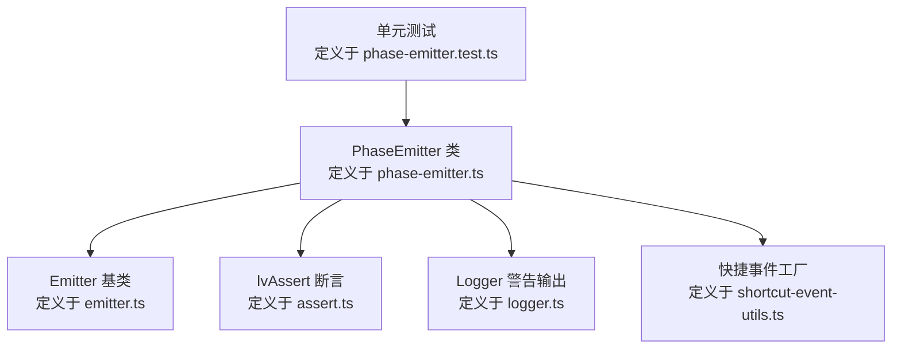
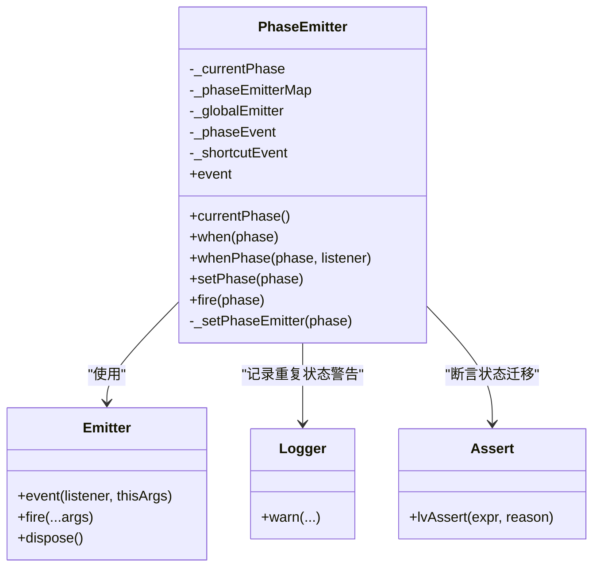
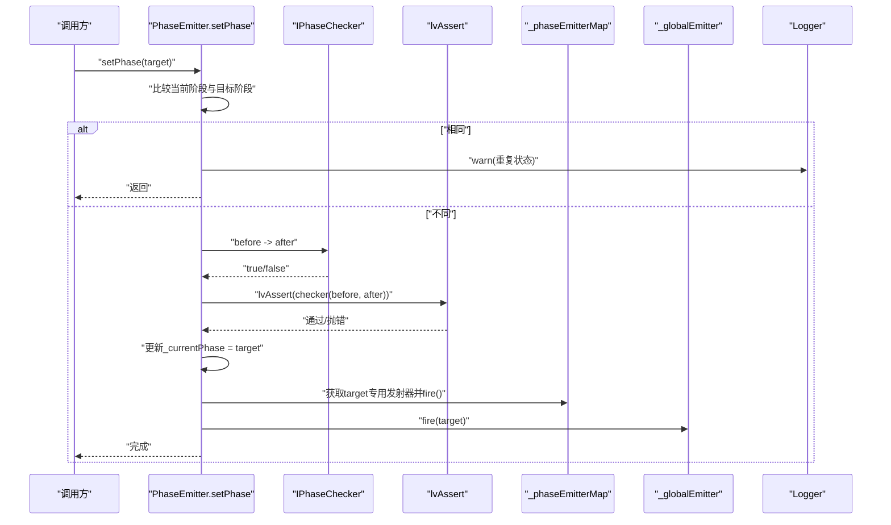
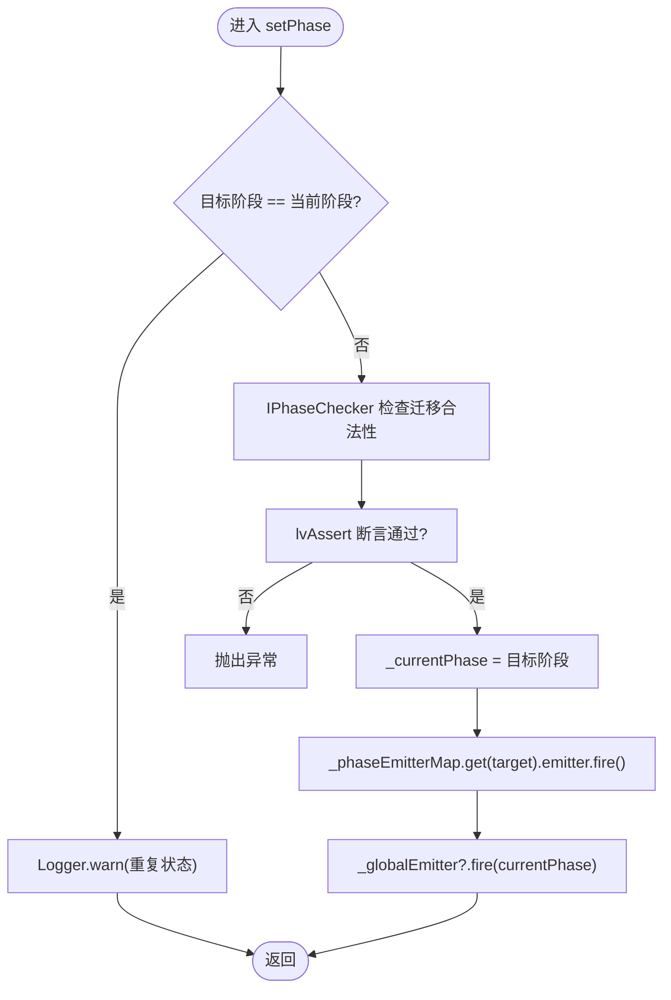
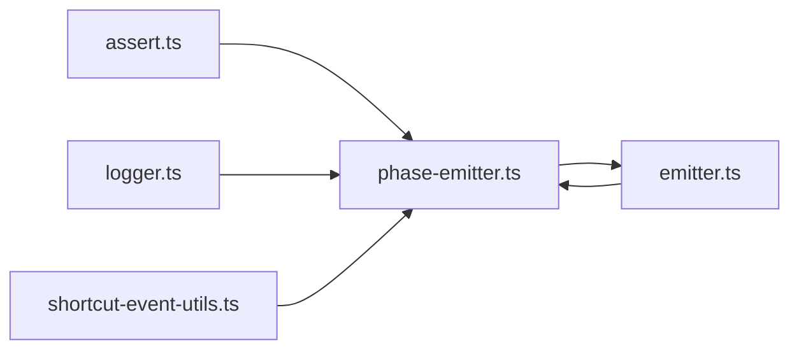

# 状态转换机制

<cite>
**本文引用的文件**
- [packages/h5-builder/src/bedrock/event/phase-emitter.ts](file://packages/h5-builder/src/bedrock/event/phase-emitter.ts)
- [packages/h5-builder/src/bedrock/event/emitter.ts](file://packages/h5-builder/src/bedrock/event/emitter.ts)
- [packages/h5-builder/src/bedrock/assert/assert.ts](file://packages/h5-builder/src/bedrock/assert/assert.ts)
- [packages/h5-builder/src/bedrock/_internal/logger.ts](file://packages/h5-builder/src/bedrock/_internal/logger.ts)
- [packages/h5-builder/src/bedrock/event/shortcut-event-utils.ts](file://packages/h5-builder/src/bedrock/event/shortcut-event-utils.ts)
- [packages/h5-builder/src/bedrock/event/phase-emitter.test.ts](file://packages/h5-builder/src/bedrock/event/phase-emitter.test.ts)
</cite>

## 目录
1. [引言](#引言)
2. [项目结构](#项目结构)
3. [核心组件](#核心组件)
4. [架构总览](#架构总览)
5. [详细组件分析](#详细组件分析)
6. [依赖关系分析](#依赖关系分析)
7. [性能考量](#性能考量)
8. [故障排查指南](#故障排查指南)
9. [结论](#结论)

## 引言
本文件围绕 setPhase 方法作为生命周期阶段状态转换的核心机制展开，系统性解析其如何通过断言确保状态迁移合法性、更新当前阶段、触发对应阶段的事件发射器，并说明重复状态设置时的告警策略；同时阐明 fire 方法作为 setPhase 的别名以保持与基础事件发射器 API 的兼容性；最后解释状态变更时全局发射器与阶段发射器映射表的协同工作机制，确保事件能正确广播给所有监听者。

## 项目结构
本次文档聚焦于事件与生命周期阶段管理相关模块，涉及以下文件：
- 阶段事件发射器：phase-emitter.ts
- 基础事件发射器：emitter.ts
- 断言工具：assert.ts
- 日志工具：logger.ts
- 快捷事件工具：shortcut-event-utils.ts
- 单元测试：phase-emitter.test.ts

图表来源
- [packages/h5-builder/src/bedrock/event/phase-emitter.ts](file://packages/h5-builder/src/bedrock/event/phase-emitter.ts#L1-L210)
- [packages/h5-builder/src/bedrock/event/emitter.ts](file://packages/h5-builder/src/bedrock/event/emitter.ts#L1-L163)
- [packages/h5-builder/src/bedrock/assert/assert.ts](file://packages/h5-builder/src/bedrock/assert/assert.ts#L1-L43)
- [packages/h5-builder/src/bedrock/_internal/logger.ts](file://packages/h5-builder/src/bedrock/_internal/logger.ts#L1-L60)
- [packages/h5-builder/src/bedrock/event/shortcut-event-utils.ts](file://packages/h5-builder/src/bedrock/event/shortcut-event-utils.ts#L1-L34)
- [packages/h5-builder/src/bedrock/event/phase-emitter.test.ts](file://packages/h5-builder/src/bedrock/event/phase-emitter.test.ts#L1-L212)

章节来源
- [packages/h5-builder/src/bedrock/event/phase-emitter.ts](file://packages/h5-builder/src/bedrock/event/phase-emitter.ts#L1-L210)
- [packages/h5-builder/src/bedrock/event/emitter.ts](file://packages/h5-builder/src/bedrock/event/emitter.ts#L1-L163)
- [packages/h5-builder/src/bedrock/assert/assert.ts](file://packages/h5-builder/src/bedrock/assert/assert.ts#L1-L43)
- [packages/h5-builder/src/bedrock/_internal/logger.ts](file://packages/h5-builder/src/bedrock/_internal/logger.ts#L1-L60)
- [packages/h5-builder/src/bedrock/event/shortcut-event-utils.ts](file://packages/h5-builder/src/bedrock/event/shortcut-event-utils.ts#L1-L34)
- [packages/h5-builder/src/bedrock/event/phase-emitter.test.ts](file://packages/h5-builder/src/bedrock/event/phase-emitter.test.ts#L1-L212)

## 核心组件
- PhaseEmitter：生命周期阶段事件发射器，负责阶段状态的检查、切换、广播与补发。
- Emitter：通用事件发射器，提供监听注册、事件投递与错误处理。
- lvAssert：断言工具，用于验证状态迁移条件是否满足。
- Logger：日志工具，提供 warn 等输出接口。
- 快捷事件工厂：根据同步/异步模式生成“立即触发”或“异步触发”的事件包装器。

章节来源
- [packages/h5-builder/src/bedrock/event/phase-emitter.ts](file://packages/h5-builder/src/bedrock/event/phase-emitter.ts#L112-L209)
- [packages/h5-builder/src/bedrock/event/emitter.ts](file://packages/h5-builder/src/bedrock/event/emitter.ts#L82-L163)
- [packages/h5-builder/src/bedrock/assert/assert.ts](file://packages/h5-builder/src/bedrock/assert/assert.ts#L1-L43)
- [packages/h5-builder/src/bedrock/_internal/logger.ts](file://packages/h5-builder/src/bedrock/_internal/logger.ts#L44-L48)
- [packages/h5-builder/src/bedrock/event/shortcut-event-utils.ts](file://packages/h5-builder/src/bedrock/event/shortcut-event-utils.ts#L1-L34)

## 架构总览
PhaseEmitter 将“阶段状态”与“事件发射”解耦：内部维护当前阶段、阶段专用发射器映射、全局发射器，并通过 setPhase 完成状态校验与广播。当状态变更时，既向目标阶段的专用发射器投递事件，也向全局发射器投递阶段变更事件，从而保证监听者能收到两类事件之一。

图表来源
- [packages/h5-builder/src/bedrock/event/phase-emitter.ts](file://packages/h5-builder/src/bedrock/event/phase-emitter.ts#L112-L209)
- [packages/h5-builder/src/bedrock/event/emitter.ts](file://packages/h5-builder/src/bedrock/event/emitter.ts#L82-L163)
- [packages/h5-builder/src/bedrock/_internal/logger.ts](file://packages/h5-builder/src/bedrock/_internal/logger.ts#L44-L48)
- [packages/h5-builder/src/bedrock/assert/assert.ts](file://packages/h5-builder/src/bedrock/assert/assert.ts#L10-L14)

## 详细组件分析

### setPhase 方法：状态转换核心
setPhase 是状态转换的唯一入口，其职责包括：
- 防抖：若目标阶段与当前阶段相同，则记录重复状态警告并直接返回。
- 校验：通过 IPhaseChecker 对当前阶段到目标阶段的迁移进行合法性判断；不合法则抛出异常。
- 更新：将当前阶段更新为目标阶段。
- 广播：向目标阶段专用发射器与全局发射器分别投递事件，确保监听者收到对应通知。

图表来源
- [packages/h5-builder/src/bedrock/event/phase-emitter.ts](file://packages/h5-builder/src/bedrock/event/phase-emitter.ts#L178-L187)
- [packages/h5-builder/src/bedrock/assert/assert.ts](file://packages/h5-builder/src/bedrock/assert/assert.ts#L10-L14)
- [packages/h5-builder/src/bedrock/_internal/logger.ts](file://packages/h5-builder/src/bedrock/_internal/logger.ts#L44-L48)

章节来源
- [packages/h5-builder/src/bedrock/event/phase-emitter.ts](file://packages/h5-builder/src/bedrock/event/phase-emitter.ts#L178-L187)

### 重复状态设置的警告处理
当 setPhase 接收的目标阶段与当前阶段一致时，会记录一条警告日志，提示“重复设置同一阶段”。这有助于发现潜在的误用或冗余调用，避免无意义的事件投递。

章节来源
- [packages/h5-builder/src/bedrock/event/phase-emitter.ts](file://packages/h5-builder/src/bedrock/event/phase-emitter.ts#L178-L182)
- [packages/h5-builder/src/bedrock/_internal/logger.ts](file://packages/h5-builder/src/bedrock/_internal/logger.ts#L44-L48)

### fire 方法：与基础发射器 API 的兼容性
为与基础事件发射器保持一致的 API 形态，PhaseEmitter 提供了 fire 方法，其内部直接委托给 setPhase。该方法标注为弃用，建议优先使用 setPhase，未来版本可能移除。

章节来源
- [packages/h5-builder/src/bedrock/event/phase-emitter.ts](file://packages/h5-builder/src/bedrock/event/phase-emitter.ts#L193-L195)

### 状态变更时的事件广播：_globalEmitter 与 _phaseEmitterMap 的协同
- 目标阶段专用发射器：当 setPhase 切换到某阶段时，会查找该阶段对应的专用发射器并 fire，确保仅对该阶段感兴趣的监听者收到通知。
- 全局发射器：同时向全局发射器 fire，传递当前阶段值，使“监听阶段变更”的观察者能够统一感知变化。
- 快捷事件：当监听发生在“已到达阶段”的场景下，使用快捷事件工厂在注册时立即触发回调，体现“状态补发”的语义。

图表来源
- [packages/h5-builder/src/bedrock/event/phase-emitter.ts](file://packages/h5-builder/src/bedrock/event/phase-emitter.ts#L178-L187)
- [packages/h5-builder/src/bedrock/event/shortcut-event-utils.ts](file://packages/h5-builder/src/bedrock/event/shortcut-event-utils.ts#L8-L31)

章节来源
- [packages/h5-builder/src/bedrock/event/phase-emitter.ts](file://packages/h5-builder/src/bedrock/event/phase-emitter.ts#L112-L209)
- [packages/h5-builder/src/bedrock/event/shortcut-event-utils.ts](file://packages/h5-builder/src/bedrock/event/shortcut-event-utils.ts#L1-L34)

### 监听器注册与事件补发：when 与 whenPhase
- when(phase)：返回针对某一阶段的事件，若当前阶段已是该阶段，则通过快捷事件工厂立即触发回调；否则延迟到该阶段被 setPhase 触发时再投递。
- whenPhase(phase, listener)：与 when 类似，但回调签名包含阶段参数，便于在单一回调中区分不同阶段。
- event：返回全局阶段变更事件，不进行补发，适合需要“只接收后续变更”的场景。

章节来源
- [packages/h5-builder/src/bedrock/event/phase-emitter.ts](file://packages/h5-builder/src/bedrock/event/phase-emitter.ts#L142-L169)
- [packages/h5-builder/src/bedrock/event/shortcut-event-utils.ts](file://packages/h5-builder/src/bedrock/event/shortcut-event-utils.ts#L8-L31)

### 测试验证要点
- 状态补发：当监听发生在“已到达阶段”之后，应立即触发回调；若监听发生在“已到达阶段”之前，最终阶段会被补发一次。
- 重复状态不触发：连续多次设置同一阶段不应重复触发监听。
- 非法迁移抛错：自定义 IPhaseChecker 返回 false 时，setPhase 应抛出异常。
- 全局与专用事件：同时监听 when 与 event 时，应分别收到对应事件。

章节来源
- [packages/h5-builder/src/bedrock/event/phase-emitter.test.ts](file://packages/h5-builder/src/bedrock/event/phase-emitter.test.ts#L1-L212)

## 依赖关系分析
- PhaseEmitter 依赖 Emitter 进行事件投递；依赖 Logger 记录重复状态警告；依赖 lvAssert 进行状态迁移断言；依赖快捷事件工厂在监听注册时进行“状态补发”。
- Emitter 内部维护监听链表与交付队列，支持单监听器快速路径与多监听器批量投递。
- 快捷事件工厂提供同步/异步两种模式，分别在注册时立即执行或异步延迟执行回调。

图表来源
- [packages/h5-builder/src/bedrock/event/phase-emitter.ts](file://packages/h5-builder/src/bedrock/event/phase-emitter.ts#L1-L210)
- [packages/h5-builder/src/bedrock/event/emitter.ts](file://packages/h5-builder/src/bedrock/event/emitter.ts#L1-L163)
- [packages/h5-builder/src/bedrock/assert/assert.ts](file://packages/h5-builder/src/bedrock/assert/assert.ts#L1-L43)
- [packages/h5-builder/src/bedrock/_internal/logger.ts](file://packages/h5-builder/src/bedrock/_internal/logger.ts#L1-L60)
- [packages/h5-builder/src/bedrock/event/shortcut-event-utils.ts](file://packages/h5-builder/src/bedrock/event/shortcut-event-utils.ts#L1-L34)

章节来源
- [packages/h5-builder/src/bedrock/event/phase-emitter.ts](file://packages/h5-builder/src/bedrock/event/phase-emitter.ts#L1-L210)
- [packages/h5-builder/src/bedrock/event/emitter.ts](file://packages/h5-builder/src/bedrock/event/emitter.ts#L1-L163)
- [packages/h5-builder/src/bedrock/assert/assert.ts](file://packages/h5-builder/src/bedrock/assert/assert.ts#L1-L43)
- [packages/h5-builder/src/bedrock/_internal/logger.ts](file://packages/h5-builder/src/bedrock/_internal/logger.ts#L1-L60)
- [packages/h5-builder/src/bedrock/event/shortcut-event-utils.ts](file://packages/h5-builder/src/bedrock/event/shortcut-event-utils.ts#L1-L34)

## 性能考量
- setPhase 中的重复状态检测为 O(1) 比较，开销极低。
- 断言与状态更新均为常数时间操作。
- 专用发射器按需创建，首次访问时才实例化，避免不必要的内存占用。
- Emitter 在单监听器情况下采用快速路径，避免构建交付队列，提升热点路径性能。
- 快捷事件工厂在同步模式下直接调用回调，避免额外调度开销。

章节来源
- [packages/h5-builder/src/bedrock/event/phase-emitter.ts](file://packages/h5-builder/src/bedrock/event/phase-emitter.ts#L178-L187)
- [packages/h5-builder/src/bedrock/event/emitter.ts](file://packages/h5-builder/src/bedrock/event/emitter.ts#L136-L161)
- [packages/h5-builder/src/bedrock/event/shortcut-event-utils.ts](file://packages/h5-builder/src/bedrock/event/shortcut-event-utils.ts#L8-L31)

## 故障排查指南
- 重复设置同一阶段：若频繁看到重复状态警告，检查是否存在不必要的重复调用或逻辑分支导致反复 setPhase 同一阶段。
- 非法状态迁移：当 IPhaseChecker 返回 false 时，setPhase 会抛出异常。请确认迁移规则与业务阶段图一致。
- 监听不到事件：若使用 event（全局变更监听）却未收到回调，请确认是否在 setPhase 之后才注册监听；若使用 when/whenPhase，请确认监听时机与阶段到达顺序。
- 回调执行异常：Emitter 支持 onListenerError 回调，可在监听器抛错时进行捕获与处理。

章节来源
- [packages/h5-builder/src/bedrock/event/phase-emitter.ts](file://packages/h5-builder/src/bedrock/event/phase-emitter.ts#L178-L187)
- [packages/h5-builder/src/bedrock/event/emitter.ts](file://packages/h5-builder/src/bedrock/event/emitter.ts#L136-L161)
- [packages/h5-builder/src/bedrock/event/phase-emitter.test.ts](file://packages/h5-builder/src/bedrock/event/phase-emitter.test.ts#L185-L212)

## 结论
setPhase 作为生命周期阶段状态转换的核心，通过断言确保迁移合法性、通过重复状态检测避免无效广播、通过专用与全局发射器协同实现“阶段到达即补发”与“阶段变更持续通知”的双通道覆盖。fire 方法保留了与基础发射器 API 的兼容性，但建议优先使用 setPhase。整体设计在保证正确性的同时兼顾性能与可维护性。