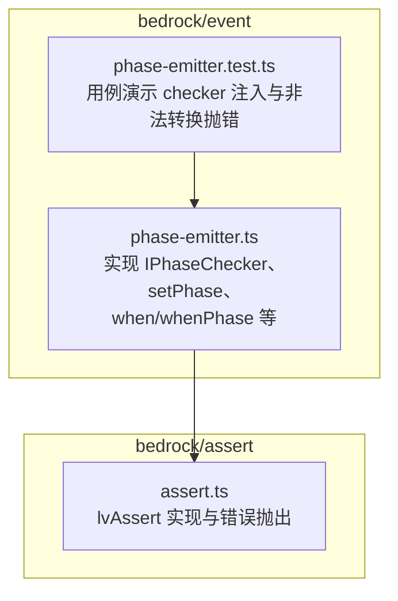
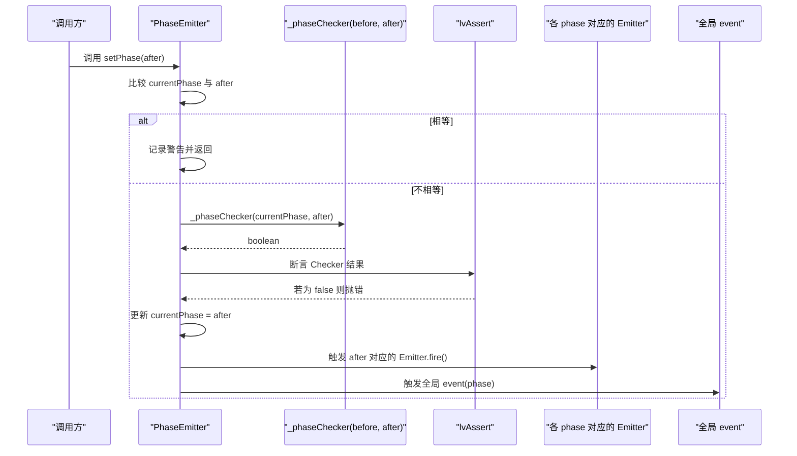
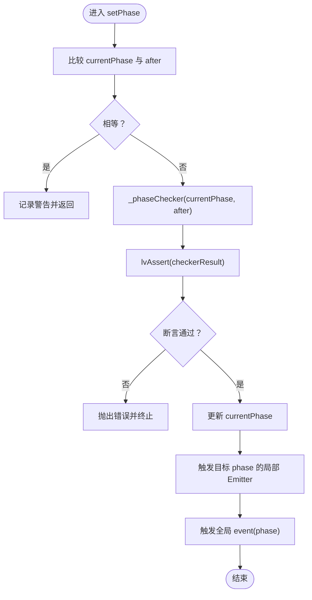
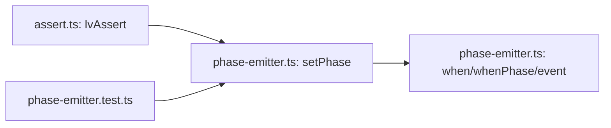

# 状态迁移校验机制

<cite>
**本文引用的文件**
- [phase-emitter.ts](file://packages/h5-builder/src/bedrock/event/phase-emitter.ts)
- [phase-emitter.test.ts](file://packages/h5-builder/src/bedrock/event/phase-emitter.test.ts)
- [assert.ts](file://packages/h5-builder/src/bedrock/assert/assert.ts)
</cite>

## 目录
1. [引言](#引言)
2. [项目结构](#项目结构)
3. [核心组件](#核心组件)
4. [架构总览](#架构总览)
5. [详细组件分析](#详细组件分析)
6. [依赖分析](#依赖分析)
7. [性能考虑](#性能考虑)
8. [故障排查指南](#故障排查指南)
9. [结论](#结论)

## 引言
本文件聚焦于 PhaseEmitter 中通过 lvAssert 与 _phaseChecker 实现的状态迁移合法性校验机制。文档将系统性解析 setPhase 如何调用 _phaseChecker(this._currentPhase, phase) 进行状态转换规则验证，结合 defaultCheck 函数解释默认允许任意转换的行为；阐述自定义 checker 的注入方式及其在控制状态机流转中的作用；并通过测试用例展示如何通过 IPhaseChecker 接口限制非法状态跳转；最后说明 lvAssert 断言失败时的错误处理流程及对系统稳定性的影响。

## 项目结构
本次分析涉及的核心文件位于 h5-builder 包的 bedrock/event 与 bedrock/assert 目录下：
- PhaseEmitter 实现与测试：packages/h5-builder/src/bedrock/event/phase-emitter.ts、phase-emitter.test.ts
- 断言工具：packages/h5-builder/src/bedrock/assert/assert.ts

图表来源
- [phase-emitter.ts](file://packages/h5-builder/src/bedrock/event/phase-emitter.ts#L1-L209)
- [phase-emitter.test.ts](file://packages/h5-builder/src/bedrock/event/phase-emitter.test.ts#L1-L213)
- [assert.ts](file://packages/h5-builder/src/bedrock/assert/assert.ts#L1-L43)

章节来源
- [phase-emitter.ts](file://packages/h5-builder/src/bedrock/event/phase-emitter.ts#L1-L209)
- [phase-emitter.test.ts](file://packages/h5-builder/src/bedrock/event/phase-emitter.test.ts#L1-L213)
- [assert.ts](file://packages/h5-builder/src/bedrock/assert/assert.ts#L1-L43)

## 核心组件
- IPhaseChecker<T>：状态迁移检查器接口，签名 (before: T, after: T): boolean。返回 true 表示允许该次迁移，false 则拒绝。
- defaultCheck<T>：默认检查器，始终返回 true，即允许任意合法状态迁移。
- PhaseEmitter<T,K>：状态机事件发射器，维护当前状态 currentPhase，提供 setPhase、when、whenPhase、event 等 API。
- lvAssert(expr, reason?)：断言工具，当 expr 为假时抛出错误，用于在 setPhase 中强制执行检查器结果。

章节来源
- [phase-emitter.ts](file://packages/h5-builder/src/bedrock/event/phase-emitter.ts#L11-L17)
- [phase-emitter.ts](file://packages/h5-builder/src/bedrock/event/phase-emitter.ts#L15-L17)
- [phase-emitter.ts](file://packages/h5-builder/src/bedrock/event/phase-emitter.ts#L112-L209)
- [assert.ts](file://packages/h5-builder/src/bedrock/assert/assert.ts#L10-L14)

## 架构总览
PhaseEmitter 将“状态变更”抽象为事件，支持三种监听方式：
- when(phase)：仅在状态到达时触发一次（或补发一次）
- whenPhase(phase, listener)：与 when 类似，但回调第一个参数可明确对应 phase
- event：监听所有状态变更（不补发）

状态迁移的合法性由 _phaseChecker 决定，setPhase 在执行迁移前调用 lvAssert(_phaseChecker(...))，确保检查器返回值为真。若非法迁移，lvAssert 抛错，阻止状态推进。

图表来源
- [phase-emitter.ts](file://packages/h5-builder/src/bedrock/event/phase-emitter.ts#L178-L187)
- [phase-emitter.ts](file://packages/h5-builder/src/bedrock/event/phase-emitter.ts#L197-L209)
- [assert.ts](file://packages/h5-builder/src/bedrock/assert/assert.ts#L10-L14)

## 详细组件分析

### IPhaseChecker 接口与 defaultCheck 默认行为
- IPhaseChecker<T> 定义了状态迁移规则的判定函数，输入为“从某状态迁移到某状态”，输出为是否允许。
- defaultCheck<T> 总是返回 true，意味着在未显式注入 checker 的情况下，默认允许任意状态迁移。

章节来源
- [phase-emitter.ts](file://packages/h5-builder/src/bedrock/event/phase-emitter.ts#L11-L17)
- [phase-emitter.ts](file://packages/h5-builder/src/bedrock/event/phase-emitter.ts#L15-L17)

### setPhase 的迁移校验与断言
- setPhase 在进入迁移逻辑前，先判断 currentPhase 是否等于目标状态。若相等，则记录警告并直接返回（避免重复触发）。
- 若不相等，调用 _phaseChecker(this._currentPhase, phase)，并将结果交由 lvAssert 断言。断言失败将抛出错误，阻止状态推进。
- 成功断言后，更新 currentPhase，并触发两处事件：
  - 目标 phase 对应的局部 Emitter.fire()
  - 全局 event(phase)

章节来源
- [phase-emitter.ts](file://packages/h5-builder/src/bedrock/event/phase-emitter.ts#L178-L187)
- [phase-emitter.ts](file://packages/h5-builder/src/bedrock/event/phase-emitter.ts#L183-L187)

### 自定义 checker 的注入与作用
- 构造函数支持通过配置项注入 checker：new PhaseEmitter(initialPhase, { checker })。
- 测试用例展示了如何注入自定义 checker，例如“只允许严格递增”的规则，当尝试回退到更早状态时，setPhase 会因断言失败而抛错。

章节来源
- [phase-emitter.ts](file://packages/h5-builder/src/bedrock/event/phase-emitter.ts#L118-L129)
- [phase-emitter.test.ts](file://packages/h5-builder/src/bedrock/event/phase-emitter.test.ts#L197-L211)

### when/whenPhase/event 的补发语义
- when/whenPhase 在监听时若当前已处于目标状态，会通过快捷事件立即触发回调（补发一次），从而简化调用方逻辑。
- event 监听的是“状态变更”，不进行补发，适合需要精确感知每次状态变化的场景。

章节来源
- [phase-emitter.ts](file://packages/h5-builder/src/bedrock/event/phase-emitter.ts#L142-L169)

### 断言失败的错误处理流程
- lvAssert 在断言失败时抛出错误，错误消息包含原因字符串（若提供）。
- 在 setPhase 中，_phaseChecker 返回 false 会导致 lvAssert 抛错，进而中断状态迁移，防止非法状态跳转。

图表来源
- [phase-emitter.ts](file://packages/h5-builder/src/bedrock/event/phase-emitter.ts#L178-L187)
- [assert.ts](file://packages/h5-builder/src/bedrock/assert/assert.ts#L10-L14)

## 依赖分析
- PhaseEmitter 依赖断言工具 lvAssert，用于在 setPhase 中强制执行检查器结果。
- 测试用例通过构造函数注入 checker，验证非法迁移会被断言捕获并抛错。

图表来源
- [phase-emitter.ts](file://packages/h5-builder/src/bedrock/event/phase-emitter.ts#L1-L209)
- [phase-emitter.test.ts](file://packages/h5-builder/src/bedrock/event/phase-emitter.test.ts#L1-L213)
- [assert.ts](file://packages/h5-builder/src/bedrock/assert/assert.ts#L1-L43)

章节来源
- [phase-emitter.ts](file://packages/h5-builder/src/bedrock/event/phase-emitter.ts#L1-L209)
- [phase-emitter.test.ts](file://packages/h5-builder/src/bedrock/event/phase-emitter.test.ts#L1-L213)
- [assert.ts](file://packages/h5-builder/src/bedrock/assert/assert.ts#L1-L43)

## 性能考虑
- setPhase 的检查与断言开销极低，主要为一次布尔判断与断言调用，通常可忽略不计。
- when/whenPhase 的“补发”机制在监听时可能立即触发回调，属于一次性成本；event 的“无补发”模式更适合高频状态变更场景，避免额外触发。

## 故障排查指南
- 若 setPhase 抛错，优先检查自定义 checker 的实现是否正确，确认迁移方向是否满足约束。
- 若出现重复设置相同状态的日志，确认业务逻辑是否多次调用 setPhase，必要时在外层做幂等保护。
- 若监听回调未按预期触发，区分使用 when/whenPhase（可能补发）与 event（不补发）的不同语义。

章节来源
- [phase-emitter.ts](file://packages/h5-builder/src/bedrock/event/phase-emitter.ts#L178-L187)
- [phase-emitter.test.ts](file://packages/h5-builder/src/bedrock/event/phase-emitter.test.ts#L197-L211)

## 结论
- PhaseEmitter 通过 IPhaseChecker 与 defaultCheck 提供灵活的状态迁移控制：默认允许任意转换，也可通过注入自定义 checker 严格限制。
- setPhase 在迁移前调用 _phaseChecker 并以 lvAssert 强制断言，确保非法状态跳转被及时拦截。
- 测试用例清晰展示了如何通过 IPhaseChecker 接口限制非法状态跳转，验证了断言失败时的错误处理流程。
- 在高并发或复杂状态机场景中，建议谨慎使用“补发”语义，优先采用 event 或 when 的明确触发策略，以降低状态一致性风险。