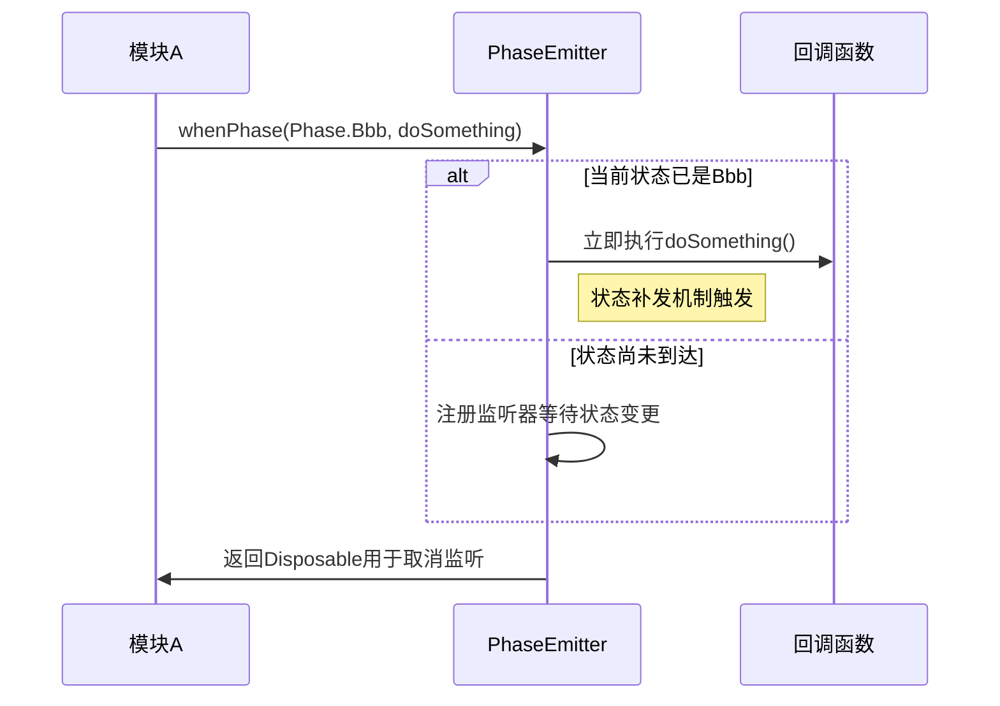
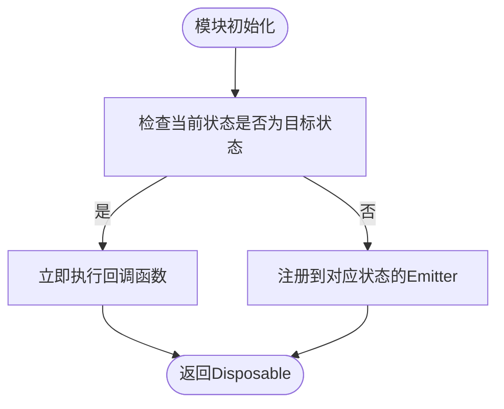
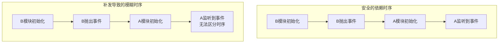
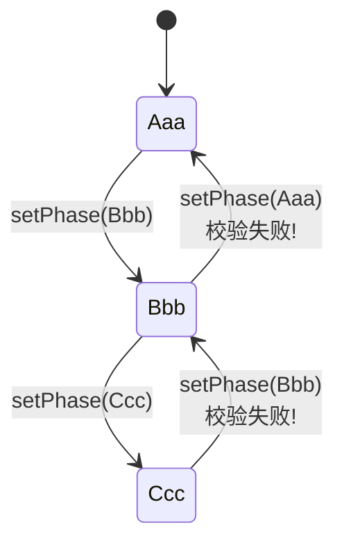
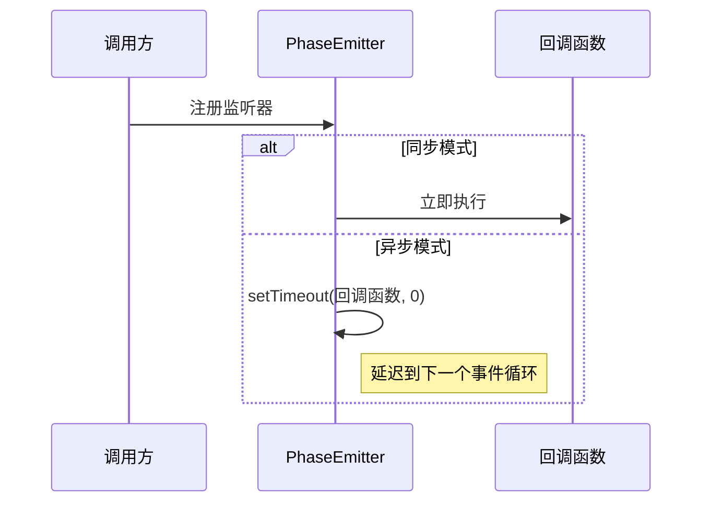

# 生命周期状态控制

<cite>
**本文档引用文件**  
- [phase-emitter.ts](file://packages/h5-builder/src/bedrock/event/phase-emitter.ts)
- [emitter.ts](file://packages/h5-builder/src/bedrock/event/emitter.ts)
- [shortcut-event-utils.ts](file://packages/h5-builder/src/bedrock/event/shortcut-event-utils.ts)
- [when.ts](file://packages/h5-builder/src/bedrock/event/when.ts)
- [phase-emitter.test.ts](file://packages/h5-builder/src/bedrock/event/phase-emitter.test.ts)
</cite>

## 目录
1. [引言](#引言)
2. [PhaseEmitter核心设计原理](#phaseemitter核心设计原理)
3. [状态监听方法对比：whenPhase、when与event](#状态监听方法对比whenphase-when与event)
4. [状态补发机制的设计考量](#状态补发机制的设计考量)
5. [IPhaseChecker校验器的作用](#iphasechecker校验器的作用)
6. [ShortcutEventMode同步/异步模式对性能的影响](#shortcuteventmode同步异步模式对性能的影响)
7. [安全使用最佳实践](#安全使用最佳实践)
8. [总结](#总结)

## 引言

PhaseEmitter类是MobX框架中用于管理生命周期状态转换的核心组件，它通过事件发射机制实现状态机的精确控制。该类不仅支持标准的状态变更通知，还引入了“状态补发”这一高级特性，使得模块间依赖关系的处理更加灵活。然而，这种灵活性也带来了潜在的时序模糊风险，特别是在A模块依赖B模块状态变更的场景下。

本文档将深入解析PhaseEmitter的实现原理，重点阐述其三种状态监听方式的使用场景与区别，分析状态补发机制的设计权衡，并提供避免逻辑错误的安全实践建议。

**Section sources**
- [phase-emitter.ts](file://packages/h5-builder/src/bedrock/event/phase-emitter.ts#L1-L209)

## PhaseEmitter核心设计原理

PhaseEmitter本质上是一个专用于生命周期状态管理的事件触发器，其核心目标是确保状态变更的有序性和可预测性。与通用事件系统不同，PhaseEmitter强制要求状态必须以枚举形式定义，且事件不携带额外参数，从而保证了状态转换的纯粹性。

该类通过内部维护一个当前状态 `_currentPhase` 和一个状态映射表 `_phaseEmitterMap` 来跟踪所有可能的状态节点。每当调用 `setPhase` 方法时，PhaseEmitter会执行以下关键步骤：
1. 检查状态是否重复（避免无效更新）
2. 通过 `IPhaseChecker` 验证状态迁移的合法性
3. 更新当前状态
4. 触发对应状态的事件发射器（进行状态补发）
5. 同时通过全局事件发射器通知所有监听者状态变更

这种设计确保了无论监听者是在状态变更前还是后注册，都能正确接收到必要的状态通知，从而简化了模块间的依赖初始化逻辑。

```mermaid
classDiagram
class PhaseEmitter~T, K~ {
-_currentPhase : K
-_phaseEmitterMap : Map~K, IPhaseEmitter~
-_globalEmitter : Emitter~[T]~
-_phaseChecker : IPhaseChecker~T~
-_shortcutEvent : IMakeShortcutEvent~T~
+currentPhase : K
+event : Event~[T]~
+whenPhase : WhenPhaseEvent~T~
+when(phase : K) : PhaseEvent
+setPhase(phase : K) : void
+dispose() : void
}
class IPhaseChecker~T~ {
<<interface>>
(before : T, after : T) : boolean
}
class WhenPhaseEvent~T~ {
<<interface>>
(phase : T, listener : () => any) : IDisposable
}
class PhaseEvent {
<<type alias>>
Event~[]~
}
class ShortcutEventMode {
<<enum>>
Async
Sync
}
PhaseEmitter --> IPhaseChecker : "使用"
PhaseEmitter --> WhenPhaseEvent : "提供"
PhaseEmitter --> PhaseEvent : "提供"
PhaseEmitter --> ShortcutEventMode : "配置"
```

**Diagram sources**
- [phase-emitter.ts](file://packages/h5-builder/src/bedrock/event/phase-emitter.ts#L112-L209)

**Section sources**
- [phase-emitter.ts](file://packages/h5-builder/src/bedrock/event/phase-emitter.ts#L50-L111)

## 状态监听方法对比：whenPhase、when与event

PhaseEmitter提供了三种不同的状态监听方式，每种方式适用于不同的使用场景：

### whenPhase 方法
`whenPhase` 是最灵活的监听方式，允许外部代码指定具体要监听的状态值。其接口定义为 `(phase: T, listener: () => any): IDisposable`，即调用时需同时传入目标状态和回调函数。

**使用场景**：当一个模块需要监听多个不同状态的到达时，使用 `whenPhase` 可以统一处理逻辑，避免为每个状态创建独立的监听属性。



**Diagram sources**
- [phase-emitter.ts](file://packages/h5-builder/src/bedrock/event/phase-emitter.ts#L142-L158)

### when 方法
`when` 方法为每个特定状态预创建了一个专用的事件监听器。例如 `when(Phase.Eventually)` 会返回一个 `PhaseEvent` 类型的监听器，后续只需直接调用即可注册回调。

**使用场景**：当某个状态有明确的外部接口需求时（如 `onReady`），使用 `when` 可以提供更清晰、更简洁的API。这种方式减少了调用方需要传递状态参数的负担。



**Diagram sources**
- [phase-emitter.ts](file://packages/h5-builder/src/bedrock/event/phase-emitter.ts#L160-L169)

### event 属性
`event` 属性提供了一个标准的事件监听接口 `Event<[T]>`，用于监听所有状态的变更。与前两种方式不同，`event` **不会进行状态补发**，仅在状态实际变更时触发。

**使用场景**：当需要追踪状态机的完整变迁路径，或实现状态变更日志、调试跟踪等功能时，应使用 `event`。它保证了监听逻辑的确定性，避免了因补发机制导致的时序模糊问题。

**Section sources**
- [phase-emitter.ts](file://packages/h5-builder/src/bedrock/event/phase-emitter.ts#L135-L140)
- [phase-emitter.test.ts](file://packages/h5-builder/src/bedrock/event/phase-emitter.test.ts#L71-L85)

## 状态补发机制的设计考量

状态补发（Event Replay）是PhaseEmitter最核心也最具争议的特性。其设计初衷是简化模块间的依赖初始化逻辑，特别是在异步或懒加载场景下。

### 便利性分析
在没有状态补发的情况下，依赖模块A必须显式检查被依赖模块B的当前状态：

```typescript
if (B.isReady) {
  doSomething();
} else {
  B.onReady(doSomething);
}
```

而有了状态补发机制后，代码可以简化为：

```typescript
B.onReady(doSomething);
```

无论 `B.isReady` 是否已为 `true`，`doSomething` 都会被正确执行。这大大减少了样板代码，提高了开发效率。

### 风险与挑战
然而，状态补发也带来了两个关键问题：

1. **时序信息丢失**：A模块无法区分事件是在其初始化前还是初始化后触发的。这可能导致某些需要精确时序控制的逻辑出现错误。
2. **响应延迟问题**：如果B模块在A模块初始化前就已发出事件，A模块的响应实际上是“迟到”的，这可能破坏某些业务流程的预期。

如文档注释中所警告：“事件补发是一件非常危险的事情，不要随意补发。” 这种机制冲击了模块间的依赖关系，可能导致难以调试的时序问题。



**Diagram sources**
- [phase-emitter.ts](file://packages/h5-builder/src/bedrock/event/phase-emitter.ts#L58-L70)
- [phase-emitter.test.ts](file://packages/h5-builder/src/bedrock/event/phase-emitter.test.ts#L87-L103)

**Section sources**
- [phase-emitter.ts](file://packages/h5-builder/src/bedrock/event/phase-emitter.ts#L71-L86)

## IPhaseChecker校验器的作用

`IPhaseChecker` 接口定义了 `(before: T, after: T): boolean` 的函数签名，用于在状态迁移时进行合法性校验。默认情况下，PhaseEmitter使用一个始终返回 `true` 的 `defaultCheck` 函数，允许任意状态转换。

通过在构造函数中传入自定义的 `IPhaseChecker`，可以实现状态迁移的约束，例如确保状态只能向前推进（不能回退）：

```typescript
const checker = (before: Phase, after: Phase) => after > before;
const emitter = new PhaseEmitter(Phase.Aaa, { checker });
```

在 `setPhase` 方法中，会通过 `lvAssert` 断言来强制执行此校验。如果校验失败，将抛出异常，阻止非法的状态转换。

这一机制对于构建有严格生命周期约束的系统至关重要，例如在页面加载流程中，不允许从“渲染完成”状态回退到“数据加载”状态。



**Diagram sources**
- [phase-emitter.ts](file://packages/h5-builder/src/bedrock/event/phase-emitter.ts#L11-L17)
- [phase-emitter.ts](file://packages/h5-builder/src/bedrock/event/phase-emitter.ts#L183-L184)
- [phase-emitter.test.ts](file://packages/h5-builder/src/bedrock/event/phase-emitter.test.ts#L197-L211)

**Section sources**
- [phase-emitter.ts](file://packages/h5-builder/src/bedrock/event/phase-emitter.ts#L45-L48)

## ShortcutEventMode同步/异步模式对性能的影响

`ShortcutEventMode` 枚举定义了两种状态补发的执行模式：`Sync`（同步）和 `Async`（异步）。该模式通过 `shortcut-event-utils.ts` 中的 `makeSyncShortcutEvent` 和 `makeAsyncShortcutEvent` 函数实现。

### 同步模式 (Sync)
在同步模式下，当监听器注册时发现目标状态已达成，回调函数会立即执行。这保证了最高的响应速度，但可能打断当前的执行栈，导致意料之外的调用顺序。

### 异步模式 (Async)
在异步模式下，即使状态已达成，回调函数也会通过 `setTimeout(fn, 0)` 延迟到下一个事件循环执行。这确保了调用栈的清晰性，避免了同步执行可能引发的副作用，但引入了微小的延迟。

**性能权衡**：
- **同步模式**：适用于对实时性要求极高，且回调函数逻辑简单、无副作用的场景。
- **异步模式**：适用于需要保证执行顺序确定性，或回调函数可能触发复杂副作用的场景。

默认配置为异步模式，体现了框架对稳定性和可预测性的优先考虑。



**Diagram sources**
- [shortcut-event-utils.ts](file://packages/h5-builder/src/bedrock/event/shortcut-event-utils.ts#L8-L32)
- [phase-emitter.ts](file://packages/h5-builder/src/bedrock/event/phase-emitter.ts#L126-L128)

**Section sources**
- [shortcut-event-utils.ts](file://packages/h5-builder/src/bedrock/event/shortcut-event-utils.ts#L1-L34)

## 安全使用最佳实践

为了避免因状态补发导致的逻辑错误，建议遵循以下最佳实践：

1. **明确区分使用场景**：
   - 使用 `when` 或 `whenPhase` 仅用于“状态到达后执行某操作”的场景。
   - 使用 `event` 用于需要精确追踪状态变迁路径的场景。

2. **谨慎处理时序敏感逻辑**：
   - 对于必须在特定时序下执行的代码，应避免依赖状态补发机制。
   - 可结合模块自身的初始化状态进行双重判断。

3. **合理配置IPhaseChecker**：
   - 对于有明确生命周期约束的系统，务必实现自定义的 `IPhaseChecker`，防止非法状态迁移。

4. **选择合适的ShortcutEventMode**：
   - 在UI渲染等对实时性要求高的场景，可考虑使用同步模式。
   - 在复杂业务逻辑中，优先使用异步模式以保证执行顺序的可预测性。

5. **及时释放资源**：
   - 所有通过 `when`、`whenPhase` 或 `event` 返回的 `IDisposable` 对象应在适当时机调用 `dispose()`，避免内存泄漏。

**Section sources**
- [phase-emitter.ts](file://packages/h5-builder/src/bedrock/event/phase-emitter.ts#L171-L176)
- [phase-emitter.ts](file://packages/h5-builder/src/bedrock/event/phase-emitter.ts#L193-L195)

## 总结

PhaseEmitter作为生命周期状态机的核心实现，通过精巧的事件发射机制和状态补发能力，极大地简化了模块间的依赖管理。其提供的 `whenPhase`、`when` 和 `event` 三种监听方式，分别适用于不同的使用场景，开发者应根据具体需求合理选择。

尽管状态补发机制带来了便利，但也引入了时序模糊的风险。通过合理使用 `IPhaseChecker` 进行状态迁移约束，并根据性能需求选择 `ShortcutEventMode`，可以最大限度地发挥其优势，同时规避潜在问题。

在实际开发中，应遵循安全使用最佳实践，确保系统的稳定性和可维护性。对于复杂的依赖关系，建议结合日志和调试工具，仔细验证状态机的行为是否符合预期。