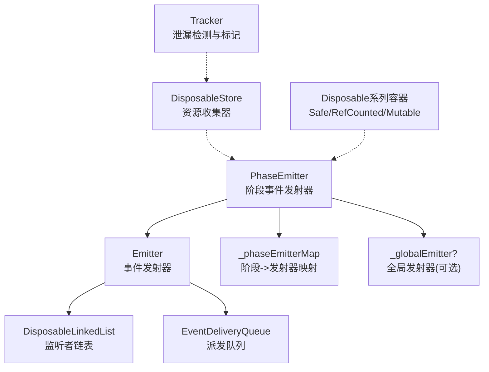
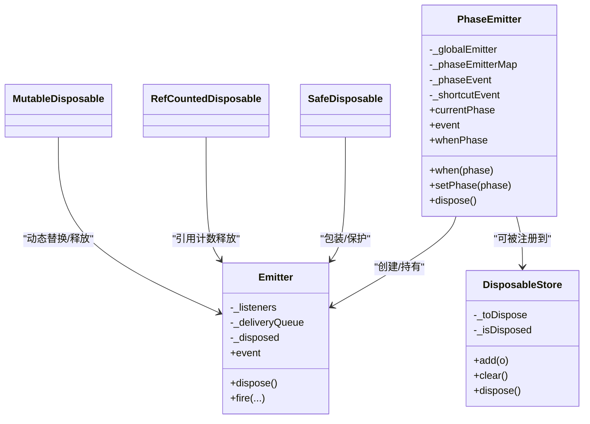
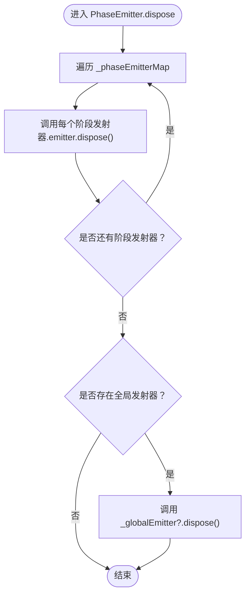
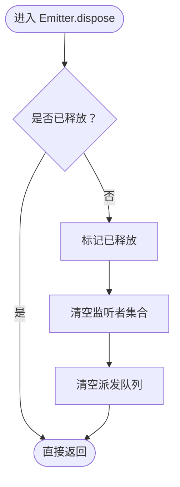
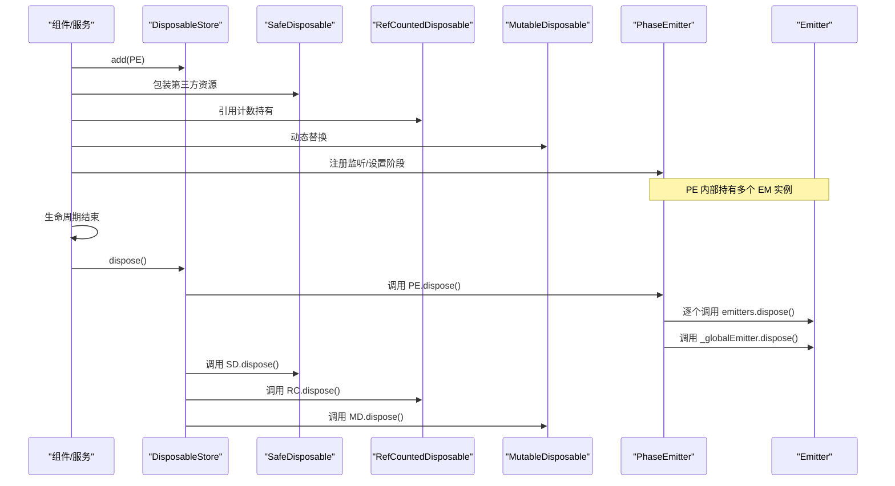
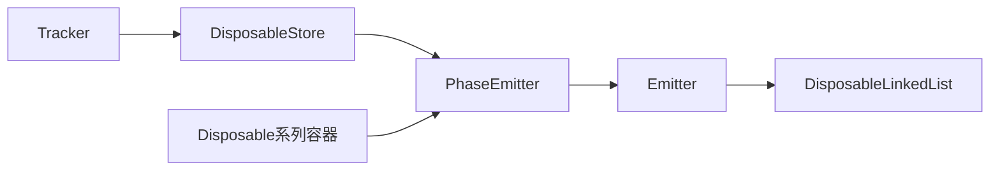

# 资源释放机制

<cite>
**本文引用的文件列表**
- [phase-emitter.ts](file://packages/h5-builder/src/bedrock/event/phase-emitter.ts)
- [emitter.ts](file://packages/h5-builder/src/bedrock/event/emitter.ts)
- [disposable-store.ts](file://packages/h5-builder/src/bedrock/dispose/disposable-store.ts)
- [disposable-t.ts](file://packages/h5-builder/src/bedrock/dispose/disposable-t.ts)
- [disposable-linked-list.ts](file://packages/h5-builder/src/bedrock/event/disposable-linked-list.ts)
- [tracker.ts](file://packages/h5-builder/src/bedrock/dispose/tracker.ts)
- [phase-emitter.test.ts](file://packages/h5-builder/src/bedrock/event/phase-emitter.test.ts)
</cite>

## 目录
1. [引言](#引言)
2. [项目结构与定位](#项目结构与定位)
3. [核心组件](#核心组件)
4. [架构总览](#架构总览)
5. [关键组件详解](#关键组件详解)
6. [依赖关系分析](#依赖关系分析)
7. [性能与内存特性](#性能与内存特性)
8. [故障排查指南](#故障排查指南)
9. [结论](#结论)
10. [附录：调用时机与最佳实践](#附录调用时机与最佳实践)

## 引言
本篇文档聚焦于 PhaseEmitter 的资源释放机制，系统阐述其 dispose 方法如何正确释放所有相关资源，包括遍历内部映射表逐个调用子发射器的 dispose、以及全局发射器的销毁逻辑。同时强调资源清理对防止内存泄漏的重要性，并给出组件销毁或生命周期结束时的调用时机与最佳实践建议，帮助读者在复杂生命周期场景中避免资源泄漏。

## 项目结构与定位
- PhaseEmitter 位于事件系统模块，用于生命周期阶段状态的监听与补发。
- Emitter 是底层事件发射器，负责监听者管理与事件派发。
- Dispose 系列工具提供统一的资源回收与跟踪能力，确保可重复释放的安全性与可追踪性。

图表来源
- [phase-emitter.ts](file://packages/h5-builder/src/bedrock/event/phase-emitter.ts#L111-L209)
- [emitter.ts](file://packages/h5-builder/src/bedrock/event/emitter.ts#L82-L163)
- [disposable-store.ts](file://packages/h5-builder/src/bedrock/dispose/disposable-store.ts#L1-L84)
- [disposable-t.ts](file://packages/h5-builder/src/bedrock/dispose/disposable-t.ts#L1-L239)
- [disposable-linked-list.ts](file://packages/h5-builder/src/bedrock/event/disposable-linked-list.ts#L1-L29)
- [tracker.ts](file://packages/h5-builder/src/bedrock/dispose/tracker.ts#L1-L106)

章节来源
- [phase-emitter.ts](file://packages/h5-builder/src/bedrock/event/phase-emitter.ts#L111-L209)
- [emitter.ts](file://packages/h5-builder/src/bedrock/event/emitter.ts#L82-L163)
- [disposable-store.ts](file://packages/h5-builder/src/bedrock/dispose/disposable-store.ts#L1-L84)
- [disposable-t.ts](file://packages/h5-builder/src/bedrock/dispose/disposable-t.ts#L1-L239)
- [disposable-linked-list.ts](file://packages/h5-builder/src/bedrock/event/disposable-linked-list.ts#L1-L29)
- [tracker.ts](file://packages/h5-builder/src/bedrock/dispose/tracker.ts#L1-L106)

## 核心组件
- PhaseEmitter：维护当前阶段、按阶段分发的发射器映射、以及全局阶段变更发射器；提供 when/whenPhase/setPhase 等接口；dispose 时释放所有子发射器与全局发射器。
- Emitter：管理监听者集合、事件派发队列、错误处理回调；dispose 时清空监听者与派发队列，防止后续事件泄漏。
- DisposableStore/SafeDisposable/RefCountedDisposable/MutableDisposable：提供统一的资源注册、安全释放与引用计数控制。
- Tracker：提供资源跟踪、父/子关系设置、泄漏标记等辅助能力，便于调试与监控。

章节来源
- [phase-emitter.ts](file://packages/h5-builder/src/bedrock/event/phase-emitter.ts#L111-L209)
- [emitter.ts](file://packages/h5-builder/src/bedrock/event/emitter.ts#L82-L163)
- [disposable-store.ts](file://packages/h5-builder/src/bedrock/dispose/disposable-store.ts#L1-L84)
- [disposable-t.ts](file://packages/h5-builder/src/bedrock/dispose/disposable-t.ts#L1-L239)
- [tracker.ts](file://packages/h5-builder/src/bedrock/dispose/tracker.ts#L1-L106)

## 架构总览
下图展示 PhaseEmitter 在生命周期中的角色，以及其与 Emitter、Dispose 系列的关系。

图表来源
- [phase-emitter.ts](file://packages/h5-builder/src/bedrock/event/phase-emitter.ts#L111-L209)
- [emitter.ts](file://packages/h5-builder/src/bedrock/event/emitter.ts#L82-L163)
- [disposable-store.ts](file://packages/h5-builder/src/bedrock/dispose/disposable-store.ts#L1-L84)
- [disposable-t.ts](file://packages/h5-builder/src/bedrock/dispose/disposable-t.ts#L1-L239)

## 关键组件详解

### PhaseEmitter.dispose 的资源释放流程
- 遍历内部映射表：对每个阶段对应的发射器，逐个调用其 dispose，确保监听者与派发队列被清理。
- 全局发射器销毁：若存在全局发射器，则调用其 dispose，避免全局阶段变更事件造成泄漏。
- 释放顺序：先释放各阶段发射器，再释放全局发射器，保证阶段事件与全局事件均被彻底清理。

图表来源
- [phase-emitter.ts](file://packages/h5-builder/src/bedrock/event/phase-emitter.ts#L170-L176)

章节来源
- [phase-emitter.ts](file://packages/h5-builder/src/bedrock/event/phase-emitter.ts#L170-L176)

### Emitter.dispose 的清理要点
- 标记已释放：防止重复释放导致异常。
- 清空监听者集合：移除所有监听者，避免回调持有导致泄漏。
- 清空派发队列：丢弃待派发事件，防止后续事件继续触发。
- 与 PhaseEmitter 的配合：PhaseEmitter 的子发射器与全局发射器均由 Emitter.dispose 完成最终清理。

图表来源
- [emitter.ts](file://packages/h5-builder/src/bedrock/event/emitter.ts#L126-L134)

章节来源
- [emitter.ts](file://packages/h5-builder/src/bedrock/event/emitter.ts#L126-L134)

### Dispose 系列容器与资源回收
- DisposableStore：集中管理多个 IDisposable，支持 LIFO 顺序清理与聚合错误抛出，避免重复释放并记录警告。
- SafeDisposable/RefCountedDisposable/MutableDisposable：提供安全释放、引用计数与动态替换能力，确保资源在合适时机被释放。
- Tracker：提供资源跟踪、父/子关系设置、泄漏标记，便于定位未释放对象。

图表来源
- [disposable-store.ts](file://packages/h5-builder/src/bedrock/dispose/disposable-store.ts#L19-L58)
- [disposable-t.ts](file://packages/h5-builder/src/bedrock/dispose/disposable-t.ts#L106-L186)
- [phase-emitter.ts](file://packages/h5-builder/src/bedrock/event/phase-emitter.ts#L170-L176)
- [emitter.ts](file://packages/h5-builder/src/bedrock/event/emitter.ts#L126-L134)

章节来源
- [disposable-store.ts](file://packages/h5-builder/src/bedrock/dispose/disposable-store.ts#L19-L58)
- [disposable-t.ts](file://packages/h5-builder/src/bedrock/dispose/disposable-t.ts#L106-L186)
- [phase-emitter.ts](file://packages/h5-builder/src/bedrock/event/phase-emitter.ts#L170-L176)
- [emitter.ts](file://packages/h5-builder/src/bedrock/event/emitter.ts#L126-L134)

## 依赖关系分析
- PhaseEmitter 依赖 Emitter 创建与管理阶段发射器；当监听者注册时，Emitter 将监听者加入链表，由 DisposableLinkedList 提供可释放的移除句柄。
- PhaseEmitter 的 dispose 会逐个释放这些发射器，确保监听者链表与派发队列被清空。
- Dispose 系列容器与 Tracker 为资源释放提供统一入口与可观测性，避免重复释放与泄漏。

图表来源
- [phase-emitter.ts](file://packages/h5-builder/src/bedrock/event/phase-emitter.ts#L111-L209)
- [emitter.ts](file://packages/h5-builder/src/bedrock/event/emitter.ts#L82-L163)
- [disposable-linked-list.ts](file://packages/h5-builder/src/bedrock/event/disposable-linked-list.ts#L1-L29)
- [disposable-store.ts](file://packages/h5-builder/src/bedrock/dispose/disposable-store.ts#L1-L84)
- [disposable-t.ts](file://packages/h5-builder/src/bedrock/dispose/disposable-t.ts#L1-L239)
- [tracker.ts](file://packages/h5-builder/src/bedrock/dispose/tracker.ts#L1-L106)

章节来源
- [phase-emitter.ts](file://packages/h5-builder/src/bedrock/event/phase-emitter.ts#L111-L209)
- [emitter.ts](file://packages/h5-builder/src/bedrock/event/emitter.ts#L82-L163)
- [disposable-linked-list.ts](file://packages/h5-builder/src/bedrock/event/disposable-linked-list.ts#L1-L29)
- [disposable-store.ts](file://packages/h5-builder/src/bedrock/dispose/disposable-store.ts#L1-L84)
- [disposable-t.ts](file://packages/h5-builder/src/bedrock/dispose/disposable-t.ts#L1-L239)
- [tracker.ts](file://packages/h5-builder/src/bedrock/dispose/tracker.ts#L1-L106)

## 性能与内存特性
- 遍历释放：PhaseEmitter.dispose 对映射表进行线性遍历，逐个调用子发射器 dispose，时间复杂度 O(N)，N 为阶段数量。
- 事件派发优化：Emitter 在单监听者场景下直接同步派发，避免构建派发队列；多监听者时使用队列批量派发，减少回调开销。
- 监听者移除：DisposableLinkedList 提供可释放的移除句柄，确保监听者从链表中移除，避免回调持有导致泄漏。
- 重复释放防护：Emitter.dispose 与 DisposableStore.dispose 均包含重复释放检查与警告，防止二次释放引发异常。

章节来源
- [phase-emitter.ts](file://packages/h5-builder/src/bedrock/event/phase-emitter.ts#L170-L176)
- [emitter.ts](file://packages/h5-builder/src/bedrock/event/emitter.ts#L126-L134)
- [disposable-store.ts](file://packages/h5-builder/src/bedrock/dispose/disposable-store.ts#L19-L58)
- [disposable-linked-list.ts](file://packages/h5-builder/src/bedrock/event/disposable-linked-list.ts#L1-L29)

## 故障排查指南
- 症状：组件销毁后仍出现事件回调或内存占用不降。
  - 排查点：确认是否调用了 PhaseEmitter.dispose；检查是否将 PhaseEmitter 注册到 DisposableStore 并在组件销毁时统一释放。
- 症状：重复释放日志或异常。
  - 排查点：确认 DisposableStore.dispose 是否被多次调用；检查 SafeDisposable/RefCountedDisposable 的引用计数是否正确释放。
- 症状：监听者未移除导致泄漏。
  - 排查点：确认监听者返回的 IDisposable 是否被正确调用；检查 DisposableLinkedList 的移除句柄是否生效。
- 症状：全局阶段事件仍触发。
  - 排查点：确认 _globalEmitter 是否被正确置空或释放；检查 PhaseEmitter.dispose 的调用顺序。

章节来源
- [disposable-store.ts](file://packages/h5-builder/src/bedrock/dispose/disposable-store.ts#L19-L58)
- [disposable-t.ts](file://packages/h5-builder/src/bedrock/dispose/disposable-t.ts#L106-L186)
- [emitter.ts](file://packages/h5-builder/src/bedrock/event/emitter.ts#L126-L134)
- [phase-emitter.ts](file://packages/h5-builder/src/bedrock/event/phase-emitter.ts#L170-L176)

## 结论
PhaseEmitter 的 dispose 通过遍历阶段映射表逐一释放子发射器，并销毁全局发射器，从而彻底清除事件监听与派发队列，有效防止内存泄漏。结合 DisposableStore 与各类 Disposable 容器，可在组件生命周期结束时实现统一、有序、可追踪的资源回收。遵循“谁创建、谁负责”的原则，确保在组件卸载或服务停止时调用 dispose，是避免资源泄漏的关键。

## 附录：调用时机与最佳实践
- 调用时机
  - 组件卸载/页面关闭/服务停止时：调用组件持有的 PhaseEmitter.dispose。
  - 若将 PhaseEmitter 注册到 DisposableStore，请在组件销毁时统一调用 store.dispose()，由 store 递归释放所有子资源。
- 最佳实践
  - 将 PhaseEmitter 作为组件内部资源，通过 _register 或 add 注册到 DisposableStore，避免手动遗漏。
  - 使用 SafeDisposable/RefCountedDisposable/MutableDisposable 包装第三方资源，确保引用计数与动态替换场景下的安全释放。
  - 在测试中验证 dispose 后不再触发事件，确保监听者集合与派发队列被清空。
  - 使用 Tracker 记录资源生命周期，及时发现未释放对象。

章节来源
- [phase-emitter.test.ts](file://packages/h5-builder/src/bedrock/event/phase-emitter.test.ts#L1-L213)
- [disposable-store.ts](file://packages/h5-builder/src/bedrock/dispose/disposable-store.ts#L19-L58)
- [disposable-t.ts](file://packages/h5-builder/src/bedrock/dispose/disposable-t.ts#L106-L186)
- [tracker.ts](file://packages/h5-builder/src/bedrock/dispose/tracker.ts#L1-L106)