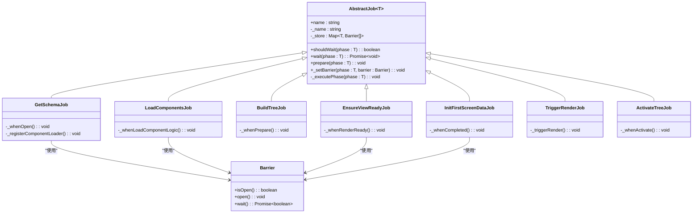

# 生命周期管理

<cite>
**本文档引用的文件**   
- [lifecycle.ts](file://packages/h5-builder/src/jobs/lifecycle.ts)
- [get-schema-job.ts](file://packages/h5-builder/src/jobs/get-schema-job.ts)
- [load-components-job.ts](file://packages/h5-builder/src/jobs/load-components-job.ts)
- [build-tree-job.ts](file://packages/h5-builder/src/jobs/build-tree-job.ts)
- [init-first-screen-data-job.ts](file://packages/h5-builder/src/jobs/init-first-screen-data-job.ts)
- [ensure-view-ready.ts](file://packages/h5-builder/src/jobs/ensure-view-ready.ts)
- [trigger-render-job.ts](file://packages/h5-builder/src/jobs/trigger-render-job.ts)
- [activate-tree-job.ts](file://packages/h5-builder/src/jobs/activate-tree-job.ts)
- [abstract-job.ts](file://packages/h5-builder/src/bedrock/launch/abstract-job.ts)
- [job-scheduler.ts](file://packages/h5-builder/src/bedrock/launch/job-scheduler.ts)
- [phase-emitter.ts](file://packages/h5-builder/src/bedrock/event/phase-emitter.ts)
- [component.service.ts](file://packages/h5-builder/src/services/component.service.ts)
- [schema.service.ts](file://packages/h5-builder/src/services/schema.service.ts)
- [barrier.ts](file://packages/h5-builder/src/bedrock/async/barrier.ts)
</cite>

## 目录
1. [生命周期概述](#生命周期概述)
2. [核心生命周期阶段](#核心生命周期阶段)
3. [生命周期钩子与Job协同机制](#生命周期钩子与job协同机制)
4. [状态机转换与异常处理](#状态机转换与异常处理)
5. [开发者扩展与监听实践](#开发者扩展与监听实践)
6. [关键组件与服务分析](#关键组件与服务分析)

## 生命周期概述

页面构建生命周期管理是H5 Builder的核心机制，它定义了从页面初始化到渲染完成的完整流程。该系统采用基于状态机的Job调度模式，通过`PageLifecycle`枚举定义了六个关键阶段：页面打开、组件逻辑加载、准备、渲染就绪、渲染和完成。每个阶段都对应特定的初始化任务，确保页面能够高效、有序地构建和渲染。

该生命周期系统通过`JobScheduler`进行调度，每个`Job`在特定生命周期阶段被实例化和执行。系统利用`Barrier`机制实现异步任务的同步控制，确保关键任务在进入下一阶段前完成。`PhaseEmitter`提供了强大的事件监听能力，支持状态补发，使组件能够在状态变更后立即响应。

**Section sources**
- [lifecycle.ts](file://packages/h5-builder/src/jobs/lifecycle.ts#L1-L18)
- [job-scheduler.ts](file://packages/h5-builder/src/bedrock/launch/job-scheduler.ts#L1-L123)

## 核心生命周期阶段

页面构建生命周期包含六个明确的阶段，每个阶段都有其特定的职责和目标：


**Diagram sources **
- [lifecycle.ts](file://packages/h5-builder/src/jobs/lifecycle.ts#L1-L18)

**Section sources**
- [lifecycle.ts](file://packages/h5-builder/src/jobs/lifecycle.ts#L1-L18)

### 阶段详解

- **Open（页面打开）**：此阶段主要负责获取页面Schema和注册组件资源加载器。`GetSchemaJob`在此阶段执行，从远程服务获取页面结构定义，并根据Schema内容注册所有需要的组件加载器。

- **LoadComponentLogic（加载组件逻辑）**：此阶段专注于加载所有组件的Model JS资源。`LoadComponentsJob`在此阶段执行，通过统一的并发队列策略加载所有组件的逻辑代码，确保资源加载的高效性。

- **Prepare（准备）**：此阶段负责构建模型树（逻辑树）并同时准备组件视图。`BuildTreeJob`在此阶段执行，使用已加载的组件类和Schema数据构建完整的组件模型树。

- **RenderReady（渲染就绪）**：此阶段标志着模型树和视图资源全部准备完成。`EnsureViewReadyJob`在此阶段等待所有视图资源加载完成，确保渲染时所有依赖都已就绪。

- **Render（启动渲染）**：此阶段触发实际的UI渲染。`TriggerRenderJob`在此阶段执行，通过回调函数将构建好的模型树传递给UI层，启动React渲染流程。

- **Completed（完成）**：此阶段进行首屏视图数据填充。`InitFirstScreenDataJob`在此阶段执行，调用根模型的`init`方法，获取并填充首屏所需的数据。

- **Idle（空闲）**：此阶段处理后台的闲时任务，如预加载非关键资源或执行性能优化任务。

## 生命周期钩子与Job协同机制

生命周期钩子与具体Job的协同工作是通过`AbstractJob`基类和`JobScheduler`调度器实现的。每个Job都继承自`AbstractJob<T>`，其中T是生命周期枚举类型，通过重写`_executePhase`方法来定义在不同生命周期阶段的行为。



**Diagram sources **
- [abstract-job.ts](file://packages/h5-builder/src/bedrock/launch/abstract-job.ts#L1-L46)
- [get-schema-job.ts](file://packages/h5-builder/src/jobs/get-schema-job.ts#L1-L119)
- [load-components-job.ts](file://packages/h5-builder/src/jobs/load-components-job.ts#L1-L61)
- [build-tree-job.ts](file://packages/h5-builder/src/jobs/build-tree-job.ts#L1-L59)
- [init-first-screen-data-job.ts](file://packages/h5-builder/src/jobs/init-first-screen-data-job.ts#L1-L67)
- [ensure-view-ready.ts](file://packages/h5-builder/src/jobs/ensure-view-ready.ts#L1-L53)
- [trigger-render-job.ts](file://packages/h5-builder/src/jobs/trigger-render-job.ts#L1-L44)
- [activate-tree-job.ts](file://packages/h5-builder/src/jobs/activate-tree-job.ts#L1-L56)
- [barrier.ts](file://packages/h5-builder/src/bedrock/async/barrier.ts#L1-L59)

**Section sources**
- [abstract-job.ts](file://packages/h5-builder/src/bedrock/launch/abstract-job.ts#L1-L46)
- [get-schema-job.ts](file://packages/h5-builder/src/jobs/get-schema-job.ts#L1-L119)
- [load-components-job.ts](file://packages/h5-builder/src/jobs/load-components-job.ts#L1-L61)
- [build-tree-job.ts](file://packages/h5-builder/src/jobs/build-tree-job.ts#L1-L59)
- [init-first-screen-data-job.ts](file://packages/h5-builder/src/jobs/init-first-screen-data-job.ts#L1-L67)
- [ensure-view-ready.ts](file://packages/h5-builder/src/jobs/ensure-view-ready.ts#L1-L53)
- [trigger-render-job.ts](file://packages/h5-builder/src/jobs/trigger-render-job.ts#L1-L44)
- [activate-tree-job.ts](file://packages/h5-builder/src/jobs/activate-tree-job.ts#L1-L56)

### Job执行流程

每个Job的执行流程遵循以下模式：

1. **注册**：Job通过`JobScheduler.registerJob`方法在特定生命周期阶段注册。
2. **实例化**：当生命周期推进到对应阶段时，`JobScheduler.prepare`方法会实例化所有在该阶段注册的Job。
3. **执行**：`prepare`方法调用Job的`_executePhase`方法，执行该阶段的特定逻辑。
4. **等待**：如果Job设置了`Barrier`，`JobScheduler.wait`方法会等待所有相关的`Barrier`被打开。
5. **完成**：当所有等待条件满足后，生命周期推进到下一阶段。

这种设计模式实现了关注点分离，每个Job只负责特定阶段的特定任务，同时通过`Barrier`机制确保了任务间的依赖关系。

## 状态机转换与异常处理

生命周期状态机的转换逻辑由`JobScheduler`严格控制。状态转换遵循单向递进原则，即状态只能向前推进，不能回退。这种设计确保了生命周期的确定性和可预测性。


**Diagram sources **
- [job-scheduler.ts](file://packages/h5-builder/src/bedrock/launch/job-scheduler.ts#L1-L123)
- [lifecycle.ts](file://packages/h5-builder/src/jobs/lifecycle.ts#L1-L18)

**Section sources**
- [job-scheduler.ts](file://packages/h5-builder/src/bedrock/launch/job-scheduler.ts#L1-L123)

### 异常处理机制

系统采用了多层次的异常处理机制：

1. **Job内部异常处理**：每个Job在其`_executePhase`方法中使用try-catch块捕获和处理异常。例如，在`InitFirstScreenDataJob`中，如果根模型不存在，会记录警告并打开Barrier，避免阻塞整个生命周期。

2. **Barrier的异常处理**：`Barrier`类提供了`reject`方法，允许在发生不可恢复错误时拒绝等待。`makeBarrierByPromise`工具函数可以将Promise的reject状态转换为Barrier的reject或open行为，提供了灵活的错误处理策略。

3. **组件加载的容错机制**：在`ComponentService`中，如果组件Model或View加载失败，系统会创建一个空的占位组件（EmptyModel/EmptyView），确保页面构建流程不会因单个组件的失败而中断。

4. **断言机制**：系统使用`lvAssert`和`lvAssertNotHere`断言来确保关键假设成立。`lvAssertNotHere`用于标记理论上不应到达的代码路径，帮助在开发阶段发现逻辑错误。

这种分层的异常处理策略确保了系统的健壮性，即使在部分组件或服务出现故障时，页面仍能尽可能地完成渲染。

## 开发者扩展与监听实践

开发者可以通过`PhaseEmitter`机制监听生命周期事件，或通过注册自定义Job来扩展生命周期流程。`PhaseEmitter`提供了三种主要的监听方式：


**Diagram sources **
- [phase-emitter.ts](file://packages/h5-builder/src/bedrock/event/phase-emitter.ts#L1-L210)

**Section sources**
- [phase-emitter.ts](file://packages/h5-builder/src/bedrock/event/phase-emitter.ts#L1-L210)

### 最佳实践

1. **使用`when`方法进行阶段监听**：
```typescript
// 监听RenderReady阶段
pageLifecycleEmitter.when(PageLifecycle.RenderReady).then(() => {
  console.log('页面已准备就绪');
});
```

2. **创建自定义Job**：
```typescript
export class CustomJob extends AbstractJob<PageLifecycle> {
  protected _name = 'CustomJob';
  
  protected async _executePhase(phase: PageLifecycle) {
    switch (phase) {
      case PageLifecycle.Open:
        // 执行自定义逻辑
        break;
      // 其他阶段...
    }
  }
}

// 注册到调度器
jobScheduler.registerJob(PageLifecycle.Open, CustomJob, /* 构造参数 */);
```

3. **利用Barrier进行异步控制**：
```typescript
private async _executeAsyncTask() {
  const barrier = new Barrier();
  this._setBarrier(PageLifecycle.Prepare, barrier);
  
  try {
    await this.performAsyncOperation();
    barrier.open(); // 任务完成
  } catch (error) {
    console.error('异步任务失败', error);
    barrier.open(); // 即使失败也打开，避免阻塞
  }
}
```

4. **避免在错误阶段执行关键操作**：由于`PhaseEmitter`支持状态补发，开发者应确保监听的回调函数是幂等的，能够安全地处理重复执行。

## 关键组件与服务分析

### ComponentService（组件服务）

`ComponentService`是页面构建的核心服务，负责组件的注册、加载和模型树的构建。它维护了组件注册表、加载器映射和缓存，确保组件资源的高效管理和复用。

**Section sources**
- [component.service.ts](file://packages/h5-builder/src/services/component.service.ts#L1-L735)

### SchemaService（Schema服务）

`SchemaService`负责从远程获取页面的Schema定义。它使用`fetchSchema`方法异步获取Schema数据，并将其存储在内部状态中供其他组件使用。

**Section sources**
- [schema.service.ts](file://packages/h5-builder/src/services/schema.service.ts#L1-L38)

### JobScheduler（Job调度器）

`JobScheduler`是生命周期管理的大脑，负责Job的注册、实例化、执行和状态推进。它通过`_unconstructedJobs`映射表管理未实例化的Job，并在适当的时候通过依赖注入容器创建实例。

**Section sources**
- [job-scheduler.ts](file://packages/h5-builder/src/bedrock/launch/job-scheduler.ts#L1-L123)