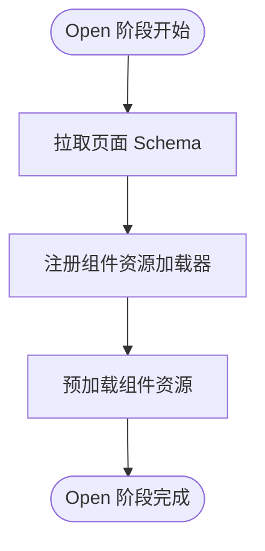
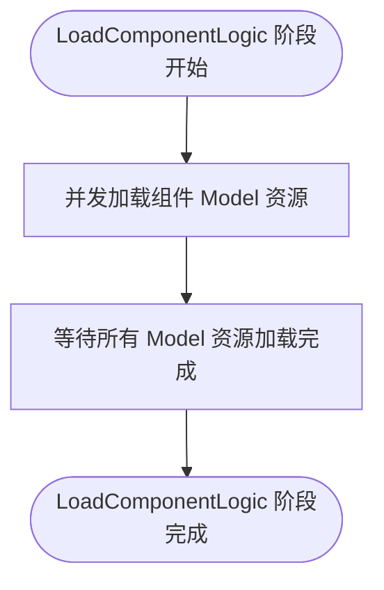
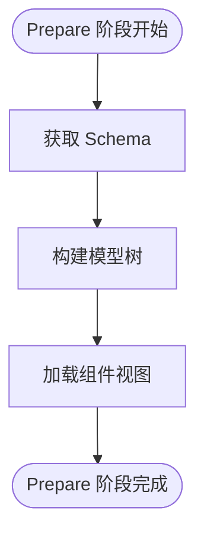
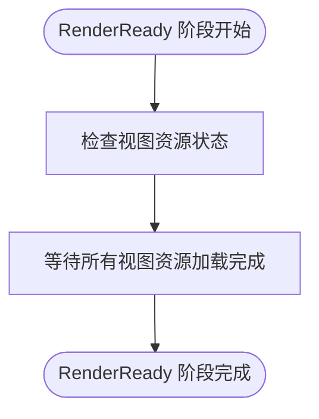
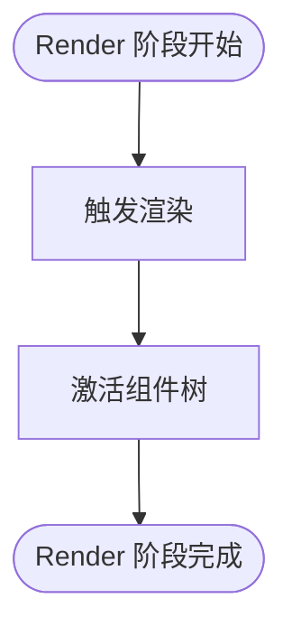
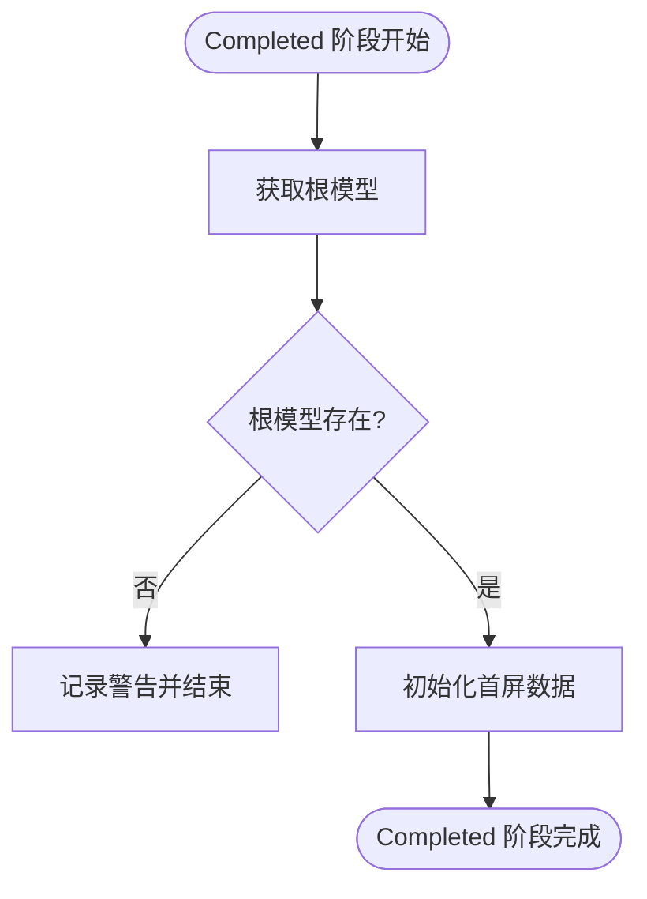

# 生命周期阶段定义

<cite>
**本文档引用的文件**
- [lifecycle.ts](file://packages/h5-builder/src/jobs/lifecycle.ts)
- [get-schema-job.ts](file://packages/h5-builder/src/jobs/get-schema-job.ts)
- [load-components-job.ts](file://packages/h5-builder/src/jobs/load-components-job.ts)
- [build-tree-job.ts](file://packages/h5-builder/src/jobs/build-tree-job.ts)
- [ensure-view-ready.ts](file://packages/h5-builder/src/jobs/ensure-view-ready.ts)
- [trigger-render-job.ts](file://packages/h5-builder/src/jobs/trigger-render-job.ts)
- [activate-tree-job.ts](file://packages/h5-builder/src/jobs/activate-tree-job.ts)
- [init-first-screen-data-job.ts](file://packages/h5-builder/src/jobs/init-first-screen-data-job.ts)
- [component.service.ts](file://packages/h5-builder/src/services/component.service.ts)
- [demo-progressive.tsx](file://packages/h5-builder/src/demo-progressive.tsx)
</cite>

## 目录
1. [生命周期阶段概述](#生命周期阶段概述)
2. [Open 阶段](#open-阶段)
3. [LoadComponentLogic 阶段](#loadcomponentlogic-阶段)
4. [Prepare 阶段](#prepare-阶段)
5. [RenderReady 阶段](#renderready-阶段)
6. [Render 阶段](#render-阶段)
7. [Completed 阶段](#completed-阶段)
8. [Idle 阶段](#idle-阶段)
9. [生命周期转换流程](#生命周期转换流程)
10. [开发者指导与潜在陷阱](#开发者指导与潜在陷阱)

## 生命周期阶段概述

PageLifecycle 枚举定义了 H5 页面构建流程中的各个生命周期阶段，这些阶段按照特定顺序执行，确保页面能够正确加载和渲染。每个阶段都有明确的语义和触发时机，通过 JobScheduler 进行管理和调度。

**Section sources**
- [lifecycle.ts](file://packages/h5-builder/src/jobs/lifecycle.ts#L1-L17)

## Open 阶段

Open 阶段是页面生命周期的第一个阶段，用于处理最前置的任务。在此阶段，系统会拉取页面的 Schema 并注册组件资源加载器。这是整个页面加载流程的起点，为后续的组件加载和模型树构建做好准备。

**Diagram sources**
- [get-schema-job.ts](file://packages/h5-builder/src/jobs/get-schema-job.ts#L47-L65)
- [lifecycle.ts](file://packages/h5-builder/src/jobs/lifecycle.ts#L2-L3)

## LoadComponentLogic 阶段

LoadComponentLogic 阶段负责加载组件逻辑 Model JS 资源。在此阶段，系统会并发加载所有必要的组件模型资源，确保后续能够正确构建模型树。该阶段使用统一队列并发加载策略，以提高加载效率。

**Diagram sources**
- [load-components-job.ts](file://packages/h5-builder/src/jobs/load-components-job.ts#L48-L58)
- [lifecycle.ts](file://packages/h5-builder/src/jobs/lifecycle.ts#L4-L5)

## Prepare 阶段

Prepare 阶段负责构建模型树（即逻辑树）并同时加载组件视图。在此阶段，系统会根据 Schema 构建完整的模型树结构，并开始加载视图资源。这是连接数据和视图的关键步骤。

**Diagram sources**
- [build-tree-job.ts](file://packages/h5-builder/src/jobs/build-tree-job.ts#L45-L57)
- [lifecycle.ts](file://packages/h5-builder/src/jobs/lifecycle.ts#L6-L7)

## RenderReady 阶段

RenderReady 阶段表示模型树和视图资源全部准备完成。在此阶段，系统会确保所有视图资源都已加载完毕，为即将开始的渲染做好充分准备。这是一个重要的检查点，确保所有依赖资源都已就绪。

**Diagram sources**
- [ensure-view-ready.ts](file://packages/h5-builder/src/jobs/ensure-view-ready.ts#L45-L50)
- [lifecycle.ts](file://packages/h5-builder/src/jobs/lifecycle.ts#L8-L9)

## Render 阶段

Render 阶段负责启动渲染过程。在此阶段，系统会触发实际的渲染操作，并激活组件树。这包括将模型树与视图进行绑定，并开始组件的激活过程，如上报埋点、启动定时器等。

**Diagram sources**
- [trigger-render-job.ts](file://packages/h5-builder/src/jobs/trigger-render-job.ts#L24-L32)
- [activate-tree-job.ts](file://packages/h5-builder/src/jobs/activate-tree-job.ts#L23-L44)
- [lifecycle.ts](file://packages/h5-builder/src/jobs/lifecycle.ts#L10-L11)

## Completed 阶段

Completed 阶段是视图数据填充阶段，主要用于在渐进式渲染方案下完成首屏视图的数据填充。此阶段的设计意图是将数据请求与渲染分离，避免阻塞首屏渲染。如果需要首屏直出，可以将此任务提前到 RenderReady 阶段。

**Diagram sources**
- [init-first-screen-data-job.ts](file://packages/h5-builder/src/jobs/init-first-screen-data-job.ts#L47-L64)
- [lifecycle.ts](file://packages/h5-builder/src/jobs/lifecycle.ts#L12-L14)

## Idle 阶段

Idle 阶段是空闲阶段，用于处理闲时任务。在此阶段，系统可以执行一些非关键路径上的优化任务或清理工作。这个阶段通常在所有主要任务完成后执行，不会影响页面的核心加载性能。

**Section sources**
- [lifecycle.ts](file://packages/h5-builder/src/jobs/lifecycle.ts#L15-L16)

## 生命周期转换流程

生命周期阶段按照预定义的顺序进行转换，每个阶段完成后才会进入下一个阶段。这种有序的转换确保了页面构建流程的稳定性和可预测性。

**Diagram sources**
- [demo-progressive.tsx](file://packages/h5-builder/src/demo-progressive.tsx#L105-L178)
- [lifecycle.ts](file://packages/h5-builder/src/jobs/lifecycle.ts#L1-L17)

## 开发者指导与潜在陷阱

开发者可以根据业务需求调整各阶段的行为，但需要注意以下几点：

1. **阶段注册**：通过 JobScheduler.registerJob 方法可以为特定阶段注册任务
2. **并发控制**：在 LoadComponentLogic 阶段使用统一队列并发加载策略，避免资源竞争
3. **错误处理**：在 Prepare 阶段需要处理 Schema 验证失败的情况
4. **性能优化**：Completed 阶段的数据填充应尽量异步化，避免阻塞渲染

**潜在陷阱**：
- 重复设置相同阶段时会产生日志警告
- 在 Open 阶段必须完成 Schema 拉取，否则后续阶段无法正常执行
- 必须确保在 RenderReady 阶段前完成所有视图资源的加载
- Completed 阶段的数据填充策略需要根据实际业务场景进行调整

**Section sources**
- [demo-progressive.tsx](file://packages/h5-builder/src/demo-progressive.tsx#L65-L86)
- [component.service.ts](file://packages/h5-builder/src/services/component.service.ts#L632-L696)