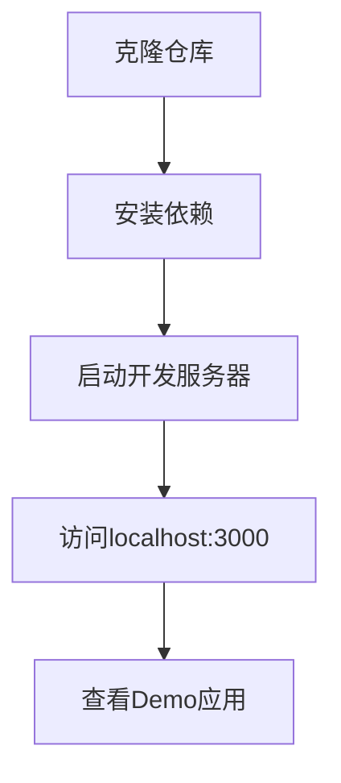
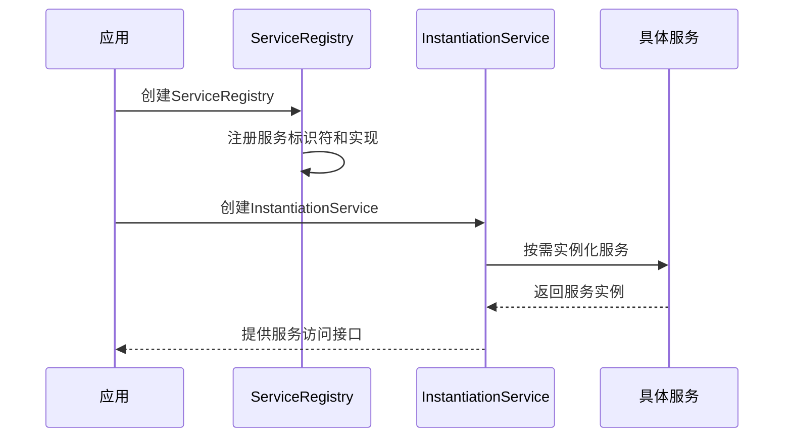
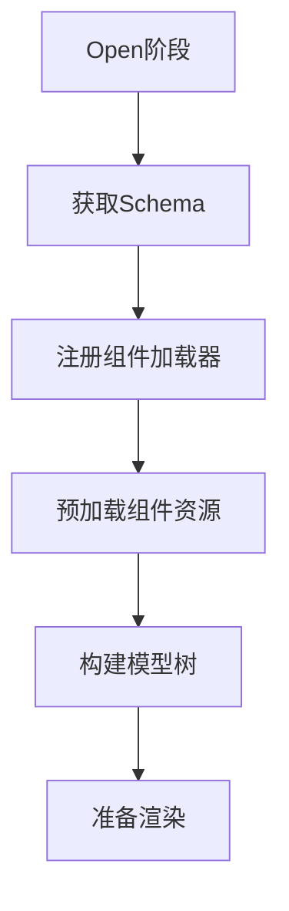
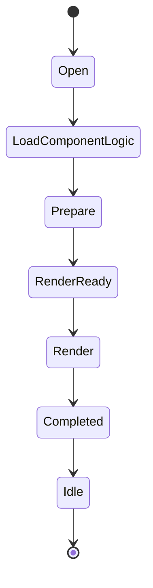

# 快速开始

<cite>
**本文档中引用的文件**   
- [demo-progressive.tsx](file://packages/h5-builder/src/demo-progressive.tsx)
- [package.json](file://packages/h5-builder/package.json)
- [index.html](file://packages/h5-builder/index.html)
- [vite.config.ts](file://packages/h5-builder/vite.config.ts)
- [service-identifiers.ts](file://packages/h5-builder/src/services/service-identifiers.ts)
- [http.service.ts](file://packages/h5-builder/src/services/http.service.ts)
- [bridge.service.ts](file://packages/h5-builder/src/services/bridge.service.ts)
- [schema.service.ts](file://packages/h5-builder/src/services/schema.service.ts)
- [get-schema-job.ts](file://packages/h5-builder/src/jobs/get-schema-job.ts)
- [job-scheduler.ts](file://packages/h5-builder/src/bedrock/launch/job-scheduler.ts)
- [pnpm-workspace.yaml](file://pnpm-workspace.yaml)
</cite>

## 目录
1. [简介](#简介)
2. [环境准备](#环境准备)
3. [项目克隆与依赖安装](#项目克隆与依赖安装)
4. [启动开发服务器](#启动开发服务器)
5. [核心架构解析](#核心架构解析)
6. [DI容器初始化](#di容器初始化)
7. [服务配置与注册](#服务配置与注册)
8. [Schema加载流程](#schema加载流程)
9. [组件树渲染机制](#组件树渲染机制)
10. [最小可运行代码示例](#最小可运行代码示例)
11. [常见问题排查](#常见问题排查)
12. [集成到现有项目](#集成到现有项目)

## 简介
本指南旨在为开发者提供一个完整的快速入门教程，指导如何在本地环境中运行和体验mobx项目。基于`demo-progressive.tsx`中的示例代码，我们将详细说明从克隆仓库到启动开发服务器的完整流程，包括pnpm安装依赖、构建命令和开发模式启动步骤。通过循序渐进的教程，展示如何初始化DI容器、配置服务、加载Schema并渲染组件树。

## 环境准备
在开始之前，请确保您的开发环境已安装以下工具：
- Node.js (建议版本16.x或更高)
- pnpm (包管理工具)
- Git (版本控制)

```bash
# 检查Node.js版本
node -v

# 安装pnpm
npm install -g pnpm

# 检查pnpm版本
pnpm -v
```

## 项目克隆与依赖安装
首先，克隆项目仓库并安装所有依赖项。

```bash
# 克隆项目仓库
git clone https://github.com/mobx.git
cd mobx

# 使用pnpm安装所有依赖
pnpm install
```

**Section sources**
- [pnpm-workspace.yaml](file://pnpm-workspace.yaml#L1-L3)
- [package.json](file://package.json#L1-L53)

## 启动开发服务器
项目使用Vite作为开发服务器，可以通过以下命令启动。

```bash
# 启动h5-builder开发服务器
pnpm --filter @mobx-monorepo/h5-builder demo

# 或者全局启动demo脚本
cd packages/h5-builder
pnpm demo
```

开发服务器默认运行在`http://localhost:3000`，会自动打开浏览器窗口。



**Diagram sources**
- [package.json](file://packages/h5-builder/package.json#L8-L13)
- [vite.config.ts](file://packages/h5-builder/vite.config.ts#L1-L23)

## 核心架构解析
该项目采用基于依赖注入（DI）和响应式状态管理的H5电商搭建框架。主要特点包括：

- **依赖注入系统**：使用自定义DI容器管理服务实例
- **流式启动与Job调度**：通过JobScheduler按生命周期阶段执行任务
- **逻辑驱动架构**：组件逻辑与UI分离
- **渐进式渲染**：优先构建逻辑树，逐步渲染视图


**Diagram sources**
- [demo-progressive.tsx](file://packages/h5-builder/src/demo-progressive.tsx#L1-L263)

## DI容器初始化
DI（Dependency Injection）容器是整个应用的核心，负责管理所有服务的生命周期和依赖关系。

### 初始化流程
1. 创建ServiceRegistry注册所有服务
2. 配置服务标识符和实现
3. 创建InstantiationService实例
4. 通过容器获取服务实例



**Diagram sources**
- [demo-progressive.tsx](file://packages/h5-builder/src/demo-progressive.tsx#L188-L211)
- [service-identifiers.ts](file://packages/h5-builder/src/services/service-identifiers.ts#L1-L20)

## 服务配置与注册
服务是应用功能的基本单元，通过服务标识符进行注册和注入。

### 服务注册示例
```typescript
const registry = new ServiceRegistry();
registry.register(IBridgeService, new SyncDescriptor(BridgeService, [true]));
registry.register(IPageContextService, PageContextService);
registry.register(ISchemaService, SchemaService);
registry.register(IHttpService, new SyncDescriptor(HttpService, [
  { baseURL: 'https://api.example.com' }
]));
```

### 核心服务说明
| 服务 | 作用 | 配置选项 |
|------|------|----------|
| IBridgeService | JSBridge通信服务 | isDebug: boolean |
| IHttpService | HTTP请求服务 | baseURL: string, token: string |
| ITrackerService | 埋点跟踪服务 | debug: boolean |
| ISchemaService | Schema管理服务 | 无 |
| IComponentService | 组件管理服务 | 无 |

**Section sources**
- [demo-progressive.tsx](file://packages/h5-builder/src/demo-progressive.tsx#L194-L205)
- [http.service.ts](file://packages/h5-builder/src/services/http.service.ts#L1-L281)
- [bridge.service.ts](file://packages/h5-builder/src/services/bridge.service.ts#L1-L227)

## Schema加载流程
Schema是页面结构的描述文件，决定了组件的布局和配置。

### 加载流程
1. 在Open阶段发起Schema请求
2. 获取Schema数据后注册组件加载器
3. 预加载组件资源
4. 构建组件模型树



### GetSchemaJob执行过程
```typescript
private async _whenOpen() {
  this._setBarrier(PageLifecycle.Open, this._schemaBarrier)
  const schema = await this.schemaService.fetchSchema()
  this._registerComponentLoader()
  this.componentService.preloadComponentsUnified(schema);
  this._schemaBarrier.open();
}
```

**Diagram sources**
- [get-schema-job.ts](file://packages/h5-builder/src/jobs/get-schema-job.ts#L1-L119)
- [schema.service.ts](file://packages/h5-builder/src/services/schema.service.ts#L1-L38)

## 组件树渲染机制
组件树的渲染采用渐进式策略，确保关键内容优先显示。

### 渲染生命周期


### 关键Job注册
```typescript
jobScheduler.registerJob(PageLifecycle.Open, GetSchemaJob);
jobScheduler.registerJob(PageLifecycle.LoadComponentLogic, LoadComponentsJob);
jobScheduler.registerJob(PageLifecycle.Prepare, BuildTreeJob);
jobScheduler.registerJob(PageLifecycle.RenderReady, EnsureViewReadyJob);
jobScheduler.registerJob(PageLifecycle.Render, TriggerRenderJob, setModelTree);
jobScheduler.registerJob(PageLifecycle.Render, ActivateTreeJob);
jobScheduler.registerJob(PageLifecycle.Completed, InitFirstScreenDataJob);
```

**Section sources**
- [demo-progressive.tsx](file://packages/h5-builder/src/demo-progressive.tsx#L76-L85)
- [job-scheduler.ts](file://packages/h5-builder/src/bedrock/launch/job-scheduler.ts#L1-L123)

## 最小可运行代码示例
以下是最小可运行的应用代码结构：

```typescript
// 创建服务容器
function makeContainerService() {
  const registry = new ServiceRegistry();
  registry.register(IBridgeService, new SyncDescriptor(BridgeService, [true]));
  registry.register(IHttpService, new SyncDescriptor(HttpService, [
    { baseURL: 'https://api.example.com' }
  ]));
  return new InstantiationService(registry.makeCollection());
}

// 创建Job调度器
function makeJobScheduler(instantiationService, setModelTree) {
  const jobScheduler = instantiationService.createInstance(JobScheduler, PageLifecycle.Open);
  jobScheduler.registerJob(PageLifecycle.Open, GetSchemaJob);
  jobScheduler.registerJob(PageLifecycle.Render, TriggerRenderJob, setModelTree);
  return jobScheduler;
}

// 启动应用
function useLaunch() {
  const [modelTree, setModelTree] = useState(null);
  const instantiationService = useRef(makeContainerService());
  const jobScheduler = useRef(null);

  useEffect(() => {
    jobScheduler.current = makeJobScheduler(instantiationService.current, setModelTree);
    driveJobScheduler(jobScheduler.current, setLifecycle);
  }, []);

  return { modelTree };
}
```

**Section sources**
- [demo-progressive.tsx](file://packages/h5-builder/src/demo-progressive.tsx#L188-L254)

## 常见问题排查
### 依赖安装失败
**问题**：pnpm install时出现依赖解析错误
**解决方案**：
```bash
# 清理缓存
pnpm store prune

# 重新安装
pnpm install --force

# 检查pnpm版本
pnpm -v
```

### 端口占用
**问题**：开发服务器启动时提示端口3000已被占用
**解决方案**：
```bash
# 查看占用端口的进程
lsof -i :3000

# 终止占用进程
kill -9 <PID>

# 或修改vite配置中的端口
# vite.config.ts中修改server.port
```

### 构建错误
**问题**：vite构建时报类型错误或模块找不到
**解决方案**：
1. 检查tsconfig.json配置
2. 确保所有依赖已正确安装
3. 清理node_modules并重新安装

```bash
rm -rf node_modules
pnpm install
```

**Section sources**
- [vite.config.ts](file://packages/h5-builder/vite.config.ts#L1-L23)
- [package.json](file://packages/h5-builder/package.json#L1-L39)

## 集成到现有项目
要将此框架集成到现有项目中，需要修改index.html文件。

### 修改index.html
```html
<!DOCTYPE html>
<html lang="zh-CN">
<head>
  <meta charset="UTF-8">
  <meta name="viewport" content="width=device-width, initial-scale=1.0">
  <title>集成到现有项目</title>
</head>
<body>
  <!-- 在现有DOM结构中添加容器 -->
  <div id="root-progressive"></div>
  
  <!-- 引入开发模式脚本 -->
  <script type="module" src="/src/demo-progressive.tsx"></script>
</body>
</html>
```

### 集成步骤
1. 在现有页面中添加`#root-progressive`容器
2. 引入demo-progressive.tsx作为模块
3. 确保Vite开发服务器正在运行
4. 调整CSS样式避免冲突

**Section sources**
- [index.html](file://packages/h5-builder/index.html#L1-L13)
- [demo-progressive.tsx](file://packages/h5-builder/src/demo-progressive.tsx#L258-L262)