# 最佳实践

<cite>
**本文档中引用的文件**  
- [model.ts](file://packages/h5-builder/src/bedrock/model.ts) - *更新了预加载系统集成*
- [disposable-store.ts](file://packages/h5-builder/src/bedrock/dispose/disposable-store.ts)
- [scheduler.ts](file://packages/h5-builder/src/bedrock/scheduler/core/scheduler.ts)
- [instantiation-service.ts](file://packages/h5-builder/src/bedrock/di/instantiation-service.ts)
- [service-collection.ts](file://packages/h5-builder/src/bedrock/di/service-collection.ts)
- [mobx.ts](file://packages/mobx-vue-lite/src/mobx.ts)
- [observer.ts](file://packages/mobx-vue-lite/src/observer.ts)
- [useLocalObservable.ts](file://packages/mobx-vue-lite/src/useLocalObservable.ts)
- [disposable-utils.ts](file://packages/h5-builder/src/bedrock/dispose/disposable-utils.ts)
- [prefetch.service.ts](file://packages/h5-builder/src/services/prefetch.service.ts) - *新增预加载服务*
- [component.service.ts](file://packages/h5-builder/src/services/component.service.ts) - *更新了预加载配置支持*
- [get-schema-job.ts](file://packages/h5-builder/src/jobs/get-schema-job.ts) - *新增预加载启动逻辑*
- [init-first-screen-data-job.ts](file://packages/h5-builder/src/jobs/init-first-screen-data-job.ts) - *新增预加载等待逻辑*
- [ensure-view-ready.ts](file://packages/h5-builder/src/jobs/ensure-view-ready.ts) - *新增预加载完成等待*
- [product-card.model.ts](file://packages/h5-builder/src/components/product-card/product-card.model.ts) - *演示预加载使用*
- [product-card-enhanced.model.ts](file://packages/h5-builder/src/components/product-card-enhanced/product-card-enhanced.model.ts) - *演示预加载+补充数据*
</cite>

## 更新摘要
**变更内容**   
- 新增关于预加载系统的最佳实践文档
- 详细说明了预加载系统的核心原则、依赖注入、生命周期驱动的执行和 Model-View 分离模式
- 提供了开发新组件和服务的指导
- 更新了相关组件模型以支持预加载数据
- 添加了预加载服务和相关作业的集成

## 目录
1. [简介](#简介)
2. [项目结构](#项目结构)
3. [核心组件](#核心组件)
4. [架构概述](#架构概述)
5. [详细组件分析](#详细组件分析)
6. [依赖分析](#依赖分析)
7. [性能考虑](#性能考虑)
8. [故障排除指南](#故障排除指南)
9. [结论](#结论)

## 简介
本文档旨在为使用 mobx 框架的项目提供一套完整的最佳实践指南。内容涵盖状态管理、依赖注入、任务调度、组件设计、性能监控、错误处理以及代码组织等多个方面，帮助团队建立统一的开发规范，提升代码质量与可维护性。

## 项目结构
本项目采用 monorepo 结构，包含多个功能包。核心功能集中在 `h5-builder` 包中，其 `bedrock` 模块提供了基础架构支持，包括模型基类、依赖注入、任务调度和资源管理等。`mobx-vue-lite` 包则封装了 MobX 核心功能，适配 Vue 响应式系统。

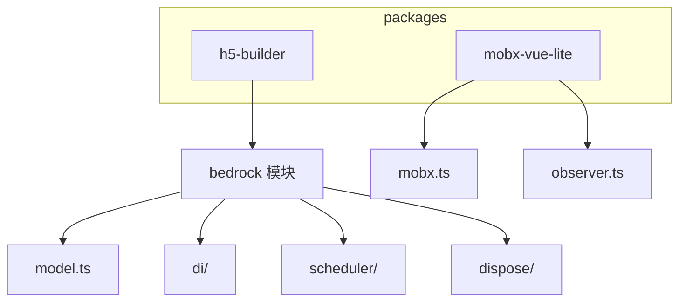

**图示来源**
- [model.ts](file://packages/h5-builder/src/bedrock/model.ts)
- [mobx.ts](file://packages/mobx-vue-lite/src/mobx.ts)

**本节来源**
- [model.ts](file://packages/h5-builder/src/bedrock/model.ts)
- [mobx.ts](file://packages/mobx-vue-lite/src/mobx.ts)

## 核心组件
项目的核心组件围绕状态管理、依赖注入和生命周期管理展开。`BaseComponentModel` 提供了统一的模型基类，集成响应式状态和资源清理机制。`InstantiationService` 实现了依赖注入容器，支持服务的延迟加载和所有权管理。`Scheduler` 负责任务的优先级调度与时间片分配。

**本节来源**
- [model.ts](file://packages/h5-builder/src/bedrock/model.ts#L1-L243)
- [instantiation-service.ts](file://packages/h5-builder/src/bedrock/di/instantiation-service.ts#L1-L468)
- [scheduler.ts](file://packages/h5-builder/src/bedrock/scheduler/core/scheduler.ts#L1-L174)

## 架构概述
系统采用分层架构，上层业务组件通过依赖注入获取服务，模型层通过 MobX 实现响应式状态管理，底层由调度器和资源管理器保障性能与内存安全。

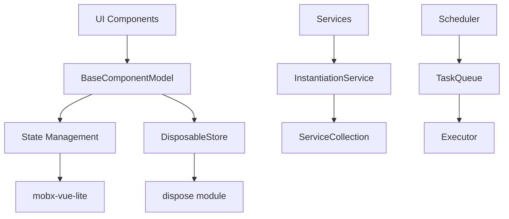

**图示来源**
- [model.ts](file://packages/h5-builder/src/bedrock/model.ts#L10-L243)
- [instantiation-service.ts](file://packages/h5-builder/src/bedrock/di/instantiation-service.ts#L61-L468)
- [scheduler.ts](file://packages/h5-builder/src/bedrock/scheduler/core/scheduler.ts#L24-L174)

## 详细组件分析

### 状态管理最佳实践
状态管理应遵循单一职责原则，每个模型只管理其自身相关的状态。使用 `BaseComponentModel` 作为基类，确保所有状态变更都是响应式的。

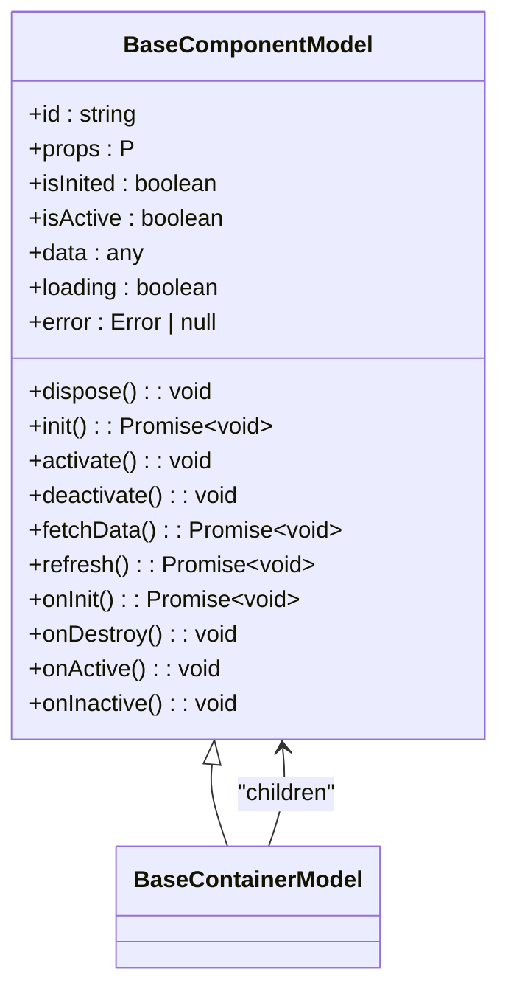

**图示来源**
- [model.ts](file://packages/h5-builder/src/bedrock/model.ts#L10-L243)

**本节来源**
- [model.ts](file://packages/h5-builder/src/bedrock/model.ts#L10-L243)

### 依赖注入正确使用方式
依赖注入应避免循环依赖和内存泄漏。使用 `InstantiationService` 创建服务实例，并通过 `ServiceCollection` 管理服务生命周期。

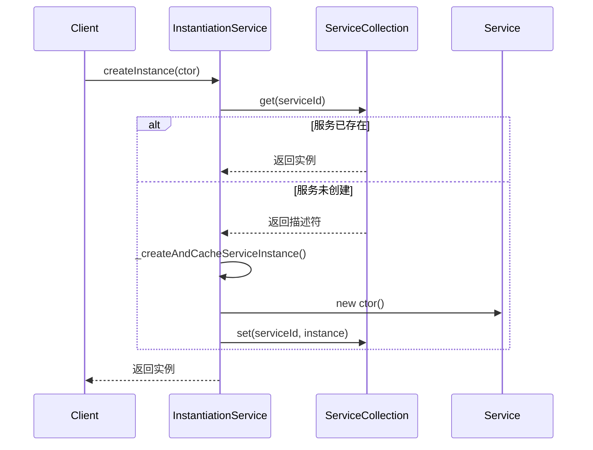

**图示来源**
- [instantiation-service.ts](file://packages/h5-builder/src/bedrock/di/instantiation-service.ts#L61-L468)
- [service-collection.ts](file://packages/h5-builder/src/bedrock/di/service-collection.ts#L14-L47)

**本节来源**
- [instantiation-service.ts](file://packages/h5-builder/src/bedrock/di/instantiation-service.ts#L61-L468)
- [service-collection.ts](file://packages/h5-builder/src/bedrock/di/service-collection.ts#L14-L47)

### 任务调度优化建议
任务调度应合理设置优先级和批处理策略。使用 `Scheduler` 管理任务队列，区分即时任务和延时任务。

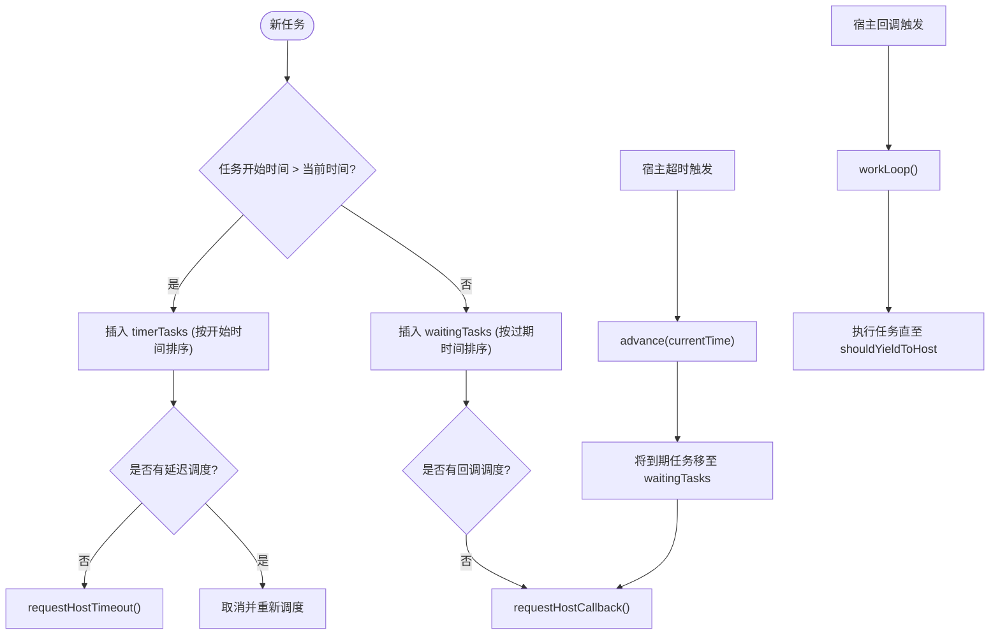

**图示来源**
- [scheduler.ts](file://packages/h5-builder/src/bedrock/scheduler/core/scheduler.ts#L24-L174)
- [task-queue.ts](file://packages/h5-builder/src/bedrock/scheduler/core/task-queue.ts#L12-L45)

**本节来源**
- [scheduler.ts](file://packages/h5-builder/src/bedrock/scheduler/core/scheduler.ts#L24-L174)
- [task-queue.ts](file://packages/h5-builder/src/bedrock/scheduler/core/task-queue.ts#L12-L45)

### 组件设计原则
组件应保持单一职责和可复用性。使用 `observer` 高阶组件包装函数组件，实现响应式更新。

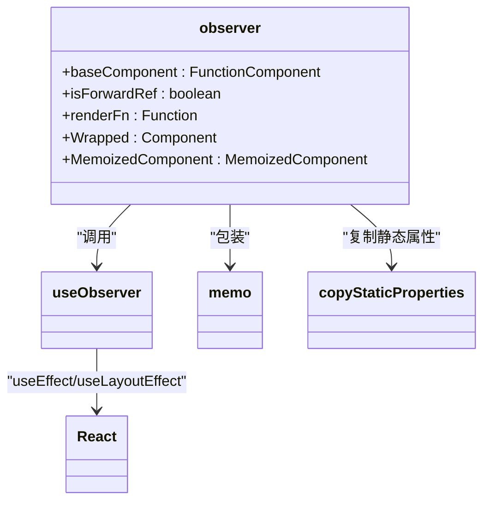

**图示来源**
- [observer.ts](file://packages/mobx-vue-lite/src/observer.ts#L16-L52)
- [useLocalObservable.ts](file://packages/mobx-vue-lite/src/useLocalObservable.ts#L23-L41)

**本节来源**
- [observer.ts](file://packages/mobx-vue-lite/src/observer.ts#L16-L52)
- [useLocalObservable.ts](file://packages/mobx-vue-lite/src/useLocalObservable.ts#L23-L41)

### 性能监控与错误处理
建立标准化的性能监控和错误处理方案。使用 `DisposableStore` 管理资源，防止内存泄漏。

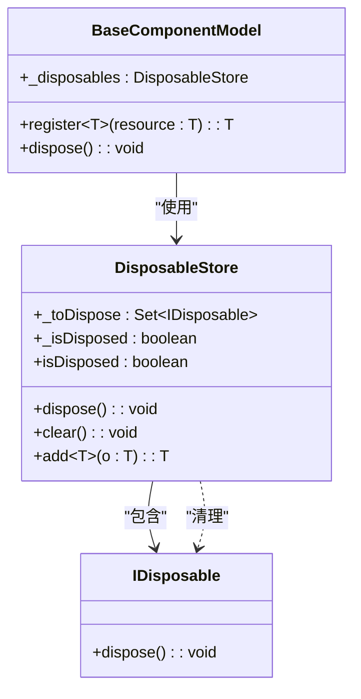

**图示来源**
- [disposable-store.ts](file://packages/h5-builder/src/bedrock/dispose/disposable-store.ts#L6-L84)
- [model.ts](file://packages/h5-builder/src/bedrock/model.ts#L12-L58)

**本节来源**
- [disposable-store.ts](file://packages/h5-builder/src/bedrock/dispose/disposable-store.ts#L6-L84)
- [model.ts](file://packages/h5-builder/src/bedrock/model.ts#L12-L58)

### 预加载系统最佳实践
预加载系统旨在通过提前加载关键数据来提升用户体验和页面性能。系统遵循核心原则：非阻塞性、优先级调度、Tab 感知和可插拔设计。

**核心原则**
- **非阻塞性**：预加载在 `GetSchemaJob` 的 `Open` 阶段启动，不阻塞主线程
- **优先级调度**：根据配置的优先级（critical, high, normal, low）和当前 Tab 状态调整任务顺序
- **Tab 感知**：属于当前激活 Tab 的组件预加载优先级提升，非当前 Tab 的组件优先级降低
- **可插拔设计**：`fetchData` 方法设计为可替换，便于从 Mock 切换到真实接口

**依赖注入**
预加载服务通过依赖注入系统集成到各个组件和作业中：
- `PrefetchService` 通过 `IPrefetchService` 标识符注入
- 所有需要预加载功能的组件和服务都必须声明此依赖
- 基类 `BaseComponentModel` 将 `PrefetchService` 作为必选依赖

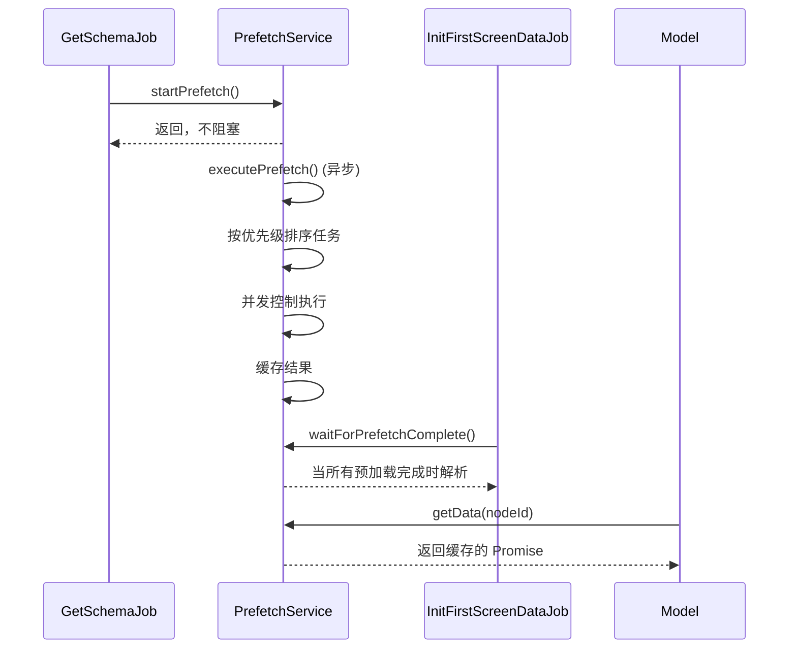

**图示来源**
- [prefetch.service.ts](file://packages/h5-builder/src/services/prefetch.service.ts#L25-L42)
- [get-schema-job.ts](file://packages/h5-builder/src/jobs/get-schema-job.ts#L60-L67)
- [ensure-view-ready.ts](file://packages/h5-builder/src/jobs/ensure-view-ready.ts#L54-L57)
- [init-first-screen-data-job.ts](file://packages/h5-builder/src/jobs/init-first-screen-data-job.ts#L50-L52)
- [model.ts](file://packages/h5-builder/src/bedrock/model/model.ts#L85-L96)

**生命周期驱动的执行**
预加载系统的执行与页面生命周期紧密耦合：
1. **Open 阶段**：`GetSchemaJob` 启动预加载，立即返回，不阻塞
2. **LoadComponentLogicAndPrefetch 阶段**：组件逻辑加载的同时，预加载在后台进行
3. **RenderReady 阶段**：`EnsureViewReadyJob` 等待预加载完成，确保视图渲染时数据已就绪
4. **Completed 阶段**：`InitFirstScreenDataJob` 等待预加载完成，然后初始化模型树

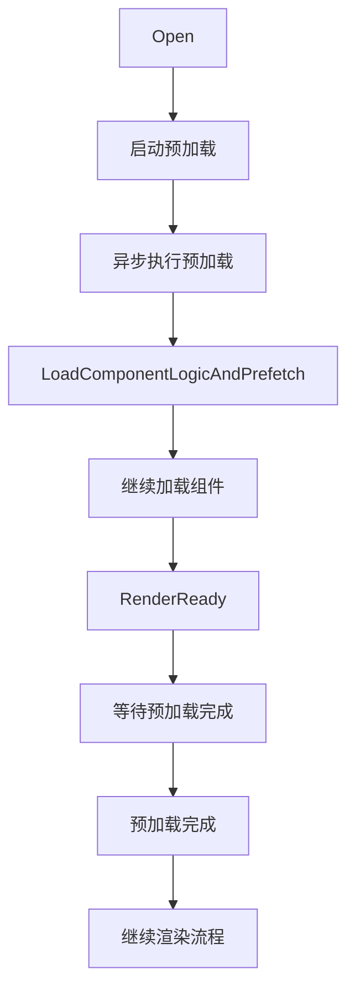

**图示来源**
- [lifecycle.ts](file://packages/h5-builder/src/jobs/lifecycle.ts)
- [get-schema-job.ts](file://packages/h5-builder/src/jobs/get-schema-job.ts#L60-L67)
- [ensure-view-ready.ts](file://packages/h5-builder/src/jobs/ensure-view-ready.ts#L54-L57)

**Model-View 分离模式**
预加载系统遵循 Model-View 分离原则，确保数据获取与视图渲染解耦：
- **Model 层**：负责数据获取和状态管理，通过 `init()` 方法协调预加载数据和实时数据
- **View 层**：只负责数据展示，不关心数据来源
- **数据流**：预加载数据通过 `PrefetchService` 缓存，Model 在初始化时获取，View 通过响应式更新

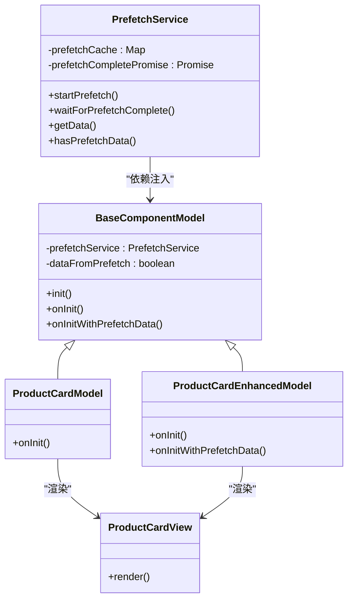

**图示来源**
- [prefetch.service.ts](file://packages/h5-builder/src/services/prefetch.service.ts)
- [model.ts](file://packages/h5-builder/src/bedrock/model/model.ts#L75-L117)
- [product-card.model.ts](file://packages/h5-builder/src/components/product-card/product-card.model.ts)
- [product-card-enhanced.model.ts](file://packages/h5-builder/src/components/product-card-enhanced/product-card-enhanced.model.ts)

**开发新组件和服务的指导**
1. **组件开发**：
   - 继承 `BaseComponentModel`，利用其内置的预加载支持
   - 在 `onInit` 中处理无预加载数据的情况
   - 在 `onInitWithPrefetchData` 中处理有预加载数据的情况，可选择性加载补充数据
   - 使用 `isDataFromPrefetch` 属性判断数据来源

2. **服务开发**：
   - 通过 `IPrefetchService` 注入预加载服务
   - 遵循可插拔设计原则，将数据获取逻辑封装在独立方法中
   - 使用并发控制避免过多网络请求
   - 实现错误处理和降级策略

3. **配置预加载**：
   - 在页面 Schema 中定义 `prefetch` 配置
   - 为每个需要预加载的组件指定 `nodeId`、`params` 和可选的 `priority`
   - 优先级默认为 `normal`，可根据业务重要性调整

**本节来源**
- [prefetch.service.ts](file://packages/h5-builder/src/services/prefetch.service.ts)
- [model.ts](file://packages/h5-builder/src/bedrock/model/model.ts)
- [get-schema-job.ts](file://packages/h5-builder/src/jobs/get-schema-job.ts)
- [ensure-view-ready.ts](file://packages/h5-builder/src/jobs/ensure-view-ready.ts)
- [init-first-screen-data-job.ts](file://packages/h5-builder/src/jobs/init-first-screen-data-job.ts)
- [component.service.ts](file://packages/h5-builder/src/services/component.service.ts)

## 依赖分析
项目依赖关系清晰，各模块职责分明。`h5-builder` 依赖 `mobx-vue-lite` 提供响应式能力，`bedrock` 内部模块间通过接口解耦。

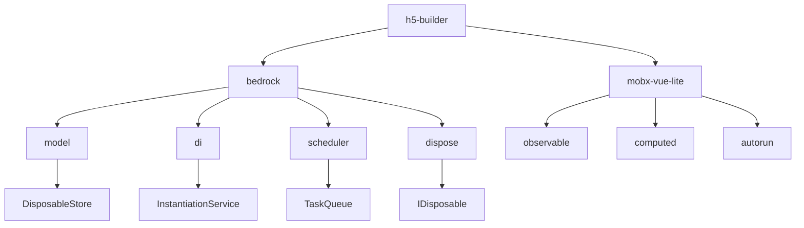

**图示来源**
- [package.json](file://package.json)
- [model.ts](file://packages/h5-builder/src/bedrock/model.ts)
- [instantiation-service.ts](file://packages/h5-builder/src/bedrock/di/instantiation-service.ts)

**本节来源**
- [package.json](file://package.json)
- [model.ts](file://packages/h5-builder/src/bedrock/model.ts)
- [instantiation-service.ts](file://packages/h5-builder/src/bedrock/di/instantiation-service.ts)

## 性能考虑
- 使用 `useLocalObservable` 创建局部状态，避免全局状态污染
- 通过 `Scheduler` 实现时间片调度，防止主线程阻塞
- 利用 `IdleValue` 实现服务的延迟初始化，优化启动性能
- 使用 `disposable-store` 集中管理资源，确保及时释放
- **预加载优化**：在非关键阶段提前加载数据，减少用户等待时间

## 故障排除指南
- **内存泄漏**：检查是否所有 `IDisposable` 对象都已注册到 `DisposableStore`
- **循环依赖**：`InstantiationService` 会检测并抛出循环依赖错误
- **状态不更新**：确保组件使用 `observer` 包装，且状态属性为响应式
- **任务未执行**：检查 `Scheduler` 的 `shouldYieldToHost` 实现和执行环境支持
- **预加载数据未生效**：检查组件 `id` 是否与预加载配置中的 `nodeId` 匹配
- **预加载超时**：检查 `PrefetchService` 的并发控制设置和网络状况

**本节来源**
- [disposable-store.ts](file://packages/h5-builder/src/bedrock/dispose/disposable-store.ts#L6-L84)
- [instantiation-service.ts](file://packages/h5-builder/src/bedrock/di/instantiation-service.ts#L24-L29)
- [observer.ts](file://packages/mobx-vue-lite/src/observer.ts#L35-L39)

## 结论
本文档总结了使用 mobx 框架的最佳实践，涵盖了状态管理、依赖注入、任务调度等多个关键方面。通过遵循这些规范，团队可以构建出高性能、可维护的应用程序。建议在项目中建立代码审查清单，确保这些最佳实践得到有效执行。