# HTTP服务

<cite>
**本文档引用的文件**  
- [http.service.ts](file://packages/h5-builder/src/services/http.service.ts)
- [bridge.service.ts](file://packages/h5-builder/src/services/bridge.service.ts)
- [service-identifiers.ts](file://packages/h5-builder/src/services/service-identifiers.ts)
- [product-card.model.ts](file://packages/h5-builder/src/components/product-card/product-card.model.ts)
- [http.service.test.ts](file://packages/h5-builder/src/__tests__/http.service.test.ts)
</cite>

## 目录
1. [简介](#简介)
2. [核心实现机制](#核心实现机制)
3. [拦截器机制](#拦截器机制)
4. [默认配置处理](#默认配置处理)
5. [请求方法封装](#请求方法封装)
6. [请求取消机制](#请求取消机制)
7. [依赖注入使用示例](#依赖注入使用示例)
8. [与BridgeService的协作关系](#与bridgeservice的协作关系)
9. [性能优化建议](#性能优化建议)
10. [错误处理](#错误处理)

## 简介

HTTP服务是基于JSBridge的fetch封装，为应用程序提供统一的网络请求能力。该服务实现了完整的请求/响应/错误拦截器机制，支持GET、POST、PUT、DELETE等HTTP方法，并提供了请求取消、超时控制等高级功能。通过依赖注入系统，可以在组件或任务中方便地使用该服务。

## 核心实现机制

HTTP服务的核心是基于JSBridge的fetch封装，通过BridgeService与原生环境进行通信。当发起网络请求时，HttpService会将请求配置传递给BridgeService，由其调用原生的fetch方法执行实际的网络请求。

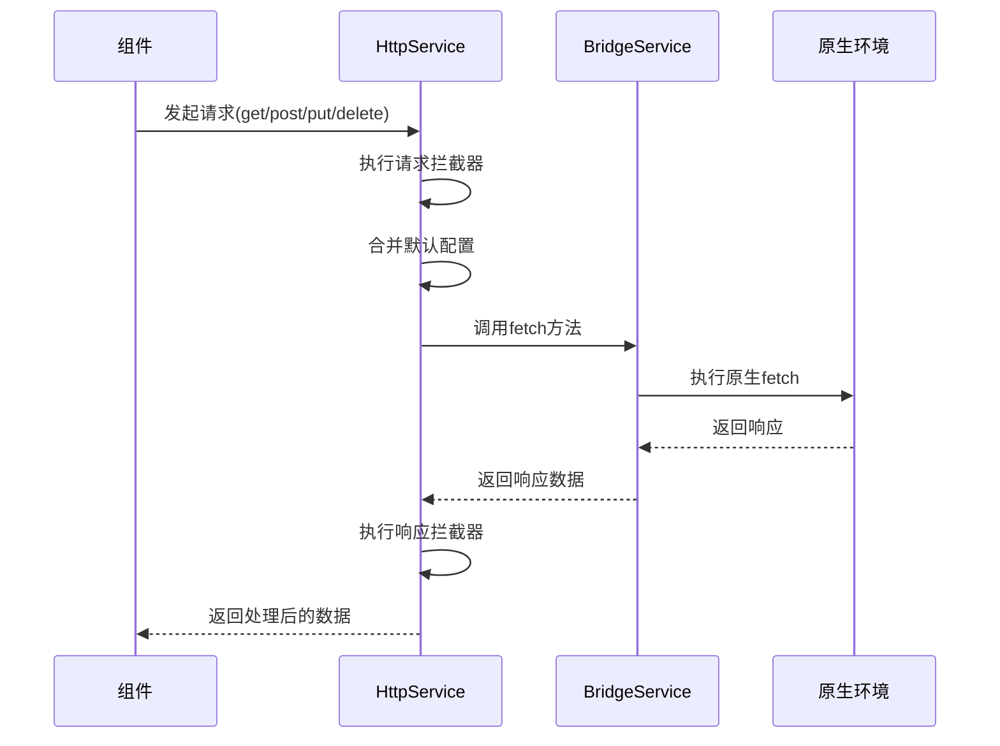

**Diagram sources**
- [http.service.ts](file://packages/h5-builder/src/services/http.service.ts#L147-L203)
- [bridge.service.ts](file://packages/h5-builder/src/services/bridge.service.ts#L55-L65)

**Section sources**
- [http.service.ts](file://packages/h5-builder/src/services/http.service.ts#L56-L280)

## 拦截器机制

HttpService提供了完整的拦截器机制，包括请求拦截器、响应拦截器和错误拦截器，允许在请求生命周期的各个阶段插入自定义逻辑。

### 请求拦截器

请求拦截器在请求发送前执行，可以修改请求配置。通过`addRequestInterceptor`方法注册拦截器，返回一个取消函数用于移除拦截器。

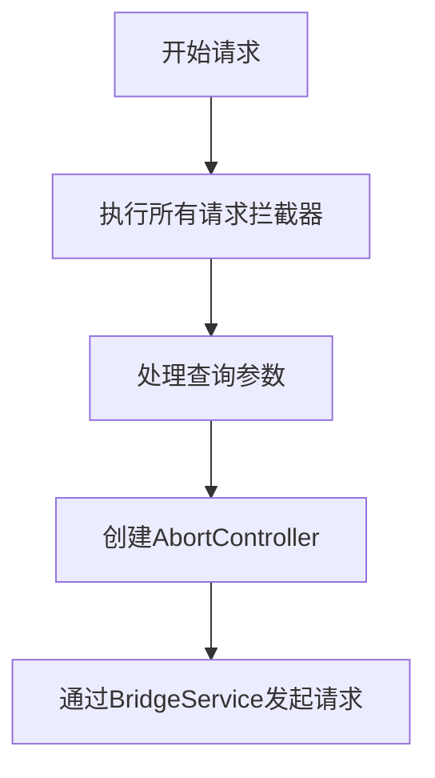

**Diagram sources**
- [http.service.ts](file://packages/h5-builder/src/services/http.service.ts#L159-L162)

### 响应拦截器

响应拦截器在收到响应后、返回给调用方之前执行，可以对响应数据进行处理或转换。

### 错误拦截器

错误拦截器在请求发生错误时执行，可以对错误进行处理、记录或转换。

```mermaid
classDiagram
class RequestInterceptor {
<<type>>
(config : HttpRequestConfig) => HttpRequestConfig | Promise~HttpRequestConfig~
}
class ResponseInterceptor {
<<type>>
<T>(response : HttpResponse~T~) => HttpResponse~T~ | Promise~HttpResponse~T~~
}
class ErrorInterceptor {
<<type>>
(error : Error) => Error | Promise~Error~
}
class HttpService {
-requestInterceptors : RequestInterceptor[]
-responseInterceptors : ResponseInterceptor[]
-errorInterceptors : ErrorInterceptor[]
+addRequestInterceptor(interceptor) : () => void
+addResponseInterceptor(interceptor) : () => void
+addErrorInterceptor(interceptor) : () => void
}
HttpService --> RequestInterceptor : "包含"
HttpService --> ResponseInterceptor : "包含"
HttpService --> ErrorInterceptor : "包含"
```

**Diagram sources**
- [http.service.ts](file://packages/h5-builder/src/services/http.service.ts#L35-L45)
- [http.service.ts](file://packages/h5-builder/src/services/http.service.ts#L59-L61)

**Section sources**
- [http.service.ts](file://packages/h5-builder/src/services/http.service.ts#L108-L142)

## 默认配置处理

HttpService提供了合理的默认配置，并支持通过选项参数进行自定义配置。

### 默认配置

默认配置包括：
- 请求方法：GET
- 超时时间：10000毫秒
- 请求头：Content-Type设置为application/json

### baseURL处理

当提供baseURL选项时，会自动添加一个请求拦截器，将相对URL转换为绝对URL。

### token注入

当提供token选项时，会自动添加一个请求拦截器，将token注入到Authorization请求头中。

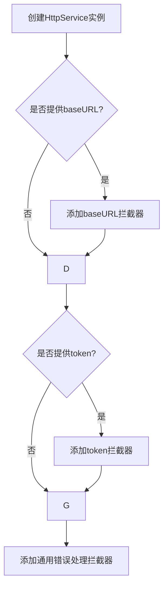

**Diagram sources**
- [http.service.ts](file://packages/h5-builder/src/services/http.service.ts#L77-L97)

**Section sources**
- [http.service.ts](file://packages/h5-builder/src/services/http.service.ts#L65-L72)

## 请求方法封装

HttpService对常用的HTTP方法进行了封装，提供了简洁的API。

### GET请求

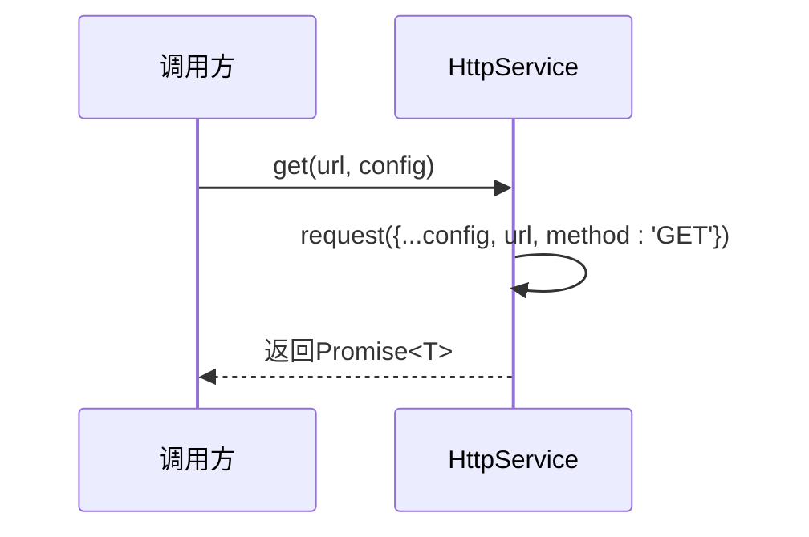

### POST请求

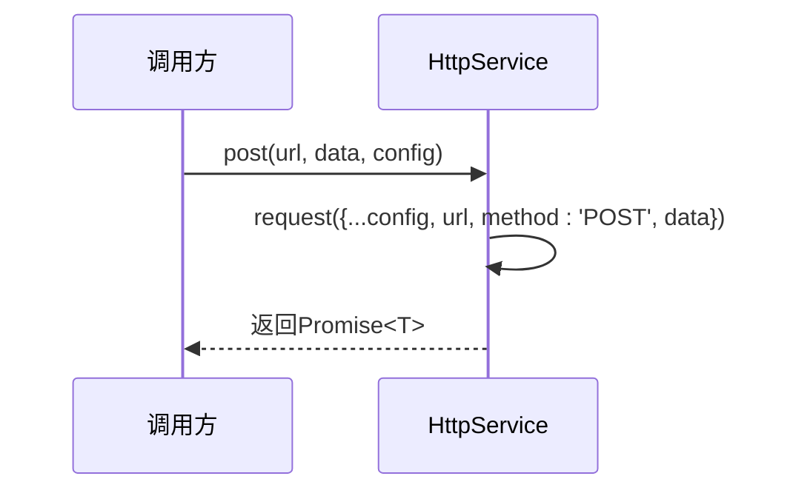

### PUT和DELETE请求

类似地，PUT和DELETE请求也进行了相应的封装。

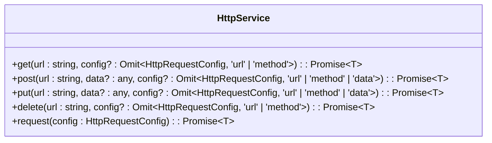

**Diagram sources**
- [http.service.ts](file://packages/h5-builder/src/services/http.service.ts#L208-L249)

**Section sources**
- [http.service.ts](file://packages/h5-builder/src/services/http.service.ts#L208-L249)

## 请求取消机制

HttpService提供了完善的请求取消机制，可以取消所有未完成的请求。

### pendingRequests管理

使用Set数据结构管理所有未完成请求的AbortController实例。

### cancelAll方法

`cancelAll()`方法会遍历所有pendingRequests，调用其abort()方法取消请求，并清空pendingRequests集合。

### dispose方法

在服务销毁时，会自动调用cancelAll()方法取消所有未完成的请求。

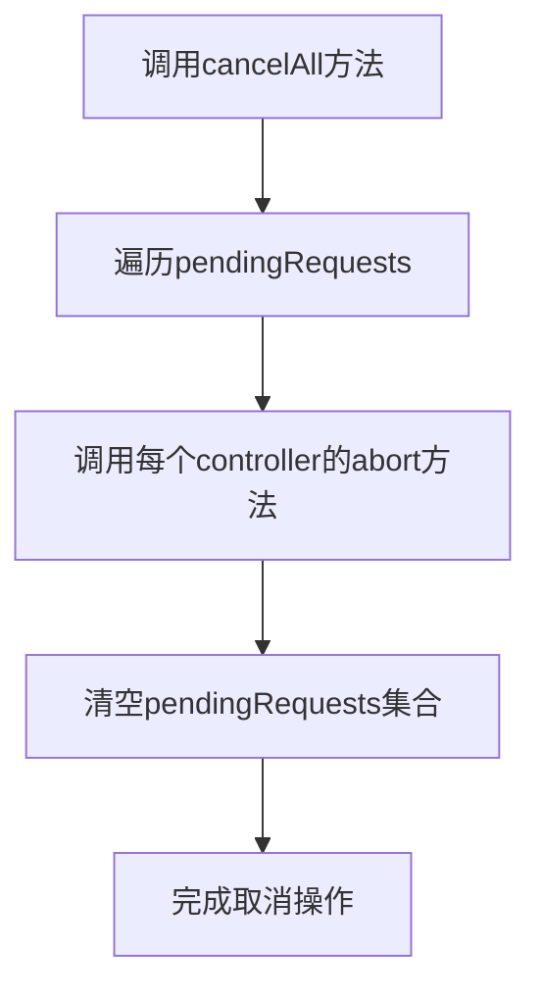

**Diagram sources**
- [http.service.ts](file://packages/h5-builder/src/services/http.service.ts#L254-L259)

**Section sources**
- [http.service.ts](file://packages/h5-builder/src/services/http.service.ts#L254-L259)

## 依赖注入使用示例

通过依赖注入系统，可以在组件中方便地使用HttpService。

### 服务标识符

使用服务标识符进行依赖注入，确保类型安全。

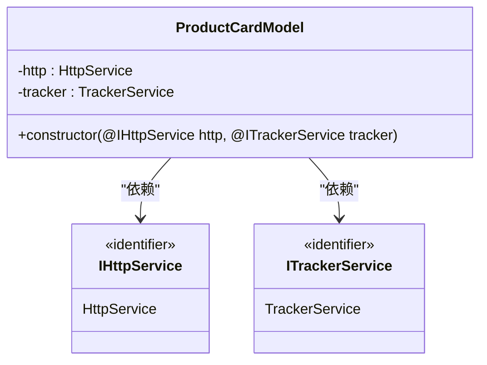

### 组件中使用

在组件Model中通过构造函数注入HttpService实例。

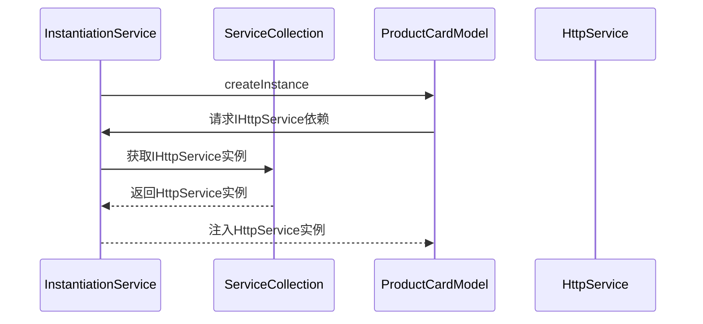

**Diagram sources**
- [product-card.model.ts](file://packages/h5-builder/src/components/product-card/product-card.model.ts#L36-L38)
- [service-identifiers.ts](file://packages/h5-builder/src/services/service-identifiers.ts#L14)

**Section sources**
- [product-card.model.ts](file://packages/h5-builder/src/components/product-card/product-card.model.ts#L29-L40)

## 与BridgeService的协作关系

HttpService与BridgeService紧密协作，共同完成网络请求功能。

### 依赖关系

HttpService依赖于BridgeService，通过依赖注入获取其实例。

### 调用流程

HttpService将请求配置传递给BridgeService，由其负责与原生环境通信。

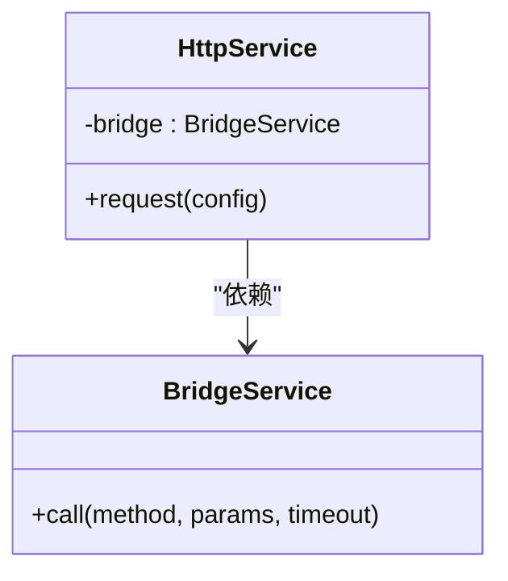

**Diagram sources**
- [http.service.ts](file://packages/h5-builder/src/services/http.service.ts#L75)
- [bridge.service.ts](file://packages/h5-builder/src/services/bridge.service.ts#L55-L65)

**Section sources**
- [http.service.ts](file://packages/h5-builder/src/services/http.service.ts#L75)
- [bridge.service.ts](file://packages/h5-builder/src/services/bridge.service.ts#L55-L65)

## 性能优化建议

### 合理设置超时时间

根据业务需求合理设置请求超时时间，避免长时间等待。

### 避免内存泄漏

- 及时取消不再需要的请求
- 在组件销毁时调用dispose方法
- 合理管理拦截器的生命周期

### 拦截器优化

- 避免在拦截器中执行耗时操作
- 及时移除不再需要的拦截器
- 合理组织拦截器的执行顺序

### 错误处理

- 实现统一的错误处理拦截器
- 记录关键错误信息用于调试
- 提供友好的错误提示

## 错误处理

HttpService提供了完善的错误处理机制，通过错误拦截器可以统一处理各种网络请求错误。

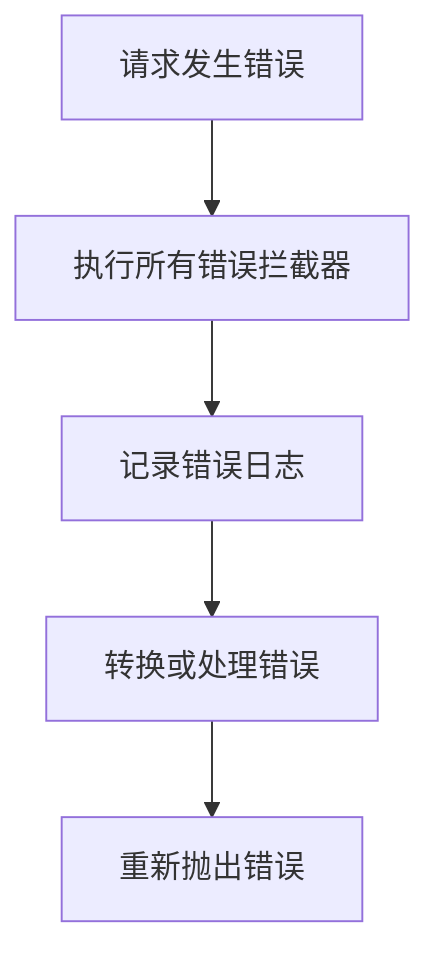

**Diagram sources**
- [http.service.ts](file://packages/h5-builder/src/services/http.service.ts#L195-L201)

**Section sources**
- [http.service.ts](file://packages/h5-builder/src/services/http.service.ts#L195-L201)