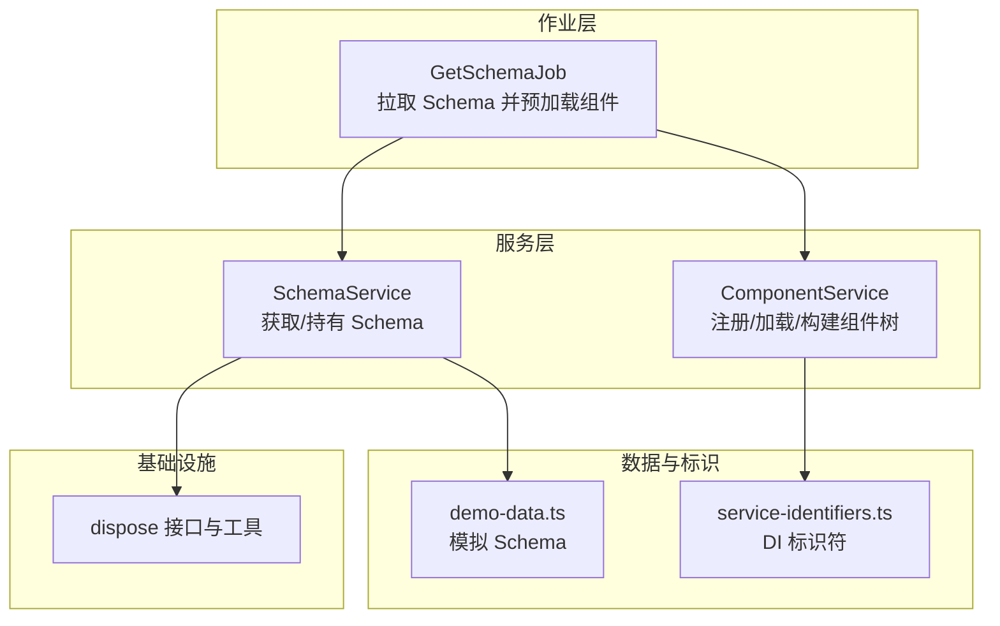
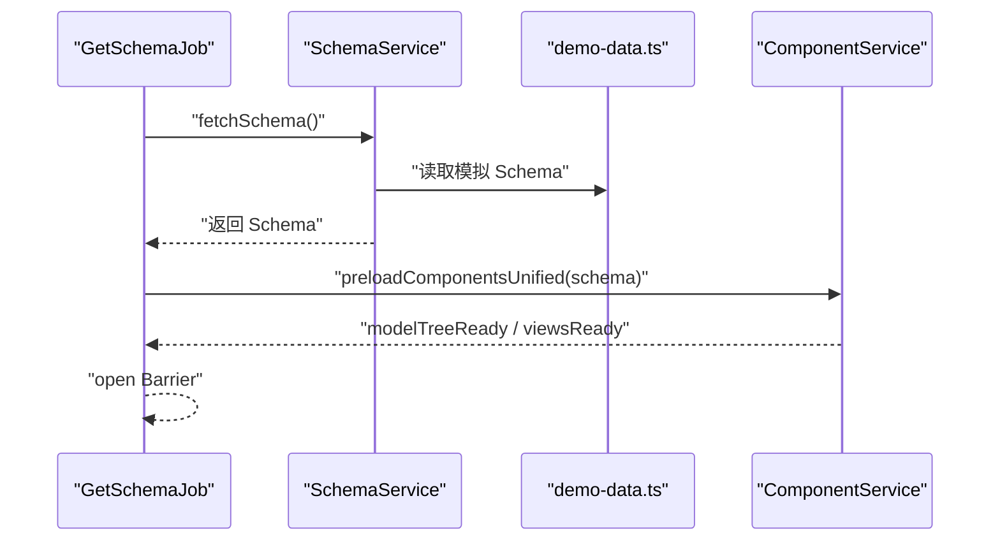
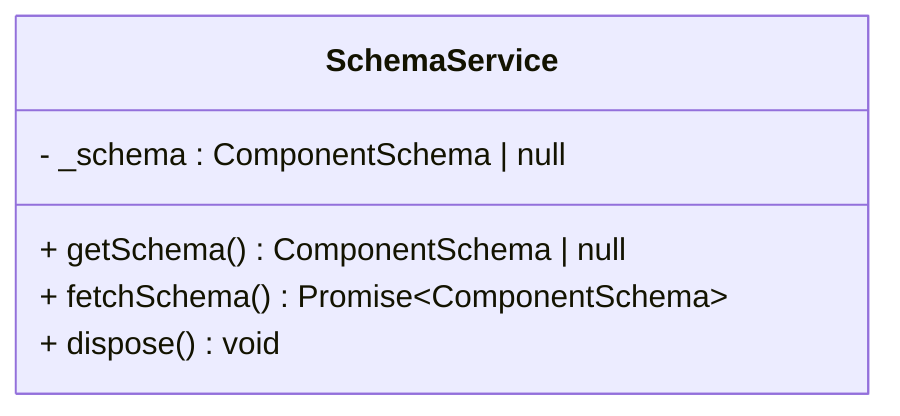
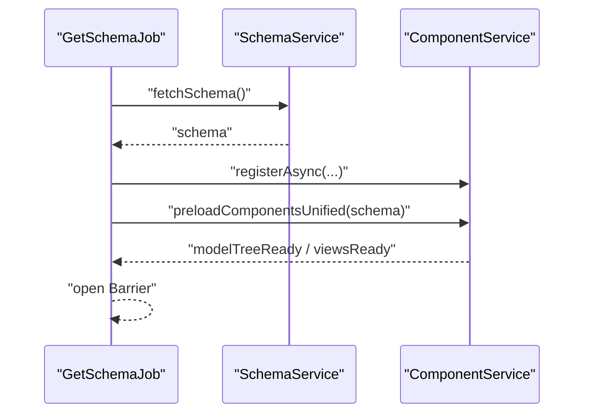
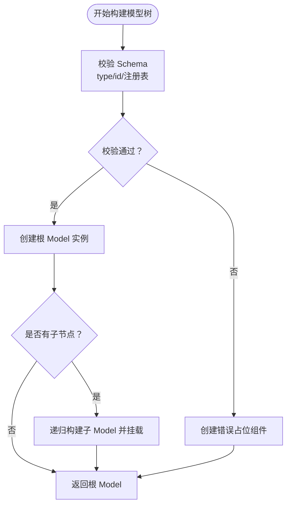
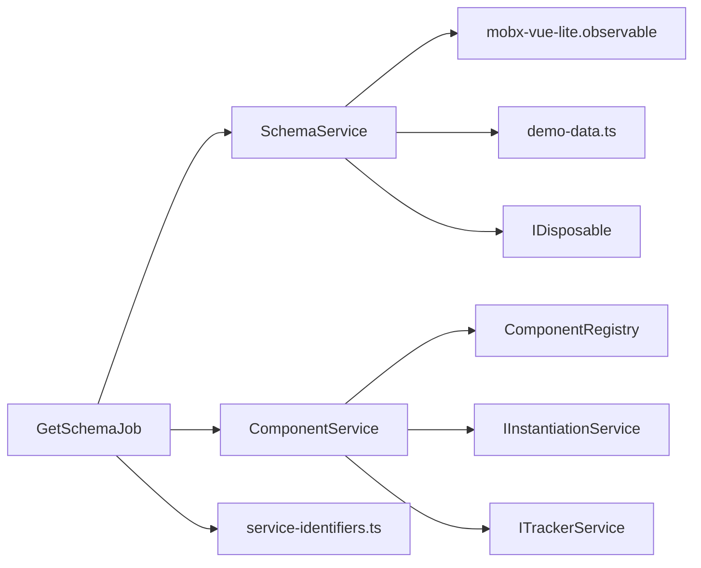

# Schema服务

<cite>
**本文引用的文件**
- [packages/h5-builder/src/services/schema.service.ts](file://packages/h5-builder/src/services/schema.service.ts)
- [packages/h5-builder/src/mock/demo-data.ts](file://packages/h5-builder/src/mock/demo-data.ts)
- [packages/h5-builder/src/jobs/get-schema-job.ts](file://packages/h5-builder/src/jobs/get-schema-job.ts)
- [packages/h5-builder/src/services/component.service.ts](file://packages/h5-builder/src/services/component.service.ts)
- [packages/h5-builder/src/services/service-identifiers.ts](file://packages/h5-builder/src/services/service-identifiers.ts)
- [packages/h5-builder/src/bedrock/dispose/index.ts](file://packages/h5-builder/src/bedrock/dispose/index.ts)
- [packages/h5-builder/src/bedrock/dispose/disposable-t.ts](file://packages/h5-builder/src/bedrock/dispose/disposable-t.ts)
- [packages/h5-builder/src/demo-progressive.tsx](file://packages/h5-builder/src/demo-progressive.tsx)
</cite>

## 目录
1. [简介](#简介)
2. [项目结构](#项目结构)
3. [核心组件](#核心组件)
4. [架构总览](#架构总览)
5. [详细组件分析](#详细组件分析)
6. [依赖分析](#依赖分析)
7. [性能考虑](#性能考虑)
8. [故障排查指南](#故障排查指南)
9. [结论](#结论)
10. [附录](#附录)

## 简介
本文件围绕 H5 构建框架中的 Schema 服务展开，系统阐述 SchemaService 的职责与实现要点，包括：
- 如何通过 fetchSchema 方法异步获取页面结构数据；
- 如何借助 mobx-vue-lite 的 observable 实现响应式更新；
- 如何通过 getSchema 安全返回当前 Schema 状态；
- 与组件模型层的数据绑定机制；
- 与 mock/demo-data.ts 的集成方式及开发环境下的数据模拟流程；
- 在 Job 任务（如 GetSchemaJob）中的典型调用用例；
- dispose 方法的清理逻辑；
- Schema 数据的验证策略与错误处理机制；
- 未来可能的扩展方向（如支持 Schema 版本管理）。

## 项目结构
Schema 服务位于 h5-builder 包内，与组件服务、作业调度、DI 标识符、响应式工具、以及模拟数据共同构成页面结构数据的拉取、转换与渲染管线。

图表来源
- [packages/h5-builder/src/services/schema.service.ts](file://packages/h5-builder/src/services/schema.service.ts#L1-L37)
- [packages/h5-builder/src/services/component.service.ts](file://packages/h5-builder/src/services/component.service.ts#L1-L120)
- [packages/h5-builder/src/jobs/get-schema-job.ts](file://packages/h5-builder/src/jobs/get-schema-job.ts#L1-L119)
- [packages/h5-builder/src/mock/demo-data.ts](file://packages/h5-builder/src/mock/demo-data.ts#L1-L334)
- [packages/h5-builder/src/services/service-identifiers.ts](file://packages/h5-builder/src/services/service-identifiers.ts#L1-L20)
- [packages/h5-builder/src/bedrock/dispose/index.ts](file://packages/h5-builder/src/bedrock/dispose/index.ts#L1-L35)

章节来源
- [packages/h5-builder/src/services/schema.service.ts](file://packages/h5-builder/src/services/schema.service.ts#L1-L37)
- [packages/h5-builder/src/services/component.service.ts](file://packages/h5-builder/src/services/component.service.ts#L1-L120)
- [packages/h5-builder/src/jobs/get-schema-job.ts](file://packages/h5-builder/src/jobs/get-schema-job.ts#L1-L119)
- [packages/h5-builder/src/mock/demo-data.ts](file://packages/h5-builder/src/mock/demo-data.ts#L1-L334)
- [packages/h5-builder/src/services/service-identifiers.ts](file://packages/h5-builder/src/services/service-identifiers.ts#L1-L20)
- [packages/h5-builder/src/bedrock/dispose/index.ts](file://packages/h5-builder/src/bedrock/dispose/index.ts#L1-L35)

## 核心组件
- SchemaService：负责异步拉取页面结构数据并维护当前状态；通过 observable 使其成为响应式对象；提供 getSchema 以安全返回当前状态；实现 IDisposable 接口以便清理。
- ComponentService：负责组件注册、异步加载、构建模型树；内置 Schema 验证与错误占位处理；提供统一并发加载与映射注册能力。
- GetSchemaJob：在页面生命周期 Open 阶段拉取 Schema，并基于 Schema 预加载组件资源，随后开放屏障推进后续阶段。
- demo-data.ts：提供完整的页面结构示例，用于开发与演示。
- service-identifiers.ts：定义 DI 标识符，便于依赖注入。
- dispose 相关工具：提供 IDisposable 接口与多种容器/工具类，支撑服务生命周期管理。

章节来源
- [packages/h5-builder/src/services/schema.service.ts](file://packages/h5-builder/src/services/schema.service.ts#L1-L37)
- [packages/h5-builder/src/services/component.service.ts](file://packages/h5-builder/src/services/component.service.ts#L1-L250)
- [packages/h5-builder/src/jobs/get-schema-job.ts](file://packages/h5-builder/src/jobs/get-schema-job.ts#L1-L119)
- [packages/h5-builder/src/mock/demo-data.ts](file://packages/h5-builder/src/mock/demo-data.ts#L1-L334)
- [packages/h5-builder/src/services/service-identifiers.ts](file://packages/h5-builder/src/services/service-identifiers.ts#L1-L20)
- [packages/h5-builder/src/bedrock/dispose/index.ts](file://packages/h5-builder/src/bedrock/dispose/index.ts#L1-L35)

## 架构总览
SchemaService 作为数据入口，配合 GetSchemaJob 在页面打开阶段拉取 Schema，并驱动 ComponentService 进行组件资源的预加载与映射注册。组件服务在构建模型树前对 Schema 进行验证，遇到未知类型或缺失字段时生成错误占位组件，保证渲染稳定性。

图表来源
- [packages/h5-builder/src/jobs/get-schema-job.ts](file://packages/h5-builder/src/jobs/get-schema-job.ts#L48-L118)
- [packages/h5-builder/src/services/schema.service.ts](file://packages/h5-builder/src/services/schema.service.ts#L23-L32)
- [packages/h5-builder/src/mock/demo-data.ts](file://packages/h5-builder/src/mock/demo-data.ts#L1-L334)
- [packages/h5-builder/src/services/component.service.ts](file://packages/h5-builder/src/services/component.service.ts#L626-L718)

## 详细组件分析

### SchemaService 分析
- 响应式设计：构造函数中将自身传入 observable，使内部状态变更可被观察。
- 状态持有：私有字段保存当前 Schema，getSchema 提供只读访问，避免外部直接修改。
- 异步拉取：fetchSchema 返回 Promise，内部通过延时模拟网络请求，最终设置内部状态并 resolve。
- 清理接口：实现 IDisposable，当前版本为空实现，便于未来扩展。

图表来源
- [packages/h5-builder/src/services/schema.service.ts](file://packages/h5-builder/src/services/schema.service.ts#L1-L37)

章节来源
- [packages/h5-builder/src/services/schema.service.ts](file://packages/h5-builder/src/services/schema.service.ts#L1-L37)

### GetSchemaJob 分析
- 生命周期钩子：在 Open 阶段执行 _whenOpen，拉取 Schema 并注册组件加载器。
- 组件预加载：拿到 Schema 后调用 ComponentService.preloadComponentsUnified，统一并发加载 Model 与 View，并在完成后建立映射。
- 屏障控制：通过 Barrier 控制后续阶段的推进时机，确保 Schema 就绪后再继续。

图表来源
- [packages/h5-builder/src/jobs/get-schema-job.ts](file://packages/h5-builder/src/jobs/get-schema-job.ts#L48-L118)
- [packages/h5-builder/src/services/component.service.ts](file://packages/h5-builder/src/services/component.service.ts#L286-L338)
- [packages/h5-builder/src/services/component.service.ts](file://packages/h5-builder/src/services/component.service.ts#L626-L718)

章节来源
- [packages/h5-builder/src/jobs/get-schema-job.ts](file://packages/h5-builder/src/jobs/get-schema-job.ts#L1-L119)

### ComponentService 与 Schema 验证
- Schema 结构：ComponentSchema 定义 type、id、props、children、meta 等字段。
- 验证策略：在 buildTree 前 validateSchema，要求存在 type、id，且组件类型已在注册表中。
- 错误处理：未知类型或构建异常时，创建错误占位组件并上报追踪事件，保证渲染不中断。
- 并发加载：统一队列并发加载 Model 与 View，完成后建立映射关系，提升首屏性能。

图表来源
- [packages/h5-builder/src/services/component.service.ts](file://packages/h5-builder/src/services/component.service.ts#L130-L244)
- [packages/h5-builder/src/services/component.service.ts](file://packages/h5-builder/src/services/component.service.ts#L626-L718)

章节来源
- [packages/h5-builder/src/services/component.service.ts](file://packages/h5-builder/src/services/component.service.ts#L1-L250)
- [packages/h5-builder/src/services/component.service.ts](file://packages/h5-builder/src/services/component.service.ts#L626-L718)

### 与 mock/demo-data.ts 的集成
- 开发环境模拟：SchemaService 在 fetchSchema 中使用来自 demo-data.ts 的完整页面结构，便于本地调试与演示。
- Schema 示例：demo-data.ts 提供多层级容器、实验容器、时间容器、网格布局容器等复杂组合，覆盖虚拟滚动、嵌套渲染、条件渲染等场景。

章节来源
- [packages/h5-builder/src/services/schema.service.ts](file://packages/h5-builder/src/services/schema.service.ts#L23-L32)
- [packages/h5-builder/src/mock/demo-data.ts](file://packages/h5-builder/src/mock/demo-data.ts#L1-L334)

### 与组件模型层的数据绑定机制
- 组件注册：ComponentService 维护 type → ModelClass 映射，构建树时依据 Schema.type 查找并实例化。
- 属性传递：Schema.props 作为参数传入模型构造函数，模型内部可读取并响应。
- 响应式更新：SchemaService 通过 observable 使状态变更可被观察，结合 mobx-vue-lite 的 observer 组件可实现视图层自动刷新。

章节来源
- [packages/h5-builder/src/services/component.service.ts](file://packages/h5-builder/src/services/component.service.ts#L130-L209)
- [packages/h5-builder/src/services/schema.service.ts](file://packages/h5-builder/src/services/schema.service.ts#L12-L15)

### Job 调用 SchemaService 的典型用例
- 页面打开阶段：GetSchemaJob 在 Open 阶段调用 fetchSchema，拿到 Schema 后注册组件加载器并预加载资源，随后开放屏障推进后续阶段。
- 与调度器集成：demo-progressive.tsx 中将 GetSchemaJob 注册到 JobScheduler 的 Open 阶段，形成完整的页面生命周期驱动。

章节来源
- [packages/h5-builder/src/jobs/get-schema-job.ts](file://packages/h5-builder/src/jobs/get-schema-job.ts#L48-L118)
- [packages/h5-builder/src/demo-progressive.tsx](file://packages/h5-builder/src/demo-progressive.tsx#L75-L110)

### dispose 方法的清理逻辑
- 接口实现：SchemaService 实现 IDisposable，当前版本为空实现，便于未来扩展。
- 基础设施：dispose 相关工具提供 Disposable 基类、MutableDisposable、SafeDisposable 等容器，用于统一管理生命周期与资源释放。

章节来源
- [packages/h5-builder/src/services/schema.service.ts](file://packages/h5-builder/src/services/schema.service.ts#L34-L36)
- [packages/h5-builder/src/bedrock/dispose/index.ts](file://packages/h5-builder/src/bedrock/dispose/index.ts#L1-L35)
- [packages/h5-builder/src/bedrock/dispose/disposable-t.ts](file://packages/h5-builder/src/bedrock/dispose/disposable-t.ts#L1-L120)

## 依赖分析
- SchemaService 依赖：
  - mobx-vue-lite.observable：实现响应式；
  - demo-data.ts：提供模拟 Schema；
  - dispose 接口：实现 IDisposable。
- GetSchemaJob 依赖：
  - ISchemaService、IComponentService：通过 DI 注入；
  - Barrier：控制阶段推进。
- ComponentService 依赖：
  - IInstantiationService、ITrackerService：依赖注入与追踪；
  - ComponentSchema 类型：用于构建树与验证。

图表来源
- [packages/h5-builder/src/services/schema.service.ts](file://packages/h5-builder/src/services/schema.service.ts#L1-L37)
- [packages/h5-builder/src/services/component.service.ts](file://packages/h5-builder/src/services/component.service.ts#L1-L120)
- [packages/h5-builder/src/jobs/get-schema-job.ts](file://packages/h5-builder/src/jobs/get-schema-job.ts#L1-L46)
- [packages/h5-builder/src/services/service-identifiers.ts](file://packages/h5-builder/src/services/service-identifiers.ts#L1-L20)
- [packages/h5-builder/src/bedrock/dispose/index.ts](file://packages/h5-builder/src/bedrock/dispose/index.ts#L1-L35)

章节来源
- [packages/h5-builder/src/services/schema.service.ts](file://packages/h5-builder/src/services/schema.service.ts#L1-L37)
- [packages/h5-builder/src/services/component.service.ts](file://packages/h5-builder/src/services/component.service.ts#L1-L120)
- [packages/h5-builder/src/jobs/get-schema-job.ts](file://packages/h5-builder/src/jobs/get-schema-job.ts#L1-L46)
- [packages/h5-builder/src/services/service-identifiers.ts](file://packages/h5-builder/src/services/service-identifiers.ts#L1-L20)
- [packages/h5-builder/src/bedrock/dispose/index.ts](file://packages/h5-builder/src/bedrock/dispose/index.ts#L1-L35)

## 性能考虑
- 异步拉取与延迟：fetchSchema 使用延时模拟网络请求，实际生产中可替换为真实 HTTP 请求；组件加载器支持延迟范围与优先级，有助于首屏优化。
- 并发控制：ComponentService 的统一并发队列与 Promise.race 实现“完成一个补充一个”的调度，减少整体等待时间。
- 预加载策略：在获取 Schema 后立即预加载组件资源，降低后续渲染阻塞。
- 错误降级：未知类型或构建失败时创建错误占位组件，避免整树渲染中断。

章节来源
- [packages/h5-builder/src/services/schema.service.ts](file://packages/h5-builder/src/services/schema.service.ts#L23-L32)
- [packages/h5-builder/src/services/component.service.ts](file://packages/h5-builder/src/services/component.service.ts#L370-L514)
- [packages/h5-builder/src/services/component.service.ts](file://packages/h5-builder/src/services/component.service.ts#L626-L718)

## 故障排查指南
- Schema 缺失字段：若缺少 type 或 id，构建树时将抛出错误；请检查 Schema 结构与注册表。
- 未知组件类型：若类型未注册，构建树时会创建错误占位组件；请确认组件已注册或加载。
- 组件加载失败：Model/View 加载失败时会记录日志并返回空实现，不影响其他组件；请检查模块路径与打包配置。
- 依赖注入问题：确认 ISchemaService、IComponentService 的 DI 标识符已正确导出并在运行时可用。

章节来源
- [packages/h5-builder/src/services/component.service.ts](file://packages/h5-builder/src/services/component.service.ts#L211-L244)
- [packages/h5-builder/src/services/component.service.ts](file://packages/h5-builder/src/services/component.service.ts#L370-L514)
- [packages/h5-builder/src/services/service-identifiers.ts](file://packages/h5-builder/src/services/service-identifiers.ts#L1-L20)

## 结论
SchemaService 在 H5 构建框架中承担“页面结构数据入口”的关键角色：通过 fetchSchema 异步拉取并以 observable 维持响应式状态，配合 GetSchemaJob 在 Open 阶段完成组件预加载与屏障推进；ComponentService 则负责将 Schema 转换为稳定的模型树并提供完善的验证与错误处理。mock/demo-data.ts 为开发与演示提供了丰富的页面结构示例。未来可在 SchemaService 中引入版本管理、远程拉取与缓存策略，进一步增强可维护性与性能。

## 附录
- 依赖注入标识符：ISchemaService、IComponentService 等，便于在作业与服务间解耦协作。
- 生命周期管理：dispose 接口与相关工具类为服务与资源的统一清理提供基础。

章节来源
- [packages/h5-builder/src/services/service-identifiers.ts](file://packages/h5-builder/src/services/service-identifiers.ts#L1-L20)
- [packages/h5-builder/src/bedrock/dispose/index.ts](file://packages/h5-builder/src/bedrock/dispose/index.ts#L1-L35)