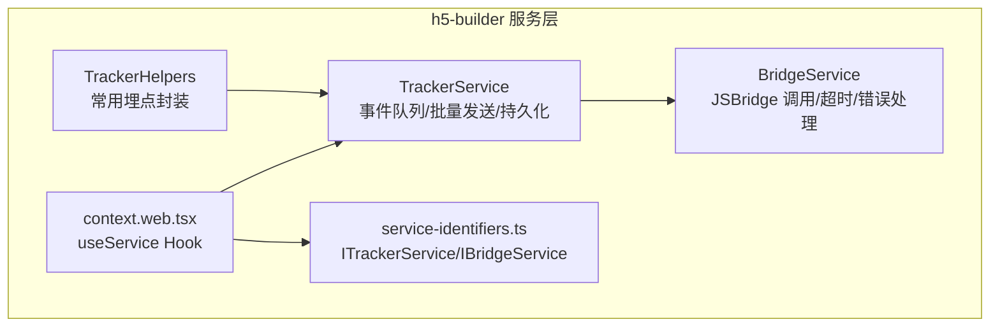
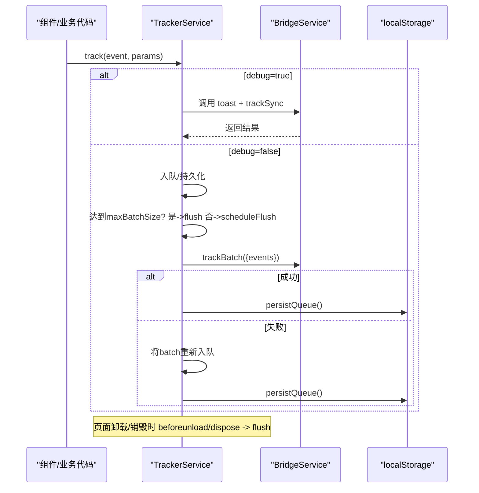
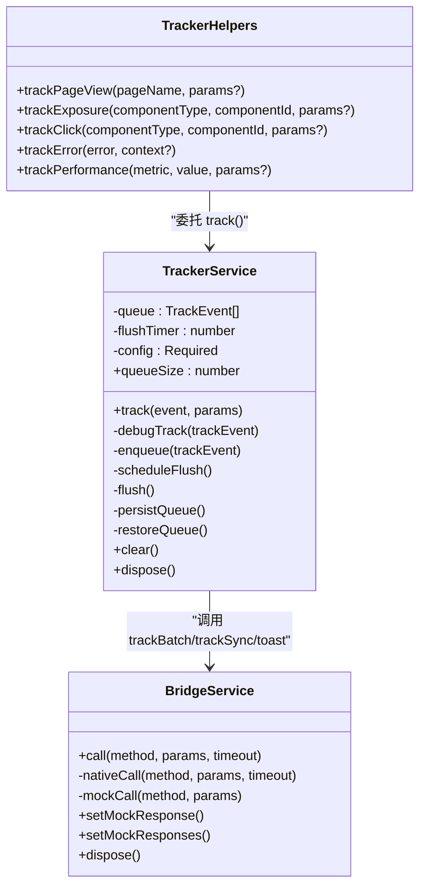
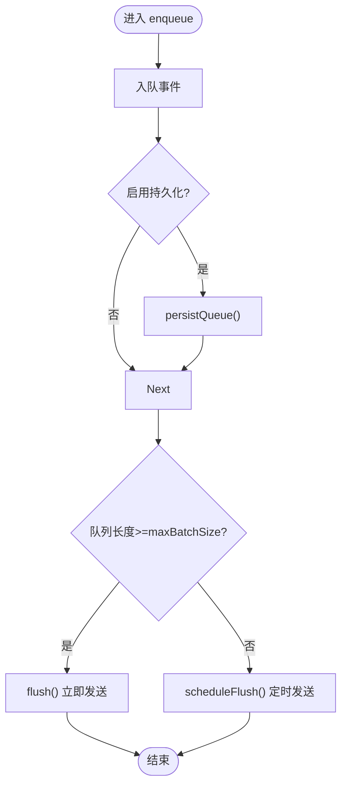
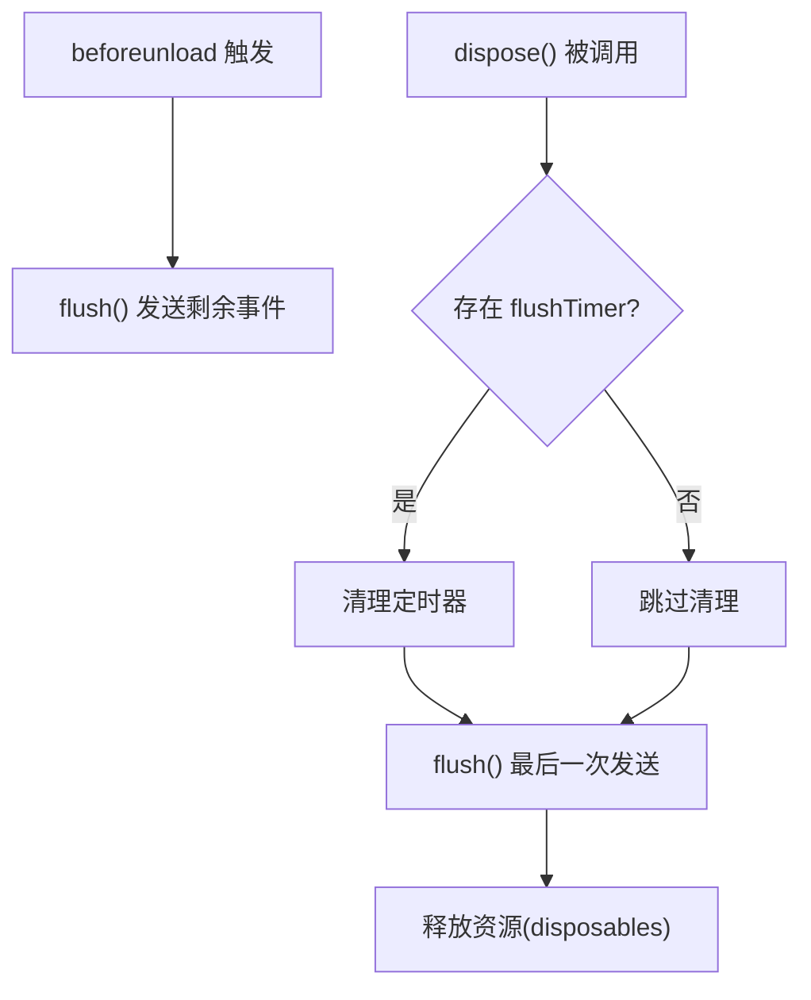
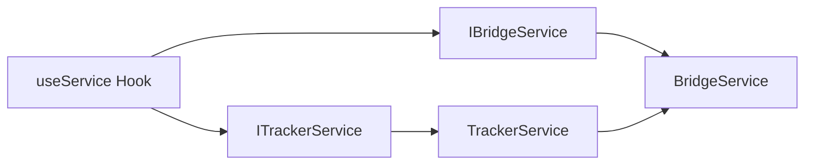

# 埋点服务

<cite>
**本文引用的文件列表**
- [packages/h5-builder/src/services/tracker.service.ts](file://packages/h5-builder/src/services/tracker.service.ts)
- [packages/h5-builder/src/services/bridge.service.ts](file://packages/h5-builder/src/services/bridge.service.ts)
- [packages/h5-builder/src/services/service-identifiers.ts](file://packages/h5-builder/src/services/service-identifiers.ts)
- [packages/h5-builder/src/bedrock/di/context.web.tsx](file://packages/h5-builder/src/bedrock/di/context.web.tsx)
- [packages/h5-builder/src/__tests__/tracker.service.test.ts](file://packages/h5-builder/src/__tests__/tracker.service.test.ts)
</cite>

## 目录
1. [简介](#简介)
2. [项目结构](#项目结构)
3. [核心组件](#核心组件)
4. [架构总览](#架构总览)
5. [详细组件分析](#详细组件分析)
6. [依赖关系分析](#依赖关系分析)
7. [性能考量](#性能考量)
8. [故障排查指南](#故障排查指南)
9. [结论](#结论)
10. [附录](#附录)

## 简介
本文件系统性解析埋点服务 TrackerService 的设计与实现，覆盖以下关键主题：
- 事件队列管理机制：track 方法如何根据 debug 模式决定同步上报或批量入队
- 批量发送策略：基于 maxBatchSize 和 flushInterval 的双重触发机制
- 页面卸载前的 beforeunload 事件处理
- 持久化功能：通过 localStorage 实现断点续传，restoreQueue 与 persistQueue 的实现细节
- TrackerHelpers 工具类：常用埋点事件封装（如 trackPageView、trackClick）
- 配置 TrackerConfig 的完整示例与在组件中注入 TrackerService 的方式
- 异常处理策略与性能考量

## 项目结构
埋点服务位于 h5-builder 包内，核心文件如下：
- tracker.service.ts：TrackerService 与 TrackerHelpers 的实现
- bridge.service.ts：JSBridge 服务，负责与原生通信（或 Mock）
- service-identifiers.ts：依赖注入标识符，用于服务检索
- di/context.web.tsx：React 环境下的依赖注入上下文与 useService Hook
- __tests__/tracker.service.test.ts：对埋点服务行为的单元测试

图表来源
- [packages/h5-builder/src/services/tracker.service.ts](file://packages/h5-builder/src/services/tracker.service.ts#L1-L289)
- [packages/h5-builder/src/services/bridge.service.ts](file://packages/h5-builder/src/services/bridge.service.ts#L1-L227)
- [packages/h5-builder/src/services/service-identifiers.ts](file://packages/h5-builder/src/services/service-identifiers.ts#L1-L19)
- [packages/h5-builder/src/bedrock/di/context.web.tsx](file://packages/h5-builder/src/bedrock/di/context.web.tsx#L1-L42)

章节来源
- [packages/h5-builder/src/services/tracker.service.ts](file://packages/h5-builder/src/services/tracker.service.ts#L1-L289)
- [packages/h5-builder/src/services/bridge.service.ts](file://packages/h5-builder/src/services/bridge.service.ts#L1-L227)
- [packages/h5-builder/src/services/service-identifiers.ts](file://packages/h5-builder/src/services/service-identifiers.ts#L1-L19)
- [packages/h5-builder/src/bedrock/di/context.web.tsx](file://packages/h5-builder/src/bedrock/di/context.web.tsx#L1-L42)

## 核心组件
- TrackerService：事件队列、批量发送、调试模式、持久化、生命周期清理
- TrackerHelpers：常用埋点事件封装（页面浏览、组件曝光、点击、错误、性能）
- BridgeService：统一的 JSBridge 调用入口，支持 Mock 模式与超时控制
- 依赖注入标识符：ITrackerService、IBridgeService
- React 注入上下文：useService Hook，便于在组件中获取服务实例

章节来源
- [packages/h5-builder/src/services/tracker.service.ts](file://packages/h5-builder/src/services/tracker.service.ts#L1-L289)
- [packages/h5-builder/src/services/bridge.service.ts](file://packages/h5-builder/src/services/bridge.service.ts#L1-L227)
- [packages/h5-builder/src/services/service-identifiers.ts](file://packages/h5-builder/src/services/service-identifiers.ts#L1-L19)
- [packages/h5-builder/src/bedrock/di/context.web.tsx](file://packages/h5-builder/src/bedrock/di/context.web.tsx#L1-L42)

## 架构总览
TrackerService 通过 BridgeService 与原生通信，采用“生产模式批量入队 + 调试模式同步上报”的双轨策略；借助 localStorage 实现断点续传；在 beforeunload 与 dispose 时确保未发送事件得到处理。

图表来源
- [packages/h5-builder/src/services/tracker.service.ts](file://packages/h5-builder/src/services/tracker.service.ts#L68-L171)
- [packages/h5-builder/src/services/bridge.service.ts](file://packages/h5-builder/src/services/bridge.service.ts#L55-L118)

章节来源
- [packages/h5-builder/src/services/tracker.service.ts](file://packages/h5-builder/src/services/tracker.service.ts#L68-L171)
- [packages/h5-builder/src/services/bridge.service.ts](file://packages/h5-builder/src/services/bridge.service.ts#L55-L118)

## 详细组件分析

### TrackerService 设计与实现
- 事件模型与配置
  - TrackEvent：包含 event、params、timestamp
  - TrackerConfig：debug、maxBatchSize、flushInterval、enablePersistence、storageKey
- 生命周期与初始化
  - 默认配置合并与校验
  - 若启用持久化，则恢复队列
  - 注册 beforeunload 事件，在页面卸载前 flush
- track 方法
  - debug 模式：调用 debugTrack，先 toast 再 trackSync
  - 生产模式：enqueue 入队
- 队列管理
  - enqueue：入队后若启用持久化则 persistQueue；若达到 maxBatchSize 则立即 flush；否则 scheduleFlush
  - scheduleFlush：去重定时器，避免重复调度
  - flush：取出最多 maxBatchSize 条事件，调用 trackBatch；成功则更新持久化；失败则将 batch unshift 回队列并更新持久化
- 持久化
  - persistQueue：localStorage.setItem(storageKey, JSON.stringify(queue))
  - restoreQueue：localStorage.getItem(storageKey)，JSON.parse 并恢复队列
  - clear：清空内存队列并移除 localStorage 中的持久化键
- 资源清理
  - dispose：清理 flushTimer，最后 flush 一次，释放资源

图表来源
- [packages/h5-builder/src/services/tracker.service.ts](file://packages/h5-builder/src/services/tracker.service.ts#L1-L289)
- [packages/h5-builder/src/services/bridge.service.ts](file://packages/h5-builder/src/services/bridge.service.ts#L1-L227)

章节来源
- [packages/h5-builder/src/services/tracker.service.ts](file://packages/h5-builder/src/services/tracker.service.ts#L68-L228)

#### 批量发送策略流程图

图表来源
- [packages/h5-builder/src/services/tracker.service.ts](file://packages/h5-builder/src/services/tracker.service.ts#L107-L139)

章节来源
- [packages/h5-builder/src/services/tracker.service.ts](file://packages/h5-builder/src/services/tracker.service.ts#L107-L139)

#### beforeunload 与销毁流程图

图表来源
- [packages/h5-builder/src/services/tracker.service.ts](file://packages/h5-builder/src/services/tracker.service.ts#L58-L66)
- [packages/h5-builder/src/services/tracker.service.ts](file://packages/h5-builder/src/services/tracker.service.ts#L216-L228)

章节来源
- [packages/h5-builder/src/services/tracker.service.ts](file://packages/h5-builder/src/services/tracker.service.ts#L58-L66)
- [packages/h5-builder/src/services/tracker.service.ts](file://packages/h5-builder/src/services/tracker.service.ts#L216-L228)

### TrackerHelpers 工具类
- trackPageView：封装 PAGE_VIEW 事件
- trackExposure：封装 COMPONENT_EXPOSURE 事件
- trackClick：封装 CLICK 事件
- trackError：封装 ERROR 事件（携带 message/stack）
- trackPerformance：封装 PERFORMANCE 事件（metric/value）

章节来源
- [packages/h5-builder/src/services/tracker.service.ts](file://packages/h5-builder/src/services/tracker.service.ts#L230-L289)

### BridgeService 行为要点
- call：在 debug 模式下走 mockCall，否则走 nativeCall
- nativeCall：竞速原生调用与超时 Promise，检查响应 code，抛出错误
- mockCall：模拟网络延迟，返回已设置的 mock 数据或空对象
- 支持 setMockResponse/setMockResponses，便于测试与本地调试

章节来源
- [packages/h5-builder/src/services/bridge.service.ts](file://packages/h5-builder/src/services/bridge.service.ts#L55-L118)
- [packages/h5-builder/src/services/bridge.service.ts](file://packages/h5-builder/src/services/bridge.service.ts#L139-L169)

## 依赖关系分析
- 服务标识符
  - ITrackerService：用于在 DI 容器中检索 TrackerService
  - IBridgeService：用于在 DI 容器中检索 BridgeService
- React 注入上下文
  - useService：在 React 组件中通过上下文获取服务实例
- TrackerService 依赖
  - 通过 IBridgeService 注入 BridgeService
  - 使用 DisposableStore 管理事件监听与定时器等资源

图表来源
- [packages/h5-builder/src/services/service-identifiers.ts](file://packages/h5-builder/src/services/service-identifiers.ts#L1-L19)
- [packages/h5-builder/src/bedrock/di/context.web.tsx](file://packages/h5-builder/src/bedrock/di/context.web.tsx#L1-L42)
- [packages/h5-builder/src/services/tracker.service.ts](file://packages/h5-builder/src/services/tracker.service.ts#L34-L66)

章节来源
- [packages/h5-builder/src/services/service-identifiers.ts](file://packages/h5-builder/src/services/service-identifiers.ts#L1-L19)
- [packages/h5-builder/src/bedrock/di/context.web.tsx](file://packages/h5-builder/src/bedrock/di/context.web.tsx#L1-L42)
- [packages/h5-builder/src/services/tracker.service.ts](file://packages/h5-builder/src/services/tracker.service.ts#L34-L66)

## 性能考量
- 批量发送
  - maxBatchSize 控制单次上报上限，减少网络请求次数
  - flushInterval 控制最小等待时间，避免过于频繁的请求
- 队列与定时器
  - scheduleFlush 去重定时器，避免重复调度导致的资源浪费
- 持久化
  - 每次入队与 flush 成功/失败后均可能写入 localStorage，注意 I/O 开销
- 调试模式
  - debug 模式会同步 toast + trackSync，适合开发阶段，生产环境建议关闭

章节来源
- [packages/h5-builder/src/services/tracker.service.ts](file://packages/h5-builder/src/services/tracker.service.ts#L107-L171)

## 故障排查指南
- 调试模式未生效
  - 确认构造时 debug 选项是否为 true
  - 检查 BridgeService 是否处于 Mock 模式（无 window.NativeBridge）
- 批量发送未触发
  - 检查 maxBatchSize 是否过大或 flushInterval 过短
  - 确认 scheduleFlush 未被重复调度（定时器数量应稳定）
- 持久化异常
  - localStorage 可能被限制或空间不足，检查 persistQueue/restoreQueue 的错误日志
- beforeunload 未触发
  - 确认页面确实发生卸载；某些场景（如刷新）可能不会触发
- 错误重试
  - flush 失败会将 batch unshift 回队列，确保不会丢失事件

章节来源
- [packages/h5-builder/src/__tests__/tracker.service.test.ts](file://packages/h5-builder/src/__tests__/tracker.service.test.ts#L1-L225)
- [packages/h5-builder/src/services/tracker.service.ts](file://packages/h5-builder/src/services/tracker.service.ts#L141-L171)

## 结论
TrackerService 通过清晰的事件队列与批量发送策略、完善的调试与持久化能力，以及对 beforeunload 与销毁流程的妥善处理，提供了可靠的埋点上报能力。配合 TrackerHelpers 的常用事件封装与 DI 注入体系，可在组件中便捷地进行埋点上报。

## 附录

### 配置 TrackerConfig 示例
- debug：是否开启调试模式（默认 false）
- maxBatchSize：批量发送的最大事件数（默认 20）
- flushInterval：批量发送的时间间隔（毫秒，默认 5000）
- enablePersistence：是否启用持久化（默认 false）
- storageKey：localStorage 的键名（默认 h5_builder_tracker_queue）

章节来源
- [packages/h5-builder/src/services/tracker.service.ts](file://packages/h5-builder/src/services/tracker.service.ts#L17-L51)

### 在组件中注入 TrackerService 的方式
- 使用 useService Hook 获取服务实例
- 在组件渲染或生命周期钩子中调用 TrackerHelpers 或 TrackerService.track

章节来源
- [packages/h5-builder/src/bedrock/di/context.web.tsx](file://packages/h5-builder/src/bedrock/di/context.web.tsx#L1-L42)
- [packages/h5-builder/src/services/service-identifiers.ts](file://packages/h5-builder/src/services/service-identifiers.ts#L1-L19)
- [packages/h5-builder/src/services/tracker.service.ts](file://packages/h5-builder/src/services/tracker.service.ts#L230-L289)