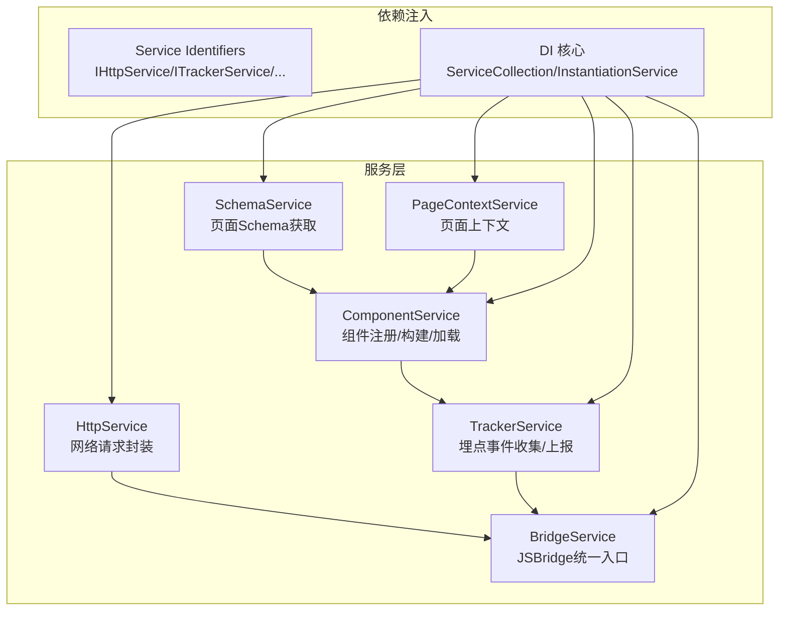
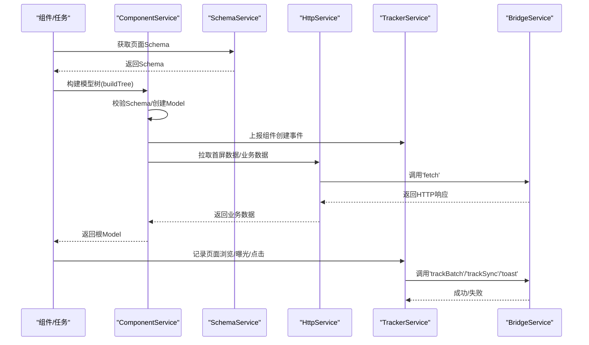
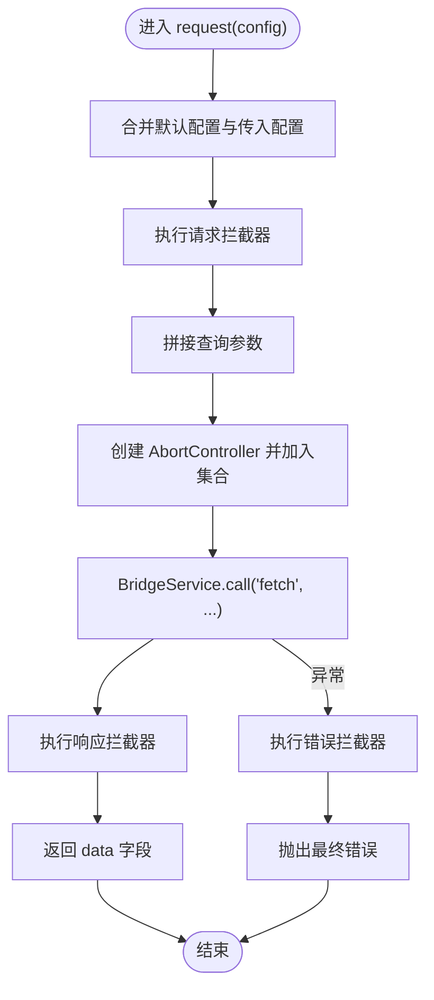
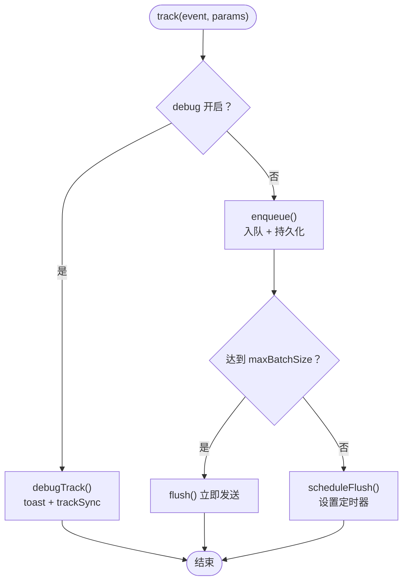
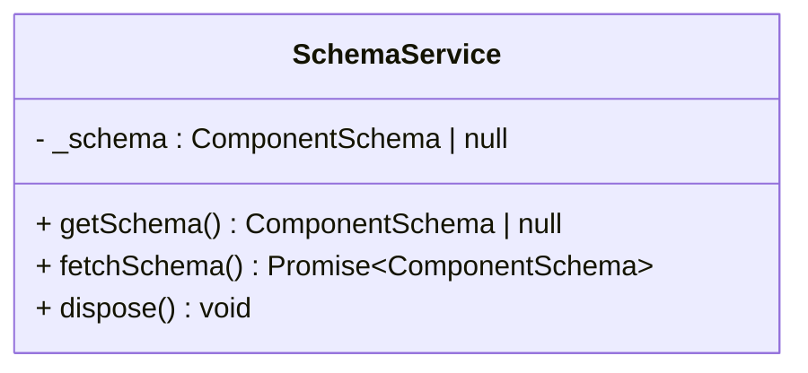
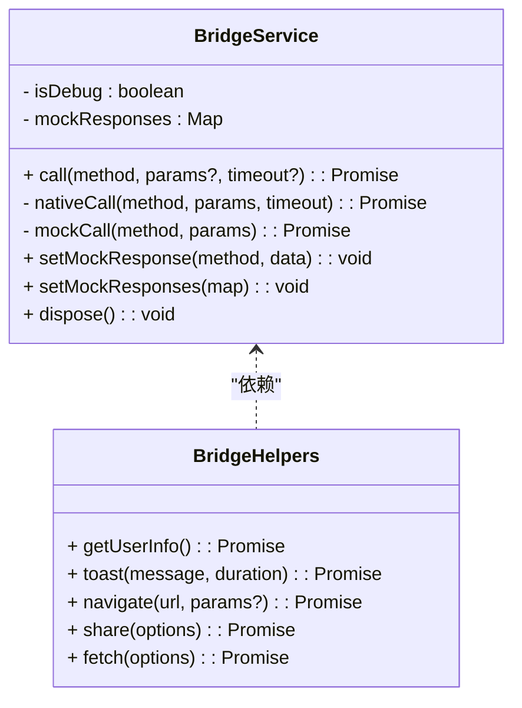
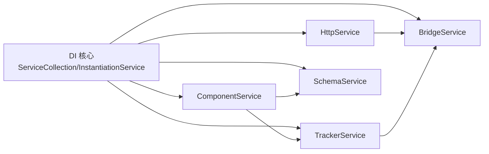
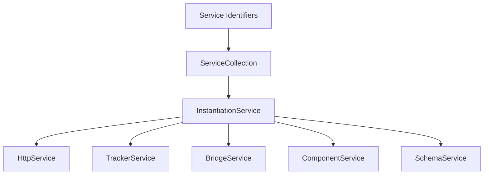

# 服务系统

<cite>
**本文引用的文件**
- [http.service.ts](file://packages/h5-builder/src/services/http.service.ts)
- [tracker.service.ts](file://packages/h5-builder/src/services/tracker.service.ts)
- [schema.service.ts](file://packages/h5-builder/src/services/schema.service.ts)
- [bridge.service.ts](file://packages/h5-builder/src/services/bridge.service.ts)
- [service-identifiers.ts](file://packages/h5-builder/src/services/service-identifiers.ts)
- [index.ts](file://packages/h5-builder/src/services/index.ts)
- [component.service.ts](file://packages/h5-builder/src/services/component.service.ts)
- [context.service.ts](file://packages/h5-builder/src/services/context.service.ts)
- [demo-data.ts](file://packages/h5-builder/src/mock/demo-data.ts)
- [http.service.test.ts](file://packages/h5-builder/src/__tests__/http.service.test.ts)
- [tracker.service.test.ts](file://packages/h5-builder/src/__tests__/tracker.service.test.ts)
- [bridge.service.test.ts](file://packages/h5-builder/src/__tests__/bridge.service.test.ts)
- [index.common.ts](file://packages/h5-builder/src/bedrock/di/index.common.ts)
</cite>

## 目录
1. [简介](#简介)
2. [项目结构](#项目结构)
3. [核心组件](#核心组件)
4. [架构总览](#架构总览)
5. [详细组件分析](#详细组件分析)
6. [依赖关系分析](#依赖关系分析)
7. [性能考量](#性能考量)
8. [故障排查指南](#故障排查指南)
9. [结论](#结论)
10. [附录](#附录)

## 简介
本文件面向 h5-builder 的服务系统，聚焦以下核心服务：
- HttpService：基于 JSBridge 的网络请求封装，提供请求/响应拦截器、错误拦截器与请求取消能力。
- TrackerService：埋点事件收集、批量上报、Debug 模式、持久化与页面卸载前收尾。
- SchemaService：页面 Schema 数据的获取与响应式管理。
- BridgeService：作为外部系统（原生桥）的统一接入点，支持 Mock 调试与超时控制。

文档将说明各服务的职责、实现要点、配置项、使用模式、协作关系与扩展方式，并给出可视化图示与排障建议。

## 项目结构
h5-builder 的服务位于 packages/h5-builder/src/services 下，围绕“服务标识符”“依赖注入”“桥接层”“业务服务”组织，配合组件服务与上下文服务共同构成页面构建与运行时能力。

图表来源
- [http.service.ts](file://packages/h5-builder/src/services/http.service.ts#L1-L281)
- [tracker.service.ts](file://packages/h5-builder/src/services/tracker.service.ts#L1-L290)
- [schema.service.ts](file://packages/h5-builder/src/services/schema.service.ts#L1-L38)
- [bridge.service.ts](file://packages/h5-builder/src/services/bridge.service.ts#L1-L227)
- [component.service.ts](file://packages/h5-builder/src/services/component.service.ts#L1-L735)
- [context.service.ts](file://packages/h5-builder/src/services/context.service.ts#L1-L187)
- [service-identifiers.ts](file://packages/h5-builder/src/services/service-identifiers.ts#L1-L20)
- [index.common.ts](file://packages/h5-builder/src/bedrock/di/index.common.ts#L1-L29)

章节来源
- [index.ts](file://packages/h5-builder/src/services/index.ts#L1-L8)

## 核心组件
- HttpService：提供请求拦截、响应拦截、错误拦截、请求取消、默认配置合并与基于 BridgeService 的 fetch 调用。
- TrackerService：事件队列、批量上报、Debug 模式、持久化、页面卸载前收尾、定时器管理与错误回退。
- SchemaService：页面 Schema 的获取与响应式包装，便于组件渲染与状态变更追踪。
- BridgeService：统一调用原生能力或 Mock 数据，支持超时控制与错误处理。

章节来源
- [http.service.ts](file://packages/h5-builder/src/services/http.service.ts#L1-L281)
- [tracker.service.ts](file://packages/h5-builder/src/services/tracker.service.ts#L1-L290)
- [schema.service.ts](file://packages/h5-builder/src/services/schema.service.ts#L1-L38)
- [bridge.service.ts](file://packages/h5-builder/src/services/bridge.service.ts#L1-L227)

## 架构总览
下图展示了服务间交互与数据流，突出 HttpService 与 TrackerService 通过 BridgeService 进行原生调用，SchemaService 与 ComponentService 协作构建页面模型树。

图表来源
- [component.service.ts](file://packages/h5-builder/src/services/component.service.ts#L130-L209)
- [http.service.ts](file://packages/h5-builder/src/services/http.service.ts#L144-L203)
- [tracker.service.ts](file://packages/h5-builder/src/services/tracker.service.ts#L68-L171)
- [bridge.service.ts](file://packages/h5-builder/src/services/bridge.service.ts#L55-L118)

## 详细组件分析

### HttpService（网络请求）
- 封装方式
  - 基于 BridgeService.call('fetch', ...) 实现网络请求。
  - 支持请求拦截器、响应拦截器、错误拦截器链式处理。
  - 默认配置合并（方法、超时、Content-Type），支持 baseURL 与 token 注入。
  - 支持请求取消（AbortController），并维护未完成请求集合。
- 请求流程
  - 合并默认配置与传入配置，处理查询参数拼接。
  - 依次执行请求拦截器，发起原生 fetch，再执行响应拦截器。
  - 捕获异常并执行错误拦截器，最终抛出。
- 错误处理
  - 默认内置错误拦截器记录日志；可通过 addErrorInterceptor 自定义。
- 缓存策略
  - 代码未实现客户端缓存；如需缓存可在请求拦截器中自行实现。
- 配置与使用
  - 通过构造函数注入 BridgeService 与可选的 HttpServiceOptions（baseURL、token）。
  - 通过 addRequestInterceptor/addResponseInterceptor/addErrorInterceptor 注册拦截器。
  - 通过 get/post/put/delete/请求方法发起请求；cancelAll 取消未完成请求。
- 依赖与协作
  - 依赖 BridgeService；被 ComponentService、TrackerService 等在业务场景中使用。
- 测试参考
  - 测试覆盖 GET/POST/PUT/DELETE、查询参数、拦截器、错误拦截器、取消与销毁。

图表来源
- [http.service.ts](file://packages/h5-builder/src/services/http.service.ts#L144-L203)

章节来源
- [http.service.ts](file://packages/h5-builder/src/services/http.service.ts#L1-L281)
- [http.service.test.ts](file://packages/h5-builder/src/__tests__/http.service.test.ts#L1-L252)

### TrackerService（埋点）
- 功能特性
  - 事件队列管理、批量上报、Debug 模式（Toast + 同步上报）、持久化（localStorage）。
  - 页面卸载前触发 flush，定时器调度与清理。
- 上报机制
  - 生产模式：事件入队，达到最大批次或到达间隔后批量上报；失败则回退到队列头部。
  - Debug 模式：同步上报并通过 toast 提示。
- 配置选项
  - debug：是否开启 Debug 模式。
  - maxBatchSize：批量发送的最大事件数。
  - flushInterval：批量发送的时间间隔（毫秒）。
  - enablePersistence：是否持久化到 localStorage。
  - storageKey：localStorage 的 key。
- 使用模式
  - 直接调用 track(event, params)；或使用 TrackerHelpers 提供的便捷方法（页面浏览、组件曝光、点击、错误、性能）。
- 依赖与协作
  - 依赖 BridgeService 进行上报；被 ComponentService 在组件创建时使用。
- 测试参考
  - 测试覆盖基本跟踪、批量发送、持久化恢复与清理、错误回退、销毁时 flush。

图表来源
- [tracker.service.ts](file://packages/h5-builder/src/services/tracker.service.ts#L68-L171)

章节来源
- [tracker.service.ts](file://packages/h5-builder/src/services/tracker.service.ts#L1-L290)
- [tracker.service.test.ts](file://packages/h5-builder/src/__tests__/tracker.service.test.ts#L1-L226)

### SchemaService（页面Schema）
- 职责
  - 提供页面 Schema 的获取与响应式包装，便于组件渲染与状态变更追踪。
- 实现要点
  - 使用 observable 包裹实例，使其具备响应式能力。
  - 提供 getSchema 与 fetchSchema 方法；当前实现为演示数据，实际可替换为远程拉取逻辑。
- 使用模式
  - 在组件或任务中注入 SchemaService，调用 fetchSchema 获取 Schema，随后交由 ComponentService 构建模型树。
- 依赖与协作
  - 与 ComponentService 协作，后者负责将 Schema 转换为 Model Tree。
- 测试参考
  - 当前测试集中在服务本身，未覆盖 Schema 解析与校验逻辑（演示数据来自 demo-data.ts）。

图表来源
- [schema.service.ts](file://packages/h5-builder/src/services/schema.service.ts#L1-L38)

章节来源
- [schema.service.ts](file://packages/h5-builder/src/services/schema.service.ts#L1-L38)
- [demo-data.ts](file://packages/h5-builder/src/mock/demo-data.ts#L1-L334)

### BridgeService（外部系统集成点）
- 职责
  - 统一 JSBridge 调用接口，支持 Mock 模式用于浏览器调试。
- 通信协议
  - 调用方法：call(method, params?, timeout?)，返回 Promise。
  - 原生模式：通过 window.NativeBridge.invoke，支持超时竞速与响应码检查。
  - Mock 模式：内置常见方法的模拟响应，支持 setMockResponse/setMockResponses。
- 配置与使用
  - 构造函数支持 isDebug，默认当 window.NativeBridge 不可用时进入 Mock 模式。
  - 提供 BridgeHelpers 封装常用原生能力（用户信息、Toast、导航、分享、fetch）。
- 错误处理
  - 原生模式下对超时与响应码进行处理；Mock 模式下提供默认响应或警告。
- 依赖与协作
  - 为 HttpService、TrackerService 等提供底层调用能力。

图表来源
- [bridge.service.ts](file://packages/h5-builder/src/services/bridge.service.ts#L1-L227)

章节来源
- [bridge.service.ts](file://packages/h5-builder/src/services/bridge.service.ts#L1-L227)
- [bridge.service.test.ts](file://packages/h5-builder/src/__tests__/bridge.service.test.ts#L1-L132)

### 服务间协作与扩展
- 依赖注入
  - 通过 service-identifiers.ts 中的装饰器（如 IHttpService、ITrackerService、IBridgeService 等）进行服务标识。
  - 通过 ServiceCollection 与 InstantiationService 进行服务注册与实例化。
- 协作关系
  - ComponentService 依赖 TrackerService 进行组件生命周期埋点；依赖 SchemaService 获取页面 Schema；依赖 BridgeService 进行原生能力调用。
  - HttpService 依赖 BridgeService 进行网络请求；可被 ComponentService 在首屏数据加载时使用。
  - TrackerService 依赖 BridgeService 进行事件上报。
- 扩展方式
  - 通过 addRequestInterceptor/addResponseInterceptor/addErrorInterceptor 扩展 HttpService。
  - 通过 setMockResponse/setMockResponses 扩展 BridgeService 的 Mock 数据。
  - 通过 register/registerAll/registerAsync 扩展 ComponentService 的组件注册与异步加载。
  - 通过自定义 TrackerHelpers 或直接使用 TrackerService 的 track 方法扩展埋点维度。

图表来源
- [service-identifiers.ts](file://packages/h5-builder/src/services/service-identifiers.ts#L1-L20)
- [index.common.ts](file://packages/h5-builder/src/bedrock/di/index.common.ts#L1-L29)
- [component.service.ts](file://packages/h5-builder/src/services/component.service.ts#L1-L735)

章节来源
- [service-identifiers.ts](file://packages/h5-builder/src/services/service-identifiers.ts#L1-L20)
- [index.common.ts](file://packages/h5-builder/src/bedrock/di/index.common.ts#L1-L29)
- [component.service.ts](file://packages/h5-builder/src/services/component.service.ts#L1-L735)

## 依赖关系分析
- 服务标识符
  - 通过 createDecorator 生成服务标识符，避免直接依赖具体类，提升可替换性与测试友好性。
- 依赖注入
  - 通过 ServiceCollection 注册服务实例，InstantiationService 负责创建与注入。
- 循环依赖
  - 代码未见明显循环依赖；ComponentService 与 TrackerService 之间为单向依赖（构建时上报）。
- 外部依赖
  - 依赖 window.NativeBridge（原生环境）或 Mock 数据（浏览器调试）。

图表来源
- [service-identifiers.ts](file://packages/h5-builder/src/services/service-identifiers.ts#L1-L20)
- [index.common.ts](file://packages/h5-builder/src/bedrock/di/index.common.ts#L1-L29)

章节来源
- [service-identifiers.ts](file://packages/h5-builder/src/services/service-identifiers.ts#L1-L20)
- [index.common.ts](file://packages/h5-builder/src/bedrock/di/index.common.ts#L1-L29)

## 性能考量
- HttpService
  - 请求拦截器链式执行可能带来额外开销，建议在拦截器中尽量轻量处理。
  - 查询参数拼接与 JSON 序列化在大 payload 场景下需关注内存与序列化成本。
- TrackerService
  - 批量发送与定时器调度在高并发事件场景下需合理设置 maxBatchSize 与 flushInterval，避免频繁上报造成抖动。
  - 持久化写入 localStorage 在极端情况下可能阻塞主线程，建议控制事件粒度与存储频率。
- BridgeService
  - 原生调用存在跨进程/线程开销，建议减少不必要的调用次数；Mock 模式仅用于调试，避免在生产环境误用。
- ComponentService
  - 组件异步加载采用 Promise.race 控制并发，注意总并发与模型/视图加载的平衡，避免资源竞争。

[本节为通用指导，无需列出具体文件来源]

## 故障排查指南
- HttpService
  - 现象：请求未发出或被拦截器修改。
  - 排查：确认 addRequestInterceptor 是否正确返回配置；检查 baseURL 与 token 注入是否生效。
  - 现象：请求超时或被取消。
  - 排查：检查 timeout 设置与 cancelAll 调用时机；确认拦截器链未提前中断。
- TrackerService
  - 现象：事件未上报或丢失。
  - 排查：确认 debug 模式与批量阈值；检查 flushInterval 与持久化开关；查看 beforeunload 前是否触发 flush。
  - 现象：持久化数据异常。
  - 排查：检查 storageKey 与 localStorage 权限；确认 clear() 是否被调用。
- BridgeService
  - 现象：原生调用失败或超时。
  - 排查：确认 window.NativeBridge 是否可用；检查响应码与消息；适当增大 timeout。
  - 现象：Mock 数据缺失。
  - 排查：确认 setMockResponse/setMockResponses 是否正确设置；或在构造时使用 isDebug=true 进入 Mock 模式。
- ComponentService
  - 现象：组件构建失败或错误占位。
  - 排查：检查 Schema 的 type 与 id；确认组件已注册；查看 TrackerService 的错误事件上报。

章节来源
- [http.service.test.ts](file://packages/h5-builder/src/__tests__/http.service.test.ts#L1-L252)
- [tracker.service.test.ts](file://packages/h5-builder/src/__tests__/tracker.service.test.ts#L1-L226)
- [bridge.service.test.ts](file://packages/h5-builder/src/__tests__/bridge.service.test.ts#L1-L132)

## 结论
h5-builder 的服务系统以 BridgeService 为核心集成点，围绕 HttpService、TrackerService、SchemaService 与 ComponentService 构建了清晰的职责边界与协作关系。通过依赖注入与服务标识符，系统具备良好的可测试性与可扩展性。在实际使用中，建议结合业务场景合理配置拦截器、埋点策略与加载并发，以获得更佳的性能与稳定性。

[本节为总结，无需列出具体文件来源]

## 附录
- 配置示例（文字描述）
  - HttpService
    - baseURL：统一前缀，自动拼接到相对路径。
    - token：自动注入 Authorization 头。
  - TrackerService
    - debug：开启后立即上报并 Toast 提示。
    - maxBatchSize：批量发送阈值。
    - flushInterval：批量发送间隔。
    - enablePersistence/storageKey：持久化开关与存储 key。
  - BridgeService
    - isDebug：true 时进入 Mock 模式；false 且 window.NativeBridge 可用时走原生。
    - setMockResponse/setMockResponses：为特定方法设置 Mock 数据。
- 使用模式（文字描述）
  - 注入与实例化：通过 ServiceCollection 与 InstantiationService 注册与创建服务实例。
  - 组件中使用：在组件初始化阶段注入所需服务，按需调用其方法。
  - 任务中使用：在任务流程中调用服务完成数据拉取、埋点上报或页面上下文管理。

[本节为概览，无需列出具体文件来源]