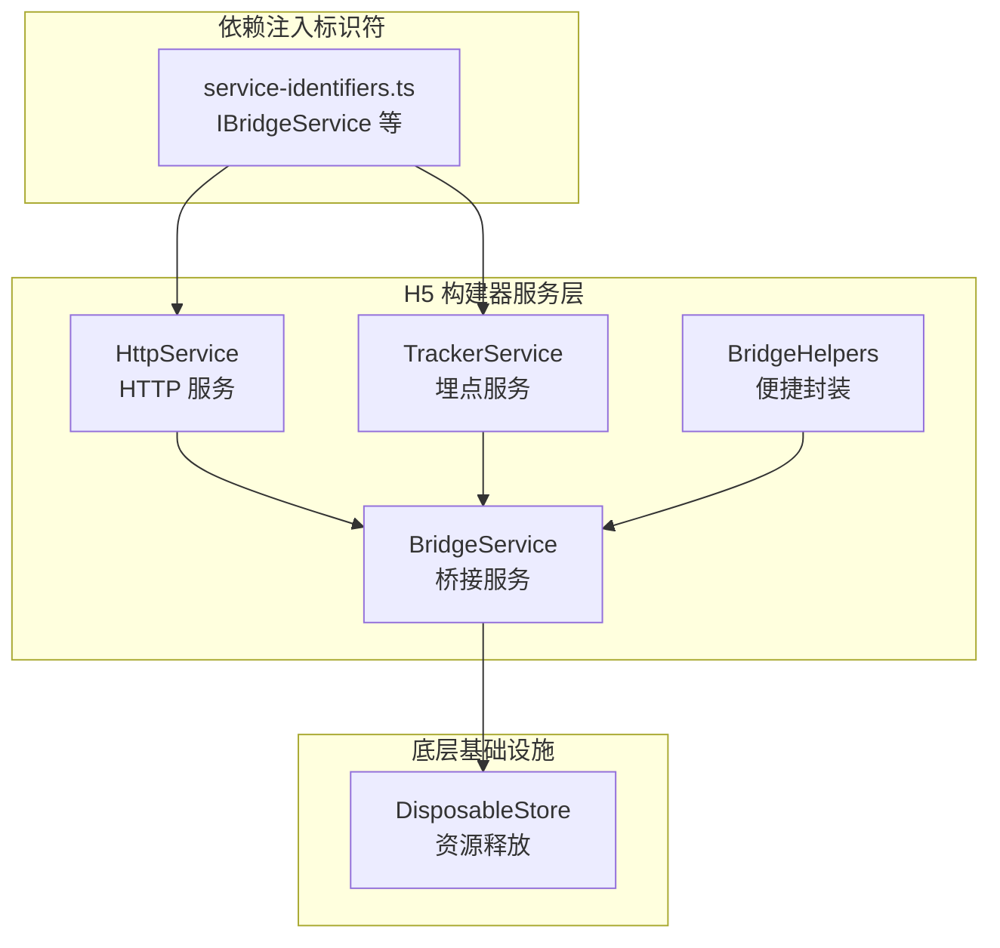
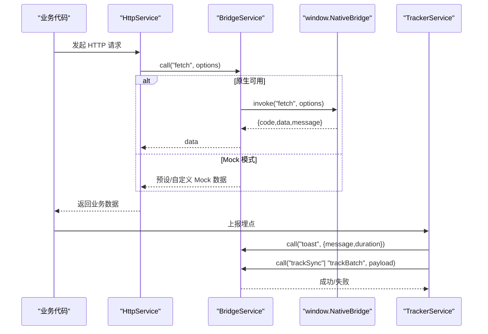
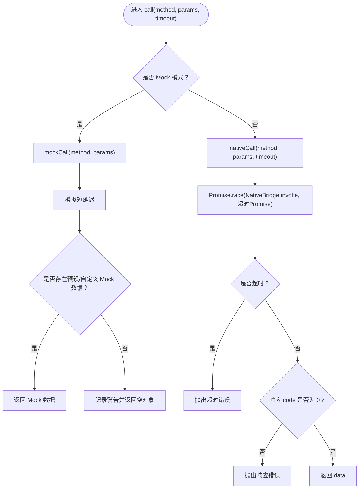
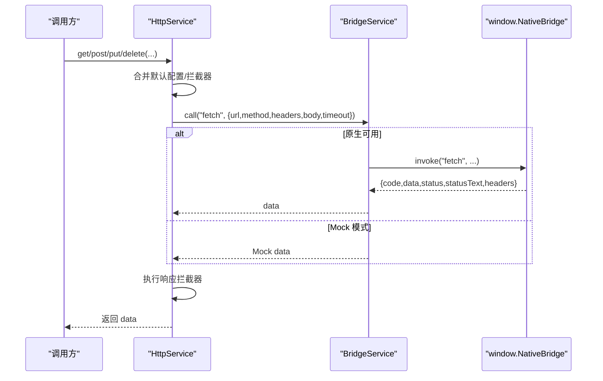
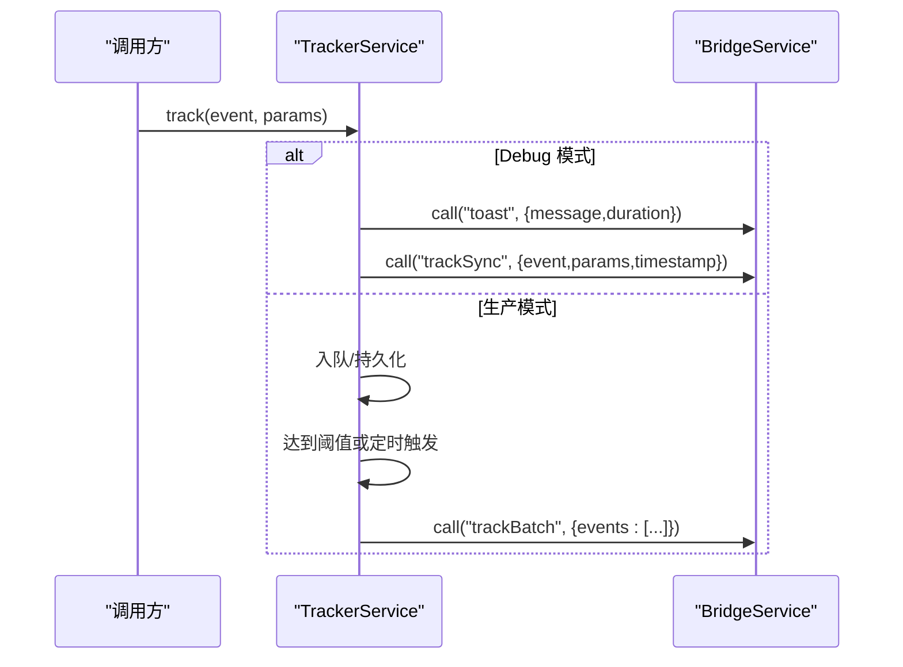
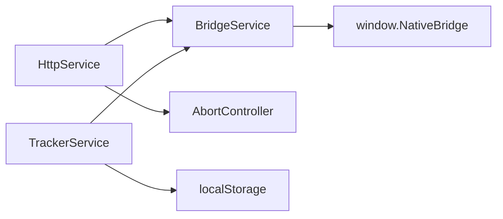

# 桥接服务

<cite>
**本文引用的文件列表**
- [packages/h5-builder/src/services/bridge.service.ts](file://packages/h5-builder/src/services/bridge.service.ts)
- [packages/h5-builder/src/__tests__/bridge.service.test.ts](file://packages/h5-builder/src/__tests__/bridge.service.test.ts)
- [packages/h5-builder/src/services/http.service.ts](file://packages/h5-builder/src/services/http.service.ts)
- [packages/h5-builder/src/services/tracker.service.ts](file://packages/h5-builder/src/services/tracker.service.ts)
- [packages/h5-builder/src/services/service-identifiers.ts](file://packages/h5-builder/src/services/service-identifiers.ts)
- [packages/h5-builder/src/bedrock/dispose/disposable-store.ts](file://packages/h5-builder/src/bedrock/dispose/disposable-store.ts)
- [packages/h5-builder/src/__tests__/http.service.test.ts](file://packages/h5-builder/src/__tests__/http.service.test.ts)
- [packages/h5-builder/src/__tests__/tracker.service.test.ts](file://packages/h5-builder/src/__tests__/tracker.service.test.ts)
</cite>

## 目录
1. [简介](#简介)
2. [项目结构](#项目结构)
3. [核心组件](#核心组件)
4. [架构总览](#架构总览)
5. [详细组件分析](#详细组件分析)
6. [依赖关系分析](#依赖关系分析)
7. [性能考量](#性能考量)
8. [故障排查指南](#故障排查指南)
9. [结论](#结论)
10. [附录](#附录)

## 简介
本文件系统性阐述 BridgeService 作为 H5 与原生通信桥梁的核心能力，重点覆盖：
- 如何通过 window.NativeBridge 调用原生方法，并在无原生环境时优雅降级为 Mock 模式进行调试
- call 方法的超时控制机制（Promise.race 与 AbortController 的协同使用思路）
- 错误码（code !== 0）的统一处理逻辑
- mockCall 的实现原理，包括 setupMockResponses 预设响应与 setMockResponse 动态注入
- BridgeHelpers 工具类对常用原生功能（获取用户信息、Toast、导航、分享、网络请求）的便捷封装
- 在 HttpService 和 TrackerService 中集成 BridgeService 的实际案例
- dispose 方法对 Mock 数据的清理职责
- 跨平台兼容性与开发调试中的关键价值

## 项目结构
BridgeService 位于 H5 构建器包内，配套的 HttpService 与 TrackerService 通过依赖注入使用 BridgeService 完成原生能力调用或埋点上报。测试文件覆盖了 Mock 模式、原生模式、超时与错误处理、BridgeHelpers 封装、以及资源清理等关键场景。

图表来源
- [packages/h5-builder/src/services/bridge.service.ts](file://packages/h5-builder/src/services/bridge.service.ts#L1-L227)
- [packages/h5-builder/src/services/http.service.ts](file://packages/h5-builder/src/services/http.service.ts#L1-L281)
- [packages/h5-builder/src/services/tracker.service.ts](file://packages/h5-builder/src/services/tracker.service.ts#L1-L290)
- [packages/h5-builder/src/services/service-identifiers.ts](file://packages/h5-builder/src/services/service-identifiers.ts#L1-L20)
- [packages/h5-builder/src/bedrock/dispose/disposable-store.ts](file://packages/h5-builder/src/bedrock/dispose/disposable-store.ts#L1-L84)

章节来源
- [packages/h5-builder/src/services/bridge.service.ts](file://packages/h5-builder/src/services/bridge.service.ts#L1-L227)
- [packages/h5-builder/src/services/http.service.ts](file://packages/h5-builder/src/services/http.service.ts#L1-L281)
- [packages/h5-builder/src/services/tracker.service.ts](file://packages/h5-builder/src/services/tracker.service.ts#L1-L290)
- [packages/h5-builder/src/services/service-identifiers.ts](file://packages/h5-builder/src/services/service-identifiers.ts#L1-L20)
- [packages/h5-builder/src/bedrock/dispose/disposable-store.ts](file://packages/h5-builder/src/bedrock/dispose/disposable-store.ts#L1-L84)

## 核心组件
- BridgeService：统一的 JSBridge 调用入口，支持原生模式与 Mock 模式；内置超时控制与错误码校验；提供 Mock 响应管理与清理。
- BridgeHelpers：对常用原生方法的轻量封装，便于业务侧直接调用。
- HttpService：基于 BridgeService 的 fetch 实现，提供请求/响应拦截器、错误拦截器、请求取消（AbortController）与默认配置。
- TrackerService：基于 BridgeService 的埋点上报，支持批量发送、定时刷新、持久化、Debug 模式提示等。
- 依赖注入标识符：通过 IBridgeService 等标识符在 DI 容器中注入 BridgeService 实例。

章节来源
- [packages/h5-builder/src/services/bridge.service.ts](file://packages/h5-builder/src/services/bridge.service.ts#L1-L227)
- [packages/h5-builder/src/services/http.service.ts](file://packages/h5-builder/src/services/http.service.ts#L1-L281)
- [packages/h5-builder/src/services/tracker.service.ts](file://packages/h5-builder/src/services/tracker.service.ts#L1-L290)
- [packages/h5-builder/src/services/service-identifiers.ts](file://packages/h5-builder/src/services/service-identifiers.ts#L1-L20)

## 架构总览
BridgeService 作为统一桥接层，向上为 HttpService 与 TrackerService 提供原生能力；向下在原生可用时通过 window.NativeBridge.invoke 调用原生方法，在 Mock 模式下返回预设或动态注入的数据。HttpService 通过 BridgeService 的 fetch 方法实现网络请求；TrackerService 通过 BridgeService 的 toast、trackSync、trackBatch 等方法实现埋点上报与调试提示。

图表来源
- [packages/h5-builder/src/services/http.service.ts](file://packages/h5-builder/src/services/http.service.ts#L147-L203)
- [packages/h5-builder/src/services/bridge.service.ts](file://packages/h5-builder/src/services/bridge.service.ts#L55-L118)
- [packages/h5-builder/src/services/tracker.service.ts](file://packages/h5-builder/src/services/tracker.service.ts#L90-L171)

## 详细组件分析

### BridgeService：统一桥接与 Mock 支持
- 角色定位：统一的 JSBridge 调用入口，负责判断是否处于 Mock 模式（无 window.NativeBridge 或显式 isDebug=true），并在两种模式间切换。
- call 方法：
  - Mock 模式：直接进入 mockCall，模拟短延迟后返回预设或自定义 Mock 数据。
  - 原生模式：进入 nativeCall，通过 Promise.race 与超时 Promise 竞速，确保在超时前拿到原生响应；若响应 code !== 0，则抛出错误。
- 超时控制机制：
  - 使用 Promise.race 将 window.NativeBridge.invoke 与一个固定时长的超时 Promise 进行竞速，任一先决条件满足即返回。
  - 注意：当前实现未使用 AbortController 取消原生调用，而是通过竞速提前拒绝 Promise。若需真正取消原生调用，可结合 AbortController 的 abort 信号与原生端配合实现。
- 错误码处理：
  - 对响应对象的 code 字段进行统一校验，非 0 即视为失败并抛出异常，便于上层拦截器或调用方捕获。
- Mock 数据管理：
  - setupMockResponses 预设常用方法的 Mock 数据（如 getUserInfo、toast、navigate、share、fetch）。
  - setMockResponse 与 setMockResponses 支持运行时动态注入，便于测试或业务侧快速替换。
  - dispose 清理 mockResponses，避免内存泄漏与状态污染。
- 与 window.NativeBridge 的约定：
  - 通过全局扩展声明 window.NativeBridge，要求原生端实现 invoke(method, params) -> Promise<Response>。

图表来源
- [packages/h5-builder/src/services/bridge.service.ts](file://packages/h5-builder/src/services/bridge.service.ts#L55-L118)

章节来源
- [packages/h5-builder/src/services/bridge.service.ts](file://packages/h5-builder/src/services/bridge.service.ts#L1-L227)
- [packages/h5-builder/src/__tests__/bridge.service.test.ts](file://packages/h5-builder/src/__tests__/bridge.service.test.ts#L1-L132)

### BridgeHelpers：常用原生能力封装
- 封装方法：
  - getUserInfo：获取用户信息
  - toast：显示提示（带消息与时长）
  - navigate：跳转页面（含 URL 与参数）
  - share：分享（标题、内容、链接、图片等）
  - fetch：网络请求（透传给 BridgeService.call("fetch", ...)）
- 作用：降低业务侧对 BridgeService 的直接依赖，提升可读性与可维护性。

章节来源
- [packages/h5-builder/src/services/bridge.service.ts](file://packages/h5-builder/src/services/bridge.service.ts#L171-L227)
- [packages/h5-builder/src/__tests__/bridge.service.test.ts](file://packages/h5-builder/src/__tests__/bridge.service.test.ts#L87-L118)

### HttpService：基于 BridgeService 的网络层
- 设计要点：
  - 通过 BridgeService.call("fetch", options) 实现网络请求，options 包含 url、method、headers、body、timeout 等。
  - 支持请求拦截器、响应拦截器、错误拦截器，便于统一处理鉴权、日志、转换等。
  - 使用 AbortController 管理请求取消，维护 pendingRequests 集合，dispose 时统一取消。
  - 默认配置（方法、超时、Content-Type）与 baseURL、token 注入器增强。
- 与 BridgeService 的关系：
  - 以“fetch”方法为桥接点，将 HttpService 的请求参数映射到原生网络能力。
  - 测试中通过 setMockResponse("fetch", ...) 验证拦截器链路与返回数据。

图表来源
- [packages/h5-builder/src/services/http.service.ts](file://packages/h5-builder/src/services/http.service.ts#L147-L203)
- [packages/h5-builder/src/services/bridge.service.ts](file://packages/h5-builder/src/services/bridge.service.ts#L55-L118)

章节来源
- [packages/h5-builder/src/services/http.service.ts](file://packages/h5-builder/src/services/http.service.ts#L1-L281)
- [packages/h5-builder/src/__tests__/http.service.test.ts](file://packages/h5-builder/src/__tests__/http.service.test.ts#L1-L251)

### TrackerService：基于 BridgeService 的埋点层
- 设计要点：
  - 支持 Debug 模式（同步上报 + Toast 提示）、生产模式（事件入队、批量发送、定时刷新）。
  - 通过 BridgeService.call("toast")、"trackSync"、"trackBatch" 完成上报与提示。
  - 支持持久化到 localStorage，页面卸载前自动 flush。
  - dispose 时清理定时器并执行最后一次 flush。
- 与 BridgeService 的关系：
  - 通过 toast 与 track* 方法与原生交互，Mock 模式下可直接返回空数据或抛错以便验证流程。

图表来源
- [packages/h5-builder/src/services/tracker.service.ts](file://packages/h5-builder/src/services/tracker.service.ts#L71-L171)
- [packages/h5-builder/src/services/bridge.service.ts](file://packages/h5-builder/src/services/bridge.service.ts#L55-L118)

章节来源
- [packages/h5-builder/src/services/tracker.service.ts](file://packages/h5-builder/src/services/tracker.service.ts#L1-L290)
- [packages/h5-builder/src/__tests__/tracker.service.test.ts](file://packages/h5-builder/src/__tests__/tracker.service.test.ts#L1-L195)

### 依赖注入与资源释放
- 依赖注入标识符：通过 IBridgeService 等装饰器在 DI 容器中注册与解析 BridgeService 实例，便于在 HttpService、TrackerService 中注入使用。
- 资源释放：BridgeService.dispose 清理 Mock 数据；HttpService.dispose 清理未完成请求、拦截器与 DisposableStore；TrackerService.dispose 清理定时器并 flush。

章节来源
- [packages/h5-builder/src/services/service-identifiers.ts](file://packages/h5-builder/src/services/service-identifiers.ts#L1-L20)
- [packages/h5-builder/src/bedrock/dispose/disposable-store.ts](file://packages/h5-builder/src/bedrock/dispose/disposable-store.ts#L1-L84)
- [packages/h5-builder/src/services/http.service.ts](file://packages/h5-builder/src/services/http.service.ts#L251-L272)
- [packages/h5-builder/src/services/tracker.service.ts](file://packages/h5-builder/src/services/tracker.service.ts#L216-L228)

## 依赖关系分析
- 组件耦合：
  - HttpService 与 TrackerService 通过 IBridgeService 间接依赖 BridgeService，降低直接耦合。
  - BridgeService 与 window.NativeBridge 存在运行时耦合，但通过 Mock 模式隔离了测试与开发阶段的不确定性。
- 外部依赖：
  - window.NativeBridge.invoke：原生端实现的统一调用入口。
  - localStorage：TrackerService 的持久化存储。
  - AbortController：HttpService 的请求取消能力。
- 循环依赖：
  - 当前结构未发现循环依赖，BridgeService 仅被 HttpService/TrackerService 单向依赖。

图表来源
- [packages/h5-builder/src/services/http.service.ts](file://packages/h5-builder/src/services/http.service.ts#L147-L203)
- [packages/h5-builder/src/services/tracker.service.ts](file://packages/h5-builder/src/services/tracker.service.ts#L144-L171)
- [packages/h5-builder/src/services/bridge.service.ts](file://packages/h5-builder/src/services/bridge.service.ts#L55-L118)

章节来源
- [packages/h5-builder/src/services/http.service.ts](file://packages/h5-builder/src/services/http.service.ts#L1-L281)
- [packages/h5-builder/src/services/tracker.service.ts](file://packages/h5-builder/src/services/tracker.service.ts#L1-L290)
- [packages/h5-builder/src/services/bridge.service.ts](file://packages/h5-builder/src/services/bridge.service.ts#L1-L227)

## 性能考量
- 超时控制：
  - 建议在原生端实现与 Promise.race 协同的超时策略，避免长时间占用线程或资源。
  - 若原生端不支持主动中断，可在前端通过 AbortController 取消后续流程，减少无效等待。
- Mock 模式：
  - Mock 数据应尽量贴近真实响应结构，减少上层分支逻辑复杂度。
  - 避免在 Mock 模式下产生过多异步开销，保持与原生模式相近的延迟体验。
- 埋点批量发送：
  - 合理设置 maxBatchSize 与 flushInterval，平衡实时性与网络压力。
  - 持久化队列建议限制条目数量，防止本地存储膨胀。

[本节为通用指导，无需列出具体文件来源]

## 故障排查指南
- 原生不可用：
  - 症状：抛出“NativeBridge not available”错误。
  - 处理：确认 window.NativeBridge 是否注入；或在构造 BridgeService 时启用 Mock 模式。
- 超时：
  - 症状：Promise.race 走超时分支，抛出超时错误。
  - 处理：适当增大 timeout；检查原生端性能；必要时引入 AbortController 主动取消。
- 错误码（code !== 0）：
  - 症状：响应失败并抛出错误。
  - 处理：上层拦截器或调用方捕获错误，记录日志并给出兜底策略。
- Mock 数据缺失：
  - 症状：打印警告并返回空对象。
  - 处理：通过 setMockResponse 或 setMockResponses 注入所需数据。
- 资源未释放：
  - 症状：内存泄漏或定时器未清理。
  - 处理：确保在组件销毁时调用 dispose；HttpService/TrackerService/ BridgeService 的 dispose 会清理相关资源。

章节来源
- [packages/h5-builder/src/services/bridge.service.ts](file://packages/h5-builder/src/services/bridge.service.ts#L55-L118)
- [packages/h5-builder/src/services/http.service.ts](file://packages/h5-builder/src/services/http.service.ts#L251-L272)
- [packages/h5-builder/src/services/tracker.service.ts](file://packages/h5-builder/src/services/tracker.service.ts#L216-L228)
- [packages/h5-builder/src/__tests__/bridge.service.test.ts](file://packages/h5-builder/src/__tests__/bridge.service.test.ts#L47-L85)
- [packages/h5-builder/src/__tests__/http.service.test.ts](file://packages/h5-builder/src/__tests__/http.service.test.ts#L165-L177)
- [packages/h5-builder/src/__tests__/tracker.service.test.ts](file://packages/h5-builder/src/__tests__/tracker.service.test.ts#L144-L155)

## 结论
BridgeService 通过统一的调用协议与 Mock 支持，有效屏蔽了 H5 与原生之间的差异，使 HttpService 与 TrackerService 能够以一致的方式访问原生能力。其超时控制与错误码统一处理提升了稳定性，BridgeHelpers 则进一步降低了业务侧的接入成本。配合依赖注入与资源清理机制，BridgeService 在跨平台兼容性与开发调试中具有关键价值。

[本节为总结性内容，无需列出具体文件来源]

## 附录

### 关键 API 一览
- BridgeService.call(method, params, timeout)
- BridgeService.setMockResponse(method, data)
- BridgeService.setMockResponses(map)
- BridgeService.dispose()
- BridgeHelpers.getUserInfo()
- BridgeHelpers.toast(message, duration)
- BridgeHelpers.navigate(url, params)
- BridgeHelpers.share(options)
- BridgeHelpers.fetch(options)
- HttpService.request(config)
- HttpService.get/post/put/delete(...)
- HttpService.addRequestInterceptor(...)
- HttpService.addResponseInterceptor(...)
- HttpService.addErrorInterceptor(...)
- HttpService.cancelAll()
- HttpService.dispose()
- TrackerService.track(event, params)
- TrackerService.flush()
- TrackerService.clear()
- TrackerService.dispose()

章节来源
- [packages/h5-builder/src/services/bridge.service.ts](file://packages/h5-builder/src/services/bridge.service.ts#L55-L227)
- [packages/h5-builder/src/services/http.service.ts](file://packages/h5-builder/src/services/http.service.ts#L147-L272)
- [packages/h5-builder/src/services/tracker.service.ts](file://packages/h5-builder/src/services/tracker.service.ts#L71-L228)